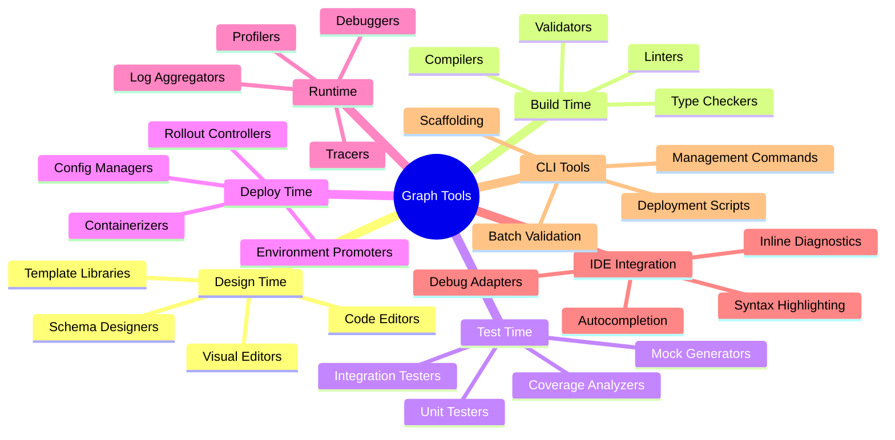
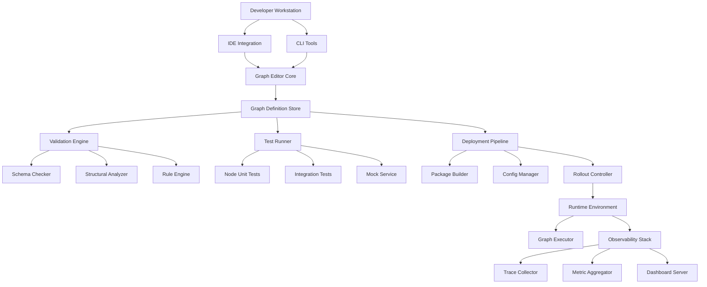
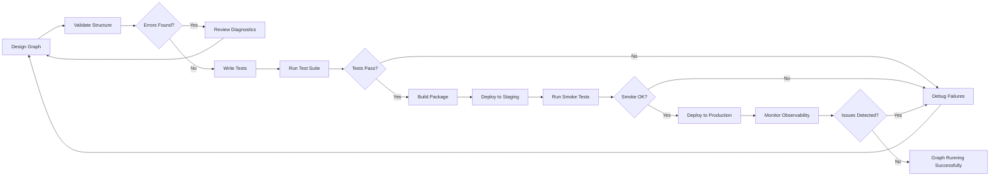
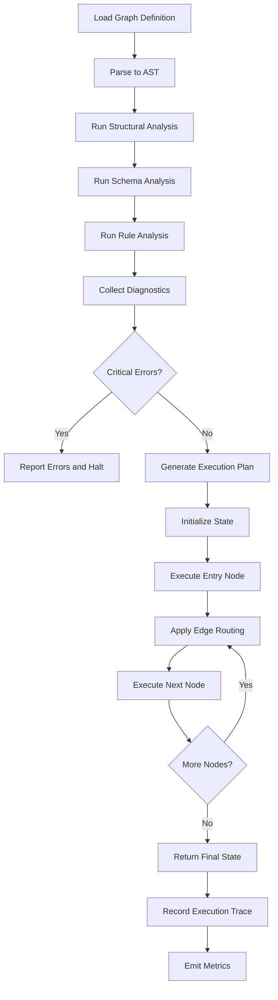
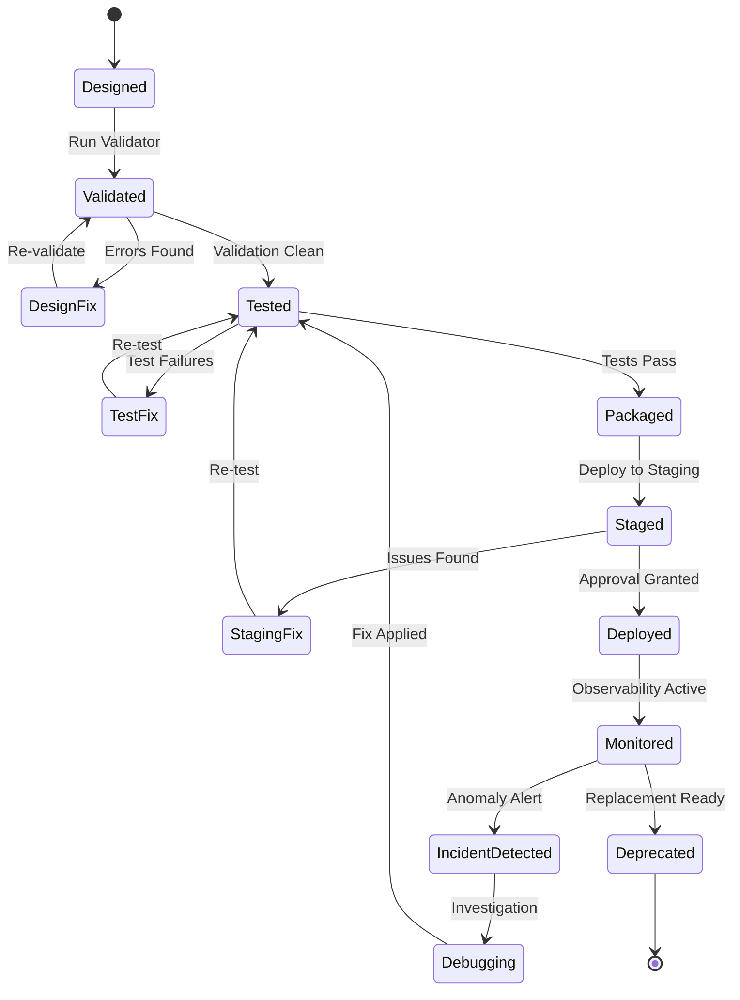
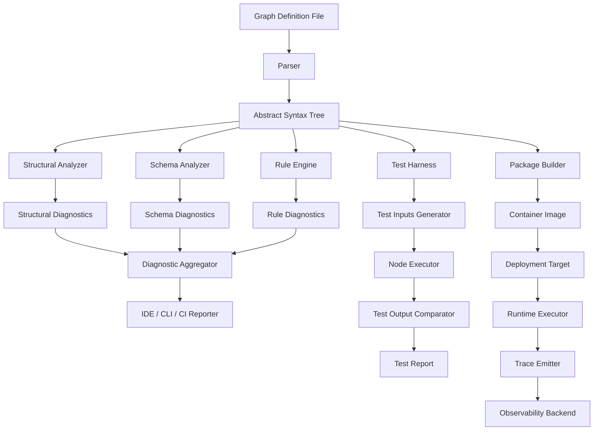
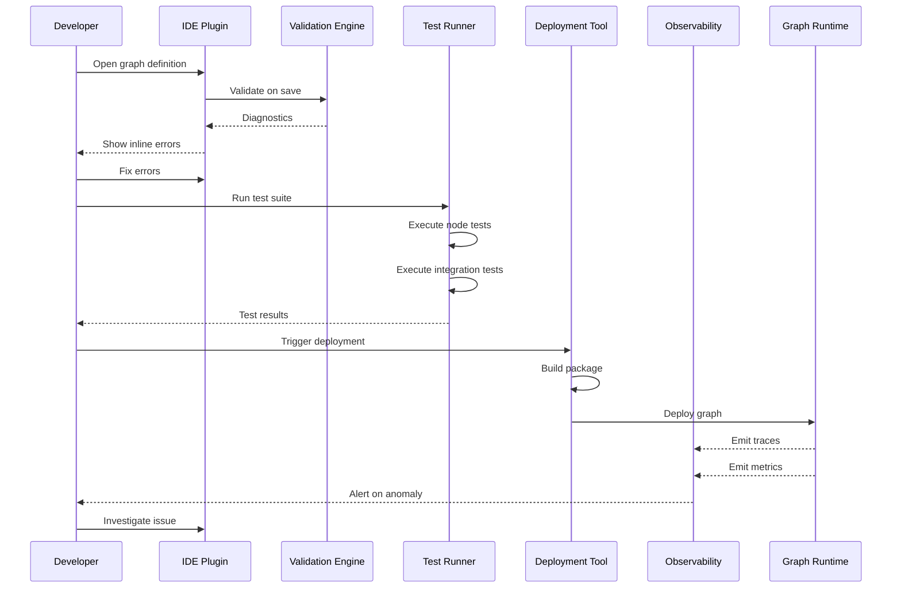

# Graph Tools

## 📌 Overview

Graph tools form the practical backbone of any graph engineering initiative, providing the software utilities, editors, validators, and deployment pipelines that transform abstract graph designs into production-ready AI systems. These tools span the entire graph lifecycle from initial design and prototyping through validation, testing, deployment, and ongoing observability. Without a robust toolchain, graph engineering remains an academic exercise rather than an engineering discipline. Modern graph tools integrate tightly with developer workflows, offering IDE extensions, command-line interfaces, and CI/CD integrations that make graph development feel as natural as writing application code.

The tooling landscape for graph engineering has matured significantly alongside the growth of agentic AI frameworks. Early practitioners relied on ad-hoc scripts and generic diagramming software, but today's ecosystem includes purpose-built graph editors, schema validators, execution simulators, and cloud-native deployment platforms. These tools address the unique challenges of graph-based AI systems, such as validating conditional edge logic, simulating multi-agent interactions, and tracing data flow across complex node networks. A well-chosen toolchain dramatically reduces development time, catches errors before they reach production, and enables teams to collaborate effectively on shared graph definitions.

## 🎯 Learning Objectives

By studying this document, you will understand the full spectrum of tools available for graph engineering and how to select the right combination for your project needs. You will learn to evaluate graph editors based on their support for visual design, schema enforcement, and export capabilities. You will gain proficiency in using graph validation tools that catch structural errors, type mismatches, and unreachable nodes before execution. You will become familiar with testing utilities that enable unit testing of individual nodes and integration testing of complete graph workflows. You will understand deployment tools that package graph definitions into containerized services with proper dependency management. Finally, you will learn how observability tools and IDE integrations create a seamless development experience from design to production monitoring.

## 🧠 Definition

Graph tools are specialized software utilities designed to support the creation, validation, testing, deployment, and monitoring of graph-based AI systems. Unlike general-purpose development tools, these utilities understand the semantics of graph structures — nodes represent processing steps, edges represent data flow or control transitions, and state objects carry context between nodes. This domain awareness allows graph tools to provide intelligent autocompletion, structural validation, and execution simulation that generic editors cannot offer. Graph tools encompass both visual and code-first approaches, catering to different working styles and project requirements.

The term also covers runtime utilities that interact with live graph executions, such as debuggers that can pause execution at specific nodes, tracers that record the complete execution path, and profilers that identify performance bottlenecks. A comprehensive graph toolchain typically includes design-time tools for authoring, build-time tools for validation and compilation, deploy-time tools for packaging and distribution, and runtime tools for observability and debugging. Together, these categories form an integrated ecosystem that supports the entire graph engineering lifecycle.

## ❓ Why It Matters

Graph tools matter because the complexity of graph-based AI systems rapidly exceeds what developers can manage with text editors and manual processes alone. A production graph system might contain dozens of interconnected nodes with conditional routing, parallel execution branches, stateful memory, and external tool integrations. Without dedicated tools, verifying that every node receives the correct input schema, that all edge conditions are mutually exclusive and collectively exhaustive, and that no execution path leads to a deadlock becomes an exercise in manual inspection that is both error-prone and unsustainable at scale.

Furthermore, graph tools enable team collaboration by providing shared artifacts — graph definition files, validation reports, execution traces — that serve as a common language between engineers, designers, and stakeholders. They accelerate onboarding by letting new team members visually explore graph structures rather than reading hundreds of lines of configuration code. Most critically, robust tooling directly impacts production reliability by catching design flaws early, automating regression testing, and providing the observability data needed to diagnose and resolve issues in live systems. Organizations that invest in graph tooling consistently ship more reliable systems faster than those relying on manual processes.

## 🏛️ Core Concepts

The core concepts underlying graph tools revolve around the idea that graph definitions are first-class artifacts that deserve the same engineering rigor as application source code. This means graph definitions should be version-controlled, linted, tested, and deployed through automated pipelines. Tool support for these activities requires understanding graph structure at a semantic level, not merely treating graph files as opaque text. A graph-aware linter can detect unreachable nodes, circular dependencies without termination conditions, and schema incompatibilities between connected nodes. A graph-aware test runner can execute individual nodes in isolation with mocked inputs and verify outputs against expected schemas.

Another core concept is the separation between graph definition and graph execution. Design tools operate on the graph definition — the declarative specification of nodes, edges, and state schemas. Runtime tools operate on graph instances — concrete executions of that definition with specific input data. This separation allows the same graph definition to be tested locally, deployed to staging environments, and run in production without modification. Tools that blur this line, such as visual editors that can execute subgraphs interactively, provide powerful development experiences but must maintain clear boundaries to avoid conflating design-time and runtime concerns.

## 🧩 Key Components

The key components of a graph toolchain can be organized into seven functional categories. **Graph editors** provide interfaces for creating and modifying graph definitions, ranging from visual drag-and-drop canvas tools to code editors with graph-aware syntax highlighting and autocompletion. **Validation tools** parse graph definitions and check for structural integrity, schema compatibility, and adherence to design rules. **Testing utilities** enable writing and executing test cases for individual nodes, subgraphs, and complete graph workflows with assertions on outputs and state transitions. **Deployment tools** package graph definitions with their dependencies into deployable artifacts, manage environment configurations, and handle rollout strategies.

**Observability tools** capture execution traces, performance metrics, and error information from running graph instances, providing dashboards and alerting capabilities. **IDE integrations** embed graph tooling directly into developer environments, offering inline validation, execution debugging, and documentation navigation. **CLI tools** provide scriptable access to all toolchain functions, enabling automation within CI/CD pipelines and shell scripts. Together, these components create an end-to-end tooling experience that supports every phase of the graph engineering lifecycle, from initial design through production operation and continuous improvement.

## 🧭 Mental Model

Think of graph tools as the workshop of a master craftsman building a complex mechanical clock. The graph editor is the workbench where the design takes shape — some craftsmen prefer detailed blueprints (code-first), while others work directly with gears and springs (visual design). The validation tool is the quality inspector who checks that each gear meshes properly with its neighbors before assembly. The testing utility is the test bench where individual mechanisms are exercised in isolation and then as a complete system. The deployment tool is the packaging process that carefully prepares the clock for shipping to its final location. The observability tools are the sensors and gauges that monitor the clock's performance once installed, alerting the owner to any irregularities. Just as no clockmaker can produce reliable timepieces without proper tools, no graph engineer can build robust AI systems without a comprehensive toolchain.

## 🗺️ Mind Map

## 🏗️ Architecture Diagram

## 🔄 Workflow

## ⚙️ Internal Working

The internal working of graph tools begins with parsing the graph definition file, which may be in formats such as JSON, YAML, Python DSL, or a custom graph schema language. The parser produces an abstract syntax tree representing nodes, edges, state schemas, and metadata. This AST is then processed by multiple analysis passes. The structural analysis pass verifies that the graph is well-formed: every edge references valid source and target nodes, conditional edges have complete coverage of possible conditions, and the graph contains no orphaned nodes that are neither reachable from the entry point nor intentionally isolated.

The schema analysis pass checks type compatibility across edges. It verifies that the output schema of each source node is compatible with the input schema of each target node connected by an edge. This includes checking that required fields are present, data types match, and optional fields are handled gracefully. The rule analysis pass evaluates custom rules defined by the engineering team, such as requiring documentation on all nodes, enforcing naming conventions, or mandating error handling edges from every node that performs external calls. Each analysis pass produces a set of diagnostics — errors, warnings, and informational messages — that are presented to the developer through their IDE, CLI, or CI/CD pipeline.

## 🔀 Execution Flow

## 📊 Lifecycle

## 📡 Data Flow

## 🤝 Interaction Flow

## 🌍 Real-World Analogy

Consider graph tools as the equivalent of a modern automotive manufacturing plant. The graph editor is the design studio where engineers use CAD software to design the vehicle's architecture — each component (node) must fit precisely with its connections (edges). The validation tools are the simulation software that runs crash tests digitally, identifying weak points before any physical prototype is built. The testing utilities are the quality assurance lab where individual components are stress-tested and the complete vehicle undergoes endurance testing on a dynamometer. The deployment tools are the logistics system that packages parts, manages supply chains, and coordinates the assembly line across multiple factories. The observability tools are the telemetry systems in production vehicles that report performance data back to engineers for continuous improvement. Just as modern car manufacturing would be impossible without this integrated tooling, building reliable graph-based AI systems at scale requires a comprehensive and well-integrated toolchain.

## 💡 Practical Example

Imagine a team building a customer support automation system using a graph-based architecture with fifteen interconnected nodes handling intent classification, knowledge retrieval, response generation, escalation routing, and follow-up scheduling. The team uses a visual graph editor like LangGraph Studio to design the initial architecture, dragging nodes onto a canvas and connecting them with conditional edges. The editor validates connections in real-time, flagging a missing error-handling edge from the external API call node. The team fixes this and exports the graph definition as a Python file.

They then run the graph validation tool from their CI/CD pipeline, which catches a schema mismatch between the knowledge retrieval node's output and the response generation node's input — a field name was changed during refactoring. After fixing the schema, the test runner executes thirty unit tests covering individual node logic and five integration tests that exercise complete conversation flows. The deployment tool packages the graph with its dependencies into a Docker container, deploys it to a staging environment, and runs smoke tests against a mock customer interaction. Once approved, the rollout controller deploys to production with a canary strategy, directing ten percent of traffic to the new version while the observability dashboard monitors error rates, latency percentiles, and node execution frequencies.

## 🧪 Use Cases

Graph tools serve a wide range of use cases across the graph engineering lifecycle. **Rapid prototyping** leverages visual editors to quickly sketch out graph architectures, validate them interactively, and iterate on designs before committing to production-grade implementations. **Team collaboration** uses shared graph definition repositories with automated validation that prevents broken graphs from being merged, along with visual diff tools that show structural changes between versions in an intuitive format. **Continuous integration** employs CLI validation and testing tools that run on every code commit, ensuring that graph modifications don't introduce regressions or violate design constraints.

**Production debugging** relies on observability tools that capture execution traces, allowing engineers to replay specific conversation flows step by step, inspect the state at each node, and identify exactly where an unexpected behavior originated. **Performance optimization** uses profiling tools that measure execution time, token consumption, and resource utilization at the node level, identifying bottlenecks and suggesting optimizations. **Compliance auditing** leverages trace analysis tools that verify the graph always follows required decision paths, such as ensuring that sensitive data is routed through anonymization nodes before reaching logging systems.

## ⚖️ Comparison

| Tool Category | Visual Editors | Code-First Tools | CLI Tools | Observability Platforms |
|---|---|---|---|---|
| **Primary Users** | Designers, Architects | Engineers, DevOps | Automation, CI/CD | SRE, Platform Teams |
| **Learning Curve** | Low | Medium | Medium-High | High |
| **Flexibility** | Limited | High | High | Medium |
| **Automation** | Low | Medium | Very High | High |
| **Collaboration** | High (shared canvas) | Medium (code review) | Low (individual scripts) | High (shared dashboards) |
| **Best For** | Initial design, stakeholder demos | Production development, testing | CI/CD, bulk operations | Production monitoring, debugging |

The choice between visual and code-first tools depends on team composition and project phase. Visual editors excel during early design and stakeholder communication, while code-first tools provide the precision and automation needed for production development. Most mature teams use both, starting with visual design and transitioning to code for implementation. CLI tools serve as the automation glue that connects all other tools into coherent pipelines.

## ✅ Best Practices

Select a primary graph definition format early and standardize it across the team to ensure tool compatibility. Maintain graph definitions as version-controlled source files, not as binary artifacts exported from visual editors, to enable code review and diff-based change tracking. Integrate graph validation into your pre-commit hooks and CI/CD pipelines so that structural errors are caught immediately, not discovered during deployment. Establish a testing pyramid for graph systems with many fast unit tests for individual nodes, fewer integration tests for critical paths, and a small number of end-to-end tests for complete workflows.

Invest in observability tooling from day one, even for development environments, because the ability to trace graph execution is invaluable for debugging complex routing logic. Configure your IDE integration to provide real-time validation feedback as you edit graph definitions, reducing the feedback loop from minutes to milliseconds. Document your toolchain configuration, including validation rules, test conventions, and deployment procedures, so that new team members can become productive quickly. Finally, regularly evaluate your toolchain against emerging tools in the ecosystem, as the graph engineering tooling landscape is evolving rapidly and newer tools often provide significant productivity improvements.

## ❌ Common Mistakes

A frequent mistake is relying solely on visual editors without maintaining code-based graph definitions, which creates a fragile workflow where changes cannot be reviewed, tested, or deployed through standard engineering practices. Another common error is skipping graph-level validation and relying only on runtime errors to catch structural problems, which leads to failures that could have been prevented during development. Teams often underestimate the importance of observability tools, discovering only after deployment that they cannot diagnose production issues because they have no execution traces or performance metrics.

Many organizations make the mistake of choosing tools based on feature checklists rather than integration capabilities, ending up with a fragmented toolchain where data doesn't flow smoothly between design, testing, and monitoring tools. Using different graph definition formats across tools creates translation problems and version synchronization issues. Failing to automate toolchain operations forces developers to manually run validations, tests, and deployments, introducing human error and slowing down the development cycle. Neglecting CLI tooling limits automation possibilities and makes it impossible to integrate graph engineering into standard CI/CD workflows, ultimately reducing team velocity and system reliability.

## 🚀 Advanced Topics

Advanced graph tooling explores the frontier of AI-assisted graph development, where large language models help design, optimize, and debug graph structures. **AI-powered graph editors** can suggest node additions based on intent descriptions, automatically generate edge routing logic, and recommend architectural improvements by analyzing execution patterns. **Predictive validation** tools use historical execution data to identify potential failure modes before they occur, flagging nodes that are likely to timeout under certain input conditions or edge routes that may lead to infinite loops with specific state combinations.

**Self-documenting graph tools** automatically generate comprehensive documentation from graph definitions and execution traces, producing architectural diagrams, API references, and operational runbooks without manual effort. **Graph diff and merge tools** that understand graph semantics (rather than treating definitions as plain text) enable meaningful code reviews where reviewers see structural changes rather than line-level edits. **Chaos engineering tools** for graph systems deliberately inject failures — node crashes, network partitions, state corruption — to verify that the graph degrades gracefully. **Cross-framework translation tools** can convert graph definitions between frameworks like LangGraph, Temporal, and Prefect, enabling framework-agnostic design and reducing vendor lock-in risk for organizations investing heavily in graph-based architectures.
