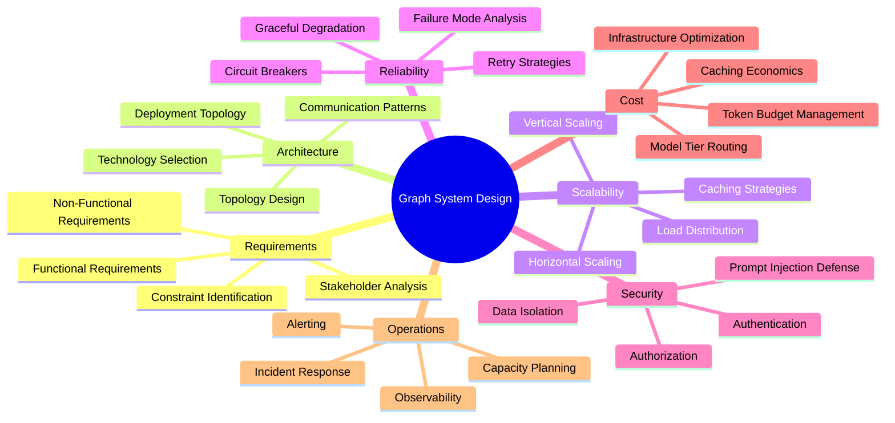
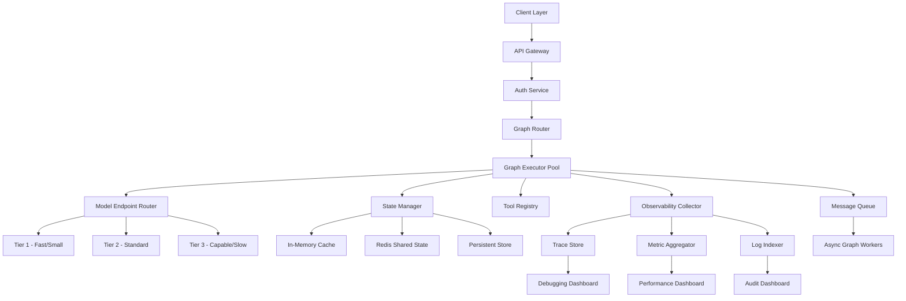
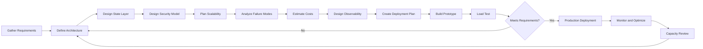
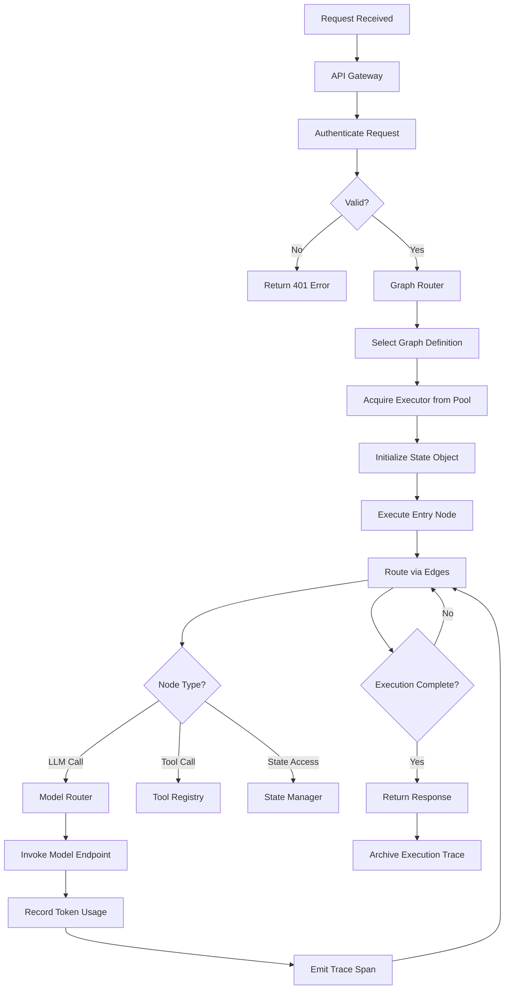
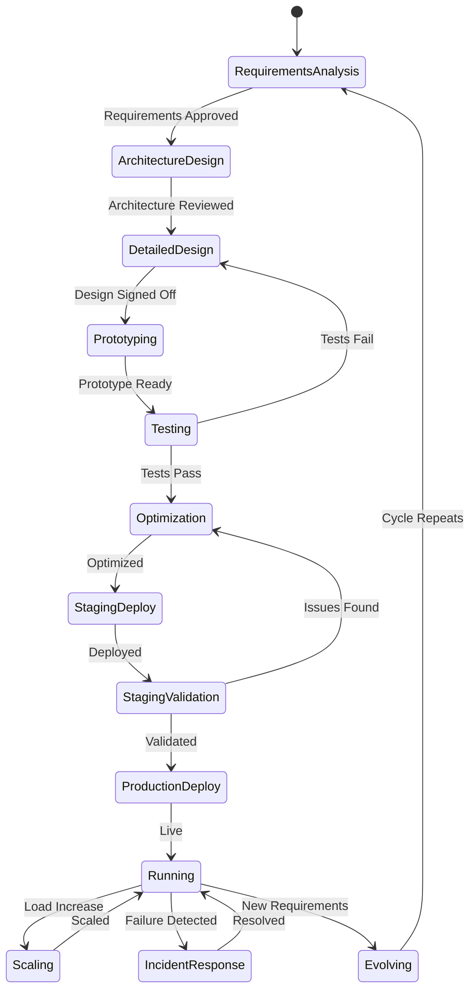
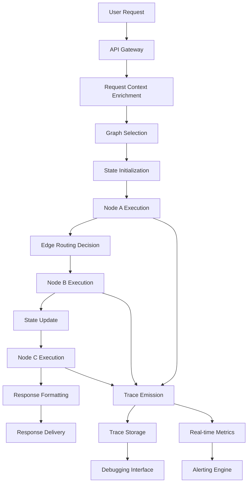
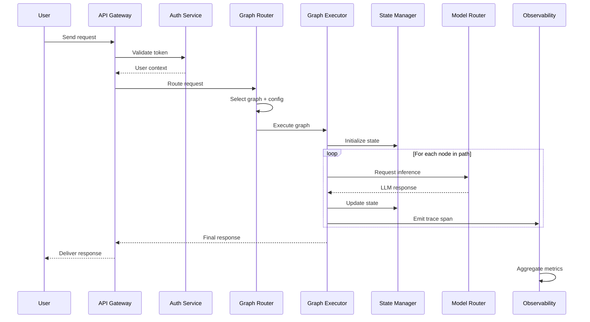

# Graph System Design

## 📌 Overview

Graph system design is the discipline of architecting complete, production-grade AI systems built on interconnected graph-based structures. Unlike designing individual graphs or selecting frameworks, system design addresses the holistic challenge of creating a reliable, scalable, and maintainable system where multiple graph workflows interact with shared state, external services, and human operators. This encompasses requirements analysis, capacity planning, scalability architecture, failure mode analysis, security design, and cost optimization — all applied to the unique characteristics of graph-based AI systems where execution paths are dynamic, state is distributed across nodes, and latency is dominated by LLM inference calls.

A well-designed graph system operates as more than the sum of its individual graphs. It provides shared infrastructure for state management, observability, and configuration that all graphs within the system can leverage. It defines clear boundaries between graphs, specifying how they communicate, share data, and handle failures in each other's execution. System design for graph-based AI requires understanding not only traditional distributed systems concerns like consistency and availability, but also AI-specific concerns like token budget management, model fallback strategies, and the inherent non-determinism of language model outputs. This dual expertise makes graph system design one of the most challenging and rewarding specializations in AI engineering.

## 🎯 Learning Objectives

By studying this document, you will develop the ability to analyze requirements for graph-based AI systems and translate business needs into technical specifications. You will learn to perform capacity planning that accounts for the variable compute demands of LLM-based graph nodes. You will understand how to design for scalability using horizontal scaling, graph partitioning, and execution caching strategies. You will master failure mode analysis techniques specific to graph systems, including handling LLM timeouts, partial state corruption, and cascading failures across interconnected graphs. You will gain expertise in designing security boundaries that protect sensitive data as it flows through graph nodes and edges. Finally, you will learn cost optimization strategies that balance quality, latency, and expenditure across the entire system.

## 🧠 Definition

Graph system design is the comprehensive architectural practice of planning, structuring, and specifying a complete AI system composed of one or more graph-based workflows, their supporting infrastructure, and their operational requirements. It encompasses the high-level architecture that determines how graphs are organized, deployed, and interconnected; the infrastructure layer that provides shared services like state stores, message queues, and model endpoints; and the operational layer that defines monitoring, alerting, and incident response procedures. A graph system design document typically specifies the system's functional requirements, non-functional requirements, architectural decisions, deployment topology, data flow patterns, and failure handling strategies.

The definition distinguishes between graph design — the structure and logic of individual graphs — and graph system design — the architecture that supports multiple graphs operating together in production. While graph design focuses on nodes, edges, and state within a single workflow, system design addresses cross-cutting concerns like authentication, authorization, rate limiting, resource isolation, and operational observability at the system level. This distinction is crucial because many failures in production graph systems stem not from incorrect graph logic but from inadequate system-level design around the graphs.

## ❓ Why It Matters

Graph system design matters because the gap between a working prototype and a production system is vast, and most of that gap is bridged by system design decisions. A graph that works perfectly in a developer's environment may fail catastrophically under production load because the system wasn't designed to handle concurrent executions, the state store wasn't configured for the required throughput, or the security model didn't account for multi-tenant data isolation. These are system-level failures that cannot be fixed by modifying graph definitions alone.

Furthermore, the economic implications of system design are enormous. LLM inference is expensive, and a poorly designed graph system can burn through token budgets rapidly through redundant model calls, excessive context passing, and inefficient caching strategies. Good system design can reduce costs by thirty to fifty percent through intelligent caching, model routing, and parallel execution optimization. Security design is equally critical — graph systems that process user data must ensure that sensitive information doesn't leak between tenants, that prompt injection attacks can't compromise system integrity, and that audit trails capture every decision point for compliance requirements. Organizations that invest in thorough system design consistently deliver more reliable, secure, and cost-effective AI systems.

## 🏛️ Core Concepts

The core concepts of graph system design revolve around treating the graph-based AI system as a distributed system with unique characteristics. **Graph topology design** determines how multiple graphs relate to each other — whether they are independent, sequential, hierarchical, or meshed. This topology affects communication patterns, failure propagation, and deployment flexibility. **State architecture** defines how state is managed across the system, including whether state is local to each graph execution, shared across related executions, or globally accessible. The choice between these approaches involves fundamental trade-offs between consistency, performance, and complexity.

**Capacity modeling** is the practice of estimating the computational, memory, and network resources required to serve expected workloads, accounting for the high variability of LLM-based processing. A single graph execution might require anywhere from a few hundred to hundreds of thousands of tokens depending on input complexity and routing decisions. **Failure domain isolation** ensures that failures in one part of the system don't cascade to unrelated components, achieved through circuit breakers, bulkheads, and graceful degradation patterns. **Cost architecture** aligns system design decisions with budget constraints by routing requests to appropriate model tiers, implementing aggressive caching, and designing graphs to minimize unnecessary LLM calls while maintaining output quality.

## 🧩 Key Components

A complete graph system design comprises several key components working in concert. **The graph layer** contains all graph definitions organized by domain or function, with clear interfaces between graphs and shared libraries for common node types. **The infrastructure layer** provides the runtime environment including compute resources for graph execution, model endpoints for LLM inference, vector databases for retrieval, and message queues for asynchronous communication between graphs. **The state management layer** implements the chosen state architecture, whether using in-memory stores for short-lived state, Redis for shared state, or persistent databases for long-term state retention.

**The security layer** implements authentication and authorization for all system interfaces, data encryption for sensitive state, prompt injection detection and mitigation, and audit logging for compliance. **The observability layer** collects execution traces, performance metrics, and error information from all graph executions, providing dashboards, alerting, and debugging capabilities. **The configuration layer** manages environment-specific settings, feature flags, and runtime parameters that control graph behavior without code changes. **The deployment layer** handles packaging, versioning, rolling updates, and rollback capabilities for the entire system. Each layer must be designed not in isolation but in consideration of its interactions with every other layer, as decisions in one layer often constrain options in others.

## 🧭 Mental Model

Think of designing a graph system as designing a city. Individual graphs are like buildings — each has its own internal structure, purpose, and occupants. But a city is far more than a collection of buildings. It needs roads (communication channels) that connect buildings efficiently, utilities (infrastructure services) that provide water and power to all buildings, zoning regulations (security boundaries) that prevent incompatible activities from interfering with each other, and a transportation authority (orchestration layer) that manages traffic flow across the entire city. When a building catches fire (a failure), firewalls and emergency services (failure handling) prevent the fire from spreading to neighboring buildings. The city planner (system designer) must anticipate growth (scalability), plan for disasters (failure mode analysis), and manage the budget (cost optimization) that funds all of these services. Just as a well-planned city functions smoothly even as it grows, a well-designed graph system maintains reliability and performance as its workload and complexity increase.

## 🗺️ Mind Map

## 🏗️ Architecture Diagram

## 🔄 Workflow

## ⚙️ Internal Working

The internal working of a graph system begins with request intake at the API gateway, where incoming requests are authenticated and routed to the appropriate graph based on request type and system configuration. The graph router examines the request and determines which graph definition to execute, considering factors such as the user's subscription tier, the complexity of the request, and current system load. Once a graph is selected, the executor initializes a fresh state object and begins executing nodes according to the graph's edge routing logic.

As each node executes, it may invoke LLM model endpoints through the model router, which selects the appropriate model tier based on the node's quality requirements and the system's current cost budget. Nodes may also access shared state through the state manager, which provides consistent read and write access across the distributed execution environment. The observability collector captures detailed information about every node execution, including input/output data, execution duration, token consumption, and any errors encountered. For long-running or resource-intensive operations, the system may offload work to asynchronous graph workers through the message queue, allowing the synchronous request path to return quickly while background processing continues. The entire execution is governed by a timeout budget and a token budget, with the system taking corrective action when either budget approaches its limit.

## 🔀 Execution Flow

## 📊 Lifecycle

## 📡 Data Flow

## 🤝 Interaction Flow

## 🌍 Real-World Analogy

Designing a graph system is analogous to designing a large hospital. The hospital has many departments (graphs) — emergency, surgery, radiology, pharmacy — each with its own internal workflows but all connected through shared patient records (state), a central scheduling system (orchestration), and common utilities like oxygen supply and power backup (infrastructure). When a patient arrives (request), they are triaged (routed) to the appropriate department based on their condition. The emergency department might need to quickly consult radiology (cross-graph communication) and order medication from pharmacy (tool invocation). The hospital must be designed for peak capacity (scalability), with surge plans for mass casualty events (failure mode handling). Patient confidentiality must be maintained across all departments (security). Every treatment decision must be documented for legal and medical review (audit trails). And the entire operation must be financially sustainable (cost optimization). A hospital that excels at individual department procedures but fails at system-level coordination will provide poor patient care, just as a graph system with well-designed individual graphs but poor system design will deliver unreliable AI services.

## 💡 Practical Example

Consider designing a multi-tenant customer support platform where each tenant has a customized support graph with their own knowledge base, escalation rules, and brand voice. The system design begins with requirements analysis identifying that the platform must support five hundred tenants, handle ten thousand concurrent conversations, maintain sub-second response times for routing decisions, and isolate tenant data completely. The architecture design chooses a microservices approach where each graph execution runs in an isolated container, with a shared model endpoint layer that routes requests based on tenant-specified model preferences and budget constraints.

State management uses a multi-level architecture: hot state in Redis for active conversations, warm state in a database for recent conversations, and cold storage for archival. Security design implements tenant-aware encryption keys, prompt injection detection at the API gateway, and row-level security in the state database. Scalability is achieved through horizontal auto-scaling of graph executor pods, with a priority queue that ensures premium tenants receive preferential resource allocation during peak load. Failure mode analysis identifies that LLM endpoint outages are the highest-impact failure and designs a tiered fallback strategy: try the primary model, fall back to a smaller model with quality degradation warnings, and ultimately serve a cached response if all models are unavailable. Cost optimization implements token caching for frequently asked questions, reducing model calls by approximately forty percent while maintaining response quality.

## 🧪 Use Cases

Graph system design is critical in several high-stakes scenarios. **Enterprise AI platforms** that serve multiple business units require careful multi-tenant isolation, shared infrastructure management, and cross-team governance to prevent one team's graph from impacting another's performance. **Real-time decision systems** such as fraud detection or autonomous trading demand system designs that minimize latency through edge computing, model pre-warming, and state pre-loading strategies. **Regulated industries** including healthcare, finance, and legal services require system designs that incorporate comprehensive audit trails, data lineage tracking, and compliance reporting capabilities into every graph execution.

**High-availability consumer applications** like AI-powered customer service need system designs that handle traffic spikes gracefully through auto-scaling, request queuing, and graceful degradation when under extreme load. **Multi-model systems** that combine specialized models for different tasks require a model orchestration layer that manages model endpoints, handles failover between model providers, and optimizes cost by routing each request to the most cost-effective model that meets quality requirements. **Research and experimentation platforms** need system designs that support A/B testing of different graph configurations, canary deployments, and rapid iteration without impacting production stability.

## ⚖️ Comparison

| Design Dimension | Monolithic Graph System | Microservice Graph System | Serverless Graph System |
|---|---|---|---|
| **Deployment** | Single deployable unit | Multiple independent services | Function-per-node or function-per-graph |
| **Scaling** | Vertical only | Horizontal per service | Automatic per function invocation |
| **Isolation** | Shared process | Process isolation | Full isolation |
| **Complexity** | Low | Medium-High | Medium |
| **Cost at Low Load** | High (always running) | Medium | Low (pay-per-invocation) |
| **Cost at High Load** | Low (efficient) | Medium | High (per-invocation overhead) |
| **Debugging** | Straightforward | Requires distributed tracing | Challenging due to cold starts |
| **Best For** | Simple, predictable workloads | Complex, evolving systems | Variable, bursty workloads |

The choice between these architectures depends on the system's scale, variability, and operational maturity. Most organizations start with a monolithic approach and evolve toward microservices or serverless as their scale and complexity grow.

## ✅ Best Practices

Begin every graph system design with a thorough requirements analysis that explicitly captures both functional requirements (what the system must do) and non-functional requirements (how well it must do it), paying special attention to latency budgets, availability targets, and cost constraints. Design for failure from the start by identifying the most likely failure modes — LLM endpoint outages, state store failures, network partitions — and ensuring the system degrades gracefully rather than failing catastrophically. Implement circuit breakers between all external dependencies to prevent cascading failures from propagating through the graph system.

Adopt a layered architecture that separates concerns clearly, making it possible to modify one layer without impacting others. Use capacity planning models that account for the high variability of LLM-based processing, designing for peak loads that are three to five times average loads. Implement comprehensive observability from day one, including distributed tracing, metric collection, and structured logging, because you cannot debug or optimize a system you cannot observe. Establish clear cost allocation and budgeting mechanisms that attribute costs to specific tenants, graphs, and node types, enabling data-driven optimization decisions. Finally, document all architectural decisions and their rationale in an Architecture Decision Record (ADR) format, ensuring that future engineers understand why the system is designed the way it is.

## ❌ Common Mistakes

A pervasive mistake is designing for the happy path only, without considering how the system behaves when LLM calls return malformed outputs, when state stores experience latency spikes, or when concurrent executions create race conditions on shared state. Another common error is over-architecting the initial system, building a distributed microservices architecture when a monolithic design would suffice, adding unnecessary complexity that slows development and increases operational burden. Teams frequently underestimate the impact of LLM latency on system design, failing to account for the seconds-to-tens-of-seconds response times that are normal for language model inference.

Many system designs neglect multi-tenancy concerns until late in development, when retrofitting data isolation and resource quotas becomes expensive and error-prone. Organizations often design cost optimization as an afterthought, discovering only after deployment that their token consumption is orders of magnitude higher than anticipated because graphs make redundant LLM calls or pass excessive context. Failing to design for observability means that when production issues inevitably occur, the team lacks the tracing and metric data needed to diagnose them, leading to prolonged outages and customer impact. Perhaps the most damaging mistake is treating the initial system design as fixed rather than iterative, missing opportunities to improve the architecture based on production usage patterns and performance data.

## 🚀 Advanced Topics

Advanced graph system design explores cutting-edge patterns for building next-generation AI systems. **Adaptive graph routing** uses machine learning to dynamically select graph configurations based on incoming request characteristics, routing simple requests through lightweight graphs and complex requests through comprehensive analysis graphs, optimizing both quality and cost in real-time. **Federated graph systems** allow multiple organizations to collaborate on shared AI workflows while maintaining strict data isolation, with each organization executing its portion of the graph locally and only sharing aggregated results.

**Self-healing graph systems** incorporate automated failure detection and recovery, where the system can dynamically reconfigure graph topologies to route around failed nodes, switch to alternative model providers, and adjust execution strategies without human intervention. **Graph-native infrastructure** represents the emerging trend of building cloud infrastructure specifically optimized for graph-based AI workloads, with specialized hardware for LLM inference, graph-aware load balancers that understand node execution semantics, and state stores optimized for the access patterns of graph workflows. **Economic optimization engines** use real-time pricing data from multiple model providers to dynamically route inference requests to the most cost-effective endpoint that meets quality requirements, potentially saving significant costs in systems that process millions of requests daily. **Composable graph systems** enable runtime graph assembly, where pre-built graph components are dynamically composed into custom workflows based on user requests, pushing the boundaries of what graph-based AI systems can achieve.