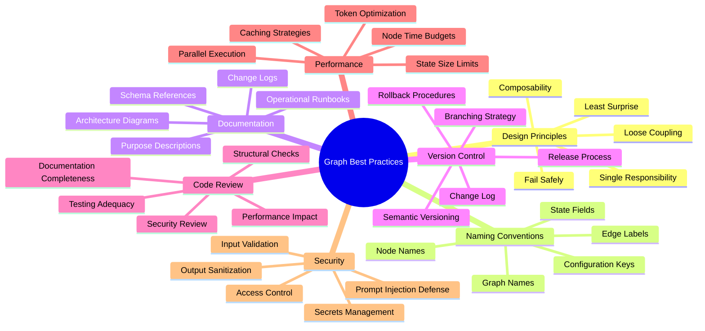
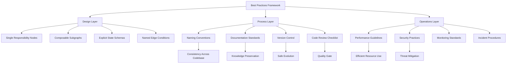
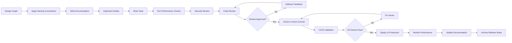
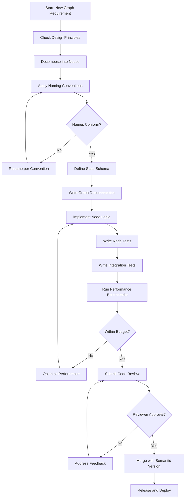
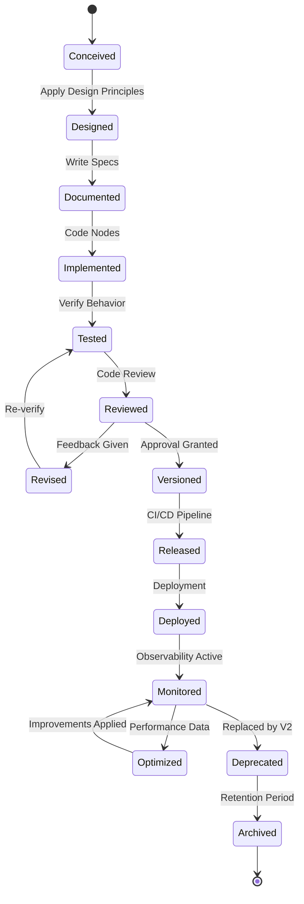
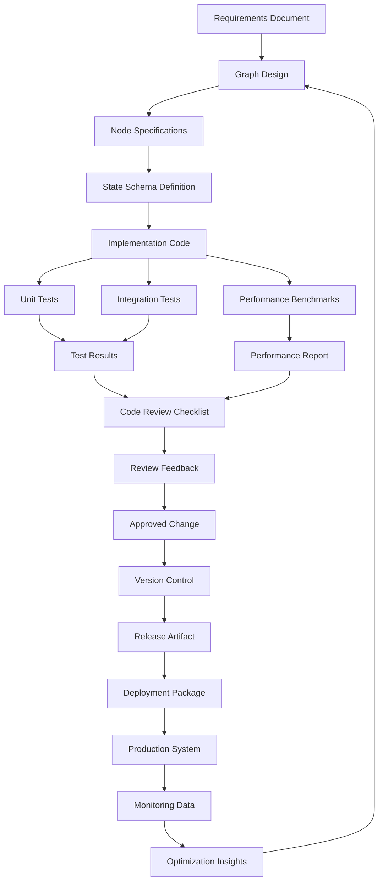
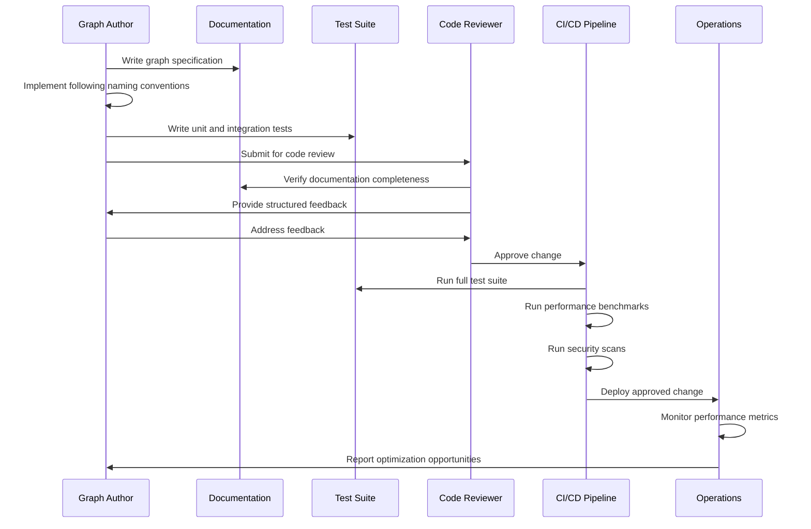

# Graph Best Practices

## 📌 Overview

Graph best practices represent the distilled wisdom of engineering teams who have built, deployed, and maintained graph-based AI systems at scale. These practices encompass design principles that guide architectural decisions, naming conventions that ensure consistency across large codebases, documentation standards that make complex graph systems understandable, version control strategies that manage graph evolution safely, code review processes that catch design flaws before deployment, performance guidelines that optimize resource utilization, and security practices that protect systems and data. Following these best practices transforms graph engineering from an ad-hoc craft into a disciplined engineering practice with predictable quality outcomes.

The practices presented here are not rigid rules but informed guidelines that must be adapted to each team's specific context. A startup building its first graph system will prioritize different practices than an enterprise with hundreds of production graphs serving millions of users. However, certain fundamentals — such as clear naming, comprehensive documentation, and systematic version control — are universally valuable regardless of scale. The goal of these best practices is to prevent the most common failure modes observed in production graph systems, accelerate onboarding of new team members, and create a shared vocabulary that enables effective communication about graph design decisions.

## 🎯 Learning Objectives

By studying this document, you will internalize a comprehensive set of best practices covering every aspect of graph engineering. You will learn design principles that promote graph simplicity, composability, and maintainability. You will understand naming conventions that make graph definitions self-documenting and easy to navigate in large codebases. You will master documentation standards that capture architectural intent, operational procedures, and troubleshooting guides. You will learn version control strategies for graph definitions that support safe evolution, collaborative development, and reliable rollback capabilities. You will understand code review practices specific to graph systems that catch structural flaws, security vulnerabilities, and performance anti-patterns. Finally, you will learn performance and security guidelines that ensure your graph systems operate efficiently and safely in production environments.

## 🧠 Definition

Graph best practices are a codified set of principles, conventions, and procedures established through collective experience in designing, building, and operating graph-based AI systems. They represent proven approaches to recurring challenges such as managing graph complexity, ensuring consistent quality, facilitating team collaboration, and maintaining system reliability over time. Unlike algorithms or patterns that can be mechanically applied, best practices require judgment to adapt to specific contexts while preserving their core intent. They span multiple categories including structural design principles (how graphs should be organized), process conventions (how teams should work with graphs), and operational guidelines (how graphs should be deployed and monitored).

The definition emphasizes that best practices are living standards that evolve with the field. As new graph frameworks emerge, as LLM capabilities change, and as production experience accumulates, best practices are refined and extended. What constituted a best practice two years ago — such as using a single large graph for all operations — may now be an anti-pattern given the availability of better composition and orchestration tools. Teams should treat their best practices documentation as a living document that is regularly reviewed and updated based on production experience and evolving industry knowledge.

## ❓ Why It Matters

Best practices matter because graph engineering is sufficiently complex that individual intuition alone cannot consistently produce reliable, maintainable systems. Without established practices, every team must independently discover the same lessons — often through painful production failures — that other teams have already learned. This reinvention wastes time, introduces unnecessary risk, and creates inconsistent systems that are difficult to transfer between teams. Best practices provide a shared foundation that allows teams to build on collective experience rather than repeating past mistakes.

The cost of ignoring best practices compounds over time. A graph that is slightly unclear in its naming today becomes completely opaque after six months of modifications by multiple developers. A missing piece of documentation that seems unimportant during initial development becomes a critical gap during a production incident at three in the morning. A version control shortcut that saves five minutes today causes hours of painful debugging when a bad change must be rolled back. Organizations that invest in establishing and following best practices consistently report faster development cycles, fewer production incidents, easier onboarding, and more effective collaboration between team members. The initial investment in establishing practices pays exponential returns as the system and team grow.

## 🏛️ Core Concepts

The core concepts underlying graph best practices center on three pillars: clarity, safety, and evolution. **Clarity** means that every aspect of a graph system should be immediately understandable to any qualified engineer. This requires consistent naming that reveals intent, documentation that explains reasoning, and structure that follows predictable patterns. A clear graph system is one where a new team member can understand any graph's purpose and behavior within minutes of reading its definition, not hours of tracing execution paths and inferring behavior from code.

**Safety** means that changes to graph systems are made with minimal risk of introducing regressions or failures. This requires version control practices that enable safe experimentation and reliable rollback, code review processes that catch errors before deployment, and testing strategies that verify behavior at multiple levels of granularity. A safe graph system is one where engineers can make changes with confidence, knowing that automated safeguards will catch most errors and that rollback is always available as a last resort. **Evolution** means that the graph system is designed to change over time, accommodating new requirements, new tools, and new understanding without requiring complete rewrites. This requires composability, loose coupling between components, and abstractions that can be refined without breaking existing behavior.

## 🧩 Key Components

The key components of graph best practices can be organized into seven domains. **Design principles** include single responsibility for nodes, loose coupling between graph components, and the principle of least surprise for behavior. **Naming conventions** cover graph names, node names, edge labels, state field names, and configuration keys, ensuring consistency and self-documentation across the entire codebase. **Documentation standards** specify what must be documented for each graph, including purpose descriptions, input/output schemas, state diagrams, and operational runbooks.

**Version control practices** define how graph definitions are stored, branched, merged, and released, including conventions for semantic versioning and change log requirements. **Code review guidelines** specify what reviewers should check in graph change requests, including structural integrity, security implications, performance impact, and documentation completeness. **Performance guidelines** establish expectations for node execution time, token consumption, state size, and graph depth, along with optimization techniques for meeting these targets. **Security practices** cover input validation, output sanitization, prompt injection prevention, secrets management, and access control patterns specific to graph-based AI systems. Together, these seven domains provide comprehensive coverage of the engineering practices needed to build reliable graph systems.

## 🧭 Mental Model

Think of graph best practices as the building codes and professional standards used by architects and construction engineers. Just as building codes specify minimum standards for structural integrity, fire safety, and accessibility — while allowing architects creative freedom within those constraints — graph best practices define the minimum standards for reliability, maintainability, and security while allowing engineers to design creative solutions to their specific problems. A building that violates fire codes might stand for years before a fire reveals its fatal flaw; similarly, a graph system that violates best practices might work fine until a specific combination of inputs exposes its weaknesses. Professional architects don't view building codes as restrictions on their creativity but as guardrails that ensure their creative designs are safe and durable. Similarly, skilled graph engineers view best practices not as limitations but as the foundation upon which innovative and reliable systems are built.

## 🗺️ Mind Map

## 🏗️ Architecture Diagram

## 🔄 Workflow

## ⚙️ Internal Working

The internal working of best practices implementation begins with the design phase, where engineers apply design principles to decompose the problem into well-scoped nodes with clear responsibilities. Each node receives a name following the established naming convention — typically a verb-noun pattern that describes both its action and its domain, such as "classify_intent" or "retrieve_knowledge." Edge conditions are given explicit, descriptive names rather than generic labels like "yes" and "no," making the graph's routing logic immediately readable without examining implementation details.

During implementation, engineers document each node's purpose, expected inputs, produced outputs, and any side effects using the team's standardized documentation template. They write tests that verify both individual node behavior and critical graph-level execution paths. Before submitting for code review, they run automated performance checks that measure node execution time against established budgets and flag any node that exceeds its time or token allocation. The code review process follows a structured checklist that reviewers use to systematically evaluate the change, checking structural integrity, naming consistency, documentation completeness, test coverage, security implications, and performance impact. Once approved, the change is committed with a conventional commit message that references the graph and nodes affected, enabling automated change log generation and easy historical navigation.

## 🔀 Execution Flow

## 📊 Lifecycle

## 📡 Data Flow

## 🤝 Interaction Flow

## 🌍 Real-World Analogy

Graph best practices are analogous to the professional standards followed by commercial airline maintenance crews. Every maintenance action follows documented procedures, every part is labeled with standard nomenclature, every change is recorded in a logbook, and every repair is inspected by a second certified technician before an aircraft returns to service. These practices exist not because the technicians lack skill, but because the consequences of even minor errors are catastrophic. Similarly, graph best practices exist not because engineers lack ability, but because graph-based AI systems operate in environments where failures impact real users and real businesses. The aviation industry has learned through decades of experience that procedural discipline, not individual brilliance, is what produces reliable outcomes at scale. The graph engineering community is undergoing the same maturation, learning that systematic practices produce more reliable systems than heroic individual efforts, no matter how talented the engineers involved.

## 💡 Practical Example

Consider a team building a content analysis pipeline as a graph system. Following best practices, they name their main graph "content_analysis_pipeline" and each node with descriptive verb-noun pairs: "extract_text," "detect_language," "classify_topic," "extract_entities," "assess_sentiment," and "generate_summary." Edge conditions use descriptive names like "text_extracted," "language_supported," and "analysis_complete" rather than generic labels. Each node's documentation includes its purpose, expected input schema, output schema, token budget, and known limitations.

The state schema is defined explicitly as a typed object with fields for raw_content, extracted_text, language_code, topic_classification, entities, sentiment_score, and summary. Version control follows semantic versioning with conventional commit messages like "feat(analysis): add custom entity extraction node" and "fix(classification): handle empty text input gracefully." Code reviews follow a checklist that includes verifying node naming conventions, checking state schema compatibility across edges, ensuring tests cover error conditions, and confirming documentation is updated. Performance guidelines specify that each node must complete within five seconds and consume no more than two thousand tokens, with caching implemented for the language detection node since it's called frequently with repeated inputs. Security practices ensure that all content is sanitized before being included in LLM prompts, preventing prompt injection through malicious content.

## 🧪 Use Cases

Graph best practices apply across a wide range of scenarios. **Team onboarding** benefits enormously from established naming conventions and documentation standards, allowing new engineers to understand existing graphs quickly without requiring extensive口头 explanation from senior team members. **Cross-team collaboration** relies on shared conventions that make graph definitions from different teams immediately understandable, enabling effective code reviews and knowledge sharing across organizational boundaries. **Regulatory compliance** requires the documentation standards and audit trails that best practices mandate, providing evidence of design decisions and testing rigor to auditors and regulators.

**Production incident response** is dramatically faster when systems follow documentation and monitoring best practices, as engineers can quickly locate the relevant graph definitions, understand the expected behavior, and identify the deviation that caused the incident. **System evolution** is smoother when version control and code review practices are consistently followed, as every change is traceable and every design decision is documented. **Performance optimization** is more systematic when performance guidelines establish clear budgets and measurement procedures, enabling data-driven optimization rather than guesswork. **Security auditing** is more effective when security practices are standardized, as auditors can verify compliance against a clear set of expectations rather than evaluating each graph on an ad-hoc basis.

## ⚖️ Comparison

| Practice Domain | Without Best Practices | With Best Practices |
|---|---|---|
| **Node Naming** | Inconsistent, ambiguous names like "process1", "handler" | Descriptive names like "classify_customer_intent" |
| **Documentation** | Scattered, outdated, or missing | Standardized, version-controlled, auto-validated |
| **Version Control** | Flat history, no semantic versioning | Structured commits, semantic versions, changelogs |
| **Code Review** | Ad-hoc, inconsistent feedback | Checklist-driven, comprehensive evaluation |
| **Performance** | Discovered in production | Proactively measured against budgets |
| **Security** | Addressed reactively after incidents | Designed in from the start |
| **Onboarding** | Weeks of tribal knowledge transfer | Hours of reading standardized docs |
| **Incident Response** | Hunting through code to understand behavior | Consulting clear documentation and traces |

The comparison clearly shows that the investment in establishing and following best practices pays dividends across every dimension of engineering effectiveness, from development speed to production reliability to team scalability.

## ✅ Best Practices

**Design Principles:** Assign each node a single, well-defined responsibility. If a node does more than one thing, split it. Design edges with explicit, named conditions rather than relying on implicit behavior. Keep state schemas minimal and typed, including only the fields that nodes actually need. Design for composability by building small, reusable subgraphs that can be combined into larger workflows. Ensure every graph has a clear entry point and a defined termination condition, including maximum iteration limits for loops.

**Naming Conventions:** Use verb-noun patterns for node names that describe both action and domain. Prefix graph files with a domain identifier and number for easy sorting. Name edge conditions as complete phrases that describe the routing decision. Use consistent, lowercase_snake_case for all identifiers. Avoid abbreviations unless they are universally understood within your team. Name state fields descriptically, avoiding generic terms like "data" or "result." Prefix configuration keys with the graph or node name to prevent collisions.

**Documentation:** Document every graph's purpose, expected inputs, and outputs at the top of its definition file. Maintain an architecture overview document that shows how graphs relate to each other. Include a troubleshooting section in operational documentation that covers common failure modes and their resolutions. Keep documentation co-located with code so it stays synchronized during changes. Use automated tools to validate that documentation is present and complete.

**Version Control:** Store graph definitions as text files in version control, never as binary artifacts. Use semantic versioning for graph releases. Write conventional commit messages that reference the affected graph and nodes. Maintain a change log that summarizes user-facing changes in each version. Use feature branches for developing new graphs or significant modifications.

**Code Review:** Require at least one approval for every graph change. Use a standardized review checklist covering structure, naming, documentation, testing, performance, and security. Verify that edge conditions are mutually exclusive and collectively exhaustive. Check that state schema changes are backward compatible or explicitly versioned. Ensure error handling covers all identified failure modes.

**Performance:** Establish time budgets for each node and monitor compliance. Implement caching for deterministic nodes with repeated inputs. Minimize context size passed between nodes by including only necessary state fields. Use streaming where possible to reduce perceived latency. Profile regularly to identify and address performance regressions.

**Security:** Validate and sanitize all external inputs before including them in prompts. Never log raw user input that may contain sensitive data. Implement rate limiting at the graph level to prevent abuse. Use environment variables or secret managers for all credentials, never hardcode them. Review prompt templates for injection vulnerabilities during code review. Implement output filtering to prevent sensitive data leakage in LLM responses.

## ❌ Common Mistakes

The most pervasive mistake is treating best practices as optional guidelines rather than required standards, allowing individual engineers to follow their own preferences and creating inconsistent systems that are difficult to maintain. Another common error is establishing practices but not enforcing them, leading to a gradual erosion of standards as shortcuts accumulate over time. Teams frequently create comprehensive documentation for initial graph designs but fail to maintain it as the system evolves, resulting in documentation that becomes increasingly misleading.

Many organizations make the mistake of over-prescribing practices, creating lengthy rulebooks that are too burdensome to follow, leading to widespread non-compliance. The most effective approach is to define a small set of non-negotiable practices and a larger set of recommended practices, allowing teams to adopt the recommended practices incrementally. Another common error is measuring adherence to practices through manual review rather than automated enforcement, creating a tax on reviewers without ensuring consistent compliance. Implementing automated linting, validation, and documentation checks as part of the CI/CD pipeline is far more effective than relying on human reviewers to catch violations.

## 🚀 Advanced Topics

Advanced best practices explore the frontier of graph engineering maturity. **Practice automation** uses AI to automatically enforce and improve best practices, with tools that can detect naming violations, suggest documentation improvements, and identify potential security issues during code review. **Metrics-driven practice evolution** measures the impact of each practice on system quality, team velocity, and incident frequency, using data to refine practices based on evidence rather than opinion. **Cross-organizational practice sharing** establishes communities of practice where teams from different organizations share their evolving best practices, accelerating the collective learning of the graph engineering community.

**Practice-as-code** encodes best practices as executable rules that can be automatically checked, enforced, and updated alongside the graph definitions they govern, eliminating the gap between documented standards and actual practice. **Adaptive practices** adjust their stringency based on risk and context, applying stricter standards to customer-facing graphs and more relaxed standards to internal tools, optimizing the trade-off between engineering rigor and development speed. **Practice maturity models** provide a structured framework for assessing an organization's current practice adoption and planning a roadmap for improvement, helping teams evolve from ad-hoc practices through defined, managed, and optimized stages of maturity.