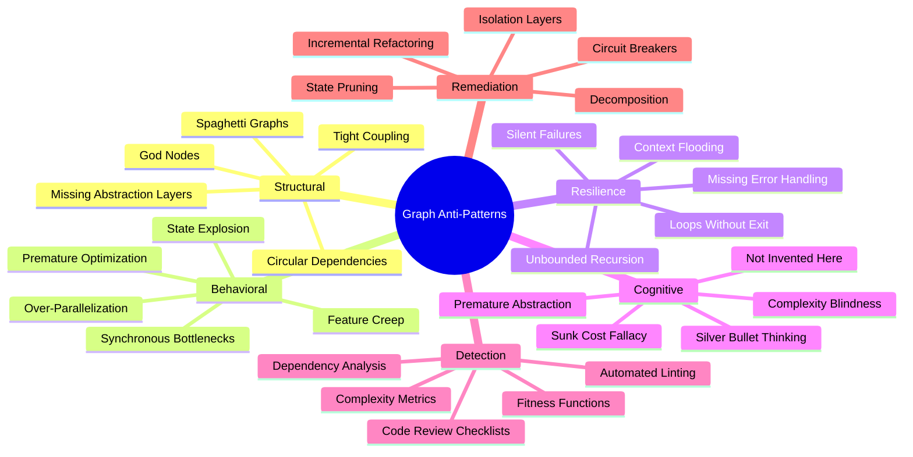
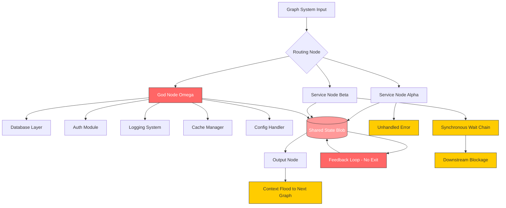
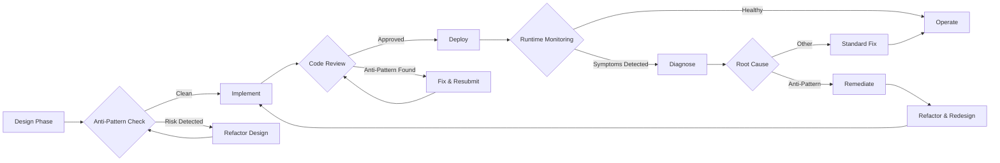
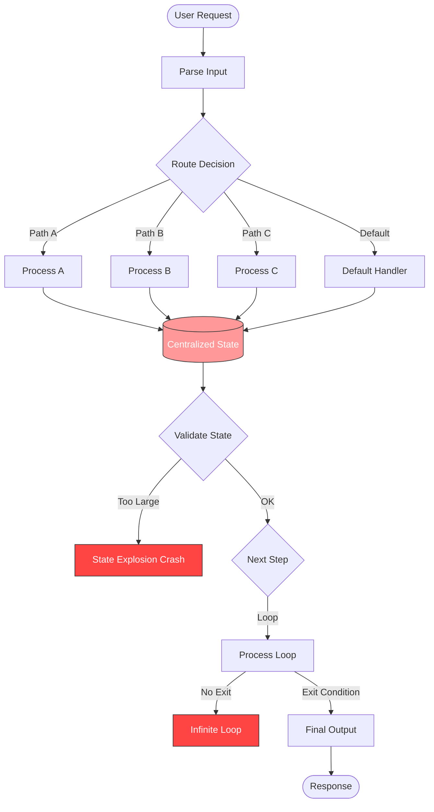
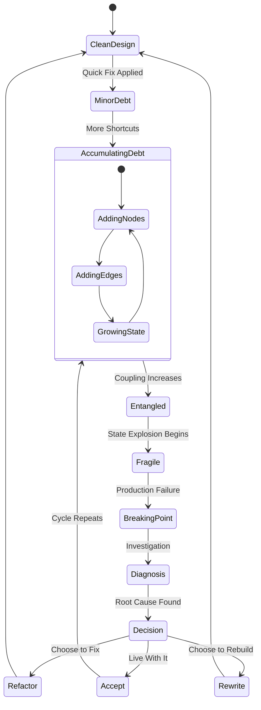
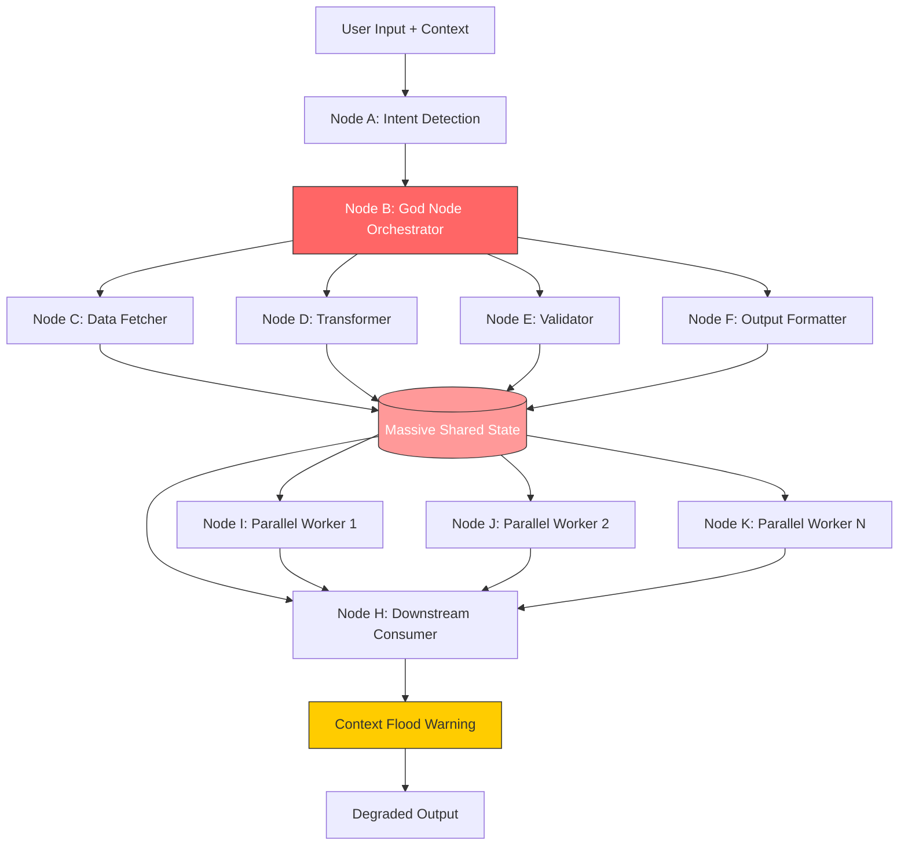
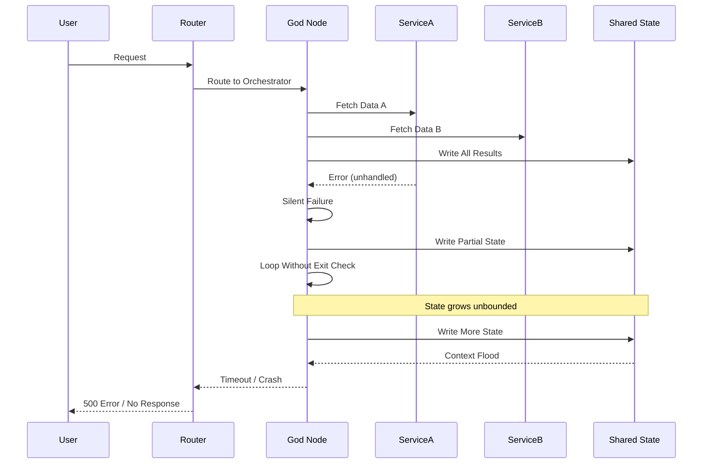

# Graph Anti-Patterns

## 📌 Overview

Graph anti-patterns represent the most common and destructive mistakes that engineers make when designing, building, and maintaining graph-based AI systems. These anti-patterns emerge from a combination of natural cognitive biases — such as the tendency to add complexity incrementally without restructuring — and the inherent difficulty of reasoning about interconnected systems with shared state and asynchronous execution. Understanding these anti-patterns is not merely an academic exercise; it is a practical necessity that separates teams that build reliable, maintainable graph systems from those that create fragile monoliths that collapse under the weight of their own complexity. Every experienced graph engineer has scars from at least one of these anti-patterns, and the most effective way to avoid them is to study their anatomy and recognize their early warning signs.

The anti-patterns covered in this document range from structural mistakes like spaghetti graphs and god nodes, to behavioral mistakes like state explosion and over-parallelization, to resilience mistakes like missing error handling and synchronous bottlenecks. Each anti-pattern follows a predictable lifecycle: it begins as a seemingly reasonable design decision or a convenient shortcut, grows silently as the system evolves, and eventually manifests as a critical failure that is expensive and time-consuming to fix. The key insight is that these anti-patterns are far cheaper to prevent than to cure. By learning to recognize them early and applying corrective refactoring before they become entrenched, teams can save enormous amounts of time and avoid the most painful failures in their graph systems.

## 🎯 Learning Objectives

By studying this document, you will develop the ability to identify and diagnose the most prevalent anti-patterns in graph-based AI systems. You will learn to recognize structural anti-patterns such as spaghetti graphs, god nodes, and tight coupling by examining graph topology, node responsibilities, and interconnection density. You will understand behavioral anti-patterns like state explosion, over-parallelization, and synchronous bottlenecks by analyzing execution patterns, resource utilization, and throughput characteristics. You will learn resilience anti-patterns including missing error handling, context flooding, and loops without exit conditions by studying failure modes, debugging complexity, and resource consumption patterns. You will master specific refactoring strategies for each anti-pattern, including decomposition techniques for god nodes, isolation strategies for tight coupling, and checkpoint mechanisms for state explosion. Finally, you will develop the preventive mindset needed to catch these anti-patterns early, using code review checklists, automated linting rules, and architectural fitness functions that flag potential anti-patterns before they become deeply embedded in production systems.

## 🧠 Definition

Graph anti-patterns are recurring design and implementation mistakes in graph-based AI systems that produce predictable negative consequences. Unlike simple bugs that can be fixed with a code change, anti-patterns are structural problems embedded in the fundamental design of a graph system. They represent solutions that appear reasonable in isolation but interact badly with the system's growth trajectory, operational demands, or failure modes. An anti-pattern is distinguished from a genuine pattern by its outcomes: patterns produce systems that become easier to maintain and extend over time, while anti-patterns produce systems that become progressively harder to understand, modify, and operate as they grow. The term encompasses both the mistaken design choice itself and the systemic consequences that flow from that choice.

Anti-patterns in graph engineering are particularly insidious because graph systems exhibit emergent behaviors that are difficult to predict from examining individual nodes or edges in isolation. A seemingly reasonable decision to add one more edge between two nodes, or to consolidate state management into a single centralized node, can create cascade failures, performance degradation, or debugging nightmares that only manifest under specific conditions. The definition of an anti-pattern in this context includes not just the structural mistake but also the social and organizational factors that enable it, such as time pressure that discourages refactoring, team silos that prevent holistic review, and insufficient testing that allows problems to accumulate unnoticed until they become too expensive to fix.

## ❓ Why It Matters

Anti-patterns matter because they are the primary cause of production failures, development slowdowns, and team burnout in graph-based AI systems. Teams that fail to recognize and address anti-patterns find themselves spending an ever-increasing fraction of their time on firefighting and debugging rather than on building new features and improving system quality. The cost of ignoring anti-patterns compounds exponentially: a spaghetti graph that takes twice as long to debug today will take four times as long to debug after the next round of feature additions, and eight times as long after that. Eventually, the system becomes so complex that the only option is a complete rewrite, losing years of accumulated domain knowledge and business logic in the process.

Beyond the direct costs of debugging and rewriting, anti-patterns erode team confidence and institutional knowledge. When a graph system behaves unpredictably — producing different outputs for seemingly identical inputs, or failing in ways that no one can explain — engineers lose trust in the system and become reluctant to make changes. This reluctance leads to workaround culture, where new features are bolted onto the existing broken structure rather than properly integrated, which in turn makes the anti-patterns worse. Breaking this vicious cycle requires deliberate effort to identify existing anti-patterns, refactor them using proven techniques, and establish practices that prevent their recurrence. Organizations that invest in anti-pattern awareness and prevention consistently report faster development, fewer incidents, higher team morale, and more predictable system behavior.

## 🏛️ Core Concepts

The core concepts underlying graph anti-patterns revolve around the tension between simplicity and capability. Every graph system starts with a clear purpose and a straightforward structure, but as requirements grow, the temptation to add complexity without restructuring becomes overwhelming. The first core concept is **complexity creep**, which describes the gradual accumulation of nodes, edges, and state that makes a graph increasingly difficult to understand and modify. Complexity creep is insidious because each individual addition seems reasonable in context — adding one more tool call, one more conditional branch, one more state field — but the cumulative effect is a system whose behavior no one can fully predict or explain.

The second core concept is **coupling density**, which measures how tightly interconnected the components of a graph system are. High coupling density means that changes to one node or edge have ripple effects across the entire graph, making modifications risky and testing expensive. The third core concept is **state entropy**, which describes the tendency of shared state in graph systems to grow in size and complexity over time until it becomes impossible to reason about. The fourth core concept is **execution opacity**, which occurs when a graph's execution path becomes so complex and data-dependent that no human can reliably predict which path a given input will take. Together, these four concepts provide a framework for understanding why anti-patterns emerge and how they progressively degrade the quality and maintainability of graph systems.

## 🧩 Key Components

The key components of graph anti-patterns can be organized into four categories: structural, behavioral, resilience, and cognitive. **Structural anti-patterns** include spaghetti graphs (excessively interconnected nodes with no clear organization), god nodes (single nodes that accumulate too many responsibilities), and tight coupling (nodes that depend on each other's internal state rather than communicating through well-defined interfaces). These structural mistakes create graphs that are difficult to understand, modify, and test because changes in one area have unpredictable effects throughout the system.

**Behavioral anti-patterns** include state explosion (state objects that grow without bound as a graph executes), over-parallelization (forking too many concurrent execution paths that compete for resources and create coordination overhead), and synchronous bottlenecks (sequential operations that force the entire graph to wait for a single slow step). These behavioral mistakes create graphs that perform poorly, consume excessive resources, and fail to scale with increasing load. **Resilience anti-patterns** include missing error handling (nodes that assume success and propagate failures unpredictably), context flooding (overwhelming downstream nodes with excessive context data), and loops without exit conditions (cycles that can execute indefinitely under certain inputs). These resilience mistakes create graphs that are fragile, produce unpredictable failures, and are extremely difficult to debug. **Cognitive anti-patterns** include the sunk cost fallacy (continuing to invest in a broken architecture because of prior investment) and the not-invented-here syndrome (reinventing solutions that already exist as established patterns).

## 🧭 Mental Model

Think of graph anti-patterns as structural diseases in a building's architecture. A spaghetti graph is like a building with randomly placed doors connecting every room to every other room — it works, but no one can navigate it efficiently and adding a new room requires modifying dozens of existing doorways. A god node is like a single room in a building that contains the kitchen, bathroom, bedroom, office, and garage all at once — it technically houses all functions, but it is impossible to use efficiently or modify without disrupting everything else. Tight coupling is like load-bearing walls that also contain plumbing, electrical wiring, and HVAC ducts — you cannot modify any one system without risking collapse of the others. Just as a building inspector catches structural problems before they become dangerous, a graph engineer must learn to spot anti-patterns before they become system-threatening. The earlier an anti-pattern is caught, the cheaper it is to fix; a few extra support beams during construction costs almost nothing, but reinforcing a failing wall after the building is occupied requires evacuation, scaffolding, and major reconstruction.

## 🗺️ Mind Map

## 🏗️ Architecture Diagram

## 🔄 Workflow

## ⚙️ Internal Working

Understanding how anti-patterns develop internally requires examining the step-by-step process through which a well-designed graph gradually degrades into a problematic one. In the initial design phase, a graph typically has clear node responsibilities, well-defined edges, and minimal shared state. Each node does one thing well, and edges represent clear data flows with explicit schemas. At this stage, the graph is easy to understand, test, and modify. The first signs of anti-pattern emergence usually appear when a new requirement forces a change that violates the original design principles. For example, a requirement to add authentication to an existing graph might tempt an engineer to add authentication logic directly to an existing node rather than creating a dedicated authentication subgraph, creating the seed of a god node.

As more requirements accumulate, the pressure to take shortcuts intensifies. Adding one more responsibility to an already-busy node seems faster than creating a new node and refactoring the connections. Sharing state between nodes via a growing global state object seems simpler than defining clean interfaces with explicit data contracts. Adding conditional branches to handle edge cases seems more straightforward than creating a separate error-handling subgraph. Each of these decisions is locally optimal but globally harmful, and the harm compounds with each iteration. The state object grows, the god node accumulates responsibilities, the edges multiply, and the execution paths become increasingly data-dependent and unpredictable. By the time the anti-patterns are severe enough to cause visible problems — production failures, debugging nightmares, or feature development paralysis — the cost of fixing them has grown to the point where teams often choose to live with the problems rather than invest in the major refactoring required.

## 🔀 Execution Flow

## 📊 Lifecycle

## 📡 Data Flow

## 🤝 Interaction Flow

## 🌍 Real-World Analogy

Consider a restaurant kitchen as a graph system where each station is a node and the flow of dishes between stations represents edges. A well-designed kitchen has clear stations: prep, grill, sauté, pastry, plating, and expediter. Each station has a defined role, and dishes flow between stations in a predictable path. An anti-pattern-ridden kitchen, by contrast, has the expediter also doing prep work, grilling, and pastry — this is the god node anti-pattern. The walk-in refrigerator is accessible from every station, and every chef adds ingredients to a single communal pot — this is state explosion and tight coupling. The expediter sends every dish to every station simultaneously "just in case" — this is over-parallelization. There is no system for handling burnt dishes or missing ingredients — this is missing error handling. When a special order arrives, the entire kitchen stops and everyone crowds around one station to figure it out — this is a synchronous bottleneck. The result is a kitchen that technically produces food but does so unpredictably, slowly, and with constant errors. Fixing it requires re-establishing clear stations, defined handoff protocols, and proper error handling — exactly the same refactoring needed in a graph system.

## 💡 Practical Example

Imagine a customer support graph system designed to handle incoming support tickets. Initially, it has four nodes: a classifier that categorizes tickets, a router that sends them to the appropriate team, a response generator, and a quality checker. This clean design works well for the first few months. As the product grows, new requirements emerge: tickets need authentication checks, responses need to reference the customer's purchase history, and support agents need to be notified via Slack. Each requirement is added by modifying existing nodes rather than creating new ones. The classifier node grows to include authentication logic, the router accumulates purchase history lookups, and the quality checker gains Slack notification capabilities.

After a year, the system has become a textbook example of multiple anti-patterns simultaneously. The router has become a god node with eight different responsibilities, connected to twelve other nodes in a spider-web of edges — a spaghetti graph. The shared state object has grown from three fields to forty-seven fields as every node dumps its intermediate results into a common pool — state explosion. When a ticket takes an unusual path through the system, there is no error handling at many nodes, so failures propagate silently until the final output is nonsensical — missing error handling. The quality checker runs synchronously after every response, and its Slack API calls frequently time out, blocking the entire pipeline — a synchronous bottleneck. A retry loop that was added to handle transient Slack failures has no maximum retry count — a loop without exit condition. When all these anti-patterns align under peak load, the system cascades into failure, producing no responses for thirty minutes while engineers frantically debug a system whose behavior they can no longer predict.

## 🧪 Use Cases

Graph anti-patterns manifest across a wide range of use cases in AI system development. **In conversational AI agents**, spaghetti graphs appear when the intent handling logic becomes a deeply nested set of conditional branches that no developer fully understands. God nodes emerge when a single "orchestrator" node accumulates all decision-making authority, making it impossible to update one behavior without risking regression in others. Context flooding occurs when every turn of a long conversation is appended to the context without pruning, eventually exceeding the model's effective context window and degrading response quality.

**In multi-agent systems**, tight coupling appears when agents communicate through shared global state rather than message passing, creating race conditions and unpredictable behavior. Over-parallelization occurs when a coordinator dispatches tasks to all available agents simultaneously without considering resource constraints, causing contention and degraded throughput. **In content generation pipelines**, state explosion manifests when intermediate drafts, metadata, feedback signals, and revision histories are all stored in a single growing state object. Loops without exit conditions appear in iterative refinement loops where the quality threshold is set too high, causing the system to endlessly regenerate content that never quite meets the impossible standard. **In research and analysis systems**, synchronous bottlenecks appear when a critical information retrieval step must complete before any downstream analysis can begin, creating a single point of failure that blocks the entire pipeline when the retrieval service is slow or unavailable.

## ⚖️ Comparison

| Anti-Pattern | Symptoms | Detection Method | Remediation Effort |
|---|---|---|---|
| Spaghetti Graph | Hard to trace execution paths; changes cause unexpected side effects | Edge density analysis; cyclomatic complexity metrics | High — requires architectural refactoring |
| God Node | Single node with 200+ lines; frequent modifications; test failures | Node responsibility count; change frequency analysis | High — requires decomposition into subgraphs |
| Tight Coupling | Changes in one node break others; difficult to test in isolation | Dependency graph analysis; coupling metrics | Medium — requires interface extraction |
| State Explosion | Memory grows linearly with execution time; performance degrades | State size monitoring; growth rate tracking | Medium — requires state partitioning and pruning |
| Over-Parallelization | Resource contention; coordination overhead exceeds task time | Thread utilization metrics; queue length monitoring | Low — requires parallelism tuning |
| Synchronous Bottleneck | Throughput limited by slowest node; queue buildup | Latency profiling; queue depth monitoring | Low — requires async conversion |
| Missing Error Handling | Silent failures; unpredictable outputs; hard to debug | Error propagation analysis; failure injection testing | Medium — requires systematic error handling |
| Context Flooding | Quality degrades with long sessions; high token costs | Token consumption tracking; quality scoring | Medium — requires context management strategy |
| Loop Without Exit | System hangs; infinite execution; resource exhaustion | Timeout monitoring; loop iteration counting | Low — requires guard condition addition |

## ✅ Best Practices

The best defense against graph anti-patterns is a combination of preventive design practices, automated detection tools, and regular refactoring discipline. **Design defensively** by establishing clear node responsibilities before writing any code, using the single responsibility principle as a hard constraint rather than a soft suggestion. Every node should have a one-sentence description of its purpose, and if that sentence requires the word "and," the node should be decomposed. **Implement interfaces between all nodes** rather than allowing direct state access. Well-defined interfaces with explicit input and output schemas create natural boundaries that prevent tight coupling and make testing straightforward.

**Monitor graph health continuously** using automated metrics that detect anti-patterns as they emerge. Track node complexity (number of conditional branches, number of edge connections), state growth rate, execution path diversity, and error propagation patterns. Set alerts when metrics exceed thresholds that indicate anti-pattern formation. **Conduct regular graph reviews** analogous to code reviews but focused on structural quality rather than correctness. Use checklists that specifically target known anti-patterns: Does any node have more than five outgoing edges? Does any state object have more than twenty fields? Does any loop lack a maximum iteration count? **Refactor incrementally** rather than waiting for a crisis. Schedule regular refactoring sprints where the sole objective is simplifying graph structure, reducing coupling, and eliminating accumulated complexity. Teams that practice continuous refactoring report that each session takes less time and produces greater benefits, while teams that defer refactoring eventually face sessions so large and risky that they are practically impossible to complete.

## ❌ Common Mistakes

The most common mistake in addressing graph anti-patterns is treating symptoms rather than root causes. When a god node causes reliability problems, a common mistake is to add more error handling to the god node rather than decomposing it into smaller, focused nodes. This makes the god node even larger and more complex, creating a temporary improvement in reliability while making the underlying problem worse. Similarly, when state explosion causes performance degradation, a common mistake is to add caching or pagination to the state access patterns rather than partitioning the state into smaller, domain-specific state objects that can be managed independently.

Another common mistake is the all-or-nothing approach to refactoring. Teams recognize that their graph has anti-patterns and attempt a complete rewrite from scratch, discarding years of working logic and domain knowledge. This approach almost always fails because the new system must replicate all the subtle behavioral nuances of the old system that were never documented, and the rewrite takes far longer than expected. The correct approach is incremental refactoring: extract one node at a time, add proper interfaces, redirect traffic gradually, and validate at each step. A third common mistake is failing to establish anti-pattern detection as an ongoing practice rather than a one-time audit. Anti-patterns emerge continuously as systems evolve, and a one-time cleanup without ongoing vigilance merely resets the clock on the same problems recurring.

## 🚀 Advanced Topics

Advanced anti-pattern analysis extends beyond individual anti-patterns to study their interactions and cascading effects. **Anti-pattern compounds** occur when multiple anti-patterns reinforce each other, creating a system whose problems are worse than the sum of their parts. For example, a god node combined with state explosion creates a system where the most complex node also manages the largest state object, making both problems harder to diagnose and fix. A spaghetti graph combined with missing error handling creates a system where failures propagate along unpredictable paths, making debugging extraordinarily difficult. Recognizing these compound anti-patterns requires system-level analysis rather than node-level inspection.

**Graph fitness functions** represent an advanced technique for preventing anti-patterns by encoding structural quality requirements as automated tests that fail when the graph violates them. A fitness function might assert that no node has more than five outgoing edges, that no state object exceeds a defined size limit, or that every loop has a maximum iteration count defined in its configuration. These fitness functions run as part of the CI/CD pipeline, preventing anti-patterns from being introduced in the first place. **Architectural decision records (ADRs)** provide a lightweight mechanism for documenting the reasoning behind design decisions, including why certain anti-patterns were accepted as intentional trade-offs. When a team decides to accept a god node temporarily to meet a deadline, the ADR captures that decision, its rationale, and a planned remediation date, ensuring the temporary compromise does not become permanent. **Graph complexity metrics** such as cognitive complexity, fan-out/fan-in ratios, and state coupling coefficients provide quantitative measures that enable teams to track structural quality over time and compare designs objectively during code reviews.
