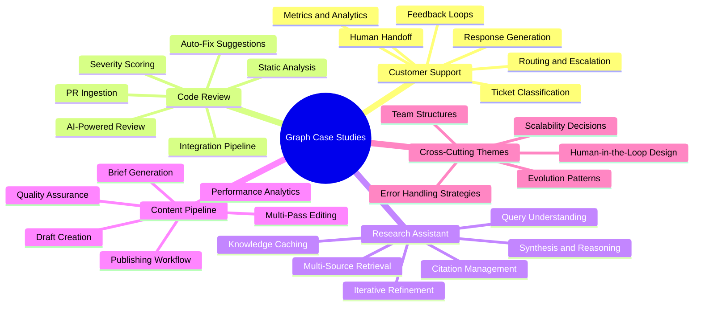
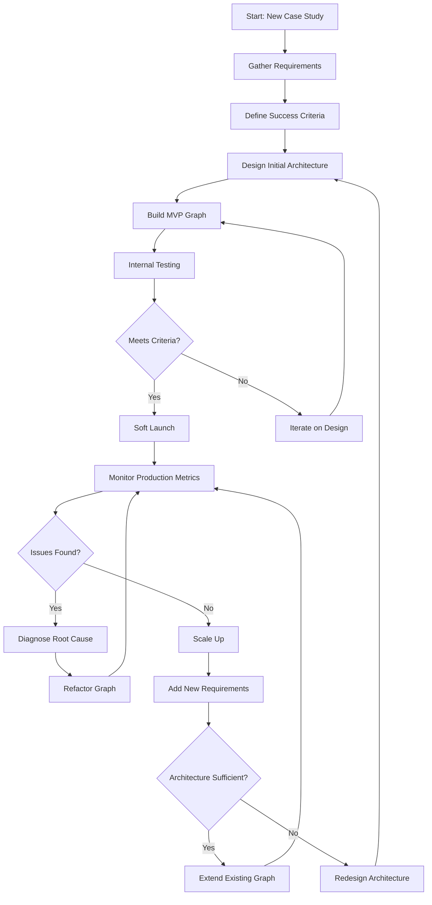
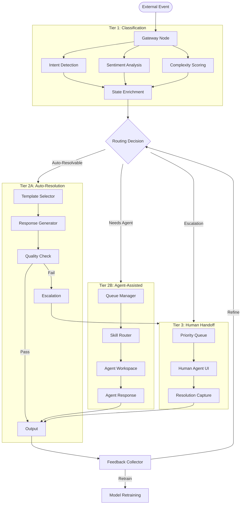
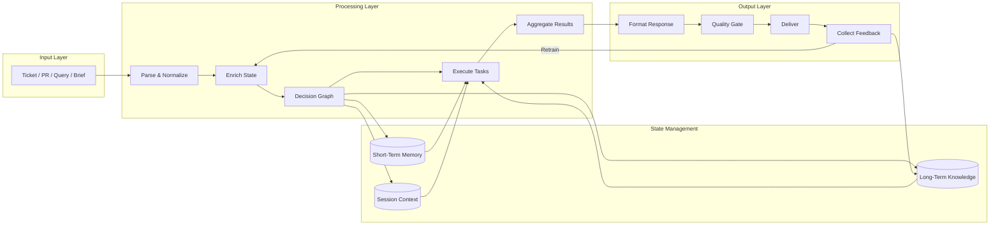
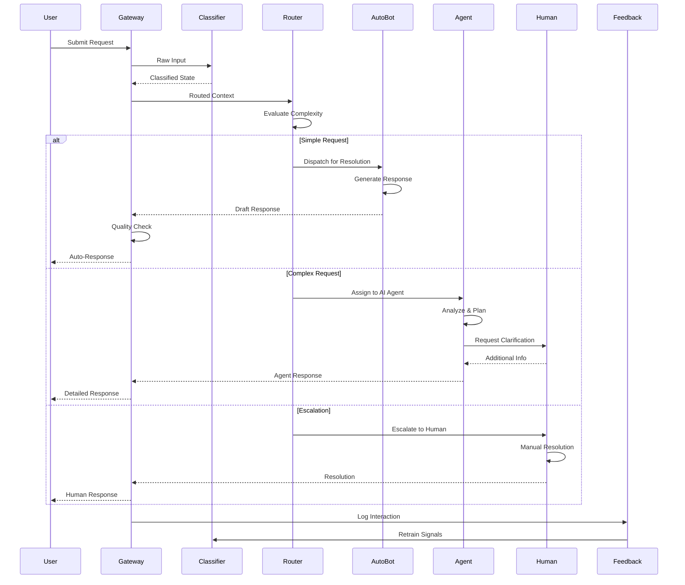

# Graph Case Studies

## 📌 Overview

Graph case studies provide detailed examinations of real-world graph-based AI systems that have been designed, deployed, and operated at production scale. These case studies bridge the gap between theoretical best practices and the messy reality of building systems that must handle unpredictable inputs, evolving requirements, and the inevitable surprises that emerge when complex interconnected systems meet real users. Each case study in this document represents a complete journey from initial concept through architecture decisions, implementation challenges, operational learning, and ongoing evolution. The systems examined here — customer support automation, automated code review, research assistant platforms, and content generation pipelines — were chosen because they represent distinct architectural patterns that illustrate different graph engineering trade-offs and lessons learned.

The value of case studies lies in their specificity and honesty. Unlike sanitized tutorials that present clean designs without the benefit of hindsight, these case studies include the missteps, dead ends, and unexpected problems that every real project encounters. They document not just what the final architecture looks like but how it arrived at that form through multiple iterations of design, implementation, and feedback. Each case study examines the initial requirements and constraints that shaped the design, the architectural decisions that proved critical to success (and those that later needed revision), the operational challenges that emerged in production, and the evolution of the system over time as requirements changed and the team's understanding deepened. By studying these complete journeys, engineers can develop realistic expectations about the challenges of building production graph systems and a repertoire of proven approaches for addressing them.

## 🎯 Learning Objectives

By studying this document, you will gain practical insight into how graph-based AI systems are designed and evolved in real production environments. You will learn how a customer support graph system was designed to handle millions of tickets with graceful degradation and human escalation paths. You will understand the architectural decisions behind an automated code review system that processes pull requests through a multi-stage analysis pipeline. You will examine a research assistant platform that combines retrieval, reasoning, and synthesis in an iterative graph structure that adapts to query complexity. You will analyze a content generation pipeline that manages the tension between creative quality and production throughput using a graph of interconnected refinement stages. For each case study, you will identify the key architectural decisions that determined success, the specific challenges encountered during development and operation, the solutions that proved effective, and the lessons that can be applied to your own graph engineering projects.

## 🧠 Definition

A graph case study is a detailed, narrative examination of a specific graph-based AI system that documents its complete lifecycle from conception through production operation and ongoing evolution. Unlike architectural patterns that abstract away specific details to present generalizable solutions, case studies preserve the full specificity of a system's context — including its requirements, constraints, team composition, timeline pressures, and technological choices — because these contextual factors profoundly shape which solutions are viable and which trade-offs are acceptable. A well-constructed case study serves as both a reference example that engineers can consult when facing similar challenges and a source of vicarious experience that accelerates learning beyond what any single engineer could accumulate through personal projects alone.

Case studies in graph engineering encompass several dimensions beyond mere technical description. They include the decision-making process that led to the chosen architecture, capturing not just what was built but why it was built that way and what alternatives were considered and rejected. They document the operational reality of running the system, including failure modes that were not anticipated during design, performance characteristics that differed from expectations, and user behaviors that revealed incorrect assumptions. They trace the evolution of the system over time, showing how the architecture adapted to new requirements and how early design decisions either enabled or constrained that evolution. Most importantly, they capture the lessons learned by the team — insights about what worked, what did not work, and what the team would do differently with the benefit of hindsight.

## ❓ Why It Matters

Case studies matter because graph engineering is fundamentally an experiential discipline where theoretical knowledge alone is insufficient for building reliable production systems. An engineer who understands every graph pattern and anti-pattern in theory will still make avoidable mistakes when confronting the ambiguities, trade-offs, and time pressures of a real project. Case studies compress years of hard-won experience into a readable format, allowing engineers to learn from the successes and failures of others without paying the cost of those failures personally. They reveal the nuances that textbooks cannot capture, such as how the choice of state management strategy affected debuggability, or how a particular graph topology handled unexpected input patterns.

The practical impact of case study knowledge is substantial. Teams that systematically study relevant case studies before beginning a new project consistently make better architectural decisions, avoid common pitfalls, and arrive at working systems faster than teams that rely solely on abstract principles and personal intuition. Case studies also provide a shared vocabulary for discussing design trade-offs within teams. When a team faces a decision about whether to centralize or distribute state management, having studied a case study where the same decision was made in a similar context provides concrete reference points for the discussion rather than abstract arguments. Finally, case studies help build the judgment that distinguishes senior engineers from junior ones — the ability to recognize which patterns apply to a given situation and how to adapt general principles to specific constraints.

## 🏛️ Core Concepts

The core concepts underlying graph case studies center on the relationship between context, decision, and outcome. The first concept is **architectural context**, which encompasses all the factors that constrain and shape design decisions: business requirements, technical constraints, team capabilities, timeline pressures, regulatory considerations, and existing infrastructure. No architectural decision can be evaluated in isolation from its context; a design that is optimal for a startup with three engineers and rapid iteration needs would be disastrous for an enterprise with compliance requirements and a hundred-person engineering organization. The second concept is **critical decision points**, which are the moments in a system's history where the team chose one architectural direction over plausible alternatives. These decisions — such as whether to use a monolithic graph or a micrograph architecture, whether to manage state centrally or distribute it, whether to process synchronously or asynchronously — have outsized impact on the system's long-term trajectory.

The third concept is **emergent behavior**, which describes properties of the system that were not explicitly designed but arose from the interaction of designed components. Graph systems are particularly prone to emergent behaviors due to their interconnected nature, and case studies document both beneficial emergent behaviors (such as self-healing or graceful degradation) and harmful ones (such as cascade failures or state corruption). The fourth concept is **evolution trajectory**, which describes how the system changed over time in response to new requirements, new technologies, and accumulated operational experience. Understanding a system's evolution trajectory is often more valuable than understanding its current state because it reveals which architectural decisions enabled future growth and which ones created constraints that later required costly refactoring.

## 🧩 Key Components

The key components of each case study in this document include seven essential elements. **Problem statement and context** defines the business need, the scale of the challenge, the constraints that shaped the design space, and the team's starting point. **Initial architecture** describes the first production design, including the graph topology, node responsibilities, state management strategy, and tool integrations. **Critical decisions** highlights the three to five architectural choices that had the greatest impact on the system's success or failure, including the alternatives that were considered and the reasoning behind the final choice. **Implementation challenges** documents the unexpected difficulties encountered during development, such as integration issues, performance surprises, or testing complexities that were not anticipated during design.

**Operational reality** describes how the system behaved in production, including failure modes, performance characteristics under load, and user interaction patterns that differed from expectations. **Evolution over time** traces the major architectural changes made after initial deployment, the triggers that prompted those changes, and how the original design either enabled or constrained the modifications. **Lessons learned** distills the actionable insights that the team identified, including what they would do differently if starting over and what advice they would give to teams building similar systems. Together, these seven elements provide a comprehensive picture that captures both the technical and human dimensions of building production graph systems.

## 🧭 Mental Model

Think of graph case studies as detailed expedition journals from teams who have already navigated the terrain you are about to explore. Just as a mountaineering expedition journal describes not just the successful summit route but also the wrong turns, the unexpected weather, the equipment failures, and the moments of doubt, a graph case study documents the complete reality of building a production system. You would not attempt a first ascent of a mountain based solely on a topographic map; you would want to read every available account from teams who had climbed nearby peaks, paying particular attention to where their plans went wrong and how they adapted. Similarly, before building a production graph system, you should study every available case study that resembles your project, extracting patterns of decisions that led to success and warnings about approaches that failed. The case studies in this document represent the accumulated expedition journals of teams who have successfully built and operated graph systems across four distinct domains.

## 🗺️ Mind Map



## 🏗️ Architecture Diagram

```mermaid
graph TD
    subgraph CaseStudy1["Case Study 1: Customer Support"]
        CS1[Ingest] --> CS2[Classify]
        CS2 --> CS3{Route}
        CS3 -->|Simple| CS4[Auto-Respond]
        CS3 -->|Complex| CS5[Agent Queue]
        CS3 -->|Escalate| CS6[Human Agent]
        CS4 --> CS7[Feedback Collector]
        CS5 --> CS6
        CS7 --> CS2
    end

    subgraph CaseStudy2["Case Study 2: Code Review"]
        CR1[PR Hook] --> CR2[Parse Diff]
        CR2 --> CR3[Static Analysis]
        CR2 --> CR4[AI Reviewer]
        CR3 --> CR5[Severity Scorer]
        CR4 --> CR5
        CR5 --> CR6{Auto-Fix?}
        CR6 -->|Yes| CR7[Generate Patch]
        CR6 -->|No| CR8[Comment on PR]
        CR7 --> CR9[Apply & Test]
        CR8 --> CR10[Human Review]
    end

    subgraph CaseStudy3["Case Study 3: Research Assistant"]
        RA1[Query Parser] --> RA2[Plan Retrieval]
        RA2 --> RA3[Search Nodes]
        RA2 --> RA4[Database Nodes]
        RA2 --> RA5[API Nodes]
        RA3 --> RA6[Synthesize]
        RA4 --> RA6
        RA5 --> RA6
        RA6 --> RA7{Confidence OK?}
        RA7 -->|No| RA2
        RA7 -->|Yes| RA8[Cite Sources]
        RA8 --> RA9[Deliver Answer]
    end

    subgraph CaseStudy4["Case Study 4: Content Pipeline"]
        CP1[Content Brief] --> CP2[Research Phase]
        CP2 --> CP3[Outline Generation]
        CP3 --> CP4[Draft Writer]
        CP4 --> CP5[Fact Check]
        CP5 --> CP6[SEO Optimizer]
        CP6 --> CP7[Style Editor]
        CP7 --> CP8[Quality Score]
        CP8 -->|Pass| CP9[Publish]
        CP8 -->|Fail| CP4
    end
```



## 🔄 Workflow



## ⚙️ Internal Working

The internal workings of the case study systems reveal how abstract graph engineering principles translate into concrete production implementations. In the customer support case study, the graph operates as a three-tier system where incoming tickets pass through a classification layer, a routing layer, and a resolution layer. The classification layer uses a multi-stage node that first performs intent detection, then sentiment analysis, then complexity scoring. Each stage enriches the ticket's state with structured metadata that downstream nodes consume without needing to re-analyze the original text. The routing layer uses a decision graph with fuzzy matching — when a ticket's classification score falls near a boundary between categories, the router spawns parallel evaluation nodes that assess the ticket from different perspectives and reconcile their recommendations.

In the code review case study, the graph implements a pipeline pattern where each pull request passes through sequential analysis stages with progressive enrichment. The critical architectural decision was to make each stage output a standardized review object rather than raw text, enabling downstream stages to build on earlier analysis without parsing natural language. The AI reviewer node uses a subgraph that first identifies changed files, then analyzes each file's diff in isolation, then examines cross-file implications by analyzing the complete change set. This hierarchical approach prevents context flooding while ensuring that important cross-file relationships are not missed. The severity scorer node aggregates findings from all analysis stages and applies a weighted scoring model that has been calibrated against thousands of historical reviews.

In the research assistant case study, the graph implements an iterative refinement loop where the initial retrieval plan is dynamically adjusted based on the quality and completeness of retrieved information. The key innovation is a self-assessment node that evaluates whether the synthesized answer adequately addresses the original query, identifies gaps in supporting evidence, and generates a refined retrieval plan that targets those specific gaps. This loop runs a maximum of three iterations to prevent indefinite execution, with each iteration narrowing the focus from broad exploration to targeted gap-filling.

In the content pipeline case study, the graph implements a multi-pass editorial process where content passes through specialized editing stages that each focus on a distinct quality dimension. The critical design decision was to make the quality score node return not just a pass/fail verdict but a structured critique identifying specific quality issues, enabling the draft writer to make targeted revisions rather than rewriting from scratch.

## 🔀 Execution Flow



## 📊 Lifecycle

```mermaid
stateDiagram-v2
    [*] --> Conception: Business Need Identified
    Conception --> Design: Requirements Gathered
    Design --> Prototype: Architecture Defined
    Prototype --> MVP: Core Graph Built
    MVP --> Beta: Internal Testing
    Beta --> V1: Soft Launch
    V1 --> Growth: Users Onboarded
    Growth --> V2: New Requirements
    V2 --> Scale: Load Increases
    Scale --> Mature: System Stabilized
    Mature --> Evolve: Continuous Improvement

    state V2 {
        [*] --> Refactor
        Refactor --> Extend
        Extend --> Optimize
        Optimize --> Refactor
    }

    state Evolve {
        [*] --> Monitor
        Monitor --> Adapt
        Adapt --> Innovate
        Innovate --> Monitor
    }
```

## 📡 Data Flow



## 🤝 Interaction Flow



## 🌍 Real-World Analogy

Consider these four case studies as analogous to four different types of professional service organizations. The customer support system is like a hospital emergency department where patients are triaged upon arrival, routed to the appropriate specialist based on severity, and escalated to senior physicians when initial treatment is insufficient. The code review system is like a building inspection department where every construction project is reviewed by specialists in structural integrity, electrical safety, and fire code compliance, with automatic approval for minor changes and detailed review for major modifications. The research assistant is like a investigative journalist's research team, where an editor's question triggers a research plan, multiple researchers gather information from different sources, a writer synthesizes the findings, and a fact-checker verifies every claim before publication. The content pipeline is like a magazine's editorial process, where story ideas are researched, outlined, drafted, edited for factual accuracy, optimized for audience engagement, polished for style, and only published after passing a quality threshold. Each organization has developed its own workflow through years of experience, and each workflow reflects the specific demands of its domain while sharing common principles of clear roles, defined handoffs, and quality gates.

## 💡 Practical Example

Consider the detailed journey of the customer support case study system from initial concept to mature production deployment. The system began as a simple three-node graph: a classifier that categorized tickets into five categories, a template-based responder that generated replies for simple cases, and a forwarder that sent complex cases to human agents. This MVP handled five hundred tickets per day with reasonable accuracy. As the product grew, ticket volume increased tenfold and ticket complexity grew beyond the original five categories. The first major evolution added a sentiment analysis node and a priority queue, enabling the system to route urgent tickets to senior agents first. The second major evolution replaced the template-based responder with an LLM-powered generation node, dramatically improving response quality but introducing the challenge of hallucinated information.

The third major evolution — and the most architecturally significant — was the introduction of a feedback loop where resolved tickets were analyzed to extract patterns that improved future classification accuracy. This required adding a new subgraph that collected resolution data, identified patterns in successful resolutions, and updated the classifier's decision boundaries. The challenge was integrating this learning loop without disrupting the real-time response path. The solution was to run the learning loop asynchronously on a copy of the state, allowing the classification model to be updated without blocking live ticket processing. This architectural decision — separating the learning path from the serving path — became a pattern that the team applied to subsequent systems. After two years of evolution, the system had grown from three nodes to twenty-seven nodes organized into five subgraphs, handling fifty thousand tickets per day with an auto-resolution rate of sixty-two percent, up from twelve percent at launch.

## 🧪 Use Cases

The case studies examined in this document cover four primary use case domains, each illustrating distinct graph engineering challenges and solutions. **Customer support automation** demonstrates how to design a graph system with graceful degradation, where the system automatically adjusts its behavior based on confidence levels and seamlessly escalates to human agents when its capabilities are insufficient. This case study is particularly valuable for teams building systems that must maintain high reliability while handling an open-ended range of inputs. **Automated code review** demonstrates how to design a pipeline graph with progressive enrichment, where each stage adds structured analysis to a shared review object. This case study is valuable for teams building systems that must combine multiple specialized analysis tools into a coherent output.

**Research assistant platforms** demonstrate how to design an iterative graph with self-assessment and adaptive planning, where the system evaluates its own outputs and dynamically adjusts its strategy based on what it discovers during execution. This case study is valuable for teams building systems that must operate in open-ended information spaces where the optimal strategy cannot be determined in advance. **Content generation pipelines** demonstrate how to design a multi-pass refinement graph with quality gates, where content progresses through specialized stages and is recycled when quality thresholds are not met. This case study is valuable for teams building systems where output quality must meet consistently high standards while maintaining production throughput. Beyond these four domains, the architectural patterns illustrated — tiered escalation, progressive enrichment, iterative refinement, and multi-pass quality control — apply broadly to any graph system that must balance quality, throughput, and reliability.

## ⚖️ Comparison

| Dimension | Customer Support | Code Review | Research Assistant | Content Pipeline |
|---|---|---|---|---|
| Primary Pattern | Tiered Escalation | Progressive Pipeline | Iterative Refinement | Multi-Pass Quality Gate |
| Graph Depth | 3-5 levels | 4-6 stages | 1-3 iterations | 5-7 passes |
| State Strategy | Ticket-scoped with session persistence | PR-scoped with immutable enrichment | Query-scoped with growing evidence | Content-scoped with revision history |
| Human-in-the-Loop | Critical for complex cases | Final approval gate | Optional for validation | Editorial oversight |
| Failure Mode | Misclassification leading to poor routing | False positives in code issues | Incomplete retrieval missing key sources | Quality regression from model drift |
| Key Metric | Auto-resolution rate | False positive rate | Answer accuracy | Content quality score |
| Scaling Challenge | Burst traffic during incidents | Large diffs with many files | Complex multi-hop queries | High-volume seasonal content |
| Evolution Trigger | New product features | New languages and frameworks | New data sources | New content formats |

## ✅ Best Practices

The cross-cutting best practices that emerged consistently across all four case studies form a powerful set of guidelines for any graph engineering project. **Start with a minimal viable graph and evolve incrementally** — every successful case study began with a simple three-to-five node graph that was extended based on real usage data rather than speculative requirements. Teams that attempted to design the complete architecture upfront consistently found that their initial assumptions were wrong, leading to costly rework. Building incrementally allows the graph's structure to emerge from real requirements, creating a more natural and maintainable architecture. **Design for observability from day one** — every case study where the team invested in logging, tracing, and metrics from the initial implementation reported that this investment paid for itself many times over during debugging and optimization. Teams that deferred observability found that adding it retroactively was far more expensive and less effective.

**Isolate change-prone components** — across all case studies, the components that changed most frequently were the nodes that interacted with external systems (APIs, databases, LLMs). Wrapping these interactions in adapter nodes with well-defined interfaces allowed the internals to be modified without affecting the rest of the graph. **Implement graceful degradation everywhere** — rather than failing catastrophically when a node encounters an error, successful systems degrade gracefully by falling back to simpler behavior, returning cached results, or escalating to human operators. **Build feedback loops into the architecture** — every case study that incorporated systematic feedback collection and model retraining improved significantly over time, while systems without feedback loops gradually degraded as the world changed around them.

## ❌ Common Mistakes

The common mistakes that appeared across multiple case studies reveal patterns that are easy to fall into regardless of the specific domain. The most prevalent mistake was **over-engineering the initial design**, where teams designed a comprehensive graph architecture that anticipated every possible future requirement before having any production data to validate those assumptions. In every case, this led to an architecture that was both more complex than necessary and wrong about which requirements would actually materialize. The successful teams all started simple and let the architecture emerge from real needs. The second most common mistake was **ignoring the cost of state management**, where teams treated the graph's state as a free resource and allowed it to grow without discipline. In production, unbounded state growth caused memory pressure, slow serialization, and debugging complexity that dwarfed the cost of implementing proper state management from the beginning.

A third common mistake was **underestimating the importance of human-in-the-loop design**, where teams assumed that automation would handle most cases and treated human escalation as a secondary concern. In practice, the human interaction path turned out to be the most critical path because it handled the highest-stakes cases and the cases where the system's failures were most visible. Teams that designed the human escalation path as an afterthought produced systems that frustrated human operators with poor context handoffs and inadequate tooling. A fourth common mistake was **neglecting the feedback loop**, building systems that processed inputs and produced outputs but never learned from their outcomes. Without feedback loops, these systems gradually degraded as the distribution of inputs shifted, model APIs changed their behavior, and the gap between training data and production data widened.

## 🚀 Advanced Topics

Advanced analysis of these case studies reveals deeper patterns about the nature of successful graph system evolution. **Graph modularization trajectories** describe the consistent pattern observed across all case studies where systems initially built as monolithic graphs are progressively decomposed into modular subgraphs as they mature. This decomposition follows a predictable sequence: first, frequently changed nodes are extracted into subgraphs; second, nodes that share state are grouped into subgraphs; third, cross-cutting concerns like logging, metrics, and error handling are extracted into middleware layers. Understanding this trajectory allows teams to anticipate future refactoring needs and design initial architectures that accommodate this evolution without requiring radical restructuring.

**Architectural fitness functions for graph systems** represent an advanced technique observed in the most mature case studies, where teams defined quantitative measures of architectural quality that were automatically evaluated as part of the CI/CD pipeline. These fitness functions included measures such as maximum node fan-out (the number of outgoing edges from any single node), state object size limits, execution path depth limits, and error handling coverage. By encoding these quality constraints as automated tests, teams prevented architectural degradation from accumulating silently. **Graph system lineage tracking** describes an advanced practice where every output produced by a graph system is annotated with the complete execution path that produced it, including which nodes were executed, what decisions were made at each branch point, what state transformations occurred, and how long each node took. This lineage data proved invaluable for debugging, for understanding quality variations, and for training models that predict which execution paths will produce the best results for a given input.
