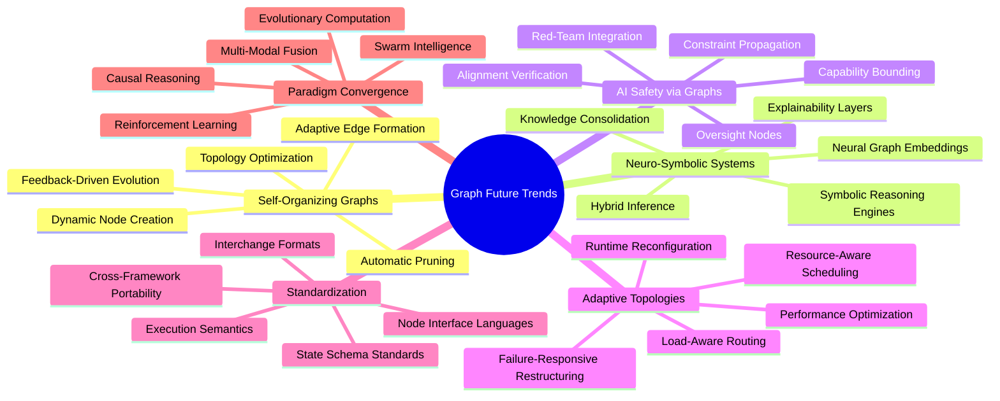
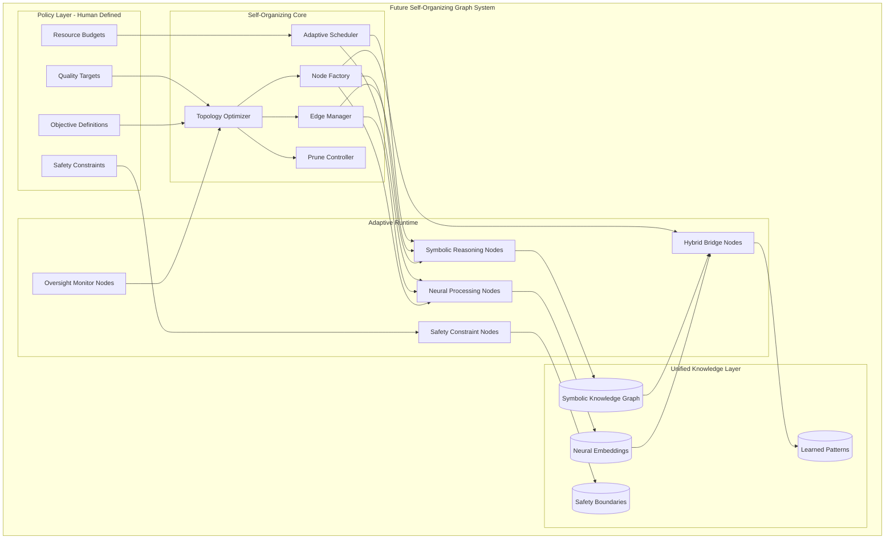
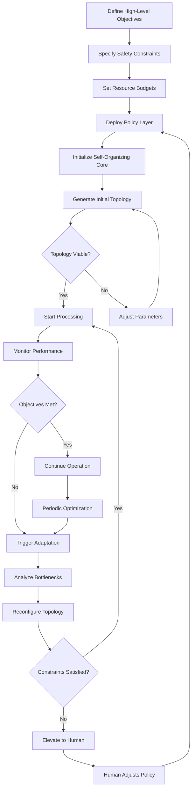
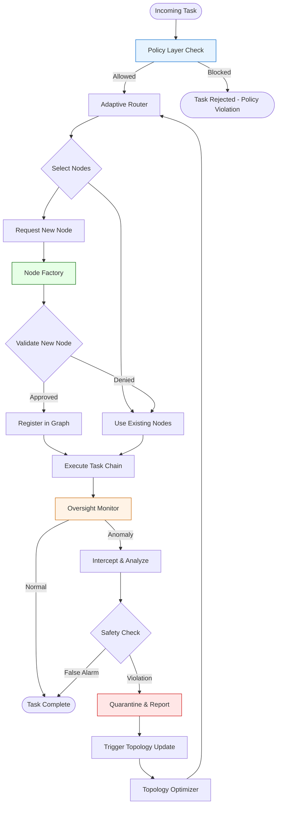
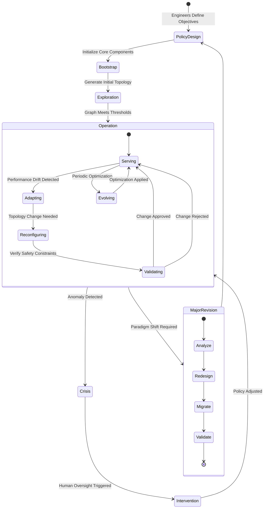
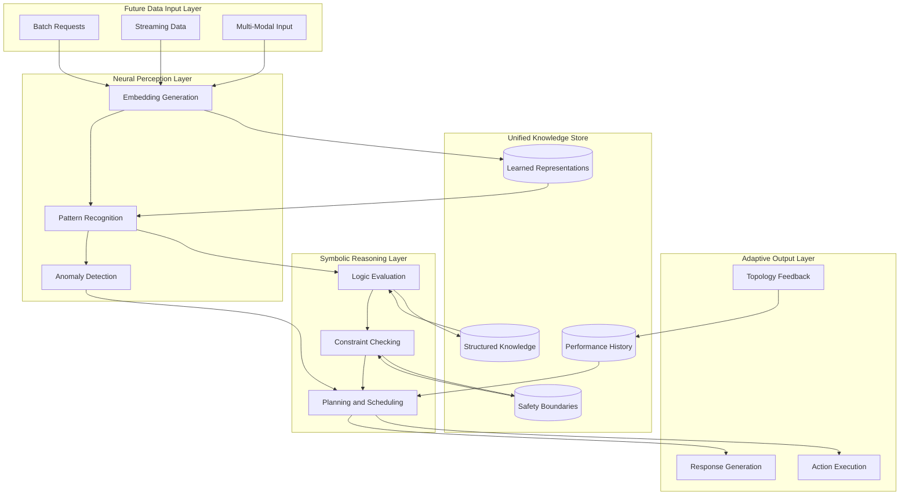
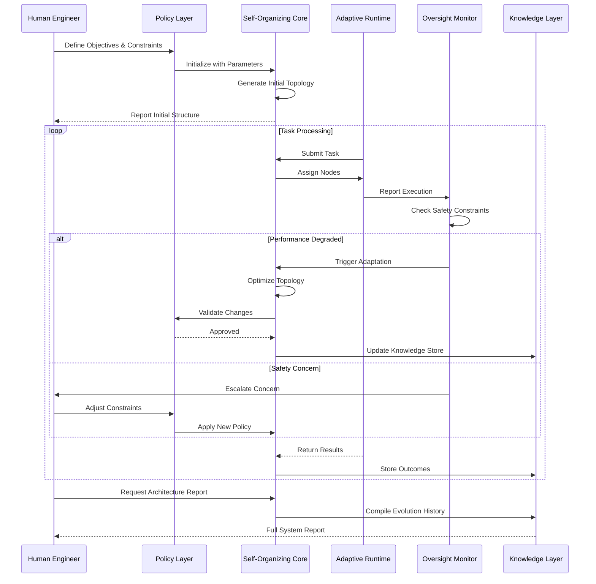

# Graph Future Trends

## 📌 Overview

The future of graph engineering is being shaped by converging forces that promise to transform how we design, build, and operate graph-based AI systems. Current graph systems are largely hand-crafted architectures where engineers explicitly define every node, edge, and transition — but emerging research and early-stage tooling suggest a future where graphs can self-organize, adapt their topology in response to changing conditions, and even design themselves based on high-level objectives. The trends examined in this document — self-organizing graphs, neuro-symbolic graph systems, graph-based AI safety mechanisms, adaptive graph topologies, standardization efforts, and the convergence of graph engineering with other AI paradigms — represent the most promising directions that are likely to define the next generation of graph-based AI systems over the coming years.

These trends are not speculative fiction; they are grounded in active research, emerging product features, and early adopter experiences that point clearly toward the trajectory of the field. Self-organizing graphs are already being explored in research labs where systems dynamically create and connect nodes based on task requirements. Neuro-symbolic approaches are bridging the gap between the pattern recognition capabilities of neural networks and the structured reasoning capabilities of graph-based systems. AI safety researchers are increasingly viewing graph architectures as a natural framework for implementing alignment, oversight, and constraint enforcement. Standardization bodies are beginning to define common interchange formats for graph definitions, enabling portability across frameworks and organizations. Understanding these trends today prepares engineers to ride the wave of innovation rather than being overwhelmed by it.

## 🎯 Learning Objectives

By studying this document, you will develop a forward-looking understanding of the forces and technologies that are shaping the next generation of graph-based AI systems. You will understand the principles behind self-organizing graphs that can dynamically create, connect, and prune nodes based on task requirements and environmental feedback. You will learn how neuro-symbolic graph systems combine the strengths of neural network pattern recognition with the structured reasoning capabilities of graph-based architectures. You will explore how graph structures are being used to implement AI safety mechanisms including alignment constraints, oversight protocols, and capability boundaries. You will understand adaptive graph topologies that reconfigure themselves in response to workload characteristics, failure conditions, and performance objectives. You will examine emerging standardization efforts that promise to make graph definitions portable, interoperable, and composable across frameworks and organizations. Finally, you will analyze the convergence of graph engineering with other AI paradigms including reinforcement learning, evolutionary computation, and swarm intelligence, understanding how these intersections create new capabilities that no single paradigm can achieve alone.

## 🧠 Definition

Graph future trends are the emerging technologies, methodologies, and paradigm shifts that are expected to significantly influence the design, implementation, and operation of graph-based AI systems over the next three to seven years. These trends encompass both incremental improvements to current practices — such as better tooling, improved frameworks, and refined methodologies — and more fundamental shifts in how graph systems are conceived and built. The definition is deliberately broad to capture the wide range of developments that are converging on graph engineering, from advances in adjacent fields like neuro-symbolic AI and AI safety research to practical developments like standardization efforts and adaptive infrastructure. What unites these diverse developments is their potential to change the fundamental relationship between engineers and graph systems, moving from a model where engineers design every aspect of a graph explicitly to one where engineers define high-level objectives and constraints while the system handles the details of graph structure and behavior.

The definition also emphasizes that these trends exist on a spectrum from near-term practical adoption to longer-term research directions. Some trends, such as graph standardization formats and adaptive topologies, are already partially realized in current tools and will mature into mainstream capabilities within the next few years. Others, such as fully self-organizing graphs and neuro-symbolic systems that seamlessly combine neural and symbolic reasoning, require fundamental research advances and are likely to take longer to reach production maturity. Understanding this spectrum is important for engineering teams making investment decisions about which trends to adopt early and which to monitor from a distance.

## ❓ Why It Matters

Understanding future trends matters because the most consequential decisions in engineering are not about what to build today but about how to position your systems, skills, and architecture for tomorrow. Teams that recognized the shift from monolithic to micrograph architectures several years ago were able to migrate incrementally and maintain competitive advantage, while teams that dismissed the trend were eventually forced into painful, rushed migrations. Similarly, teams that understand the emerging trends in graph engineering can begin preparing their architectures, skillsets, and organizational structures today, positioning themselves to adopt new capabilities smoothly as they mature rather than facing disruptive transitions.

Beyond competitive positioning, understanding future trends matters because it changes how you evaluate architectural decisions today. When you know that graph standardization is coming, you avoid deep lock-in to proprietary graph formats and design your systems with abstraction layers that can accommodate future interchange standards. When you know that adaptive topologies are emerging, you avoid hard-coding execution order and resource allocation, instead designing systems that can be dynamically reconfigured. When you know that AI safety will increasingly be implemented at the graph architecture level, you begin designing your graphs with explicit constraint and oversight nodes rather than treating safety as an external concern. Forward awareness transforms a reactive engineering practice into a proactive one, where teams are prepared for change and can adopt innovations incrementally rather than facing disruptive rewrites.

## 🏛️ Core Concepts

The core concepts underlying future graph trends center on the shift from static, hand-designed systems to dynamic, adaptive, and partially autonomous ones. The first concept is **emergent architecture**, where the structure of a graph system arises from the interaction of simple rules and local decisions rather than being explicitly designed top-down. This concept draws from complexity science and artificial life, where complex global behaviors emerge from simple local interactions. In the graph engineering context, emergent architecture means that a system might dynamically create new nodes to handle unexpected task types, form new connections between nodes based on observed performance patterns, or prune unused nodes and edges that are consuming resources without contributing value.

The second concept is **neuro-symbolic integration**, which describes the fusion of neural network-based learning and pattern recognition with symbolic graph-based reasoning and representation. Neural networks excel at learning from examples and recognizing patterns in unstructured data, but they struggle with systematic reasoning, explicit knowledge representation, and interpretable decision-making. Graph-based symbolic systems excel at structured reasoning, explicit knowledge representation, and interpretable logic, but they struggle with learning from examples and handling ambiguity. Neuro-symbolic integration aims to combine these complementary strengths, using neural networks to perceive and learn from the world while using graph structures to reason about what was learned and make structured decisions.

The third concept is **architectural safety**, which treats the graph structure itself as a safety mechanism rather than relying solely on behavioral constraints like output filtering. By embedding safety constraints into the graph's topology — for example, requiring that certain sensitive operations can only be reached through approval nodes, or that loops have hard termination bounds enforced by the graph runtime — safety becomes a structural property of the system rather than a behavioral property that must be verified at runtime. The fourth concept is **graph portability**, enabled by standardization efforts that define common formats for graph definitions, node interfaces, state schemas, and execution semantics, allowing graphs to be shared, composed, and migrated across different frameworks and runtime environments.

## 🧩 Key Components

The key components of future graph trends can be organized into six major domains. **Self-organizing graphs** include dynamic node creation, adaptive edge formation, automatic graph pruning, topology optimization algorithms, and feedback-driven structural evolution. These capabilities enable graph systems to modify their own architecture based on observed performance, changing requirements, and environmental conditions. **Neuro-symbolic systems** include neural graph embeddings that map graph structures into continuous vector spaces, symbolic reasoning engines that operate on graph representations, hybrid inference mechanisms that combine neural and symbolic processing, and knowledge-consolidation mechanisms that transfer learned patterns into structured graph knowledge.

**Graph-based AI safety** includes constraint propagation through graph topology, capability bounding through structural limits, oversight nodes that monitor and intervene in graph execution, alignment verification mechanisms that check whether graph behavior conforms to specified objectives, and red-team integration nodes that systematically probe graph behavior for safety violations. **Adaptive topologies** include runtime graph reconfiguration, load-aware routing that adjusts graph paths based on resource availability, failure-responsive restructuring that reroutes around failed nodes, and performance-driven topology optimization that continuously adjusts the graph structure to maximize throughput or minimize latency.

**Standardization efforts** include graph definition interchange formats (analogous to OpenAPI for REST APIs), node interface description languages that enable cross-framework node reuse, state schema standards that enable interoperability between graph systems, and execution semantic specifications that ensure graphs behave predictably across different runtime environments. **Paradigm convergence** includes the integration of reinforcement learning with graph-based planning, evolutionary computation applied to graph topology optimization, swarm intelligence patterns for multi-agent graph coordination, and the fusion of causal reasoning frameworks with graph-based inference.

## 🧭 Mental Model

Think of the evolution of graph engineering as analogous to the evolution of computer networking. Early networks were hand-configured: every route was manually defined, every connection was explicitly provisioned, and scaling required manual intervention at every step. The introduction of dynamic routing protocols transformed networking from a manual craft into an adaptive system where routes are automatically computed, connections are dynamically established, and the network reconfigures itself in response to failures and load changes. The current state of graph engineering resembles early networking — graphs are explicitly designed and statically configured — while the future trends described in this document resemble the introduction of dynamic routing, adaptive load balancing, and self-healing network topologies. Just as network engineers today define high-level policies (security zones, traffic classes, quality of service objectives) while the network handles the details of route computation and traffic engineering, future graph engineers will define high-level objectives and constraints while the system handles the details of graph structure and execution. This shift does not eliminate the need for graph engineers any more than dynamic routing eliminated network engineers — it elevates their role from configuring individual connections to designing the policies and objectives that govern the system's behavior.

## 🗺️ Mind Map

## 🏗️ Architecture Diagram

## 🔄 Workflow

## ⚙️ Internal Working

The internal workings of future graph systems represent a fundamental departure from current architectures in several key ways. In current systems, the graph topology is static and defined at design time, meaning that the structure of nodes and edges does not change during execution. In future self-organizing systems, the topology becomes a dynamic property that is continuously adjusted based on observed performance metrics, resource availability, and task characteristics. The topology optimizer component operates as a meta-level controller that monitors the graph's performance and decides when to create new nodes, form new connections, or prune existing ones. This optimizer uses a combination of reinforcement learning to discover effective topologies and constraint solvers to ensure that any topology changes satisfy the safety and resource constraints defined in the policy layer.

The node factory component provides the ability to dynamically instantiate new nodes from templates or to synthesize entirely new node behaviors based on observed requirements. When the system encounters a type of input that existing nodes cannot handle effectively, the node factory can create a specialized node by composing existing capabilities or by generating a new node definition using an LLM-powered design process. The edge manager component handles the dynamic formation and dissolution of connections between nodes, using performance data to identify which connections are productive and which are wasteful. Connections that consistently produce poor results are gradually weakened and eventually removed, while successful patterns are reinforced and potentially replicated across the graph. The adaptive scheduler component manages resource allocation across the dynamic topology, ensuring that computational resources are distributed based on current task priorities and node performance, automatically scaling resources up for critical path nodes and down for less critical ones during periods of high load.

## 🔀 Execution Flow

## 📊 Lifecycle

## 📡 Data Flow

## 🤝 Interaction Flow

## 🌍 Real-World Analogy

The evolution of graph engineering closely parallels the evolution of urban planning and city management. Early cities were planned top-down by a single architect who designed every street, building, and public space — much like current graph systems where engineers explicitly design every node and edge. Modern cities, by contrast, have evolved to include both planned zones (like business districts and parks, analogous to core graph structure) and self-organizing areas (like neighborhoods that grow organically based on resident needs, analogous to dynamically created subgraphs). Modern cities also have adaptive infrastructure — traffic lights that adjust timing based on real-time flow, power grids that reroute around failures, and public transit systems that add routes based on demand patterns. This is analogous to adaptive graph topologies that reconfigure based on workload and conditions. Cities have building codes and zoning laws that define what can be built where — analogous to the policy layer that constrains what the self-organizing graph core can create. And cities have evolved standard building codes that allow architects and contractors from different firms to work on the same city — analogous to graph standardization efforts that enable interoperability across frameworks. Just as urban planners have evolved from designing every detail to defining policies and constraints that guide organic city growth, future graph engineers will evolve from designing every node to defining objectives and constraints that guide self-organizing graph systems.

## 💡 Practical Example

Consider a practical example of how future graph engineering trends might transform a customer support system. Today's customer support graph has a fixed topology designed by engineers: a classifier node routes to specific handler nodes, which feed into response generators and quality checkers. In the future self-organizing version, the system would be initialized with a policy layer defining objectives (resolve tickets within five minutes, achieve eighty percent customer satisfaction, maintain zero safety violations) and constraints (maximum cost per ticket, no handling of financial transactions without human approval, mandatory logging of all PII access).

The self-organizing core would generate an initial topology based on historical ticket data, creating specialized nodes for the most common ticket types. As the system operates, the topology optimizer monitors which nodes are effective and which are not. When a new type of ticket emerges — perhaps related to a recently launched product feature — the system detects that existing nodes are handling these tickets poorly and the node factory creates a specialized node trained on the emerging pattern. If the new product feature generates a flood of tickets, the adaptive scheduler allocates additional computational resources to the new node and creates parallel instances to handle the load. The oversight monitor continuously checks that all operations conform to the safety constraints, quarantining any node that attempts to access PII without proper logging. Over weeks of operation, the graph evolves into a topology that is optimally suited to the actual distribution of tickets, with specialized nodes for every significant ticket category and adaptive resource allocation that matches processing capacity to demand — all without any manual topology changes by engineers.

## 🧪 Use Cases

The future trends in graph engineering will enable entirely new categories of use cases that are impractical or impossible with current static graph architectures. **Autonomous research systems** will use self-organizing graphs that dynamically create research nodes for new scientific domains, adapt their retrieval and analysis strategies based on what they discover, and prune unsuccessful research paths to focus resources on promising directions. These systems could operate for weeks or months, continuously evolving their graph topology as they explore a research space, with oversight nodes ensuring that all conclusions are properly cited and validated before being surfaced to human researchers. **Adaptive personal AI assistants** will maintain graph structures that evolve with the user over time, creating specialized nodes for recurring task patterns, forming connections between related areas of the user's life, and adapting their interaction style based on learned preferences.

**Self-healing enterprise systems** will use adaptive topologies to maintain operational continuity during failures, automatically rerouting workloads around failed components, creating temporary substitute nodes to maintain critical functionality, and restructuring the graph to maximize resilience based on observed failure patterns. **Collaborative multi-organization graphs** will use standardization formats to enable graphs from different organizations to interoperate seamlessly, allowing a supply chain management graph from one company to connect with a logistics optimization graph from another, creating a federated system that is more capable than any single organization's graph alone. **AI safety enforcement systems** will use graph-based structural constraints to ensure that AI systems operate within defined boundaries, with safety nodes that cannot be bypassed, oversight nodes that monitor all operations, and quarantine nodes that can isolate problematic components without human intervention.

## ⚖️ Comparison

| Trend | Current State | Near-Term (1-3 years) | Long-Term (3-7 years) | Maturity Level |
|---|---|---|---|---|
| Self-Organizing Graphs | Static topology, manual design | Dynamic node creation with templates | Fully autonomous topology optimization | Research → Early Adopter |
| Neuro-Symbolic Systems | Separate neural and symbolic pipelines | Hybrid nodes with neural embeddings | Seamless neural-symbolic fusion | Early Research → Prototype |
| Graph-Based AI Safety | Behavioral constraints only | Structural safety nodes in graphs | Comprehensive graph-level safety architecture | Active Development |
| Adaptive Topologies | Fixed routing, manual scaling | Load-aware routing, basic auto-scaling | Self-reconfiguring topologies | Early Adoption |
| Standardization | Framework-specific formats | Community interchange formats | Universal graph description standards | Emerging |
| Paradigm Convergence | Single-paradigm systems | Graphs with RL for optimization | Multi-paradigm fusion architectures | Research Phase |

## ✅ Best Practices

Preparing for future graph engineering trends requires both immediate practical actions and longer-term strategic investments. **Design for adaptability today** by avoiding hard-coded topologies and resource allocations wherever possible. Even if your current tools do not support self-organization, designing your graphs with clear interfaces between nodes, well-defined state schemas, and explicit dependency declarations makes future migration to adaptive systems far easier. Treat every hardcoded connection as technical debt that will need to be refactored when dynamic topology management becomes available. **Invest in graph observability** because adaptive and self-organizing systems require far richer monitoring than static systems. Build comprehensive telemetry that captures node performance, edge utilization, state evolution, and execution path diversity — the data that future adaptive systems will need to make good topology decisions.

**Adopt emerging standards early** by participating in community efforts to define graph interchange formats and node interface standards. Even if these standards are still evolving, adopting them early provides experience that positions your team to influence their direction and avoids deep lock-in to proprietary formats. **Build safety into the graph structure** rather than treating it as an external concern. Begin adding oversight nodes, constraint propagation mechanisms, and capability-bounding structures to your current graphs, developing the skills and patterns that will be essential when graph-level safety becomes a regulatory or industry requirement. **Experiment with hybrid architectures** by incorporating neural network components into your graph systems and exploring how symbolic reasoning nodes can complement neural processing. These experiments build organizational knowledge that will be valuable when neuro-symbolic fusion matures.

## ❌ Common Mistakes

The most common mistake in preparing for future trends is either premature over-investment in immature technologies or overly cautious inaction that leads to being left behind. Premature over-investment occurs when teams attempt to build production systems using research-stage technologies, discovering that the tools are unreliable, the documentation is nonexistent, and the community support is insufficient for production deployment. This leads to failed projects, wasted investment, and organizational skepticism about the entire trend. Overly cautious inaction occurs when teams wait for technologies to be completely mature before beginning to engage, missing the window where early experience provides competitive advantage and the opportunity to shape standards and practices.

Another common mistake is treating future trends as replacements for current best practices rather than extensions of them. Self-organizing graphs do not eliminate the need for clear design principles — they elevate the level of abstraction at which design occurs. Neuro-symbolic systems do not eliminate the need for testing and validation — they introduce new types of testing challenges around the interaction between neural and symbolic components. Teams that abandon current best practices in pursuit of future capabilities typically end up with systems that exhibit the worst of both worlds. A third common mistake is assuming that future trends will converge on a single dominant paradigm. In reality, multiple approaches will coexist, each optimized for different use cases and organizational contexts. Teams that bet everything on one trend risk being stranded if that trend does not dominate as expected.

## 🚀 Advanced Topics

The most advanced research directions in graph engineering explore the frontiers of what graph-based systems might become. **Graph consciousness models** investigate whether sufficiently complex, self-organizing graph systems can develop forms of meta-cognition — the ability to reason about their own reasoning processes, identify gaps in their knowledge, and strategically plan their own learning. While this research is highly speculative, early work on self-reflective graph systems that can evaluate and improve their own topology shows promising directions. **Quantum-classical graph hybrid systems** explore how quantum computing capabilities might be integrated into graph architectures, potentially enabling graph operations that are computationally intractable on classical hardware, such as exhaustive topology optimization or parallel evaluation of exponentially many execution paths.

**Bio-inspired graph architectures** draw from neuroscience, mycology, and evolutionary biology to design graph systems that exhibit properties like neural plasticity (the ability of connections to strengthen or weaken based on usage), mycelial network optimization (the ability of biological networks to find efficient paths through dynamic environments), and evolutionary adaptation (the ability of graph topologies to improve through selective pressure). **Graph consciousness and self-awareness** represents perhaps the most speculative frontier, where researchers ask whether a sufficiently complex, self-organizing, self-monitoring graph system might develop emergent properties that could be described as a form of machine self-awareness. While this research is far from any practical application, it raises important questions about the ethical design of graph systems and the need for robust safety mechanisms as graph systems become more autonomous. **Cross-domain graph transfer** explores whether graph topologies optimized for one domain can be transferred to another, enabling a graph system optimized for medical diagnosis to contribute its structural insights to a graph system designed for financial risk assessment, accelerating the development of new graph systems by leveraging topological knowledge from existing ones.
