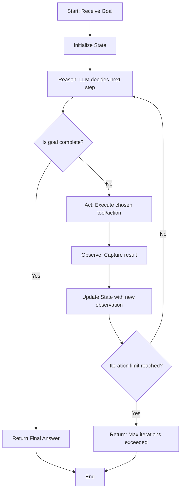

# 01 — What is Loop Engineering?

> 📘 File 1 of 25 — Loop Engineering Knowledge Library
> Phase: Foundations
> Prerequisite: None — start here.

---

## 1. Introduction

### Topic Overview

Every time you ask ChatGPT or Claude a single question and get a single answer, that's **one shot** — a request goes in, a response comes out, done. But that's not how AI *agents* work. An agent that browses the web to research a topic, writes and debugs code until tests pass, or manages a multi-step task doesn't stop after one response. It keeps going: it thinks, it acts, it checks what happened, and it decides what to do next — again and again — until the goal is met or it gives up.

That repeating cycle is a **loop**. And **Loop Engineering** is the discipline of deliberately designing that cycle: deciding what happens in each iteration, how the system knows when to stop, what it remembers between iterations, and how it recovers when something goes wrong.

### Why This Topic Matters

If you've built an AI agent with LangChain, LangGraph, Google ADK, or a custom CLI tool, you have *already done Loop Engineering* — you just may not have had a name for it. Understanding it as a distinct discipline (separate from prompt engineering or model choice) is what lets you:

- Debug agents that get stuck in infinite loops or give up too early
- Design agents that use fewer tokens and fewer API calls for the same result
- Reason about *why* an agent framework works the way it does, instead of just copying tutorial code
- Build your own agent loop from scratch when no framework fits your use case

This file is the entry point to the entire library. Every other file assumes you understand the core idea explained here.

---

## 2. Definition

### What Is It? (Simple Explanation)

Imagine you ask a very capable friend to "find out if it's going to rain tomorrow and tell me if I need an umbrella." Your friend doesn't just guess. They:

1. **Think** — "I need to check the weather forecast"
2. **Act** — open a weather app
3. **Observe** — read the forecast: "70% chance of rain at 3 PM"
4. **Think again** — "That's high enough that they should bring an umbrella"
5. **Act** — tell you "Yes, bring an umbrella"
6. **Stop** — the task is done

That five-step cycle — think, act, observe, think again, decide — is a loop. Your friend didn't need you to ask five separate questions. They ran the loop *themselves* until the task was complete.

**Loop Engineering is the practice of building that same cycle into software**, so an AI system can pursue a goal across multiple steps without a human manually prompting it at every stage.

### Technical Definition

> **Loop Engineering** is the discipline of designing, implementing, and optimizing the iterative control structure — commonly called an **agent loop** or **agentic loop** — through which an AI system (typically built on a Large Language Model) repeatedly performs a cycle of reasoning, action, and observation to progress toward a goal, including the mechanisms that govern state persistence, termination conditions, error recovery, and resource bounds across iterations.

In more concrete engineering terms, a Loop Engineer is responsible for answering questions like:

- What triggers the *next* iteration of the loop?
- What information carries over from one iteration to the next (state/memory)?
- Under what conditions does the loop **stop** — success, failure, timeout, or budget exhaustion?
- How does the loop **recover** when a step fails (a tool errors out, the model gives a bad response)?
- How do we prevent the loop from running forever or burning unlimited API cost?

---

## 3. Core Concepts

### Fundamental Ideas

| Concept | One-Line Explanation |
|---|---|
| **Iteration** | One full pass through the loop's cycle (think → act → observe) |
| **State** | The information the loop carries forward between iterations |
| **Termination Condition** | The rule that decides when the loop stops |
| **Control Flow** | The logic deciding what happens next based on the current state |
| **Observation** | The result/feedback the loop receives after taking an action |
| **Convergence** | The loop is making genuine progress toward its goal, not spinning in place |

### Key Terminology (Preview)

This file introduces the concepts loosely — file `05_Key_Terminology.md` is the full glossary. For now, the three terms you'll see constantly:

- **Agent** — the overall system that *uses* a loop to pursue a goal
- **Agent Loop / Agentic Loop** — the specific repeating cycle itself
- **Single-shot / Single-turn** — the opposite of a loop: one prompt, one response, no follow-up reasoning

> 💡 **Mental model:** An agent is the *worker*. The loop is the *process the worker follows*. Loop Engineering is designing that process well.

---

## 4. How It Works

### Step-by-Step Explanation

At the simplest level, nearly every agent loop — regardless of framework — follows this pattern:

1. **Initialize** — set the goal, starting state, and any initial context
2. **Reason** — the LLM decides what to do next given the current state
3. **Act** — execute that decision (call a tool, run code, send a message)
4. **Observe** — capture the result of that action
5. **Update State** — merge the new observation into the loop's memory
6. **Check Termination** — has the goal been reached? Has a limit been hit?
7. **Repeat or Stop** — if not done, go back to step 2 with the updated state; if done, exit the loop and return the final result

### Internal Workflow

Here's that same cycle expressed as pseudocode — the shape you'll recognize inside nearly every agent framework, whether it's LangGraph, a Google ADK agent, or a hand-rolled Python `while` loop:

```python
def agent_loop(goal, max_iterations=10):
    state = {"goal": goal, "history": [], "iteration": 0}

    while state["iteration"] < max_iterations:
        # 1. Reason: ask the LLM what to do next
        decision = llm_reason(state)

        # 2. Check if the model believes the goal is complete
        if decision.is_final_answer:
            return decision.answer

        # 3. Act: execute the chosen tool/action
        result = execute_action(decision.action, decision.action_input)

        # 4. Observe + update state
        state["history"].append({
            "thought": decision.thought,
            "action": decision.action,
            "observation": result
        })
        state["iteration"] += 1

    # Loop exhausted its budget without finishing
    return "Max iterations reached without a final answer."
```

This is intentionally simplified — real frameworks add error handling, parallel branches, and memory pruning — but the *skeleton* is universal. Once you can see this skeleton inside any framework's source code, you understand that framework's agent loop.

---

## 5. Architecture / Workflow

### Mermaid Flowchart



This diagram is the single most important image in this entire library — every subsequent file elaborates on one part of this loop.

---

## 6. Components / Types

### Main Components (Preview)

Loop Engineering systems are typically built from four core components — each gets its own deep dive in `09_Core_Components.md`:

- **Controller** — decides what happens next (usually the LLM itself, sometimes rule-based logic)
- **Executor** — actually performs actions (tool calls, code execution, API requests)
- **Memory/State Manager** — tracks what's happened so far and what the loop knows
- **Evaluator/Terminator** — decides when the loop should stop

### Categories (Preview)

Not all loops look the same. A few you'll meet in depth in `10_Types_of_Loops.md`:

- **ReAct loops** — Reason, then Act, then observe, repeat
- **Plan-and-Execute loops** — plan the whole sequence upfront, then execute step by step
- **Reflexion loops** — the agent critiques its own output and retries
- **Multi-agent loops** — several agent loops coordinating together

---

## 7. Examples

### Beginner Example

The simplest possible loop — a "guess the number" agent that keeps guessing until it's right, using feedback ("higher"/"lower") to narrow down:

```python
def guess_the_number_loop(target, max_guesses=10):
    low, high = 1, 100
    guesses = 0

    while guesses < max_guesses:
        guess = (low + high) // 2  # the "reasoning" step
        guesses += 1
        print(f"Guess #{guesses}: {guess}")

        if guess == target:
            return f"Found it! The number was {guess} in {guesses} guesses."
        elif guess < target:
            low = guess + 1  # observation: "too low" -> update state
        else:
            high = guess - 1  # observation: "too high" -> update state

    return "Ran out of guesses."

guess_the_number_loop(target=42)
```

This isn't an LLM loop, but it demonstrates the exact same shape: guess (act) → check (observe) → narrow the range (update state) → repeat.

### Intermediate Example

A minimal LLM-powered loop using the Anthropic API, where the model repeatedly reasons about a math problem until it produces a final answer:

```python
import anthropic

client = anthropic.Anthropic()

def simple_agent_loop(question, max_iterations=5):
    messages = [{"role": "user", "content": question}]

    for i in range(max_iterations):
        response = client.messages.create(
            model="claude-sonnet-4-6",
            max_tokens=500,
            system="Think step by step. When you have the final answer, "
                   "start your response with 'FINAL ANSWER:'.",
            messages=messages
        )

        reply_text = response.content[0].text
        print(f"--- Iteration {i+1} ---\n{reply_text}\n")

        if "FINAL ANSWER:" in reply_text:
            return reply_text.split("FINAL ANSWER:")[1].strip()

        # Feed the model's own reasoning back in, and nudge it to continue
        messages.append({"role": "assistant", "content": reply_text})
        messages.append({"role": "user", "content": "Continue your reasoning."})

    return "Loop ended without a final answer."

result = simple_agent_loop("If a train travels 60 mph for 2.5 hours, how far does it go?")
print(result)
```

### Advanced / Real-World Example

A tool-using loop where the LLM can call a real function (a calculator) and the loop parses that decision, executes it, and feeds the result back — the actual pattern behind most production agents:

```python
import json
import anthropic

client = anthropic.Anthropic()

def calculator(expression: str) -> str:
    try:
        return str(eval(expression, {"__builtins__": {}}))
    except Exception as e:
        return f"Error: {e}"

tools = [{
    "name": "calculator",
    "description": "Evaluate a basic math expression",
    "input_schema": {
        "type": "object",
        "properties": {"expression": {"type": "string"}},
        "required": ["expression"]
    }
}]

def tool_using_loop(question, max_iterations=5):
    messages = [{"role": "user", "content": question}]

    for i in range(max_iterations):
        response = client.messages.create(
            model="claude-sonnet-4-6",
            max_tokens=500,
            tools=tools,
            messages=messages
        )

        if response.stop_reason == "tool_use":
            tool_call = next(b for b in response.content if b.type == "tool_use")
            tool_result = calculator(tool_call.input["expression"])

            messages.append({"role": "assistant", "content": response.content})
            messages.append({
                "role": "user",
                "content": [{
                    "type": "tool_result",
                    "tool_use_id": tool_call.id,
                    "content": tool_result
                }]
            })
        else:
            # Model gave a final text answer, no more tools needed
            return response.content[0].text

    return "Loop ended without resolution."

print(tool_using_loop("What is (45 * 12) + 890?"))
```

Notice the loop's shape is *identical* to the pseudocode in Section 4 — only the "Act" step changed, from a simple guess to a real tool call.

---

## 8. Best Practices

### Do's

- ✅ **Always set a maximum iteration count.** Every loop needs a hard ceiling to prevent runaway costs or infinite hangs.
- ✅ **Log every iteration's state.** When something goes wrong, iteration logs are how you debug it.
- ✅ **Design explicit termination conditions**, not just "the model said it's done." Combine model judgment with hard checks where possible.
- ✅ **Keep state minimal.** Only carry forward what the next iteration actually needs — bloated state wastes tokens and confuses reasoning.
- ✅ **Treat the loop and the model as separate concerns.** The loop's control flow (Python code) should be dumb and predictable; the reasoning (LLM calls) can be smart and flexible.

### Recommended Techniques

- Start every new agent project by drawing the loop's flowchart *before* writing code (see file `17_Workflow_and_Diagrams.md`)
- Test the loop's termination logic in isolation, separately from testing the model's reasoning quality
- Add a "dry run" mode that logs what actions *would* be taken without executing them — invaluable for debugging destructive tool calls

---

## 9. Common Mistakes

### Frequent Errors

| Mistake | What Happens |
|---|---|
| No iteration limit | Loop runs forever, burning API cost until you manually kill it |
| Relying only on the LLM to self-report "I'm done" | Model can hallucinate completion, or loop forever second-guessing itself |
| Growing state unboundedly | Context window fills up, responses degrade, costs spike |
| Treating one bad tool result as unrecoverable | Loop crashes instead of retrying or asking the model to adapt |
| No logging | When the loop misbehaves in production, there's no way to reconstruct what happened |

### How to Avoid Them

- Always pair a **model-driven** termination signal (the LLM saying "done") with a **hard-coded** one (max iterations, max tokens, timeout)
- Summarize or prune older state entries instead of letting history grow forever — covered in depth in `11_State_Context_and_Memory.md`
- Wrap every action execution in a try/except that feeds the *error* back into the loop as an observation, so the model can adapt — rather than crashing the whole program

---

## 10. Advantages & Limitations

### Benefits

- Enables AI systems to complete **multi-step tasks** a single LLM call never could
- Allows **self-correction** — the system can notice and fix its own mistakes mid-task
- Makes AI systems **interactive with the real world** — tool calls, code execution, live data
- Provides a clear, debuggable structure instead of a black-box single response

### Drawbacks

- **Cost multiplies** — each iteration is another LLM call, so poorly bounded loops get expensive fast
- **Latency compounds** — a 5-iteration loop is roughly 5x slower than a single response
- **Failure modes are harder to predict** — bugs can emerge only after several iterations, making them harder to reproduce
- **Requires careful engineering** — a badly designed loop can get stuck, loop pointlessly, or terminate too early

---

## 11. Comparison

### Compare with Related Concepts

| Concept | What It Is | How It Relates to Loop Engineering |
|---|---|---|
| **Prompt Engineering** | Crafting the wording of a single prompt for best output | Loop Engineering designs the *system* that decides *what* prompts to send and *when* |
| **Context Engineering** | Managing what information is in the model's context window | A core *input* to Loop Engineering — state management (file 11) draws heavily on it |
| **Agent Engineering** | Building the overall autonomous system (goals, tools, personas) | Loop Engineering is the *engine* inside an agent; Agent Engineering is the whole car |
| **Prompt Chaining** | Manually wiring fixed sequences of prompts together | A *static* version of a loop — no dynamic decision-making about what happens next |

> 🔎 A full deep-dive comparison lives in `20_Comparison_with_Prompt_Context_and_Agent_Engineering.md`.

### Summary Table

| Question | Single-Shot LLM Call | Loop-Engineered Agent |
|---|---|---|
| Can it use tools mid-task? | No | Yes |
| Can it correct its own mistakes? | No | Yes |
| Can it work toward a multi-step goal? | No | Yes |
| Is it deterministic in cost/latency? | Yes | No — varies by iteration count |
| Is it simpler to build? | Yes | No — requires state, termination, error handling |

---

## 12. Summary

### Key Takeaways

- A **loop** is a repeating cycle of *reason → act → observe*, used when a single LLM response isn't enough to complete a task
- **Loop Engineering** is the deliberate discipline of designing that cycle — its state, termination conditions, error handling, and resource bounds
- The core skeleton (initialize → reason → act → observe → update state → check termination → repeat/stop) is the same across every framework
- Good loops always have a hard iteration limit, explicit termination logic, and error recovery — these are non-negotiable engineering requirements, not nice-to-haves

### Cheat Sheet

```
LOOP = Reason → Act → Observe → Update State → Check Termination → Repeat/Stop

Every loop needs:
  ✓ Max iteration limit
  ✓ Clear termination condition
  ✓ State that carries forward
  ✓ Error handling per iteration
  ✓ Logging for debugging
```

---

## 13. Glossary

| Term | Definition |
|---|---|
| **Loop** | A repeating cycle of reasoning, action, and observation used to pursue a goal across multiple steps |
| **Loop Engineering** | The discipline of designing and optimizing that repeating cycle |
| **Agent** | A system that uses a loop (or loops) to autonomously pursue a goal |
| **Iteration** | One complete pass through the loop's cycle |
| **State** | The information carried forward from one iteration to the next |
| **Termination Condition** | The rule(s) that determine when a loop stops running |
| **Single-shot** | A single prompt-in, response-out interaction with no loop |
| **ReAct** | A specific loop pattern combining Reasoning and Acting (see file 10) |
| **Controller** | The component of a loop that decides what happens next |
| **Executor** | The component of a loop that carries out actions |

---

## 14. References & Further Reading

### Official Documentation

- Anthropic — [Building Effective AI Agents](https://www.anthropic.com/research/building-effective-agents)
- Anthropic — [Claude API Documentation](https://docs.claude.com)

### Research Papers

- Yao et al., 2022 — *"ReAct: Synergizing Reasoning and Acting in Language Models"* — the foundational paper for modern agent loops
- Shinn et al., 2023 — *"Reflexion: Language Agents with Verbal Reinforcement Learning"* — self-correcting loop patterns

### Where to Go Next in This Library

- Next file: `02_Why_Loop_Engineering.md` — the problem this discipline solves, in depth
- Jump ahead: `06_How_Loop_Engineering_Works.md` — a deeper mechanical breakdown of every step in Section 4 above
- Reference: `05_Key_Terminology.md` — the full vocabulary glossary for this library

---

*This is File 1 of 25 in the Loop Engineering Knowledge Library. See `README.md` for the full index and suggested reading paths.*
