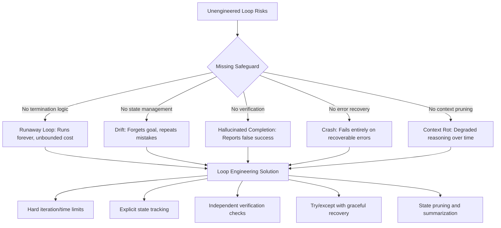

# 02 — Why Loop Engineering?

> 📘 File 2 of 25 — Loop Engineering Knowledge Library
> Phase: Foundations
> Prerequisite: `01_What_is_Loop_Engineering.md`

---

## 1. Introduction

### Topic Overview

File 01 explained *what* a loop is. This file answers a harder question: **why does it need to be engineered deliberately, rather than just... happening?**

You could, after all, just ask an LLM "keep working on this until it's done" and hope for the best. Some early experimental agents (like the original AutoGPT) essentially did exactly that — and the results were notoriously unreliable: agents that looped forever, forgot their original goal halfway through, or burned through API budgets chasing tangents.

This file walks through the specific, concrete problems that show up when loops *aren't* engineered carefully — and why each one demands deliberate design, not improvisation.

### Why This Topic Matters

Understanding the *failure modes* that Loop Engineering prevents is more useful than memorizing its definition. Once you've seen what an unengineered loop looks like, every design choice in the rest of this library — termination conditions, state pruning, error recovery — stops being an abstract "best practice" and becomes an obvious necessity.

---

## 2. Definition

### What Is It? (Simple Explanation)

Loop Engineering exists because **giving an AI system a goal is not the same as giving it a reliable way to reach that goal.** A model can be brilliant at reasoning in a single response and still fail catastrophically across multiple steps if nothing manages *how* those steps connect.

### Technical Definition

> The necessity of Loop Engineering arises from a structural gap between **LLM capability** (strong single-turn reasoning) and **agentic reliability** (the ability to sustain correct, bounded, goal-directed behavior across many turns). Loop Engineering is the set of design practices that closes this gap by imposing explicit state management, termination logic, error recovery, and resource bounds onto what would otherwise be unconstrained repeated model invocation.

In short: **the model provides intelligence per-step; Loop Engineering provides reliability across steps.**

---

## 3. Core Concepts

### Fundamental Ideas

Three structural facts about LLMs make Loop Engineering necessary:

1. **LLMs have no persistent memory of their own.** Every API call is stateless — the model only "remembers" what's explicitly included in that call's context. Without engineered state management, an agent forgets its own goal by iteration 5.
2. **LLMs cannot natively verify the real world.** A model can *say* a task is complete without it actually being complete. Without engineered verification, agents self-report false success.
3. **LLMs have no innate sense of "enough."** Left unconstrained, a model can keep reasoning, re-checking, and re-trying indefinitely — sometimes usefully, often not. Without engineered termination, loops run forever.

### Key Terminology

- **Drift** — when an agent's actions gradually diverge from its original goal across iterations
- **Runaway loop** — a loop that never satisfies its termination condition and continues indefinitely
- **Hallucinated completion** — when a model claims a task is done when it isn't
- **Context rot** — degraded reasoning quality as the context window fills with irrelevant accumulated history

---

## 4. How It Works

### Step-by-Step Explanation

The best way to understand *why* Loop Engineering matters is to trace what happens when each of its safeguards is **missing**, one at a time.

**Without a termination condition:**
1. Agent starts a task, e.g., "research the top 5 AI papers this month"
2. Agent finds 5 papers, but the model isn't confident it found the "top" ones
3. Agent searches again. And again. Each search technically adds *some* new information
4. Nothing tells the loop "5 is enough" — it can continue searching indefinitely
5. Result: unbounded cost, no clear stopping point

**Without state management:**
1. Agent is told to write a Python script, test it, and fix any errors
2. Iteration 3 finds a bug and fixes it — but the fix isn't recorded anywhere accessible to iteration 4
3. Iteration 4 re-introduces the same bug because it never "saw" the earlier fix
4. Result: the agent oscillates between fixing and re-breaking the same code

**Without error recovery:**
1. Agent calls a tool (e.g., a web search API) that times out
2. The loop has no handling for this — it crashes, or the model receives a raw stack trace it doesn't understand
3. Result: task fails entirely on a transient, recoverable error

### Internal Workflow

This is why Loop Engineering formalizes each safeguard as an explicit component rather than an afterthought:

```python
# UNENGINEERED — fragile, will fail in production
def naive_loop(goal):
    state = goal
    while True:  # No limit!
        response = llm_call(state)
        if "done" in response.lower():  # Naive self-report check
            break
        state = response  # State just overwritten, no history kept
    return state


# ENGINEERED — the same task, with deliberate safeguards
def engineered_loop(goal, max_iterations=10, timeout_seconds=120):
    state = {"goal": goal, "history": [], "start_time": time.time()}

    for i in range(max_iterations):                      # Hard iteration bound
        if time.time() - state["start_time"] > timeout_seconds:  # Hard time bound
            return {"status": "timeout", "partial_state": state}

        try:
            response = llm_call(state)
        except Exception as e:                            # Error recovery
            state["history"].append({"error": str(e)})
            continue  # let the loop adapt, don't crash

        state["history"].append(response)                 # Explicit state tracking

        if is_verifiably_complete(response, goal):          # Real verification,
            return {"status": "success", "result": response}  # not just self-report

    return {"status": "max_iterations_exceeded", "partial_state": state}
```

The difference isn't intelligence — both versions could use the exact same underlying model. The difference is **engineering discipline** around the loop itself.

---

## 5. Architecture / Workflow

### Mermaid Flowchart



---

## 6. Components / Types

### Main Components

The failure modes above map directly onto the four safeguards Loop Engineering is responsible for building:

| Safeguard | Solves | Covered In Depth |
|---|---|---|
| **Termination Logic** | Runaway loops | `07_Loop_Lifecycle.md` |
| **State Management** | Drift, forgotten context | `11_State_Context_and_Memory.md` |
| **Verification** | Hallucinated completion | `12_Feedback_and_Iteration.md` |
| **Error Recovery** | Crashes on transient failures | `19_Best_Practices_and_Common_Mistakes.md` |

### Categories of Problems Solved

Loop Engineering problems generally fall into two categories:

- **Correctness problems** — the loop produces a *wrong* result (drift, hallucinated completion)
- **Resource problems** — the loop produces a *correct* result but at excessive cost, latency, or risk (runaway loops, context rot)

---

## 7. Examples

### Beginner Example

A tiny illustration of drift — an agent asked to count to 10 that loses track without state tracking:

```python
# Without state tracking, "count" resets each call
def broken_counter():
    for _ in range(10):
        response = llm_call("What number comes next in the count?")
        print(response)  # Model has no idea what the previous number was!

# With state tracking, the count is explicit and reliable
def fixed_counter():
    count = 0
    for _ in range(10):
        count += 1
        print(count)  # No ambiguity — the loop, not the model, tracks state
```

This is a trivial example, but it's the *same underlying failure* that causes agents to repeat completed research, re-edit already-fixed code, or lose track of multi-part instructions.

### Intermediate Example

Demonstrating hallucinated completion — and the fix, an independent verification step:

```python
def agent_with_naive_completion(task):
    response = llm_call(f"Complete this task: {task}. Say DONE when finished.")
    if "DONE" in response:
        return response  # Trusting the model's self-report blindly

def agent_with_verification(task, verify_fn):
    response = llm_call(f"Complete this task: {task}. Say DONE when finished.")
    if "DONE" in response:
        if verify_fn(response):        # Independent check — e.g., run the tests,
            return response            # check the file exists, validate the output
        else:
            # Model claimed done, but verification failed — loop again
            return llm_call(
                f"Your previous attempt was incomplete: {response}. "
                f"Verification failed. Please try again."
            )
```

The `verify_fn` might run a test suite, check that a file was actually written, or validate output against a schema — anything that doesn't rely purely on the model's own word.

### Advanced / Real-World Example

A realistic budget-aware research loop that engineers around *all four* failure modes simultaneously:

```python
import time

class ResearchLoop:
    def __init__(self, goal, max_iterations=8, max_seconds=180, max_tokens_budget=50000):
        self.goal = goal
        self.max_iterations = max_iterations
        self.max_seconds = max_seconds
        self.max_tokens_budget = max_tokens_budget
        self.tokens_used = 0
        self.findings = []  # Explicit, pruned state — not raw history
        self.start_time = time.time()

    def _budget_exceeded(self):
        return (
            time.time() - self.start_time > self.max_seconds
            or self.tokens_used > self.max_tokens_budget
        )

    def _summarize_findings(self):
        # Prevents context rot: compress findings instead of accumulating raw history
        if len(self.findings) > 5:
            self.findings = [self._compress(self.findings)]

    def _compress(self, findings):
        return {"summary": f"Condensed {len(findings)} findings"}  # placeholder

    def run(self):
        for i in range(self.max_iterations):
            if self._budget_exceeded():
                return {"status": "budget_exceeded", "findings": self.findings}

            try:
                result = self._search_step()
                self.tokens_used += result.get("tokens", 0)
                self.findings.append(result)
                self._summarize_findings()
            except Exception as e:
                self.findings.append({"error": str(e), "iteration": i})
                continue  # Recoverable — keep going

            if self._verify_complete():  # Real check, not self-report
                return {"status": "success", "findings": self.findings}

        return {"status": "max_iterations", "findings": self.findings}

    def _search_step(self):
        return {"data": "placeholder search result", "tokens": 500}

    def _verify_complete(self):
        return len(self.findings) >= 5  # Placeholder verification logic
```

Every safeguard from this file's Section 6 table is present: iteration limit, time limit, token budget, state pruning, error recovery, and independent verification.

---

## 8. Best Practices

### Do's

- ✅ Treat every "why would this loop fail?" question as a design requirement, not an edge case to handle later
- ✅ Assume the model **will** claim success falsely at some point — always pair self-reported completion with independent verification where possible
- ✅ Budget in multiple dimensions: iterations, wall-clock time, *and* token/cost — any one alone can be exceeded while the others look fine
- ✅ Design for graceful degradation: a loop that returns "partial progress, ran out of budget" is far better than one that crashes or hangs

### Recommended Techniques

- Before writing any loop code, list every way it could go wrong (runaway, drift, false completion, crash) and design a specific countermeasure for each
- Build verification functions that are *independent* of the LLM's own judgment wherever the domain allows it (run tests, check files, validate against a schema)

---

## 9. Common Mistakes

### Frequent Errors

| Mistake | Why It's Tempting | Why It Fails |
|---|---|---|
| "The model is smart, it'll know when to stop" | Feels simpler to build | Models overestimate their own completion state regularly |
| Skipping error handling "for now" | Speeds up initial development | Transient errors (timeouts, rate limits) are common in production, not edge cases |
| Letting state grow unbounded | No immediate downside in short test runs | Long-running agents hit context limits and degrade silently |
| Testing only the "happy path" | Faster to demo | Real usage inevitably hits the failure modes this file describes |

### How to Avoid Them

- Deliberately test your loop with a task you know will require self-correction (introduce a bug on purpose, feed it a broken tool) — if it can't recover, it's not production-ready
- Set budgets conservatively at first (low iteration counts, short timeouts) and loosen them once you trust the loop's behavior, rather than starting unconstrained

---

## 10. Advantages & Limitations

### Benefits of Engineering Loops Deliberately

- Predictable, bounded resource usage instead of open-ended risk
- Agents that fail *gracefully* (partial results, clear status) instead of catastrophically (crashes, silent wrong answers)
- Debuggable systems — when you know exactly what safeguards exist, you know exactly where to look when something breaks
- Trustworthy automation — a loop that verifies its own claims is one you can actually rely on unsupervised

### Limitations Even Engineered Loops Have

- No amount of engineering eliminates the *possibility* of drift or hallucination — it reduces likelihood and contains blast radius, it doesn't guarantee perfection
- Engineering overhead is real — a carefully bounded loop takes more code and design time than a naive one
- Some verification is inherently hard to automate (subjective tasks, creative writing) — independent checks aren't always available

---

## 11. Comparison

### Compare with Related Concepts

| Approach | Handles Multi-Step Tasks? | Self-Corrects? | Bounded Resource Use? |
|---|---|---|---|
| Single-shot LLM call | No | No | Yes (one call) |
| Naive/unengineered loop | Yes | Sometimes, unreliably | No |
| Loop-Engineered agent | Yes | Yes, deliberately | Yes |
| Manually scripted pipeline (no LLM decision-making) | Yes | No | Yes |

### Summary Table

| Failure Mode | Root Cause | Loop Engineering Fix |
|---|---|---|
| Runaway loop | No termination condition | Hard iteration/time/token limits |
| Drift | No persistent state | Explicit state tracking across iterations |
| Hallucinated completion | Trusting self-report alone | Independent verification checks |
| Crash on error | No error handling | Try/except with recovery, feeding errors back as observations |
| Context rot | Unbounded history growth | State pruning and summarization |

---

## 12. Summary

### Key Takeaways

- LLMs are stateless, can't verify reality on their own, and have no innate sense of "done" — these three gaps are *why* loops need deliberate engineering
- Every major loop failure mode (runaway loops, drift, hallucinated completion, crashes, context rot) traces back to a missing safeguard, not a "dumb model"
- The fix for each failure mode is a specific, well-understood engineering pattern — not a mystery, not something you need a bigger model to solve
- A naive loop and an engineered loop can use the *exact same underlying model* and produce wildly different reliability

### Cheat Sheet

```
PROBLEM                  →  ENGINEERING FIX
─────────────────────────────────────────────
Runs forever              →  Hard iteration/time/token limits
Forgets its own progress  →  Explicit state tracking
Claims false success      →  Independent verification, not self-report
Crashes on tool errors    →  Try/except, feed errors back as observations
Degrades over long runs   →  State pruning / summarization
```

---

## 13. Glossary

| Term | Definition |
|---|---|
| **Drift** | Gradual divergence of an agent's actions from its original goal across iterations |
| **Runaway loop** | A loop lacking a satisfiable termination condition, running indefinitely |
| **Hallucinated completion** | A model incorrectly self-reporting that a task is finished |
| **Context rot** | Degraded model reasoning caused by an overloaded or stale context window |
| **Verification** | An independent check confirming a claimed result is actually correct |
| **Resource bound** | A hard limit (iterations, time, tokens) constraining loop execution |
| **Graceful degradation** | A system failing partially/informatively rather than catastrophically |

---

## 14. References & Further Reading

### Official Documentation

- Anthropic — [Building Effective AI Agents](https://www.anthropic.com/research/building-effective-agents) — direct discussion of when agentic loops add value vs. risk

### Research Papers

- Yao et al., 2022 — *"ReAct: Synergizing Reasoning and Acting in Language Models"*
- Wang et al., 2023 — *"A Survey on Large Language Model based Autonomous Agents"* — catalogues common agent failure modes

### Where to Go Next in This Library

- Previous file: `01_What_is_Loop_Engineering.md`
- Next file: `03_History_and_Evolution.md` — how these problems were discovered and solved over time
- Related: `19_Best_Practices_and_Common_Mistakes.md` — a full production-focused expansion of Section 9 above

---

*This is File 2 of 25 in the Loop Engineering Knowledge Library. See `README.md` for the full index and suggested reading paths.*
