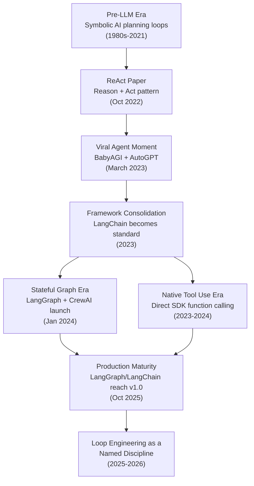

# 03 — History and Evolution of Loop Engineering

> 📘 File 3 of 25 — Loop Engineering Knowledge Library
> Phase: Foundations
> Prerequisite: `01_What_is_Loop_Engineering.md`, `02_Why_Loop_Engineering.md`

---

## 1. Introduction

### Topic Overview

Loop Engineering as a *named* discipline is young — but the idea of wrapping an AI model in a repeating cycle of reasoning and action has a clear, traceable history stretching back through classical AI planning, into the first LLM agent papers of 2022, through a chaotic viral moment in early 2023, and into the mature, production-grade frameworks used today.

This file traces that path so you understand not just *what* modern loop patterns look like, but *why* they evolved the way they did — because nearly every design choice in a modern framework like LangGraph exists specifically to fix a failure that an earlier, cruder loop demonstrated publicly.

### Why This Topic Matters

Knowing the history prevents you from re-learning painful lessons the hard way. AutoGPT's infamous cost overruns, BabyAGI's memory limitations, and the "unstructured while-loop" era's reliability problems are not abstract warnings — they're documented, public failures that directly shaped the safeguards described throughout this library. Understanding *why* a safeguard exists makes you far less likely to skip it.

---

## 2. Definition

### What Is It? (Simple Explanation)

Think of it like the history of seatbelts in cars. Early cars had none. People got hurt. Engineers studied *why* — and added seatbelts, then airbags, then crumple zones — each safeguard responding to a specific, observed failure. Agent loops evolved the same way: early loops had no guardrails, developers watched them fail in specific, repeatable ways, and the field responded with specific engineering fixes.

### Technical Definition

> The **evolution of Loop Engineering** describes the progression from classical symbolic AI planning loops (pre-2020), through the emergence of LLM-native reasoning-action loops (2022), the viral open-source "autonomous agent" moment (March 2023), the framework consolidation era (2023–2024), the stateful/graph-based production era (2024–2025), and the current maturity phase (2025–2026) in which loop reliability, cost control, and multi-agent coordination are treated as first-class engineering concerns rather than experimental afterthoughts.

---

## 3. Core Concepts

### Fundamental Ideas

- **Pre-LLM agent loops existed decades before ChatGPT** — the *concept* of a perceive-think-act cycle comes from classical AI and robotics, not language models
- **The 2022 ReAct paper is the direct ancestor of nearly every modern agent loop** — its "reason, then act, then observe" pattern is still the core skeleton described in file 01
- **The March 2023 AutoGPT/BabyAGI moment proved public demand *and* public failure simultaneously** — massive adoption alongside massive, visible reliability problems
- **Every major framework since 2023 exists to fix a specific documented failure** from the loops that came before it

### Key Terminology

- **Symbolic AI planning** — pre-LLM approaches to giving software the ability to plan a sequence of actions toward a goal
- **Viral agent moment** — the March 2023 period when AutoGPT and BabyAGI drove massive public interest in autonomous LLM loops
- **Framework consolidation** — the 2023–2024 period where dozens of experimental agent projects narrowed into a smaller set of production-grade frameworks
- **Stateful graph era** — the 2024 shift (led by LangGraph) toward modeling loops as explicit, persistent, cyclic graphs rather than simple while-loops

---

## 4. How It Works

### Step-by-Step Explanation: The Timeline

**Phase 0 — Pre-LLM Foundations (1980s–2021)**
Long before LLMs, AI researchers built systems with perceive-think-act cycles — robotics control loops, symbolic planners, and multi-agent systems research going back to the 1980s. These systems lacked natural language reasoning, but the *loop shape itself* — sense, decide, act, repeat — is directly inherited by modern agent loops.

**Phase 1 — The LLM Reasoning-Action Breakthrough (2022)**
In October 2022, researchers from Princeton and Google published the ReAct paper, five months before AutoGPT existed. ReAct demonstrated that prompting a language model to alternate between explicit reasoning traces and concrete actions — then feeding the result of each action back into the next reasoning step — dramatically improved an LLM's ability to complete multi-step tasks. This is the direct technical ancestor of the loop skeleton in `01_What_is_Loop_Engineering.md`.

**Phase 2 — The Viral Autonomous Agent Moment (March 2023)**
Two projects launched within days of each other and changed the field overnight:

- **BabyAGI**, released by Yohei Nakajima, was roughly 140 lines of Python that publicly demonstrated the canonical autonomous-agent loop for the first time: objective, task creation, execution, reprioritization, repeat.
- **AutoGPT**, released two days later by Toran Bruce Richards under the name Significant Gravitas, paired GPT-4 with a self-prompting loop, web browsing, file operations, and code execution — and became the top-trending GitHub repository within days, crossing 100,000 stars within weeks.

Both projects proved enormous public appetite for autonomous loops — and, just as importantly, publicly exposed the failure modes described in `02_Why_Loop_Engineering.md`. AutoGPT in particular was widely reported as unstable and unreliable, capable of running up substantial API costs without reaching its goal — the canonical real-world example of a "runaway loop."

**Phase 3 — Framework Consolidation (2023)**
As the initial excitement met the reality of unreliable loops, the ecosystem consolidated around more structured tooling. LangChain, originally released in October 2022 by Harrison Chase, became the de facto framework for building LLM agents through 2023, packaging the ReAct pattern, tool use, and memory management into a reusable library rather than requiring every developer to hand-roll their own loop from scratch.

**Phase 4 — The Stateful Graph Era (2024)**
The single biggest architectural shift in loop history arrived in January 2024. The LangChain team released LangGraph, modeling agent workflows as directed graphs instead of linear chains — directly solving the state-management failures that plagued 2023-era loops. LangGraph addressed the core cause of most production agent failures at the time: agents that lost their place, repeated work, or crashed mid-workflow because earlier frameworks discarded state between steps. The same month, João Moura released CrewAI, built on top of LangGraph, introducing a higher-level "Crew" abstraction where developers define agents by role, goal, and backstory rather than raw graph nodes — making multi-agent loops (file 15) dramatically more approachable.

**Phase 5 — Native Tool Use and the "Do You Even Need a Framework?" Debate (2023–2024)**
In parallel, OpenAI shipped native function calling in June 2023, and Anthropic released its own tool use API, giving developers a way to build simple loops by calling a model provider's SDK directly — without any framework at all. This sparked an ongoing, healthy debate (still relevant today, covered in file 22) about when a full framework like LangGraph earns its complexity versus when a hand-rolled loop is simpler and more debuggable.

**Phase 6 — Production Maturity (2024–2026)**
Frameworks that survived the consolidation period matured rapidly. LangChain and LangGraph both reached a stable 1.0 release in October 2025, signaling that the ecosystem had moved from experimental tooling to production-grade infrastructure, with adoption at large organizations and a formal commitment to API stability. This maturity phase is also when Loop Engineering began to be discussed as a discipline in its own right — separate from "prompt engineering" or "just using LangChain" — with dedicated attention to cost control, multi-agent coordination, and loop reliability as first-class concerns.

### Internal Workflow: What Changed Structurally

| Era | How State Was Handled | How Termination Was Handled | Typical Failure |
|---|---|---|---|
| Pre-2022 (symbolic AI) | Explicit but rigid, hand-coded | Explicit but inflexible | Too brittle for open-ended tasks |
| 2022 (ReAct) | Passed via growing prompt context | Model self-reported completion | Context grew unbounded over long tasks |
| March 2023 (AutoGPT/BabyAGI) | Task lists + early vector memory | Mostly model self-report, loosely bounded | Runaway loops, high cost, drift |
| 2023 (LangChain era) | Chain-based, still largely linear | Configurable but often ad hoc | Lost state on complex branching tasks |
| 2024+ (LangGraph era) | Explicit persistent state graph, checkpointed | Explicit conditional edges + hard limits | Far more reliable, but more setup complexity |

---

## 5. Architecture / Workflow

### Mermaid Flowchart



---

## 6. Components / Types

### Main Milestones by Category

**Foundational Papers:**
- ReAct (Yao et al., 2022) — the reasoning-action loop pattern
- Reflexion (Shinn et al., 2023) — self-critique and retry loops

**Viral Open-Source Projects:**
- BabyAGI (March 2023) — task-list-based loop
- AutoGPT (March 2023) — goal-driven autonomous loop with tool access

**Production Frameworks:**
- LangChain (Oct 2022) — the first mainstream agent-building library
- LangGraph (Jan 2024) — stateful, cyclic graph-based execution
- CrewAI (Jan 2024) — role-based multi-agent abstraction over LangGraph
- Google ADK, AutoGen, and others (2024–2025) — competing/complementary approaches, covered fully in file 22

### Categories of Evolutionary Pressure

Every major shift in this history was driven by one of three pressures:

1. **Reliability pressure** — loops that worked in demos but failed in production (drove the LangGraph shift)
2. **Cost pressure** — loops that worked but were too expensive to run at scale (drove budget-aware design patterns)
3. **Complexity pressure** — loops that needed to coordinate multiple specialized agents, not just one (drove multi-agent frameworks like CrewAI)

---

## 7. Examples

### Beginner Example

A simplified recreation of BabyAGI's core loop concept — task creation, execution, and reprioritization — showing why "history" isn't abstract, it's directly reproducible:

```python
def baby_agi_style_loop(objective, max_iterations=5):
    task_list = [f"Create a first task for: {objective}"]
    completed = []

    for i in range(max_iterations):
        if not task_list:
            break

        current_task = task_list.pop(0)
        result = llm_call(f"Complete this task: {current_task}")
        completed.append({"task": current_task, "result": result})

        # The "reprioritization" step BabyAGI made famous
        new_tasks = llm_call(
            f"Given this result: {result}, and the objective: {objective}, "
            f"what new tasks (if any) should be added? Return a list."
        )
        task_list.extend(parse_task_list(new_tasks))

    return completed

def parse_task_list(text):
    return [line.strip("- ") for line in text.split("\n") if line.strip()]
```

### Intermediate Example

Illustrating the *specific* problem LangGraph's stateful design solved — an early-style loop that loses state across a branch, versus one that preserves it explicitly:

```python
# EARLY-STYLE (2023) — state implicitly passed through prompt text,
# easy to lose when logic branches
def early_style_branching_loop(task):
    context = f"Task: {task}"
    response = llm_call(context)

    if "needs_research" in response:
        # Branching here often meant re-building context from scratch,
        # silently dropping earlier reasoning
        research_result = llm_call("Research this topic")
        final = llm_call(f"Write conclusion based on: {research_result}")
        # Original task context may not even be in this final prompt!
    else:
        final = llm_call(f"{context}\nConclude directly.")

    return final


# GRAPH-STYLE (LangGraph-inspired) — state is an explicit object
# that persists across every branch, by design
def graph_style_branching_loop(task):
    state = {"task": task, "history": []}

    def reason_node(state):
        response = llm_call(f"Task: {state['task']}")
        state["history"].append(response)
        return state

    def research_node(state):
        result = llm_call(f"Research this topic: {state['task']}")
        state["history"].append(result)
        return state

    def conclude_node(state):
        # State["task"] and full state["history"] are still here —
        # nothing was silently dropped by the branch
        full_context = f"Task: {state['task']}\nHistory: {state['history']}"
        state["final"] = llm_call(f"Conclude based on: {full_context}")
        return state

    state = reason_node(state)
    if "needs_research" in state["history"][-1]:
        state = research_node(state)
    state = conclude_node(state)

    return state["final"]
```

### Advanced / Real-World Example

A conceptual timeline-aware "cost governor" — the kind of safeguard that exists specifically *because* of AutoGPT's well-documented cost overrun problems:

```python
import time
from dataclasses import dataclass, field

@dataclass
class LoopCostGovernor:
    """
    A safeguard directly inspired by AutoGPT-era cost overruns.
    Tracks and hard-caps spend across a running loop.
    """
    max_usd_budget: float = 1.00
    cost_per_1k_tokens: float = 0.003
    tokens_used: int = 0
    start_time: float = field(default_factory=time.time)
    max_seconds: float = 60.0

    def estimated_cost(self):
        return (self.tokens_used / 1000) * self.cost_per_1k_tokens

    def check_budget(self):
        if self.estimated_cost() >= self.max_usd_budget:
            raise RuntimeError(
                f"Budget exceeded: ${self.estimated_cost():.4f} "
                f">= ${self.max_usd_budget}"
            )
        if time.time() - self.start_time > self.max_seconds:
            raise RuntimeError("Time budget exceeded.")

    def record(self, tokens_this_call):
        self.tokens_used += tokens_this_call
        self.check_budget()


def governed_loop(goal, max_iterations=20):
    governor = LoopCostGovernor(max_usd_budget=0.50, max_seconds=90)
    state = {"goal": goal, "history": []}

    for i in range(max_iterations):
        try:
            response, tokens = llm_call_with_token_count(state)
            governor.record(tokens)  # This line is the entire history lesson
            state["history"].append(response)

            if is_complete(response):
                return {"status": "success", "result": response}

        except RuntimeError as budget_error:
            return {"status": "budget_stopped", "reason": str(budget_error)}

    return {"status": "max_iterations", "history": state["history"]}
```

---

## 8. Best Practices

### Do's

- ✅ Study documented public failures (AutoGPT's cost overruns, early context-loss bugs) as free lessons — someone already paid the price of discovering them
- ✅ When choosing a framework in 2026, understand *which era's problems* it was built to solve — this tells you what it's actually good at
- ✅ Recognize that "state as an explicit, persistent object" (the LangGraph-era insight) is now considered a baseline requirement, not an advanced feature

### Recommended Techniques

- Before building a custom loop, ask "has this specific failure mode already been solved publicly?" — it usually has, and reading how saves significant engineering time
- When evaluating a new framework, check what problem its release specifically addressed (this file's Phase descriptions are a starting template for that kind of research)

---

## 9. Common Mistakes

### Frequent Errors

| Mistake | Historical Lesson Being Ignored |
|---|---|
| Building a loop with no cost controls | Ignores the AutoGPT cost-overrun lesson of March 2023 |
| Passing state only through growing prompt text | Ignores the exact problem LangGraph was built to solve in 2024 |
| Assuming "the model will just know when it's done" | Ignores years of documented hallucinated-completion failures |
| Treating framework choice as arbitrary | Ignores that each major framework was purpose-built for specific failure classes |

### How to Avoid Them

- Read a framework's own "why we built this" documentation before adopting it — it almost always describes the exact historical failure it exists to prevent
- Treat this file's timeline as a checklist: does your loop have a solution for each documented era's core problem (context loss, runaway cost, state fragility)?

---

## 10. Advantages & Limitations

### Benefits of Understanding This History

- Avoids re-discovering well-documented failure modes the hard way
- Makes framework selection (file 22) a research-informed decision instead of a popularity contest
- Provides concrete, citable examples when explaining loop design tradeoffs to others

### Limitations of a Historical Approach

- The field moves fast — any timeline, including this one, will need updates as new frameworks and papers emerge
- Historical lessons describe *what went wrong before*, not necessarily every failure mode you'll encounter in a genuinely novel use case
- Not every "old" approach is obsolete — simple while-loops with direct SDK calls remain the right choice for genuinely simple tasks, even in 2026

---

## 11. Comparison

### Compare Eras Directly

| Era | Representative Project | Core Innovation | Core Weakness |
|---|---|---|---|
| 2022 | ReAct (paper) | Reasoning + acting pattern | No production tooling around it |
| March 2023 | AutoGPT / BabyAGI | Proved autonomous loops were possible & wanted | Unreliable, expensive, no state persistence |
| 2023 | LangChain | Reusable framework for agent-building | Still largely linear/chain-based |
| Jan 2024 | LangGraph | Explicit, persistent, cyclic state graphs | Higher setup complexity |
| Jan 2024 | CrewAI | Role-based multi-agent abstraction | Less low-level control than raw LangGraph |
| Oct 2025 | LangGraph/LangChain 1.0 | Production-grade API stability | N/A — current maturity baseline |

### Summary Table

| Question | 2022-2023 Answer | 2024-2026 Answer |
|---|---|---|
| How is state tracked? | Implicitly, via growing prompt text | Explicitly, via persistent typed state objects |
| How are costs controlled? | Rarely, if at all | Budget governors, iteration caps, token tracking |
| How is multi-agent coordination done? | Ad hoc, hand-rolled | Structured frameworks (CrewAI, ADK, AutoGen) |
| Is "Loop Engineering" a named discipline? | No | Emerging as one |

---

## 12. Summary

### Key Takeaways

- Agent loops didn't start with LLMs — the perceive-think-act shape traces back to classical AI, but ReAct (Oct 2022) is the direct technical ancestor of modern LLM agent loops
- The March 2023 AutoGPT/BabyAGI moment simultaneously proved massive demand and massive, public reliability problems — nearly every safeguard in this library exists partly *because* of that moment
- LangGraph's January 2024 release marks the single biggest architectural shift: explicit, persistent state instead of state implicitly buried in growing prompt text
- By October 2025, the leading frameworks reached production-grade stability — the field has matured from "exciting experiment" to "engineering discipline" in about three years

### Cheat Sheet

```
2022 (Oct)  → ReAct paper: reason + act loop pattern established
2023 (Mar)  → AutoGPT + BabyAGI go viral, expose reliability problems
2023        → LangChain becomes the standard agent-building framework
2024 (Jan)  → LangGraph + CrewAI launch: explicit state, multi-agent roles
2025 (Oct)  → LangChain + LangGraph reach stable v1.0
2025-2026   → Loop Engineering emerges as its own named discipline
```

---

## 13. Glossary

| Term | Definition |
|---|---|
| **ReAct** | The 2022 paper/pattern combining explicit reasoning traces with concrete actions in an LLM loop |
| **BabyAGI** | An early (March 2023) autonomous agent loop using task creation and reprioritization |
| **AutoGPT** | An early (March 2023) autonomous agent loop notable for going viral and exposing cost/reliability issues |
| **LangChain** | A framework (Oct 2022) that became the standard toolkit for building LLM-powered agents |
| **LangGraph** | A framework (Jan 2024) modeling agent loops as explicit, persistent, cyclic state graphs |
| **CrewAI** | A framework (Jan 2024) offering a role-based abstraction for multi-agent loops, built atop LangGraph |
| **Framework consolidation** | The period where many experimental agent projects narrowed into fewer, production-grade frameworks |

---

## 14. References & Further Reading

### Official Documentation

- LangGraph — [Official Documentation](https://docs.langchain.com/oss/python/langgraph/overview)
- LangGraph — [GitHub Repository](https://github.com/langchain-ai/langgraph)

### Research Papers

- Yao et al., 2022 — *"ReAct: Synergizing Reasoning and Acting in Language Models"* — the foundational agent loop paper
- Shinn et al., 2023 — *"Reflexion: Language Agents with Verbal Reinforcement Learning"*

### Further Reading

- Agentic History Project — a maintained public timeline of agentic AI milestones (agentichistory.org)
- LangChain Blog — *"LangChain and LangGraph Agent Frameworks Reach v1.0"* (blog.langchain.com)

### Where to Go Next in This Library

- Previous file: `02_Why_Loop_Engineering.md`
- Next file: `04_Core_Concepts.md` — the fundamental building blocks every loop shares, regardless of era
- Related: `22_Frameworks_and_LLM_Compatibility.md` — a full modern comparison of LangGraph, ADK, AutoGen, CrewAI, and raw-API approaches

---

*This is File 3 of 25 in the Loop Engineering Knowledge Library. See `README.md` for the full index and suggested reading paths.*
