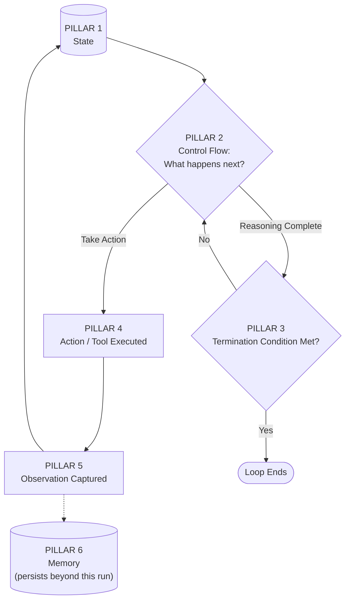

# 04 — Core Concepts of Loop Engineering

> 📘 File 4 of 25 — Loop Engineering Knowledge Library
> Phase: Foundations
> Prerequisite: `01_What_is_Loop_Engineering.md`, `02_Why_Loop_Engineering.md`, `03_History_and_Evolution.md`

---

## 1. Introduction

### Topic Overview

Files 01–03 built the *why* and *when* of Loop Engineering. This file builds the conceptual skeleton everything else in the library hangs off: **six pillars** that show up in every loop you'll ever build or study, regardless of framework, model provider, or use case.

Think of this file as the "table of contents for your mental model." Once these six pillars are solid, every later file (state management, tool calling, multi-agent orchestration) is really just a deep dive into one pillar.

### Why This Topic Matters

Frameworks change constantly — LangGraph, Google ADK, AutoGen, CrewAI, and whatever comes next all use different names, different APIs, and different abstractions. But underneath all of them are the same six concepts. Learn the concepts, and you can read *any* framework's source code and immediately recognize what you're looking at.

---

## 2. Definition

### What Is It? (Simple Explanation)

Imagine describing "a car" to someone who's never seen one, without naming a specific brand. You wouldn't say "it has a Toyota badge and a Honda dashboard" — you'd say "it has an engine, wheels, a steering mechanism, brakes, fuel, and a chassis holding it together." Any car, regardless of make, has those six things. Loop Engineering's core concepts work the same way.

### Technical Definition

> The **core concepts of Loop Engineering** are the six framework-agnostic structural elements — **State, Control Flow, Termination Conditions, Actions/Tools, Observations, and Memory** — that together define any agentic loop's behavior. Every design decision in a loop-based system can be traced back to a choice made about one or more of these six elements.

---

## 3. Core Concepts

### The Six Pillars

| # | Pillar | One-Line Definition | Deep Dive File |
|---|---|---|---|
| 1 | **State** | The information the loop carries and updates across iterations | `11_State_Context_and_Memory.md` |
| 2 | **Control Flow** | The logic deciding what happens next given current state | `08_Loop_Architecture.md`, `13_Planning_and_Reasoning.md` |
| 3 | **Termination Conditions** | The rule(s) that stop the loop | `07_Loop_Lifecycle.md` |
| 4 | **Actions / Tools** | What the loop *does* in the world each iteration | `14_Tool_and_Function_Calling.md` |
| 5 | **Observations** | The feedback the loop receives after an action | `12_Feedback_and_Iteration.md` |
| 6 | **Memory** | What persists beyond a single loop run | `11_State_Context_and_Memory.md` |

### Key Terminology

- **Pillar** — one of the six structural elements every loop is built from (used throughout this file)
- **Ephemeral state** — state that exists only for the current loop run and is discarded afterward
- **Persistent memory** — information that survives across separate loop runs (different from ephemeral state)
- **Decision point** — a moment in the loop where control flow must choose between multiple possible next actions

---

## 4. How It Works

### Step-by-Step Explanation

Here's how the six pillars interact during a single loop cycle — read this alongside the flowchart in Section 5:

1. **State** enters the iteration, holding everything known so far
2. **Control Flow** examines that state and decides: reason more, take an action, or stop
3. If the decision is to act, an **Action/Tool** is selected and executed
4. The result of that action becomes an **Observation**
5. The observation is merged back into **State**
6. If relevant, information is also written to **Memory** for use beyond this single run
7. **Control Flow** checks the **Termination Condition** against the updated state
8. If not satisfied, the cycle repeats from step 2 with the new state

### Internal Workflow

Each pillar maps to a specific piece of code in a real loop. Here's a minimal but complete example labeling each pillar explicitly:

```python
class LoopState:
    """PILLAR 1: STATE — everything the loop currently knows"""
    def __init__(self, goal):
        self.goal = goal
        self.history = []
        self.iteration = 0
        self.is_done = False


def control_flow(state: LoopState):
    """PILLAR 2: CONTROL FLOW — decides what happens next"""
    if state.iteration == 0:
        return "reason"
    last_entry = state.history[-1]
    if last_entry.get("suggests_tool_use"):
        return "act"
    return "reason"


def should_terminate(state: LoopState, max_iterations=10):
    """PILLAR 3: TERMINATION CONDITIONS"""
    return state.is_done or state.iteration >= max_iterations


def execute_action(action_name, action_input):
    """PILLAR 4: ACTIONS / TOOLS — what the loop does in the world"""
    tools = {
        "search": lambda q: f"Search results for: {q}",
        "calculate": lambda expr: str(eval(expr, {"__builtins__": {}})),
    }
    return tools.get(action_name, lambda x: "Unknown tool")(action_input)


def observe(raw_result):
    """PILLAR 5: OBSERVATIONS — structured feedback from an action"""
    return {"observation": raw_result, "timestamp": "now"}


def update_memory(long_term_memory: dict, state: LoopState):
    """PILLAR 6: MEMORY — what persists beyond this single run"""
    long_term_memory[state.goal] = state.history[-3:]  # keep a recent summary
    return long_term_memory


def run_loop(goal, long_term_memory):
    state = LoopState(goal)

    while not should_terminate(state):
        decision = control_flow(state)

        if decision == "act":
            result = execute_action("search", state.goal)
            obs = observe(result)
            state.history.append(obs)
            long_term_memory = update_memory(long_term_memory, state)
        else:
            state.is_done = True  # simplified reasoning-complete signal

        state.iteration += 1

    return state, long_term_memory
```

Every one of the six pillars is present, labeled, and separable — which is exactly how you should read any real framework's source code.

---

## 5. Architecture / Workflow

### Mermaid Flowchart



---

## 6. Components / Types

### Main Components

The six pillars aren't equally "visible" in every framework — some are implicit. Here's how to spot each one even when a framework hides it behind an abstraction:

| Pillar | Where to Look in LangGraph | Where to Look in a Raw Python Loop |
|---|---|---|
| State | `StateGraph`'s `TypedDict` schema | A dict or dataclass passed between functions |
| Control Flow | Conditional edges (`add_conditional_edges`) | `if/elif` logic deciding the next step |
| Termination | Edge routing to `END` node | A `while` loop's exit condition |
| Actions/Tools | `ToolNode`, bound tools | Direct function calls |
| Observations | Tool result messages appended to state | Return values captured into a variable |
| Memory | Checkpointer (SQLite/Postgres) | A database write, file save, or vector store insert |

### Categories

The six pillars split naturally into two groups:

- **Per-iteration pillars** (reset or updated every cycle): Control Flow, Actions/Tools, Observations
- **Cross-iteration pillars** (persist across the whole run, or beyond it): State, Termination Conditions, Memory

---

## 7. Examples

### Beginner Example

Identifying all six pillars in the simplest possible loop — a countdown:

```python
def countdown_loop(start):
    state = {"count": start}                          # PILLAR 1: State

    while True:
        if state["count"] <= 0:                        # PILLAR 3: Termination
            break

        print(f"Counting: {state['count']}")            # PILLAR 4: Action (printing)
        observation = state["count"] - 1                 # PILLAR 5: Observation
        state["count"] = observation                     # feeds back into State

    return "Liftoff!"                                    # PILLAR 2: Control flow
                                                          # is the implicit `while True`
```

Even a loop with no LLM at all demonstrates every pillar except memory (which only matters when something persists *beyond* this single function call).

### Intermediate Example

An LLM research loop showing all six pillars working together, including memory that persists across runs:

```python
import json
import os

MEMORY_FILE = "research_memory.json"

def load_memory():
    """PILLAR 6: MEMORY — loaded at the start of a run"""
    if os.path.exists(MEMORY_FILE):
        with open(MEMORY_FILE) as f:
            return json.load(f)
    return {}

def save_memory(memory):
    with open(MEMORY_FILE, "w") as f:
        json.dump(memory, f)

def research_loop(topic, max_iterations=5):
    memory = load_memory()  # PILLAR 6: recall from past runs

    state = {                              # PILLAR 1: STATE
        "topic": topic,
        "findings": memory.get(topic, []),  # seed state from memory if available
        "iteration": 0,
    }

    while state["iteration"] < max_iterations:               # PILLAR 3: Termination
        decision = decide_next_step(state)                     # PILLAR 2: Control Flow

        if decision == "search":
            raw_result = search_tool(state["topic"])            # PILLAR 4: Action
            observation = {"finding": raw_result}                 # PILLAR 5: Observation
            state["findings"].append(observation)

        elif decision == "conclude":
            memory[topic] = state["findings"]  # PILLAR 6: write back to memory
            save_memory(memory)
            return state["findings"]

        state["iteration"] += 1

    return state["findings"]


def decide_next_step(state):
    return "conclude" if len(state["findings"]) >= 3 else "search"

def search_tool(query):
    return f"A finding about {query}"
```

### Advanced / Real-World Example

A multi-tool agent loop with a genuinely separated, explicit implementation of each pillar — the shape you'd find inside a real production system:

```python
from dataclasses import dataclass, field
from typing import Callable
import time

@dataclass
class LoopState:                                     # PILLAR 1: STATE
    goal: str
    findings: list = field(default_factory=list)
    tool_calls_made: int = 0
    final_answer: str = None


class TerminationPolicy:                              # PILLAR 3: TERMINATION
    def __init__(self, max_iterations=10, max_seconds=60):
        self.max_iterations = max_iterations
        self.max_seconds = max_seconds
        self.start = time.time()

    def should_stop(self, state: LoopState, iteration: int):
        if state.final_answer is not None:
            return True, "goal_achieved"
        if iteration >= self.max_iterations:
            return True, "max_iterations"
        if time.time() - self.start > self.max_seconds:
            return True, "timeout"
        return False, None


class ToolRegistry:                                   # PILLAR 4: ACTIONS/TOOLS
    def __init__(self):
        self.tools: dict[str, Callable] = {}

    def register(self, name, fn):
        self.tools[name] = fn

    def execute(self, name, **kwargs):
        if name not in self.tools:
            return {"error": f"Unknown tool: {name}"}
        try:
            return {"result": self.tools[name](**kwargs)}
        except Exception as e:
            return {"error": str(e)}


class ControlFlow:                                     # PILLAR 2: CONTROL FLOW
    def decide(self, state: LoopState):
        if len(state.findings) >= 3:
            return {"action": "conclude"}
        return {"action": "tool_call", "tool": "search", "args": {"query": state.goal}}


class MemoryStore:                                     # PILLAR 6: MEMORY
    def __init__(self):
        self._store = {}

    def remember(self, key, value):
        self._store[key] = value

    def recall(self, key):
        return self._store.get(key)


def full_loop(goal, memory: MemoryStore, tools: ToolRegistry):
    state = LoopState(goal=goal)
    termination = TerminationPolicy(max_iterations=8, max_seconds=45)
    control = ControlFlow()

    iteration = 0
    while True:
        stop, reason = termination.should_stop(state, iteration)
        if stop:
            memory.remember(goal, state.findings)  # PILLAR 6: persist beyond this run
            return {"state": state, "stopped_because": reason}

        decision = control.decide(state)

        if decision["action"] == "tool_call":
            raw = tools.execute(decision["tool"], **decision["args"])  # ACTION
            observation = {"iteration": iteration, "data": raw}          # PILLAR 5
            state.findings.append(observation)
            state.tool_calls_made += 1

        elif decision["action"] == "conclude":
            state.final_answer = f"Based on {len(state.findings)} findings about {goal}"

        iteration += 1
```

---

## 8. Best Practices

### Do's

- ✅ When designing any new loop, explicitly write down your design for all six pillars *before* writing code — most bugs trace back to a pillar that was never deliberately designed
- ✅ Keep pillars separated in your code (separate functions/classes), even in small projects — it makes debugging dramatically easier
- ✅ When reading an unfamiliar framework, identify each of the six pillars in its documentation first — this gives you a map before you dive into API details

### Recommended Techniques

- Use this file's Section 4 code skeleton as a template for any new loop project — fill in each pillar's function with your actual logic
- When debugging a misbehaving loop, ask "which pillar is responsible for this behavior?" — it narrows the search dramatically

---

## 9. Common Mistakes

### Frequent Errors

| Mistake | Which Pillar Was Neglected |
|---|---|
| Agent loses context mid-task | State (not carried forward correctly) |
| Agent takes the same action repeatedly with no new info | Observations (not actually being used to inform Control Flow) |
| Agent never stops, or stops too early | Termination Conditions (poorly defined) |
| Agent "forgets" lessons from a previous run | Memory (conflated with ephemeral State, or missing entirely) |
| Agent takes wildly unpredictable actions | Control Flow (too much unconstrained model freedom) |

### How to Avoid Them

- Treat State and Memory as genuinely different things: State is "what this run knows," Memory is "what persists across runs" — conflating them causes both context bloat and lost long-term learning
- Always trace a misbehaving loop back to exactly one (or more) of the six pillars rather than treating it as a vague "the model is being dumb" problem

---

## 10. Advantages & Limitations

### Benefits of This Six-Pillar Model

- Framework-agnostic — works for LangGraph, ADK, AutoGen, or a hand-rolled loop equally well
- Makes debugging systematic instead of guess-and-check
- Provides a shared vocabulary for discussing loop design with other engineers
- Scales down to simple loops and up to complex multi-agent systems without needing a different model

### Limitations

- Real systems sometimes blur the lines between pillars (e.g., a "reflection" step is partly Control Flow, partly Observation processing) — the model is a teaching aid, not a rigid law
- Doesn't by itself tell you *how* to implement any given pillar well — that's what the rest of this library covers in depth

---

## 11. Comparison

### Compare with Related Concepts

| Model | What It Describes | Relationship to the Six Pillars |
|---|---|---|
| **MVC (Model-View-Controller)** | Software architecture pattern for UIs | Loosely analogous — State ≈ Model, Control Flow ≈ Controller |
| **Finite State Machines** | Formal model of state + transitions | Termination Conditions and Control Flow map closely to FSM transitions |
| **The OODA Loop** (Observe-Orient-Decide-Act) | Military/business decision-making loop | Nearly identical shape — Observe ≈ Observations, Decide ≈ Control Flow, Act ≈ Actions |

### Summary Table

| Pillar | Analogous to (Software) | Analogous to (Human Cognition) |
|---|---|---|
| State | Application memory/variables | Working memory |
| Control Flow | If/else logic, routing | Decision-making |
| Termination | Exit conditions | Sense of "I'm done" |
| Actions/Tools | Function calls, API requests | Physical actions |
| Observations | Return values, API responses | Sensory feedback |
| Memory | Database, persistent storage | Long-term memory |

---

## 12. Summary

### Key Takeaways

- Every agentic loop, regardless of framework, is built from six framework-agnostic pillars: **State, Control Flow, Termination Conditions, Actions/Tools, Observations, and Memory**
- These pillars interact in a predictable cycle: state informs control flow, control flow triggers actions, actions produce observations, observations update state and sometimes memory, and termination conditions are checked every cycle
- Learning to identify these six pillars in *any* framework's source code is the single highest-leverage skill for understanding agent systems quickly
- Most loop bugs trace back to exactly one pillar being poorly designed — this model turns vague debugging into systematic investigation

### Cheat Sheet

```
THE SIX PILLARS OF ANY LOOP:

1. STATE               — what the loop currently knows
2. CONTROL FLOW         — what happens next, and why
3. TERMINATION CONDITIONS — when the loop stops
4. ACTIONS / TOOLS      — what the loop does in the world
5. OBSERVATIONS         — feedback from those actions
6. MEMORY               — what persists beyond this one run

Debug tip: misbehaving loop? Ask "which pillar is broken?"
```

---

## 13. Glossary

| Term | Definition |
|---|---|
| **State** | The information a loop carries and updates across its own iterations |
| **Control Flow** | The logic determining what a loop does next given its current state |
| **Termination Condition** | A rule that, when satisfied, stops loop execution |
| **Action / Tool** | An operation a loop performs that affects or queries the outside world |
| **Observation** | The result/feedback received after an action is taken |
| **Memory** | Information that persists beyond a single loop execution |
| **Ephemeral state** | State that exists only for the duration of the current loop run |
| **Decision point** | A moment where control flow selects between multiple possible next steps |

---

## 14. References & Further Reading

### Official Documentation

- LangGraph — [Conceptual Guide: State, Nodes, and Edges](https://docs.langchain.com/oss/python/langgraph/overview)

### Research Papers

- Yao et al., 2022 — *"ReAct: Synergizing Reasoning and Acting in Language Models"*

### Further Reading

- Boyd, J. — *The OODA Loop* — the classic decision-cycle model that predates and parallels agentic loop design

### Where to Go Next in This Library

- Previous file: `03_History_and_Evolution.md`
- Next file: `05_Key_Terminology.md` — the complete vocabulary glossary for this library
- Deep dives: `11_State_Context_and_Memory.md`, `13_Planning_and_Reasoning.md`, `14_Tool_and_Function_Calling.md` — each expands one pillar from this file in full depth

---

*This is File 4 of 25 in the Loop Engineering Knowledge Library. See `README.md` for the full index and suggested reading paths.*
