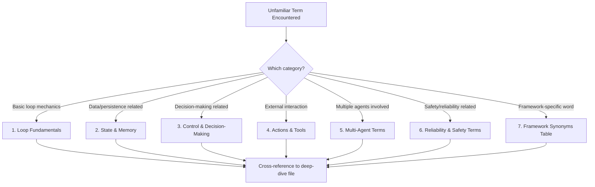

# 05 — Key Terminology

> 📘 File 5 of 25 — Loop Engineering Knowledge Library
> Phase: Foundations
> Prerequisite: `01_What_is_Loop_Engineering.md` through `04_Core_Concepts.md`

---

## 1. Introduction

### Topic Overview

Files 01–04 introduced terms as they became relevant. This file collects the **complete, organized vocabulary** of Loop Engineering into one reference — the file you'll come back to when you hit an unfamiliar term anywhere else in this library, or in any framework's documentation.

### Why This Topic Matters

Different frameworks use different words for the same idea — LangGraph calls it a "node," another framework might call it a "step," a research paper might call it an "action." Without a shared vocabulary, it's easy to think two frameworks work completely differently when they're actually using the exact same underlying concept with different names. This file exists to inoculate you against that confusion.

---

## 2. Definition

### What Is It? (Simple Explanation)

This file works like the glossary at the back of a textbook — except it's placed at the *front* of this library, because in a fast-moving field like this, you'll hit unfamiliar terms constantly and need a fast, reliable place to check them.

### Technical Definition

> This file provides a **structured terminology reference** for Loop Engineering, organized by conceptual category rather than strict alphabetical order, cross-referenced to the library file where each term is explored in full depth, and annotated with framework-specific synonyms where relevant to reduce confusion when reading external documentation.

---

## 3. Core Concepts

### How This Glossary Is Organized

Terms are grouped into seven categories that mirror the library's own structure:

1. Loop Fundamentals
2. State & Memory
3. Control & Decision-Making
4. Actions & Tools
5. Multi-Agent Terms
6. Reliability & Safety Terms
7. Framework-Specific Synonyms

### Key Terminology (Preview)

The three terms worth memorizing before anything else, because they appear in nearly every other file:

- **Loop / Agentic Loop** — the repeating reason-act-observe cycle
- **Iteration** — one pass through that cycle
- **Agent** — the system that uses the loop to pursue a goal

---

## 4. How It Works

*(This section is adapted for a reference file: instead of explaining a mechanism, it explains how to use this glossary effectively.)*

### Step-by-Step Usage Guide

1. **Encounter an unfamiliar term** in this library or in external documentation
2. **Check the category tables below** — most terms are self-evident once grouped with related concepts
3. **Follow the cross-reference** to the file where the term is explored in depth, if you need more than a definition
4. **Check Section 7** if you're reading a specific framework's docs and a term doesn't match anything here — it's likely a framework-specific synonym for a concept covered elsewhere

---

## 5. Architecture / Workflow

### Mermaid Flowchart



---

## 6. Components / Types

*(Adapted: the "components" of this file are its seven glossary categories, detailed fully below.)*

### Category 1: Loop Fundamentals

| Term | Definition | Deep Dive |
|---|---|---|
| **Loop / Agentic Loop** | The repeating cycle of reasoning, action, and observation used to pursue a goal | `01` |
| **Iteration** | One complete pass through the loop's cycle | `01` |
| **Agent** | A system that uses one or more loops to autonomously pursue a goal | `01`, `15` |
| **Single-shot / Single-turn** | A single prompt-in, response-out interaction with no loop | `01` |
| **Loop Engineering** | The discipline of designing and optimizing agentic loops | `01` |
| **Convergence** | A loop making genuine progress toward its goal across iterations | `01` |
| **Drift** | An agent's actions gradually diverging from its original goal | `02` |
| **Runaway loop** | A loop lacking a satisfiable termination condition | `02`, `07` |

### Category 2: State & Memory

| Term | Definition | Deep Dive |
|---|---|---|
| **State** | Information a loop carries and updates across its own iterations | `04`, `11` |
| **Memory** | Information that persists beyond a single loop execution | `04`, `11` |
| **Ephemeral state** | State existing only for the current loop run | `04` |
| **Short-term memory** | Memory scoped to the current conversation/session | `11` |
| **Long-term memory** | Memory persisting across separate sessions/runs | `11` |
| **Context window** | The total amount of text an LLM can process in a single call | `11` |
| **Context rot** | Degraded reasoning caused by an overloaded or stale context window | `02`, `11` |
| **Checkpoint / Checkpointing** | Saving loop state at a point in time, enabling pause/resume | `08`, `11` |
| **Working memory** | The active, in-use subset of state during the current reasoning step | `11` |
| **Vector memory / Vector store** | Memory retrieval based on semantic similarity rather than exact match | `11` |

### Category 3: Control & Decision-Making

| Term | Definition | Deep Dive |
|---|---|---|
| **Control Flow** | The logic determining what a loop does next given current state | `04`, `08` |
| **Termination Condition** | A rule that, when satisfied, stops loop execution | `04`, `07` |
| **Decision Point** | A moment where control flow selects between multiple next steps | `04` |
| **Planning** | Determining a sequence of steps toward a goal before or during execution | `13` |
| **Reasoning Trace** | The explicit "thinking" text a model produces explaining its decision | `13` |
| **Reflection / Self-Critique** | A loop evaluating and critiquing its own prior output | `12` |
| **Conditional Edge** | (Graph-based frameworks) a routing rule that branches based on state | `08` |
| **Router** | A component that decides which path/node a loop should take next | `08` |

### Category 4: Actions & Tools

| Term | Definition | Deep Dive |
|---|---|---|
| **Action** | An operation a loop performs affecting or querying the outside world | `04`, `14` |
| **Tool / Function** | A specific callable capability made available to a loop (search, calculator, API) | `14` |
| **Tool Calling / Function Calling** | The mechanism by which a model requests a tool be executed | `14` |
| **Observation** | The result/feedback received after an action is taken | `04`, `12` |
| **Tool Schema** | The structured definition (name, parameters, description) of a tool | `14` |
| **Tool Result** | The formatted output returned to the model after tool execution | `14` |
| **Executor** | The component that actually carries out a chosen action | `04`, `09` |

### Category 5: Multi-Agent Terms

| Term | Definition | Deep Dive |
|---|---|---|
| **Multi-Agent System** | Multiple agent loops coordinating to achieve a shared or related goal | `15` |
| **Orchestrator / Supervisor** | An agent (or component) that coordinates other agents' work | `15`, `16` |
| **Sub-agent** | An agent invoked and managed by another (parent) agent | `15` |
| **Handoff** | Transferring control/context from one agent to another | `15` |
| **Agent-to-Agent Communication** | Message passing between separate agent loops | `15` |
| **Pipeline Pattern** | A multi-agent design where agents process work in a fixed sequence | `16` |
| **Debate Pattern** | A multi-agent design where agents argue different positions to reach a conclusion | `16` |
| **Voting / Consensus Pattern** | A multi-agent design where multiple agents' outputs are combined by agreement | `16` |

### Category 6: Reliability & Safety Terms

| Term | Definition | Deep Dive |
|---|---|---|
| **Verification** | An independent check confirming a claimed result is actually correct | `02`, `12` |
| **Hallucinated Completion** | A model incorrectly self-reporting that a task is finished | `02` |
| **Resource Bound** | A hard limit (iterations, time, tokens) constraining loop execution | `02`, `07` |
| **Graceful Degradation** | A system failing partially/informatively rather than catastrophically | `02`, `19` |
| **Human-in-the-loop** | A design where a human reviews or approves steps before the loop proceeds | `19` |
| **Guardrail** | A constraint preventing a loop from taking certain unsafe/unwanted actions | `19` |
| **Idempotency** | A property where repeating an action produces the same result without side effects | `19` |

### Category 7: Framework-Specific Synonyms

Different frameworks use different words for the same underlying concept. This table helps you translate:

| Concept | LangGraph Term | Generic/Academic Term | Google ADK-Style Term |
|---|---|---|---|
| A single step in the loop | Node | Iteration / Step | Step |
| Routing logic | Edge / Conditional Edge | Control Flow | Transition |
| Persisted state | Checkpointer | State Persistence | Session State |
| A callable capability | Tool (bound to a node) | Tool / Function | Tool |
| The overall structure | Graph / StateGraph | Loop / Workflow | Agent / Workflow |
| Multiple coordinating agents | Multi-agent graph | Multi-Agent System | Multi-Agent Orchestration |

> 🔎 A full framework-by-framework comparison lives in `22_Frameworks_and_LLM_Compatibility.md`.

---

## 7. Examples

*(Adapted for a reference file: worked examples of using this glossary in practice.)*

### Beginner Example

You read a tutorial that says: *"Add a conditional edge that routes to the tool node if the last message contains a tool call."* Using this glossary:

- **Conditional edge** → Category 3, "a routing rule that branches based on state" → this is Control Flow (file 08)
- **Tool node** → Category 4/7, this is where a Tool/Action gets executed → file 14
- **Last message** → this is State (specifically, the most recent entry) → file 11

Translation: *"Check the current state; if it shows the model wants to use a tool, route control flow to the action-execution step."*

### Intermediate Example

You're comparing two frameworks' documentation and one says "the supervisor delegates to sub-agents" while another says "the orchestrator hands off to worker agents." Using Category 5:

- **Supervisor** = **Orchestrator** (same concept, different name)
- **Sub-agents** = **Worker agents** (same concept, different name)
- **Delegates to** = **Hands off to** (same concept, different name)

Both sentences describe the exact same multi-agent pattern — see file 15 for the underlying concept both are describing.

### Advanced / Real-World Example

Reading unfamiliar framework source code and using this glossary to identify all six pillars from file 04:

```python
# Framework code you've never seen before:
workflow = StateGraph(AgentState)
workflow.add_node("planner", planning_step)
workflow.add_node("executor", tool_execution_step)
workflow.add_conditional_edges(
    "planner",
    route_decision,
    {"execute": "executor", "done": END}
)
workflow.set_entry_point("planner")
checkpointer = SqliteSaver.from_conn_string(":memory:")
app = workflow.compile(checkpointer=checkpointer)
```

Using this glossary:
- `StateGraph(AgentState)` → **State** (Pillar 1, file 04) — the typed schema is the state definition
- `add_node("planner", ...)` → **Control Flow** component — planning is a decision-point step
- `add_node("executor", ...)` → **Executor** (Category 4) — this is where Actions/Tools happen
- `add_conditional_edges(...)` → **Conditional Edge** (Category 3) — this IS the control flow logic
- `route_decision` → the actual **Control Flow** function determining the next step
- `{"execute": ..., "done": END}` → `END` is a **Termination Condition** (Category 1/3)
- `checkpointer = SqliteSaver...` → **Checkpointing** (Category 2) — this is Memory/State persistence

Once you can do this translation fluently, *any* framework's source code becomes readable within minutes.

---

## 8. Best Practices

### Do's

- ✅ When learning a new framework, build your own version of the Category 7 synonym table before diving into tutorials — it prevents "this seems completely different" confusion that's actually just vocabulary difference
- ✅ Use the six core-concept categories (1–6) as your default lens whenever reading unfamiliar agent-related content, whether it's documentation, a paper, or a blog post
- ✅ When explaining loop concepts to others, prefer the generic/academic terms from this glossary over framework-specific jargon, so your explanation stays portable

### Recommended Techniques

- Keep a personal running addendum to Category 7 as you encounter new frameworks — this glossary will never be fully complete, since new frameworks keep introducing new names for the same old concepts
- When stuck on unfamiliar terminology in a paper or framework doc, search this file first before assuming it's a genuinely new concept — it usually isn't

---

## 9. Common Mistakes

### Frequent Errors

| Mistake | Consequence |
|---|---|
| Assuming different terminology means different underlying concepts | Wastes time re-learning things you already understand under a different name |
| Treating framework-specific terms as universal | Confuses communication when discussing concepts across different frameworks |
| Skipping terminology and jumping straight to code | Makes debugging harder — you can't search for help effectively without the right vocabulary |

### How to Avoid Them

- Always ask "is this a new concept, or a new name for a concept I already know?" before assuming you need to learn something from scratch
- When asking for help online or in documentation, use both the framework-specific term AND the generic term if you know it (e.g., "conditional edge / control flow branching") to get better search results

---

## 10. Advantages & Limitations

### Benefits of a Structured Glossary

- Dramatically speeds up cross-framework learning
- Prevents the common beginner trap of thinking every framework is conceptually unique
- Provides a shared vocabulary for team communication and documentation

### Limitations

- No glossary can be perfectly complete — new frameworks introduce new terms regularly
- Some frameworks genuinely do introduce novel concepts, not just novel names — this glossary helps you spot which is which, but doesn't replace understanding the framework itself
- Definitions here are intentionally general; a specific framework's official docs are always the authority on that framework's exact behavior

---

## 11. Comparison

### Compare with Related Concepts

| This Glossary | vs. | A Framework's Own Glossary |
|---|---|---|
| Framework-agnostic | | Framework-specific |
| Focused on transferable concepts | | Focused on that framework's exact API |
| A learning tool | | A reference/documentation tool |

Both are valuable — use this glossary to understand *concepts*, and a framework's own docs to understand *exact syntax and behavior*.

### Summary Table

| If you're... | Use... |
|---|---|
| Learning Loop Engineering concepts for the first time | This file (05) |
| Trying to translate between two frameworks' documentation | Category 7 of this file |
| Looking for exact API syntax for a specific framework | That framework's official docs |
| Debugging a specific error in a specific framework | That framework's official docs + this file for concept-level understanding |

---

## 12. Summary

### Key Takeaways

- Loop Engineering vocabulary spans seven categories: Loop Fundamentals, State & Memory, Control & Decision-Making, Actions & Tools, Multi-Agent Terms, Reliability & Safety Terms, and Framework-Specific Synonyms
- Many terms that *sound* different across frameworks describe the *exact same underlying concept* — this file's Category 7 table exists specifically to prevent that confusion
- Building fluency in translating between framework-specific jargon and generic concepts is one of the fastest ways to become framework-agnostic in your understanding
- This glossary is a living reference — return to it throughout the rest of this library whenever an unfamiliar term appears

### Cheat Sheet

```
7 GLOSSARY CATEGORIES:
1. Loop Fundamentals        (loop, iteration, agent, drift)
2. State & Memory           (state, memory, context window, checkpoint)
3. Control & Decision-Making (control flow, termination, planning)
4. Actions & Tools          (action, tool, tool calling, observation)
5. Multi-Agent Terms        (orchestrator, sub-agent, handoff)
6. Reliability & Safety     (verification, guardrail, human-in-the-loop)
7. Framework Synonyms       (node = step, edge = control flow, etc.)

RULE OF THUMB: New word, same concept? Check here first.
```

---

## 13. Glossary

*(This entire file IS the glossary — see Sections 6.1 through 6.7 above for the complete, categorized term list.)*

---

## 14. References & Further Reading

### Official Documentation

- LangGraph — [Conceptual Guide](https://docs.langchain.com/oss/python/langgraph/overview) — a good source for checking current framework-specific terminology
- Anthropic — [Claude API Documentation](https://docs.claude.com) — terminology for tool use and function calling

### Further Reading

- Boyd, J. — *The OODA Loop* — foundational vocabulary for observe-decide-act cycles that predates LLM agents

### Where to Go Next in This Library

- Previous file: `04_Core_Concepts.md`
- Next file: `06_How_Loop_Engineering_Works.md` — this begins Phase 2: Mechanics, where the terminology from this file gets applied in full mechanical detail
- This file is designed to be **revisited constantly** — bookmark it rather than reading it once and moving on

---

*This is File 5 of 25 in the Loop Engineering Knowledge Library. See `README.md` for the full index and suggested reading paths.*

---

## 🎉 Batch 1 Complete: Foundations (Files 01–05)

You now have the complete conceptual foundation:
- **01** — What a loop is, in plain terms and in code
- **02** — Why loops need deliberate engineering, through concrete failure modes
- **03** — How the field evolved from ReAct to LangGraph to today
- **04** — The six pillars every loop is built from
- **05** — The complete vocabulary reference

**Next up in Batch 2 (Mechanics + Types):** Files 06–10 will go deep on *how* loops actually work internally, their full lifecycle from birth to termination, system-level architecture, core components in detail, and a full taxonomy of loop types (ReAct, Plan-Execute, Reflexion, and more).
