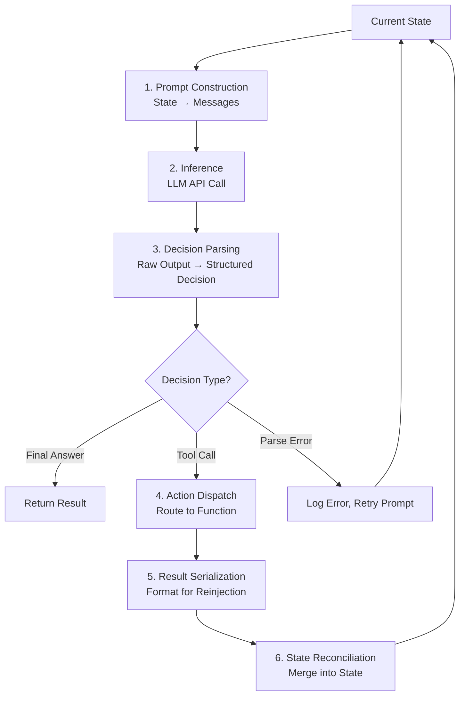

# 06 — How Loop Engineering Works

> 📘 File 6 of 25 — Loop Engineering Knowledge Library
> Phase: Mechanics
> Prerequisite: `01_What_is_Loop_Engineering.md` through `05_Key_Terminology.md`

---

## 1. Introduction

### Topic Overview

File 01 gave you the loop's skeleton at a glance. This file opens it up completely — the exact internal mechanics of a single loop cycle, from the moment a goal enters the system to the moment control returns to the caller. Where file 04 named the six pillars conceptually, this file shows precisely how they wire together into working code, including the parts most tutorials skip: how the model's raw output gets parsed into a decision, how errors propagate, and how a "cycle" is actually detected as complete.

### Why This Topic Matters

Every bug you'll ever debug in an agent loop lives somewhere in the mechanics this file describes. "The model reasoned correctly but the tool never ran" is a parsing bug. "The loop finished but ignored half the instructions" is a state-merging bug. You can't fix what you can't see — this file makes the invisible internal wiring visible.

---

## 2. Definition

### What Is It? (Simple Explanation)

If file 01 showed you a car from across the street, this file pops the hood. You'll see exactly how the "reason" step turns model text into a structured decision, how the "act" step turns that decision into a real function call, and how the "observe" step turns a raw result back into something the model can read on the next pass.

### Technical Definition

> The **internal mechanics of Loop Engineering** describe the concrete data transformations that occur within a single loop iteration: **prompt construction** (assembling state into model input), **inference** (the model call itself), **decision parsing** (extracting a structured action from raw model output), **action dispatch** (routing that decision to the correct execution path), **result serialization** (formatting an action's output for reinjection), and **state reconciliation** (merging the new observation into the loop's persistent state).

---

## 3. Core Concepts

### Fundamental Ideas

- A loop iteration is not one operation — it's a **pipeline of six sub-steps**, each of which can fail independently
- The model never directly "does" anything — it produces **text**, and the loop's job is to correctly interpret that text as a decision
- **Parsing is often the fragile point.** A model can reason perfectly and still fail the loop if its output can't be reliably converted into a structured action
- **State reconciliation is a merge, not an overwrite** — done carelessly, it silently discards information from earlier iterations

### Key Terminology

- **Prompt construction** — assembling the current state into the text/messages sent to the model
- **Inference** — the actual model API call
- **Decision parsing** — extracting a structured, actionable decision from the model's raw text or structured output
- **Action dispatch** — routing a parsed decision to the correct function/tool/handler
- **Result serialization** — converting a raw action result into a format suitable for reinjection into context
- **State reconciliation** — merging new information into the loop's persistent state object

---

## 4. How It Works

### Step-by-Step Explanation

Here is a single loop iteration broken into its true internal sub-steps — the detail level file 01 intentionally simplified:

1. **Prompt Construction** — the current state (goal, history, available tools) is assembled into a prompt or message list
2. **Inference** — that prompt is sent to the LLM; the model returns raw output (text, or structured tool-call blocks)
3. **Decision Parsing** — the raw output is parsed: is this a final answer? A tool call? Malformed output that needs a retry?
4. **Action Dispatch** — if a tool call was parsed, the loop routes it to the matching function, validates arguments, and executes
5. **Result Serialization** — the raw return value from that function is formatted into a structure the model can read next time (usually a `tool_result` message)
6. **State Reconciliation** — the new observation is merged into state; nothing from prior iterations is silently dropped
7. **Cycle Check** — the loop determines whether this was a terminal step (final answer reached) or whether it should return to step 1

### Internal Workflow

Each of the six sub-steps mapped to real code, explicitly labeled and separated so you can see exactly where each one lives:

```python
import json
import anthropic

client = anthropic.Anthropic()

# ── SUB-STEP 1: PROMPT CONSTRUCTION ──────────────────────────
def construct_prompt(state):
    """Turn current state into the message list the model will see."""
    messages = [{"role": "user", "content": state["goal"]}]
    for entry in state["history"]:
        messages.append({"role": "assistant", "content": entry["model_output"]})
        if "tool_result" in entry:
            messages.append({
                "role": "user",
                "content": [{
                    "type": "tool_result",
                    "tool_use_id": entry["tool_use_id"],
                    "content": entry["tool_result"]
                }]
            })
    return messages


# ── SUB-STEP 2: INFERENCE ────────────────────────────────────
def run_inference(messages, tools):
    """The actual model API call. This is the ONLY sub-step that
    talks to the LLM — everything else is loop-side logic."""
    return client.messages.create(
        model="claude-sonnet-4-6",
        max_tokens=1000,
        tools=tools,
        messages=messages
    )


# ── SUB-STEP 3: DECISION PARSING ─────────────────────────────
def parse_decision(response):
    """Turn raw model output into a structured decision.
    This is the most failure-prone sub-step in the entire pipeline."""
    if response.stop_reason == "tool_use":
        tool_block = next(b for b in response.content if b.type == "tool_use")
        return {
            "type": "tool_call",
            "tool_name": tool_block.name,
            "tool_input": tool_block.input,
            "tool_use_id": tool_block.id,
            "raw_output": response.content
        }
    elif response.stop_reason == "end_turn":
        text_block = next((b for b in response.content if b.type == "text"), None)
        return {
            "type": "final_answer",
            "answer": text_block.text if text_block else "",
            "raw_output": response.content
        }
    else:
        # stop_reason could be "max_tokens", indicating a truncated,
        # unparseable response — the loop must handle this explicitly
        return {"type": "parse_error", "reason": response.stop_reason}


# ── SUB-STEP 4: ACTION DISPATCH ──────────────────────────────
TOOL_REGISTRY = {
    "calculator": lambda expr: str(eval(expr, {"__builtins__": {}})),
}

def dispatch_action(decision):
    """Route a parsed decision to its actual implementation."""
    if decision["type"] != "tool_call":
        raise ValueError("dispatch_action called on a non-tool decision")

    tool_fn = TOOL_REGISTRY.get(decision["tool_name"])
    if tool_fn is None:
        return f"Error: unknown tool '{decision['tool_name']}'"

    try:
        return tool_fn(**decision["tool_input"])
    except Exception as e:
        # Errors become observations too — the model gets to see and
        # adapt to them, rather than the loop crashing outright
        return f"Error executing tool: {e}"


# ── SUB-STEP 5: RESULT SERIALIZATION ─────────────────────────
def serialize_result(raw_result):
    """Format a raw return value for reinjection into the next prompt."""
    if not isinstance(raw_result, str):
        raw_result = json.dumps(raw_result)
    return raw_result


# ── SUB-STEP 6: STATE RECONCILIATION ─────────────────────────
def reconcile_state(state, decision, serialized_result=None):
    """Merge new information into state WITHOUT discarding history."""
    entry = {"model_output": decision["raw_output"]}
    if decision["type"] == "tool_call":
        entry["tool_use_id"] = decision["tool_use_id"]
        entry["tool_result"] = serialized_result
    state["history"].append(entry)  # append, never overwrite
    return state


# ── THE FULL PIPELINE, ASSEMBLED ─────────────────────────────
def engineered_loop(goal, tools, max_iterations=8):
    state = {"goal": goal, "history": []}

    for i in range(max_iterations):
        messages = construct_prompt(state)                    # 1
        response = run_inference(messages, tools)               # 2
        decision = parse_decision(response)                      # 3

        if decision["type"] == "final_answer":
            return decision["answer"]

        if decision["type"] == "parse_error":
            # Recoverable: nudge the model to try again cleanly
            state["history"].append({
                "model_output": [{"type": "text", "text": "[malformed output]"}]
            })
            continue

        raw_result = dispatch_action(decision)                    # 4
        serialized = serialize_result(raw_result)                  # 5
        state = reconcile_state(state, decision, serialized)         # 6

    return "Loop ended without a final answer."
```

This is the *real* internal shape of nearly every production tool-using loop — every framework you'll ever use (LangGraph, ADK, AutoGen) implements some version of these exact six sub-steps, just with different naming and abstraction layers on top.

---

## 5. Architecture / Workflow

### Mermaid Flowchart



---

## 6. Components / Types

### Main Components

| Sub-Step | Failure Mode If Broken | Where It's Covered Elsewhere |
|---|---|---|
| Prompt Construction | Missing context, model reasons on stale info | `11_State_Context_and_Memory.md` |
| Inference | Rate limits, timeouts, API errors | `19_Best_Practices_and_Common_Mistakes.md` |
| Decision Parsing | Valid model reasoning silently discarded due to bad parsing | This file, Section 9 |
| Action Dispatch | Wrong tool called, or unknown tool crashes the loop | `14_Tool_and_Function_Calling.md` |
| Result Serialization | Model receives unreadable/malformed tool output | `14_Tool_and_Function_Calling.md` |
| State Reconciliation | History silently overwritten instead of appended | `11_State_Context_and_Memory.md` |

### Categories of Decision Parsing

Not all models/APIs return decisions the same way — three common categories:

- **Structured tool-call APIs** (Anthropic, OpenAI function calling) — the model returns a machine-parseable JSON block; parsing is mostly reliable
- **Free-text pattern matching** (e.g., "ACTION: search\nQUERY: ...") — the loop must regex/parse plain text; more fragile, common in older ReAct implementations
- **Structured output schemas** (e.g., forcing JSON-only responses) — a middle ground, reliable but requires careful prompt design

---

## 7. Examples

### Beginner Example

Isolating just the parsing sub-step to show why it's fragile — a naive text-based parser versus a more robust one:

```python
# FRAGILE — breaks if the model phrases things even slightly differently
def naive_parse(text):
    if text.startswith("ACTION:"):
        return text.split("ACTION:")[1].strip()
    return None

# Test cases that break the naive parser:
naive_parse("Action: search")       # None (case mismatch)
naive_parse(" ACTION: search")      # None (leading space)
naive_parse("I'll use ACTION: search")  # None (not at the start)


# MORE ROBUST — case-insensitive, tolerant of surrounding text
import re

def robust_parse(text):
    match = re.search(r"action:\s*(\w+)", text, re.IGNORECASE)
    return match.group(1) if match else None

robust_parse("Action: search")           # "search"
robust_parse(" ACTION: search")          # "search"
robust_parse("I'll use ACTION: search")  # "search"
```

This is exactly why structured tool-call APIs (used in the Section 4 example) are strongly preferred over free-text parsing wherever available — they eliminate this entire class of fragility.

### Intermediate Example

Demonstrating state reconciliation done wrong (overwrite) versus right (append), and the concrete consequence:

```python
# WRONG — overwrites, silently loses all prior findings
def broken_reconcile(state, new_finding):
    state["findings"] = new_finding  # Previous findings: gone
    return state

state = {"findings": ["Finding A"]}
state = broken_reconcile(state, "Finding B")
print(state["findings"])  # "Finding B" — Finding A is lost forever


# CORRECT — appends, preserves full history
def correct_reconcile(state, new_finding):
    state["findings"].append(new_finding)
    return state

state = {"findings": ["Finding A"]}
state = correct_reconcile(state, "Finding B")
print(state["findings"])  # ["Finding A", "Finding B"] — nothing lost
```

This trivial-looking bug is one of the most common real-world causes of agents that seem to "forget" earlier progress on multi-step tasks.

### Advanced / Real-World Example

A full mechanics pipeline with explicit error handling injected at every sub-step — showing how production systems isolate failures to exactly one sub-step instead of crashing the whole loop:

```python
class LoopMechanicsError(Exception):
    def __init__(self, sub_step, original_error):
        self.sub_step = sub_step
        self.original_error = original_error
        super().__init__(f"Failure in {sub_step}: {original_error}")


def safe_engineered_loop(goal, tools, max_iterations=8):
    state = {"goal": goal, "history": []}
    errors_this_run = []

    for i in range(max_iterations):
        try:
            messages = construct_prompt(state)
        except Exception as e:
            raise LoopMechanicsError("prompt_construction", e)  # unrecoverable

        try:
            response = run_inference(messages, tools)
        except Exception as e:
            # Inference errors (rate limits, timeouts) are often transient —
            # log and retry rather than crash
            errors_this_run.append(LoopMechanicsError("inference", e))
            continue

        try:
            decision = parse_decision(response)
        except Exception as e:
            errors_this_run.append(LoopMechanicsError("decision_parsing", e))
            continue  # skip this iteration, try again

        if decision["type"] == "final_answer":
            return {"result": decision["answer"], "errors": errors_this_run}

        try:
            raw_result = dispatch_action(decision)
        except Exception as e:
            # Dispatch errors become observations, not crashes —
            # the model can see the error and adapt
            raw_result = f"Tool execution failed: {e}"

        serialized = serialize_result(raw_result)
        state = reconcile_state(state, decision, serialized)

    return {"result": None, "status": "max_iterations", "errors": errors_this_run}
```

Notice each `try/except` is scoped to exactly one sub-step — this is the mechanical foundation that makes the error-recovery best practices from file 02 actually implementable.

---

## 8. Best Practices

### Do's

- ✅ Treat each of the six sub-steps as an independently testable unit — write unit tests for `parse_decision` separately from testing the full loop
- ✅ Prefer structured tool-call APIs over free-text parsing whenever your model provider supports them — it eliminates an entire fragile category of bugs
- ✅ Always append to history in state reconciliation, never overwrite, unless you have a deliberate, documented reason (e.g., intentional summarization)
- ✅ Log the *raw* model output alongside the *parsed* decision — when parsing goes wrong, you need both to debug it

### Recommended Techniques

- Build a "replay" debugging tool that can re-run `parse_decision` against a saved raw model response — this isolates parsing bugs without needing to re-call the (expensive, non-deterministic) model
- When a loop misbehaves, work backward through the six sub-steps in this file's Section 4 order — it's a systematic checklist, not a guessing game

---

## 9. Common Mistakes

### Frequent Errors

| Mistake | Sub-Step Affected | Symptom |
|---|---|---|
| Free-text parsing with brittle regex | Decision Parsing | Agent's correct reasoning gets discarded because the parser didn't recognize the format |
| Overwriting state instead of appending | State Reconciliation | Agent appears to "forget" earlier progress |
| Not handling `parse_error` / truncated output | Decision Parsing | Loop crashes on a truncated or malformed model response |
| Passing unserialized objects back to the model | Result Serialization | Model receives Python object repr instead of readable text, reasons poorly on it |
| Treating tool errors as unrecoverable | Action Dispatch | Loop crashes on a transient tool failure instead of letting the model adapt |

### How to Avoid Them

- Always handle the case where `stop_reason` (or your model's equivalent) indicates truncated/malformed output — don't assume every response parses cleanly
- Run `serialize_result` output through a quick sanity check (is it a string? Is it reasonably sized?) before reinjecting it into the prompt

---

## 10. Advantages & Limitations

### Benefits of Understanding the Full Mechanics

- Turns "the agent is being weird" into a specific, locatable bug in one of six sub-steps
- Makes it possible to test loop components independently, dramatically speeding up development
- Reveals exactly where framework abstractions are hiding complexity — useful when a framework's default behavior doesn't fit your use case

### Limitations

- This level of detail is genuinely more code than a quick framework-provided abstraction — for simple tasks, this may be more engineering than necessary
- Frameworks often bundle several of these sub-steps together in ways that aren't cleanly separable without reading their source code

---

## 11. Comparison

### Compare with Related Concepts

| Abstraction Level | What You See | What You Don't See |
|---|---|---|
| **File 01's simplified loop** | Reason → Act → Observe | The six internal sub-steps this file exposes |
| **This file's full mechanics** | All six sub-steps, explicit | Framework-specific optimizations (batching, caching) |
| **A production framework (e.g. LangGraph)** | Nodes and edges | The exact sub-step boundaries, usually merged/abstracted |

### Summary Table

| Sub-Step | Input | Output | Most Common Failure |
|---|---|---|---|
| Prompt Construction | State | Messages | Stale or missing context |
| Inference | Messages | Raw model response | Rate limits, timeouts |
| Decision Parsing | Raw response | Structured decision | Brittle parsing logic |
| Action Dispatch | Structured decision | Raw action result | Unknown/misconfigured tool |
| Result Serialization | Raw action result | Formatted string | Unreadable/oversized output |
| State Reconciliation | Decision + result | Updated state | Overwrite instead of append |

---

## 12. Summary

### Key Takeaways

- A single loop iteration is really a **six-step internal pipeline**: prompt construction, inference, decision parsing, action dispatch, result serialization, and state reconciliation
- Decision parsing is usually the most fragile sub-step — prefer structured tool-call APIs over free-text parsing wherever possible
- State reconciliation must **append**, not overwrite — this single principle prevents the most common "agent forgot its progress" bugs
- Wrapping each sub-step in its own error handling turns catastrophic crashes into recoverable, loop-continuing observations

### Cheat Sheet

```
ONE LOOP ITERATION = 6 SUB-STEPS:

1. Prompt Construction   (State → Messages)
2. Inference              (Messages → Raw Model Output)
3. Decision Parsing       (Raw Output → Structured Decision)
4. Action Dispatch        (Decision → Raw Result)
5. Result Serialization   (Raw Result → Formatted String)
6. State Reconciliation   (Result → Updated State, APPEND not overwrite)

Debug tip: isolate the failing sub-step, don't debug "the whole loop."
```

---

## 13. Glossary

| Term | Definition |
|---|---|
| **Prompt Construction** | Assembling current state into the text/messages sent to the model |
| **Inference** | The model API call itself |
| **Decision Parsing** | Extracting a structured, actionable decision from raw model output |
| **Action Dispatch** | Routing a parsed decision to its correct execution handler |
| **Result Serialization** | Formatting a raw action result for reinjection into context |
| **State Reconciliation** | Merging a new observation into persistent state |
| **stop_reason** | A field in model API responses indicating why generation stopped (tool use, completion, truncation) |

---

## 14. References & Further Reading

### Official Documentation

- Anthropic — [Tool Use / Function Calling Documentation](https://docs.claude.com) — the structured decision-parsing approach used in this file's examples

### Research Papers

- Yao et al., 2022 — *"ReAct: Synergizing Reasoning and Acting in Language Models"* — the original free-text parsing approach this file's examples improve upon

### Where to Go Next in This Library

- Previous file: `05_Key_Terminology.md`
- Next file: `07_Loop_Lifecycle.md` — zooming out from one iteration to the full lifecycle of a loop from birth to termination
- Related: `14_Tool_and_Function_Calling.md` — a full deep dive on the Action Dispatch and Result Serialization sub-steps

---

*This is File 6 of 25 in the Loop Engineering Knowledge Library. See `README.md` for the full index and suggested reading paths.*
