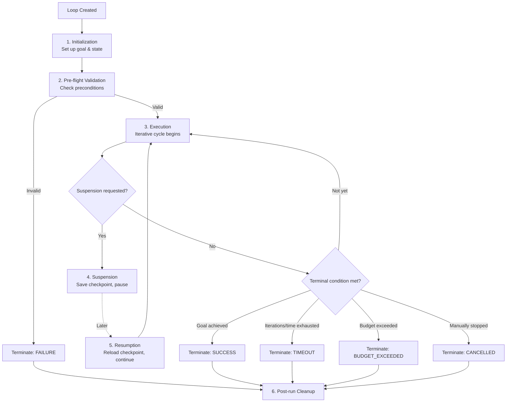

# 07 — Loop Lifecycle

> 📘 File 7 of 25 — Loop Engineering Knowledge Library
> Phase: Mechanics
> Prerequisite: `06_How_Loop_Engineering_Works.md`

---

## 1. Introduction

### Topic Overview

File 06 zoomed into a single iteration's internal pipeline. This file zooms back out — to the **full lifecycle** of a loop run, from the moment it's created to the moment it ends, including the stages most tutorials skip: pre-flight validation, mid-run pausing/resuming, and the several distinct *ways* a loop can end (not just "success" or "failure").

### Why This Topic Matters

Understanding the full lifecycle is what separates a loop that works in a demo from one that works in production. Production loops get paused for human approval, resumed after a server restart, and terminated for half a dozen different reasons — each of which needs distinct, deliberate handling.

---

## 2. Definition

### What Is It? (Simple Explanation)

A loop's lifecycle is like a package being shipped: it's created (ordered), validated (packed and labeled), it travels (in transit, possibly paused at customs), and it ends — but "ends" could mean delivered successfully, lost, returned, or cancelled. Each of those endings needs different handling on your end.

### Technical Definition

> The **Loop Lifecycle** is the complete sequence of stages a loop instance passes through during execution: **Initialization** (goal and state setup), **Pre-flight Validation** (checking preconditions before the first iteration), **Execution** (the iterative cycle described in file 06), **Suspension** (optional pausing for human input, rate limits, or checkpointing), **Resumption** (continuing from a suspended state), and **Termination** (one of several distinct end-states: success, failure, timeout, budget exhaustion, or cancellation).

---

## 3. Core Concepts

### Fundamental Ideas

- A loop's life is **not just "running" or "not running"** — it passes through distinct, identifiable stages, each with its own responsibilities
- **Termination is not singular** — a loop can end in several genuinely different ways, and treating them identically loses valuable information
- **Suspension and resumption** are what separate toy loops from production ones — real systems get interrupted (server restarts, rate limits, human review) and must recover gracefully
- **Pre-flight validation** catches broken configurations *before* wasting a single API call

### Key Terminology

- **Initialization** — setting up the initial state and goal
- **Pre-flight validation** — checking the loop's configuration is sound before execution begins
- **Suspension** — deliberately pausing a running loop (for human input, rate limiting, or checkpointing)
- **Resumption** — restarting a suspended loop from its saved state
- **Terminal state** — the final status a loop lands in (success, failure, timeout, budget exhaustion, cancelled)

---

## 4. How It Works

### Step-by-Step Explanation

1. **Initialization** — the goal is received, initial state object is constructed, and tools/resources are bound
2. **Pre-flight Validation** — the loop checks: is the goal well-formed? Are required tools available? Is the budget/iteration limit sane?
3. **Execution Begins** — the loop enters its iterative cycle (the six-sub-step pipeline from file 06)
4. **[Optional] Suspension** — at any point, the loop may pause: waiting for human approval, hitting a rate limit, or being deliberately checkpointed
5. **[Optional] Resumption** — a suspended loop is restarted, reloading its saved state and continuing exactly where it left off
6. **Termination** — the loop reaches one of several distinct terminal states
7. **Post-run Cleanup** — resources are released, final state may be persisted to long-term memory, logs are flushed

### Internal Workflow

```python
from enum import Enum
import json
import time

class LoopStatus(Enum):
    INITIALIZING = "initializing"
    VALIDATING = "validating"
    RUNNING = "running"
    SUSPENDED = "suspended"
    SUCCESS = "success"
    FAILURE = "failure"
    TIMEOUT = "timeout"
    BUDGET_EXCEEDED = "budget_exceeded"
    CANCELLED = "cancelled"


class LoopLifecycle:
    def __init__(self, goal, tools, max_iterations=10, max_seconds=120):
        self.goal = goal
        self.tools = tools
        self.max_iterations = max_iterations
        self.max_seconds = max_seconds
        self.status = LoopStatus.INITIALIZING
        self.state = None
        self.start_time = None
        self.iteration = 0

    # ── STAGE 1: INITIALIZATION ──────────────────────────────
    def initialize(self):
        self.state = {"goal": self.goal, "history": []}
        self.status = LoopStatus.VALIDATING
        return self

    # ── STAGE 2: PRE-FLIGHT VALIDATION ───────────────────────
    def validate(self):
        errors = []
        if not self.goal or not isinstance(self.goal, str):
            errors.append("Goal must be a non-empty string")
        if not self.tools:
            errors.append("No tools registered — loop may be unable to act")
        if self.max_iterations <= 0:
            errors.append("max_iterations must be positive")

        if errors:
            self.status = LoopStatus.FAILURE
            raise ValueError(f"Pre-flight validation failed: {errors}")

        self.status = LoopStatus.RUNNING
        self.start_time = time.time()
        return self

    # ── STAGE 3: EXECUTION ────────────────────────────────────
    def run(self):
        while self.status == LoopStatus.RUNNING:
            # Check termination conditions BEFORE each iteration
            if self.iteration >= self.max_iterations:
                self.status = LoopStatus.TIMEOUT  # in this context, "budget of iterations"
                break
            if time.time() - self.start_time > self.max_seconds:
                self.status = LoopStatus.TIMEOUT
                break

            # Check for a suspension request (e.g., human-in-the-loop gate)
            if self._suspension_requested():
                self.suspend()
                return self  # exit run(), but lifecycle is preserved for resume()

            result = self._run_one_iteration()  # the file-06 pipeline lives here
            self.iteration += 1

            if result.get("is_final"):
                self.status = LoopStatus.SUCCESS
                self.state["final_answer"] = result["answer"]
                break

        return self

    def _suspension_requested(self):
        # Placeholder: real systems check a flag, a rate-limit signal,
        # or a human-approval requirement here
        return False

    def _run_one_iteration(self):
        # Placeholder for the six-sub-step pipeline detailed in file 06
        return {"is_final": self.iteration >= 2, "answer": "Example result"}

    # ── STAGE 4: SUSPENSION ───────────────────────────────────
    def suspend(self):
        self.status = LoopStatus.SUSPENDED
        checkpoint = {
            "state": self.state,
            "iteration": self.iteration,
            "elapsed": time.time() - self.start_time,
        }
        with open("loop_checkpoint.json", "w") as f:
            json.dump(checkpoint, f)
        return checkpoint

    # ── STAGE 5: RESUMPTION ───────────────────────────────────
    @classmethod
    def resume_from_checkpoint(cls, goal, tools, checkpoint_path="loop_checkpoint.json"):
        with open(checkpoint_path) as f:
            checkpoint = json.load(f)

        instance = cls(goal, tools)
        instance.state = checkpoint["state"]
        instance.iteration = checkpoint["iteration"]
        instance.status = LoopStatus.RUNNING
        instance.start_time = time.time() - checkpoint["elapsed"]  # preserve elapsed time
        return instance

    # ── STAGE 6: TERMINATION / CLEANUP ────────────────────────
    def finalize(self):
        summary = {
            "status": self.status.value,
            "iterations_used": self.iteration,
            "final_state": self.state,
        }
        # Post-run cleanup: release resources, persist to long-term memory, flush logs
        return summary


# ── USAGE: full lifecycle traversal ──────────────────────────
loop = LoopLifecycle(goal="Summarize recent findings", tools=["search"])
loop.initialize().validate().run()
summary = loop.finalize()
print(summary)
```

---

## 5. Architecture / Workflow

### Mermaid Flowchart



---

## 6. Components / Types

### Main Lifecycle Stages

| Stage | Responsibility | Can Fail? |
|---|---|---|
| Initialization | Set up goal, state, tool bindings | Rarely (usually just bad input) |
| Pre-flight Validation | Catch broken configs before spending API calls | Yes — this is its entire purpose |
| Execution | Run the iterative cycle (file 06) | Yes — the bulk of runtime failures |
| Suspension | Pause and checkpoint mid-run | Yes — checkpoint write failures |
| Resumption | Reload and continue from checkpoint | Yes — corrupted/missing checkpoints |
| Termination | Land in one specific terminal state | N/A — this IS the failure/success signal |
| Post-run Cleanup | Release resources, persist memory | Yes — but shouldn't block returning results |

### Types of Termination (Terminal States)

| Terminal State | Meaning | Should Trigger |
|---|---|---|
| **SUCCESS** | Goal was genuinely achieved (ideally, verified — see file 02) | Return result, persist to memory |
| **FAILURE** | An unrecoverable error occurred (bad config, fatal exception) | Log details, alert if in production |
| **TIMEOUT** | Iteration or time budget exhausted before completion | Return partial progress, consider retry with more budget |
| **BUDGET_EXCEEDED** | Token/cost budget exhausted | Return partial progress, alert on cost |
| **CANCELLED** | A human or external system explicitly stopped the loop | Return partial progress, no error implied |

---

## 7. Examples

### Beginner Example

A minimal lifecycle with just three stages — init, run, terminate — showing the bare essentials even a small script should have:

```python
def minimal_lifecycle(goal):
    # Initialization
    state = {"goal": goal, "iterations": 0}

    # Execution with explicit termination check
    while state["iterations"] < 5:
        state["iterations"] += 1
        if state["iterations"] == 3:  # simulated "goal achieved"
            return {"status": "success", "iterations": state["iterations"]}

    # Termination (fell through without success)
    return {"status": "timeout", "iterations": state["iterations"]}

print(minimal_lifecycle("Find the answer"))
```

### Intermediate Example

Demonstrating suspension for a human-approval gate — a common real-world lifecycle requirement for anything with real-world consequences (sending emails, spending money, deleting files):

```python
class ApprovalRequiredLoop:
    def __init__(self, goal):
        self.goal = goal
        self.state = {"pending_action": None, "history": []}
        self.status = "running"

    def run(self):
        while self.status == "running":
            decision = self._decide_next_action()

            if decision["requires_approval"]:
                self.state["pending_action"] = decision
                self.status = "suspended_pending_approval"
                return {"status": self.status, "action_awaiting_approval": decision}

            self.state["history"].append(decision)

            if decision.get("is_final"):
                self.status = "success"
                return {"status": self.status, "history": self.state["history"]}

    def approve_and_resume(self, approved: bool):
        pending = self.state["pending_action"]
        if approved:
            self.state["history"].append({**pending, "approved": True})
        else:
            self.state["history"].append({**pending, "approved": False, "skipped": True})

        self.status = "running"
        self.state["pending_action"] = None
        return self.run()  # resume the loop

    def _decide_next_action(self):
        # Simplified: real logic would come from an LLM call
        if len(self.state["history"]) == 1:
            return {"action": "send_email", "requires_approval": True}
        return {"action": "conclude", "is_final": True, "requires_approval": False}


loop = ApprovalRequiredLoop("Notify the team")
result = loop.run()
print(result)  # {'status': 'suspended_pending_approval', ...}

# Later, after a human reviews:
final_result = loop.approve_and_resume(approved=True)
print(final_result)  # {'status': 'success', ...}
```

### Advanced / Real-World Example

A production-style lifecycle manager tracking full history of stage transitions, useful for debugging and observability:

```python
import time
from dataclasses import dataclass, field

@dataclass
class LifecycleEvent:
    stage: str
    timestamp: float
    metadata: dict = field(default_factory=dict)


class ObservableLifecycle:
    """A lifecycle wrapper that records every stage transition —
    essential for debugging production agent systems."""

    def __init__(self, goal, max_iterations=10):
        self.goal = goal
        self.max_iterations = max_iterations
        self.events: list[LifecycleEvent] = []
        self.status = "created"
        self.iteration = 0

    def _record(self, stage, **metadata):
        self.events.append(LifecycleEvent(stage=stage, timestamp=time.time(), metadata=metadata))
        self.status = stage

    def initialize(self):
        self._record("initializing", goal=self.goal)
        self.state = {"goal": self.goal, "history": []}
        return self

    def validate(self):
        self._record("validating")
        if not self.goal:
            self._record("failure", reason="empty_goal")
            raise ValueError("Goal cannot be empty")
        self._record("validated")
        return self

    def run(self):
        self._record("running")
        for i in range(self.max_iterations):
            self.iteration = i + 1
            self._record("iteration_start", iteration=self.iteration)

            # Simulated iteration logic
            achieved = self.iteration >= 3

            self._record("iteration_end", iteration=self.iteration, achieved=achieved)

            if achieved:
                self._record("success", total_iterations=self.iteration)
                return self

        self._record("timeout", total_iterations=self.iteration)
        return self

    def full_trace(self):
        """This is what makes production debugging tractable —
        a complete, timestamped record of every lifecycle transition."""
        return [
            {"stage": e.stage, "time": e.timestamp, "meta": e.metadata}
            for e in self.events
        ]


lifecycle = ObservableLifecycle("Analyze quarterly data", max_iterations=5)
lifecycle.initialize().validate().run()

for event in lifecycle.full_trace():
    print(event)
```

---

## 8. Best Practices

### Do's

- ✅ Always implement pre-flight validation, even for simple loops — catching a misconfiguration before the first API call saves both time and money
- ✅ Distinguish between terminal states explicitly (success vs. timeout vs. budget exceeded vs. cancelled) rather than collapsing them all into "done" or "error"
- ✅ Build suspension/resumption support for any loop that might run long enough to need human review or that operates in an environment where restarts are possible
- ✅ Log every lifecycle stage transition, not just the final result — this is what makes production debugging possible

### Recommended Techniques

- Design checkpoints to be **self-contained** (include enough information to fully reconstruct loop state) so resumption never depends on external, possibly-stale context
- Treat "partial success" (timeout/budget-exceeded with some real progress made) as a first-class outcome your calling code explicitly handles, not an afterthought

---

## 9. Common Mistakes

### Frequent Errors

| Mistake | Consequence |
|---|---|
| Skipping pre-flight validation | Loop burns API calls before discovering a fatal misconfiguration |
| Treating all terminal states as pass/fail binary | Loses valuable diagnostic information (was it a timeout? A real failure? Cancelled?) |
| No suspension/resumption support | Any interruption (server restart, rate limit) means starting completely over |
| Checkpoints that don't capture full state | Resumption produces subtly broken behavior because context was lost |
| Not persisting partial progress on timeout | Wastes all work done before a budget limit was hit |

### How to Avoid Them

- Build your terminal-state enum (like `LoopStatus` in Section 4) early, even for small projects — retrofitting it later is more work than starting with it
- Test your suspension/resumption path deliberately, not just the happy-path execution — simulate a mid-run interruption and confirm resumption actually works correctly

---

## 10. Advantages & Limitations

### Benefits of Full Lifecycle Management

- Production-grade resilience — loops can survive interruptions instead of losing all progress
- Rich diagnostic information — distinct terminal states make post-mortem debugging dramatically easier
- Enables human-in-the-loop patterns essential for high-stakes actions
- Pre-flight validation catches cheap-to-fix bugs before they become expensive runtime failures

### Limitations

- Full lifecycle management is meaningfully more code than a simple `while` loop — appropriate for production systems, likely overkill for a quick prototype
- Checkpointing adds storage/infrastructure requirements (a database, file system, or similar) that simple in-memory loops don't need

---

## 11. Comparison

### Compare with Related Concepts

| Concept | Scope | Relationship to Loop Lifecycle |
|---|---|---|
| **Loop Iteration (file 06)** | One cycle within Execution | The Execution stage IS a sequence of these iterations |
| **Process Lifecycle (OS concept)** | An operating system process's states | Directly analogous — created, running, suspended, terminated |
| **State Machine** | Formal states + transitions | The lifecycle IS a state machine, with `LoopStatus` as its states |

### Summary Table

| Question | Without Lifecycle Management | With Lifecycle Management |
|---|---|---|
| Can the loop survive an interruption? | No — must restart from scratch | Yes — resumes from checkpoint |
| Can you tell WHY a loop ended? | Only "it stopped" | Distinct terminal states (success/timeout/budget/cancelled) |
| Can a human approve risky actions mid-run? | Not without custom hacks | Yes — via suspension |
| Are broken configs caught early? | No — fails mid-run, wasting resources | Yes — pre-flight validation |

---

## 12. Summary

### Key Takeaways

- A loop's full lifecycle has (at minimum) six stages: Initialization, Pre-flight Validation, Execution, Suspension, Resumption, and Termination
- Termination is **not a single outcome** — success, failure, timeout, budget exhaustion, and cancellation are distinct terminal states that deserve distinct handling
- Suspension and resumption are what make a loop production-grade rather than a fragile script — they let loops survive interruptions and support human-in-the-loop approval
- Pre-flight validation is cheap insurance — it catches broken configurations before they waste real API calls

### Cheat Sheet

```
FULL LOOP LIFECYCLE:

1. Initialization         → set up goal, state
2. Pre-flight Validation  → catch broken configs early
3. Execution              → iterative cycle (see file 06)
4. Suspension (optional)  → pause + checkpoint
5. Resumption (optional)  → reload + continue
6. Termination            → land in ONE of 5 distinct terminal states:
                              SUCCESS / FAILURE / TIMEOUT /
                              BUDGET_EXCEEDED / CANCELLED
7. Post-run Cleanup       → release resources, persist memory
```

---

## 13. Glossary

| Term | Definition |
|---|---|
| **Initialization** | Setting up a loop's initial goal and state |
| **Pre-flight Validation** | Checking a loop's configuration is sound before execution begins |
| **Suspension** | Deliberately pausing a running loop, typically with a checkpoint |
| **Resumption** | Restarting a suspended loop from its saved checkpoint |
| **Terminal State** | The final status a loop lands in when it stops running |
| **Checkpoint** | A saved snapshot of loop state sufficient to resume execution later |
| **Post-run Cleanup** | Resource release and memory persistence after a loop terminates |

---

## 14. References & Further Reading

### Official Documentation

- LangGraph — [Persistence & Checkpointing Documentation](https://docs.langchain.com/oss/python/langgraph/overview) — production implementation of suspension/resumption

### Further Reading

- Operating Systems textbooks on **process lifecycle states** — a classical parallel to loop lifecycle management

### Where to Go Next in This Library

- Previous file: `06_How_Loop_Engineering_Works.md`
- Next file: `08_Loop_Architecture.md` — where the loop lifecycle fits within a larger system's architecture
- Related: `11_State_Context_and_Memory.md` — deep dive on the checkpointing mechanics touched on here

---

*This is File 7 of 25 in the Loop Engineering Knowledge Library. See `README.md` for the full index and suggested reading paths.*
