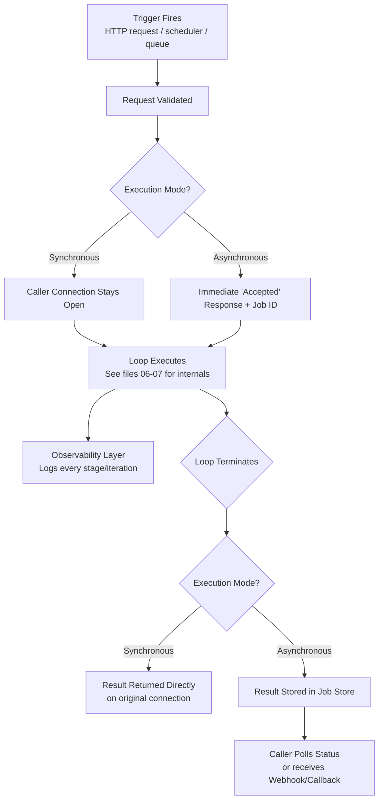

# 08 — Loop Architecture

> 📘 File 8 of 25 — Loop Engineering Knowledge Library
> Phase: Mechanics
> Prerequisite: `06_How_Loop_Engineering_Works.md`, `07_Loop_Lifecycle.md`

---

## 1. Introduction

### Topic Overview

Files 06 and 07 looked *inside* a loop — its iteration mechanics and its lifecycle. This file zooms out one more level: **where does the loop sit inside a larger application?** A loop rarely exists in isolation. It's embedded in a web server handling user requests, a CLI tool, a background job queue, or a larger multi-agent system — and the architectural choices around it (how it's triggered, how results get back to users, how it's monitored) matter as much as the loop's internal design.

### Why This Topic Matters

A perfectly engineered loop embedded in a badly architected system will still fail in production — timing out behind a web server's request limit, losing state when a worker process restarts, or becoming impossible to debug because nothing outside the loop is instrumented. This file connects loop internals to real system design.

---

## 2. Definition

### What Is It? (Simple Explanation)

If the loop is an engine, Loop Architecture is the rest of the car built around it: how you start the engine (trigger), how power gets to the wheels (result delivery), the dashboard telling you what's happening (observability), and the fuel tank (resource management). You can have the best engine in the world, but if the rest of the car is badly built, it still won't get you anywhere.

### Technical Definition

> **Loop Architecture** describes the system-level design surrounding an agentic loop: the **trigger mechanism** (how a loop run is initiated), the **execution environment** (where the loop actually runs — synchronously, as a background job, in a serverless function), the **result delivery mechanism** (how output reaches the calling system or user), and the **observability layer** (logging, tracing, and monitoring that makes the loop's behavior inspectable from outside).

---

## 3. Core Concepts

### Fundamental Ideas

- **A loop needs a trigger** — something has to start it: an HTTP request, a scheduled job, a message queue event, a CLI command
- **Loops often run longer than a typical request-response cycle** — this forces architectural choices most simple web apps never need to make
- **Synchronous vs. asynchronous execution is a foundational architectural decision** — it determines whether the calling system waits, polls, or gets notified
- **Observability is not optional at the architecture level** — a loop that can't be inspected from outside is undebuggable in production, regardless of how well-engineered its internals are

### Key Terminology

- **Trigger** — the event or mechanism that starts a loop run
- **Execution environment** — where and how a loop actually runs (in-process, background worker, serverless)
- **Synchronous execution** — the caller waits for the loop to fully complete before receiving a response
- **Asynchronous execution** — the caller receives an immediate acknowledgment and retrieves results later (polling or webhook/callback)
- **Observability** — the combination of logging, tracing, and metrics that makes a running system's behavior inspectable

---

## 4. How It Works

### Step-by-Step Explanation

A typical production loop's architectural journey:

1. **Trigger fires** — a user sends a request, a scheduler fires, or a queue message arrives
2. **Request validated and queued** — the system checks the request is well-formed and hands it to an execution environment
3. **Loop begins executing** — in whatever environment was chosen (see Section 6)
4. **[If synchronous]** the calling connection stays open, blocking until the loop finishes or times out
5. **[If asynchronous]** the caller gets an immediate "accepted" response with a job ID; the loop runs independently
6. **Observability layer captures events throughout** — every lifecycle stage transition (file 07) and iteration (file 06) is logged/traced
7. **Loop terminates** — result is delivered either directly (synchronous) or stored for retrieval (asynchronous)
8. **[If asynchronous]** the caller polls for status or receives a webhook/callback notification

### Internal Workflow

```python
import uuid
import time
import threading
from enum import Enum

class ExecutionMode(Enum):
    SYNCHRONOUS = "sync"
    ASYNCHRONOUS = "async"


class LoopJobStore:
    """Simulates a persistent job store (in production: a real database)."""
    def __init__(self):
        self._jobs = {}

    def create(self, job_id, goal):
        self._jobs[job_id] = {"status": "queued", "goal": goal, "result": None}

    def update(self, job_id, **kwargs):
        self._jobs[job_id].update(kwargs)

    def get(self, job_id):
        return self._jobs.get(job_id)


job_store = LoopJobStore()


# ── OBSERVABILITY LAYER ──────────────────────────────────────
def log_event(job_id, event, **metadata):
    """In production: send to a real logging/tracing system
    (e.g., structured logs, OpenTelemetry traces)."""
    print(f"[{time.strftime('%H:%M:%S')}] job={job_id} event={event} {metadata}")


# ── THE LOOP ITSELF (simplified — real logic lives in files 06-07) ──
def run_loop_internal(job_id, goal, max_iterations=5):
    log_event(job_id, "loop_started", goal=goal)
    job_store.update(job_id, status="running")

    for i in range(max_iterations):
        log_event(job_id, "iteration", number=i + 1)
        time.sleep(0.1)  # simulated work
        if i == 2:  # simulated goal achievement
            result = f"Completed: {goal}"
            job_store.update(job_id, status="success", result=result)
            log_event(job_id, "loop_completed", result=result)
            return result

    job_store.update(job_id, status="timeout")
    log_event(job_id, "loop_timeout")
    return None


# ── TRIGGER + EXECUTION ENVIRONMENT: SYNCHRONOUS ─────────────
def handle_synchronous_request(goal):
    """Caller waits for the full result — appropriate for short-running loops
    where blocking a request thread for the duration is acceptable."""
    job_id = str(uuid.uuid4())
    job_store.create(job_id, goal)
    result = run_loop_internal(job_id, goal)  # blocks until done
    return {"job_id": job_id, "status": "success" if result else "timeout", "result": result}


# ── TRIGGER + EXECUTION ENVIRONMENT: ASYNCHRONOUS ────────────
def handle_asynchronous_request(goal):
    """Caller gets an immediate job_id and polls/waits for completion —
    appropriate for long-running loops that would exceed typical request timeouts."""
    job_id = str(uuid.uuid4())
    job_store.create(job_id, goal)

    # In production: this would be handed to a background worker
    # (e.g., Celery, a queue consumer, a serverless async invocation)
    # rather than a raw Python thread.
    thread = threading.Thread(target=run_loop_internal, args=(job_id, goal))
    thread.start()

    return {"job_id": job_id, "status": "accepted"}  # returned IMMEDIATELY


def poll_job_status(job_id):
    """The caller uses this to check on an asynchronous loop's progress."""
    job = job_store.get(job_id)
    if not job:
        return {"error": "job not found"}
    return job


# ── USAGE ─────────────────────────────────────────────────────
sync_result = handle_synchronous_request("Summarize the report")
print("Sync result:", sync_result)

async_response = handle_asynchronous_request("Research a long-form topic")
print("Async response (immediate):", async_response)

time.sleep(1)  # simulating the caller checking back later
status = poll_job_status(async_response["job_id"])
print("Polled status:", status)
```

---

## 5. Architecture / Workflow

### Mermaid Flowchart



---

## 6. Components / Types

### Main Components

| Component | Responsibility |
|---|---|
| **Trigger** | Initiates a loop run (HTTP endpoint, cron schedule, queue consumer, CLI entry point) |
| **Execution Environment** | Where the loop's code actually runs (in-process, background thread/worker, serverless function, container) |
| **Job Store** | Persists loop status/results, especially essential for asynchronous execution |
| **Observability Layer** | Logging, tracing, and metrics capturing loop behavior for external inspection |
| **Result Delivery** | How output reaches the caller (direct return, polling endpoint, webhook, callback) |

### Types of Execution Environments

| Environment | Best For | Tradeoff |
|---|---|---|
| **In-process (same thread)** | Simple scripts, short loops, local development | Blocks everything else; no isolation |
| **Background thread/worker** | Medium-length loops within a single application server | Simple but limited by single-server resources |
| **Dedicated job queue (Celery, RQ, SQS)** | Production systems, long-running loops, scalability | More infrastructure to set up and maintain |
| **Serverless function** | Sporadic/bursty workloads, cost-sensitive at low volume | Cold starts, execution time limits |
| **Long-running container/service** | Loops needing persistent connections or heavy state | Higher baseline infrastructure cost |

### Types of Triggers

- **HTTP request** — a user or system calls an API endpoint
- **Scheduled** — a cron job or scheduler fires the loop at set intervals
- **Event-driven** — a message queue or event bus delivers a trigger event
- **CLI/manual** — a developer or operator runs the loop directly

---

## 7. Examples

### Beginner Example

The simplest possible architecture — a CLI script with no server, no job store, purely synchronous:

```python
def cli_triggered_loop():
    """Trigger: running this script.
    Execution environment: the current process, synchronously.
    Result delivery: printed directly to stdout."""
    goal = input("What should the agent do? ")
    result = run_simple_loop(goal)  # from earlier files
    print(f"Result: {result}")

def run_simple_loop(goal):
    return f"Completed: {goal}"  # simplified placeholder

if __name__ == "__main__":
    cli_triggered_loop()
```

Even this trivial example has a Trigger (running the script), an Execution Environment (the current process), and Result Delivery (print statement) — the architecture is just extremely minimal.

### Intermediate Example

A Flask-style web endpoint demonstrating the synchronous vs. asynchronous architectural fork explicitly:

```python
# Conceptual Flask-style pseudocode (illustrating the pattern, not a full app)

from flask import Flask, request, jsonify

app = Flask(__name__)

@app.route("/run-loop-sync", methods=["POST"])
def sync_endpoint():
    """SYNCHRONOUS: the HTTP connection stays open until the loop finishes.
    Only appropriate if the loop reliably finishes within your server's
    request timeout (often 30-60 seconds)."""
    goal = request.json["goal"]
    result = run_loop_internal(job_id="sync-job", goal=goal)  # blocks here
    return jsonify({"result": result})


@app.route("/run-loop-async", methods=["POST"])
def async_endpoint():
    """ASYNCHRONOUS: returns immediately with a job_id.
    Appropriate for loops that might run for minutes."""
    goal = request.json["goal"]
    response = handle_asynchronous_request(goal)  # from Section 4
    return jsonify(response), 202  # 202 Accepted, not 200 OK


@app.route("/jobs/<job_id>", methods=["GET"])
def check_job_status(job_id):
    """The caller uses this endpoint to poll an asynchronous job."""
    status = poll_job_status(job_id)
    return jsonify(status)
```

This is the exact architectural pattern behind most production LLM agent APIs — including how many commercial agent platforms structure their "run" and "poll" endpoints.

### Advanced / Real-World Example

A more complete architecture with a webhook-based callback (instead of polling), plus structured observability using correlation IDs — the pattern real production systems use for debugging distributed, asynchronous loop execution:

```python
import uuid
import json
import time
import requests  # for the webhook callback

class ProductionLoopArchitecture:
    def __init__(self, job_store, webhook_url=None):
        self.job_store = job_store
        self.webhook_url = webhook_url

    def trigger(self, goal, callback_url=None):
        """The single entry point — a trigger from ANY source
        (HTTP, queue, scheduler) funnels through here."""
        job_id = str(uuid.uuid4())
        correlation_id = str(uuid.uuid4())  # ties together ALL logs for this run

        self.job_store.create(job_id, goal)
        self._log(correlation_id, job_id, "triggered", goal=goal)

        # Real systems hand this off to a queue/worker, not a raw thread
        self._execute_async(job_id, correlation_id, goal, callback_url)

        return {"job_id": job_id, "correlation_id": correlation_id, "status": "accepted"}

    def _execute_async(self, job_id, correlation_id, goal, callback_url):
        try:
            self._log(correlation_id, job_id, "execution_started")
            self.job_store.update(job_id, status="running")

            # This is where files 06-07's loop internals actually run
            result = self._run_loop_with_full_observability(job_id, correlation_id, goal)

            self.job_store.update(job_id, status="success", result=result)
            self._log(correlation_id, job_id, "execution_completed", result_summary=str(result)[:100])

        except Exception as e:
            self.job_store.update(job_id, status="failure", error=str(e))
            self._log(correlation_id, job_id, "execution_failed", error=str(e))

        finally:
            # RESULT DELIVERY: webhook callback instead of requiring polling
            if callback_url:
                self._notify_webhook(callback_url, job_id, correlation_id)

    def _run_loop_with_full_observability(self, job_id, correlation_id, goal):
        for i in range(3):  # simplified iteration count
            self._log(correlation_id, job_id, "iteration", number=i + 1)
            time.sleep(0.05)
        return f"Completed: {goal}"

    def _notify_webhook(self, callback_url, job_id, correlation_id):
        payload = {"job_id": job_id, "correlation_id": correlation_id,
                   "status": self.job_store.get(job_id)["status"]}
        try:
            # requests.post(callback_url, json=payload, timeout=5)  # real call
            self._log(correlation_id, job_id, "webhook_notified", url=callback_url)
        except Exception as e:
            self._log(correlation_id, job_id, "webhook_failed", error=str(e))

    def _log(self, correlation_id, job_id, event, **metadata):
        """Every log line carries BOTH job_id and correlation_id —
        this is what makes tracing a single run across a distributed
        system actually possible in production."""
        entry = {
            "correlation_id": correlation_id,
            "job_id": job_id,
            "event": event,
            "timestamp": time.time(),
            **metadata,
        }
        print(json.dumps(entry))


architecture = ProductionLoopArchitecture(job_store=LoopJobStore())
response = architecture.trigger("Analyze market trends", callback_url="https://example.com/webhook")
print(response)
```

---

## 8. Best Practices

### Do's

- ✅ Choose synchronous execution only for loops with a *reliably* short, bounded runtime — anything with real chance of running long needs asynchronous architecture
- ✅ Use a real job queue (not a raw thread, as in the simplified examples above) for production asynchronous execution — raw threads don't survive process restarts
- ✅ Attach a correlation ID to every log line related to a single loop run — this is what makes distributed debugging tractable
- ✅ Prefer webhooks over polling when the calling system can receive them — it reduces load and latency compared to repeated polling

### Recommended Techniques

- Set a hard timeout on synchronous endpoints that's meaningfully shorter than your infrastructure's own request timeout, so you control the failure mode rather than your load balancer doing it for you
- Design your job store schema to capture enough detail (status, partial results, error messages, timestamps) that a caller polling for status gets genuinely useful information, not just "still running"

---

## 9. Common Mistakes

### Frequent Errors

| Mistake | Consequence |
|---|---|
| Using synchronous execution for unpredictably long loops | Requests time out at the infrastructure level with no graceful handling |
| Using raw in-process threads for "async" execution in production | Jobs are silently lost on process restart or deployment |
| No correlation IDs across logs | Debugging a single loop run across a distributed system becomes nearly impossible |
| Polling endpoints that return only "running" with no detail | Callers can't tell if progress is being made or the loop is stuck |
| No observability layer at all | Production incidents become guesswork instead of investigation |

### How to Avoid Them

- Benchmark your loop's typical and worst-case runtime *before* choosing synchronous vs. asynchronous architecture — don't guess
- Treat the job store schema and observability format as a deliberate design decision made early, not something bolted on after the first production incident

---

## 10. Advantages & Limitations

### Benefits of Deliberate Loop Architecture

- Makes loops resilient to infrastructure realities (timeouts, restarts, scaling) that internal loop engineering alone can't address
- Enables genuinely long-running loops (research tasks, multi-hour workflows) that would be impossible under synchronous-only architecture
- Turns production debugging from guesswork into systematic investigation via observability
- Scales independently from loop logic — you can change execution environments without touching the loop's internal mechanics

### Limitations

- Asynchronous architecture is meaningfully more complex to build and operate than synchronous — job stores, workers, and callback/polling logic are all additional surface area
- Observability infrastructure (structured logging, tracing systems) has real operational cost and isn't "free" to add
- Choosing the wrong execution environment (e.g., serverless for a loop needing long-lived state) can create its own class of bugs

---

## 11. Comparison

### Compare with Related Concepts

| Concept | Scope | Relationship to Loop Architecture |
|---|---|---|
| **Loop Lifecycle (file 07)** | One loop instance's internal states | Loop Architecture is what surrounds and triggers that lifecycle from outside |
| **Microservices Architecture** | General distributed systems design | Loop Architecture applies the same principles (async, observability) specifically to agentic loops |
| **Job Queue Systems (Celery, SQS)** | General background task infrastructure | A common Execution Environment choice for asynchronous loop architecture |

### Summary Table

| Question | Synchronous Architecture | Asynchronous Architecture |
|---|---|---|
| Does the caller wait for the full result? | Yes | No — gets an immediate job ID |
| Best for loops that run... | Seconds | Minutes to hours |
| Infrastructure complexity | Lower | Higher (job store, workers, callbacks) |
| Risk if the loop runs longer than expected | Request timeout, ungraceful failure | Handled naturally — caller just polls longer |

---

## 12. Summary

### Key Takeaways

- A loop doesn't exist in isolation — it needs a **Trigger**, an **Execution Environment**, a **Result Delivery** mechanism, and an **Observability Layer** to function in a real system
- The **synchronous vs. asynchronous** choice is foundational architecture, determined by whether your loop reliably finishes within your infrastructure's request timeout
- Production asynchronous execution needs a **real job queue**, not raw in-process threads, to survive restarts and scale
- **Correlation IDs** tying together every log line for a single loop run are what make production debugging of distributed, asynchronous systems actually tractable

### Cheat Sheet

```
LOOP ARCHITECTURE = Loop Internals (files 06-07) + 4 SURROUNDING PIECES:

1. TRIGGER               — what starts the loop (HTTP, cron, queue, CLI)
2. EXECUTION ENVIRONMENT  — where it runs (in-process, worker, serverless)
3. RESULT DELIVERY        — how output reaches the caller (return, poll, webhook)
4. OBSERVABILITY LAYER    — logging/tracing with correlation IDs

RULE OF THUMB:
  Loop reliably finishes in seconds  → Synchronous
  Loop might run for minutes/hours   → Asynchronous (job queue + polling/webhook)
```

---

## 13. Glossary

| Term | Definition |
|---|---|
| **Trigger** | The event or mechanism that initiates a loop run |
| **Execution Environment** | Where and how a loop's code actually runs |
| **Synchronous Execution** | The caller waits for full completion before receiving a response |
| **Asynchronous Execution** | The caller receives an immediate acknowledgment; results are retrieved later |
| **Job Store** | A persistence layer tracking loop run status and results |
| **Observability** | Logging, tracing, and metrics that make a running system inspectable from outside |
| **Correlation ID** | A unique identifier tying together all log entries related to a single loop run |
| **Webhook** | A callback mechanism where the system notifies the caller upon completion, rather than requiring polling |

---

## 14. References & Further Reading

### Official Documentation

- LangGraph Platform — [Deployment & Architecture Documentation](https://docs.langchain.com/oss/python/langgraph/overview)

### Further Reading

- Distributed Systems literature on **job queues and asynchronous task processing** (Celery, AWS SQS, RQ documentation) — directly applicable execution-environment patterns
- OpenTelemetry documentation — the industry-standard approach to the observability patterns (correlation IDs, tracing) described in this file

### Where to Go Next in This Library

- Previous file: `07_Loop_Lifecycle.md`
- Next file: `09_Core_Components.md` — a detailed breakdown of the Controller, Executor, Memory Manager, and Evaluator components first introduced in file 01
- Related: `15_AI_Agents_and_Multi_Agent_Loops.md` — architecture considerations specific to multiple coordinating loops

---

*This is File 8 of 25 in the Loop Engineering Knowledge Library. See `README.md` for the full index and suggested reading paths.*
