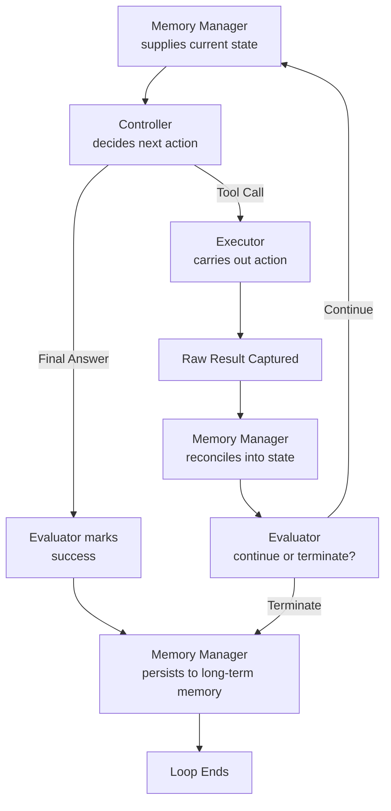

# 09 — Core Components

> 📘 File 9 of 25 — Loop Engineering Knowledge Library
> Phase: Mechanics
> Prerequisite: `04_Core_Concepts.md`, `06_How_Loop_Engineering_Works.md`

---

## 1. Introduction

### Topic Overview

File 01 named four components in passing: Controller, Executor, Memory Manager, and Evaluator. This file gives each one the full treatment — its precise responsibilities, its interface with the other three, and working implementations you can actually build from. If file 04's six pillars were the *concepts*, this file's four components are the *code objects* those concepts typically compile down into.

### Why This Topic Matters

When you open any real agent framework's source code, you will find these four components — sometimes under different names, sometimes merged, but always present in some form. Recognizing them lets you navigate an unfamiliar codebase quickly and lets you design your own loop with clean separation of concerns from the start.

---

## 2. Definition

### What Is It? (Simple Explanation)

Think of a restaurant kitchen. The **head chef** (Controller) decides what dish to make next. The **line cooks** (Executor) actually cook it. The **recipe book and pantry inventory** (Memory Manager) hold what's known and available. And the **quality inspector** (Evaluator) tastes the dish and decides if it's ready to serve or needs more work. Every functioning kitchen has these four roles — sometimes one person does two jobs, but the roles themselves are always there.

### Technical Definition

> The **four Core Components** of an agentic loop are: the **Controller** (the decision-making component, typically the LLM itself, responsible for choosing the next action given current state), the **Executor** (the component that carries out chosen actions, dispatching to tools/functions and capturing results), the **Memory Manager** (the component responsible for reading and writing both ephemeral state and persistent memory), and the **Evaluator/Terminator** (the component responsible for judging progress and determining when the loop should stop).

---

## 3. Core Concepts

### Fundamental Ideas

- These four components map cleanly onto the six pillars from file 04: Controller ≈ Control Flow, Executor ≈ Actions/Tools, Memory Manager ≈ State + Memory, Evaluator ≈ Termination Conditions
- **Separation of concerns is the whole point** — each component should be independently testable and replaceable without touching the others
- **The Controller doesn't have to be "smart" (an LLM)** — for simple, well-defined loops, a Controller can be pure rule-based logic
- **The Evaluator is distinct from the Controller** even though both involve "deciding something" — the Controller decides *what to do next*, the Evaluator decides *whether to keep going at all*

### Key Terminology

- **Controller** — the component choosing the loop's next action
- **Executor** — the component performing chosen actions
- **Memory Manager** — the component managing state and persistent memory
- **Evaluator / Terminator** — the component judging progress and termination
- **Component interface** — the defined way one component communicates with another (inputs/outputs)

---

## 4. How It Works

### Step-by-Step Explanation

1. The **Memory Manager** supplies current state to the **Controller**
2. The **Controller** examines that state and decides on the next action (or declares the goal complete)
3. If an action was chosen, the **Executor** carries it out and captures a raw result
4. The **Memory Manager** reconciles that result into state (and optionally persistent memory)
5. The **Evaluator** examines the updated state and decides: continue, or terminate (and if terminating, with which terminal state — see file 07)
6. If continuing, control returns to step 1

### Internal Workflow

Each component implemented as a genuinely separate, swappable class — this is the reference implementation pattern for the rest of this library:

```python
from abc import ABC, abstractmethod

# ── COMPONENT 1: CONTROLLER ──────────────────────────────────
class Controller(ABC):
    """Decides what happens next given current state."""
    @abstractmethod
    def decide(self, state: dict) -> dict:
        """Returns a decision dict, e.g. {'action': 'tool_call', ...}
        or {'action': 'final_answer', 'answer': ...}"""
        pass


class LLMController(Controller):
    """A Controller backed by an LLM call."""
    def __init__(self, llm_client, model="claude-sonnet-4-6"):
        self.client = llm_client
        self.model = model

    def decide(self, state: dict) -> dict:
        response = self.client.messages.create(
            model=self.model,
            max_tokens=500,
            messages=[{"role": "user", "content": f"Goal: {state['goal']}\nHistory: {state['history']}"}]
        )
        text = response.content[0].text
        if "FINAL:" in text:
            return {"action": "final_answer", "answer": text.split("FINAL:")[1].strip()}
        return {"action": "reason", "text": text}


class RuleBasedController(Controller):
    """A Controller with NO LLM at all — pure logic.
    Proof that the Controller role doesn't require intelligence,
    just the responsibility of choosing what happens next."""
    def decide(self, state: dict) -> dict:
        if len(state.get("history", [])) >= 3:
            return {"action": "final_answer", "answer": "Reached iteration limit rule"}
        return {"action": "tool_call", "tool": "search", "args": {"query": state["goal"]}}


# ── COMPONENT 2: EXECUTOR ────────────────────────────────────
class Executor:
    """Carries out chosen actions and captures results."""
    def __init__(self):
        self.tools = {}

    def register_tool(self, name, fn):
        self.tools[name] = fn

    def execute(self, decision: dict) -> dict:
        if decision["action"] != "tool_call":
            return {"error": "Executor received a non-tool-call decision"}

        tool_fn = self.tools.get(decision["tool"])
        if tool_fn is None:
            return {"error": f"Unknown tool: {decision['tool']}"}

        try:
            result = tool_fn(**decision["args"])
            return {"success": True, "result": result}
        except Exception as e:
            return {"success": False, "error": str(e)}


# ── COMPONENT 3: MEMORY MANAGER ──────────────────────────────
class MemoryManager:
    """Manages both ephemeral state and persistent memory."""
    def __init__(self, persistent_store=None):
        self.persistent_store = persistent_store or {}

    def initialize_state(self, goal):
        return {"goal": goal, "history": []}

    def reconcile(self, state, decision, execution_result):
        """Merges (never overwrites) new information into state."""
        state["history"].append({"decision": decision, "result": execution_result})
        return state

    def persist(self, key, state):
        """Writes to LONG-TERM memory — survives beyond this loop run."""
        self.persistent_store[key] = state["history"][-5:]  # keep recent summary

    def recall(self, key):
        return self.persistent_store.get(key, [])


# ── COMPONENT 4: EVALUATOR / TERMINATOR ──────────────────────
class Evaluator:
    """Judges progress and decides whether to continue or stop."""
    def __init__(self, max_iterations=10, max_seconds=60):
        self.max_iterations = max_iterations
        self.max_seconds = max_seconds

    def should_continue(self, state, iteration, elapsed_seconds):
        if state.get("final_answer_reached"):
            return False, "success"
        if iteration >= self.max_iterations:
            return False, "max_iterations"
        if elapsed_seconds >= self.max_seconds:
            return False, "timeout"
        return True, None


# ── ASSEMBLING THE FOUR COMPONENTS INTO A WORKING LOOP ───────
class ComponentBasedLoop:
    def __init__(self, controller: Controller, executor: Executor,
                 memory: MemoryManager, evaluator: Evaluator):
        self.controller = controller
        self.executor = executor
        self.memory = memory
        self.evaluator = evaluator

    def run(self, goal):
        import time
        state = self.memory.initialize_state(goal)
        start = time.time()
        iteration = 0

        while True:
            should_continue, stop_reason = self.evaluator.should_continue(
                state, iteration, time.time() - start
            )
            if not should_continue:
                self.memory.persist(goal, state)
                return {"status": stop_reason, "state": state}

            decision = self.controller.decide(state)

            if decision["action"] == "final_answer":
                state["final_answer_reached"] = True
                state["final_answer"] = decision["answer"]
                continue

            execution_result = self.executor.execute(decision)
            state = self.memory.reconcile(state, decision, execution_result)
            iteration += 1


# ── USAGE: swap components independently ─────────────────────
executor = Executor()
executor.register_tool("search", lambda query: f"Results for {query}")

loop = ComponentBasedLoop(
    controller=RuleBasedController(),   # swap this for LLMController(...) freely
    executor=executor,
    memory=MemoryManager(),
    evaluator=Evaluator(max_iterations=5, max_seconds=30)
)

result = loop.run("Find recent AI news")
print(result)
```

---

## 5. Architecture / Workflow

### Mermaid Flowchart



---

## 6. Components / Types

### Main Components (Summary)

| Component | Core Responsibility | Analogous Pillar (file 04) |
|---|---|---|
| **Controller** | Decide what happens next | Control Flow |
| **Executor** | Carry out chosen actions | Actions/Tools |
| **Memory Manager** | Manage state + persistent memory | State + Memory |
| **Evaluator/Terminator** | Judge progress, decide termination | Termination Conditions |

### Types of Each Component

**Controller types:**
- **LLM-backed** — uses a model call for every decision (most flexible, most expensive)
- **Rule-based** — pure logic, no model call (fastest, least flexible)
- **Hybrid** — rule-based for simple/common cases, LLM-backed as fallback for ambiguous ones

**Executor types:**
- **Single-tool** — dispatches to exactly one type of action
- **Multi-tool registry** — dispatches to a registered set of named tools (most common pattern)
- **Sandboxed** — executes actions in an isolated environment for safety (code execution, file operations)

**Memory Manager types:**
- **In-memory only** — state exists only for the duration of the process (simplest, no persistence)
- **File/database-backed** — state and memory persist across process restarts
- **Vector-store-backed** — memory retrieval by semantic similarity, not just exact key lookup (see file 11)

**Evaluator types:**
- **Threshold-based** — simple iteration/time/token limits
- **Self-report-based** — trusts the Controller's own "I'm done" signal (risky alone, see file 02)
- **Verification-based** — independently checks whether the goal was actually achieved (most robust)

---

## 7. Examples

### Beginner Example

The absolute minimum viable version of all four components, stripped to their essence:

```python
def minimal_controller(state):
    return "stop" if len(state["log"]) >= 3 else "continue"

def minimal_executor(state):
    state["log"].append(f"action #{len(state['log']) + 1}")
    return state

def minimal_memory_init():
    return {"log": []}

def minimal_evaluator(state, iteration, max_iterations=10):
    return iteration < max_iterations and minimal_controller(state) != "stop"

# Assembled:
state = minimal_memory_init()
iteration = 0
while minimal_evaluator(state, iteration):
    state = minimal_executor(state)
    iteration += 1

print(state)  # {'log': ['action #1', 'action #2', 'action #3']}
```

Even in this tiny example, all four roles are present and separable — just implemented as plain functions instead of classes.

### Intermediate Example

Swapping Controllers to demonstrate why separation of concerns matters — the same Executor, Memory Manager, and Evaluator work unchanged with two completely different Controllers:

```python
# Reusing the Executor, MemoryManager, Evaluator classes from Section 4

class KeywordSearchController(Controller):
    """A Controller that only knows how to search — no reasoning at all."""
    def decide(self, state):
        if len(state["history"]) >= 2:
            return {"action": "final_answer", "answer": "Search complete"}
        return {"action": "tool_call", "tool": "search", "args": {"query": state["goal"]}}


class AlwaysCalculateController(Controller):
    """A completely different Controller, for a completely different task type."""
    def decide(self, state):
        if len(state["history"]) >= 1:
            return {"action": "final_answer", "answer": "Calculation complete"}
        return {"action": "tool_call", "tool": "calculate", "args": {"expr": "2+2"}}


executor = Executor()
executor.register_tool("search", lambda query: f"Results for {query}")
executor.register_tool("calculate", lambda expr: str(eval(expr, {"__builtins__": {}})))

# Same Executor, Memory Manager, and Evaluator — ONLY the Controller changes
search_loop = ComponentBasedLoop(
    KeywordSearchController(), executor, MemoryManager(), Evaluator(max_iterations=5)
)
calc_loop = ComponentBasedLoop(
    AlwaysCalculateController(), executor, MemoryManager(), Evaluator(max_iterations=5)
)

print(search_loop.run("AI trends"))
print(calc_loop.run("Solve a math problem"))
```

This is precisely why the component model matters: you can build a library of interchangeable Controllers for different task types while reusing the same battle-tested Executor, Memory Manager, and Evaluator infrastructure.

### Advanced / Real-World Example

A verification-based Evaluator that doesn't just trust the Controller's self-report — implementing the file 02 lesson about hallucinated completion directly at the component level:

```python
class VerifyingEvaluator(Evaluator):
    """An Evaluator that independently verifies claimed completion,
    rather than trusting the Controller's self-report alone."""

    def __init__(self, verification_fn, max_iterations=10, max_seconds=60):
        super().__init__(max_iterations, max_seconds)
        self.verification_fn = verification_fn

    def should_continue(self, state, iteration, elapsed_seconds):
        if state.get("final_answer_reached"):
            # Don't just trust it — verify independently
            if self.verification_fn(state):
                return False, "success_verified"
            else:
                # Claimed done, but verification failed — reset the flag
                # and force the loop to keep going
                state["final_answer_reached"] = False
                state["history"].append({
                    "system_note": "Claimed completion failed verification, continuing"
                })
                return True, None

        if iteration >= self.max_iterations:
            return False, "max_iterations"
        if elapsed_seconds >= self.max_seconds:
            return False, "timeout"
        return True, None


def verify_has_minimum_findings(state, minimum=2):
    """A real verification function — checks an OBJECTIVE property
    of the state, not just the model's word."""
    return len(state.get("history", [])) >= minimum


loop = ComponentBasedLoop(
    controller=RuleBasedController(),
    executor=Executor(),
    memory=MemoryManager(),
    evaluator=VerifyingEvaluator(
        verification_fn=lambda s: verify_has_minimum_findings(s, minimum=2),
        max_iterations=8
    )
)

result = loop.run("Research topic X")
print(result)
```

---

## 8. Best Practices

### Do's

- ✅ Keep the four components genuinely separate classes/functions, even in small projects — the separation is what makes each one independently testable
- ✅ Design your Controller interface to return a **consistent decision format** regardless of whether it's LLM-backed or rule-based, so Executors and Evaluators never need to know which type of Controller they're working with
- ✅ Build a verification-based Evaluator whenever the domain allows an objective check, rather than trusting self-report alone
- ✅ Write unit tests for each component in isolation, using mock/fake versions of the other three

### Recommended Techniques

- When starting a new loop project, stub out all four components with the simplest possible rule-based implementations first, get the plumbing working end-to-end, *then* swap in the real (often LLM-backed) versions
- Maintain a small library of reusable Executors and Memory Managers across projects — these tend to be far more reusable than Controllers, which are usually task-specific

---

## 9. Common Mistakes

### Frequent Errors

| Mistake | Consequence |
|---|---|
| Merging Controller and Evaluator into one component | Can't independently test "what should happen next" vs. "should we stop" |
| Executor directly modifying state instead of returning results | Breaks the Memory Manager's ability to control reconciliation logic |
| Evaluator trusting Controller's self-report with no independent check | Reintroduces the hallucinated-completion problem from file 02 at the component level |
| Hardcoding tool logic inside the Controller | Makes the Controller untestable without also invoking real tools |

### How to Avoid Them

- Enforce that the Executor only *returns* results — it should never directly mutate the shared state object; that's the Memory Manager's exclusive responsibility
- Always ask "could I swap this component for a completely different implementation without touching the others?" — if the answer is no, the separation of concerns has broken down somewhere

---

## 10. Advantages & Limitations

### Benefits of the Four-Component Model

- Enables true unit testing of loop logic — each component can be tested with mocks for the other three
- Makes Controllers swappable across very different task types while reusing the same Executor/Memory/Evaluator infrastructure
- Provides a clear, navigable mental map for reading unfamiliar framework source code
- Directly implements the file 02 lesson about independent verification, at a structural level (via the Evaluator)

### Limitations

- Real frameworks often merge or blur these boundaries for performance or ergonomic reasons — the clean separation shown here is a teaching model, not always literally how production frameworks are internally structured
- Overly rigid separation can occasionally add unnecessary indirection for genuinely trivial loops

---

## 11. Comparison

### Compare with Related Concepts

| Model | Roughly Corresponds To |
|---|---|
| **MVC (Model-View-Controller)** | Memory Manager ≈ Model, Controller ≈ Controller (same name, related idea) |
| **The Six Pillars (file 04)** | Controller≈Control Flow, Executor≈Actions/Tools, Memory Manager≈State+Memory, Evaluator≈Termination |
| **LangGraph's Nodes/Edges** | Nodes often implement Controller+Executor logic combined; Edges implement Evaluator-like routing |

### Summary Table

| Component | Testable in Isolation? | Typically Swappable? | Typically Reusable Across Projects? |
|---|---|---|---|
| Controller | Yes | Yes, often | Rarely — usually task-specific |
| Executor | Yes | Yes | Often — tool registries generalize well |
| Memory Manager | Yes | Yes | Often — state patterns generalize well |
| Evaluator | Yes | Yes | Sometimes — depends on verification needs |

---

## 12. Summary

### Key Takeaways

- Every agentic loop can be decomposed into four core components: **Controller** (decides), **Executor** (acts), **Memory Manager** (remembers), and **Evaluator** (judges when to stop)
- These map directly onto the six pillars from file 04, just organized as concrete, swappable code objects rather than abstract concepts
- The Controller does not need to be LLM-backed — rule-based Controllers are valid and useful for well-defined tasks
- A verification-based Evaluator — one that independently checks claimed completion rather than trusting self-report — directly solves the hallucinated-completion problem from file 02

### Cheat Sheet

```
FOUR CORE COMPONENTS:

CONTROLLER    → decides what happens next (LLM-backed, rule-based, or hybrid)
EXECUTOR      → carries out chosen actions (single-tool, multi-tool, sandboxed)
MEMORY MANAGER → manages state + persistent memory (in-memory, file/DB, vector-backed)
EVALUATOR     → judges progress, decides termination (threshold, self-report, verified)

DESIGN RULE: each component should be swappable without touching the others.
```

---

## 13. Glossary

| Term | Definition |
|---|---|
| **Controller** | The component responsible for deciding a loop's next action |
| **Executor** | The component responsible for carrying out chosen actions |
| **Memory Manager** | The component responsible for managing ephemeral state and persistent memory |
| **Evaluator / Terminator** | The component responsible for judging progress and deciding termination |
| **Component interface** | The defined inputs/outputs through which one component communicates with another |
| **Separation of concerns** | A design principle where each component has one clear, independent responsibility |

---

## 14. References & Further Reading

### Official Documentation

- LangGraph — [Nodes and Edges Documentation](https://docs.langchain.com/oss/python/langgraph/overview) — a real-world implementation of these component boundaries

### Further Reading

- Gang of Four — *Design Patterns: Elements of Reusable Object-Oriented Software* — the classical software engineering source for separation-of-concerns principles applied throughout this file

### Where to Go Next in This Library

- Previous file: `08_Loop_Architecture.md`
- Next file: `10_Types_of_Loops.md` — a full taxonomy of loop patterns (ReAct, Plan-Execute, Reflexion), each of which arranges these four components slightly differently
- Related: `14_Tool_and_Function_Calling.md` — a deep dive on the Executor component specifically

---

*This is File 9 of 25 in the Loop Engineering Knowledge Library. See `README.md` for the full index and suggested reading paths.*
