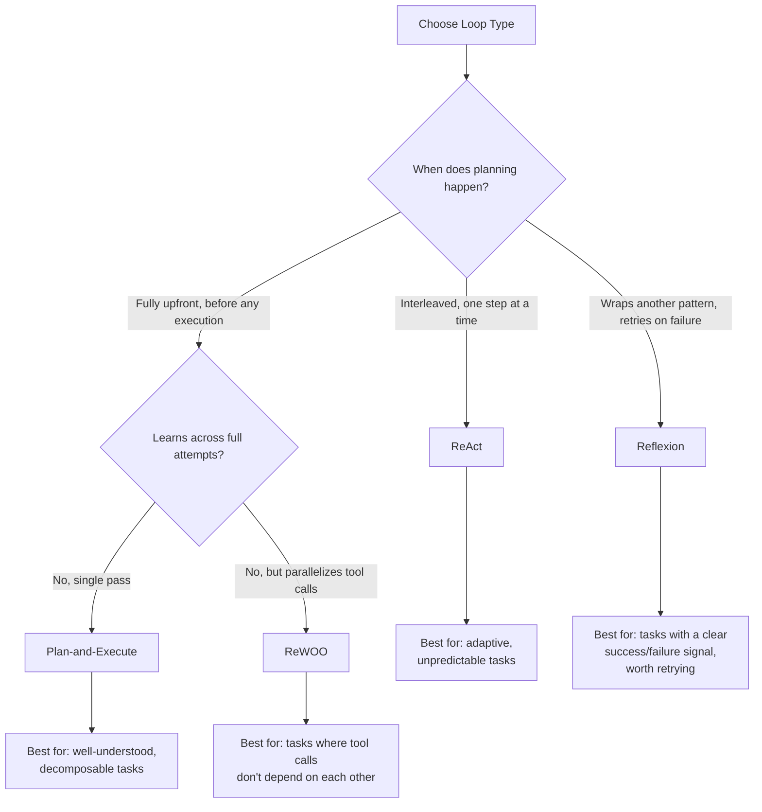

# 10 — Types of Loops

> 📘 File 10 of 25 — Loop Engineering Knowledge Library
> Phase: Mechanics
> Prerequisite: `04_Core_Concepts.md`, `09_Core_Components.md`

---

## 1. Introduction

### Topic Overview

Files 06–09 established that every loop shares the same underlying mechanics, lifecycle, architecture, and components. This file catalogs the ways those shared elements get **arranged differently** to produce genuinely distinct loop *patterns* — each with different strengths, weaknesses, and ideal use cases. Knowing this taxonomy lets you pick the right pattern deliberately, instead of defaulting to whatever a tutorial happened to show you.

### Why This Topic Matters

Using a Plan-and-Execute pattern for a task that needed ReAct's adaptive step-by-step reasoning (or vice versa) is a common, avoidable source of wasted engineering effort. This file gives you the vocabulary and decision criteria to choose correctly the first time.

---

## 2. Definition

### What Is It? (Simple Explanation)

If the four core components from file 09 are LEGO bricks, loop *types* are different structures you can build from the same bricks — a house, a bridge, a tower. Same materials, genuinely different shapes and purposes.

### Technical Definition

> A **loop type** (or **loop pattern**) is a specific, named arrangement of the core loop components (Controller, Executor, Memory Manager, Evaluator) and their interaction order, distinguished by *when* planning happens relative to execution, *whether* the loop learns from its own past attempts, and *how* many reasoning/action cycles occur before a result is judged complete.

---

## 3. Core Concepts

### Fundamental Ideas

- **The core distinguishing question for any loop type is: "when does planning happen relative to acting?"** — this single axis explains most of the differences between patterns
- **A second distinguishing axis is: "does the loop learn from its own failed attempts within the same task?"** — this separates single-pass patterns from self-improving ones
- **These patterns are not mutually exclusive** — Reflexion, for example, can wrap around a ReAct-style inner loop
- **Choosing the right pattern is a cost/reliability tradeoff**, not a matter of one pattern being objectively "better"

### Key Terminology

- **ReAct** — Reasoning + Acting, interleaved one step at a time
- **Plan-and-Execute** — plan the full sequence upfront, then execute it
- **Reflexion** — an outer loop that critiques and retries a full attempt using accumulated verbal feedback
- **ReWOO** — Reasoning WithOut Observation; plans and pre-generates all tool calls before executing any
- **Single-pass pattern** — runs once and returns whatever result it gets, no learning from failure within the task
- **Self-improving pattern** — deliberately retries with accumulated knowledge from prior attempts within the same task

---

## 4. How It Works

### Step-by-Step Explanation: The Four Canonical Patterns

**Pattern 1 — ReAct (Reason + Act, interleaved)**
1. Reason about the current state (one step of thinking)
2. Act (take exactly one action based on that reasoning)
3. Observe the result
4. Return to step 1 with updated state
5. Repeat until a final answer is reasoned out

**Pattern 2 — Plan-and-Execute**
1. Given the full goal, generate a complete multi-step plan upfront
2. Execute step 1 of the plan
3. Execute step 2 of the plan
4. Continue executing the plan in order
5. [Optionally] re-plan if an execution step reveals the original plan was flawed
6. Return the final result once all plan steps are complete

**Pattern 3 — Reflexion (self-critiquing retry loop)**
1. Attempt the full task once (using any inner pattern, often ReAct)
2. Evaluate the attempt's outcome (success or failure, often via a separate scoring step)
3. If successful, return the result
4. If failed, generate a verbal self-reflection: what went wrong, what to try differently
5. Store that reflection in memory
6. Retry the full task, now informed by the accumulated reflections
7. Repeat until success or a maximum number of trials is reached

**Pattern 4 — ReWOO (Reasoning WithOut Observation)**
1. Given the goal, plan out ALL needed tool calls upfront, without executing any yet
2. Execute all planned tool calls (often in parallel, since none depend on intermediate observations)
3. Feed all results back to the model in a single final reasoning step
4. Produce the final answer

### Internal Workflow

Each pattern implemented using the same `Controller`/`Executor`/`MemoryManager`/`Evaluator` components from file 09, so you can see precisely how the *arrangement* differs while the underlying pieces stay the same:

```python
# ── PATTERN 1: ReAct — interleaved, one step at a time ───────
def react_loop(goal, controller, executor, max_iterations=8):
    state = {"goal": goal, "history": []}
    for i in range(max_iterations):
        decision = controller.decide(state)  # reason ONE step
        if decision["action"] == "final_answer":
            return decision["answer"]
        result = executor.execute(decision)     # act ONE step
        state["history"].append({"decision": decision, "result": result})  # observe
    return "Max iterations reached."


# ── PATTERN 2: Plan-and-Execute — plan fully, then execute ──
def plan_and_execute_loop(goal, planner_controller, step_controller, executor):
    plan = planner_controller.decide({"goal": goal, "mode": "plan_only"})
    # plan = {"steps": ["Step A", "Step B", "Step C"]}

    state = {"goal": goal, "plan": plan["steps"], "completed_steps": []}

    for step in state["plan"]:
        decision = step_controller.decide({"current_step": step, "state": state})
        result = executor.execute(decision)
        state["completed_steps"].append({"step": step, "result": result})

    return state["completed_steps"]


# ── PATTERN 3: Reflexion — attempt, critique, retry ──────────
def reflexion_loop(goal, attempt_fn, evaluator_fn, reflect_fn, max_trials=3):
    reflections = []  # accumulated verbal feedback across trials

    for trial in range(max_trials):
        outcome = attempt_fn(goal, reflections)  # attempt informed by past reflections
        success, feedback = evaluator_fn(outcome)

        if success:
            return {"status": "success", "outcome": outcome, "trials_used": trial + 1}

        reflection = reflect_fn(goal, outcome, feedback)
        reflections.append(reflection)  # this IS the learning mechanism

    return {"status": "max_trials_exhausted", "reflections": reflections}


# ── PATTERN 4: ReWOO — plan all tool calls, execute, then reason once ──
def rewoo_loop(goal, planner_controller, executor, final_reasoner):
    # Step 1: plan ALL tool calls without executing any yet
    full_plan = planner_controller.decide({"goal": goal, "mode": "plan_all_tool_calls"})
    # full_plan = {"tool_calls": [{"tool": "search", "args": {...}}, {"tool": "calc", "args": {...}}]}

    # Step 2: execute everything (can be done in parallel — no interdependency)
    all_results = [executor.execute({"action": "tool_call", **call})
                   for call in full_plan["tool_calls"]]

    # Step 3: ONE final reasoning step over all results combined
    final_answer = final_reasoner.decide({"goal": goal, "all_results": all_results})
    return final_answer
```

---

## 5. Architecture / Workflow

### Mermaid Flowchart



---

## 6. Components / Types

### Main Loop Type Comparison

| Pattern | Planning Timing | Learns from Failure? | Parallelizable? | Cost Profile |
|---|---|---|---|---|
| **ReAct** | Interleaved (one step at a time) | No | No — inherently sequential | Moderate — many small LLM calls |
| **Plan-and-Execute** | Fully upfront | No (single pass) | Partially — execution steps can sometimes run in parallel | Lower — fewer total LLM calls than ReAct for long tasks |
| **Reflexion** | Wraps any inner pattern | **Yes** — this is its defining feature | Depends on inner pattern | Highest — every retry is a full task execution |
| **ReWOO** | Fully upfront, all tool calls at once | No | **Yes** — explicitly designed for parallel tool execution | Lower — no repeated reasoning between each tool call |

### Categories

Loop types split along two independent axes:

- **By planning timing:** Interleaved (ReAct) vs. Upfront (Plan-and-Execute, ReWOO)
- **By learning behavior:** Single-pass (ReAct, Plan-and-Execute, ReWOO) vs. Self-improving (Reflexion — and note it can wrap *any* of the other three as its inner pattern)

---

## 7. Examples

### Beginner Example

The same simple task ("what's 15% of 240, then add 10") solved with ReAct versus Plan-and-Execute, showing the structural difference directly:

```python
# ReAct style: reason and act ONE step at a time
def react_style(query):
    print("Reasoning: I need to calculate 15% of 240 first")
    step1 = 240 * 0.15
    print(f"Acting: calculated {step1}")
    print("Reasoning: now I need to add 10 to that result")
    step2 = step1 + 10
    print(f"Acting: calculated {step2}")
    return step2


# Plan-and-Execute style: plan BOTH steps upfront, then execute
def plan_and_execute_style(query):
    plan = ["Calculate 15% of 240", "Add 10 to the previous result"]
    print(f"Full plan generated upfront: {plan}")

    result = None
    for step in plan:
        if "15%" in step:
            result = 240 * 0.15
        elif "Add 10" in step:
            result = result + 10
        print(f"Executing: {step} -> {result}")

    return result

print(react_style("15% of 240 plus 10"))
print(plan_and_execute_style("15% of 240 plus 10"))
```

Both reach the same answer (46.0), but notice ReAct interleaves reasoning between each action, while Plan-and-Execute commits to the full sequence before executing anything.

### Intermediate Example

A Reflexion-style loop solving a simple coding task, showing the self-critique mechanism concretely:

```python
def attempt_fn(goal, reflections):
    """Simulates an LLM attempt, informed by past reflections."""
    if not reflections:
        return {"code": "def add(a, b): return a - b", "trial_note": "first attempt"}
    else:
        # A real implementation would feed reflections into the LLM prompt;
        # here we simulate the loop "learning" from the stored critique
        return {"code": "def add(a, b): return a + b", "trial_note": "informed by reflection"}

def evaluator_fn(outcome):
    """Simulates running a test suite against the code."""
    test_passes = "a + b" in outcome["code"]  # simplified check
    feedback = "Test failed: add(2,3) returned -1, expected 5" if not test_passes else "All tests passed"
    return test_passes, feedback

def reflect_fn(goal, outcome, feedback):
    """Simulates the model generating a verbal self-critique."""
    return f"Previous attempt used subtraction instead of addition. Feedback was: {feedback}"


result = reflexion_loop(
    goal="Write a function that adds two numbers",
    attempt_fn=attempt_fn,
    evaluator_fn=evaluator_fn,
    reflect_fn=reflect_fn,
    max_trials=3
)
print(result)
# {'status': 'success', 'outcome': {'code': 'def add(a, b): return a + b', ...}, 'trials_used': 2}
```

This mirrors the real Reflexion architecture: an Actor generates output, an Evaluator scores it, and — on failure — a Self-Reflection step produces verbal feedback that's stored and fed into the next attempt.

### Advanced / Real-World Example

A hybrid loop — Reflexion wrapping ReAct — demonstrating that these patterns compose rather than being mutually exclusive:

```python
def react_attempt(goal, reflections, max_react_iterations=5):
    """The INNER loop: a ReAct-style attempt, optionally informed
    by reflections accumulated from previous OUTER (Reflexion) trials."""
    context_note = f" (Previous lessons: {reflections[-1]})" if reflections else ""
    state = {"goal": goal + context_note, "history": []}

    for i in range(max_react_iterations):
        # Simplified: real logic would call an LLM Controller here
        reasoning_step = f"Step {i+1} reasoning"
        action_result = f"Step {i+1} action result"
        state["history"].append({"reasoning": reasoning_step, "result": action_result})

        if i == 2:  # simulated "reasoned to completion"
            return {"final_answer": f"Completed via {i+1} ReAct steps", "history": state["history"]}

    return {"final_answer": None, "history": state["history"]}


def hybrid_evaluator(outcome):
    success = outcome["final_answer"] is not None
    feedback = "No feedback needed" if success else "ReAct loop never converged on a final answer"
    return success, feedback


def hybrid_reflect(goal, outcome, feedback):
    return f"Attempt used {len(outcome['history'])} ReAct steps but failed: {feedback}"


# The OUTER Reflexion loop wraps the INNER ReAct loop
hybrid_result = reflexion_loop(
    goal="Research and summarize a complex topic",
    attempt_fn=lambda goal, reflections: react_attempt(goal, reflections),
    evaluator_fn=hybrid_evaluator,
    reflect_fn=hybrid_reflect,
    max_trials=2
)
print(hybrid_result)
```

---

## 8. Best Practices

### Do's

- ✅ Use **ReAct** when the task is unpredictable and each step's outcome genuinely might change your next decision (research, debugging, exploratory tasks)
- ✅ Use **Plan-and-Execute** when the task is well-understood and decomposable into a reliable sequence upfront (structured, multi-part reports; known procedural workflows)
- ✅ Use **Reflexion** (wrapping any inner pattern) when the task has a clear, checkable success signal worth retrying against (code that must pass tests, structured output that must validate against a schema)
- ✅ Use **ReWOO** when a task needs multiple independent tool calls that don't depend on each other's results — the parallelism saves real time and cost

### Recommended Techniques

- Match the pattern to the task's *predictability*: high predictability favors upfront planning (Plan-and-Execute, ReWOO); low predictability favors interleaved reasoning (ReAct)
- Reserve Reflexion for tasks where the cost of a wrong final answer is genuinely high enough to justify the 2-3x (or more) cost multiplier of retrying full attempts

---

## 9. Common Mistakes

### Frequent Errors

| Mistake | Consequence |
|---|---|
| Using ReAct for a fully predictable, well-understood task | Wastes reasoning cycles reasoning about steps that didn't need re-evaluation |
| Using Plan-and-Execute for a genuinely unpredictable task | The upfront plan becomes stale/wrong as soon as reality diverges from the plan |
| Using Reflexion on every task regardless of retry cost-benefit | Multiplies cost 2-3x+ for tasks where a single good attempt would have sufficed |
| Assuming Reflexion always improves results | A documented 2025 replication study found Reflexion can repeat the same misconceptions across retries when the same model generates both the output and its own critique — self-evaluation is only as reliable as the model's ability to spot its own errors |

### How to Avoid Them

- Explicitly ask "how predictable is this task?" before choosing between interleaved (ReAct) and upfront (Plan-and-Execute/ReWOO) planning
- When using Reflexion, consider using a genuinely different model or prompt for the Evaluator/critic step than for the Actor — using the identical model/prompt for both risks the self-reinforcing blind-spot problem noted above

---

## 10. Advantages & Limitations

### Benefits of Having Multiple Patterns

- Lets you match engineering effort and cost to the actual predictability and stakes of a task
- Provides a shared vocabulary ("this needs ReAct, not Plan-and-Execute") for discussing design tradeoffs efficiently
- Patterns compose — Reflexion wrapping ReAct or Plan-and-Execute gives you both adaptability and self-improvement when a task genuinely needs both

### Limitations

- No pattern is universally best — each involves a real tradeoff (ReAct's flexibility costs more reasoning cycles; Plan-and-Execute's efficiency costs adaptability)
- Reflexion's self-critique quality is bounded by the underlying model's ability to accurately judge its own mistakes — it's not a guaranteed fix for a fundamentally flawed approach
- This taxonomy will keep growing as new patterns are published — treat this file as a strong foundation, not an exhaustive final list

---

## 11. Comparison

### Compare with Related Concepts

| Pattern | Most Similar To (Outside AI) |
|---|---|
| **ReAct** | Iterative debugging — check, adjust, check again |
| **Plan-and-Execute** | A project plan with fixed milestones, executed top to bottom |
| **Reflexion** | Draft, get feedback, revise — the classic writing/editing cycle |
| **ReWOO** | Delegating several independent errands at once, then reviewing all results together |

### Summary Table

| Question | ReAct | Plan-and-Execute | Reflexion | ReWOO |
|---|---|---|---|---|
| Plans before acting? | No — one step at a time | Yes — fully upfront | Depends on inner pattern | Yes — all tool calls upfront |
| Learns from its own failures? | No | No | **Yes** | No |
| Good for unpredictable tasks? | **Yes** | No | Depends on inner pattern | No |
| Tool calls can run in parallel? | No | Sometimes | Depends on inner pattern | **Yes** |
| Relative cost | Moderate | Lower | Highest (multiplies per retry) | Lower |

---

## 12. Summary

### Key Takeaways

- The four canonical loop patterns are **ReAct** (interleaved reasoning+action), **Plan-and-Execute** (plan fully upfront), **Reflexion** (self-critiquing retry loop), and **ReWOO** (plan all tool calls upfront, execute in parallel)
- The core distinguishing question is **"when does planning happen relative to acting?"** — interleaved (ReAct) versus upfront (the other three)
- A second axis is **"does the loop learn from its own failures within the same task?"** — only Reflexion does, and it can wrap any of the other three patterns as its inner loop
- Pattern choice is a genuine cost/predictability tradeoff, not a matter of one pattern being universally superior — and patterns compose rather than being mutually exclusive

### Cheat Sheet

```
CHOOSING A LOOP PATTERN:

Unpredictable task, each step matters?        → ReAct
Well-understood, decomposable task?            → Plan-and-Execute
Independent tool calls, no interdependency?    → ReWOO
Clear success signal, worth retrying on fail?  → Reflexion (wrapping any of the above)

REMEMBER: Reflexion's quality depends on the Evaluator being genuinely
able to catch mistakes — same-model self-critique can repeat blind spots.
```

---

## 13. Glossary

| Term | Definition |
|---|---|
| **ReAct** | A loop pattern interleaving one reasoning step with one action step, repeated |
| **Plan-and-Execute** | A loop pattern that generates a full plan upfront, then executes it in sequence |
| **Reflexion** | A self-improving loop pattern that critiques failed attempts and retries with accumulated verbal feedback |
| **ReWOO** | Reasoning WithOut Observation — a pattern that plans all tool calls upfront and executes them, often in parallel, before a final reasoning step |
| **Actor** | In Reflexion, the component that attempts the task |
| **Self-Reflection** | In Reflexion, the step where the model critiques its own failed attempt in natural language |
| **Verbal reinforcement learning** | Reflexion's core mechanism — improving behavior via natural-language feedback rather than weight updates |
| **Degeneration of thought** | A failure mode where self-critique reinforces the same flawed reasoning instead of finding a genuinely new approach |

---

## 14. References & Further Reading

### Official Documentation

- LangChain Blog — [Reflection Agents](https://www.langchain.com/blog/reflection-agents) — a practical implementation guide

### Research Papers

- Yao et al., 2022 — *"ReAct: Synergizing Reasoning and Acting in Language Models"*
- Shinn et al., 2023 — *"Reflexion: Language Agents with Verbal Reinforcement Learning"* — presented at NeurIPS 2023
- Madaan et al., 2023 — *"Self-Refine: Iterative Refinement with Self-Feedback"* — a closely related pattern to Reflexion
- Xu et al. — *"ReWOO: Decoupling Reasoning from Observations for Efficient Augmented Language Models"*

### Where to Go Next in This Library

- Previous file: `09_Core_Components.md`
- Next file: `11_State_Context_and_Memory.md` — begins Phase 3, going deep on how loops remember, forget, and manage context
- Related: `16_Loop_Design_Patterns.md` — multi-agent-level patterns that build on top of the single-loop patterns in this file

---

*This is File 10 of 25 in the Loop Engineering Knowledge Library. See `README.md` for the full index and suggested reading paths.*

---

## 🎉 Batch 2 Complete: Mechanics + Types (Files 06–10)

- **06** — the six internal sub-steps of a single loop iteration
- **07** — the full lifecycle from initialization to one of five distinct terminal states
- **08** — where a loop fits inside a larger system (triggers, execution environments, observability)
- **09** — the four core components (Controller, Executor, Memory Manager, Evaluator) as swappable code objects
- **10** — the full taxonomy of loop patterns: ReAct, Plan-and-Execute, Reflexion, ReWOO

**Continuing immediately into Batch 3 (State → Multi-Agent):** Files 11–15 go deep on state/context/memory management, feedback and self-correction, planning and reasoning, tool/function calling mechanics, and multi-agent loop coordination.
