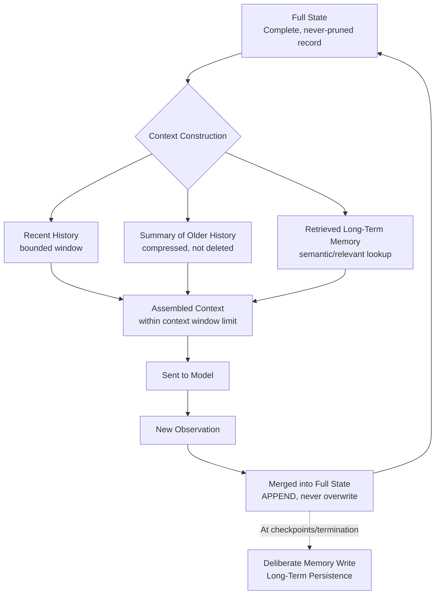

# 11 — State, Context, and Memory

> 📘 File 11 of 25 — Loop Engineering Knowledge Library
> Phase: The Loop Itself
> Prerequisite: `04_Core_Concepts.md`, `07_Loop_Lifecycle.md`, `09_Core_Components.md`

---

## 1. Introduction

### Topic Overview

State, context, and memory are the most-referenced concepts in this entire library — nearly every prior file pointed here for the full treatment. This file delivers it: how loops track what they know *right now* (state), how that gets packaged for the model to actually see (context), and how information survives *beyond* a single loop run (memory) — including the single most consequential failure mode in production agent systems: context rot.

### Why This Topic Matters

A 2026 industry report on production agent incidents found that over 60% traced back to state management failures — agents losing context mid-workflow, repeating completed steps, or crashing without recovery. This isn't a minor implementation detail; it's the leading cause of real-world agent failure, which is exactly why LangGraph's entire architectural identity centers on solving it explicitly.

---

## 2. Definition

### What Is It? (Simple Explanation)

Imagine three different notebooks. **State** is your scratch pad — everything you've figured out so far on the current problem. **Context** is the specific pages of that scratch pad you actually show your smart-but-forgetful colleague (the LLM) before asking them to think about what to do next — you can't show them the whole notebook, so you pick what's relevant. **Memory** is your filing cabinet — the stuff you keep even after you close the scratch pad, so you remember it next time you sit down to work.

### Technical Definition

> **State** is the structured, complete record of a loop's progress on its current run. **Context** is the specific, bounded subset of that state (plus any external memory) actually assembled into the model's input for a given inference call — constrained by the model's **context window**, the maximum amount of text it can process at once. **Memory** is information deliberately persisted beyond the current loop run, further divided into **short-term memory** (session-scoped) and **long-term memory** (cross-session, often retrieved via semantic similarity rather than exact lookup).

---

## 3. Core Concepts

### Fundamental Ideas

- **State, context, and memory are three genuinely different things**, even though they're often conflated in casual discussion
- **Context is always a *subset* of state** — you almost never show the model literally everything the loop knows; you curate
- **Context windows are finite** — every model has a hard limit on how much text it can process in one call, and that limit shrinks the room for the loop's own reasoning as more history accumulates
- **Context rot is a real, measurable phenomenon** — reasoning quality degrades as the context window fills with accumulated, increasingly irrelevant history, not just when the hard token limit is hit
- **Memory persistence requires a deliberate write decision** — nothing survives a loop run automatically; someone (a component, usually the Memory Manager from file 09) has to decide what's worth keeping

### Key Terminology

- **State** — the full, structured record of a loop's current-run progress
- **Context** — the bounded subset of state (and retrieved memory) actually sent to the model
- **Context window** — the maximum amount of text an LLM can process in a single call
- **Context rot** — degraded reasoning quality caused by an overloaded or stale context window
- **Short-term memory** — memory scoped to the current session/conversation
- **Long-term memory** — memory persisting across separate sessions
- **Checkpointing** — saving state at a point in time to enable pause/resume (see file 07)
- **Summarization** — compressing older history into a shorter representation to reclaim context space
- **Vector memory / semantic retrieval** — recalling memory by meaning-based similarity rather than exact key lookup

---

## 4. How It Works

### Step-by-Step Explanation

1. Every iteration, the loop's **full state** (goal, history, findings) exists in memory (the Python object, not the AI concept)
2. Before each model call, a **context construction** step decides what subset of that state to actually include
3. If state has grown large, **summarization or pruning** may compress older entries before inclusion
4. If long-term memory is relevant, a **retrieval** step (often semantic/vector-based) pulls in only the most relevant prior information
5. The assembled context (recent state + retrieved memory, all within the context window limit) is sent to the model
6. After the model responds and the loop takes an action, the **new observation is merged into full state** — even if it wasn't all shown to the model
7. At certain points (checkpointing, or the loop's termination), a **memory write decision** determines what — if anything — gets persisted to long-term memory

### Internal Workflow

```python
import json

class StateContextMemoryManager:
    """A complete implementation showing state, context construction,
    and memory as three genuinely distinct, interacting layers."""

    def __init__(self, max_context_entries=6, long_term_store=None):
        self.max_context_entries = max_context_entries
        self.long_term_store = long_term_store or {}  # simulated persistent store

    # ── STATE: the full record, never truncated ──────────────
    def initialize_state(self, goal):
        return {
            "goal": goal,
            "full_history": [],   # EVERYTHING — never pruned
            "summary": None,       # a compressed representation of older history
        }

    def update_state(self, state, new_entry):
        """Always appends to full_history — state itself is never lossy."""
        state["full_history"].append(new_entry)
        return state

    # ── CONTEXT: a curated, bounded subset of state ──────────
    def construct_context(self, state, goal_key_for_memory=None):
        """This is where context rot gets actively PREVENTED —
        by deliberately bounding what's shown to the model."""
        recent_entries = state["full_history"][-self.max_context_entries:]

        context_parts = [f"Goal: {state['goal']}"]

        if state["summary"]:
            context_parts.append(f"Summary of earlier progress: {state['summary']}")

        if len(state["full_history"]) > self.max_context_entries:
            context_parts.append(
                f"[{len(state['full_history']) - self.max_context_entries} "
                f"earlier entries omitted — see summary above]"
            )

        context_parts.append(f"Recent history: {json.dumps(recent_entries)}")

        # Pull in relevant LONG-TERM memory, if any exists for this task
        if goal_key_for_memory:
            relevant_memory = self.recall(goal_key_for_memory)
            if relevant_memory:
                context_parts.append(f"Relevant past learnings: {relevant_memory}")

        return "\n".join(context_parts)

    def maybe_summarize(self, state, summarizer_fn):
        """Triggered periodically — compresses older history to reclaim
        context space WITHOUT deleting it from full state."""
        if len(state["full_history"]) > self.max_context_entries * 2:
            older_entries = state["full_history"][:-self.max_context_entries]
            state["summary"] = summarizer_fn(older_entries, state.get("summary"))
        return state

    # ── MEMORY: deliberate persistence beyond this run ───────
    def remember(self, key, value):
        """LONG-TERM memory write — a deliberate decision, not automatic."""
        self.long_term_store[key] = value

    def recall(self, key):
        """LONG-TERM memory read."""
        return self.long_term_store.get(key)


def simple_summarizer(entries, existing_summary):
    """Placeholder — a real implementation would call an LLM to
    produce a genuine compressed summary of these entries."""
    combined = (existing_summary or "") + f" + {len(entries)} more entries summarized"
    return combined


# ── USAGE: state grows, context stays bounded, memory persists ──
manager = StateContextMemoryManager(max_context_entries=3)
state = manager.initialize_state("Research renewable energy trends")

for i in range(8):
    state = manager.update_state(state, {"finding": f"Finding #{i+1}"})
    state = manager.maybe_summarize(state, simple_summarizer)

# Even though full_history has 8 entries, context stays bounded:
context = manager.construct_context(state)
print(context)
print(f"\nFull state still has ALL {len(state['full_history'])} entries preserved.")

# Persist something genuinely worth remembering beyond this run:
manager.remember("renewable_energy_trends", state["summary"])
```

---

## 5. Architecture / Workflow

### Mermaid Flowchart



---

## 6. Components / Types

### Main Components

| Layer | Scope | Lossy? | Typical Storage |
|---|---|---|---|
| **State** | Current loop run only | No — complete record | In-memory Python object, or a database row |
| **Context** | What's sent to the model THIS call | Yes — deliberately bounded | Constructed fresh each call, not stored |
| **Short-term Memory** | Current session/conversation | Sometimes summarized | Session store, cache |
| **Long-term Memory** | Across separate sessions | Depends on write policy | Database, vector store, file |

### Types of Memory Retrieval

- **Exact key lookup** — retrieve memory by an exact identifier (e.g., a user ID, a task name)
- **Semantic/vector retrieval** — retrieve memory by meaning-based similarity, useful when you don't know the exact key but know the *topic* (see file 22 for vector database options)
- **Hybrid** — combine both, e.g., filter by user ID first, then rank by semantic similarity within that subset

### Types of Context Management Strategies

| Strategy | How It Works | Best For |
|---|---|---|
| **Sliding window** | Keep only the N most recent entries | Simple tasks where old context is genuinely less relevant |
| **Summarization** | Compress older entries into a shorter representation | Long tasks where earlier context still matters, just not verbatim |
| **Retrieval-augmented** | Store everything, retrieve only what's relevant per-query | Very long tasks or cross-session memory (see file 22 for RAG) |
| **Hierarchical** | Multiple summary levels (recent detail, mid-term summary, long-term abstract) | Extremely long-running agents (multi-day workflows) |

---

## 7. Examples

### Beginner Example

Demonstrating context rot concretely — showing why an unbounded context isn't just "slower," it actively degrades reasoning:

```python
def demonstrate_context_growth(num_iterations):
    """Illustrates why unbounded state-as-context is a real problem,
    not just a theoretical one."""
    history = []
    for i in range(num_iterations):
        history.append(f"Iteration {i+1}: some finding or action taken")

    # Naive approach: dump EVERYTHING into context every time
    naive_context = "\n".join(history)

    # Bounded approach: only recent + a summary marker
    bounded_context = "\n".join(history[-3:])
    if len(history) > 3:
        bounded_context = f"[{len(history)-3} earlier entries summarized]\n" + bounded_context

    print(f"Naive context size: {len(naive_context)} chars")
    print(f"Bounded context size: {len(bounded_context)} chars")
    print(f"Reduction: {100 - (len(bounded_context)/len(naive_context)*100):.1f}%")

demonstrate_context_growth(20)
# Naive context size: ~1000+ chars and GROWING every iteration
# Bounded context size: stays roughly constant regardless of total iterations
```

The naive version's context size grows linearly forever; the bounded version stays roughly constant — this is the difference between a loop that degrades over a long run and one that doesn't.

### Intermediate Example

A checkpoint-and-resume implementation that correctly separates ephemeral state from what actually needs to be saved — connecting directly back to file 07's lifecycle:

```python
import json
import time

class CheckpointableLoop:
    def __init__(self, goal):
        self.state = {"goal": goal, "history": [], "iteration": 0}

    def checkpoint(self, path="checkpoint.json"):
        """Saves FULL state — this must be complete enough to
        perfectly reconstruct the loop, per file 07's lifecycle model."""
        with open(path, "w") as f:
            json.dump({
                "state": self.state,
                "saved_at": time.time(),
            }, f)

    @classmethod
    def resume(cls, path="checkpoint.json"):
        with open(path) as f:
            saved = json.load(f)

        instance = cls(saved["state"]["goal"])
        instance.state = saved["state"]  # full state restored, nothing lost
        return instance

    def run_one_iteration(self):
        self.state["iteration"] += 1
        self.state["history"].append(f"Did work in iteration {self.state['iteration']}")


# Simulate a loop running, checkpointing, then resuming after an interruption
loop = CheckpointableLoop("Long-running analysis task")
loop.run_one_iteration()
loop.run_one_iteration()
loop.checkpoint()  # simulate a server restart happening right here

# ... later, possibly in a different process entirely ...
resumed_loop = CheckpointableLoop.resume()
print(f"Resumed at iteration {resumed_loop.state['iteration']}")  # 2, not 0
resumed_loop.run_one_iteration()
print(resumed_loop.state)  # iteration 3, full history intact
```

### Advanced / Real-World Example

A hierarchical memory system combining short-term sliding window, mid-term summarization, and long-term semantic retrieval — the pattern used in genuinely long-running production agents:

```python
class HierarchicalMemorySystem:
    """Three memory tiers, each with a different retention strategy —
    the production-grade answer to context rot in long-running agents."""

    def __init__(self, recent_window=5, summary_trigger=15):
        self.recent_window = recent_window
        self.summary_trigger = summary_trigger
        self.full_history = []          # TIER 1: complete raw record
        self.mid_term_summaries = []     # TIER 2: periodic compressions
        self.long_term_facts = {}         # TIER 3: durable, cross-session facts

    def add_entry(self, entry):
        self.full_history.append(entry)

        # Trigger mid-term summarization periodically
        if len(self.full_history) % self.summary_trigger == 0:
            batch = self.full_history[-self.summary_trigger:]
            summary = self._summarize_batch(batch)
            self.mid_term_summaries.append(summary)

    def _summarize_batch(self, batch):
        # Placeholder — real implementation calls an LLM to compress
        return f"Summary of {len(batch)} entries: key themes extracted"

    def extract_durable_fact(self, key, value):
        """Explicitly promotes something to LONG-TERM, cross-session memory.
        This is a DELIBERATE decision, never automatic."""
        self.long_term_facts[key] = value

    def build_context(self, current_query=None):
        """Assembles a bounded context from ALL THREE tiers."""
        parts = []

        # Tier 3: relevant durable facts (would use semantic search in production)
        if self.long_term_facts:
            parts.append(f"Known facts: {self.long_term_facts}")

        # Tier 2: mid-term summaries (compressed history)
        if self.mid_term_summaries:
            parts.append(f"Earlier session summaries: {self.mid_term_summaries[-2:]}")

        # Tier 1: only the MOST recent raw entries
        recent = self.full_history[-self.recent_window:]
        parts.append(f"Recent detail: {recent}")

        return "\n".join(parts)


memory = HierarchicalMemorySystem(recent_window=3, summary_trigger=5)

for i in range(12):
    memory.add_entry(f"Event {i+1} occurred")

memory.extract_durable_fact("user_timezone", "IST")
memory.extract_durable_fact("project_deadline", "2026-08-01")

context = memory.build_context()
print(context)
# Context stays bounded and relevant even after 12+ raw events,
# because durable facts and summaries carry the long-term signal
# while only recent detail stays in full resolution.
```

---

## 8. Best Practices

### Do's

- ✅ Keep **full state** complete and lossless — never delete information from the underlying record, even when context shown to the model is bounded
- ✅ Actively bound **context** sent to each model call — unbounded context is the direct cause of context rot
- ✅ Make memory writes **deliberate** — decide explicitly what's worth persisting beyond the current run, rather than dumping everything into long-term storage
- ✅ Use semantic/vector retrieval for long-term memory when you don't know the exact key you'll need later — exact-match lookup only works when you know precisely what to ask for

### Recommended Techniques

- Set a concrete context size budget (in tokens, not just entry count) and test your loop's behavior as it approaches that budget — don't wait for production to discover context rot
- Separate "what the loop needs to remember to finish THIS task" (state/short-term memory) from "what's worth knowing NEXT time" (long-term memory) as two genuinely different design questions

---

## 9. Common Mistakes

### Frequent Errors

| Mistake | Consequence |
|---|---|
| Treating state and context as the same thing | Either bloats every model call with irrelevant history, or accidentally loses information the model actually needed |
| No summarization/pruning strategy for long-running loops | Context window eventually fills entirely, or reasoning quality degrades well before that hard limit |
| Automatically persisting everything to long-term memory | Long-term store becomes noisy and unhelpful — relevant facts get buried in irrelevant details |
| Using exact-match memory lookup for topics you can't predict the exact key for | Genuinely relevant memory never gets retrieved because the lookup key didn't match |
| Deleting information from state to "save space" | Destroys the ability to debug or checkpoint/resume reliably — bound *context*, never destroy *state* |

### How to Avoid Them

- Always ask three separate questions when designing memory: "What does this loop run need right now (state)?", "What should the model actually see this call (context)?", and "What's worth keeping after this run ends (memory)?" — treating them as one question is the root of most bugs here
- Test your summarization function's output quality directly, not just its compression ratio — a summary that's shorter but loses the critical detail is worse than no summarization at all

---

## 10. Advantages & Limitations

### Benefits of Deliberate State/Context/Memory Separation

- Directly prevents context rot, the single most common cause of degraded agent reasoning in long-running tasks
- Enables reliable checkpointing and resumption (file 07) because full state is never lossy
- Makes long-term memory genuinely useful rather than a noisy dumping ground
- Provides a clear mental model for diagnosing "the agent forgot something" bugs — which layer failed?

### Limitations

- Summarization is lossy by nature — a poorly designed summarizer can discard genuinely important detail
- Semantic/vector retrieval introduces its own failure mode: retrieving *plausible-sounding but wrong* memories due to imperfect similarity matching
- Hierarchical memory systems (the advanced example) add real implementation complexity that simple, short-lived loops don't need

---

## 11. Comparison

### Compare with Related Concepts

| Concept | Scope | Relationship |
|---|---|---|
| **RAG (Retrieval-Augmented Generation)** | A technique for injecting external knowledge into context | Long-term memory retrieval (Section 6) is essentially RAG applied to an agent's own history |
| **Database Caching** | Storing computed results for reuse | Short-term memory serves an analogous role within a single session |
| **Human Working Memory vs. Long-Term Memory (cognitive science)** | Psychological memory model | Directly analogous to this file's state/context vs. long-term memory split |

### Summary Table

| Layer | Persists Beyond This Run? | Bounded/Curated? | Primary Risk If Mismanaged |
|---|---|---|---|
| State | No (unless checkpointed) | No — complete record | Loss of full history if treated as ephemeral |
| Context | No — reconstructed each call | Yes — always bounded | Context rot if left unbounded |
| Short-term Memory | No — session-scoped | Sometimes | Confusion with long-term memory |
| Long-term Memory | **Yes** | Yes — via retrieval | Noisy/irrelevant if writes aren't deliberate |

---

## 12. Summary

### Key Takeaways

- **State** is the complete, lossless record of a loop's current run; **Context** is the deliberately bounded subset actually shown to the model; **Memory** is what's deliberately persisted beyond the run
- **Context rot** — degraded reasoning from an overloaded context window — is a documented, measurable failure mode, and the leading cause of production agent incidents according to industry data
- The fix for context rot is **active context management**: sliding windows, summarization, or retrieval-augmented approaches — never simply dumping all accumulated state into every model call
- **Memory writes must be deliberate** — nothing persists automatically, and treating long-term memory as a dumping ground defeats its purpose

### Cheat Sheet

```
THREE LAYERS, THREE QUESTIONS:

STATE    → "What does this loop run currently know?" (complete, never lossy)
CONTEXT  → "What should the model see THIS call?"     (always bounded)
MEMORY   → "What's worth keeping after this run?"     (deliberate writes only)

CONTEXT MANAGEMENT STRATEGIES:
  Sliding window      → keep N most recent entries
  Summarization       → compress older entries, don't delete from state
  Retrieval-augmented → store everything, retrieve only what's relevant
  Hierarchical        → combine all three for very long-running agents

RULE: bound CONTEXT aggressively. Never truncate STATE. Write to MEMORY deliberately.
```

---

## 13. Glossary

| Term | Definition |
|---|---|
| **State** | The complete, structured record of a loop's progress on its current run |
| **Context** | The bounded subset of state (plus retrieved memory) sent to the model for a given call |
| **Context Window** | The maximum amount of text an LLM can process in a single inference call |
| **Context Rot** | Degraded reasoning quality caused by an overloaded or stale context window |
| **Short-term Memory** | Memory scoped to the current session or conversation |
| **Long-term Memory** | Memory persisting across separate sessions, often retrieved semantically |
| **Checkpointing** | Saving state at a point in time to enable pause/resume |
| **Summarization** | Compressing older history into a shorter representation to reclaim context space |
| **Vector Memory / Semantic Retrieval** | Recalling memory by meaning-based similarity rather than exact key lookup |
| **Sliding Window** | A context strategy retaining only the N most recent entries |

---

## 14. References & Further Reading

### Official Documentation

- LangGraph — [Memory & Persistence Documentation](https://docs.langchain.com/oss/python/langgraph/overview)
- Anthropic — [Context Window and Prompt Engineering Documentation](https://docs.claude.com)

### Research Papers

- Lewis et al., 2020 — *"Retrieval-Augmented Generation for Knowledge-Intensive NLP Tasks"* — foundational RAG paper, directly applicable to long-term memory retrieval

### Further Reading

- Industry reporting on production agent failure rates (LangChain's State of Agent Engineering report) — the source for the 60%+ state-management-failure statistic cited in Section 1

### Where to Go Next in This Library

- Previous file: `10_Types_of_Loops.md`
- Next file: `12_Feedback_and_Iteration.md` — how loops use observations (including memory) to self-correct
- Related: `22_Frameworks_and_LLM_Compatibility.md` — vector database and RAG framework options for production long-term memory

---

*This is File 11 of 25 in the Loop Engineering Knowledge Library. See `README.md` for the full index and suggested reading paths.*
