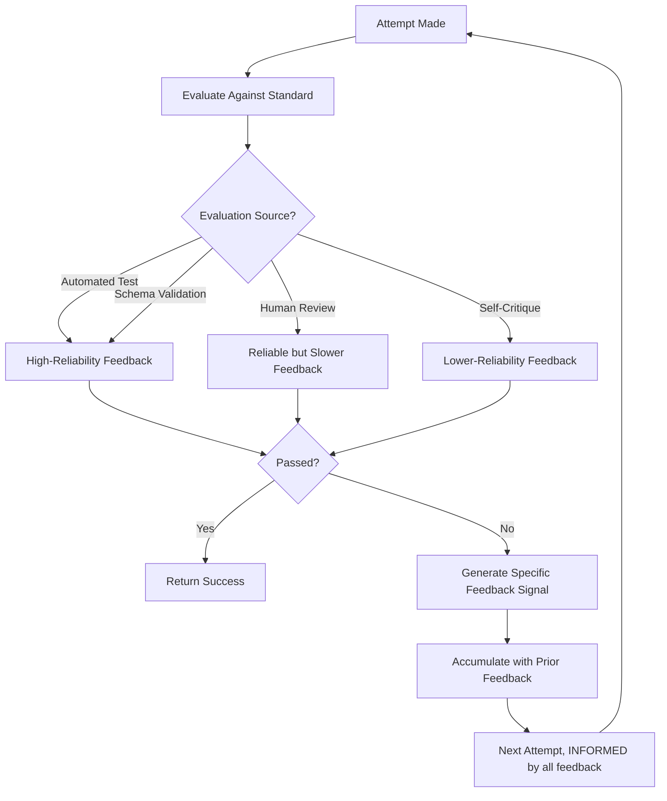

# 12 — Feedback and Iteration

> 📘 File 12 of 25 — Loop Engineering Knowledge Library
> Phase: The Loop Itself
> Prerequisite: `09_Core_Components.md`, `10_Types_of_Loops.md`, `11_State_Context_and_Memory.md`

---

## 1. Introduction

### Topic Overview

File 10 introduced Reflexion as a pattern that learns from failure. This file goes deeper on the general mechanism underneath it: **feedback** — how a loop evaluates its own output and turns that evaluation into genuine improvement across iterations, rather than just repeating the same mistake with different wording.

### Why This Topic Matters

Not all "iteration" is actually improvement. A loop that retries five times without genuine feedback is just running the same dice roll five times — it might get lucky, but it isn't *learning* anything between attempts. This file draws the critical distinction between blind retry and genuine feedback-driven iteration, and shows how to build the latter.

---

## 2. Definition

### What Is It? (Simple Explanation)

Imagine two students retaking a failed test. Student A retakes the identical test with no idea what they got wrong — pure luck determines if they do better. Student B gets their graded test back, sees exactly which questions were wrong and why, studies specifically those topics, then retakes it. Student B is using **feedback**. Student A is just... trying again.

### Technical Definition

> **Feedback** in a loop context is a structured signal — derived from evaluating an attempt's output against some standard (a test suite, a rubric, a human review, a self-critique) — that specifically identifies *what* was wrong and, ideally, *why*, such that the next iteration can make a genuinely informed adjustment rather than an undirected retry. **Iteration** driven by feedback is fundamentally different from iteration driven by *randomness alone* (e.g., simply re-sampling the model and hoping for a better roll).

---

## 3. Core Concepts

### Fundamental Ideas

- **Feedback must be *specific* to be useful** — "that's wrong, try again" is far weaker than "the function returns -1 for add(2,3), expected 5"
- **Feedback sources vary in reliability** — automated tests are highly reliable feedback; self-critique from the same model that produced the error is the least reliable
- **There's a real difference between "retry" and "iterate with feedback"** — this file's central distinction
- **Feedback can come from inside the loop (self-critique) or outside it (tests, human review, environment signals)** — external feedback is generally more trustworthy

### Key Terminology

- **Feedback signal** — structured information about what was wrong with an attempt
- **Self-critique** — feedback generated by the same (or another) model reviewing its own/another's output
- **External verification** — feedback derived from an objective, non-model source (tests, schemas, human review)
- **Reward signal** — a score or scalar indicating how good an attempt was, sometimes used to compare between attempts
- **Blind retry** — re-attempting a task without any specific feedback about what to change
- **Iterative refinement** — improving output across multiple passes using feedback from each pass

---

## 4. How It Works

### Step-by-Step Explanation

1. An attempt is made (using any of the patterns from file 10)
2. The attempt's output is **evaluated** against some standard
3. If the evaluation is negative (failure), a **feedback signal** is generated — specific, ideally actionable
4. That feedback is **incorporated into the next attempt's context** (not just noted, but actually used)
5. A new attempt is made, informed by that feedback
6. The cycle repeats until success, or a maximum retry count is reached
7. [Optional] all feedback across attempts is retained, so later attempts benefit from *all* prior feedback, not just the most recent

### Internal Workflow

```python
from dataclasses import dataclass, field
from enum import Enum

class FeedbackSource(Enum):
    AUTOMATED_TEST = "automated_test"       # most reliable
    SCHEMA_VALIDATION = "schema_validation"  # highly reliable
    HUMAN_REVIEW = "human_review"             # reliable but slow/costly
    SELF_CRITIQUE = "self_critique"            # least reliable, cheapest

@dataclass
class FeedbackSignal:
    source: FeedbackSource
    passed: bool
    specific_issues: list = field(default_factory=list)  # THIS is what makes feedback useful
    raw_detail: str = ""


# ── FEEDBACK GENERATORS: different reliability tiers ─────────

def test_based_feedback(code: str, test_cases: list) -> FeedbackSignal:
    """HIGH RELIABILITY: an objective, automated check."""
    issues = []
    namespace = {}
    try:
        exec(code, namespace)
        fn = namespace.get("solution")
        for inp, expected in test_cases:
            actual = fn(*inp) if isinstance(inp, tuple) else fn(inp)
            if actual != expected:
                issues.append(f"Input {inp}: expected {expected}, got {actual}")
    except Exception as e:
        issues.append(f"Code raised an exception: {e}")

    return FeedbackSignal(
        source=FeedbackSource.AUTOMATED_TEST,
        passed=len(issues) == 0,
        specific_issues=issues
    )


def self_critique_feedback(output: str, critique_fn) -> FeedbackSignal:
    """LOWER RELIABILITY: the model judging its own/another's output.
    Useful when no automated check is available, but treat with caution —
    see file 10's note on Reflexion's self-reinforcing blind spots."""
    critique_result = critique_fn(output)  # in production: an LLM call
    return FeedbackSignal(
        source=FeedbackSource.SELF_CRITIQUE,
        passed=critique_result["verdict"] == "good",
        specific_issues=critique_result.get("issues", []),
        raw_detail=critique_result.get("explanation", "")
    )


# ── THE FEEDBACK-DRIVEN ITERATION LOOP ────────────────────────
def feedback_driven_loop(task, attempt_fn, feedback_fn, max_attempts=4):
    accumulated_feedback = []  # ALL prior feedback, not just the latest

    for attempt_num in range(max_attempts):
        # Each attempt is INFORMED by everything learned so far
        output = attempt_fn(task, accumulated_feedback)

        feedback = feedback_fn(output)

        if feedback.passed:
            return {"status": "success", "output": output, "attempts": attempt_num + 1}

        accumulated_feedback.append({
            "attempt": attempt_num + 1,
            "issues": feedback.specific_issues,
            "source": feedback.source.value
        })

    return {
        "status": "max_attempts_exhausted",
        "final_output": output,
        "all_feedback": accumulated_feedback
    }


# ── DISTINGUISHING FROM BLIND RETRY (for comparison) ──────────
def blind_retry_loop(task, attempt_fn, feedback_fn, max_attempts=4):
    """The ANTI-PATTERN: retries with NO specific feedback carried forward.
    Included here to make the contrast concrete."""
    for attempt_num in range(max_attempts):
        output = attempt_fn(task, [])  # <-- always empty, no learning at all
        feedback = feedback_fn(output)
        if feedback.passed:
            return {"status": "success", "output": output, "attempts": attempt_num + 1}
    return {"status": "max_attempts_exhausted"}
```

---

## 5. Architecture / Workflow

### Mermaid Flowchart



---

## 6. Components / Types

### Main Components

| Component | Responsibility |
|---|---|
| **Attempt Generator** | Produces an output, ideally informed by accumulated feedback |
| **Evaluator** | Judges the attempt against a standard (test, schema, rubric, human) |
| **Feedback Extractor** | Converts a raw pass/fail evaluation into specific, actionable detail |
| **Feedback Accumulator** | Retains feedback across multiple attempts so nothing is lost |

### Types of Feedback Sources (Reliability Spectrum)

| Source | Reliability | Cost/Speed | Best For |
|---|---|---|---|
| **Automated Tests** | Highest — objective, deterministic | Fast, cheap | Code generation, anything with a checkable spec |
| **Schema Validation** | Very high — objective, structural | Fast, cheap | Structured output (JSON, function calls) |
| **Human Review** | High — genuinely independent judgment | Slow, expensive | High-stakes decisions, subjective quality |
| **Self-Critique (different model)** | Moderate — independent but imperfect | Moderate | Tasks with no automated check, budget for a second model |
| **Self-Critique (same model)** | Lowest — prone to repeating blind spots | Cheapest | Only when nothing better is available |

### Types of Iteration Patterns

- **Single-signal iteration** — one feedback source, straightforward retry
- **Multi-signal iteration** — combining several feedback sources (e.g., tests AND a style critique) into one signal
- **Escalating iteration** — start with cheap self-critique, escalate to human review only if repeated attempts fail

---

## 7. Examples

### Beginner Example

The exact contrast between blind retry and feedback-driven iteration on the same buggy function, run side by side:

```python
def buggy_attempt_generator(task, feedback_history):
    """Simulates an LLM attempt. With NO feedback, it keeps guessing randomly.
    WITH feedback, it actually corrects the specific issue mentioned."""
    if not feedback_history:
        return "def solution(a, b): return a - b"  # wrong: subtraction instead of addition

    last_issue = feedback_history[-1]["issues"][0] if feedback_history[-1]["issues"] else ""
    if "expected 5, got -1" in last_issue or "expected" in last_issue:
        return "def solution(a, b): return a + b"  # corrected, informed by feedback

    return "def solution(a, b): return a - b"  # unchanged if no useful signal


def simple_test_feedback(code):
    return test_based_feedback(code, test_cases=[((2, 3), 5)])


# Feedback-driven: succeeds by attempt 2, because it USES the specific issue
result = feedback_driven_loop("add two numbers", buggy_attempt_generator, simple_test_feedback)
print("Feedback-driven:", result["status"], "in", result.get("attempts"), "attempts")

# Blind retry: NEVER succeeds, because it never learns anything (always empty feedback_history)
blind_result = blind_retry_loop("add two numbers", buggy_attempt_generator, simple_test_feedback)
print("Blind retry:", blind_result["status"])  # max_attempts_exhausted, every time
```

### Intermediate Example

Combining two feedback sources — automated tests AND a style check — into one multi-signal feedback loop:

```python
def multi_signal_feedback(code: str) -> FeedbackSignal:
    test_result = test_based_feedback(code, test_cases=[((2, 3), 5), ((10, -2), 8)])

    style_issues = []
    if "lambda" in code:
        style_issues.append("Style: prefer 'def' over 'lambda' for named functions")
    if len(code) > 200:
        style_issues.append("Style: function is unusually long, consider simplifying")

    all_issues = test_result.specific_issues + style_issues
    return FeedbackSignal(
        source=FeedbackSource.AUTOMATED_TEST,  # tests are the PASS/FAIL authority
        passed=test_result.passed,               # style issues don't block success,
        specific_issues=all_issues,                # but they DO get surfaced as feedback
    )


def code_attempt_generator(task, feedback_history):
    if not feedback_history:
        return "def solution(a, b): return a + b"  # already correct, for this example
    return "def solution(a, b): return a + b"


result = feedback_driven_loop(
    "add two numbers", code_attempt_generator, multi_signal_feedback, max_attempts=2
)
print(result)
```

### Advanced / Real-World Example

An escalating feedback system — cheap self-critique first, human review only if the model can't resolve it after repeated attempts — balancing cost against reliability:

```python
class EscalatingFeedbackLoop:
    """Starts cheap (self-critique), escalates to expensive (human review)
    only when necessary — a realistic production cost/reliability tradeoff."""

    def __init__(self, self_critique_fn, human_review_fn, escalate_after=2):
        self.self_critique_fn = self_critique_fn
        self.human_review_fn = human_review_fn
        self.escalate_after = escalate_after

    def run(self, task, attempt_fn, max_attempts=5):
        accumulated_feedback = []

        for attempt_num in range(max_attempts):
            output = attempt_fn(task, accumulated_feedback)

            if attempt_num < self.escalate_after:
                # Cheap tier: self-critique
                feedback = self_critique_feedback(output, self.self_critique_fn)
                tier = "self_critique"
            else:
                # Escalated tier: genuinely independent human judgment
                feedback = self._human_feedback(output)
                tier = "human_review"

            if feedback.passed:
                return {
                    "status": "success", "output": output,
                    "attempts": attempt_num + 1, "final_tier": tier
                }

            accumulated_feedback.append({
                "attempt": attempt_num + 1,
                "tier": tier,
                "issues": feedback.specific_issues
            })

        return {
            "status": "exhausted_all_tiers",
            "all_feedback": accumulated_feedback
        }

    def _human_feedback(self, output):
        result = self.human_review_fn(output)  # in production: a real review queue
        return FeedbackSignal(
            source=FeedbackSource.HUMAN_REVIEW,
            passed=result["approved"],
            specific_issues=result.get("comments", [])
        )


def mock_self_critique(output):
    return {"verdict": "bad", "issues": ["Self-critique flagged a possible edge case"]}

def mock_human_review(output):
    return {"approved": True, "comments": []}  # human approves after escalation

def mock_attempt(task, feedback_history):
    return f"Attempt informed by {len(feedback_history)} prior feedback item(s)"


escalating_loop = EscalatingFeedbackLoop(
    self_critique_fn=mock_self_critique,
    human_review_fn=mock_human_review,
    escalate_after=2
)
result = escalating_loop.run("Draft a sensitive customer communication", mock_attempt)
print(result)
```

---

## 8. Best Practices

### Do's

- ✅ Always prefer automated, objective feedback (tests, schema validation) over self-critique when the domain allows it
- ✅ Make feedback **specific**, not just pass/fail — "expected 5, got -1" is actionable; "that's wrong" isn't
- ✅ Accumulate feedback across attempts rather than discarding it after each retry — later attempts should benefit from everything learned, not just the most recent signal
- ✅ Use escalating feedback tiers (cheap first, expensive only when needed) to balance cost against reliability in production

### Recommended Techniques

- When only self-critique is available, use a genuinely different model or a substantially different prompt for the critique step than for the original attempt, to reduce the self-reinforcing blind-spot risk noted in file 10
- Cap the number of feedback-driven iterations explicitly — feedback-driven iteration is still iteration, and needs the same termination discipline from files 02 and 07

---

## 9. Common Mistakes

### Frequent Errors

| Mistake | Consequence |
|---|---|
| Retrying without carrying forward specific feedback | This is blind retry, not iteration — success becomes pure luck |
| Trusting self-critique as if it were an objective, independent check | Inherits the same model's blind spots, especially when using the identical model/prompt for both attempt and critique |
| Vague feedback ("this is wrong") | Next attempt has no concrete signal to act on, wastes the retry |
| No cap on feedback-driven iterations | Reintroduces the runaway-loop risk from file 02, just dressed up as "learning" |
| Discarding earlier feedback after each new attempt | Loses cumulative learning — later attempts can repeat earlier mistakes |

### How to Avoid Them

- Before building a feedback loop, explicitly identify what your most reliable available feedback source is (test suite? Schema? Human reviewer queue?) and default to it over self-critique
- Design your feedback signal format (like the `FeedbackSignal` dataclass in Section 4) to force specificity — a structure with a required `specific_issues` list is harder to fill with vague feedback than free-text alone

---

## 10. Advantages & Limitations

### Benefits of Feedback-Driven Iteration

- Turns retry from a gamble into genuine, directed improvement
- Makes failure informative rather than just wasted effort — every failed attempt produces a usable signal
- Enables graceful cost/reliability tradeoffs via escalating feedback tiers
- Directly strengthens the Reflexion pattern from file 10 by making its core mechanism (verbal feedback) rigorous rather than vague

### Limitations

- Feedback quality is bounded by the evaluator's own reliability — garbage feedback produces garbage-directed iteration
- Automated, objective feedback isn't available for every task (creative writing, subjective judgment calls) — some domains are stuck with less reliable self-critique or costly human review
- Accumulating feedback across many attempts can itself contribute to context bloat (see file 11) if not managed carefully

---

## 11. Comparison

### Compare with Related Concepts

| Concept | Relationship to Feedback and Iteration |
|---|---|
| **Reflexion (file 10)** | A specific loop pattern built around exactly this file's feedback mechanism |
| **Reinforcement Learning (traditional ML)** | Uses numeric reward signals and weight updates; feedback-driven iteration uses verbal/structured signals without retraining — directly analogous in spirit, different in mechanism |
| **Test-Driven Development (software engineering)** | A close real-world parallel — write the test (standard) first, then iterate code against it |

### Summary Table

| Question | Blind Retry | Feedback-Driven Iteration |
|---|---|---|
| Does each attempt use info from prior attempts? | No | Yes |
| Success rate over multiple attempts | Roughly random | Improves with each informed attempt |
| Requires a reliable evaluator? | No | Yes — quality is bounded by evaluator reliability |
| Appropriate when no evaluator is available? | Sometimes the only option | Not applicable — needs SOME evaluation signal |

---

## 12. Summary

### Key Takeaways

- **Feedback** is a structured, specific signal about what was wrong with an attempt — genuine iteration requires it, or you're just doing blind retry
- Feedback sources exist on a **reliability spectrum**: automated tests and schema validation are most reliable; same-model self-critique is least reliable
- **Accumulating** feedback across attempts (not discarding it after each retry) is what makes multi-attempt loops genuinely improve rather than randomly re-roll
- **Escalating feedback tiers** — cheap self-critique first, expensive human review only when needed — is a realistic production pattern for balancing cost against reliability

### Cheat Sheet

```
FEEDBACK RELIABILITY SPECTRUM (most to least reliable):

Automated Tests / Schema Validation  → objective, fast, cheap
Human Review                          → reliable, slow, expensive
Self-Critique (different model)        → moderate, independent-ish
Self-Critique (same model)              → weakest — repeats blind spots

RULE: retry WITHOUT specific carried-forward feedback = blind retry, not iteration.
       Always prefer the most reliable feedback source your domain allows.
```

---

## 13. Glossary

| Term | Definition |
|---|---|
| **Feedback Signal** | Structured information identifying what was wrong with an attempt |
| **Self-Critique** | Feedback generated by a model reviewing its own or another's output |
| **External Verification** | Feedback derived from an objective, non-model source |
| **Reward Signal** | A score indicating how good an attempt was |
| **Blind Retry** | Re-attempting a task with no specific feedback carried forward |
| **Iterative Refinement** | Improving output across multiple passes using feedback from each |
| **Escalating Feedback** | Starting with cheap feedback sources and escalating to costlier, more reliable ones only when needed |

---

## 14. References & Further Reading

### Official Documentation

- Anthropic — [Building Effective AI Agents](https://www.anthropic.com/research/building-effective-agents) — discusses evaluator-optimizer patterns directly relevant to this file

### Research Papers

- Shinn et al., 2023 — *"Reflexion: Language Agents with Verbal Reinforcement Learning"*
- Madaan et al., 2023 — *"Self-Refine: Iterative Refinement with Self-Feedback"*
- Gou et al., 2024 — *"CRITIC: Large Language Models Can Self-Correct with Tool-Interactive Critiquing"*

### Where to Go Next in This Library

- Previous file: `11_State_Context_and_Memory.md`
- Next file: `13_Planning_and_Reasoning.md` — how a loop decides its next action, the Controller's internal decision process in depth
- Related: `10_Types_of_Loops.md` — the Reflexion pattern this file's feedback mechanism directly powers

---

*This is File 12 of 25 in the Loop Engineering Knowledge Library. See `README.md` for the full index and suggested reading paths.*
