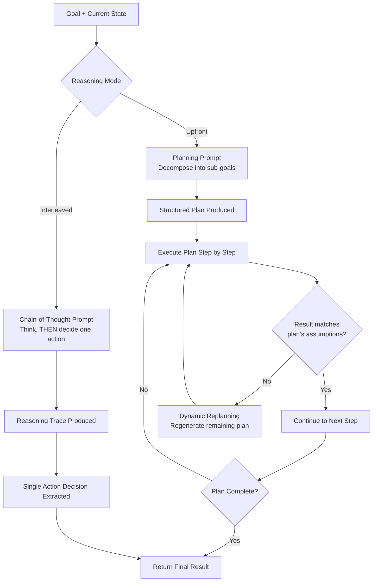

# 13 — Planning and Reasoning

> 📘 File 13 of 25 — Loop Engineering Knowledge Library
> Phase: The Loop Itself
> Prerequisite: `09_Core_Components.md`, `10_Types_of_Loops.md`

---

## 1. Introduction

### Topic Overview

File 09 introduced the Controller as "the component that decides what happens next." This file opens up *how* that decision actually gets made — the internal reasoning and planning mechanics that turn a goal and current state into a concrete next action. This is the most model-dependent part of any loop, but the *structural* techniques for eliciting good reasoning (chain-of-thought, explicit planning, decomposition) are consistent across models and frameworks.

### Why This Topic Matters

The quality of a loop's decisions is bounded by the quality of its reasoning. A Controller that jumps straight to an action without explicit reasoning tends to make shallower, more error-prone decisions than one that's structured to think first. This file covers the specific techniques that reliably improve decision quality.

---

## 2. Definition

### What Is It? (Simple Explanation)

Compare two people solving a jigsaw puzzle. One grabs pieces at random and tries jamming them together. The other looks at the box image, sorts edge pieces first, groups by color, and works section by section. Both might eventually finish, but the second approach — deliberate planning before action — succeeds faster and with far less wasted effort. Planning and reasoning are what push a loop's Controller toward the second approach.

### Technical Definition

> **Reasoning** is the explicit, often textual, intermediate thinking a model produces before committing to a decision — making its decision process inspectable and often more accurate than jumping directly to an answer. **Planning** is the specific application of reasoning to producing a structured sequence of intended steps toward a goal, which may be generated once upfront (see Plan-and-Execute, file 10) or continuously revised as new information arrives (**dynamic replanning**).

---

## 3. Core Concepts

### Fundamental Ideas

- **Explicit reasoning (chain-of-thought) reliably improves decision quality** compared to models jumping straight to an answer — this is one of the most well-established findings in LLM prompting research
- **Planning and reasoning are related but distinct** — reasoning is the general "thinking out loud" process; planning is reasoning specifically aimed at producing a multi-step sequence
- **Plans can be static (fixed upfront) or dynamic (revised as new information arrives)** — this maps directly onto the ReAct vs. Plan-and-Execute distinction from file 10
- **Decomposition — breaking a large goal into smaller sub-goals — is often what makes planning tractable** for complex tasks

### Key Terminology

- **Chain-of-thought (CoT)** — a technique where the model produces step-by-step reasoning text before its final answer
- **Reasoning trace** — the explicit text output representing a model's intermediate thinking
- **Planning** — reasoning specifically directed at producing a sequence of steps
- **Dynamic replanning** — revising a plan mid-execution as new information invalidates earlier assumptions
- **Decomposition** — breaking a large goal into smaller, more tractable sub-goals
- **Task graph** — a representation of sub-goals and their dependencies, used for complex multi-step planning

---

## 4. How It Works

### Step-by-Step Explanation

**For interleaved reasoning (ReAct-style, one step at a time):**
1. Given current state, the model is prompted to produce a reasoning trace *before* deciding on an action
2. That reasoning trace explicitly names relevant facts, considers options, and justifies a choice
3. The action decision is extracted from (or follows) that reasoning
4. The reasoning trace itself is included in the loop's history — useful both for the model's own future reference and for human debugging

**For upfront planning (Plan-and-Execute style):**
1. Given the full goal, the model is prompted to decompose it into a sequence of sub-goals
2. Each sub-goal is checked for basic soundness (is it achievable? does it depend on an earlier sub-goal completing first?)
3. The plan is stored as part of loop state
4. As execution proceeds, actual results are compared against the plan's assumptions
5. If a result invalidates an assumption, **dynamic replanning** is triggered — the remaining plan is regenerated with the new information

### Internal Workflow

```python
import re

# ── CHAIN-OF-THOUGHT: prompting for explicit reasoning ────────
def reasoning_prompt(state):
    """The prompt structure itself is what elicits chain-of-thought —
    explicitly asking the model to think before deciding."""
    return f"""Goal: {state['goal']}
History so far: {state['history']}

Think step by step:
1. What do you know so far?
2. What's still unclear or missing?
3. What's the single best next action, and why?

Provide your reasoning, then end with "DECISION: <action>"."""


def parse_reasoning_and_decision(model_output):
    """Separates the reasoning trace from the final decision —
    both get used, but for different purposes."""
    if "DECISION:" in model_output:
        reasoning, decision_part = model_output.split("DECISION:", 1)
        return {"reasoning": reasoning.strip(), "decision": decision_part.strip()}
    return {"reasoning": model_output, "decision": None}


# ── UPFRONT PLANNING: decomposition into sub-goals ────────────
def planning_prompt(goal):
    return f"""Goal: {goal}

Decompose this into a sequence of 3-6 concrete sub-goals.
For each sub-goal, note if it depends on a previous one completing first.
Format as a numbered list."""


def parse_plan(model_output):
    """Extracts a structured plan from the model's numbered-list output."""
    lines = model_output.strip().split("\n")
    steps = []
    for line in lines:
        match = re.match(r"^\d+\.\s*(.+)", line.strip())
        if match:
            steps.append(match.group(1))
    return steps


# ── DYNAMIC REPLANNING: revising when reality diverges ────────
class DynamicPlanner:
    def __init__(self, goal, initial_plan):
        self.goal = goal
        self.plan = initial_plan
        self.completed_steps = []
        self.replan_count = 0

    def execute_next_step(self, executor_fn):
        if not self.plan:
            return {"status": "plan_exhausted"}

        current_step = self.plan[0]
        result = executor_fn(current_step)

        if self._result_invalidates_plan(result):
            self._replan(reason=result.get("issue", "unexpected result"))
        else:
            self.completed_steps.append({"step": current_step, "result": result})
            self.plan = self.plan[1:]

        return {"status": "continuing", "completed": len(self.completed_steps)}

    def _result_invalidates_plan(self, result):
        # In production: an LLM call judging whether this result
        # breaks an assumption the remaining plan depends on
        return result.get("unexpected", False)

    def _replan(self, reason):
        """This is what separates STATIC plans (file 10's Plan-and-Execute)
        from genuinely adaptive planning."""
        self.replan_count += 1
        remaining_goal = f"{self.goal} (given: {reason}, already done: {self.completed_steps})"
        # In production: call planning_prompt(remaining_goal) -> parse_plan(...)
        self.plan = [f"Revised step (replan #{self.replan_count})"] + self.plan[1:]


def mock_executor(step):
    if "unexpected" in step:
        return {"unexpected": True, "issue": "Tool returned an error the plan didn't anticipate"}
    return {"unexpected": False, "output": f"Completed: {step}"}


planner = DynamicPlanner(
    goal="Write a research summary",
    initial_plan=["Gather sources", "Check for unexpected format issues", "Write summary"]
)
for _ in range(4):
    status = planner.execute_next_step(mock_executor)
    print(status)
    if status["status"] == "plan_exhausted":
        break
```

---

## 5. Architecture / Workflow

### Mermaid Flowchart



---

## 6. Components / Types

### Main Components

| Component | Role |
|---|---|
| **Reasoning Elicitor** | The prompt structure that induces explicit chain-of-thought |
| **Reasoning Parser** | Separates the reasoning trace from the extractable decision |
| **Planner** | Produces a structured, decomposed sequence of sub-goals |
| **Plan Validator** | Checks a proposed plan for basic soundness/dependency issues |
| **Replanning Trigger** | Detects when execution results invalidate the current plan |

### Types of Reasoning/Planning Approaches

| Approach | When Reasoning Happens | Adapts Mid-Execution? |
|---|---|---|
| **Chain-of-thought (interleaved)** | Before every single action | Yes — inherently, since it re-reasons each step |
| **Static upfront planning** | Once, before any execution | No — fixed plan, executed as-is |
| **Dynamic replanning** | Upfront, then re-triggered on invalidation | Yes — deliberately, when needed |
| **Hierarchical planning** | Upfront at a high level, then per-sub-goal in detail | Partially — high-level plan is stable, details adapt |

### Categories

Planning/reasoning techniques split by **granularity**:

- **Fine-grained (per-step)** — chain-of-thought reasoning applied to each individual action
- **Coarse-grained (whole-task)** — upfront decomposition applied once to the entire goal
- **Hybrid** — coarse-grained plan with fine-grained reasoning applied within each plan step

---

## 7. Examples

### Beginner Example

Demonstrating the concrete difference chain-of-thought prompting makes, even in a simplified simulated context:

```python
def without_cot(question):
    """Jumps straight to an answer — no explicit reasoning."""
    # Simulated: a model asked to answer directly tends to skip steps
    return "42"  # no shown work, error-prone on multi-step problems


def with_cot(question):
    """Elicits step-by-step reasoning BEFORE the answer."""
    reasoning = (
        "Step 1: The problem involves two quantities, 6 and 7.\n"
        "Step 2: The operation implied is multiplication.\n"
        "Step 3: 6 * 7 = 42."
    )
    answer = "42"
    return {"reasoning": reasoning, "answer": answer}


print(without_cot("What is 6 times 7?"))
result = with_cot("What is 6 times 7?")
print(result["reasoning"])
print("Answer:", result["answer"])
```

Both reach the same answer here, but the chain-of-thought version's *reasoning is inspectable* — if the answer were wrong, you could see exactly which step introduced the error, which is invaluable for debugging more complex reasoning chains.

### Intermediate Example

A decomposition example — breaking a genuinely complex goal into a validated sub-goal sequence:

```python
def decompose_goal(goal):
    """Simulates an LLM planning call producing sub-goals."""
    # In production, this comes from an actual model call using planning_prompt()
    if "research report" in goal.lower():
        return [
            {"step": "Identify 3-5 credible sources", "depends_on": None},
            {"step": "Extract key findings from each source", "depends_on": "Identify 3-5 credible sources"},
            {"step": "Synthesize findings into a coherent narrative", "depends_on": "Extract key findings from each source"},
            {"step": "Write executive summary", "depends_on": "Synthesize findings into a coherent narrative"},
        ]
    return [{"step": goal, "depends_on": None}]  # fallback: no decomposition possible


def validate_plan(plan):
    """Checks basic soundness: does every dependency actually exist earlier in the plan?"""
    step_names = [s["step"] for s in plan]
    for s in plan:
        if s["depends_on"] and s["depends_on"] not in step_names:
            return False, f"Step '{s['step']}' depends on missing step '{s['depends_on']}'"
    return True, "Plan is valid"


plan = decompose_goal("Write a research report on renewable energy")
is_valid, message = validate_plan(plan)
print(f"Plan valid: {is_valid} — {message}")
for step in plan:
    print(f"  - {step['step']}" + (f" (depends on: {step['depends_on']})" if step['depends_on'] else ""))
```

### Advanced / Real-World Example

A hierarchical planner combining coarse-grained upfront decomposition with fine-grained chain-of-thought reasoning *within* each sub-goal — the pattern used for genuinely complex, multi-stage agent tasks:

```python
class HierarchicalPlanner:
    """High-level plan is stable (coarse-grained); execution WITHIN
    each sub-goal uses fine-grained chain-of-thought reasoning."""

    def __init__(self, goal):
        self.goal = goal
        self.high_level_plan = self._decompose(goal)
        self.results = []

    def _decompose(self, goal):
        # Coarse-grained: produced ONCE, upfront
        return [
            "Understand the problem space",
            "Identify the best approach",
            "Execute the approach",
            "Verify the result",
        ]

    def execute(self, fine_grained_reasoner):
        for sub_goal in self.high_level_plan:
            # Fine-grained: chain-of-thought reasoning applied WITHIN this sub-goal,
            # re-evaluated fresh each time based on results so far
            sub_reasoning = fine_grained_reasoner(sub_goal, self.results)
            self.results.append({"sub_goal": sub_goal, "reasoning": sub_reasoning})

        return self.results

    def summarize(self):
        return {
            "goal": self.goal,
            "high_level_plan": self.high_level_plan,
            "detailed_results": self.results,
        }


def mock_fine_grained_reasoner(sub_goal, prior_results):
    """Simulates a chain-of-thought reasoning call for ONE sub-goal,
    informed by everything completed so far (this is where file 11's
    context management and file 12's feedback would also plug in)."""
    return f"Reasoned through '{sub_goal}' using {len(prior_results)} prior result(s) as context"


planner = HierarchicalPlanner("Design a database schema for a bookstore app")
planner.execute(mock_fine_grained_reasoner)
summary = planner.summarize()

print(f"High-level plan: {summary['high_level_plan']}")
for r in summary["detailed_results"]:
    print(f"  {r['sub_goal']}: {r['reasoning']}")
```

---

## 8. Best Practices

### Do's

- ✅ Explicitly prompt for reasoning before a decision (chain-of-thought), rather than asking a model to jump straight to an action — this reliably improves decision quality on non-trivial tasks
- ✅ Store reasoning traces in loop history (file 11), not just the final decision — they're valuable for debugging and can inform the model's own future reasoning
- ✅ Validate a generated plan's structural soundness (dependencies exist, steps are achievable) before committing to executing it
- ✅ Build dynamic replanning triggers for any task where real-world results might reasonably invalidate an upfront plan's assumptions

### Recommended Techniques

- Use hierarchical planning (coarse-grained upfront, fine-grained per-step) for genuinely complex tasks — it balances planning overhead against adaptability better than either pure static planning or pure step-by-step reasoning alone
- When decomposing a goal, explicitly ask the model to state dependencies between sub-goals, not just list them — this makes plan validation (and dynamic replanning) far more tractable

---

## 9. Common Mistakes

### Frequent Errors

| Mistake | Consequence |
|---|---|
| Skipping explicit reasoning, asking for direct decisions | Shallower, more error-prone decisions, especially on multi-step problems |
| Treating an upfront plan as immutable even when results contradict it | The loop keeps executing a plan built on now-false assumptions |
| No plan validation before execution begins | Wastes execution effort on a plan with broken/circular dependencies |
| Discarding reasoning traces, keeping only final decisions | Loses valuable debugging information and potential context for future reasoning |
| Over-decomposing simple tasks into unnecessary sub-goals | Adds planning overhead without proportional benefit |

### How to Avoid Them

- Default to chain-of-thought prompting for any decision beyond the trivially simple; the cost (a somewhat longer response) is almost always worth the accuracy gain
- Build the dynamic replanning check (Section 4's `_result_invalidates_plan`) as a deliberate, explicit function — don't assume the loop will "just notice" a plan has gone stale

---

## 10. Advantages & Limitations

### Benefits of Deliberate Planning and Reasoning

- Reliably improves decision quality compared to jumping straight to answers
- Makes a loop's decision-making process inspectable and debuggable via stored reasoning traces
- Dynamic replanning combines the efficiency of upfront planning with the adaptability of step-by-step reasoning
- Decomposition makes otherwise intractably complex goals achievable by breaking them into manageable sub-goals

### Limitations

- Chain-of-thought reasoning costs more tokens (and thus more time/money) per decision than a direct answer
- Planning quality is bounded by the model's ability to accurately anticipate dependencies and pitfalls — plans can still be wrong even when well-structured
- Over-planning simple tasks adds unnecessary overhead; not every goal benefits from decomposition

---

## 11. Comparison

### Compare with Related Concepts

| Concept | Relationship |
|---|---|
| **ReAct vs. Plan-and-Execute (file 10)** | This file's interleaved vs. upfront reasoning distinction is the mechanism underlying that pattern-level choice |
| **Classical AI Planning (STRIPS, hierarchical task networks)** | Pre-LLM symbolic planning research — this file's decomposition and dependency-checking concepts trace directly back to it |
| **Feedback and Iteration (file 12)** | Planning decides "what to do next"; feedback decides "was that right, and what should change" — complementary, not overlapping |

### Summary Table

| Question | Chain-of-Thought (per-step) | Upfront Planning | Dynamic Replanning |
|---|---|---|---|
| When does reasoning happen? | Every step | Once, before execution | Upfront + re-triggered on invalidation |
| Adapts to unexpected results? | Yes, inherently | No | Yes, deliberately |
| Relative cost | Higher (reasons every step) | Lower (reasons once) | Moderate (reasons upfront + occasionally) |
| Best for | Unpredictable, exploratory tasks | Well-understood, decomposable tasks | Complex tasks with SOME uncertainty |

---

## 12. Summary

### Key Takeaways

- **Chain-of-thought reasoning** — explicit step-by-step thinking before a decision — reliably improves decision quality and should be the default for non-trivial loop decisions
- **Planning** is reasoning specifically aimed at producing a structured, decomposed sequence of steps, and can be static (fixed upfront) or dynamic (revised mid-execution)
- **Decomposition** makes complex goals tractable by breaking them into smaller, dependency-checked sub-goals
- **Dynamic replanning** — detecting when execution results invalidate a plan's assumptions and regenerating the remaining plan — is what separates genuinely adaptive planning from brittle, static plans

### Cheat Sheet

```
REASONING & PLANNING TOOLKIT:

CHAIN-OF-THOUGHT   → explicit reasoning before EVERY decision (interleaved)
UPFRONT PLANNING   → decompose the WHOLE goal into steps ONCE
DYNAMIC REPLANNING → detect plan-invalidating results, regenerate remaining plan
DECOMPOSITION      → break complex goals into smaller, dependency-checked sub-goals
HIERARCHICAL       → coarse-grained plan + fine-grained per-step reasoning (best of both)

RULE: reasoning quality is inspectable — store the trace, not just the decision.
```

---

## 13. Glossary

| Term | Definition |
|---|---|
| **Chain-of-Thought (CoT)** | A prompting technique eliciting step-by-step reasoning before a final answer |
| **Reasoning Trace** | The explicit intermediate text representing a model's thinking process |
| **Planning** | Reasoning specifically directed at producing a structured sequence of steps |
| **Dynamic Replanning** | Revising a plan mid-execution when results invalidate earlier assumptions |
| **Decomposition** | Breaking a large goal into smaller, more tractable sub-goals |
| **Task Graph** | A representation of sub-goals and their dependencies |
| **Hierarchical Planning** | Combining a stable coarse-grained plan with adaptive fine-grained reasoning per step |

---

## 14. References & Further Reading

### Official Documentation

- Anthropic — [Prompt Engineering: Chain of Thought](https://docs.claude.com) — official guidance on eliciting effective reasoning

### Research Papers

- Wei et al., 2022 — *"Chain-of-Thought Prompting Elicits Reasoning in Large Language Models"* — the foundational CoT paper
- Yao et al., 2022 — *"ReAct: Synergizing Reasoning and Acting in Language Models"* — interleaved reasoning applied to agent loops

### Where to Go Next in This Library

- Previous file: `12_Feedback_and_Iteration.md`
- Next file: `14_Tool_and_Function_Calling.md` — how a reasoned decision actually gets turned into a real-world action
- Related: `10_Types_of_Loops.md` — the pattern-level (ReAct vs. Plan-and-Execute) application of this file's reasoning/planning distinction

---

*This is File 13 of 25 in the Loop Engineering Knowledge Library. See `README.md` for the full index and suggested reading paths.*
