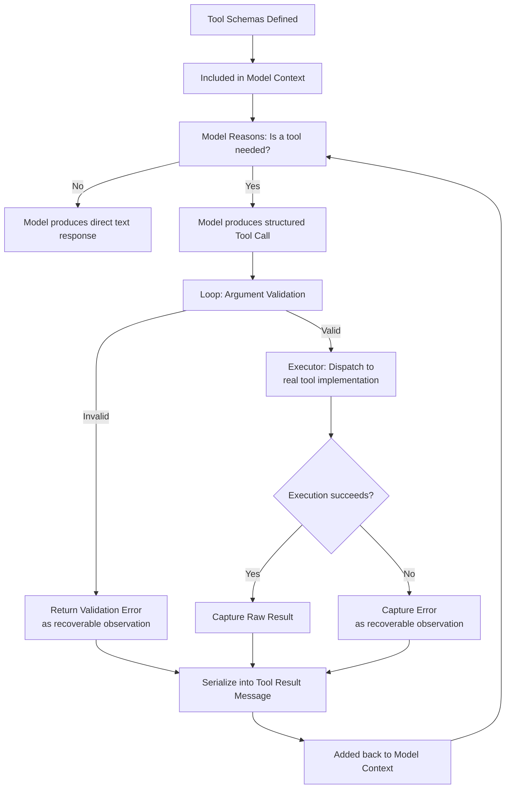

# 14 — Tool and Function Calling

> 📘 File 14 of 25 — Loop Engineering Knowledge Library
> Phase: The Loop Itself
> Prerequisite: `06_How_Loop_Engineering_Works.md`, `09_Core_Components.md`

---

## 1. Introduction

### Topic Overview

Every prior file has referenced tools in passing — the calculator in file 01, the search function in file 04, the Executor in file 09. This file is the full deep dive: how tools are actually defined, how a model decides to use one, how arguments get validated, and how results make their way back into the loop. This is the loop's "hands" — the entire reason an agent can do more than talk.

### Why This Topic Matters

Tool calling is where a loop stops being a text generator and starts being an agent that affects the real world. It's also one of the highest-risk components — a poorly validated tool call can execute unintended code, leak data, or take a destructive action. Getting the mechanics right here matters more than almost anywhere else in loop design.

---

## 2. Definition

### What Is It? (Simple Explanation)

Imagine handing someone a phone with a few labeled buttons — "Order Pizza," "Call Mom," "Check Weather" — instead of asking them to describe in prose what they want and hoping you interpret it correctly. Tool calling gives a model the same thing: clearly labeled, structured "buttons" it can press with specific, validated inputs — dramatically more reliable than the loop trying to parse free-text intentions.

### Technical Definition

> **Tool calling** (also called **function calling**) is the mechanism by which an LLM, given a set of **tool schemas** (structured definitions of available capabilities, including name, description, and parameter types), produces a **structured request** to invoke one of those tools with specific arguments — which the loop then **validates**, **dispatches** to the corresponding real implementation, executes, and **serializes** the result back into the model's context as a **tool result**.

---

## 3. Core Concepts

### Fundamental Ideas

- **A tool schema is a contract** — it tells the model exactly what's available and what inputs are expected, reducing ambiguity compared to free-text action descriptions
- **The model never directly executes anything** — it only ever requests a tool call; the loop's Executor is what actually runs it
- **Validation happens between the model's request and real execution** — this is a critical safety boundary, not an optional nicety
- **Tool descriptions are part of the prompt** — a badly written description leads to a model calling the wrong tool, or the right tool with wrong arguments, just as surely as a badly written prompt leads to a bad response

### Key Terminology

- **Tool schema** — the structured definition of a tool's name, description, and parameters
- **Tool call / Function call** — the model's structured request to invoke a specific tool with specific arguments
- **Tool result** — the formatted output returned to the model after execution
- **Argument validation** — checking that a tool call's arguments match the expected schema before execution
- **Tool registry** — a collection of available tools the Executor can dispatch to
- **Sandboxing** — executing a tool call in an isolated environment to contain potential damage

---

## 4. How It Works

### Step-by-Step Explanation

1. **Tool schemas are defined** — each available tool gets a name, description, and parameter schema
2. **Schemas are included in the model's context** — the model is told what tools exist and how to use them
3. **The model reasons about whether a tool is needed**, and if so, which one
4. **The model produces a structured tool call** — a request naming the tool and providing arguments
5. **The loop validates the tool call** — does the tool exist? Do the arguments match the expected types and constraints?
6. **[If valid]** the loop dispatches to the real tool implementation and captures its raw result
7. **[If invalid]** the loop returns a validation error *as an observation*, letting the model retry with corrected arguments
8. **The result (or error) is serialized** into a tool result message and added back to context
9. **The model continues reasoning**, now informed by the tool's actual output

### Internal Workflow

```python
import json
from dataclasses import dataclass
from typing import Callable, Any

# ── STEP 1: TOOL SCHEMA DEFINITION ────────────────────────────
@dataclass
class ToolSchema:
    name: str
    description: str
    parameters: dict  # JSON-schema-style parameter definitions
    required: list

    def to_api_format(self):
        """The format most LLM provider APIs expect for tool definitions."""
        return {
            "name": self.name,
            "description": self.description,
            "input_schema": {
                "type": "object",
                "properties": self.parameters,
                "required": self.required,
            }
        }


weather_schema = ToolSchema(
    name="get_weather",
    description="Get the current weather for a specific city",
    parameters={
        "city": {"type": "string", "description": "The city name"},
        "units": {"type": "string", "enum": ["celsius", "fahrenheit"], "description": "Temperature units"},
    },
    required=["city"]
)


# ── STEP 2-3: TOOLS INCLUDED IN CONTEXT, MODEL REASONS ────────
def build_tool_context(schemas: list[ToolSchema]):
    return [s.to_api_format() for s in schemas]


# ── STEP 4: MODEL PRODUCES A TOOL CALL (simulated) ────────────
def simulate_model_tool_call():
    """In production, this comes from the real LLM API response."""
    return {
        "tool_name": "get_weather",
        "arguments": {"city": "Kolkata", "units": "celsius"},
        "tool_use_id": "call_abc123"
    }


# ── STEP 5: ARGUMENT VALIDATION ────────────────────────────────
class ValidationError(Exception):
    pass

def validate_tool_call(tool_call: dict, schema: ToolSchema):
    args = tool_call["arguments"]

    # Check all required arguments are present
    for req_param in schema.required:
        if req_param not in args:
            raise ValidationError(f"Missing required argument: {req_param}")

    # Check argument types match schema (simplified)
    for param_name, param_value in args.items():
        if param_name not in schema.parameters:
            raise ValidationError(f"Unexpected argument: {param_name}")

        expected_type = schema.parameters[param_name].get("type")
        if expected_type == "string" and not isinstance(param_value, str):
            raise ValidationError(f"Argument '{param_name}' must be a string")

        allowed_values = schema.parameters[param_name].get("enum")
        if allowed_values and param_value not in allowed_values:
            raise ValidationError(f"Argument '{param_name}' must be one of {allowed_values}")

    return True  # validation passed


# ── STEP 6: DISPATCH TO REAL IMPLEMENTATION ────────────────────
class ToolRegistry:
    def __init__(self):
        self.schemas: dict[str, ToolSchema] = {}
        self.implementations: dict[str, Callable] = {}

    def register(self, schema: ToolSchema, implementation: Callable):
        self.schemas[schema.name] = schema
        self.implementations[schema.name] = implementation

    def dispatch(self, tool_call: dict) -> dict:
        tool_name = tool_call["tool_name"]

        if tool_name not in self.schemas:
            return {"error": f"Unknown tool: {tool_name}", "recoverable": True}

        schema = self.schemas[tool_name]

        # STEP 5 happens HERE, as a gate before real execution
        try:
            validate_tool_call(tool_call, schema)
        except ValidationError as e:
            return {"error": str(e), "recoverable": True}  # model can retry with fixed args

        # STEP 6: only now does REAL execution happen
        try:
            fn = self.implementations[tool_name]
            result = fn(**tool_call["arguments"])
            return {"success": True, "result": result}
        except Exception as e:
            return {"error": f"Execution failed: {e}", "recoverable": True}


# ── STEP 8: RESULT SERIALIZATION ───────────────────────────────
def serialize_tool_result(dispatch_result: dict, tool_use_id: str) -> dict:
    """Formats the raw dispatch result into a proper tool_result message."""
    if "error" in dispatch_result:
        content = f"Error: {dispatch_result['error']}"
    else:
        content = json.dumps(dispatch_result["result"]) if not isinstance(
            dispatch_result["result"], str
        ) else dispatch_result["result"]

    return {
        "type": "tool_result",
        "tool_use_id": tool_use_id,
        "content": content
    }


# ── FULL PIPELINE, ASSEMBLED ────────────────────────────────────
def mock_get_weather(city, units="celsius"):
    return f"{city}: 28°{units[0].upper()}, partly cloudy"

registry = ToolRegistry()
registry.register(weather_schema, mock_get_weather)

tool_call = simulate_model_tool_call()
dispatch_result = registry.dispatch(tool_call)
tool_result_message = serialize_tool_result(dispatch_result, tool_call["tool_use_id"])
print(tool_result_message)
```

---

## 5. Architecture / Workflow

### Mermaid Flowchart



---

## 6. Components / Types

### Main Components

| Component | Responsibility |
|---|---|
| **Tool Schema** | Defines a tool's name, description, and expected parameters |
| **Tool Registry** | Holds all available tool schemas and their real implementations |
| **Validator** | Checks a tool call's arguments against its schema before execution |
| **Dispatcher** | Routes a validated tool call to its real implementation |
| **Result Serializer** | Formats raw execution output into a model-readable tool result |

### Types of Tools by Risk Level

| Risk Level | Examples | Recommended Safeguards |
|---|---|---|
| **Read-only, low risk** | Search, weather lookup, calculator | Standard validation; minimal additional safeguards needed |
| **Write, reversible** | Draft an email (not sent), create a local file | Validation + optional review before commit |
| **Write, irreversible** | Send an email, delete a file, make a payment | Validation + human-in-the-loop approval (see file 07's suspension pattern) |
| **Code execution** | Running arbitrary generated code | Sandboxing, resource limits, strict output capture |

### Types of Tool Definitions

- **Native/structured tool-call APIs** (Anthropic, OpenAI) — the model provider's API natively supports structured tool schemas and returns machine-parseable tool call requests
- **Free-text convention-based** — older approach (common in early ReAct implementations) where tools are described in the prompt and the model's free-text output is parsed via patterns/regex (see file 06's discussion of parsing fragility)
- **MCP (Model Context Protocol) tools** — a standardized protocol for exposing tools to models across different applications, enabling reusable tool integrations

---

## 7. Examples

### Beginner Example

The simplest possible tool: a calculator, defined, validated, and dispatched end-to-end:

```python
calculator_schema = ToolSchema(
    name="calculator",
    description="Evaluates a basic arithmetic expression",
    parameters={"expression": {"type": "string", "description": "e.g. '2 + 2'"}},
    required=["expression"]
)

def safe_calculator(expression):
    allowed_chars = set("0123456789+-*/(). ")
    if not all(c in allowed_chars for c in expression):
        raise ValueError("Expression contains disallowed characters")
    return eval(expression, {"__builtins__": {}})

registry = ToolRegistry()
registry.register(calculator_schema, safe_calculator)

# A well-formed call
good_call = {"tool_name": "calculator", "arguments": {"expression": "12 * 4"}, "tool_use_id": "1"}
print(registry.dispatch(good_call))  # {'success': True, 'result': 48}

# A call missing a required argument
bad_call = {"tool_name": "calculator", "arguments": {}, "tool_use_id": "2"}
print(registry.dispatch(bad_call))  # {'error': 'Missing required argument: expression', ...}
```

### Intermediate Example

A multi-tool registry with distinct risk levels, showing how human-in-the-loop approval gets layered onto the dispatch pipeline for irreversible actions:

```python
class RiskAwareToolRegistry(ToolRegistry):
    """Extends the base registry with a risk-level gate —
    irreversible actions require explicit approval before dispatch."""

    def __init__(self):
        super().__init__()
        self.risk_levels = {}  # tool_name -> "low" | "high"

    def register(self, schema, implementation, risk="low"):
        super().register(schema, implementation)
        self.risk_levels[schema.name] = risk

    def dispatch(self, tool_call, approved=False):
        tool_name = tool_call["tool_name"]
        risk = self.risk_levels.get(tool_name, "low")

        if risk == "high" and not approved:
            return {
                "requires_approval": True,
                "tool_call": tool_call,
                "message": f"'{tool_name}' is a high-risk action and requires approval before execution"
            }

        return super().dispatch(tool_call)


send_email_schema = ToolSchema(
    name="send_email",
    description="Sends an email to a recipient",
    parameters={"to": {"type": "string"}, "body": {"type": "string"}},
    required=["to", "body"]
)

def mock_send_email(to, body):
    return f"Email sent to {to}"

registry = RiskAwareToolRegistry()
registry.register(send_email_schema, mock_send_email, risk="high")

call = {"tool_name": "send_email", "arguments": {"to": "team@example.com", "body": "Update"}, "tool_use_id": "3"}

# First attempt: blocked, pending approval
result = registry.dispatch(call, approved=False)
print(result)  # {'requires_approval': True, ...}

# After a human approves:
result = registry.dispatch(call, approved=True)
print(result)  # {'success': True, 'result': 'Email sent to team@example.com'}
```

### Advanced / Real-World Example

A sandboxed code-execution tool with strict resource limits and output capture — the pattern required for any tool that runs arbitrary generated code:

```python
import subprocess
import tempfile
import os

class SandboxedCodeExecutor:
    """A tool for executing generated code SAFELY — resource-limited,
    isolated, with captured output rather than direct system access."""

    def __init__(self, timeout_seconds=5, max_output_chars=2000):
        self.timeout_seconds = timeout_seconds
        self.max_output_chars = max_output_chars

    def execute(self, code: str) -> dict:
        with tempfile.NamedTemporaryFile(mode="w", suffix=".py", delete=False) as f:
            f.write(code)
            script_path = f.name

        try:
            result = subprocess.run(
                ["python3", script_path],
                capture_output=True,
                text=True,
                timeout=self.timeout_seconds,   # hard time limit — prevents runaway code
                # In production: also run in a container/VM with restricted
                # filesystem and network access, not just a subprocess
            )

            stdout = result.stdout[:self.max_output_chars]  # bounded output
            stderr = result.stderr[:self.max_output_chars]

            return {
                "success": result.returncode == 0,
                "stdout": stdout,
                "stderr": stderr,
                "truncated": len(result.stdout) > self.max_output_chars
            }

        except subprocess.TimeoutExpired:
            return {"success": False, "error": f"Execution exceeded {self.timeout_seconds}s timeout"}

        finally:
            os.unlink(script_path)  # always clean up, even on failure


code_execution_schema = ToolSchema(
    name="execute_python",
    description="Executes a short Python script and returns its output",
    parameters={"code": {"type": "string", "description": "Python source code to run"}},
    required=["code"]
)

sandbox = SandboxedCodeExecutor(timeout_seconds=3)
registry = ToolRegistry()
registry.register(code_execution_schema, sandbox.execute)

safe_call = {
    "tool_name": "execute_python",
    "arguments": {"code": "print(sum(range(10)))"},
    "tool_use_id": "4"
}
print(registry.dispatch(safe_call))

runaway_call = {
    "tool_name": "execute_python",
    "arguments": {"code": "while True: pass"},  # would run forever without the timeout
    "tool_use_id": "5"
}
print(registry.dispatch(runaway_call))  # cleanly times out instead of hanging the whole loop
```

---

## 8. Best Practices

### Do's

- ✅ Write tool descriptions as carefully as you'd write a prompt — the model relies entirely on the description to know when and how to use a tool correctly
- ✅ Always validate arguments *before* real execution, and return validation errors as recoverable observations the model can act on, not silent failures or crashes
- ✅ Gate high-risk, irreversible tools behind explicit approval (human-in-the-loop, per file 07's suspension pattern)
- ✅ Sandbox any tool that executes arbitrary code, with hard resource limits (time, output size, filesystem/network access)
- ✅ Keep tool implementations focused and single-purpose — a tool that does one thing well is easier to validate, test, and reason about than one with many modes

### Recommended Techniques

- Version your tool schemas — as tools evolve, old loop state referencing an outdated schema shouldn't silently break
- Log every tool call (successful or not) with its full arguments — this is essential for debugging and for auditing high-risk tool usage

---

## 9. Common Mistakes

### Frequent Errors

| Mistake | Consequence |
|---|---|
| Vague or missing tool descriptions | Model calls the wrong tool, or the right tool with malformed arguments |
| No argument validation before execution | Malformed or malicious arguments reach real implementations directly |
| Treating all tools as equally safe | Irreversible actions (sending emails, deleting data) execute without appropriate review |
| No sandboxing for code-execution tools | A runaway or malicious script can hang or damage the host environment |
| Crashing the whole loop on a tool error instead of returning a recoverable observation | Loses all progress on a single transient tool failure |

### How to Avoid Them

- Treat tool descriptions as a first-class engineering artifact, not an afterthought — review and iterate on them the same way you would a system prompt
- Build the risk-tiering pattern (Section 7's `RiskAwareToolRegistry`) into any production tool registry from the start, rather than retrofitting it after an incident

---

## 10. Advantages & Limitations

### Benefits of Well-Engineered Tool Calling

- Turns an LLM from a pure text generator into a system capable of real-world action
- Structured tool-call APIs eliminate the parsing fragility discussed in file 06
- Validation and risk-tiering provide concrete safety boundaries between model reasoning and real-world consequences
- Sandboxing makes even arbitrary code execution tools usable without unbounded risk

### Limitations

- Tool calling is only as reliable as the schema and description quality — poorly specified tools degrade the whole loop's reliability
- Validation can catch malformed arguments but can't catch every case of a *technically valid but semantically wrong* tool call (e.g., a correctly formatted email sent to the wrong recipient)
- Sandboxing adds real infrastructure complexity and isn't free — a simple subprocess timeout (as shown above) is a starting point, not a complete security solution for genuinely adversarial inputs

---

## 11. Comparison

### Compare with Related Concepts

| Concept | Relationship to Tool Calling |
|---|---|
| **APIs / Function Signatures (traditional software)** | Tool schemas are directly analogous — a contract describing available operations and their inputs |
| **The Executor Component (file 09)** | Tool calling IS the primary mechanism the Executor implements |
| **MCP (Model Context Protocol)** | A standardized way of exposing tool schemas across applications — an industry-level solution to the schema-definition problem this file covers |

### Summary Table

| Question | Native Structured Tool-Call APIs | Free-Text Convention-Based |
|---|---|---|
| Parsing reliability | High | Low — fragile to phrasing variation |
| Validation ease | Straightforward — schema-driven | Difficult — requires custom parsing logic |
| Provider support | Anthropic, OpenAI, most modern LLM APIs | Legacy pattern, still seen in older ReAct implementations |
| Recommended for new projects | **Yes** | No, unless the provider genuinely lacks structured tool-call support |

---

## 12. Summary

### Key Takeaways

- **Tool calling** is the mechanism turning a model's reasoning into real-world action — the model requests, the loop validates and dispatches, never the reverse
- **Tool schemas are contracts** — well-written descriptions and parameter definitions directly determine how reliably a model uses a tool correctly
- **Validation is a mandatory safety gate** between the model's request and real execution — never skip it, and always return validation failures as recoverable observations
- **Risk-tiering** (gating irreversible actions behind approval) and **sandboxing** (isolating code execution) are essential safeguards, not optional extras, for any production tool registry

### Cheat Sheet

```
TOOL CALLING PIPELINE:

1. Define Tool Schema      → name, description, parameters, required fields
2. Include in Context       → model sees what's available
3. Model Produces Tool Call → structured request with arguments
4. VALIDATE                → check against schema BEFORE execution (mandatory gate)
5. Dispatch                → route to real implementation
6. Execute                 → run it (sandboxed, if code execution)
7. Serialize Result        → format for reinjection into context

RISK TIERS: read-only < reversible write < irreversible write < code execution
  → higher tiers need MORE safeguards (approval gates, sandboxing)
```

---

## 13. Glossary

| Term | Definition |
|---|---|
| **Tool Schema** | The structured definition of a tool's name, description, and parameters |
| **Tool Call / Function Call** | A model's structured request to invoke a specific tool with specific arguments |
| **Tool Result** | The formatted output returned to the model after tool execution |
| **Argument Validation** | Checking a tool call's arguments against its schema before execution |
| **Tool Registry** | A collection of available tools and their real implementations |
| **Sandboxing** | Executing a tool call in an isolated environment to contain potential damage |
| **MCP (Model Context Protocol)** | A standardized protocol for exposing tools to models across applications |

---

## 14. References & Further Reading

### Official Documentation

- Anthropic — [Tool Use Documentation](https://docs.claude.com) — the canonical reference for structured tool-call APIs used throughout this file's examples
- Model Context Protocol — [Official Specification](https://modelcontextprotocol.io) — the standardized approach to tool/context exposure referenced in Section 6

### Research Papers

- Schick et al., 2023 — *"Toolformer: Language Models Can Teach Themselves to Use Tools"* — foundational research on LLM tool-use capability

### Where to Go Next in This Library

- Previous file: `13_Planning_and_Reasoning.md`
- Next file: `15_AI_Agents_and_Multi_Agent_Loops.md` — begins the transition from single-loop to multi-agent coordination, where multiple Controllers and Executors work together
- Related: `19_Best_Practices_and_Common_Mistakes.md` — production-hardening guidance that builds on this file's safety patterns

---

*This is File 14 of 25 in the Loop Engineering Knowledge Library. See `README.md` for the full index and suggested reading paths.*
