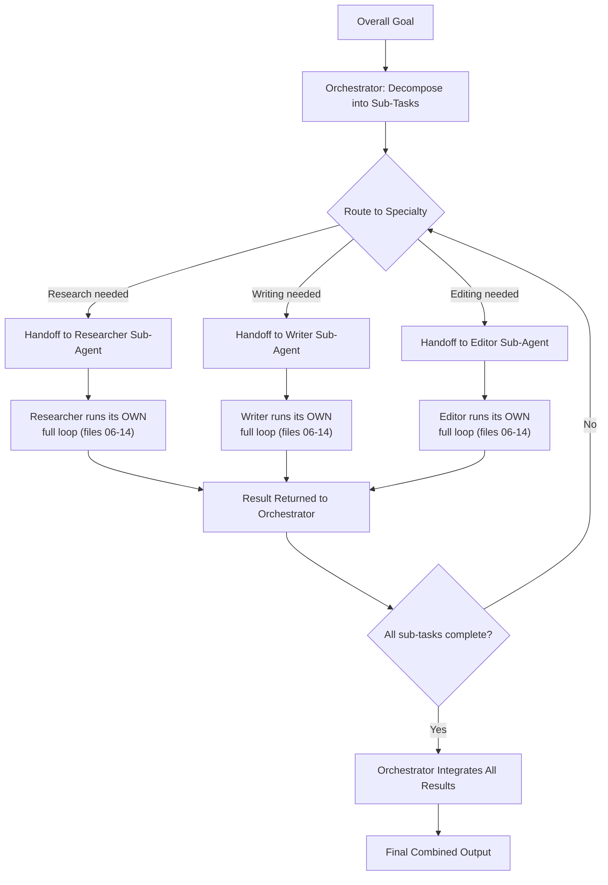

# 15 — AI Agents and Multi-Agent Loops

> 📘 File 15 of 25 — Loop Engineering Knowledge Library
> Phase: Scaling Up
> Prerequisite: Files 01–14 (this file assumes full understanding of a single loop)

---

## 1. Introduction

### Topic Overview

Every file so far has focused on **one loop**. This file makes the jump to **multiple loops coordinating together** — what happens when a task is too large, too specialized, or too parallel for a single agent loop to handle well, and you instead build a system of several loops working as a team.

### Why This Topic Matters

Multi-agent systems aren't just "more of the same, but bigger." They introduce genuinely new problems — communication between agents, conflicting sub-goals, coordination overhead — that don't exist in single-loop design. Understanding when multi-agent coordination is actually worth its added complexity (and when it isn't) is one of the most consequential architectural decisions in loop engineering.

---

## 2. Definition

### What Is It? (Simple Explanation)

A single agent loop is like one person doing a whole project alone — researching, writing, and editing. A multi-agent system is like a small team: one person researches, another writes, a third edits — each specialized, coordinating through handoffs and communication rather than one person context-switching between every role.

### Technical Definition

> A **Multi-Agent System** is an architecture in which multiple independent agent loops — each with their own Controller, Executor, and (often) their own scoped state — coordinate to achieve a shared or related goal, communicating via explicit **message passing** or **handoffs**, typically coordinated by an **orchestrator** (or **supervisor**) agent responsible for task delegation, or via peer-to-peer coordination in more decentralized designs.

---

## 3. Core Concepts

### Fundamental Ideas

- **Multi-agent systems trade single-loop simplicity for specialization and parallelism** — this is a real cost/benefit tradeoff, not a free upgrade
- **Sub-agents typically have narrower, more focused responsibilities** than a single generalist loop would — this often *improves* per-task reliability even as it adds system-level complexity
- **Coordination requires explicit design** — agents don't automatically know what other agents are doing; someone has to design the communication/handoff mechanism
- **An orchestrator pattern is common but not mandatory** — some multi-agent systems are decentralized, with agents communicating peer-to-peer

### Key Terminology

- **Multi-Agent System** — multiple agent loops coordinating toward a shared or related goal
- **Orchestrator / Supervisor** — an agent (or component) coordinating other agents' work
- **Sub-agent / Worker agent** — an agent invoked and managed by another (parent) agent
- **Handoff** — transferring control and/or context from one agent to another
- **Agent-to-Agent Communication** — message passing between separate agent loops
- **Decentralized coordination** — agents coordinate directly with each other, without a central orchestrator

---

## 4. How It Works

### Step-by-Step Explanation

**Orchestrator-based coordination (most common pattern):**
1. The orchestrator receives the overall goal
2. It decomposes the goal into sub-tasks suited to different specialized agents (this uses the decomposition techniques from file 13)
3. For each sub-task, it selects (or spawns) the appropriate sub-agent
4. It performs a **handoff** — passing the sub-task and relevant context to that sub-agent
5. The sub-agent runs its own complete loop (everything from files 06–14 applies *within* this sub-agent)
6. The sub-agent returns its result to the orchestrator
7. The orchestrator integrates results from all sub-agents, potentially triggering further sub-tasks or handoffs
8. Once all necessary sub-tasks are complete, the orchestrator produces the final combined result

**Decentralized/peer-to-peer coordination:**
1. Multiple agents start with a shared goal or overlapping context
2. Agents communicate directly with each other as needed (not through a central coordinator)
3. Coordination emerges from agent-to-agent messages rather than top-down delegation
4. Termination is typically reached via consensus or when all agents independently converge

### Internal Workflow

```python
from dataclasses import dataclass, field
from typing import Callable

# ── A SUB-AGENT: this IS a full single loop (files 06-14 apply here) ──
@dataclass
class SubAgent:
    name: str
    specialty: str
    run_fn: Callable  # in production: this wraps a complete single-loop implementation

    def execute(self, task, context):
        return self.run_fn(task, context)


# ── THE ORCHESTRATOR ──────────────────────────────────────────
class Orchestrator:
    def __init__(self):
        self.sub_agents: dict[str, SubAgent] = {}
        self.communication_log = []  # every handoff gets recorded

    def register_agent(self, agent: SubAgent):
        self.sub_agents[agent.specialty] = agent

    def decompose_goal(self, goal):
        """Uses file 13's decomposition techniques, but assigns
        each sub-goal to a SPECIALTY rather than treating them uniformly."""
        # Simplified: in production, an LLM call maps sub-goals to specialties
        if "research report" in goal.lower():
            return [
                {"sub_goal": "Find credible sources", "specialty": "researcher"},
                {"sub_goal": "Draft the report", "specialty": "writer"},
                {"sub_goal": "Check facts and grammar", "specialty": "editor"},
            ]
        return [{"sub_goal": goal, "specialty": "generalist"}]

    def handoff(self, sub_task, specialty, accumulated_context):
        """A HANDOFF: passing control + relevant context to a sub-agent."""
        agent = self.sub_agents.get(specialty)
        if not agent:
            return {"error": f"No agent registered for specialty '{specialty}'"}

        self.communication_log.append({
            "event": "handoff",
            "to": agent.name,
            "sub_task": sub_task["sub_goal"]
        })

        result = agent.execute(sub_task["sub_goal"], accumulated_context)

        self.communication_log.append({
            "event": "result_returned",
            "from": agent.name,
            "result_summary": str(result)[:100]
        })

        return result

    def run(self, goal):
        plan = self.decompose_goal(goal)
        accumulated_context = {"goal": goal, "completed_sub_tasks": []}

        for sub_task in plan:
            result = self.handoff(sub_task, sub_task["specialty"], accumulated_context)
            accumulated_context["completed_sub_tasks"].append({
                "sub_goal": sub_task["sub_goal"],
                "result": result
            })

        return self._integrate_results(accumulated_context)

    def _integrate_results(self, context):
        """The orchestrator's own final synthesis step —
        it has its OWN Controller-like decision here."""
        return {
            "final_result": f"Integrated {len(context['completed_sub_tasks'])} sub-task results",
            "detail": context["completed_sub_tasks"]
        }


# ── ASSEMBLING A MULTI-AGENT SYSTEM ────────────────────────────
def researcher_loop(task, context):
    return f"Researcher found sources for: {task}"

def writer_loop(task, context):
    prior = context["completed_sub_tasks"][-1]["result"] if context["completed_sub_tasks"] else ""
    return f"Writer drafted content for: {task}, informed by: {prior}"

def editor_loop(task, context):
    return f"Editor reviewed and finalized: {task}"


orchestrator = Orchestrator()
orchestrator.register_agent(SubAgent("Riya", "researcher", researcher_loop))
orchestrator.register_agent(SubAgent("Devansh", "writer", writer_loop))
orchestrator.register_agent(SubAgent("Priya", "editor", editor_loop))

final = orchestrator.run("Write a research report on renewable energy")
print(final["final_result"])
for entry in orchestrator.communication_log:
    print(entry)
```

---

## 5. Architecture / Workflow

### Mermaid Flowchart



---

## 6. Components / Types

### Main Components

| Component | Responsibility |
|---|---|
| **Orchestrator / Supervisor** | Decomposes goals, delegates to sub-agents, integrates final results |
| **Sub-agent / Worker agent** | Runs its own complete, specialized loop on a delegated sub-task |
| **Handoff Mechanism** | Transfers task and context from orchestrator to sub-agent (or agent to agent) |
| **Communication Channel** | The medium through which agents exchange messages (direct calls, message queue, shared state) |

### Types of Multi-Agent Coordination Patterns

| Pattern | Structure | Best For |
|---|---|---|
| **Orchestrator-Worker (Supervisor)** | One central agent delegates to specialized sub-agents | Clear task decomposition, well-defined specialties |
| **Pipeline** | Agents process work in a fixed sequence, each handing off to the next | Sequential workflows (research → write → edit) |
| **Peer-to-Peer / Decentralized** | Agents communicate directly, no central coordinator | Genuinely collaborative or adversarial tasks (debate, negotiation) |
| **Hierarchical** | Orchestrators of orchestrators — multi-level delegation | Very large, deeply decomposable tasks |

> 🔎 A deeper catalog of specific multi-agent design patterns (pipeline, debate, voting/consensus) is covered in `16_Loop_Design_Patterns.md`.

### Categories of Sub-Agent Specialization

- **By domain expertise** — researcher, writer, coder, reviewer
- **By tool access** — an agent with database access vs. one with only web search
- **By reasoning style** — a fast, cheap agent for simple sub-tasks vs. a slower, more capable one for hard sub-tasks

---

## 7. Examples

### Beginner Example

The simplest possible two-agent system — a generator and a checker, demonstrating handoff without a complex orchestrator:

```python
def generator_agent(task):
    return f"Generated draft answer for: {task}"

def checker_agent(draft):
    # A simple sub-agent whose entire job is verification
    is_good = "draft" in draft.lower()
    return {"approved": is_good, "draft": draft}

def two_agent_system(task):
    draft = generator_agent(task)           # Agent 1's full loop runs
    check_result = checker_agent(draft)       # HANDOFF to Agent 2
    if check_result["approved"]:
        return check_result["draft"]
    return "Draft was not approved, would need revision"

print(two_agent_system("Explain photosynthesis"))
```

### Intermediate Example

A pipeline pattern with three agents passing work forward in strict sequence, each unaware of the others except through the handoff:

```python
class PipelineStage:
    def __init__(self, name, process_fn):
        self.name = name
        self.process_fn = process_fn

    def run(self, input_data):
        print(f"[{self.name}] processing...")
        return self.process_fn(input_data)


def run_pipeline(stages: list[PipelineStage], initial_input):
    """Each stage receives EXACTLY what the previous stage handed off —
    no shared global state, no direct agent-to-agent knowledge."""
    current_data = initial_input
    for stage in stages:
        current_data = stage.run(current_data)  # explicit handoff
    return current_data


pipeline = [
    PipelineStage("Outline Generator", lambda topic: f"Outline for: {topic}"),
    PipelineStage("Content Writer", lambda outline: f"Full content based on: {outline}"),
    PipelineStage("Proofreader", lambda content: f"Proofread version of: {content}"),
]

result = run_pipeline(pipeline, "The history of renewable energy")
print(result)
```

### Advanced / Real-World Example

A debate pattern — two agents arguing opposing positions, with a third judging — demonstrating decentralized, non-orchestrator-mediated agent-to-agent interaction:

```python
class DebateAgent:
    def __init__(self, name, position):
        self.name = name
        self.position = position

    def argue(self, topic, opponent_argument=None):
        if opponent_argument:
            return f"{self.name} ({self.position}): Countering '{opponent_argument[:30]}...' with a defense of {self.position}"
        return f"{self.name} ({self.position}): Opening argument for {self.position}"


class JudgeAgent:
    def evaluate(self, topic, transcript):
        # In production: an LLM call scoring argument quality
        return {
            "winner": "Agent A" if len(transcript) % 2 == 0 else "Agent B",
            "reasoning": f"Evaluated {len(transcript)} exchanges on: {topic}"
        }


def debate_loop(topic, agent_a, agent_b, judge, rounds=2):
    """DECENTRALIZED coordination: agents interact directly with
    each other's output, no central orchestrator delegating sub-tasks."""
    transcript = []

    opening_a = agent_a.argue(topic)
    transcript.append(opening_a)
    opening_b = agent_b.argue(topic, opponent_argument=opening_a)
    transcript.append(opening_b)

    for round_num in range(rounds - 1):
        rebuttal_a = agent_a.argue(topic, opponent_argument=transcript[-1])
        transcript.append(rebuttal_a)
        rebuttal_b = agent_b.argue(topic, opponent_argument=transcript[-1])
        transcript.append(rebuttal_b)

    verdict = judge.evaluate(topic, transcript)
    return {"transcript": transcript, "verdict": verdict}


agent_a = DebateAgent("Agent A", "for renewable subsidies")
agent_b = DebateAgent("Agent B", "against renewable subsidies")
judge = JudgeAgent()

result = debate_loop("Renewable energy subsidies", agent_a, agent_b, judge, rounds=2)
for line in result["transcript"]:
    print(line)
print("Verdict:", result["verdict"])
```

---

## 8. Best Practices

### Do's

- ✅ Only reach for multi-agent architecture when a task genuinely benefits from specialization or parallelism — don't default to it out of habit
- ✅ Design explicit, well-defined handoff formats — a sub-agent should know exactly what context it's receiving and what format its result should take
- ✅ Give each sub-agent a narrow, well-scoped responsibility — the same "single responsibility" principle that makes single loops more debuggable (file 09) applies at the multi-agent level too
- ✅ Log all inter-agent communication (as in the orchestrator's `communication_log`) — multi-agent debugging is exponentially harder without a clear record of who said what to whom

### Recommended Techniques

- Start with an orchestrator-worker pattern for most tasks — it's the most predictable and debuggable multi-agent structure, and only move to decentralized/peer-to-peer patterns when the task genuinely requires agent-to-agent interaction (debate, negotiation)
- Treat each sub-agent's internal loop design (its Controller, Executor, termination conditions) with the same rigor as a standalone single-loop system — multi-agent systems don't reduce the need for good single-loop engineering, they multiply it

---

## 9. Common Mistakes

### Frequent Errors

| Mistake | Consequence |
|---|---|
| Using multi-agent architecture for a task a single loop could handle well | Adds coordination overhead and cost without proportional benefit |
| Vague or undefined handoff formats | Sub-agents receive incomplete or malformed context, produce poor results |
| No logging of inter-agent communication | Debugging a multi-agent failure becomes nearly impossible — you can't tell which agent introduced the error |
| Sub-agents with overlapping, poorly-scoped responsibilities | Duplicated work, or gaps where no agent handles a necessary sub-task |
| Assuming multi-agent systems are inherently more capable | Capability comes from good decomposition and specialization, not from the mere presence of multiple agents |

### How to Avoid Them

- Before building a multi-agent system, explicitly justify why a single, well-engineered loop wouldn't suffice — genuine reasons include needing parallel specialization, distinct tool access per role, or adversarial/collaborative dynamics (debate) that a single loop can't represent
- Design handoff schemas (like tool schemas in file 14) as a first-class artifact — define exactly what data crosses each agent boundary before implementing the agents themselves

---

## 10. Advantages & Limitations

### Benefits of Multi-Agent Systems

- Enables genuine specialization — narrower-scoped agents are often more reliable at their specific task than one generalist trying to do everything
- Supports parallelism where sub-tasks are genuinely independent
- Makes some task structures (debate, peer review, negotiation) representable in ways a single loop fundamentally can't capture
- Improves debuggability *when properly logged* — you can isolate which specialized agent is responsible for a given failure

### Limitations

- Adds real coordination overhead — communication, handoffs, and integration all cost extra tokens, latency, and engineering effort
- Introduces new failure modes that don't exist in single-loop systems (miscommunication between agents, integration failures, conflicting sub-goals)
- Debugging is genuinely harder than single-loop debugging without deliberate, thorough communication logging
- Not a substitute for good single-loop engineering — a poorly engineered sub-agent is still a poorly engineered loop, just now one of several

---

## 11. Comparison

### Compare with Related Concepts

| Concept | Scope | Relationship to Multi-Agent Loops |
|---|---|---|
| **A Single Loop (files 01-14)** | One Controller, one Executor, one state | Each sub-agent in a multi-agent system IS effectively a single loop |
| **Microservices Architecture (software engineering)** | Decomposing a system into independent, specialized services | Directly analogous — orchestrator ≈ API gateway, sub-agents ≈ services |
| **Human Organizational Structures** | Teams, managers, specialists | Orchestrator-worker ≈ manager-report structure; peer-to-peer ≈ collaborative team |

### Summary Table

| Question | Single Loop | Multi-Agent System |
|---|---|---|
| Handles highly specialized sub-tasks well? | Only if generalist reasoning suffices | Yes — dedicated specialist agents |
| Coordination overhead | None | Real — handoffs, integration, communication |
| Debugging complexity | Lower | Higher, unless thoroughly logged |
| Best for | Focused, well-defined tasks | Complex tasks needing specialization or parallelism |

---

## 12. Summary

### Key Takeaways

- A **Multi-Agent System** is multiple independent agent loops coordinating toward a shared or related goal — each sub-agent is, internally, a full single loop (everything from files 06–14 applies within it)
- **Orchestrator-worker** is the most common and most debuggable coordination pattern; **decentralized/peer-to-peer** patterns (like debate) suit tasks with genuine agent-to-agent dynamics
- **Handoffs** — explicit transfers of task and context between agents — are the critical design surface; vague or undefined handoffs are the most common source of multi-agent failures
- Multi-agent architecture is a **deliberate tradeoff**, not a free capability upgrade — it should be chosen when specialization or parallelism genuinely justifies the added coordination overhead

### Cheat Sheet

```
MULTI-AGENT COORDINATION PATTERNS:

ORCHESTRATOR-WORKER  → central agent delegates to specialists (most common, most debuggable)
PIPELINE             → fixed sequence, each agent hands off to the next
PEER-TO-PEER         → decentralized, agents interact directly (debate, negotiation)
HIERARCHICAL         → orchestrators of orchestrators, for very large tasks

RULE: only go multi-agent when specialization/parallelism justifies the
      coordination overhead. Each sub-agent still needs full single-loop
      engineering discipline (files 06-14) — multi-agent multiplies that
      need, it doesn't replace it.
```

---

## 13. Glossary

| Term | Definition |
|---|---|
| **Multi-Agent System** | Multiple independent agent loops coordinating toward a shared or related goal |
| **Orchestrator / Supervisor** | An agent coordinating other agents' work via delegation |
| **Sub-agent / Worker Agent** | An agent invoked and managed by another (parent) agent |
| **Handoff** | Transferring task and/or context from one agent to another |
| **Agent-to-Agent Communication** | Message passing between separate agent loops |
| **Decentralized Coordination** | Agents coordinating directly with each other, without a central orchestrator |
| **Pipeline Pattern** | Agents processing work in a fixed sequence |

---

## 14. References & Further Reading

### Official Documentation

- CrewAI — [Multi-Agent Documentation](https://docs.crewai.com) — a production framework built specifically around this file's orchestrator-worker pattern
- LangGraph — [Multi-Agent Systems Documentation](https://docs.langchain.com/oss/python/langgraph/overview)
- Google — [Agent Development Kit (ADK) Documentation](https://google.github.io/adk-docs/) — multi-agent orchestration patterns

### Research Papers

- Wu et al., 2023 — *"AutoGen: Enabling Next-Gen LLM Applications via Multi-Agent Conversation"*

### Where to Go Next in This Library

- Previous file: `14_Tool_and_Function_Calling.md`
- Next file: `16_Loop_Design_Patterns.md` — a deeper catalog of specific multi-agent design patterns (pipeline, debate, voting/consensus) building directly on this file
- Related: `22_Frameworks_and_LLM_Compatibility.md` — a full comparison of CrewAI, AutoGen, Google ADK, and LangGraph's multi-agent support

---

*This is File 15 of 25 in the Loop Engineering Knowledge Library. See `README.md` for the full index and suggested reading paths.*

---

## 🎉 Batch 3 Complete: The Loop Itself (Files 11–15)

- **11** — state, context, and memory as three genuinely distinct layers, and how to prevent context rot
- **12** — the difference between blind retry and genuine feedback-driven iteration
- **13** — chain-of-thought reasoning, upfront planning, and dynamic replanning
- **14** — the full tool/function calling pipeline: schema, validation, dispatch, sandboxing
- **15** — the jump from single loops to coordinated multi-agent systems

**Continuing immediately into Batch 4 (Patterns → Comparison):** Files 16–20 cover reusable multi-agent design patterns, visualization/diagramming conventions, full worked practical examples, production best practices and common mistakes, and a rigorous comparison of Loop Engineering against Prompt, Context, and Agent Engineering.
