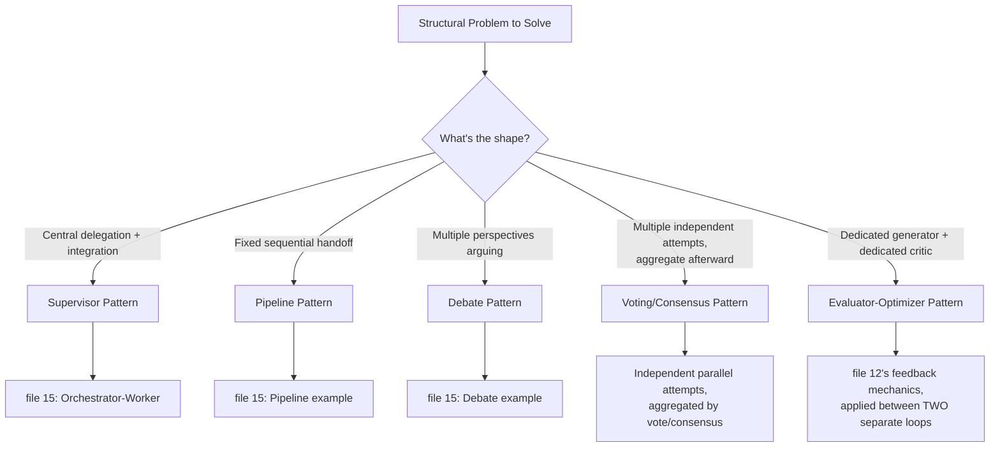

# 16 — Loop Design Patterns

> 📘 File 16 of 25 — Loop Engineering Knowledge Library
> Phase: Scaling Up
> Prerequisite: `10_Types_of_Loops.md`, `15_AI_Agents_and_Multi_Agent_Loops.md`

---

## 1. Introduction

### Topic Overview

File 10 catalogued *single-loop* patterns (ReAct, Plan-and-Execute, Reflexion, ReWOO). File 15 introduced the concept of multiple loops coordinating. This file sits at their intersection: **reusable, named design patterns** — mostly at the multi-agent level, though some apply within a single loop too — that solve recurring structural problems. Think of these the way a software engineer thinks of the Gang of Four design patterns: not new mechanics, but proven, nameable *arrangements* of the mechanics you already know.

### Why This Topic Matters

Recognizing "oh, this is just the Supervisor pattern" or "this needs a Voting pattern" lets you skip reinventing a solution from scratch and instead adapt a well-understood, battle-tested structure. It also gives you precise vocabulary for discussing architecture with other engineers.

---

## 2. Definition

### What Is It? (Simple Explanation)

If file 09's four components are ingredients and file 10/15's loop types are basic recipes, design patterns are the specific, named dishes experienced cooks reach for again and again — "make a stir-fry" instantly communicates a proven structure, without re-explaining technique from scratch every time.

### Technical Definition

> **Loop Design Patterns** are named, reusable architectural templates for arranging loop components and multi-agent coordination to solve recurring structural problems — including the **Supervisor pattern** (centralized delegation), the **Pipeline pattern** (fixed sequential handoff), the **Debate pattern** (adversarial multi-perspective reasoning), the **Voting/Consensus pattern** (aggregating multiple independent attempts), and the **Evaluator-Optimizer pattern** (a generator paired with a dedicated critic loop).

---

## 3. Core Concepts

### Fundamental Ideas

- **Patterns are named for communication efficiency** — the value isn't the mechanics (you already know those from files 06–15), it's having a shared vocabulary
- **Most patterns build directly on file 15's coordination concepts** — a pattern is really just "orchestrator-worker, but for this specific structural problem"
- **Some patterns work equally well within a single loop or across multiple agents** — Evaluator-Optimizer, for instance, can be one loop critiquing itself (Reflexion, file 10) or two separate agent loops
- **Choosing a pattern is a structural fit question**, not a matter of picking the most sophisticated-sounding option

### Key Terminology

- **Supervisor pattern** — a centralized agent delegates and integrates work from specialized sub-agents (file 15's orchestrator-worker, formally named)
- **Pipeline pattern** — a fixed sequence of agents, each handing off to the next
- **Debate pattern** — multiple agents argue different positions, often judged by a separate agent
- **Voting / Consensus pattern** — multiple independent attempts are generated and aggregated by agreement
- **Evaluator-Optimizer pattern** — a dedicated generator loop paired with a dedicated critic loop, iterating until the critic approves

---

## 4. How It Works

### Step-by-Step Explanation

**Supervisor Pattern** (formalizing file 15's orchestrator-worker):
1. Supervisor receives the goal, decomposes it, delegates to specialists, integrates results — exactly as detailed in file 15

**Pipeline Pattern**:
1. Define a fixed, ordered sequence of stages
2. Each stage receives exactly the previous stage's output as its input
3. No stage needs awareness of any other stage beyond its immediate predecessor

**Debate Pattern**:
1. Two or more agents are assigned distinct (often opposing) positions
2. Each produces an argument; each sees and responds to the others' arguments across multiple rounds
3. A separate Judge agent (or a scoring function) evaluates the full exchange and produces a verdict

**Voting / Consensus Pattern**:
1. The *same* task is given to multiple independent agents (or the same agent run multiple times with variation)
2. Each produces its own independent attempt
3. Results are aggregated — via majority vote, averaging, or a dedicated aggregator agent

**Evaluator-Optimizer Pattern**:
1. A Generator loop produces an attempt
2. A separate Evaluator loop scores/critiques that attempt (using file 12's feedback mechanics)
3. If not yet satisfactory, the Generator retries, informed by the Evaluator's specific feedback
4. Repeat until the Evaluator approves or a maximum retry count is reached

### Internal Workflow

```python
# ── PATTERN: SUPERVISOR (formal name for file 15's orchestrator-worker) ──
# See file 15, Section 4, for the full reference implementation.
# This pattern's defining trait: ONE central agent owns decomposition AND integration.


# ── PATTERN: PIPELINE ─────────────────────────────────────────
def pipeline_pattern(stages: list, initial_input):
    """Defining trait: strictly sequential, each stage only knows
    its immediate predecessor's output."""
    current = initial_input
    for stage_fn in stages:
        current = stage_fn(current)
    return current


# ── PATTERN: DEBATE ───────────────────────────────────────────
def debate_pattern(topic, positions: list, judge_fn, rounds=2):
    """Defining trait: agents interact with EACH OTHER'S output,
    not just a shared orchestrator. See file 15's advanced example
    for a full implementation."""
    transcript = []
    for position in positions:
        transcript.append(f"{position}: opening argument on {topic}")

    for _ in range(rounds - 1):
        for i, position in enumerate(positions):
            opponent_arg = transcript[-1]
            transcript.append(f"{position}: responding to '{opponent_arg[:20]}...'")

    verdict = judge_fn(topic, transcript)
    return {"transcript": transcript, "verdict": verdict}


# ── PATTERN: VOTING / CONSENSUS ───────────────────────────────
def voting_pattern(task, agent_fns: list, aggregator_fn):
    """Defining trait: MULTIPLE INDEPENDENT attempts at the SAME task,
    aggregated afterward. Agents don't see each other's work."""
    independent_results = [fn(task) for fn in agent_fns]
    return aggregator_fn(independent_results)


def majority_vote_aggregator(results):
    from collections import Counter
    counts = Counter(results)
    winner, count = counts.most_common(1)[0]
    return {"winner": winner, "votes": count, "total": len(results), "all_results": results}


# ── PATTERN: EVALUATOR-OPTIMIZER ──────────────────────────────
def evaluator_optimizer_pattern(task, generator_fn, evaluator_fn, max_rounds=4):
    """Defining trait: a DEDICATED critic (separate from the generator),
    distinct from Reflexion's same-loop self-critique (file 10)."""
    feedback_history = []

    for round_num in range(max_rounds):
        attempt = generator_fn(task, feedback_history)
        evaluation = evaluator_fn(attempt)

        if evaluation["approved"]:
            return {"status": "approved", "final_attempt": attempt, "rounds": round_num + 1}

        feedback_history.append(evaluation["feedback"])

    return {"status": "max_rounds_reached", "final_attempt": attempt, "feedback_history": feedback_history}
```

---

## 5. Architecture / Workflow

### Mermaid Flowchart



---

## 6. Components / Types

### Main Pattern Comparison

| Pattern | Agents Interact Directly? | Aggregation Style | Best For |
|---|---|---|---|
| **Supervisor** | No — only via central orchestrator | Orchestrator integrates | Clear task decomposition into specialties |
| **Pipeline** | No — only via sequential handoff | Final stage's output IS the result | Well-defined sequential workflows |
| **Debate** | **Yes** — directly respond to each other | Judge produces a verdict | Tasks benefiting from adversarial scrutiny |
| **Voting/Consensus** | No — fully independent | Majority vote / averaging / dedicated aggregator | Tasks where independent attempts reduce error |
| **Evaluator-Optimizer** | No — one-directional (critic → generator) | Critic's approval IS the termination signal | Tasks needing quality gating before returning a result |

### Types of Aggregation (for Voting/Consensus)

- **Majority vote** — most common result wins (works for discrete/categorical outputs)
- **Averaging** — numeric outputs are averaged (works for scalar predictions)
- **Dedicated aggregator agent** — a separate LLM call synthesizes multiple free-text attempts into one coherent result (works for open-ended text output where simple voting doesn't apply)

---

## 7. Examples

### Beginner Example

Voting pattern on a simple categorization task — three independent "votes," majority wins:

```python
def classify_attempt_1(text):
    return "spam" if "free" in text.lower() else "not spam"

def classify_attempt_2(text):
    return "spam" if "win" in text.lower() or "free" in text.lower() else "not spam"

def classify_attempt_3(text):
    return "spam" if len(text) < 20 else "not spam"  # a deliberately weaker heuristic

message = "You won a FREE prize! Claim now!"

result = voting_pattern(
    message,
    [classify_attempt_1, classify_attempt_2, classify_attempt_3],
    majority_vote_aggregator
)
print(result)  # {'winner': 'spam', 'votes': 2, 'total': 3, ...} (2 of 3 agreed)
```

### Intermediate Example

Evaluator-Optimizer pattern applied to generating a valid JSON structure, with a dedicated schema-checking critic:

```python
import json

def json_generator(task, feedback_history):
    if not feedback_history:
        return '{"name": "Widget", "price": "29.99"}'  # price as string — a bug
    return '{"name": "Widget", "price": 29.99}'  # corrected after feedback


def schema_evaluator(attempt):
    try:
        parsed = json.loads(attempt)
        if not isinstance(parsed.get("price"), (int, float)):
            return {
                "approved": False,
                "feedback": "Field 'price' must be a number, not a string"
            }
        return {"approved": True, "feedback": None}
    except json.JSONDecodeError as e:
        return {"approved": False, "feedback": f"Invalid JSON: {e}"}


result = evaluator_optimizer_pattern(
    task="Generate a product JSON object",
    generator_fn=json_generator,
    evaluator_fn=schema_evaluator,
    max_rounds=3
)
print(result)
```

Notice this is structurally identical to file 12's feedback-driven loop — the difference is purely organizational: here, Generator and Evaluator are explicitly separate, independently testable components rather than one self-critiquing loop.

### Advanced / Real-World Example

Combining two patterns — a Pipeline where one stage is itself an Evaluator-Optimizer — demonstrating that patterns compose:

```python
def outline_stage(topic):
    return f"Outline: intro, 3 body sections, conclusion — for {topic}"

def gated_writing_stage(outline):
    """This stage is INTERNALLY an Evaluator-Optimizer pattern —
    the pipeline doesn't need to know that detail, only that it
    receives an outline and returns approved content."""

    def content_generator(task, feedback_history):
        if not feedback_history:
            return f"Draft content based on: {task} (rough, informal)"
        return f"Polished content based on: {task} (formal tone applied)"

    def tone_evaluator(attempt):
        if "informal" in attempt:
            return {"approved": False, "feedback": "Content is too informal, revise tone"}
        return {"approved": True, "feedback": None}

    result = evaluator_optimizer_pattern(
        task=outline, generator_fn=content_generator,
        evaluator_fn=tone_evaluator, max_rounds=3
    )
    return result["final_attempt"]

def formatting_stage(content):
    return f"Formatted for publication: {content}"


full_pipeline = [outline_stage, gated_writing_stage, formatting_stage]
final_output = pipeline_pattern(full_pipeline, "Renewable energy trends")
print(final_output)
```

---

## 8. Best Practices

### Do's

- ✅ Name the pattern you're using explicitly in code comments/documentation — "this is a Supervisor pattern" communicates far more efficiently than describing the mechanics from scratch each time
- ✅ Use Debate specifically when a task benefits from adversarial scrutiny (surfacing weaknesses in an argument, testing a decision from multiple angles) — not as a default for every disagreement-adjacent task
- ✅ Use Voting/Consensus when independent, uncorrelated attempts genuinely reduce error — it doesn't help if all your "independent" attempts share the same systematic bias
- ✅ Keep Evaluator-Optimizer's Generator and Evaluator as genuinely separate implementations (different prompts, ideally different models) — collapsing them back into self-critique reintroduces Reflexion's blind-spot risk from file 10

### Recommended Techniques

- Patterns compose — don't hesitate to nest one pattern inside a stage of another (as in the advanced example above)
- When unsure which pattern fits, describe the task's *structural shape* first ("do sub-tasks need to interact? Is there a natural sequence? Do independent attempts help?") and let that shape point to the matching pattern

---

## 9. Common Mistakes

### Frequent Errors

| Mistake | Consequence |
|---|---|
| Using Debate for tasks with a single objectively correct answer | Wastes effort manufacturing artificial disagreement where none is useful |
| Using Voting on correlated (non-independent) attempts | Aggregation doesn't actually reduce error, since all "votes" share the same blind spot |
| Collapsing Evaluator-Optimizer's two roles into one self-critiquing loop | Reintroduces the same-model blind-spot risk this pattern exists to avoid |
| Choosing a pattern based on sophistication rather than structural fit | Adds unnecessary complexity without solving the actual problem better than a simpler pattern would |

### How to Avoid Them

- Always ask "does this task's structure genuinely match this pattern's defining trait?" (Section 6's table) before adopting it
- For Voting/Consensus, deliberately introduce genuine independence — different prompts, different models, or different reasoning approaches — rather than just re-running the identical setup multiple times

---

## 10. Advantages & Limitations

### Benefits of Named Design Patterns

- Dramatically speeds up architecture discussions and decisions via shared vocabulary
- Provides proven, battle-tested structures instead of ad hoc reinvention
- Patterns compose cleanly, enabling sophisticated systems built from simple, well-understood pieces
- Makes code more maintainable — a reader who recognizes "this is a Pipeline pattern" immediately understands its structure and constraints

### Limitations

- Patterns are templates, not guarantees — a Debate pattern with a weak Judge agent still produces weak verdicts
- Over-reliance on naming patterns can obscure genuine novel structural needs that don't fit any existing pattern cleanly
- Some tasks genuinely don't need any named pattern — a single well-engineered loop (files 06–14) is sometimes simply the right answer

---

## 11. Comparison

### Compare with Related Concepts

| Concept | Relationship |
|---|---|
| **Software Design Patterns (Gang of Four)** | Direct conceptual parallel — named, reusable solutions to recurring structural problems |
| **Single-Loop Patterns (file 10)** | Distinct but related — file 10's patterns describe *one loop's* internal shape; this file's patterns often describe *multiple loops'* coordination shape |
| **The Six Pillars / Four Components (files 04, 09)** | Every pattern in this file is an arrangement of those same underlying building blocks |

### Summary Table

| Pattern | Number of Agents (typically) | Coordination Style | Key Differentiator |
|---|---|---|---|
| Supervisor | 1 orchestrator + N workers | Centralized | Orchestrator owns decomposition and integration |
| Pipeline | N, in sequence | Sequential handoff | Strictly linear, no backward communication |
| Debate | 2+ arguers + 1 judge | Peer-to-peer + central verdict | Agents directly respond to each other |
| Voting/Consensus | N, independent | Aggregation only | No inter-agent communication at all |
| Evaluator-Optimizer | 2 (generator + critic) | One-directional feedback | Dedicated, separate critic role |

---

## 12. Summary

### Key Takeaways

- **Loop Design Patterns** are named, reusable arrangements of the components and coordination mechanics covered in files 06–15 — the value is shared vocabulary and proven structure, not new underlying mechanics
- The five core patterns are **Supervisor** (centralized delegation), **Pipeline** (sequential handoff), **Debate** (adversarial multi-perspective), **Voting/Consensus** (independent attempts aggregated), and **Evaluator-Optimizer** (dedicated generator + dedicated critic)
- Pattern choice should be driven by a task's **structural shape** — do sub-tasks interact? Is there a natural sequence? Do independent attempts help? — not by sophistication or novelty
- Patterns **compose** — nesting one pattern inside a stage of another (e.g., an Evaluator-Optimizer stage within a Pipeline) is a normal, powerful technique

### Cheat Sheet

```
PATTERN SELECTION GUIDE:

Clear specialties, need central integration?  → SUPERVISOR
Fixed, well-understood sequence?               → PIPELINE
Task benefits from adversarial scrutiny?       → DEBATE
Independent attempts would reduce error?       → VOTING / CONSENSUS
Need a dedicated quality gate before returning? → EVALUATOR-OPTIMIZER

REMEMBER: patterns compose. A Pipeline stage CAN be an Evaluator-Optimizer.
```

---

## 13. Glossary

| Term | Definition |
|---|---|
| **Supervisor Pattern** | A centralized agent delegates to and integrates results from specialized sub-agents |
| **Pipeline Pattern** | A fixed, sequential handoff of work from one agent/stage to the next |
| **Debate Pattern** | Multiple agents argue distinct positions, judged by a separate agent |
| **Voting / Consensus Pattern** | Multiple independent attempts at the same task, aggregated by agreement |
| **Evaluator-Optimizer Pattern** | A dedicated generator loop paired with a dedicated, separate critic loop |
| **Aggregator** | The mechanism (vote, average, or dedicated agent) combining multiple independent results |

---

## 14. References & Further Reading

### Official Documentation

- Anthropic — [Building Effective AI Agents](https://www.anthropic.com/research/building-effective-agents) — direct source for the Evaluator-Optimizer and Orchestrator-Worker pattern names used in this file
- LangGraph — [Multi-Agent Design Patterns](https://docs.langchain.com/oss/python/langgraph/overview)

### Further Reading

- Gamma, Helm, Johnson, Vlissides (Gang of Four) — *Design Patterns: Elements of Reusable Object-Oriented Software* — the classical software-engineering inspiration for this file's approach to naming reusable structures

### Where to Go Next in This Library

- Previous file: `15_AI_Agents_and_Multi_Agent_Loops.md`
- Next file: `17_Workflow_and_Diagrams.md` — visualizing these patterns clearly using Mermaid and standard notation
- Related: `21_Real_World_Use_Cases.md` — production examples of these patterns applied to genuine business problems

---

*This is File 16 of 25 in the Loop Engineering Knowledge Library. See `README.md` for the full index and suggested reading paths.*
