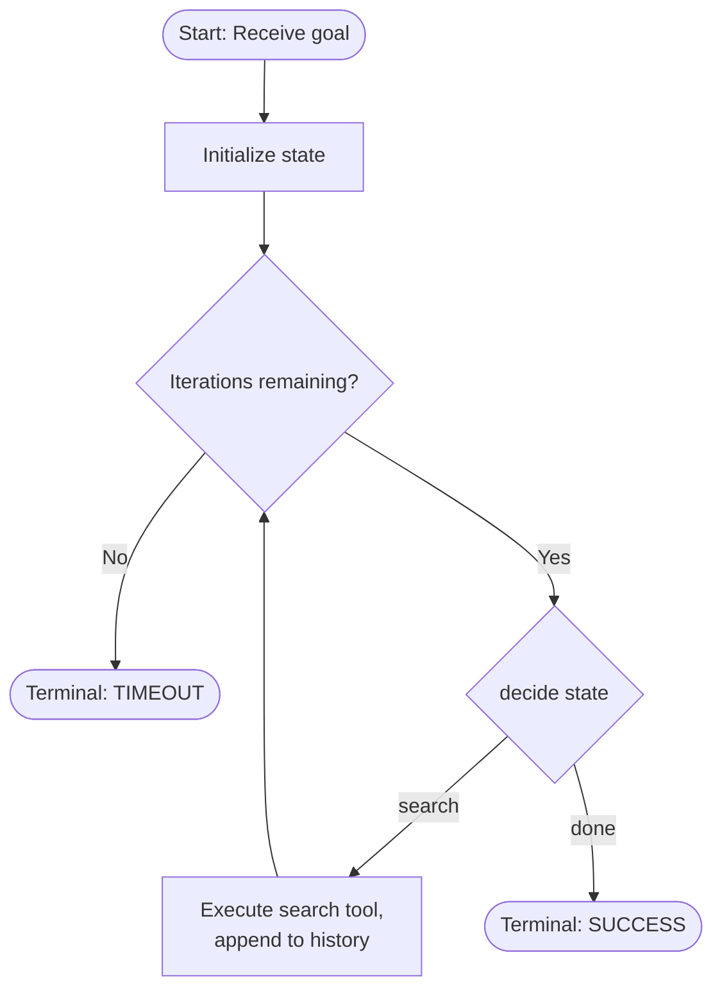
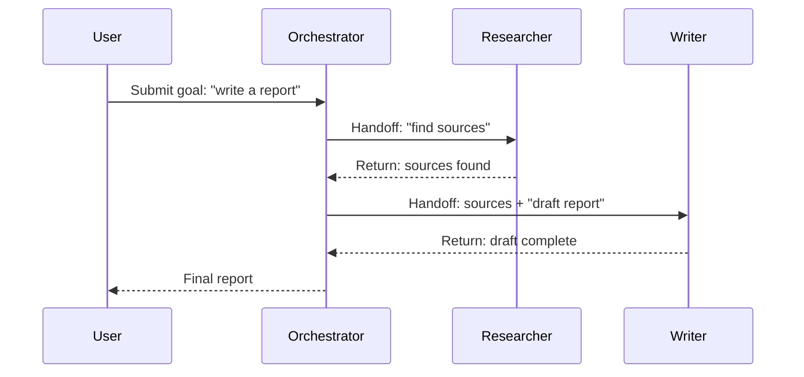
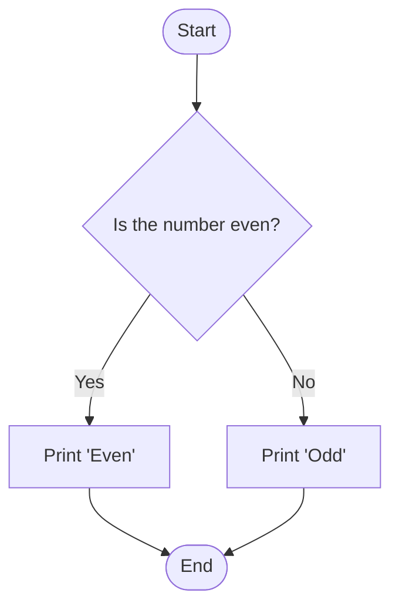
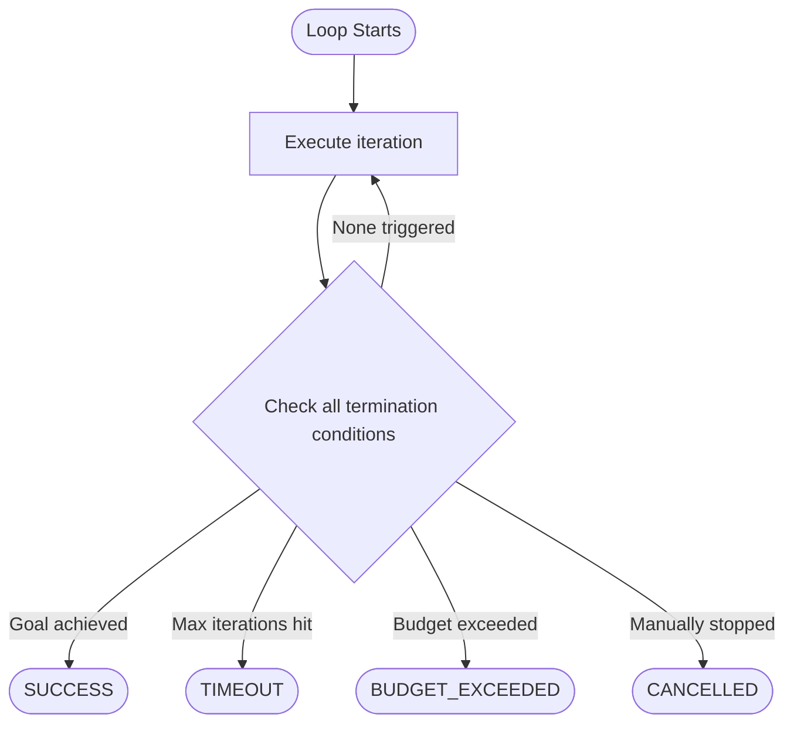
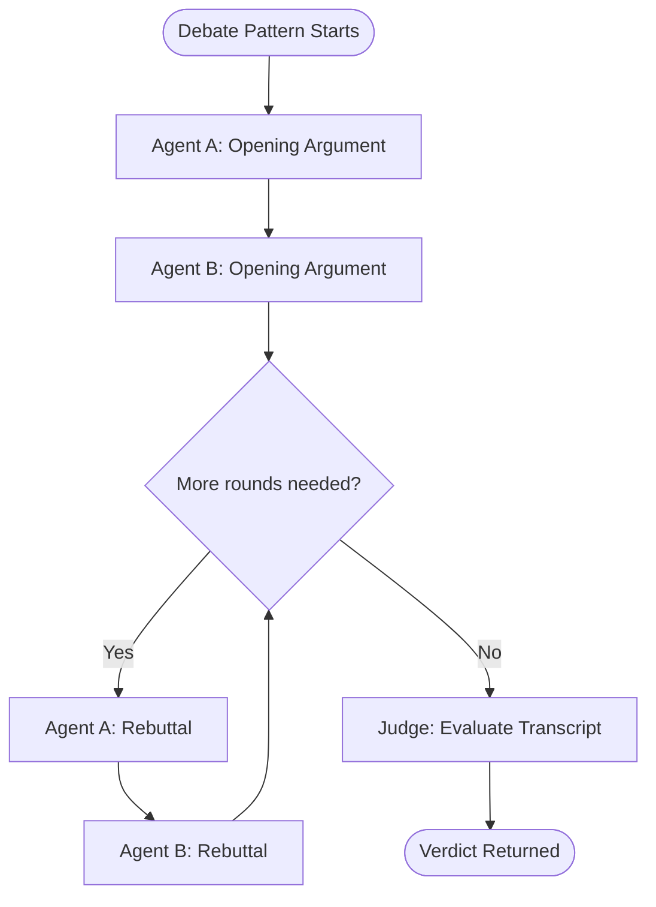
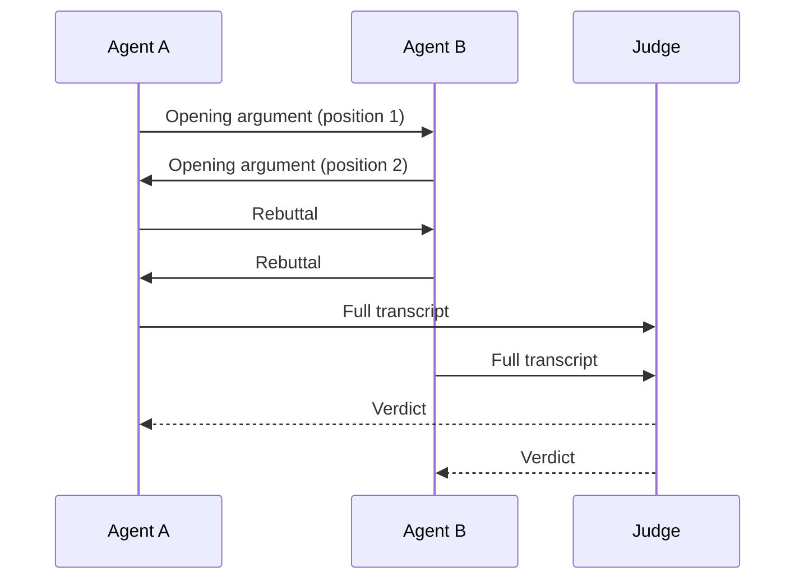

# 17 — Workflow and Diagrams

> 📘 File 17 of 25 — Loop Engineering Knowledge Library
> Phase: Scaling Up
> Prerequisite: `04_Core_Concepts.md`, `16_Loop_Design_Patterns.md`

---

## 1. Introduction

### Topic Overview

Every file in this library so far has included a Mermaid flowchart — 16 of them, by this point. This file steps back and teaches the *skill* directly: how to actually design and notate loop diagrams yourself, using Mermaid syntax and standard conventions, so you can diagram your own loops rather than just reading this library's diagrams.

### Why This Topic Matters

File 08 mentioned drawing a loop's flowchart *before* writing code as a best practice. That's only useful advice if you actually know how to draw one clearly. A badly notated diagram is worse than no diagram — it creates false confidence about a design that hasn't actually been thought through. This file makes sure you can produce diagrams that hold up.

---

## 2. Definition

### What Is It? (Simple Explanation)

A loop diagram is like a subway map for your code's logic — it shouldn't show every physical detail (that's what the code itself is for), but it should clearly show the *stations* (decision points, actions) and *lines* (the paths between them) so anyone can trace a route from start to finish without getting lost.

### Technical Definition

> **Workflow diagramming** for Loop Engineering is the practice of visually notating a loop's control flow, state transitions, and component interactions using standardized diagram types — primarily **flowcharts** (for control flow and decision points) and **sequence diagrams** (for time-ordered component interactions) — expressed in a text-based diagramming language such as **Mermaid**, enabling diagrams to be version-controlled, embedded in documentation, and rendered consistently across platforms.

---

## 3. Core Concepts

### Fundamental Ideas

- **Different diagram types answer different questions** — flowcharts answer "what happens next, and under what condition?"; sequence diagrams answer "in what order do these specific components talk to each other?"
- **A diagram should be drawn BEFORE code, not just after** — as a design tool, not merely documentation
- **Consistent notation matters more than exhaustive detail** — a diagram using the same symbol for "decision point" throughout is more readable than one mixing conventions
- **Text-based diagram languages (like Mermaid) are strongly preferred over image-based diagrams** for engineering contexts — they're version-controllable, diffable, and can be embedded directly in markdown documentation (exactly as this entire library does)

### Key Terminology

- **Flowchart** — a diagram showing control flow: sequence of steps and decision branches
- **Sequence diagram** — a diagram showing time-ordered interactions between specific named components
- **Node** — a single step, decision, or state in a diagram
- **Edge** — a connection between nodes, representing a transition or relationship
- **Decision node** — a node representing a branch point (typically drawn as a diamond)
- **Mermaid** — a text-based diagramming and charting language rendered from markdown-like syntax

---

## 4. How It Works

### Step-by-Step Explanation

**Designing a flowchart for a loop:**
1. Identify the loop's **entry point** (where does execution begin?)
2. Identify every **decision point** (every place where the next step depends on a condition)
3. Identify every **terminal state** (every way the loop can end — recall file 07's multiple terminal states)
4. Draw nodes for each step, decision, and terminal state
5. Draw edges connecting them, labeling edges from decision nodes with their condition
6. Verify: does every path from the entry point eventually reach a terminal state? (An unreachable terminal state, or a path with no terminal state, is a design bug the diagram just caught for you)

**Designing a sequence diagram for multi-agent interaction:**
1. List every distinct component/agent that will appear (from file 15/16's patterns)
2. Draw each as a labeled vertical lifeline
3. Draw horizontal arrows between lifelines for each message/handoff, in top-to-bottom time order
4. Label each arrow with what's being passed (the handoff content, per file 15)

### Internal Workflow

**Basic Mermaid flowchart syntax:**

```
flowchart TD
    A[Rectangle: a process step] --> B{Diamond: a decision}
    B -->|Condition label| C[Another step]
    B -->|Other condition| D([Rounded: start/end])
    C --> D
```

- `flowchart TD` — top-down direction (also: `LR` for left-right, useful for wide pipelines)
- `[Text]` — a rectangle (a process/action step)
- `{Text}` — a diamond (a decision point)
- `([Text])` — a rounded/stadium shape (commonly used for start/end states)
- `(("Text"))` — a circle (sometimes used for data stores, as in file 09's diagram)
- `-->` — a solid arrow (a standard transition)
- `-.->`— a dotted arrow (often used for optional/conditional paths, as in file 07's suspension flow)
- `-->|Label|` — a labeled edge (essential for decision branches)

**Basic Mermaid sequence diagram syntax:**

```
sequenceDiagram
    participant U as User
    participant O as Orchestrator
    participant W as Worker Agent

    U->>O: Submit goal
    O->>W: Handoff sub-task
    W-->>O: Return result
    O-->>U: Final combined answer
```

- `participant X as Name` — declares a lifeline
- `->>` — a solid arrow (a request/synchronous call)
- `-->>` — a dashed arrow (a response/return)
- Order matters — messages render top-to-bottom in the order written, directly encoding time sequence

**A complete worked example — designing a loop diagram from scratch:**

```python
# Given this loop's logic in code:
def example_loop(goal, max_iterations=5):
    state = {"goal": goal, "history": []}
    for i in range(max_iterations):
        decision = decide(state)
        if decision == "search":
            result = search_tool(state["goal"])
            state["history"].append(result)
        elif decision == "done":
            return {"status": "success", "state": state}
    return {"status": "timeout", "state": state}

# The diagram design process (Section 4's steps applied):
# 1. Entry point: receiving `goal`
# 2. Decision points: `decision = decide(state)` branches to "search" or "done";
#    the `for` loop itself is a decision point ("more iterations available?")
# 3. Terminal states: "success" (via done) and "timeout" (loop exhausted) — TWO
#    distinct terminal states, both need to appear on the diagram (file 07 lesson)
```

The resulting diagram (built from that analysis) is shown in Section 5 below — notice it maps directly, node for node, onto the code's actual structure.

---

## 5. Architecture / Workflow

### Mermaid Flowchart

*(This section demonstrates the design process from Section 4, applied to the example code above — and also serves as this file's own required diagram.)*



Notice this diagram has **two distinct terminal nodes** (TIMEOUT and SUCCESS) — directly reflecting file 07's lesson that termination isn't singular. A diagram that only showed one exit point would have hidden a real design gap.

### Sequence Diagram Example (for multi-agent handoffs, per file 15/16)



---

## 6. Components / Types

### Main Diagram Types

| Diagram Type | Answers | Best For |
|---|---|---|
| **Flowchart** | "What happens next, under what condition?" | Single-loop control flow, decision logic, termination paths |
| **Sequence Diagram** | "In what order do components interact?" | Multi-agent handoffs, API call ordering, time-sensitive interactions |
| **State Diagram** | "What states can this system be in, and how does it move between them?" | Loop lifecycle (file 07) — INITIALIZING → RUNNING → SUSPENDED → terminal states |

### Types of Flowchart Nodes (Standard Convention Used Throughout This Library)

| Shape | Mermaid Syntax | Meaning |
|---|---|---|
| Rectangle | `[Text]` | A process or action step |
| Diamond | `{Text}` | A decision point (must have 2+ labeled outgoing edges) |
| Rounded/Stadium | `([Text])` | Start or end/terminal state |
| Circle/Double Circle | `((Text))` | A data store or persistent resource (e.g., Memory, per file 09's diagram) |

### Categories of Diagrams by Purpose

- **Design diagrams** — drawn *before* code, to think through structure (file 08's recommended practice)
- **Documentation diagrams** — drawn *after* code, to explain existing structure to others (what every diagram in this library is)
- **Debugging diagrams** — drawn *during* investigation, to trace an actual observed execution path against the intended design

---

## 7. Examples

### Beginner Example

The simplest possible flowchart — a two-node decision, showing minimal correct Mermaid syntax:



```
flowchart TD
    A([Start]) --> B{Is the number even?}
    B -->|Yes| C[Print 'Even']
    B -->|No| D[Print 'Odd']
    C --> E([End])
    D --> E
```

Every decision node (`B`) has exactly two labeled outgoing edges (`Yes`/`No`) — this is the single most important habit for correct flowchart notation: an unlabeled edge out of a diamond is almost always a mistake.

### Intermediate Example

A flowchart correctly showing file 07's multiple terminal states — a common real-world diagramming task:



```
flowchart TD
    A([Loop Starts]) --> B[Execute iteration]
    B --> C{Check all termination conditions}
    C -->|Goal achieved| D([SUCCESS])
    C -->|Max iterations hit| E([TIMEOUT])
    C -->|Budget exceeded| F([BUDGET_EXCEEDED])
    C -->|Manually stopped| G([CANCELLED])
    C -->|None triggered| B
```

Notice this correctly has **four distinct terminal nodes**, not one generic "End" — a diagram collapsing these into a single exit would hide the exact distinction file 07 emphasizes as critical for production debugging.

### Advanced / Real-World Example

Combining a flowchart AND a sequence diagram for the same system — showing why you often need *both* diagram types together, not just one:





The flowchart answers "what's the control logic — when do we stop debating?" The sequence diagram answers "who exactly talks to whom, and in what order?" Neither diagram alone tells the full story — this is exactly why file 15/16's debate pattern benefits from both views.

---

## 8. Best Practices

### Do's

- ✅ Draw a flowchart *before* writing loop code for anything beyond the trivially simple — treat it as a design tool, per file 08's recommendation
- ✅ Give every decision diamond at least two labeled outgoing edges — an unlabeled or single-path diamond usually signals either a diagramming mistake or a design gap
- ✅ Show ALL distinct terminal states explicitly (file 07) rather than collapsing them into one generic "End" node
- ✅ Use sequence diagrams specifically for multi-agent/multi-component interactions (files 15–16) where *order and direction* of communication is the important detail — flowcharts obscure this

### Recommended Techniques

- Keep diagrams focused — if a single flowchart is getting too complex to read at a glance, that's often a signal the underlying loop itself has too much undifferentiated complexity and might benefit from decomposition (file 13) or a multi-agent pattern (files 15–16)
- Store diagrams as text (Mermaid, as this entire library does) rather than as static images — text diagrams are version-controllable, diffable in code review, and can be regenerated/edited far more easily than a redrawn image

---

## 9. Common Mistakes

### Frequent Errors

| Mistake | Consequence |
|---|---|
| Decision diamonds with unlabeled or single edges | Ambiguous or incomplete branching logic, both in the diagram and often in the underlying code |
| Collapsing multiple distinct terminal states into one "End" node | Hides important distinctions (file 07) that matter for debugging and monitoring |
| Using a flowchart when a sequence diagram is what's actually needed (or vice versa) | The diagram fails to answer the question it was meant to answer |
| Drawing diagrams only after code is complete, purely for documentation | Loses the design-tool value of catching structural issues before implementation |
| Overly dense diagrams trying to show every implementation detail | Becomes unreadable, defeating the purpose of visual communication |

### How to Avoid Them

- Before finalizing a flowchart, explicitly verify (as in Section 4's step 6) that every path reaches a terminal state, and that every terminal state is actually reachable
- Choose diagram type by first asking "am I trying to show control flow/decisions, or am I trying to show who talks to whom in what order?" — the answer determines flowchart vs. sequence diagram immediately

---

## 10. Advantages & Limitations

### Benefits of Deliberate Diagramming

- Catches structural design flaws (unreachable states, missing termination paths) before they become bugs in running code
- Provides a shared, precise vocabulary for discussing loop architecture with other engineers
- Text-based diagrams (Mermaid) integrate directly into documentation and version control, exactly as this library demonstrates throughout
- Different diagram types (flowchart vs. sequence) surface different classes of design issues

### Limitations

- Diagrams are abstractions — they intentionally omit implementation detail, and can create false confidence if treated as a complete specification
- Overly complex systems can outgrow what a single diagram can clearly represent, requiring decomposition into multiple linked diagrams
- Diagrams need active maintenance — a diagram that isn't updated alongside code drifts into inaccuracy, becoming actively misleading

---

## 11. Comparison

### Compare with Related Concepts

| Diagram Type | Most Similar To (Outside Loop Engineering) |
|---|---|
| **Flowchart** | A recipe's step-by-step instructions with decision points ("if using gas oven, preheat to X") |
| **Sequence Diagram** | A relay race's baton-passing order — who hands off to whom, in what sequence |
| **State Diagram** | A traffic light's state machine — red, yellow, green, and the rules for transitioning between them |

### Summary Table

| Question | Use a Flowchart | Use a Sequence Diagram |
|---|---|---|
| Showing decision branches? | **Yes** | No |
| Showing which specific agents talk to each other? | No | **Yes** |
| Showing time-ordering of messages? | Weakly | **Yes, explicitly** |
| Showing termination conditions (file 07)? | **Yes** | No |
| Best for single-loop control flow? | **Yes** | No |
| Best for multi-agent coordination (files 15-16)? | Partially | **Yes** |

---

## 12. Summary

### Key Takeaways

- **Flowcharts** answer "what happens next, under what condition?" — best for single-loop control flow and termination paths
- **Sequence diagrams** answer "who talks to whom, in what order?" — best for multi-agent handoffs and coordination (files 15–16)
- Every decision diamond needs at least two clearly labeled outgoing edges; every distinct terminal state (file 07) should appear explicitly, not collapsed into a generic "End"
- Text-based diagram languages like Mermaid are strongly preferred for engineering contexts — version-controllable, diffable, and embeddable directly in documentation, exactly as demonstrated throughout this entire library

### Cheat Sheet

```
MERMAID FLOWCHART SYNTAX:
  [Text]      → rectangle (process/action)
  {Text}      → diamond (decision — needs 2+ LABELED edges)
  ([Text])    → rounded/stadium (start/end/terminal state)
  ((Text))    → circle (data store/memory)
  -->         → solid arrow
  -.->        → dotted arrow (optional/conditional path)
  -->|Label|  → labeled edge (REQUIRED on decision branches)

MERMAID SEQUENCE DIAGRAM SYNTAX:
  participant X as Name  → declares a lifeline
  ->>                    → solid arrow (request)
  -->>                   → dashed arrow (response)
  (order written = time order rendered)

CHOOSING: control flow/decisions → Flowchart
          who-talks-to-whom/ordering → Sequence Diagram
```

---

## 13. Glossary

| Term | Definition |
|---|---|
| **Flowchart** | A diagram showing control flow: sequence of steps and decision branches |
| **Sequence Diagram** | A diagram showing time-ordered interactions between named components |
| **Node** | A single step, decision, or state represented in a diagram |
| **Edge** | A connection between nodes representing a transition or relationship |
| **Decision Node** | A node representing a branch point, typically drawn as a diamond |
| **Mermaid** | A text-based diagramming and charting language rendered from markdown-like syntax |
| **Lifeline** | In a sequence diagram, the vertical line representing one component/agent over time |

---

## 14. References & Further Reading

### Official Documentation

- Mermaid — [Official Documentation](https://mermaid.js.org) — the complete syntax reference for every diagram type used throughout this library

### Further Reading

- Unified Modeling Language (UML) specification — the broader standardization effort that influenced sequence diagram conventions
- C4 Model (Simon Brown) — a complementary approach to software architecture diagramming, useful alongside the flowchart/sequence conventions in this file

### Where to Go Next in This Library

- Previous file: `16_Loop_Design_Patterns.md`
- Next file: `18_Practical_Examples.md` — full, complete, runnable implementations bringing together everything diagrammed and explained so far
- Related: Every prior file's Section 5 — this file is the "how" behind every diagram you've already seen in this library

---

*This is File 17 of 25 in the Loop Engineering Knowledge Library. See `README.md` for the full index and suggested reading paths.*
