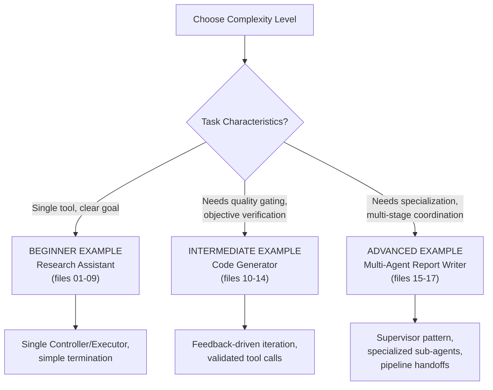

# 18 — Practical Examples

> 📘 File 18 of 25 — Loop Engineering Knowledge Library
> Phase: Scaling Up
> Prerequisite: Files 01–17 (this file assumes and applies everything prior)

---

## 1. Introduction

### Topic Overview

Every prior file has used focused, illustrative code snippets to explain one concept at a time. This file is different: three **complete, runnable, end-to-end implementations**, each pulling together multiple concepts from across the entire library into a single working system — exactly the way a real project would.

### Why This Topic Matters

Understanding individual concepts is necessary but not sufficient. Seeing how state management (file 11), feedback (file 12), tool calling (file 14), and termination logic (file 07) all interact *within one real system* is what actually builds the intuition to design your own loops from scratch.

---

## 2. Definition

### What Is It? (Simple Explanation)

If files 01–17 were individual cooking lessons (knife skills, sauce-making, seasoning), this file is three complete recipes cooked start to finish — showing how those individual skills combine into an actual finished dish.

### Technical Definition

> This file presents three complete reference implementations at increasing complexity: a **Beginner** example (a single-loop, tool-using research assistant demonstrating files 01–09's core mechanics), an **Intermediate** example (a feedback-driven code-generation loop demonstrating files 10–14's patterns and tool safety), and an **Advanced** example (a multi-agent research-and-write system demonstrating files 15–17's coordination and design patterns) — each fully runnable and annotated with references back to the specific library files each section implements.

---

## 3. Core Concepts

### Fundamental Ideas

- **Real systems combine many concepts simultaneously** — no production loop uses just one file's lessons in isolation
- **Complexity should match the task** — the beginner example is intentionally simple because its task doesn't need more; over-engineering a simple task is as much a mistake as under-engineering a complex one
- **Every example here is annotated with file references** — so you can trace any line of code back to the specific concept it implements

### Key Terminology

*(This file applies prior terminology rather than introducing new terms — see file 05 for the complete glossary.)*

---

## 4. How It Works

*(For this file, Section 4 and Section 7 are combined — the "how it works" IS the worked examples themselves.)*

---

## 5. Architecture / Workflow

### Mermaid Flowchart



---

## 6. Components / Types

### The Three Examples at a Glance

| Example | Complexity | Key Files Demonstrated | Pattern Used |
|---|---|---|---|
| **Beginner: Research Assistant** | Single loop, single tool | 01, 04, 06, 09, 14 | Basic ReAct (file 10) |
| **Intermediate: Code Generator** | Single loop, feedback-driven | 10, 12, 13, 14, 19 | Evaluator-Optimizer (file 16) |
| **Advanced: Report Writing System** | Multi-agent, multi-stage | 15, 16, 17, 11 | Supervisor + Pipeline (file 16) |

---

## 7. Examples

### Beginner Example: A Tool-Using Research Assistant

**What it demonstrates:** the core loop skeleton (file 01), the four components (file 09) as separate classes, structured tool calling (file 14), and simple termination logic (file 07).

```python
import time
from dataclasses import dataclass, field

# ── Component: Executor (file 09, file 14) ────────────────────
class ResearchExecutor:
    def __init__(self):
        self.mock_knowledge_base = {
            "renewable energy": "Solar and wind capacity grew significantly in recent years.",
            "electric vehicles": "EV adoption is rising due to falling battery costs.",
        }

    def search(self, query: str) -> str:
        for key, value in self.mock_knowledge_base.items():
            if key in query.lower():
                return value
        return f"No specific information found for: {query}"


# ── Component: Controller (file 09) ────────────────────────────
class ResearchController:
    def decide(self, state: dict) -> dict:
        # Simplified rule-based reasoning (file 13's chain-of-thought,
        # simulated here rather than via a real LLM call for a self-contained example)
        if len(state["findings"]) == 0:
            return {"action": "search", "query": state["goal"]}
        elif len(state["findings"]) < 2:
            return {"action": "search", "query": f"{state['goal']} details"}
        else:
            return {"action": "final_answer", "answer": self._summarize(state)}

    def _summarize(self, state):
        return f"Summary of {len(state['findings'])} findings on '{state['goal']}': " + \
               " | ".join(state["findings"])


# ── Component: Evaluator (file 09, file 07) ────────────────────
class ResearchEvaluator:
    def __init__(self, max_iterations=5, max_seconds=30):
        self.max_iterations = max_iterations
        self.max_seconds = max_seconds

    def should_continue(self, state, iteration, elapsed):
        if state.get("final_answer"):
            return False, "success"
        if iteration >= self.max_iterations:
            return False, "max_iterations"
        if elapsed >= self.max_seconds:
            return False, "timeout"
        return True, None


# ── The full loop, assembled (file 01's skeleton, file 09's components) ──
def research_assistant_loop(goal):
    executor = ResearchExecutor()
    controller = ResearchController()
    evaluator = ResearchEvaluator(max_iterations=5)

    state = {"goal": goal, "findings": [], "final_answer": None}
    start = time.time()
    iteration = 0

    while True:
        should_continue, reason = evaluator.should_continue(state, iteration, time.time() - start)
        if not should_continue:
            return {"status": reason, "state": state}

        decision = controller.decide(state)

        if decision["action"] == "final_answer":
            state["final_answer"] = decision["answer"]
            continue

        result = executor.search(decision["query"])   # tool call, file 14
        state["findings"].append(result)                 # state reconciliation, file 06/11
        iteration += 1


# ── Run it ──────────────────────────────────────────────────────
result = research_assistant_loop("renewable energy")
print(f"Status: {result['status']}")
print(f"Answer: {result['state']['final_answer']}")
```

---

### Intermediate Example: A Feedback-Driven Code Generator

**What it demonstrates:** the Evaluator-Optimizer pattern (file 16), feedback-driven iteration (file 12), sandboxed tool execution (file 14), and the ReAct vs. Reflexion distinction (file 10) made concrete.

```python
import subprocess
import tempfile
import os

# ── Sandboxed execution tool (file 14's safety pattern) ────────
class SafeCodeRunner:
    def __init__(self, timeout=3):
        self.timeout = timeout

    def run_with_tests(self, code: str, test_code: str) -> dict:
        full_script = code + "\n\n" + test_code
        with tempfile.NamedTemporaryFile(mode="w", suffix=".py", delete=False) as f:
            f.write(full_script)
            path = f.name

        try:
            result = subprocess.run(
                ["python3", path], capture_output=True, text=True, timeout=self.timeout
            )
            return {
                "passed": result.returncode == 0,
                "stdout": result.stdout,
                "stderr": result.stderr,
            }
        except subprocess.TimeoutExpired:
            return {"passed": False, "stdout": "", "stderr": "Execution timed out"}
        finally:
            os.unlink(path)


# ── Generator: produces code, informed by prior feedback (file 12) ──
def code_generator(task, feedback_history):
    """Simulates an LLM generating code, genuinely improving based
    on SPECIFIC prior feedback — not blind retry (file 12's key distinction)."""
    attempt_number = len(feedback_history)

    if attempt_number == 0:
        # First attempt: a deliberately introduced bug for this example
        return "def fibonacci(n):\n    if n <= 1: return n\n    return fibonacci(n-1) + fibonacci(n-2) + 1"
    else:
        last_feedback = feedback_history[-1]
        if "off by" in last_feedback.lower() or "expected" in last_feedback.lower():
            # Corrected, informed by the SPECIFIC feedback received
            return "def fibonacci(n):\n    if n <= 1: return n\n    return fibonacci(n-1) + fibonacci(n-2)"

    return "def fibonacci(n):\n    if n <= 1: return n\n    return fibonacci(n-1) + fibonacci(n-2)"


# ── Evaluator: dedicated, separate critic (file 16's Evaluator-Optimizer) ──
def code_evaluator(code, runner: SafeCodeRunner):
    test_code = """
result = fibonacci(10)
assert result == 55, f"Expected 55, got {result}"
print("All tests passed")
"""
    outcome = runner.run_with_tests(code, test_code)

    if outcome["passed"]:
        return {"approved": True, "feedback": None}
    else:
        return {"approved": False, "feedback": outcome["stderr"] or outcome["stdout"]}


# ── The Evaluator-Optimizer loop (file 16), applying file 12's feedback mechanics ──
def feedback_driven_code_loop(task, max_rounds=4):
    runner = SafeCodeRunner()
    feedback_history = []

    for round_num in range(max_rounds):
        code = code_generator(task, feedback_history)
        evaluation = code_evaluator(code, runner)

        if evaluation["approved"]:
            return {
                "status": "approved",
                "final_code": code,
                "rounds_needed": round_num + 1
            }

        feedback_history.append(evaluation["feedback"])

    return {
        "status": "max_rounds_reached",
        "final_code": code,
        "feedback_history": feedback_history
    }


# ── Run it ──────────────────────────────────────────────────────
result = feedback_driven_code_loop("Write a correct fibonacci function")
print(f"Status: {result['status']}")
print(f"Rounds needed: {result.get('rounds_needed', 'N/A')}")
print(f"Final code:\n{result['final_code']}")
```

---

### Advanced / Real-World Example: A Multi-Agent Report Writing System

**What it demonstrates:** the Supervisor pattern combined with a Pipeline (file 16), specialized sub-agents (file 15), hierarchical state management (file 11), and full observability logging (file 08).

```python
import time
import json

# ── Shared observability layer (file 08) ────────────────────────
class ObservabilityLog:
    def __init__(self):
        self.events = []

    def log(self, agent, event, **detail):
        self.events.append({
            "time": round(time.time(), 3),
            "agent": agent,
            "event": event,
            **detail
        })

    def print_trace(self):
        for e in self.events:
            print(f"[{e['agent']}] {e['event']}: {json.dumps({k:v for k,v in e.items() if k not in ('time','agent','event')})}")


# ── Specialized sub-agents, each with a narrow role (file 15) ──
class ResearcherAgent:
    def __init__(self, log: ObservabilityLog):
        self.log = log

    def run(self, topic):
        self.log.log("Researcher", "started", topic=topic)
        # In production: a real search-tool-using loop (file 14) would run here
        findings = [f"Key fact 1 about {topic}", f"Key fact 2 about {topic}"]
        self.log.log("Researcher", "completed", findings_count=len(findings))
        return {"findings": findings}


class WriterAgent:
    def __init__(self, log: ObservabilityLog):
        self.log = log

    def run(self, topic, findings):
        self.log.log("Writer", "started", findings_received=len(findings))
        draft = f"Report on {topic}:\n" + "\n".join(f"- {f}" for f in findings)
        self.log.log("Writer", "completed", draft_length=len(draft))
        return {"draft": draft}


class EditorAgent:
    def __init__(self, log: ObservabilityLog):
        self.log = log

    def run(self, draft):
        self.log.log("Editor", "started")
        # Simplified quality check (file 12's feedback mechanics, at agent scope)
        issues = []
        if len(draft) < 20:
            issues.append("Draft is too short")

        approved = len(issues) == 0
        self.log.log("Editor", "completed", approved=approved, issues=issues)
        return {"approved": approved, "issues": issues, "final_draft": draft}


# ── The Orchestrator (file 15/16's Supervisor pattern) ──────────
class ReportOrchestrator:
    def __init__(self):
        self.log = ObservabilityLog()
        self.researcher = ResearcherAgent(self.log)
        self.writer = WriterAgent(self.log)
        self.editor = EditorAgent(self.log)

    def run(self, topic, max_revision_rounds=2):
        self.log.log("Orchestrator", "goal_received", topic=topic)

        # STAGE 1: Research (Pipeline pattern, file 16)
        research_result = self.researcher.run(topic)

        # STAGE 2: Write (Pipeline pattern, file 16)
        write_result = self.writer.run(topic, research_result["findings"])
        current_draft = write_result["draft"]

        # STAGE 3: Edit with revision loop (Evaluator-Optimizer, file 16)
        for revision_round in range(max_revision_rounds):
            edit_result = self.editor.run(current_draft)

            if edit_result["approved"]:
                self.log.log("Orchestrator", "goal_completed", rounds=revision_round + 1)
                return {
                    "status": "success",
                    "final_report": edit_result["final_draft"],
                    "trace": self.log.events
                }

            # In a full implementation: feed edit_result["issues"] back to
            # the Writer for a genuine revision (file 12's feedback mechanics)
            self.log.log("Orchestrator", "revision_needed", issues=edit_result["issues"])
            current_draft = current_draft + "\n[Additional detail added in revision]"

        self.log.log("Orchestrator", "max_revisions_reached")
        return {
            "status": "max_revisions_reached",
            "final_report": current_draft,
            "trace": self.log.events
        }


# ── Run it ──────────────────────────────────────────────────────
orchestrator = ReportOrchestrator()
result = orchestrator.run("solar panel efficiency trends")

print(f"Status: {result['status']}\n")
print(f"Final Report:\n{result['final_report']}\n")
print("--- Full Observability Trace (file 08) ---")
orchestrator.log.print_trace()
```

---

## 8. Best Practices

### Do's

- ✅ Match implementation complexity to task complexity — don't build the Advanced example's multi-agent system for a task the Beginner example's single loop would handle just as well
- ✅ Notice how every example reuses the same underlying vocabulary (Controller, Executor, Evaluator, feedback, termination) at different scales — this is the payoff of having learned the concepts in files 01–17 first
- ✅ Use the file-reference annotations in these examples as a study technique — trace any unfamiliar line back to its source file for a refresher

### Recommended Techniques

- Treat these three examples as *starting templates* — copy the one closest to your actual task and adapt it, rather than building from a completely blank file
- Run each example locally and deliberately break something (remove the max_iterations limit, corrupt a feedback signal) to observe the failure modes described in files 02 and 19 firsthand

---

## 9. Common Mistakes

### Frequent Errors

| Mistake | Consequence |
|---|---|
| Starting a new project by copying the Advanced example "to be safe" | Massive unnecessary complexity for tasks that didn't need multi-agent coordination |
| Starting with the Beginner example for a task that genuinely needs feedback-driven quality gating | Under-engineered — ships unreliable results a simple Evaluator-Optimizer round would have caught |
| Not reading the file-reference annotations | Misses the connective tissue between abstract concepts (files 01–17) and this file's concrete application |

### How to Avoid Them

- Before choosing a starting template, honestly assess: does this task need specialization (multi-agent)? Does it need objective quality gating (feedback-driven)? Or is a single well-bounded loop sufficient?
- Re-read the specific library file referenced in a comment whenever an example's logic isn't immediately clear — these examples are deliberately terse in comments precisely because the full explanation already exists elsewhere in this library

---

## 10. Advantages & Limitations

### Benefits of Complete Worked Examples

- Shows genuine integration between concepts, not just isolated illustrations
- Provides copy-adaptable starting templates for real projects
- Makes the abstract concrete — every prior file's lessons are visibly *doing something* in working code
- Three complexity tiers let you calibrate your own project's starting point realistically

### Limitations

- These examples use simplified/mocked LLM calls (rule-based logic standing in for real model calls) to remain self-contained and runnable without API keys — production versions would replace these with real Controller implementations (file 09's `LLMController`)
- Real production systems would add additional error handling, logging detail, and configuration beyond what's shown here for clarity

---

## 11. Comparison

### Compare the Three Examples Directly

| Aspect | Beginner | Intermediate | Advanced |
|---|---|---|---|
| Number of loops | 1 | 1 (with internal Generator/Evaluator split) | 4 (Orchestrator + 3 sub-agents) |
| Termination complexity | Simple (3 states) | Moderate (approval-gated) | Complex (multi-stage, revision-gated) |
| Tool use | Yes, single tool | Yes, sandboxed code execution | Implied (would use file 14 patterns in production) |
| Best real-world analog | A simple Q&A research bot | An automated code review/fix system | A content production pipeline |

### Summary Table

| If your task is... | Start from... |
|---|---|
| A single, well-defined goal with one or two tools | Beginner example |
| Something with an objective correctness check (tests, schemas) worth iterating against | Intermediate example |
| Something needing distinct specialties or a multi-stage production pipeline | Advanced example |

---

## 12. Summary

### Key Takeaways

- The **Beginner** example demonstrates the core loop skeleton, the four components, and simple tool use — the right starting point for focused, single-tool tasks
- The **Intermediate** example demonstrates feedback-driven iteration via the Evaluator-Optimizer pattern with sandboxed code execution — appropriate when a task has an objective correctness check worth iterating against
- The **Advanced** example demonstrates a full multi-agent Supervisor+Pipeline system with observability logging — appropriate for genuinely specialized, multi-stage production tasks
- **Matching complexity to task need** is itself a core Loop Engineering skill — every example in this file is a deliberate, justified complexity choice, not complexity for its own sake

### Cheat Sheet

```
CHOOSING YOUR STARTING TEMPLATE:

Single goal, one or two tools, no quality gate needed?
  → BEGINNER (files 01, 04, 06, 09, 14)

Objective correctness check available (tests/schemas), worth iterating?
  → INTERMEDIATE (files 10, 12, 13, 14, 16)

Distinct specialties needed, multi-stage production pipeline?
  → ADVANCED (files 15, 16, 17, 11)

RULE: copy the closest-fit template, adapt it — don't build from blank.
```

---

## 13. Glossary

*(This file applies terminology from across the library rather than introducing new terms — see file 05 for the complete glossary.)*

---

## 14. References & Further Reading

### Official Documentation

- Anthropic — [Claude API Documentation](https://docs.claude.com) — for replacing this file's simulated Controllers with real LLM-backed ones
- LangGraph — [Examples and Tutorials](https://docs.langchain.com/oss/python/langgraph/overview) — additional complete, runnable reference implementations

### Where to Go Next in This Library

- Previous file: `17_Workflow_and_Diagrams.md`
- Next file: `19_Best_Practices_and_Common_Mistakes.md` — a consolidated, production-focused reference pulling together every best-practice and common-mistake section from files 01–18
- Related: Every file 01–17 — this file's annotations point back to nearly all of them

---

*This is File 18 of 25 in the Loop Engineering Knowledge Library. See `README.md` for the full index and suggested reading paths.*
