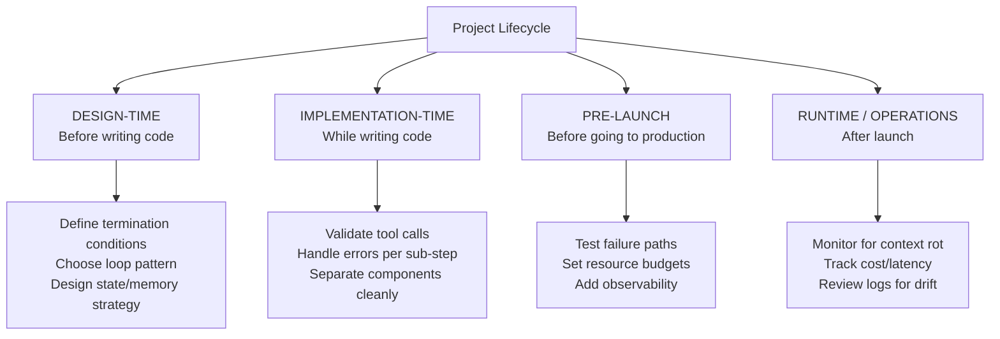

# 19 — Best Practices and Common Mistakes

> 📘 File 19 of 25 — Loop Engineering Knowledge Library
> Phase: Doing It Well
> Prerequisite: Files 01–18 (this file consolidates and extends their guidance)

---

## 1. Introduction

### Topic Overview

Every prior file included its own "Best Practices" and "Common Mistakes" sections, scoped to that file's specific topic. This file is different in purpose: it's the **consolidated, production-focused reference** — organized by *when in a project's lifecycle* each practice matters, rather than by which library file it originally came from. Use this file as your pre-launch checklist.

### Why This Topic Matters

Individually, each file's best practices are easy to nod along with. Collectively, seen as a single production checklist, they reveal how much of "reliable agent engineering" is really just consistent discipline applied across many small decisions — not any single clever trick.

---

## 2. Definition

### What Is It? (Simple Explanation)

If files 01–18 were individual chapters of a driving manual (steering, braking, parking), this file is the pre-drive checklist a careful driver runs through every single time — pulling the most safety-critical items from every chapter into one place you actually consult before turning the key.

### Technical Definition

> This file provides a **production-readiness framework** organized into four lifecycle stages — **Design-Time**, **Implementation-Time**, **Pre-Launch**, and **Runtime/Operations** — each populated with the most consequential best practices and failure modes from files 01–18, re-organized for practical application rather than conceptual learning.

---

## 3. Core Concepts

### Fundamental Ideas

- **Most production agent failures are not exotic** — they're one of a well-understood, recurring set of mistakes, most of which this library has already named across files 02, 06, 07, 11, 12, 14, and 15
- **Different mistakes surface at different project stages** — a design-time mistake (no termination strategy) looks different in symptom from a runtime mistake (context rot after days of operation), even though both trace back to inadequate engineering
- **A checklist beats memory** — even an engineer who deeply understands every individual file benefits from a single consolidated pass before shipping

### Key Terminology

*(This file applies terminology from across the library — see file 05 for definitions of any unfamiliar term below.)*

---

## 4. How It Works

*(For this consolidated reference file, Sections 4 and 8 are merged into the lifecycle-organized checklist below, which functions as both explanation and best-practices content.)*

---

## 5. Architecture / Workflow

### Mermaid Flowchart



---

## 6. Components / Types

### The Four Lifecycle Stages

| Stage | Primary Question | Files Most Relevant |
|---|---|---|
| **Design-Time** | "What am I building, and what could go wrong structurally?" | 02, 04, 07, 10, 16 |
| **Implementation-Time** | "Am I writing this loop's mechanics correctly?" | 06, 09, 11, 13, 14 |
| **Pre-Launch** | "Have I actually tested the failure paths, not just the happy path?" | 02, 07, 08, 12 |
| **Runtime/Operations** | "Is this loop behaving well in the real world, over time?" | 08, 11, 15 |

---

## 7. Examples

*(For this consolidated file, Section 7's "examples" are the checklist items themselves, organized by stage — each directly actionable.)*

### DESIGN-TIME Checklist

```python
design_time_checklist = {
    "Termination conditions defined?": [
        "Multiple hard limits set (iterations, time, tokens/cost) — file 02, 07",
        "All distinct terminal states identified (not just success/fail) — file 07",
        "Verification-based completion check designed, not just model self-report — file 02, 09",
    ],
    "Loop pattern chosen deliberately?": [
        "Predictability of the task assessed (interleaved vs. upfront planning) — file 10",
        "Retry/feedback need assessed (is Reflexion/Evaluator-Optimizer justified?) — file 10, 16",
        "Multi-agent need genuinely justified, not defaulted to — file 15",
    ],
    "State and memory strategy designed?": [
        "State (this run) vs. memory (across runs) distinction made explicit — file 11",
        "Context management strategy chosen (sliding window/summarization/retrieval) — file 11",
        "Memory write policy is deliberate, not 'persist everything' — file 11",
    ],
}
```

### IMPLEMENTATION-TIME Checklist

```python
implementation_time_checklist = {
    "Six sub-steps properly separated?": [
        "Prompt construction, inference, parsing, dispatch, serialization, reconciliation "
        "are each independently testable — file 06",
        "State reconciliation APPENDS, never overwrites — file 06, 11",
    ],
    "Tool calls properly engineered?": [
        "Tool descriptions are clear and specific — file 14",
        "Arguments validated BEFORE execution, every time — file 14",
        "High-risk/irreversible tools gated behind approval — file 07, 14",
        "Code-execution tools are sandboxed with hard resource limits — file 14",
    ],
    "Components cleanly separated?": [
        "Controller, Executor, Memory Manager, Evaluator are swappable in isolation — file 09",
        "Executor never directly mutates shared state — file 09",
    ],
    "Reasoning quality maximized?": [
        "Chain-of-thought elicited for non-trivial decisions — file 13",
        "Reasoning traces stored, not discarded — file 06, 13",
    ],
}
```

### PRE-LAUNCH Checklist

```python
pre_launch_checklist = {
    "Failure paths actually tested, not just the happy path?": [
        "Deliberately triggered a tool error — does the loop recover or crash? — file 06, 14",
        "Deliberately fed a malformed/truncated model response — handled gracefully? — file 06",
        "Deliberately exceeded each resource budget — correct terminal state reached? — file 07",
        "Simulated a mid-run interruption — does checkpoint/resume actually work? — file 07, 11",
    ],
    "Resource budgets are conservative for initial launch?": [
        "Iteration limits set LOW initially, loosened only after trust is built — file 02",
        "Cost/token budgets have a hard ceiling, not just a soft warning — file 02, 03",
    ],
    "Observability is in place BEFORE launch, not added after an incident?": [
        "Every lifecycle stage transition is logged — file 07, 08",
        "Correlation IDs tie together all logs for a single run — file 08",
        "Tool calls (successful or not) are logged with full arguments — file 14",
    ],
}
```

### RUNTIME/OPERATIONS Checklist

```python
runtime_operations_checklist = {
    "Watching for context rot?": [
        "Context size tracked over long-running sessions — file 11",
        "Summarization/pruning triggers verified to actually fire in production — file 11",
    ],
    "Watching for drift?": [
        "Periodic review of actual agent actions vs. original goal — file 02",
        "Alerts configured for unusually long-running or high-cost individual runs — file 02, 08",
    ],
    "Multi-agent systems specifically monitored?": [
        "Inter-agent communication logs reviewed for miscommunication patterns — file 15",
        "Handoff failures tracked as a distinct metric from single-agent failures — file 15",
    ],
    "Cost and latency tracked over time, not just at launch?": [
        "Per-run cost trends monitored for gradual creep — file 02, 08",
        "P95/P99 latency tracked, not just averages, since loop iteration counts vary — file 08",
    ],
}
```

---

## 8. Best Practices

*(Merged into the lifecycle checklist above — see Section 7.)*

---

## 9. Common Mistakes

### The Consolidated "Top 10" — Most Consequential Mistakes Across This Entire Library

| # | Mistake | Source File | Why It's So Common |
|---|---|---|---|
| 1 | No hard iteration/time/cost limits | 02 | Feels unnecessary until the first runaway loop actually happens |
| 2 | Trusting model self-report for completion, with no independent verification | 02, 09 | The simplest thing to implement, so it's often the default |
| 3 | State overwritten instead of appended during reconciliation | 06, 11 | An easy, non-obvious bug — looks correct until multi-step tasks reveal it |
| 4 | Unbounded context leading to context rot | 11 | No single moment where it "breaks" — it's gradual degradation, easy to miss |
| 5 | No argument validation before tool execution | 14 | Tempting to skip when tools are "obviously" going to be called correctly |
| 6 | Treating tool/inference errors as unrecoverable crashes | 02, 06, 14 | Simpler to write a crash than a recovery path, especially under deadline pressure |
| 7 | Choosing multi-agent architecture without genuine justification | 15 | Sounds more sophisticated, so it's over-selected relative to actual need |
| 8 | Blind retry mistaken for genuine feedback-driven iteration | 12 | Both "look like" iteration from the outside; the difference is invisible without inspecting the code |
| 9 | No observability/logging until after the first production incident | 08 | Observability has no payoff until something goes wrong, so it's easy to deprioritize |
| 10 | Synchronous architecture for loops that can run unpredictably long | 08 | Works fine in local testing, fails under real-world task variance |

### How to Avoid Them

- Run the Section 7 checklists as literal, physical checklists before every launch — not just a mental review
- Assign the "Top 10" table above as a required pre-launch code review pass — specifically search your codebase for each of these ten patterns before shipping

---

## 10. Advantages & Limitations

### Benefits of a Consolidated Checklist

- Converts scattered, file-specific guidance into a single, actionable pre-launch reference
- Organizing by lifecycle stage (rather than by topic) matches how engineers actually work through a project
- The "Top 10" table gives a fast, high-signal review pass when a full checklist run isn't time-feasible

### Limitations

- No checklist is exhaustive — genuinely novel failure modes will still occur that aren't captured here
- A checklist provides discipline, but not judgment — knowing *why* each item matters (by having read files 01–18) is what makes the checklist actually useful rather than rote
- Some items (like resource budget sizing) require project-specific judgment this file can't fully substitute for

---

## 11. Comparison

### Compare This File's Approach with Individual File Sections

| Approach | Best For |
|---|---|
| **Reading files 01-18's individual Best Practices/Mistakes sections** | Deep, conceptual understanding of *why* each practice matters |
| **This file's consolidated, lifecycle-organized checklist** | Fast, practical, pre-launch application of that understanding |

Both are valuable at different times — read the individual sections while *learning*, use this file's checklist while *shipping*.

### Summary Table

| Lifecycle Stage | Core Question | Skipping This Stage's Checklist Risks |
|---|---|---|
| Design-Time | What am I building? | Structural flaws baked in from the start (wrong pattern, no termination strategy) |
| Implementation-Time | Is this correctly built? | Mechanical bugs (state overwrites, unvalidated tool calls) |
| Pre-Launch | Have I tested failure, not just success? | Untested failure paths break in production, not in testing |
| Runtime/Operations | Is this staying healthy over time? | Gradual issues (context rot, drift, cost creep) go unnoticed until severe |

---

## 12. Summary

### Key Takeaways

- Production agent reliability comes overwhelmingly from **consistent discipline across many known practices**, not from any single clever technique
- Organizing best practices by **project lifecycle stage** (Design-Time, Implementation-Time, Pre-Launch, Runtime/Operations) makes them practically actionable, unlike a flat topic-based list
- The **"Top 10" mistakes table** represents the highest-leverage, most consequential errors across this entire library — a fast review pass against it catches the most common production failures
- This file is meant to be **used**, not just read once — treat its checklists as literal pre-launch and periodic operational review tools

### Cheat Sheet

```
PRE-LAUNCH: RUN ALL FOUR CHECKLISTS FROM SECTION 7

DESIGN-TIME          → termination, pattern choice, state/memory strategy
IMPLEMENTATION-TIME  → sub-steps separated, tools validated, components swappable
PRE-LAUNCH           → failure paths TESTED, budgets conservative, observability in place
RUNTIME/OPERATIONS   → context rot watched, drift reviewed, cost/latency tracked over time

TOP 3 MOST COMMON MISTAKES (memorize these):
  1. No hard resource limits
  2. Trusting model self-report without independent verification
  3. State overwritten instead of appended
```

---

## 13. Glossary

*(This file applies terminology from across the library — see file 05 for the complete glossary.)*

---

## 14. References & Further Reading

### Official Documentation

- Anthropic — [Building Effective AI Agents](https://www.anthropic.com/research/building-effective-agents) — production guidance directly informing this file's checklist structure

### Further Reading

- Site Reliability Engineering (Google) — the broader operations/reliability discipline this file's Runtime/Operations stage draws structural inspiration from

### Where to Go Next in This Library

- Previous file: `18_Practical_Examples.md`
- Next file: `20_Comparison_with_Prompt_Context_and_Agent_Engineering.md` — situating Loop Engineering precisely among its sibling disciplines
- Related: Every file 01–18 — this file is a consolidated index back into all of them

---

*This is File 19 of 25 in the Loop Engineering Knowledge Library. See `README.md` for the full index and suggested reading paths.*
