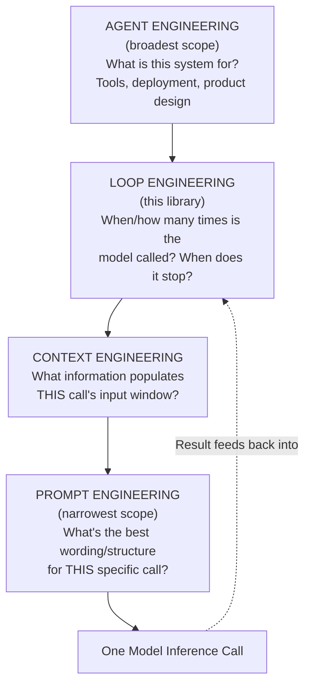

# 20 — Comparison with Prompt, Context, and Agent Engineering

> 📘 File 20 of 25 — Loop Engineering Knowledge Library
> Phase: Doing It Well
> Prerequisite: Files 01–19 (this file assumes complete understanding of Loop Engineering)

---

## 1. Introduction

### Topic Overview

Since file 01's first comparison table, this library has repeatedly gestured at Loop Engineering's relationship to Prompt Engineering, Context Engineering, and Agent Engineering without fully resolving it. This file delivers that resolution: a precise, rigorous account of what each discipline actually covers, where their boundaries genuinely overlap, and — critically — where people commonly conflate them incorrectly.

### Why This Topic Matters

These four terms get used loosely and interchangeably in industry discussion, which causes real confusion: a job posting for "prompt engineer" that actually needs loop engineering skills, a course on "agent engineering" that's really just prompt engineering with extra steps, a "context engineering" framework that's actually solving a loop architecture problem. Precision here has real practical value.

---

## 2. Definition

### What Is It? (Simple Explanation)

Think of building a restaurant. **Prompt Engineering** is writing a clear, well-worded order slip for the kitchen. **Context Engineering** is deciding what information goes on that order slip and what gets left off (allergies? table number? previous orders?). **Loop Engineering** is designing the kitchen's actual workflow — how dishes get made, checked, remade if wrong, and delivered. **Agent Engineering** is running the entire restaurant — the menu, the staff, the loop, the ordering system, all of it, end to end.

### Technical Definition

> **Prompt Engineering** is the practice of crafting the wording, structure, and examples within a single model input to elicit better output from a single inference call. **Context Engineering** is the broader practice of deciding what information — from state, memory, retrieved documents, or tool schemas — is assembled into a model's input window at all. **Loop Engineering** is the practice of designing the iterative control structure that determines *when* and *how* the model is called repeatedly, what happens between calls, and when the process stops. **Agent Engineering** is the superset discipline of building a complete autonomous system — encompassing prompt, context, and loop engineering alongside goal definition, tool selection, deployment, and user-facing product concerns.

---

## 3. Core Concepts

### Fundamental Ideas

- **These four disciplines form a nested hierarchy of scope**, not four unrelated fields: Prompt Engineering ⊂ Context Engineering ⊂ Loop Engineering ⊂ Agent Engineering (each is a *piece* of the one after it, not identical to it)
- **The most common real-world confusion is treating any one as sufficient for building a reliable agent** — a beautifully engineered prompt inside a poorly engineered loop still produces an unreliable system
- **Context Engineering and Loop Engineering are especially easy to conflate**, because context management (file 11) is *part of* loop engineering — but Context Engineering as a discipline is broader, also covering single-shot RAG systems that have no loop at all
- **Agent Engineering is the only one of the four that includes non-technical concerns** (product design, user trust, deployment) — the other three are purely technical disciplines

### Key Terminology

- **Prompt Engineering** — crafting wording/structure for a single model input
- **Context Engineering** — deciding what information populates a model's input window
- **Loop Engineering** — designing the iterative control structure calling the model repeatedly (this library's subject)
- **Agent Engineering** — the complete discipline of building an autonomous system, encompassing all three above

---

## 4. How It Works

### Step-by-Step Explanation: Tracing One Task Through All Four Disciplines

Consider building an agent that researches a topic and writes a summary. Here's exactly where each discipline's responsibility begins and ends:

1. **Agent Engineering** decides: *what should this system do, for whom, with what tools, deployed how?* (the overall product/system definition)
2. **Loop Engineering** decides: *how many times will this agent call the model, in what pattern (ReAct? Plan-and-Execute?), and when does it stop?* (files 01–19 of this library)
3. **Context Engineering** decides: *for each individual model call within that loop, what information — which state, which retrieved documents, which tool schemas — actually gets included?* (file 11 is loop engineering's application of this discipline)
4. **Prompt Engineering** decides: *for that specific assembled context, what's the best wording, structure, and instruction format to get a good response from the model?*

Each layer operates *within* the scope defined by the layer above it — Prompt Engineering happens inside a single call; that call happens inside a Context Engineering decision about what's in scope; that context assembly happens inside a Loop Engineering decision about when this call happens at all; that loop happens inside an Agent Engineering decision about what the whole system is for.

### Internal Workflow

```python
# This single function call demonstrates all four disciplines
# operating simultaneously, each at its own layer of responsibility

def demonstrate_all_four_layers(goal, loop_state, model_client):

    # ── LAYER 4: AGENT ENGINEERING (already decided, upstream) ──
    # "This system exists to research topics and write summaries.
    #  It has search tool access. It's deployed as a chat assistant."
    # This decision shaped everything below, but isn't re-made per-call.

    # ── LAYER 3: LOOP ENGINEERING (this library's subject) ───────
    # Decides: are we even making another model call right now?
    # (Termination check — file 07)
    if loop_state["iteration"] >= loop_state["max_iterations"]:
        return {"status": "loop_engineering_decision", "action": "stop_loop"}

    # Decides: what PATTERN governs this call? (file 10)
    # (Here: simple ReAct-style, one reasoning step per call)

    # ── LAYER 2: CONTEXT ENGINEERING (file 11 applies this) ──────
    # Decides: what SPECIFIC information goes into THIS call's context?
    relevant_context = {
        "goal": loop_state["goal"],                          # always included
        "recent_findings": loop_state["findings"][-3:],        # bounded window (file 11)
        "available_tools": ["search"],                          # tool schemas (file 14)
        # Deliberately EXCLUDED: full findings history, unrelated state —
        # this exclusion decision IS context engineering
    }

    # ── LAYER 1: PROMPT ENGINEERING (wording/structure of THIS call) ──
    prompt = f"""Goal: {relevant_context['goal']}

Recent findings: {relevant_context['recent_findings']}

You have access to: {relevant_context['available_tools']}

Think step by step, then decide your next action."""
    # The SPECIFIC wording, the "think step by step" instruction (file 13),
    # the structure/ordering of information — all Prompt Engineering decisions

    # The actual model call — this is where all four layers converge
    response = model_client.call(prompt)  # simplified for illustration

    return {"status": "call_made", "prompt_used": prompt, "response": response}
```

---

## 5. Architecture / Workflow

### Mermaid Flowchart



---

## 6. Components / Types

### Main Comparison

| Discipline | Scope | Operates On | Typical Practitioner Question |
|---|---|---|---|
| **Prompt Engineering** | Narrowest — one call | Wording, structure, examples within a single input | "How do I phrase this to get a better response?" |
| **Context Engineering** | One call's input assembly | What information (state/memory/tools) populates the window | "What should — and shouldn't — this call actually see?" |
| **Loop Engineering** | Multiple calls over time | Control flow, termination, state across iterations | "How many times do I call the model, in what pattern, and when do I stop?" |
| **Agent Engineering** | Broadest — the whole system | Everything above, plus tools, deployment, product | "What is this entire system, and how does it serve its purpose end to end?" |

### Categories of Overlap and Common Confusion

| Confusion | Why It Happens | The Actual Distinction |
|---|---|---|
| "Context Engineering IS Loop Engineering" | File 11's context management is a major loop engineering concern | Context Engineering also applies to single-shot RAG systems with NO loop at all — it's broader than just loops |
| "Prompt Engineering IS enough to build an agent" | A single great prompt can produce an impressive single response | An impressive single response doesn't survive multi-step tasks without loop engineering around it (file 02) |
| "Agent Engineering and Loop Engineering are the same thing" | Both concern themselves with autonomous behavior | Agent Engineering includes deployment, product design, and tool selection — genuinely non-technical concerns Loop Engineering doesn't cover |

---

## 7. Examples

### Beginner Example

The exact same underlying task, showing how each discipline would describe improving it differently:

```python
task = "The agent's research summaries are low quality"

# A PROMPT ENGINEER'S fix:
prompt_engineering_fix = """
Rewrite the summarization instruction to be more specific:
'Summarize in exactly 3 bullet points, each under 20 words,
focusing on quantitative findings.'
"""

# A CONTEXT ENGINEER'S fix:
context_engineering_fix = """
Check whether the model is actually SEEING the right findings —
maybe the summarization call isn't receiving the full research
results due to a context window/truncation issue (file 11).
"""

# A LOOP ENGINEER'S fix:
loop_engineering_fix = """
Check whether the loop is terminating (file 07) BEFORE research
is actually complete — maybe the max_iterations limit is too low,
cutting off research prematurely, so there's nothing good to summarize.
"""

# An AGENT ENGINEER'S fix (broadest):
agent_engineering_fix = """
Reconsider whether 'summarize' is even the right tool/capability
for this use case at all — maybe the PRODUCT should offer a
different interaction model (e.g., interactive Q&A instead of
a single summary), which is a decision above any of the other three.
"""
```

Notice all four "fixes" could be valid — they're not competing explanations, they're different *layers* at which the actual root cause might live.

### Intermediate Example

Demonstrating how the SAME improvement can require coordinated changes across multiple disciplines simultaneously — because in practice, they interact:

```python
class DisciplineCoordinatedFix:
    """A real production fix typically requires changes at MULTIPLE
    layers simultaneously — this class shows why."""

    def fix_low_quality_summaries(self):
        # LOOP ENGINEERING change: raise the iteration limit so
        # research actually has room to complete (file 02, 07)
        self.max_iterations = 12  # was 5

        # CONTEXT ENGINEERING change: ensure the summarization call
        # actually receives ALL findings, not a truncated window (file 11)
        self.context_strategy = "full_findings_with_summary_fallback"

        # PROMPT ENGINEERING change: make the summarization
        # instruction more specific (independently useful, but
        # insufficient alone if the loop was terminating early)
        self.summary_prompt_template = (
            "Summarize in exactly 3 bullet points, each under 20 words, "
            "focusing on quantitative findings from: {all_findings}"
        )

        return "All three layers updated — this is typical of real fixes"


fix = DisciplineCoordinatedFix()
print(fix.fix_low_quality_summaries())
```

This is the practical lesson: in production, the question is rarely "which ONE of these four disciplines is responsible?" — it's "which layers, in combination, need attention?"

### Advanced / Real-World Example

A diagnostic framework for correctly attributing an agent quality issue to the right discipline (or combination) before attempting a fix:

```python
class DisciplineDiagnostic:
    """A systematic diagnostic tool — before fixing anything,
    correctly identify WHICH layer(s) are actually responsible."""

    def diagnose(self, symptom: str, evidence: dict) -> list:
        diagnoses = []

        # Check for LOOP ENGINEERING issues first (broadest technical layer)
        if evidence.get("terminated_early") or evidence.get("no_max_iterations_set"):
            diagnoses.append({
                "layer": "Loop Engineering",
                "specific_issue": "Termination logic likely cutting the process short",
                "relevant_files": ["02", "07"]
            })

        if evidence.get("state_appears_lost_between_steps"):
            diagnoses.append({
                "layer": "Loop Engineering",
                "specific_issue": "State reconciliation may be overwriting instead of appending",
                "relevant_files": ["06", "11"]
            })

        # Check for CONTEXT ENGINEERING issues
        if evidence.get("model_seems_unaware_of_earlier_findings"):
            diagnoses.append({
                "layer": "Context Engineering",
                "specific_issue": "Relevant information may be excluded from the assembled context",
                "relevant_files": ["11"]
            })

        # Check for PROMPT ENGINEERING issues
        if evidence.get("model_has_all_info_but_output_format_is_wrong"):
            diagnoses.append({
                "layer": "Prompt Engineering",
                "specific_issue": "Instruction wording/format needs refinement",
                "relevant_files": ["13"]
            })

        # Check for AGENT ENGINEERING issues (broadest, non-technical layer)
        if evidence.get("users_dont_want_this_output_format_at_all"):
            diagnoses.append({
                "layer": "Agent Engineering",
                "specific_issue": "Product/interaction design may need reconsideration entirely",
                "relevant_files": ["N/A - outside this library's scope"]
            })

        return diagnoses if diagnoses else [{"layer": "Unknown", "specific_issue": "Needs further investigation"}]


diagnostic = DisciplineDiagnostic()
result = diagnostic.diagnose(
    symptom="Low quality summaries",
    evidence={
        "terminated_early": True,
        "state_appears_lost_between_steps": False,
        "model_seems_unaware_of_earlier_findings": True,
    }
)
for d in result:
    print(f"[{d['layer']}] {d['specific_issue']} (see files: {d['relevant_files']})")
```

---

## 8. Best Practices

### Do's

- ✅ Before attempting a fix, diagnose which layer(s) are actually responsible (Section 7's advanced example) rather than defaulting to your most familiar discipline
- ✅ Recognize that real production issues often require coordinated changes across multiple layers simultaneously, not a single-discipline fix
- ✅ When learning or hiring, be precise about which discipline a role or course actually covers — "prompt engineering" experience doesn't automatically transfer to loop engineering competency
- ✅ Treat Agent Engineering's product/deployment concerns as genuinely distinct from the three purely technical disciplines beneath it

### Recommended Techniques

- When debugging agent quality issues, work through the four-layer hierarchy from broadest (Agent Engineering: is this even the right product design?) to narrowest (Prompt Engineering: is this specific wording optimal?) — this order tends to catch expensive, systemic issues before over-investing in narrow polish
- Maintain a personal mental checklist matching Section 7's diagnostic categories, to quickly triage "which discipline does this issue actually belong to?" before diving into a fix

---

## 9. Common Mistakes

### Frequent Errors

| Mistake | Consequence |
|---|---|
| Treating all four disciplines as interchangeable/synonymous | Applies the wrong fix — e.g., prompt-tweaking a fundamentally broken termination condition |
| Assuming excellent prompt engineering alone produces a reliable agent | Ignores the multi-step reliability problems only loop engineering (file 02) addresses |
| Conflating Context Engineering with Loop Engineering entirely | Misses that Context Engineering also applies to loop-free systems (e.g., simple single-shot RAG) |
| Hiring/training for "agent engineering" while only covering prompt engineering content | Produces practitioners unequipped for the termination, state, and multi-agent concerns this library covers |

### How to Avoid Them

- Use this file's Section 4 (the four-layer trace) as a template whenever scoping a new project or a new hire's responsibilities — explicitly identify which layer(s) they'll actually own
- When an agent "feels unreliable" but you can't immediately pinpoint why, run through Section 7's diagnostic categories systematically rather than guessing based on whichever discipline you're most comfortable with

---

## 10. Advantages & Limitations

### Benefits of Precise Discipline Boundaries

- Enables accurate diagnosis of agent quality issues, rather than reflexively applying a familiar but wrong-layer fix
- Provides clearer role/responsibility definitions for teams building agent systems
- Prevents the common trap of believing one discipline (usually the most-hyped one, often "prompt engineering") is sufficient on its own
- Clarifies exactly what this library (Loop Engineering) does and doesn't cover, relative to adjacent, complementary skills

### Limitations

- Real-world problems often span multiple layers simultaneously (Section 7's intermediate example) — the clean hierarchy is a diagnostic aid, not a claim that issues are always neatly single-layer
- Industry terminology is genuinely inconsistent and evolving — this file's definitions represent a reasonable, internally consistent framework, but not universally standardized usage
- The boundaries, while conceptually clear, can blur in specific framework implementations that bundle multiple layers into one abstraction

---

## 11. Comparison

### Compare with Related Concepts

*(This entire file IS the comparison — see Sections 4 and 6 above for the complete treatment.)*

### Summary Table

| Question | Prompt Eng. | Context Eng. | Loop Eng. (this library) | Agent Eng. |
|---|---|---|---|---|
| Scope | One call | One call's input | Multiple calls over time | The whole system |
| Concerns termination? | No | No | **Yes** | Indirectly (via loop eng.) |
| Concerns state/memory? | No | **Yes** | **Yes** | Indirectly |
| Concerns tool selection? | No | Partially (schemas) | **Yes** (calling mechanics) | **Yes** (which tools to offer) |
| Concerns product/deployment? | No | No | No | **Yes** |
| Is a subset of the others? | Yes — of all three | Yes — of Loop & Agent Eng. | Yes — of Agent Eng. | No — the broadest |

---

## 12. Summary

### Key Takeaways

- The four disciplines form a **nested hierarchy of scope**: Prompt Engineering ⊂ Context Engineering ⊂ Loop Engineering ⊂ Agent Engineering
- **Prompt Engineering** concerns the wording of one call; **Context Engineering** concerns what information populates that call's input; **Loop Engineering** (this library) concerns when and how often calls happen and when they stop; **Agent Engineering** is the complete system, including non-technical product concerns
- The most common real-world mistake is **treating one discipline as sufficient** — a great prompt inside a poorly engineered loop, or a well-engineered loop serving the wrong product need, both fail despite excellence at one layer
- Correctly **diagnosing which layer(s)** are responsible for an agent quality issue — rather than defaulting to your most familiar discipline — is itself a critical skill this file aims to build

### Cheat Sheet

```
THE FOUR-LAYER HIERARCHY (narrowest to broadest):

PROMPT ENGINEERING   → wording/structure of ONE call
CONTEXT ENGINEERING  → what info populates ONE call's input
LOOP ENGINEERING     → when/how often calls happen, when they stop (THIS LIBRARY)
AGENT ENGINEERING    → the WHOLE system: loops + tools + deployment + product

DIAGNOSTIC QUESTION: "Which layer is ACTUALLY responsible for this issue?"
  → Work broad to narrow: Agent → Loop → Context → Prompt
  → Real fixes often span multiple layers simultaneously
```

---

## 13. Glossary

| Term | Definition |
|---|---|
| **Prompt Engineering** | Crafting the wording, structure, and examples within a single model input |
| **Context Engineering** | Deciding what information populates a model's input window |
| **Loop Engineering** | Designing the iterative control structure governing repeated model calls (this library's subject) |
| **Agent Engineering** | The complete discipline of building an autonomous system, encompassing all three above plus product/deployment concerns |
| **Nested Hierarchy** | A structure where each discipline is a subset of the scope of the one after it |

---

## 14. References & Further Reading

### Official Documentation

- Anthropic — [Building Effective AI Agents](https://www.anthropic.com/research/building-effective-agents) — discusses the relationship between prompting, context, and agentic workflows

### Further Reading

- Industry discussion on "context engineering" as an emerging discipline (various 2025-2026 practitioner blog posts) — reflects the genuine, ongoing terminology evolution this file's definitions attempt to clarify

### Where to Go Next in This Library

- Previous file: `19_Best_Practices_and_Common_Mistakes.md`
- Next file: `21_Real_World_Use_Cases.md` — begins Phase 5's shift toward production examples across industries
- Related: `04_Core_Concepts.md` — where this comparison was first previewed

---

*This is File 20 of 25 in the Loop Engineering Knowledge Library. See `README.md` for the full index and suggested reading paths.*

---

## 🎉 Batch 4 Complete: Patterns → Comparison (Files 16–20)

- **16** — five named, reusable design patterns: Supervisor, Pipeline, Debate, Voting/Consensus, Evaluator-Optimizer
- **17** — how to actually draw flowcharts and sequence diagrams using Mermaid, with correct notation conventions
- **18** — three complete, runnable, annotated example systems at increasing complexity
- **19** — a consolidated, lifecycle-organized production checklist pulling together every prior file's guidance
- **20** — a rigorous, precise comparison resolving Loop Engineering's relationship to Prompt, Context, and Agent Engineering

**Continuing immediately into the final Batch 5 (Use Cases → References):** Files 21–25 will cover real-world production use cases across industries, a full framework compatibility comparison (LangGraph, ADK, AutoGen, CrewAI), the future direction of the field, a direct FAQ, and a complete references/further-reading index — completing the 25-file Loop Engineering Knowledge Library.
