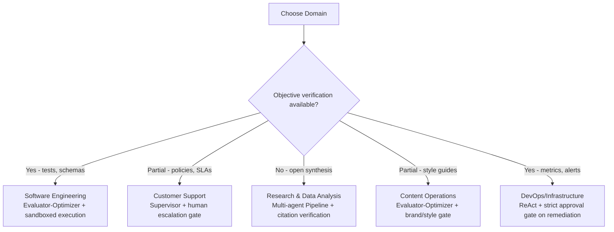

# 21 — Real-World Use Cases

> 📘 File 21 of 25 — Loop Engineering Knowledge Library
> Phase: Doing It Well
> Prerequisite: Files 01–20 (this file applies the full library to real domains)

---

## 1. Introduction

### Topic Overview

Every prior file built understanding through focused, often simplified examples. This file grounds that understanding in **real production domains**: software engineering, customer support, research and data analysis, content operations, and DevOps/infrastructure — showing which loop patterns, safeguards, and design decisions actually matter in each, and why.

### Why This Topic Matters

Abstract knowledge of loop patterns only becomes useful once you can recognize which pattern fits a genuine business problem. This file is the bridge between "I understand ReAct and Reflexion" and "I know that a code-review agent needs Evaluator-Optimizer with test-based feedback, while a customer support triage system needs a Supervisor pattern with human-in-the-loop escalation."

---

## 2. Definition

### What Is It? (Simple Explanation)

If files 01–20 taught you the individual tools in a toolbox, this file is a walk through five different workshops — a carpenter's, a plumber's, an electrician's — showing which specific tools from that same toolbox each trade actually reaches for most, and why their jobs demand different combinations.

### Technical Definition

> This file examines five representative production domains — **Software Engineering** (code generation and review), **Customer Support** (triage and resolution), **Research & Data Analysis** (multi-source synthesis), **Content Operations** (generation with quality gating), and **DevOps/Infrastructure** (monitoring and remediation) — analyzing for each the dominant loop pattern (file 10, 16), the primary reliability concerns (files 02, 19), and the specific safeguards (files 07, 12, 14) that distinguish a production-grade implementation from a fragile prototype.

---

## 3. Core Concepts

### Fundamental Ideas

- **Different domains have structurally different risk profiles**, which should directly drive loop design choices — a code-review agent's mistakes are usually cheaply reversible; a customer-facing support agent's mistakes affect real people in real time
- **The presence of an objective verification signal (or lack thereof) is often the single biggest domain-differentiating factor** — code has tests; open-ended writing usually doesn't
- **Human-in-the-loop integration (file 07's suspension pattern) shows up differently across domains** — sometimes as a hard gate before any action, sometimes as an escalation path only for edge cases

### Key Terminology

*(This file applies terminology from across the library — see file 05 for definitions of any unfamiliar term.)*

---

## 4. How It Works

*(For this domain-survey file, Section 4 and Section 7 are combined below — the "how it works" for each domain IS its worked case study.)*

---

## 5. Architecture / Workflow

### Mermaid Flowchart



---

## 6. Components / Types

### Domain Comparison at a Glance

| Domain | Dominant Pattern | Primary Risk | Key Safeguard |
|---|---|---|---|
| **Software Engineering** | Evaluator-Optimizer (file 16) | Introducing subtle bugs | Automated test-based feedback (file 12) |
| **Customer Support** | Supervisor + escalation | Incorrect resolution affecting a real customer | Human-in-the-loop gate for high-stakes actions (file 07) |
| **Research & Data Analysis** | Pipeline / Multi-agent | Hallucinated or unverifiable claims | Citation/source verification, multi-source cross-check |
| **Content Operations** | Evaluator-Optimizer | Off-brand or low-quality output at scale | Style/brand-guideline-based feedback loop |
| **DevOps/Infrastructure** | ReAct with strict gating | Destructive remediation action | Mandatory approval before any irreversible infrastructure change |

---

## 7. Examples

### Domain 1: Software Engineering — Automated Code Review Agent

**Structural fit:** Code has an objective, automatable verification signal (tests, linters, type checkers) — making it the single best-suited domain for the Evaluator-Optimizer pattern (file 16) with high-reliability, automated feedback (file 12).

```python
class CodeReviewAgent:
    """Domain-specific application of file 16's Evaluator-Optimizer,
    file 14's sandboxed execution, and file 12's high-reliability
    automated feedback."""

    def __init__(self, test_runner, linter_fn, max_rounds=3):
        self.test_runner = test_runner  # file 14's sandboxed execution
        self.linter_fn = linter_fn
        self.max_rounds = max_rounds

    def review_and_fix(self, code, test_suite):
        feedback_history = []

        for round_num in range(self.max_rounds):
            # In production: an LLM Generator call, informed by feedback (file 12)
            current_code = self._generate_or_fix(code, feedback_history)

            test_result = self.test_runner.run_with_tests(current_code, test_suite)
            lint_issues = self.linter_fn(current_code)

            if test_result["passed"] and not lint_issues:
                return {"status": "approved", "code": current_code, "rounds": round_num + 1}

            specific_feedback = []
            if not test_result["passed"]:
                specific_feedback.append(f"Test failure: {test_result['stderr']}")
            if lint_issues:
                specific_feedback.append(f"Lint issues: {lint_issues}")

            feedback_history.append(specific_feedback)
            code = current_code

        return {"status": "max_rounds_reached", "code": code, "feedback_history": feedback_history}

    def _generate_or_fix(self, code, feedback_history):
        # Placeholder for a real LLM call informed by file 12's accumulated feedback
        return code
```

**Why this pattern specifically:** the domain's defining trait — automated, objective pass/fail signals — makes self-report-based termination (file 02's warning) unnecessary here; tests provide exactly the independent verification file 09's `VerifyingEvaluator` calls for.

---

### Domain 2: Customer Support — Triage and Resolution Agent

**Structural fit:** Support has *partial* verification (policy compliance can be checked, but "was the customer actually satisfied?" often can't be automated) — making human-in-the-loop escalation (file 07) essential for anything beyond routine, low-stakes resolutions.

```python
class SupportTriageAgent:
    """Domain-specific application of file 15/16's Supervisor pattern
    and file 07's suspension/human-approval mechanics."""

    RISK_TIERS = {
        "refund_under_25": "auto_approve",
        "refund_over_25": "requires_approval",
        "account_deletion": "requires_approval",
        "general_question": "auto_approve",
    }

    def handle_ticket(self, ticket):
        classification = self._classify(ticket)  # file 13's reasoning/decomposition
        risk_tier = self.RISK_TIERS.get(classification, "requires_approval")  # fail-safe default

        if risk_tier == "auto_approve":
            resolution = self._generate_resolution(ticket, classification)
            return {"status": "resolved", "resolution": resolution, "auto_approved": True}
        else:
            # file 07's suspension pattern, applied to a real business risk boundary
            return {
                "status": "pending_human_approval",
                "classification": classification,
                "proposed_resolution": self._generate_resolution(ticket, classification),
            }

    def _classify(self, ticket):
        # Placeholder for a real LLM classification call
        return "general_question"

    def _generate_resolution(self, ticket, classification):
        return f"Proposed resolution for a '{classification}' ticket"
```

**Why this pattern specifically:** the fail-safe default (unrecognized categories require approval, not auto-approval) directly reflects file 02's lesson about not trusting an unverified process with irreversible consequences — here, "irreversible" means real customer/business impact, not just a technical rollback.

---

### Domain 3: Research & Data Analysis — Multi-Source Synthesis Agent

**Structural fit:** Open-ended research has essentially no automated verification signal for "is this synthesis correct" — making citation tracking and multi-source cross-checking the domain's substitute for the test-based feedback that Software Engineering enjoys.

```python
class ResearchSynthesisAgent:
    """Domain-specific application of file 15's multi-agent Pipeline,
    substituting citation verification for automated test feedback."""

    def __init__(self, num_required_sources=3):
        self.num_required_sources = num_required_sources

    def research_and_synthesize(self, topic):
        # STAGE 1: gather (file 14's tool calling, applied to search)
        sources = self._gather_sources(topic)

        if len(sources) < self.num_required_sources:
            return {"status": "insufficient_sources", "sources_found": len(sources)}

        # STAGE 2: cross-check claims across sources (the domain's substitute
        # for automated testing — agreement across independent sources)
        verified_claims = self._cross_check(sources)

        # STAGE 3: synthesize, with EVERY claim traceable to a source
        synthesis = self._synthesize_with_citations(verified_claims)

        return {"status": "success", "synthesis": synthesis, "source_count": len(sources)}

    def _gather_sources(self, topic):
        return [f"Source {i+1} on {topic}" for i in range(4)]  # placeholder

    def _cross_check(self, sources):
        # A claim appearing in MULTIPLE independent sources is treated
        # as more reliable than a claim from just one — voting pattern (file 16)
        # applied to factual claims rather than model attempts
        return [{"claim": f"Finding from {len(sources)} sources", "corroborated_by": len(sources)}]

    def _synthesize_with_citations(self, verified_claims):
        return " ".join([f"{c['claim']} [{c['corroborated_by']} sources]" for c in verified_claims])
```

**Why this pattern specifically:** without an automated correctness check, this domain substitutes the Voting/Consensus pattern's logic (file 16) at the *claim* level — a fact corroborated across independent sources functions like multiple independent agent attempts agreeing.

---

### Domain 4: Content Operations — Brand-Compliant Content Generation at Scale

**Structural fit:** Content generation has a *style-based* verification signal (brand guidelines, tone requirements) that's checkable but not as crisply objective as code tests — a middle ground driving the Evaluator-Optimizer pattern with a rubric-based, rather than test-based, critic.

```python
class ContentComplianceAgent:
    """Domain-specific application of file 16's Evaluator-Optimizer,
    using a rubric-based critic instead of test-based feedback (file 12)."""

    def __init__(self, brand_rubric, max_rounds=3):
        self.brand_rubric = brand_rubric  # e.g., {"max_sentence_length": 25, "banned_words": [...]}
        self.max_rounds = max_rounds

    def generate_compliant_content(self, brief):
        feedback_history = []

        for round_num in range(self.max_rounds):
            draft = self._generate_draft(brief, feedback_history)
            compliance_check = self._check_rubric(draft)

            if compliance_check["compliant"]:
                return {"status": "approved", "content": draft, "rounds": round_num + 1}

            feedback_history.append(compliance_check["violations"])

        return {"status": "max_rounds_reached", "content": draft, "feedback_history": feedback_history}

    def _generate_draft(self, brief, feedback_history):
        return f"Draft for: {brief}"  # placeholder for real LLM call

    def _check_rubric(self, draft):
        violations = []
        for banned_word in self.brand_rubric.get("banned_words", []):
            if banned_word in draft.lower():
                violations.append(f"Contains banned term: {banned_word}")

        max_len = self.brand_rubric.get("max_sentence_length", 100)
        if any(len(s.split()) > max_len for s in draft.split(".")):
            violations.append(f"Sentence exceeds {max_len}-word limit")

        return {"compliant": len(violations) == 0, "violations": violations}
```

**Why this pattern specifically:** the rubric provides *enough* objectivity to function as a genuine Evaluator (file 09), even though it's checking style rather than correctness — this is the key domain lesson: verification doesn't need to be as crisp as unit tests to be useful, it just needs to be *specific and checkable* (file 12's core requirement).

---

### Domain 5: DevOps/Infrastructure — Monitoring and Remediation Agent

**Structural fit:** Infrastructure has strong objective signals (metrics, alerts, logs) for *detecting* problems, but remediation actions are often irreversible or high-blast-radius — making this domain the clearest real-world case for file 14's risk-tiered tool gating.

```python
class InfrastructureRemediationAgent:
    """Domain-specific application of file 14's risk-tiered tool
    registry, applied to real infrastructure actions."""

    def __init__(self, tool_registry, max_iterations=6):
        self.tool_registry = tool_registry  # a RiskAwareToolRegistry, file 14
        self.max_iterations = max_iterations

    def diagnose_and_remediate(self, alert):
        state = {"alert": alert, "diagnostics": [], "iteration": 0}

        while state["iteration"] < self.max_iterations:
            decision = self._decide_next_step(state)  # file 13's reasoning

            if decision["action"] == "diagnose":
                # LOW RISK: read-only diagnostic tools, auto-approved
                result = self.tool_registry.dispatch(decision["tool_call"], approved=True)
                state["diagnostics"].append(result)

            elif decision["action"] == "remediate":
                # HIGH RISK: any actual infrastructure CHANGE requires approval
                result = self.tool_registry.dispatch(decision["tool_call"], approved=False)
                if result.get("requires_approval"):
                    return {
                        "status": "pending_human_approval",
                        "proposed_action": decision["tool_call"],
                        "diagnostics_so_far": state["diagnostics"]
                    }

            elif decision["action"] == "conclude":
                return {"status": "resolved", "diagnostics": state["diagnostics"]}

            state["iteration"] += 1

        return {"status": "max_iterations_reached", "diagnostics": state["diagnostics"]}

    def _decide_next_step(self, state):
        # Placeholder for real LLM reasoning over accumulated diagnostics
        if len(state["diagnostics"]) >= 2:
            return {"action": "remediate", "tool_call": {"tool_name": "restart_service", "arguments": {}}}
        return {"action": "diagnose", "tool_call": {"tool_name": "check_logs", "arguments": {}}}
```

**Why this pattern specifically:** this domain most clearly demonstrates file 14's risk-tiering in a real business context — diagnostic reads are cheap and reversible (auto-approved), while any actual remediation action (restarting a service, scaling infrastructure, rolling back a deployment) is irreversible enough at scale to warrant the same human-approval gate file 07 introduced abstractly.

---

## 8. Best Practices

### Do's

- ✅ Before choosing a pattern for a new domain, explicitly identify: what's the verification signal (if any)? What's the cost of an incorrect action? — these two questions, more than any other factor, should drive the pattern choice
- ✅ Default to the strictest applicable risk tier when a domain's verification signal is weak or absent (as in the Customer Support and Content Operations examples' fail-safe defaults)
- ✅ Recognize that "verification" doesn't require test-suite-level objectivity — a checkable rubric (Content Operations) or multi-source corroboration (Research) can be genuinely useful evaluators even without perfect objectivity

### Recommended Techniques

- When entering a new domain, map it against this file's five case studies first — most real domains resemble one of these five more than they resemble a domain requiring an entirely novel pattern
- Treat the "objective verification available?" question (Section 5's flowchart) as the very first design question for any new agent project, before selecting a specific loop pattern

---

## 9. Common Mistakes

### Frequent Errors

| Mistake | Domain Where It's Most Costly |
|---|---|
| Auto-approving actions with no verification signal | Customer Support, DevOps — real-world, potentially irreversible harm |
| Assuming code-domain patterns (Evaluator-Optimizer with tests) transfer directly to domains with no automatable verification | Research, Content — produces false confidence in an unverified process |
| Treating all infrastructure actions as equally low-risk | DevOps — conflates safe diagnostics with genuinely destructive remediation |
| No fail-safe default for unrecognized categories | Customer Support — an unclassified ticket falling through to auto-approval is a common, costly bug |

### How to Avoid Them

- Explicitly enumerate a domain's verification signal (or lack thereof) before implementation, using this file's five case studies as reference points for what "partial," "strong," or "absent" verification actually looks like in practice
- Always design an explicit fail-safe default (deny/escalate, never auto-approve) for any classification-driven risk tier, as shown in the Customer Support example

---

## 10. Advantages & Limitations

### Benefits of Domain-Grounded Understanding

- Converts abstract pattern knowledge (files 10, 16) into immediately applicable domain judgment
- The "verification signal strength" lens provides a fast, reliable heuristic for pattern selection in genuinely novel domains not covered here
- Demonstrates that file 14's risk-tiering isn't an abstract safety concern — it's directly load-bearing in real domains like DevOps and Customer Support

### Limitations

- Five domains can't cover every real-world use case — genuinely novel domains will require applying this file's underlying reasoning (verification signal, risk cost) rather than direct pattern-matching
- Real production systems in each domain typically combine additional domain-specific business logic beyond what these simplified examples show
- The line between "partial" and "strong" verification is itself often a judgment call requiring domain expertise this library can't fully substitute for

---

## 11. Comparison

### Compare the Five Domains Directly

| Domain | Verification Strength | Reversibility of Actions | Human-in-the-Loop Need |
|---|---|---|---|
| Software Engineering | Strong (tests) | High (code changes are easily reverted) | Low — mostly automatable |
| Customer Support | Partial (policy checks) | Low (real customer/business impact) | High — for anything beyond routine |
| Research & Data Analysis | Weak (no automated check) | High (a wrong summary is easily corrected) | Moderate — for high-stakes research |
| Content Operations | Partial (rubric-checkable) | High (content can be revised before publishing) | Low to Moderate |
| DevOps/Infrastructure | Strong for detection, weak for remediation correctness | Low (infrastructure changes can be destructive) | High — for any actual remediation |

### Summary Table

| If your domain has... | Lean toward... |
|---|---|
| Strong automated verification + reversible actions | Evaluator-Optimizer, minimal human gating |
| Weak/no verification + irreversible real-world impact | Supervisor + mandatory human approval |
| No automated check but multiple independent sources | Multi-source cross-checking (Voting pattern applied to claims) |
| Checkable style/rubric, but not crisp correctness | Evaluator-Optimizer with rubric-based (not test-based) feedback |

---

## 12. Summary

### Key Takeaways

- **Verification signal strength** and **action reversibility** are the two most important factors driving loop pattern choice across real domains — more important than industry vertical itself
- **Software Engineering** benefits most from Evaluator-Optimizer with test-based feedback, thanks to strong, automatable verification and cheap reversibility
- **Customer Support** and **DevOps/Infrastructure** both require strict human-in-the-loop gating for high-stakes actions, despite being otherwise very different domains — because both involve weak verification combined with real-world, hard-to-reverse consequences
- **Research** and **Content Operations** demonstrate that "verification" doesn't require test-suite objectivity — multi-source corroboration and rubric-checking are legitimate, useful substitutes

### Cheat Sheet

```
DOMAIN PATTERN SELECTION — THE TWO KEY QUESTIONS:

1. Is there an objective (or at least checkable) verification signal?
2. How costly/reversible is an incorrect action?

STRONG VERIFICATION + REVERSIBLE     → Evaluator-Optimizer, minimal gating (Software Eng.)
WEAK VERIFICATION + IRREVERSIBLE     → Supervisor + mandatory human approval (Support, DevOps)
NO VERIFICATION + MULTIPLE SOURCES   → Cross-check/corroboration (Research)
RUBRIC-CHECKABLE + REVERSIBLE        → Evaluator-Optimizer w/ rubric feedback (Content)
```

---

## 13. Glossary

*(This file applies terminology from across the library — see file 05 for the complete glossary.)*

---

## 14. References & Further Reading

### Official Documentation

- Anthropic — [Building Effective AI Agents](https://www.anthropic.com/research/building-effective-agents) — includes real-world domain guidance directly relevant to this file's case studies

### Where to Go Next in This Library

- Previous file: `20_Comparison_with_Prompt_Context_and_Agent_Engineering.md`
- Next file: `22_Frameworks_and_LLM_Compatibility.md` — which frameworks best support building the domain-specific systems shown in this file
- Related: `16_Loop_Design_Patterns.md` — the pattern catalog this file's case studies apply

---

*This is File 21 of 25 in the Loop Engineering Knowledge Library. See `README.md` for the full index and suggested reading paths.*
