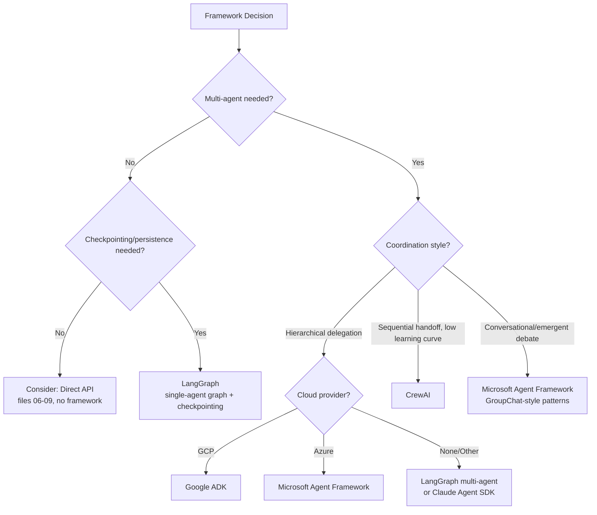

# 22 — Frameworks and LLM Compatibility

> 📘 File 22 of 25 — Loop Engineering Knowledge Library
> Phase: Doing It Well
> Prerequisite: `03_History_and_Evolution.md`, `15_AI_Agents_and_Multi_Agent_Loops.md`, `16_Loop_Design_Patterns.md`

---

## 1. Introduction

### Topic Overview

This file has been referenced by nearly every prior chapter — it's where the abstract concepts (loop patterns, components, multi-agent coordination) meet the real, current landscape of production frameworks. This file surveys the major options as of mid-2026: LangGraph, Google ADK, CrewAI, Microsoft Agent Framework (successor to AutoGen), and the "no framework at all" direct-API approach — mapping each back to the concepts you've already learned.

### Why This Topic Matters

Framework choice is one of the most consequential early decisions in any agent project, and the landscape shifts fast — even within this library's writing, Microsoft's AutoGen moved to maintenance mode in favor of a unified successor. Understanding the *underlying concepts* (which don't change) lets you evaluate *any* framework, including ones that don't exist yet, rather than memorizing a snapshot that will age.

---

## 2. Definition

### What Is It? (Simple Explanation)

If files 01–21 taught you to understand engines, transmissions, and chassis design, this file is a tour of the actual car dealership — showing which manufacturers build which kind of car, who they're really built for, and reminding you that the underlying engineering (which you now understand deeply) is what actually matters, regardless of badge.

### Technical Definition

> This file surveys the current landscape of production agent-building frameworks — categorizing each by its **orchestration model** (how it structurally represents loop patterns), **state persistence approach** (file 11's concepts as implemented), **multi-agent coordination style** (file 15/16's patterns as implemented), and **ecosystem/deployment fit** — while emphasizing that framework selection should be driven by which concepts from this library a project actually needs, not by popularity or novelty alone.

---

## 3. Core Concepts

### Fundamental Ideas

- **Every framework is an implementation of concepts you already know** — a framework's "node," "workflow," or "crew" is always some specific arrangement of the six pillars (file 04) and four components (file 09)
- **The framework landscape consolidates quickly** — Microsoft's AutoGen and Semantic Kernel merged into a single Microsoft Agent Framework (GA April 2026); tracking these shifts matters more than memorizing any single snapshot
- **No framework does everything well** — each has a genuine orchestration-style specialty (supervisor-style, sequential handoff, conversational group-chat, graph-based), directly traceable to file 16's named patterns
- **"No framework, direct API calls"** remains a completely valid, often underrated choice for simpler loops — file 22 exists to help you decide when a framework earns its complexity, not to imply one is always necessary

### Key Terminology

- **Orchestration model** — the structural paradigm a framework uses to represent agent coordination (graph, hierarchy, conversation, role-based crew)
- **Checkpointing** — a framework's built-in support for file 07's suspend/resume lifecycle stage
- **Model-agnostic** — a framework that works with multiple LLM providers, not just one
- **A2A (Agent-to-Agent) protocol** — an emerging open standard allowing agents built on different frameworks to discover and communicate with each other
- **MCP (Model Context Protocol)** — the standardized tool/context exposure protocol introduced in file 14

---

## 4. How It Works

### Step-by-Step Explanation: Choosing a Framework Using This Library's Concepts

1. **Identify your dominant loop pattern need** (file 10, 16) — does your task need ReAct-style adaptability, Plan-and-Execute structure, or genuine multi-agent debate/consensus?
2. **Identify your state persistence needs** (file 11) — does the loop need to survive process restarts? Multi-day workflows? Or is simple in-memory state sufficient?
3. **Identify your multi-agent coordination style, if any** (file 15) — hierarchical delegation (Supervisor pattern), sequential pipeline, or conversational group-chat (Debate-adjacent)?
4. **Identify your deployment/ecosystem constraints** — is your infrastructure already committed to a specific cloud provider? Does your team have existing framework expertise?
5. **Match these requirements against the framework landscape** (Section 6) rather than choosing based on GitHub stars or hype alone

### Internal Workflow

```python
# A decision-support function encoding this file's framework-selection logic —
# translating YOUR requirements (informed by files 01-21) into a recommendation

def recommend_framework(requirements: dict) -> str:
    """
    requirements keys (all optional, default False/None):
    - needs_checkpointing: bool       (file 07, 11)
    - needs_multi_agent: bool          (file 15)
    - coordination_style: str          ("hierarchical" | "sequential" | "conversational" | None)
    - cloud_provider: str              ("gcp" | "azure" | "aws" | None)
    - team_wants_low_learning_curve: bool
    - needs_cross_framework_agent_communication: bool  (A2A protocol)
    """

    if requirements.get("needs_cross_framework_agent_communication"):
        return "Prioritize a framework with A2A protocol support (Google ADK, Microsoft Agent Framework)"

    if requirements.get("cloud_provider") == "gcp":
        return "Google ADK — tightest GCP/Vertex AI integration, hierarchical orchestration model"

    if requirements.get("cloud_provider") == "azure":
        return "Microsoft Agent Framework — tightest Azure integration, unifies former AutoGen + Semantic Kernel"

    if requirements.get("coordination_style") == "conversational":
        return "Microsoft Agent Framework (GroupChat-style patterns) — best for emergent, debate-like coordination"

    if requirements.get("team_wants_low_learning_curve") and requirements.get("needs_multi_agent"):
        return "CrewAI — role-based abstraction, fastest path to a working multi-agent prototype"

    if requirements.get("needs_checkpointing") and not requirements.get("cloud_provider"):
        return "LangGraph — most mature checkpointing, persistence, and observability story"

    if not requirements.get("needs_multi_agent") and not requirements.get("needs_checkpointing"):
        return "Consider a direct API implementation (files 06-09) — a framework may be unnecessary overhead"

    return "LangGraph — the most broadly capable, model-agnostic default for general-purpose needs"


# Example usage
print(recommend_framework({"needs_multi_agent": True, "coordination_style": "hierarchical", "cloud_provider": "gcp"}))
print(recommend_framework({"needs_multi_agent": False, "needs_checkpointing": False}))
```

---

## 5. Architecture / Workflow

### Mermaid Flowchart



---

## 6. Components / Types

### Framework Landscape Comparison (as of mid-2026)

| Framework | Orchestration Model | Multi-Agent Pattern (file 16) | Checkpointing | Best Fit |
|---|---|---|---|---|
| **LangGraph** | Directed graph, explicit nodes/edges | Flexible — supports Supervisor, Pipeline | Most mature — persistent, time-travel debugging | Model-agnostic, general-purpose, complex stateful workflows |
| **Google ADK** | Hierarchical agent tree | Supervisor (root agent → sub-agents) | Session/State services, pluggable backends | GCP/Vertex AI deployments, hierarchical delegation |
| **CrewAI** | Role-based crews | Sequential/Pipeline, role-based | Growing, historically limited vs. LangGraph | Fast prototyping, intuitive role-based mental model |
| **Microsoft Agent Framework** (successor to AutoGen + Semantic Kernel) | Graph-based workflows + conversational GroupChat | Conversational/Debate, Sequential, Concurrent | Session-based state, enterprise middleware | Azure/enterprise stacks, emergent multi-agent debate |
| **Direct API (no framework)** | Whatever you build (files 06-09) | Whatever you build (file 15) | Whatever you build (file 11) | Simple loops, maximum control, learning fundamentals |

> ⚠️ **A note on currency:** Microsoft's AutoGen and Semantic Kernel were merged into a single Microsoft Agent Framework, which reached 1.0 general availability in April 2026; AutoGen itself is now in maintenance mode (bug/security fixes only). This is exactly the kind of fast-moving detail this file's Section 4 decision framework is designed to outlast — the underlying concepts (conversational vs. hierarchical vs. graph-based orchestration) remain stable even as specific product names and statuses change. Always verify current framework status before committing, since this landscape continues to evolve.

### Types of Orchestration Models (Mapped to File 16's Patterns)

| Orchestration Model | Maps to File 16 Pattern | Frameworks Using This Model |
|---|---|---|
| **Directed graph** | Flexible — can express Supervisor, Pipeline, or Evaluator-Optimizer | LangGraph |
| **Hierarchical tree** | Supervisor pattern | Google ADK |
| **Role-based crew** | Pipeline / Sequential | CrewAI |
| **Conversational group-chat** | Debate pattern (closest real-world implementation) | Microsoft Agent Framework (via former AutoGen patterns) |

### Categories of LLM Compatibility

- **Fully model-agnostic** — works with any provider's API (LangGraph, CrewAI, Microsoft Agent Framework all support Anthropic, OpenAI, and others)
- **Provider-optimized but not exclusive** — tuned defaults for one provider's models while technically supporting others (Google ADK is Gemini-optimized but supports other models via LiteLLM)
- **Provider-exclusive** — built specifically for one provider's models only

---

## 7. Examples

### Beginner Example

A conceptual mapping showing how the SAME simple ReAct loop (file 10) would be expressed across a direct-API approach versus a graph-based framework — demonstrating that the underlying concept doesn't change, only the syntax:

```python
# ── DIRECT API APPROACH (files 06-09's concepts, no framework) ──
def direct_api_react_loop(goal, tools, max_iterations=5):
    state = {"goal": goal, "history": []}
    for i in range(max_iterations):
        decision = reason(state)  # file 13's Controller logic
        if decision["type"] == "final_answer":
            return decision["answer"]
        result = execute_tool(decision, tools)  # file 14's Executor logic
        state["history"].append(result)  # file 11's state reconciliation
    return "Max iterations reached"


# ── CONCEPTUAL GRAPH-FRAMEWORK APPROACH (illustrating LangGraph's shape) ──
# (Pseudocode illustrating the PATTERN, not exact current API syntax —
#  always check a framework's official docs for exact, current syntax)
"""
graph = StateGraph(AgentState)               # file 04's State pillar, formalized
graph.add_node("reason", reasoning_node)       # file 09's Controller, as a node
graph.add_node("act", tool_execution_node)      # file 09's Executor, as a node
graph.add_conditional_edges(                     # file 09's Evaluator logic,
    "reason", route_decision,                      # expressed as edge routing
    {"continue": "act", "done": END}
)
graph.add_edge("act", "reason")                    # the loop itself: act -> reason -> ...
compiled = graph.compile(checkpointer=...)           # file 11's persistence, built in
"""
```

Both express the *exact same underlying loop* (files 01, 06) — the graph framework simply formalizes the Controller/Executor/Evaluator split (file 09) into first-class, named constructs with built-in persistence.

### Intermediate Example

A conceptual comparison of how the SAME multi-agent Supervisor pattern (file 16) would be expressed in Google ADK's hierarchical model versus CrewAI's role-based model:

```python
# ── CONCEPTUAL: Google ADK's hierarchical tree shape ──
"""
root_agent = LlmAgent(
    name="orchestrator",
    sub_agents=[researcher_agent, writer_agent, editor_agent],  # file 15's sub-agents
    # ADK's model: hierarchy declared UPFRONT, root delegates DOWNWARD
)
"""

# ── CONCEPTUAL: CrewAI's role-based crew shape ──
"""
researcher = Agent(role="Researcher", goal="Find sources", backstory="...")
writer = Agent(role="Writer", goal="Draft the report", backstory="...")
editor = Agent(role="Editor", goal="Polish and verify", backstory="...")

crew = Crew(
    agents=[researcher, writer, editor],
    tasks=[research_task, write_task, edit_task],  # file 16's Pipeline pattern,
    process=Process.sequential                        # explicit sequential process
)
"""
```

Both implement file 15's Supervisor/orchestrator concept and file 16's coordination patterns — ADK expresses it as a declared tree structure (fitting a Supervisor pattern), CrewAI expresses it as roles plus an explicit process type (fitting a Pipeline pattern when sequential) — different syntax, same underlying concepts from this library.

### Advanced / Real-World Example

A framework-selection worksheet applying Section 4's decision function to three realistic project briefs — demonstrating the decision process end to end:

```python
project_briefs = [
    {
        "name": "Internal GCP-hosted research assistant for a data science team",
        "requirements": {
            "needs_multi_agent": True,
            "coordination_style": "hierarchical",
            "cloud_provider": "gcp",
            "needs_checkpointing": True,
        }
    },
    {
        "name": "Quick prototype: a 3-agent content pipeline for a startup, no cloud lock-in",
        "requirements": {
            "needs_multi_agent": True,
            "coordination_style": "sequential",
            "team_wants_low_learning_curve": True,
        }
    },
    {
        "name": "A single-purpose Slack bot that answers FAQs using one tool",
        "requirements": {
            "needs_multi_agent": False,
            "needs_checkpointing": False,
        }
    },
]

for brief in project_briefs:
    recommendation = recommend_framework(brief["requirements"])
    print(f"{brief['name']}\n  -> {recommendation}\n")
```

This is precisely the reasoning process this file exists to teach: translate genuine project requirements (informed by files 01–21's concepts) into a framework choice, rather than picking based on whichever framework is most discussed at the moment.

---

## 8. Best Practices

### Do's

- ✅ Choose a framework based on your genuine requirements (state persistence, multi-agent coordination style, deployment target) — not based on GitHub star count or recent hype alone
- ✅ Verify a framework's current status before committing — this landscape consolidates and shifts genuinely fast, as the AutoGen-to-Microsoft-Agent-Framework transition demonstrates
- ✅ Seriously consider the direct-API, no-framework approach for genuinely simple loops — files 06–09 give you everything needed to build one, and it avoids taking on framework complexity and version-upgrade risk you don't need
- ✅ Map any framework's specific terminology back to this library's concepts (file 05's Category 7 synonym table) before assuming a framework works fundamentally differently than what you already understand

### Recommended Techniques

- When evaluating a new or unfamiliar framework, explicitly identify which file 16 pattern(s) it's optimized for — this tells you more about genuine fit than a feature checklist
- Budget time for framework version/API changes as an ongoing maintenance cost, not a one-time setup cost — major frameworks have had breaking rewrites before (e.g., AutoGen's v0.2 to v0.4 rewrite) and will again

---

## 9. Common Mistakes

### Frequent Errors

| Mistake | Consequence |
|---|---|
| Choosing a framework based on popularity alone | Mismatched orchestration model for the actual task's coordination needs |
| Assuming "open-source" means "operationally neutral" | Deployment defaults, observability stack, and cloud integration still create real platform lock-in gravity |
| Adopting a heavy multi-agent framework for a genuinely simple single-loop task | Unnecessary complexity and learning curve overhead — files 06-09's direct approach would have sufficed |
| Not tracking framework consolidation/status changes | Building on a framework that's quietly moved to maintenance-only mode (as AutoGen did) without a migration plan |
| Treating framework-specific terminology as fundamentally novel concepts | Missed opportunity to apply already-understood concepts (file 05) to accelerate framework learning |

### How to Avoid Them

- Always run through Section 4's decision framework explicitly before committing to a framework, rather than defaulting to whichever one a tutorial happened to use
- Periodically re-verify your chosen framework's current status (active development vs. maintenance mode, breaking changes on the roadmap) — this is a genuine, ongoing engineering responsibility in a fast-moving field

---

## 10. Advantages & Limitations

### Benefits of Framework-Aware Decision Making

- Prevents both over-engineering (adopting heavy multi-agent frameworks for simple tasks) and under-engineering (hand-rolling checkpointing/persistence a mature framework already solves well)
- This library's concept-first approach means framework knowledge transfers — learning a new framework becomes "which of these known concepts does this implement, and how?" rather than starting from zero
- Explicit requirement-mapping (Section 4) produces genuinely justified framework choices, defensible in team/architecture discussions

### Limitations

- This file's specific framework details will age — by the time you're reading this, the landscape may have shifted further (new frameworks, further consolidation, version changes)
- No comparison file can fully substitute for hands-on evaluation of a framework against your actual codebase and team
- Some genuinely framework-specific capabilities (e.g., a particular cloud integration) aren't fully capturable by this file's concept-mapping approach — always consult current official documentation for exact features

---

## 11. Comparison

### Compare with Related Concepts

| Concept | Relationship to Framework Selection |
|---|---|
| **The Six Pillars (file 04)** | Every framework is an implementation choice for each pillar — comparing frameworks IS comparing their pillar implementations |
| **Loop Design Patterns (file 16)** | A framework's "specialty" is usually best described as "which file 16 pattern does this framework make easiest to build?" |
| **MCP / A2A Protocols** | Emerging standards reducing framework lock-in by letting tools (MCP) and agents (A2A) work across framework boundaries |

### Summary Table

| Question | LangGraph | Google ADK | CrewAI | Microsoft Agent Framework |
|---|---|---|---|---|
| Model-agnostic? | Yes | Optimized for Gemini, supports others | Yes | Yes |
| Best coordination style | Flexible (graph) | Hierarchical | Sequential/role-based | Conversational + graph |
| Checkpointing maturity | Highest | Growing (session/state services) | Growing | Growing (session-based) |
| Learning curve | Medium-high | Medium | Low | Medium |
| Best ecosystem fit | Cloud-agnostic | GCP/Vertex AI | Cloud-agnostic | Azure |

---

## 12. Summary

### Key Takeaways

- Every framework is ultimately an implementation of the six pillars (file 04) and four components (file 09) you already understand deeply — framework literacy is concept-mapping, not learning from scratch
- **LangGraph** offers the most mature, model-agnostic checkpointing and graph-based flexibility; **Google ADK** excels at hierarchical delegation within GCP; **CrewAI** offers the fastest, lowest-friction path to a role-based multi-agent prototype; **Microsoft Agent Framework** (the unified successor to AutoGen and Semantic Kernel) suits Azure-committed teams and conversational/debate-style coordination
- The framework landscape **consolidates and shifts genuinely quickly** — always verify current status rather than relying on any single snapshot, including this file's
- **Direct API implementation** (files 06–09, no framework) remains a completely valid choice for simpler loops, and understanding it deeply is what makes evaluating any framework possible in the first place

### Cheat Sheet

```
FRAMEWORK SELECTION, MAPPED TO THIS LIBRARY'S CONCEPTS:

Need flexible graph-based orchestration, model-agnostic, best checkpointing?
  → LangGraph

Need hierarchical delegation, deep GCP/Vertex AI integration?
  → Google ADK

Need fast, low-friction role-based multi-agent prototyping?
  → CrewAI

Need conversational/debate-style coordination, Azure integration?
  → Microsoft Agent Framework (successor to AutoGen + Semantic Kernel)

Simple single-loop task, no persistence/multi-agent need?
  → Direct API (files 06-09) — no framework required

ALWAYS: verify current framework status — this landscape moves fast.
```

---

## 13. Glossary

| Term | Definition |
|---|---|
| **Orchestration Model** | The structural paradigm a framework uses to represent agent coordination |
| **Checkpointing** | A framework's support for saving and resuming loop state (file 07's suspend/resume) |
| **Model-Agnostic** | A framework compatible with multiple LLM providers, not locked to one |
| **A2A (Agent-to-Agent) Protocol** | An emerging open standard for cross-framework agent discovery and communication |
| **MCP (Model Context Protocol)** | The standardized tool/context exposure protocol (introduced in file 14) |
| **Maintenance Mode** | A software project status where only bug/security fixes are provided, with no new feature development |

---

## 14. References & Further Reading

### Official Documentation

- LangGraph — [Official Documentation](https://docs.langchain.com/oss/python/langgraph/overview)
- Google — [Agent Development Kit Documentation](https://google.github.io/adk-docs/)
- CrewAI — [Official Documentation](https://docs.crewai.com)
- Microsoft — [Agent Framework Documentation](https://learn.microsoft.com) — the unified successor to AutoGen and Semantic Kernel

### Further Reading

- Model Context Protocol — [Official Specification](https://modelcontextprotocol.io)
- Anthropic — [Building Effective AI Agents](https://www.anthropic.com/research/building-effective-agents)

### Where to Go Next in This Library

- Previous file: `21_Real_World_Use_Cases.md`
- Next file: `23_Future_of_Loop_Engineering.md` — where this fast-moving landscape may be heading next
- Related: `03_History_and_Evolution.md` — the historical path that led to today's framework landscape

---

*This is File 22 of 25 in the Loop Engineering Knowledge Library. See `README.md` for the full index and suggested reading paths.*
