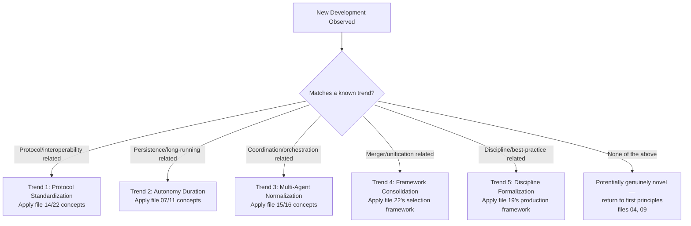

# 23 — Future of Loop Engineering

> 📘 File 23 of 25 — Loop Engineering Knowledge Library
> Phase: Horizon
> Prerequisite: `03_History_and_Evolution.md`, `22_Frameworks_and_LLM_Compatibility.md`

---

## 1. Introduction

### Topic Overview

File 03 traced Loop Engineering's history from classical AI planning through ReAct, the AutoGPT moment, and the framework-consolidation era. File 22 showed the current (mid-2026) framework landscape actively consolidating further. This file looks forward — grounded specifically in trends already visibly underway, rather than speculative leaps — at where the discipline appears to be heading.

### Why This Topic Matters

Loop Engineering is a young discipline in a fast-moving field. Understanding *directional* trends — not exact predictions, but the forces already reshaping the field — helps you make design decisions today that will age well, and helps you recognize genuinely new developments as extensions of known patterns rather than being caught flat-footed by them.

---

## 2. Definition

### What Is It? (Simple Explanation)

Think of this file like reading a river's current, not predicting exactly where a specific leaf will end up. We can't know precisely which framework will "win" or what a 2028 agent system will look like in detail — but we can observe the direction the water is already moving (toward standardization, toward longer-running autonomy, toward multi-agent normalization) and reasonably expect that current to continue.

### Technical Definition

> This file identifies **directional trends** in Loop Engineering — **protocol standardization** (MCP, A2A reducing framework lock-in), **increasing loop autonomy duration** (from single-session to multi-day workflows), **multi-agent normalization** (file 15's patterns becoming default rather than exceptional), **framework consolidation continuing** (as demonstrated by the AutoGen/Semantic Kernel merger), and **the formalization of Loop Engineering as a distinct discipline** — each grounded in developments already underway as of this library's writing, explicitly distinguished from speculative claims about specific future capabilities.

---

## 3. Core Concepts

### Fundamental Ideas

- **This file distinguishes trends from predictions** — a trend is a direction already visible in current data (e.g., "checkpointing/persistence tooling is maturing across every major framework"); a prediction is a specific claim about a future state, which this file deliberately avoids making with confidence
- **Standardization is actively reducing framework lock-in** — MCP (file 14) for tools and the emerging A2A protocol (file 22) for cross-framework agent communication are concrete, already-shipping developments, not speculation
- **The trend toward longer-running, more autonomous loops** directly increases the importance of file 07's lifecycle management and file 11's context/memory strategies — these aren't optional refinements, they become load-bearing as autonomy duration grows
- **Framework consolidation is an observed pattern, not a one-time event** — it happened during 2023's shakeout (file 03) and is visibly happening again now (file 22's AutoGen/Semantic Kernel merger)

### Key Terminology

- **Protocol standardization** — the trend toward open, cross-framework standards (MCP, A2A) rather than framework-specific proprietary approaches
- **Autonomy duration** — how long a loop can reliably operate without human intervention
- **Framework consolidation** — the pattern of many competing frameworks narrowing over time into fewer, more mature options
- **Discipline formalization** — the process by which a practice (like Loop Engineering) develops named patterns, dedicated literature, and recognized expertise, as this library itself represents

---

## 4. How It Works

### Step-by-Step Explanation: Tracing Each Trend from Evidence to Direction

**Trend 1 — Protocol Standardization**
1. Evidence: MCP (file 14) has grown to over 200 server implementations; the A2A protocol has merged into Linux Foundation governance and is being adopted by multiple major frameworks (file 22)
2. Direction: tool and agent interoperability across framework boundaries continues to reduce the cost of framework choice — a wrong framework bet becomes less costly as more capability becomes portable
3. Implication for practitioners: standardized tool schemas (file 14) and agent communication patterns (file 15) are increasingly safe investments, independent of which specific framework wins

**Trend 2 — Increasing Autonomy Duration**
1. Evidence: production agent frameworks increasingly emphasize checkpointing, crash recovery, and persistence (file 07, 11) as core rather than advanced features
2. Direction: loops are trending toward longer unsupervised operation — from single-session tasks toward multi-day or continuous workflows
3. Implication for practitioners: file 07's lifecycle management and file 11's context/memory strategies (especially hierarchical memory) become foundational skills, not advanced optional techniques

**Trend 3 — Multi-Agent Normalization**
1. Evidence: every major framework surveyed in file 22 now offers first-class multi-agent primitives (ADK's Workflow agents, LangGraph's multi-agent graphs, CrewAI's crews, Microsoft Agent Framework's group-chat patterns)
2. Direction: multi-agent coordination (file 15, 16) is trending from "advanced technique" toward "default consideration" for any non-trivial agent project
3. Implication for practitioners: file 15/16's coordination patterns and their genuine tradeoffs (coordination overhead, cost multiplication) become essential knowledge for a much broader range of projects than in the field's earlier, single-agent-dominant years

**Trend 4 — Continued Framework Consolidation**
1. Evidence: Microsoft's 2025-2026 merger of AutoGen and Semantic Kernel into a unified Agent Framework directly echoes the 2023 shakeout (file 03) that narrowed the field's earliest wave of experimental projects
2. Direction: expect continued consolidation as the market matures — not necessarily fewer frameworks in absolute count, but clearer differentiation and fewer genuinely redundant options
3. Implication for practitioners: file 22's framework-selection approach (matching genuine requirements to concepts, not chasing novelty) becomes more valuable, not less, as this consolidation continues

**Trend 5 — Discipline Formalization**
1. Evidence: this library's own existence — a structured, 25-file treatment of Loop Engineering as a distinct discipline — is itself evidence of this trend; so is the field's shift from "prompt engineering tips" content toward genuine software-engineering-grade treatment of agent reliability (files 02, 19)
2. Direction: Loop Engineering is trending toward recognition as a distinct engineering discipline with its own best practices, patterns, and expertise — comparable to how "DevOps" or "Data Engineering" formalized as disciplines
3. Implication for practitioners: the skills in this library (files 01–22) are trending toward becoming a genuinely recognized, hireable specialization, rather than a loose set of tips scattered across framework tutorials

### Internal Workflow

```python
# A framework for evaluating whether a NEW development (post-dating this
# library) is a genuinely novel shift or an extension of a known trend —
# useful for staying current beyond this file's own writing date

def classify_new_development(description: str, evidence: dict) -> str:
    """
    Applies this file's five trends as a classification lens for
    evaluating new frameworks, protocols, or techniques as they emerge.
    """
    trend_indicators = {
        "protocol_standardization": ["cross-framework", "open standard", "interoperability", "MCP", "A2A"],
        "autonomy_duration": ["long-running", "persistent", "multi-day", "checkpoint", "crash recovery"],
        "multi_agent_normalization": ["multi-agent", "orchestration", "sub-agent", "crew", "delegation"],
        "framework_consolidation": ["merger", "unified", "successor to", "maintenance mode"],
        "discipline_formalization": ["best practices", "certification", "specialization", "engineering discipline"],
    }

    matched_trends = []
    description_lower = description.lower()
    for trend, keywords in trend_indicators.items():
        if any(kw.lower() in description_lower for kw in keywords):
            matched_trends.append(trend)

    if matched_trends:
        return f"Extension of known trend(s): {', '.join(matched_trends)} — apply this library's existing concepts (files 01-22)"
    else:
        return "Potentially novel — evaluate against first principles (files 04, 09) rather than assuming an existing pattern fits"


# Example: evaluating a hypothetical future development
example = "A new protocol enabling agents to negotiate resource budgets across framework boundaries"
print(classify_new_development(example, {}))
```

---

## 5. Architecture / Workflow

### Mermaid Flowchart



---

## 6. Components / Types

### The Five Identified Trends

| Trend | Core Evidence | Most Relevant Prior Files |
|---|---|---|
| **Protocol Standardization** | MCP's 200+ server implementations; A2A's Linux Foundation governance | 14, 22 |
| **Increasing Autonomy Duration** | Checkpointing/persistence becoming standard framework features | 07, 11 |
| **Multi-Agent Normalization** | Every major framework now offers first-class multi-agent primitives | 15, 16 |
| **Continued Framework Consolidation** | AutoGen + Semantic Kernel merger (2025-2026) echoing 2023's shakeout | 03, 22 |
| **Discipline Formalization** | Growing structured literature (like this library) treating Loop Engineering as distinct engineering practice | 02, 19 |

### Categories: Trend vs. Speculation

This file deliberately separates its content into two categories:

- **Grounded trends** (what this file actually asserts) — directions with clear, citable, current evidence
- **Open questions** (what this file explicitly does NOT claim to answer) — genuinely uncertain future developments this file avoids confidently predicting

---

## 7. Examples

### Beginner Example

A simple illustration of "trend vs. prediction" as a distinction, using a historical parallel from file 03:

```python
# A TREND (grounded, evidence-based) — this is what file 23 aims for:
trend_example = {
    "claim": "Stateful, persistent loop architectures are becoming the default expectation",
    "evidence": "LangGraph's checkpointing, Google ADK's Session/State services, "
                "Microsoft Agent Framework's session-based state — ALL major "
                "frameworks surveyed in file 22 now treat this as core, not optional",
    "type": "grounded trend"
}

# A PREDICTION (speculative, NOT what this file does) — included as a contrast:
prediction_example = {
    "claim": "By 2028, framework X will have Y% market share",
    "evidence": "Speculation about specific future market outcomes",
    "type": "speculative prediction — DELIBERATELY AVOIDED by this file"
}

print(f"This file makes claims like: {trend_example['claim']}")
print(f"This file does NOT make claims like: {prediction_example['claim']}")
```

### Intermediate Example

Applying the Section 4 classification function to three illustrative hypothetical developments, showing how the trend framework helps evaluate genuinely new information as it arrives — beyond this file's own writing date:

```python
hypothetical_developments = [
    "A new open protocol lets agents built on different frameworks share checkpointed state directly",
    "A framework introduces agents that run continuously for weeks with automatic memory consolidation",
    "Two major mid-tier frameworks announce a merger to reduce ecosystem fragmentation",
]

for dev in hypothetical_developments:
    classification = classify_new_development(dev, {})
    print(f"Development: {dev}\n  -> {classification}\n")
```

This demonstrates the file's real utility: not predicting *what* will happen, but providing a framework for correctly situating whatever *does* happen relative to concepts you already understand deeply.

### Advanced / Real-World Example

A practical "future-proofing" checklist for a new Loop Engineering project, explicitly designed around this file's five trends — the actionable takeaway from otherwise abstract trend analysis:

```python
def future_proofing_checklist(project_plan: dict) -> list:
    """Evaluates a project plan against this file's five trends,
    surfacing concrete recommendations to reduce future migration cost."""

    recommendations = []

    if not project_plan.get("uses_standardized_tool_protocol"):
        recommendations.append(
            "Trend 1 (Standardization): consider MCP for tool definitions (file 14) "
            "rather than a fully proprietary tool schema — eases future framework migration"
        )

    if not project_plan.get("has_checkpointing"):
        recommendations.append(
            "Trend 2 (Autonomy Duration): even if not needed today, design state (file 11) "
            "to be checkpoint-compatible from the start — retrofitting is costlier later"
        )

    if project_plan.get("is_single_agent") and project_plan.get("expected_growth"):
        recommendations.append(
            "Trend 3 (Multi-Agent Normalization): if this project is expected to grow in scope, "
            "design initial architecture (file 09's component separation) to ease a future "
            "transition to multi-agent (file 15) rather than requiring a full rewrite"
        )

    if project_plan.get("framework_choice") and not project_plan.get("verified_framework_status_recently"):
        recommendations.append(
            "Trend 4 (Consolidation): verify your chosen framework's current maintenance status "
            "(file 22) — don't assume today's snapshot remains accurate"
        )

    recommendations.append(
        "Trend 5 (Discipline Formalization): document your loop's design decisions "
        "(termination logic, state strategy, pattern choice) explicitly — as this "
        "discipline formalizes further, well-documented systems age better than ad hoc ones"
    )

    return recommendations


plan = {
    "uses_standardized_tool_protocol": False,
    "has_checkpointing": False,
    "is_single_agent": True,
    "expected_growth": True,
    "framework_choice": "LangGraph",
    "verified_framework_status_recently": False,
}

for rec in future_proofing_checklist(plan):
    print(f"- {rec}")
```

---

## 8. Best Practices

### Do's

- ✅ Distinguish grounded trends (evidence-based directions) from speculative predictions (specific future-state claims) — this file, and your own future-facing thinking, should stay firmly in the former category
- ✅ Design new projects with reasonable accommodation for these five trends (standardized tools, checkpoint-compatible state, extensible-to-multi-agent architecture) even when not immediately needed — the marginal cost is usually low, and the future migration savings can be substantial
- ✅ Periodically re-verify framework and protocol status (file 22) rather than assuming any point-in-time snapshot, including this file's, remains accurate indefinitely
- ✅ Treat genuinely novel future developments as opportunities to apply first-principles thinking (files 04, 09) when they don't fit an existing named pattern, rather than forcing them into an ill-fitting category

### Recommended Techniques

- Revisit this file's five trends periodically (e.g., yearly) and explicitly ask "is each trend still directionally accurate? Has a genuinely new trend emerged that isn't captured here?" — treat this file as a living lens, not a permanent snapshot
- When evaluating unfamiliar new technology in this space, run it through Section 4's classification approach before assuming it requires fundamentally new learning

---

## 9. Common Mistakes

### Frequent Errors

| Mistake | Consequence |
|---|---|
| Treating this file's trends as confident predictions rather than directional observations | Over-commits to specific expected outcomes that may not materialize exactly as described |
| Assuming the framework landscape (file 22) is static | Builds on assumptions that go stale as consolidation and new entrants continue |
| Ignoring future-proofing considerations entirely, optimizing only for today's immediate need | Incurs avoidable migration costs later when a project's scope or duration grows |
| Treating every new development as requiring entirely new learning | Misses that most new developments are extensions of already-understood trends (Section 4's classification approach exists specifically to prevent this) |

### How to Avoid Them

- Read this file's trend claims with explicit attention to their evidence basis (Section 4) rather than treating them as guaranteed outcomes
- Build the future-proofing checklist habit (Section 7's advanced example) into your own project planning, calibrated to your project's actual expected lifespan and growth trajectory

---

## 10. Advantages & Limitations

### Benefits of Trend-Aware (Not Prediction-Based) Thinking

- Provides genuinely useful forward-looking guidance without the overconfidence risk of specific predictions
- The classification framework (Section 4) remains useful well beyond this file's own writing date, since it's a *method* for evaluating new information, not a fixed list of facts
- Encourages sensible future-proofing investment (Section 7's checklist) without over-engineering for uncertain specific outcomes

### Limitations

- Trends can shift or reverse — this file's five trends represent a reasonable, evidence-based reading as of its writing, not a guarantee
- No trend-analysis file can anticipate genuinely discontinuous developments (a fundamentally new model capability, an unexpected regulatory shift) that don't extend from currently visible patterns
- Future-proofing investment (Section 7) always involves a real tradeoff against present-day simplicity — this file doesn't and can't tell you the exact right balance for your specific project

---

## 11. Comparison

### Compare with Related Concepts

| Concept | Relationship to This File |
|---|---|
| **File 03's History** | This file is file 03's natural extension — the same kind of trend-tracing, applied forward instead of backward |
| **File 22's Framework Landscape** | This file's trends directly explain WHY file 22's landscape looks the way it does, and suggests how it may continue evolving |
| **Technology Forecasting (general discipline)** | This file applies standard trend-vs-prediction discipline from technology forecasting specifically to Loop Engineering |

### Summary Table

| Trend | Grounded In (Evidence) | NOT Claiming |
|---|---|---|
| Protocol Standardization | MCP adoption, A2A governance | Which specific protocol "wins" |
| Increasing Autonomy Duration | Checkpointing becoming standard | Specific autonomy duration numbers for any future date |
| Multi-Agent Normalization | Universal framework support for multi-agent | Multi-agent becoming mandatory for all projects |
| Framework Consolidation | AutoGen/Semantic Kernel merger | Which specific frameworks will merge or fold next |
| Discipline Formalization | Growing structured literature (this library included) | A specific certification or job title timeline |

---

## 12. Summary

### Key Takeaways

- This file distinguishes **grounded trends** (evidence-based directional observations) from **speculative predictions** (specific future-state claims), deliberately staying in the former category throughout
- Five trends are identified, each with concrete current evidence: **Protocol Standardization** (MCP, A2A), **Increasing Autonomy Duration** (checkpointing becoming standard), **Multi-Agent Normalization** (universal framework support), **Continued Framework Consolidation** (the AutoGen/Semantic Kernel merger), and **Discipline Formalization** (this library's own existence as evidence)
- Each trend has a direct, practical implication for how you design projects today — favoring standardized tools, checkpoint-compatible state, and extensible architecture, even before those needs are immediate
- The Section 4 classification framework is this file's most durable contribution — a *method* for evaluating genuinely new developments against known trends, useful well beyond this file's own writing date

### Cheat Sheet

```
FIVE GROUNDED TRENDS (evidence-based, not speculative predictions):

1. PROTOCOL STANDARDIZATION      → MCP, A2A reducing framework lock-in
2. INCREASING AUTONOMY DURATION  → checkpointing/persistence becoming standard
3. MULTI-AGENT NORMALIZATION     → multi-agent shifting from advanced to default
4. FRAMEWORK CONSOLIDATION       → ongoing, not a one-time 2023 event
5. DISCIPLINE FORMALIZATION      → Loop Engineering becoming a recognized specialty

FUTURE-PROOFING HABIT: favor standardized tools (MCP), checkpoint-compatible
state, and extensible architecture — even before immediately needed.

NEW DEVELOPMENT ARRIVES? Classify against these 5 trends first (Section 4)
before assuming it requires fundamentally new learning.
```

---

## 13. Glossary

| Term | Definition |
|---|---|
| **Protocol Standardization** | The trend toward open, cross-framework standards rather than proprietary approaches |
| **Autonomy Duration** | How long a loop can reliably operate without human intervention |
| **Framework Consolidation** | The pattern of many competing frameworks narrowing over time into fewer, more mature options |
| **Discipline Formalization** | The process by which a practice develops named patterns, dedicated literature, and recognized expertise |
| **Grounded Trend** | A directional claim supported by current, citable evidence |
| **Speculative Prediction** | A specific claim about a future state, deliberately avoided by this file |

---

## 14. References & Further Reading

### Official Documentation

- Model Context Protocol — [Official Specification](https://modelcontextprotocol.io)
- Linux Foundation — A2A Protocol governance documentation

### Further Reading

- Industry framework landscape reports (as referenced in file 22) — the evidence base for this file's trend claims
- General technology forecasting methodology literature — the trend-vs-prediction discipline this file applies

### Where to Go Next in This Library

- Previous file: `22_Frameworks_and_LLM_Compatibility.md`
- Next file: `24_FAQs.md` — direct answers to the questions beginners most often ask, including several forward-looking ones this file's trends help address
- Related: `03_History_and_Evolution.md` — this file's natural backward-looking counterpart

---

*This is File 23 of 25 in the Loop Engineering Knowledge Library. See `README.md` for the full index and suggested reading paths.*
