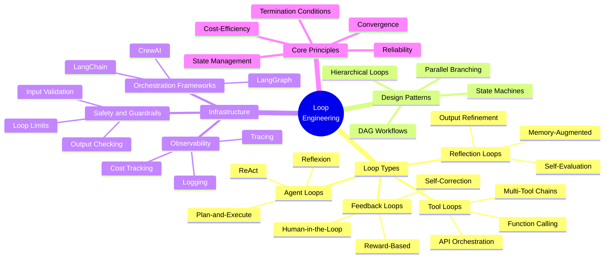

# 01 — What Is Loop Engineering?

## Introduction

If you have ever watched an AI agent attempt a task, fail, reconsider its approach, try a different tool, and eventually succeed — you have witnessed **loop engineering** in action. It is the invisible architecture behind every iterative AI system that goes beyond a single prompt-and-response cycle.

Loop Engineering is the discipline of designing, building, optimizing, and managing **iterative AI/LLM workflows** where a system loops through cycles of reasoning, acting, observing, and iterating until a goal is achieved. It encompasses agent loops, feedback loops, reflection loops, tool-calling loops, multi-agent orchestration, state machines, and the entire lifecycle of iterative AI processes.

This file is your starting point. It defines loop engineering comprehensively, explains why it emerged as a discipline, what problems it solves, and gives you a bird's-eye view of the entire field. Every subsequent file in this library builds on the foundations laid here.

## Definition

### Simple Definition

**Loop Engineering** is the practice of making AI systems that don't just answer once — they *think, act, observe, and repeat* until the job is done properly.

### Technical Definition

Loop Engineering is a software engineering discipline focused on the design, implementation, and optimization of **iterative computational workflows** powered by large language models (LLMs) and related AI components. A "loop" in this context is a controlled cycle through which an AI system progresses — typically involving phases of **reasoning** (deciding what to do), **acting** (calling tools, generating content, making API requests), **observing** (processing the results of actions), and **iterating** (deciding whether to continue or stop). Loop engineering applies principles from control theory, state machine design, distributed systems, and prompt engineering to create reliable, efficient, and observable AI workflows.

### What It Is Not

Loop Engineering is **not** simply "prompting an LLM multiple times." It is a structured engineering discipline with its own patterns, anti-patterns, design trade-offs, and failure modes. It concerns itself with:

- **When** to loop (termination conditions)
- **How** to loop (control flow, state management)
- **Why** a loop should exist (what problem iteration solves)
- **How much** to loop (cost, latency, and quality trade-offs)

## Why Loop Engineering Emerged

### The Single-Pass Ceiling

Early LLM applications were predominantly **single-pass**: send one prompt, receive one response. This works well for classification, summarization, translation, and other straightforward tasks. However, real-world problems are rarely single-pass. Consider:

- **Research tasks** that require searching, reading, synthesizing, and re-searching
- **Code generation** that needs to be written, tested, debugged, and refined
- **Data analysis** that requires querying, interpreting results, drilling deeper, and forming conclusions
- **Multi-step planning** that demands decomposition, execution, monitoring, and adaptation

These tasks share a common trait: the *path to the solution is not known in advance*. The system must **discover** the path through iteration. Single-pass prompting hits a ceiling because it cannot adapt based on intermediate results.

### The Rise of Agent Frameworks

As the limitations of single-pass prompting became clear, the AI engineering community developed frameworks — LangChain, LangGraph, AutoGPT, CrewAI, and others — that formalized the concept of an **AI agent**. An agent is fundamentally a loop: perceive, reason, act, observe, repeat. The engineering challenges around these loops became significant enough to warrant their own discipline.

### Bridging AI and Software Engineering

Loop Engineering sits at the intersection of **AI/ML** and **traditional software engineering**. It requires understanding LLM behavior, prompt design, and token economics *alongside* state management, error handling, observability, and system design. Neither skill set alone is sufficient — loop engineers need both.

## What Problems Loop Engineering Solves

| Problem | Single-Pass Approach | Loop Engineering Approach |
|---|---|---|
| Complex multi-step tasks | One massive prompt, brittle | Decomposed into iterative steps |
| Uncertainty in problem-solving | Guess once, hope for the best | Hypothesize, test, refine |
| Tool use and API interaction | Manual orchestration | Autonomous tool-calling loops |
| Error recovery | Manual retry or failure | Built-in retry and self-correction |
| Quality at scale | Inconsistent quality | Iterative refinement toward quality targets |
| Cost management | Over-prompt to compensate | Efficient iteration, stop when sufficient |

## The Loop Engineering Landscape

The following mind map provides a bird's-eye view of the major areas within loop engineering:



## Core Areas of Loop Engineering

### 1. Loop Types

Different tasks require different loop structures. An agent solving a research question needs a fundamentally different loop than a system refining generated text. See [04_Core_Concepts.md](04_Core_Concepts.md) for the conceptual foundations and [05_Key_Terminology.md](05_Key_Terminology.md) for precise definitions of each loop type.

The primary loop categories are:

- **Agent Loops**: The system acts as an autonomous agent — reasoning about what to do, executing actions, observing results, and deciding next steps. ReAct (Reasoning + Acting) is the canonical example.
- **Feedback Loops**: The system incorporates external or internal feedback to adjust its behavior. This includes human-in-the-loop review, automated quality checks, and reward-based optimization.
- **Reflection Loops**: The system evaluates its own output and iterates to improve it. This is the core of self-refining and self-critiquing systems.
- **Tool Loops**: The system iteratively calls external tools (search engines, code interpreters, databases, APIs) as part of its workflow.

### 2. Design Patterns

Loop engineering has emerged design patterns analogous to software design patterns. Common patterns include:

- **State Machine Loops**: Defining explicit states (e.g., `PLANNING`, `EXECUTING`, `REVIEWING`, `DONE`) and transitions between them
- **DAG Workflows**: Directed Acyclic Graphs where loops exist within individual nodes but the overall flow is acyclic
- **Hierarchical Loops**: A manager agent loops through delegating tasks to worker agents, each of which has its own loops
- **Parallel Branching**: Multiple loops executing concurrently, with a synchronization point

### 3. Infrastructure and Tooling

Building production loop-engineered systems requires robust infrastructure:

- **Orchestration frameworks** like LangGraph, LangChain, and CrewAI provide the scaffolding for loop-based workflows
- **Observability tools** enable tracing loop executions, identifying where loops stall or diverge, and tracking costs
- **Safety systems** including input validation, output checking, and hard loop limits prevent runaway iterations

### 4. Core Principles

Every loop-engineered system must grapple with fundamental principles:

- **Termination**: When does the loop stop? This is arguably the most critical design decision.
- **State Management**: What information persists across loop iterations?
- **Convergence**: Is the system making progress toward its goal, or is it stuck?
- **Cost-Efficiency**: Each iteration costs tokens and time. How do you balance quality against cost?

## A Simple Example

Here is a minimal loop-engineered system built with LangGraph — a ReAct-style agent that can search the web and answer questions:

```python
from langgraph.prebuilt import create_react_agent
from langchain_openai import ChatOpenAI
from langchain_community.tools.tavily_search import TavilySearchResults

# 1. Define the model
model = ChatOpenAI(model="gpt-4o")

# 2. Define available tools
tools = [TavilySearchResults(max_results=3)]

# 3. Create the agent — this IS a loop
agent = create_react_agent(model, tools)

# 4. Run it
result = agent.invoke({
    "messages": [("user", "What is the current population of Tokyo?")]
})

# Behind the scenes, the agent loops:
# Iteration 1: Reasoning → "I need to search for Tokyo's population"
#               Action   → Call TavilySearchResults
#               Observe  → Parse search results
# Iteration 2: Reasoning → "I have the data, I can answer now"
#               Action   → Generate final answer
#               Observe  → (none needed, terminate)
```

This simple example hides enormous complexity. The `create_react_agent` constructor builds a **state machine** with an implicit loop. The agent continues iterating — reasoning, acting, observing — until it decides it has enough information to provide a final answer. *That loop is the subject of loop engineering.*

## How This Library Is Organized

This knowledge library is structured to take you from foundational understanding to practical mastery:

| File | Topic | Purpose |
|---|---|---|
| **01** (this file) | What Is Loop Engineering? | Flagship overview, landscape, definitions |
| **02** | [Why Loop Engineering?](02_Why_Loop_Engineering.md) | Motivation, problems solved, limitations of alternatives |
| **03** | [History and Evolution](03_History_and_Evolution.md) | From rule-based systems to modern agent frameworks |
| **04** | [Core Concepts](04_Core_Concepts.md) | Iteration, recursion, feedback, convergence, state |
| **05** | [Key Terminology](05_Key_Terminology.md) | Comprehensive glossary of loop engineering terms |
| **06–10** | Architecture, Patterns, and Design | Deep dives into loop architectures and patterns |
| **11–15** | Tools, Frameworks, and Implementation | Hands-on with LangGraph, LangChain, and more |
| **16–20** | Advanced Topics | Optimization, safety, multi-agent, production |

## Summary

Loop Engineering is the engineering discipline behind **iterative AI systems** — systems that don't just respond once, but cycle through reasoning, action, observation, and iteration until they achieve their goal. It emerged from the recognition that real-world tasks demand more than single-pass prompting, and it sits at the intersection of AI/ML and traditional software engineering.

### Cheat Sheet

| Concept | One-Liner |
|---|---|
| **Loop Engineering** | Designing, building, and optimizing iterative AI workflows |
| **Core Loop** | Reason → Act → Observe → Iterate (or Terminate) |
| **Key Concern** | When to stop (termination), what to remember (state), how to progress (convergence) |
| **Primary Frameworks** | LangGraph, LangChain, CrewAI, AutoGPT |
| **Key Trade-off** | Quality vs. Cost vs. Latency — each iteration adds all three |

## Glossary

| Term | Definition |
|---|---|
| **Agent** | An AI system that can reason about tasks and take actions to accomplish them |
| **Iteration** | A single pass through a loop's cycle (reason, act, observe) |
| **Termination Condition** | The criteria that determine when a loop should stop executing |
| **State** | The data and context that persists across loop iterations |
| **Convergence** | The property of a loop making progress toward its goal over successive iterations |
| **Divergence** | The failure mode where a loop drifts away from its goal or repeats without progress |

## References & Further Reading

- **LangGraph Documentation**: [https://langchain-ai.github.io/langgraph/](https://langchain-ai.github.io/langgraph/) — Primary framework for building stateful, loop-based AI workflows
- **ReAct Paper**: Yao et al., "ReAct: Synergizing Reasoning and Acting in Language Models" (2023) — [https://arxiv.org/abs/2210.03629](https://arxiv.org/abs/2210.03629)
- **LangChain Documentation**: [https://python.langchain.com/docs/](https://python.langchain.com/docs/) — Foundational framework for LLM application development
- **Reflexion Paper**: Shinn et al., "Reflexion: Language Agents with Verbal Reinforcement Learning" (2023) — [https://arxiv.org/abs/2303.11366](https://arxiv.org/abs/2303.11366)
- **"LLM Powered Autonomous Agents"** by Lilian Weng: [https://lilianweng.github.io/posts/2023-06-23-agent/](https://lilianweng.github.io/posts/2023-06-23-agent/) — Excellent survey of agent architectures and loop patterns