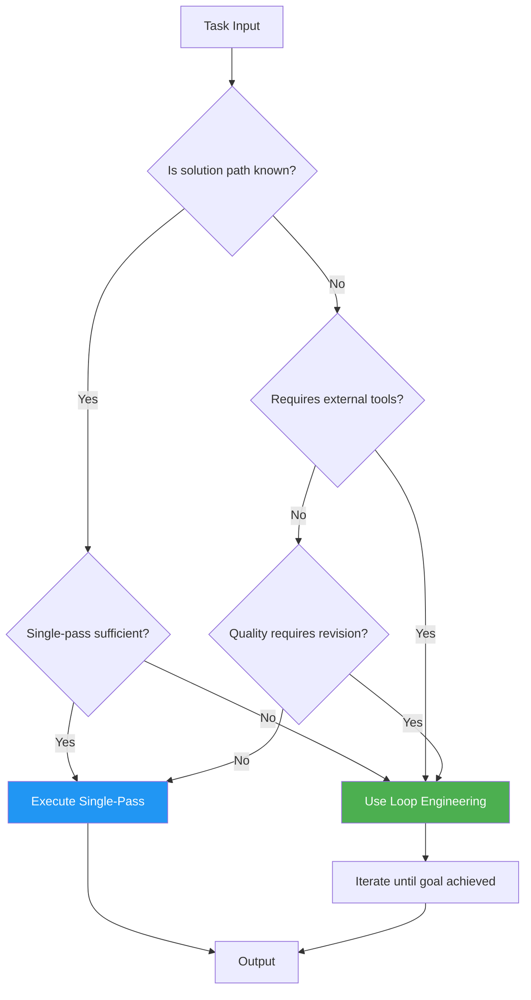

# 02 — Why Loop Engineering?

## Introduction

You can get surprisingly far with a single prompt. Ask an LLM to summarize a document, classify a sentiment, or translate a paragraph, and it will likely do a competent job on the first try. But the moment you ask it to *research a topic, write and debug code, analyze a dataset, or plan a complex project* — the single-pass approach starts to crack.

This file explains **why loop engineering exists** as a discipline. It examines the fundamental limitations of single-pass prompting, the nature of real-world task complexity, the economics of iterative refinement, and the reliability gains that loops provide. By the end, you will understand not just *what* loop engineering is (covered in [01_What_is_Loop_Engineering.md](01_What_is_Loop_Engineering.md)), but why it is **necessary**.

## The Limitations of Single-Pass Prompting

### What Is Single-Pass Prompting?

Single-pass prompting is the simplest LLM interaction pattern: you send one prompt, you receive one response. It underpins the vast majority of LLM applications today — chatbots, content generators, classifiers, and translators all commonly use this pattern.

```python
# Single-pass: one prompt, one response
from langchain_openai import ChatOpenAI

llm = ChatOpenAI(model="gpt-4o")
response = llm.invoke("Summarize this article: ...")
# Done. No iteration, no feedback, no correction.
```

### Where It Breaks Down

Single-pass prompting fails in predictable ways when tasks exceed a certain complexity threshold:

**1. No Self-Correction**

When an LLM makes an error in a single-pass system, there is no mechanism to detect or fix it. If it hallucinates a fact, misinterprets an instruction, or produces buggy code, that error propagates directly to the output. The system is **blind to its own mistakes**.

**2. No Adaptation to Intermediate Results**

Complex tasks often require adjusting your approach based on what you discover along the way. A researcher might start investigating one angle, find it's a dead end, and pivot. Single-pass systems commit to their approach at inference time and cannot adapt.

**3. Context Window Overload**

To compensate for the inability to iterate, single-pass approaches often try to cram everything into one prompt — instructions, examples, data, and constraints. This quickly exhausts context windows and degrades output quality as the model struggles to attend to all parts of a massive prompt.

**4. brittleness Under Edge Cases**

A single-pass system has one shot to handle every possible edge case. If the input is unusual, ambiguous, or requires domain-specific reasoning that the model struggles with on the first attempt, the system fails entirely.

### The Fundamental Issue

The core problem is this: **single-pass systems conflate planning with execution**. They must decide their entire approach in one forward pass, with no opportunity to revise. Human cognition doesn't work this way — we plan, act, observe, and adjust. Loop engineering gives AI systems the same capability.

## The Complexity of Real-World Tasks

### Task Complexity Spectrum

Real-world tasks exist on a spectrum of complexity. Loop engineering becomes necessary as tasks move toward the complex end:

| Complexity Level | Example | Single-Pass? | Loop-Engineered? |
|---|---|---|---|
| **Simple** | Sentiment classification | ✅ Ideal | ⚠️ Overkill |
| **Moderate** | Summarize a 5-page document | ✅ Works well | ⚠️ Marginal benefit |
| **Complex** | Research a question using web search | ❌ Insufficient | ✅ Necessary |
| **Highly Complex** | Build and debug a multi-file application | ❌ Impossible | ✅ Essential |
| **Open-Ended** | Plan a marketing campaign from scratch | ❌ Impossible | ✅ Essential |

### What Makes Tasks Require Loops?

Three characteristics make a task fundamentally unsuitable for single-pass approaches:

**1. The Solution Path Is Unknown in Advance**

If you know exactly what steps are needed (e.g., "translate this sentence to French"), a single pass suffices. If the path depends on what you discover along the way (e.g., "find the root cause of this bug"), you need iteration.

**2. External Tools or Data Sources Are Required**

When a task requires calling APIs, searching databases, executing code, or retrieving documents, the system must loop: call the tool, process the result, decide what to do next. Each tool call is a natural loop iteration.

**3. Quality Requires Revision**

Writing, coding, and analysis tasks often benefit from revision. A first draft is rarely optimal. Loop engineering enables systems to produce drafts, evaluate them, and refine — just like human experts do.



## Cost-Efficiency Through Refinement

### The Counterintuitive Economics of Loops

At first glance, looping seems more expensive than single-pass — you're making multiple LLM calls instead of one. But the economics are more nuanced:

**Single-Pass Over-Prompting**: To increase quality in a single-pass system, engineers often write longer, more detailed prompts with many examples and instructions. A single call to GPT-4o with a 10,000-token prompt costs more than three calls with 2,000-token prompts that iteratively refine the output.

**Targeted Iteration**: Loops allow the system to spend tokens *where they matter most*. Instead of a massive one-shot effort, each iteration can focus on a specific aspect of the problem — one iteration for structure, another for accuracy, another for style.

**Early Termination**: Well-designed loops stop as soon as the output meets quality criteria. If the first iteration produces a great result, the loop terminates immediately. The worst case is no worse than a single-pass system; the average case is often cheaper.

### Cost Comparison Example

Consider a task: "Write a detailed, accurate, well-structured technical blog post about quantum computing."

| Approach | Estimated Tokens | Estimated Cost (GPT-4o) | Quality |
|---|---|---|---|
| Single-pass (minimal prompt) | ~2,000 | $0.015 | Low |
| Single-pass (over-prompted) | ~8,000 | $0.06 | Medium |
| Loop engineering (3 iterations) | ~6,000 | $0.045 | High |

The loop-engineered approach achieves higher quality at *lower cost* than the over-prompted single-pass approach, because each iteration is focused and efficient.

## Reliability Improvements

### From Probabilistic to Deterministic-ish

LLMs are inherently probabilistic — the same prompt can produce different outputs. Loops introduce a degree of determinism by adding **verification and correction steps**. A loop that checks its own output against a rubric and revises until it passes is more reliable than a single-shot system hoping for the best.

### Self-Correction as Reliability Mechanism

Consider a code generation task. A single-pass system generates code and hopes it works. A loop-engineered system:

1. Generates code
2. Runs tests (tool call)
3. Reads the test output
4. If tests fail, analyzes the failure and generates a fix
5. Repeats until all tests pass or a limit is reached

This pattern — generate, verify, fix — is one of the most powerful reliability mechanisms in loop engineering. It transforms the system from "hope it works" to "verify it works, fix it if it doesn't."

```python
from langgraph.graph import StateGraph, START, END
from langgraph.graph.message import add_messages
from typing import Annotated, TypedDict

class AgentState(TypedDict):
    messages: Annotated[list, add_messages]
    code: str
    test_results: str
    iteration_count: int

def generate_code(state: AgentState) -> AgentState:
    """Generate or fix code based on current state."""
    # LLM call to generate/fix code
    ...
    return {**state, "code": new_code, "iteration_count": state["iteration_count"] + 1}

def run_tests(state: AgentState) -> AgentState:
    """Execute the generated code against tests."""
    # Run code in sandbox, capture results
    ...
    return {**state, "test_results": results}

def should_continue(state: AgentState) -> str:
    """Determine whether to loop again or stop."""
    if state["test_results"] == "PASS" or state["iteration_count"] >= 5:
        return "end"
    return "continue"

# Build the loop
graph = StateGraph(AgentState)
graph.add_node("generate", generate_code)
graph.add_node("test", run_tests)
graph.add_edge(START, "generate")
graph.add_edge("generate", "test")
graph.add_conditional_edges("test", should_continue, {
    "continue": "generate",  # ← THE LOOP
    "end": END
})
```

### Error Recovery

Loops provide **graceful degradation**. When a step fails — an API returns an error, a search yields no results, a code execution times out — the loop can catch the error, adjust, and retry. Single-pass systems simply fail.

## The Comparison: Single-Pass vs. Loop-Based

The following table provides a comprehensive comparison across multiple dimensions:

| Dimension | Single-Pass Prompting | Loop Engineering |
|---|---|---|
| **Complexity handled** | Low to moderate | Low to very high |
| **Self-correction** | None | Built-in (reflection, testing, feedback) |
| **Tool integration** | Manual, pre-planned | Dynamic, on-demand |
| **Adaptability** | None — fixed at inference time | High — adjusts per iteration |
| **Cost control** | All-or-nothing per call | Incremental, with early termination |
| **Reliability** | Probabilistic, hope-based | Verified, correction-based |
| **Latency** | One round-trip | Multiple round-trips (but parallelizable) |
| **Debuggability** | Black box | Observable at each step |
| **State management** | Stateless | Stateful across iterations |
| **Implementation complexity** | Low | Medium to high |
| **Best for** | Simple, well-defined tasks | Complex, open-ended, tool-dependent tasks |

## When NOT to Use Loop Engineering

Loop engineering is not a silver bullet. There are clear cases where it is unnecessary or harmful:

**1. Simple, well-defined tasks.** If you're classifying emails as spam/not-spam, a single-pass classifier is simpler, faster, and cheaper.

**2. Latency-sensitive applications.** If you need sub-second responses (e.g., autocomplete, real-time translation), the multiple round-trips of a loop are unacceptable.

**3. When the cost of errors is low.** If a mediocre first draft is acceptable, the cost of iteration may not be justified.

**4. When you lack the infrastructure.** Loop engineering requires state management, tool integration, and observability. If you're building a quick prototype for a simple task, the overhead isn't worth it.

## Summary

Loop engineering exists because **real-world tasks demand more than a single pass**. Single-pass prompting cannot self-correct, cannot adapt to intermediate results, cannot integrate tools dynamically, and becomes brittle as task complexity grows. Loops provide self-correction, adaptability, cost-efficient refinement, and reliability — transforming AI systems from one-shot guessers into iterative problem-solvers.

### Cheat Sheet

| Why Loops? | Key Insight |
|---|---|
| **Self-correction** | Loops let AI systems detect and fix their own errors |
| **Adaptation** | Loops enable dynamic adjustment based on intermediate results |
| **Tool integration** | Loops naturally support multi-step tool-calling workflows |
| **Cost efficiency** | Targeted iteration is often cheaper than over-prompting |
| **Reliability** | Verify-and-fix loops produce more consistent, correct outputs |
| **Not always needed** | Use loops for complex tasks; single-pass for simple ones |

## Glossary

| Term | Definition |
|---|---|
| **Single-Pass Prompting** | An LLM interaction pattern where one prompt produces one response with no iteration |
| **Over-Prompting** | The practice of writing excessively long prompts to compensate for the lack of iteration |
| **Early Termination** | Stopping a loop as soon as quality criteria are met, saving cost and latency |
| **Self-Correction** | An AI system's ability to detect and fix its own errors through iteration |
| **Verify-and-Fix** | A loop pattern where output is verified (e.g., by tests) and corrected if necessary |

## References & Further Reading

- **"Chain-of-Thought Prompting Elicits Reasoning in Large Language Models"** — Wei et al. (2022): [https://arxiv.org/abs/2201.11903](https://arxiv.org/abs/2201.11903) — Demonstrated that iterative reasoning steps improve LLM performance
- **"Toolformer: Language Models Can Teach Themselves to Use Tools"** — Schick et al. (2023): [https://arxiv.org/abs/2302.04761](https://arxiv.org/abs/2302.04761) — Showed how LLMs can learn to call external tools
- **LangGraph Concepts**: [https://langchain-ai.github.io/langgraph/concepts/](https://langchain-ai.github.io/langgraph/concepts/) — Official documentation on stateful agent workflows
- **"LLM Powered Autonomous Agents"** by Lilian Weng: [https://lilianweng.github.io/posts/2023-06-23-agent/](https://lilianweng.github.io/posts/2023-06-23-agent/) — Comprehensive survey covering why agents need loops