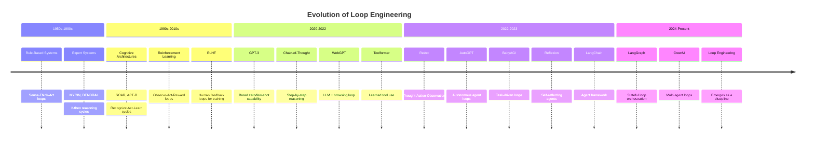

# 03 — History and Evolution of Loop Engineering

## Introduction

Loop engineering did not appear overnight. It is the product of decades of research in artificial intelligence, spanning early expert systems, cognitive architectures, reinforcement learning, and the modern era of large language models. Understanding this history is essential because many of today's loop patterns — reflection, tool use, multi-agent coordination — have deep roots in earlier AI paradigms.

This file traces the evolution from the earliest rule-based loops to today's sophisticated agent frameworks. Along the way, we will identify the key papers, breakthroughs, and frameworks that shaped the discipline. See [01_What_is_Loop_Engineering.md](01_What_is_Loop_Engineering.md) for the modern definition and [04_Core_Concepts.md](04_Core_Concepts.md) for the conceptual foundations that emerged from this history.

## Era 1: Rule-Based Loops (1950s–1990s)

### The Origins: Sense-Think-Act

The earliest AI systems were built on **explicit loops** hard-coded by engineers. These systems followed a sense-think-act cycle:

1. **Sense**: Gather input from the environment (sensors, user input, databases)
2. **Think**: Apply rules to the input to determine the next action
3. **Act**: Execute the determined action
4. **Loop**: Return to step 1

This pattern was fundamental to **expert systems** like MYCIN (1970s, medical diagnosis) and DENDRAL (1960s, chemical analysis). These systems used if-then rules to reason about inputs in a loop, asking follow-up questions and refining their diagnoses.

### The Limitations

Rule-based loops were **brittle**. Every possible scenario had to be anticipated and encoded by human experts. The systems could not generalize beyond their rules, and maintaining large rule bases became impractical. By the 1990s, the AI community began shifting toward statistical and machine learning approaches that could *learn* patterns rather than have them explicitly programmed.

### Key Takeaway

The sense-think-act loop survived this transition. What changed was not the *loop structure* but the *reasoning mechanism inside the loop* — from explicit rules to learned models.

## Era 2: Cognitive Architectures and Self-Reflecting Systems (1990s–2010s)

### Cognitive Architectures

Systems like **SOAR** (Newell, 1990) and **ACT-R** (Anderson, 1993) formalized the idea that intelligence requires iterative processing. SOAR, in particular, operated on a **recognize-act-learn** cycle that is strikingly similar to modern agent loops:

- Recognize the current state
- Select and execute an operator (action)
- Evaluate the result
- Learn from the outcome
- Repeat

### Reinforcement Learning Loops

Reinforcement learning (RL) formalized the agent loop mathematically. An RL agent operates in an **observe-act-reward** loop:

1. Observe the current state of the environment
2. Select an action based on a policy
3. Execute the action
4. Receive a reward signal
5. Update the policy
6. Loop

This loop structure — observe, act, receive feedback, update — is the direct ancestor of modern **reward-based feedback loops** in LLM systems. Techniques like **RLHF** (Reinforcement Learning from Human Feedback, 2022) are the bridge between classical RL loops and modern LLM training.

### Self-Reflecting Systems

Even before LLMs, researchers explored systems that could evaluate and improve their own outputs. **Self-reflecting systems** in the 2000s explored ideas like meta-cognition in AI — systems that could reason about their own reasoning process. While these were limited by the reasoning capabilities of the underlying models, the *pattern* of self-evaluation and refinement was established.

## Era 3: The LLM Revolution — Chain-of-Thought (2020–2022)

### From Zero-Shot to Chain-of-Thought

The release of GPT-3 in 2020 demonstrated that large language models could perform a remarkable range of tasks with simple prompting. But early prompting was single-pass — one prompt, one response.

**Chain-of-Thought (CoT) prompting**, introduced by Wei et al. in January 2022, was a watershed moment. The key insight was that LLMs produce better results when they *show their reasoning steps* rather than jumping directly to an answer. While CoT itself was still technically single-pass (one prompt containing reasoning steps that produce one response), it established the critical idea that **iterative reasoning improves outcomes**.

```
# Zero-shot: "What is 23 × 47?" → "1081" (might be wrong)
# CoT: "What is 23 × 47? Let's think step by step." 
# → "23 × 47 = 23 × (50 - 3) = 1150 - 69 = 1081" (more reliable)
```

CoT planted the seed for loop engineering by demonstrating that *the process matters as much as the output*. If step-by-step reasoning in a single pass helps, imagine what actual iteration could do.

### Key Milestones

| Year | Milestone | Significance |
|---|---|---|
| 2020 | GPT-3 released | Demonstrated broad zero/few-shot capability |
| 2022 Jan | Chain-of-Thought prompting (Wei et al.) | Showed that explicit reasoning steps improve results |
| 2022 Mar | WebGPT (Nakano et al.) | LLM + browsing in a loop to answer questions |
| 2022 Jun | Toolformer (Schick et al.) | LLMs learning to use external tools |

## Era 4: ReAct and the Birth of Agent Loops (2022–2023)

### ReAct: Reasoning + Acting

The **ReAct** paper by Yao et al. (October 2022) is arguably the single most important paper for loop engineering. It formalized a pattern where an LLM alternates between **reasoning** (thinking about what to do) and **acting** (calling tools, taking actions) in an explicit loop:

```
Thought: I need to find the capital of France.
Action: Search("capital of France")
Observation: Paris is the capital of France.
Thought: I now know the answer.
Answer: Paris
```

This Thought-Action-Observation loop is the **canonical agent loop** and serves as the foundation for virtually every modern agent framework. It explicitly combined reasoning (CoT) with action (tool use) in an iterative cycle.

### Self-Ask and Decomposition

Around the same time, **Self-Ask** (Press et al., 2022) introduced the pattern of an LLM asking itself follow-up questions in a loop to decompose complex questions. This was another form of iterative reasoning — the model would ask a sub-question, answer it, then use that answer to address the original question.

### The Explosion of Agent Frameworks (2023)

2023 saw an explosion of frameworks designed to support loop-based AI systems:

- **LangChain** (launched late 2022, matured through 2023): Provided the first widely-adopted framework for chaining LLM calls with tools, with built-in agent loops.
- **AutoGPT** (March 2023): Captured the public imagination by demonstrating an autonomous agent that could loop through tasks with minimal human guidance. While often unreliable, it proved the concept.
- **BabyAGI** (April 2023): A minimalist implementation of a task-driven agent loop that decomposed goals into sub-tasks and executed them iteratively.
- **LangGraph** (2024): LangChain's successor for building stateful, loop-heavy workflows with explicit graph-based control flow.
- **CrewAI** (2023–2024): Focused on multi-agent orchestration where multiple agents loop through coordinated tasks.

### Key Milestones

| Year | Milestone | Significance |
|---|---|---|
| 2022 Oct | ReAct paper (Yao et al.) | Formalized the Thought-Action-Observation agent loop |
| 2022 Dec | ChatGPT launched | Brought LLMs to mainstream awareness |
| 2023 Mar | AutoGPT released | Public demonstration of autonomous agent loops |
| 2023 Apr | BabyAGI released | Minimalist task-driven agent loop |
| 2023 | Reflexion (Shinn et al.) | LLMs that reflect on and learn from past failures |
| 2023 | LangChain agents | First major framework for production agent loops |
| 2024 | LangGraph released | Stateful graph-based loop orchestration |

## Era 5: Modern Loop Engineering (2024–Present)

### From Novelty to Engineering Discipline

By 2024, the initial excitement around autonomous agents had given way to a more pragmatic focus on **reliability, cost control, and production readiness**. This is the era where loop engineering emerged as a *discipline* rather than a *novelty*.

Key characteristics of modern loop engineering:

**1. Explicit State Management**

Early agent frameworks managed state implicitly (through conversation history). Modern systems use explicit state objects — often called "agent state" or "graph state" — that are passed between loop iterations. LangGraph's `StateGraph` is the canonical example.

**2. Structured Control Flow**

Rather than relying on the LLM to decide when to stop looping (which is unreliable), modern systems use **explicit control flow** — conditional edges, state machines, and graph-based routing. The LLM is consulted *within* the loop, but the loop's structure is defined by the engineer.

**3. Observability and Debugging**

Production loop-engineered systems require tracing — the ability to see exactly what happened at each iteration, why the system made each decision, and where things went wrong. Tools like LangSmith provide this capability.

**4. Safety and Guardrails**

Runaway loops — systems that iterate indefinitely, waste tokens, or produce increasingly nonsensical outputs — are a serious production concern. Modern loop engineering incorporates hard limits, cost budgets, and output validation as first-class concerns.

### The Convergence of Streams

Modern loop engineering represents the convergence of several streams:

- **Control theory** (feedback, stability, convergence)
- **Software engineering** (state machines, design patterns, observability)
- **AI/ML** (prompting, tool use, multi-agent systems)
- **Human-computer interaction** (human-in-the-loop, approval workflows)

## A Timeline of Loop Engineering



## From Patterns to Principles

One of the most important shifts in this evolution is the move from **ad-hoc patterns** to **engineering principles**. Early agent systems (AutoGPT, BabyAGI) were essentially proof-of-concept implementations — they demonstrated that loops work, but they lacked the engineering rigor needed for production.

Modern loop engineering asks structured questions about every loop:

- **Termination**: Under what exact conditions should this loop stop? What are the hard limits?
- **State**: What information needs to persist across iterations? How is it structured?
- **Convergence**: How do we know the loop is making progress? What do we do if it isn't?
- **Observability**: Can we trace every iteration? Can we debug failures?
- **Cost**: What is the maximum token budget? What is the expected cost per task?

These questions represent the maturation of loop engineering from "cool demos" to "production systems."

## Examples: Then and Now

### Early Agent Loop (BabyAGI-style, 2023)

```python
# Conceptual BabyAGI — minimal, no state management, no guardrails
while not task_list.empty():
    task = task_list.pop()
    result = llm.invoke(f"Execute this task: {task}")
    task_list.add(llm.invoke(f"Based on this result: {result}, what tasks remain?"))
    # No termination condition beyond empty task list
    # No cost tracking
    # No error handling
    # No observability
```

### Modern Loop Engineering (LangGraph, 2024)

```python
from langgraph.graph import StateGraph, START, END
from langgraph.checkpoint.memory import MemorySaver
from typing import Annotated, TypedDict
from langgraph.graph.message import add_messages

class State(TypedDict):
    messages: Annotated[list, add_messages]
    task_queue: list[str]
    completed_tasks: list[str]
    iteration_count: int
    total_tokens_used: int

def should_continue(state: State) -> str:
    """Multi-criteria termination condition."""
    if not state["task_queue"]:
        return "end"
    if state["iteration_count"] >= 20:       # Hard limit
        return "end"
    if state["total_tokens_used"] > 50000:   # Budget limit
        return "end"
    return "continue"

# Each node is a step in the loop with full state access
# Built-in checkpointing for observability
# Structured transitions with conditional edges
```

The contrast illustrates the evolution: from unstructured while-loops to engineered state machines with guardrails, observability, and explicit termination.

## Summary

Loop engineering has deep roots — from the sense-think-act cycles of early AI to the cognitive architectures of the 1990s, through the LLM revolution of 2020–2022, to the agent explosion of 2023, and finally to the disciplined engineering practice of 2024 and beyond. Each era contributed essential ideas: rule-based systems contributed the loop structure, cognitive architectures contributed the stateful reasoning model, RL contributed the feedback and reward framework, CoT contributed the emphasis on reasoning processes, and ReAct contributed the canonical agent loop pattern.

### Cheat Sheet

| Era | Key Contribution | Representative System |
|---|---|---|
| **1950s–90s** | Sense-think-act loop structure | MYCIN, SOAR |
| **1990s–2010s** | Stateful reasoning, RL feedback loops | ACT-R, RLHF |
| **2020–2022** | Chain-of-thought reasoning, tool use | GPT-3, CoT, WebGPT |
| **2022–2023** | ReAct agent loop, autonomous agents | ReAct, AutoGPT, LangChain |
| **2024+** | Production loop engineering | LangGraph, CrewAI |

## Glossary

| Term | Definition |
|---|---|
| **ReAct** | Reasoning + Acting — the canonical agent loop pattern (Thought → Action → Observation) |
| **Chain-of-Thought (CoT)** | Prompting technique where the LLM shows step-by-step reasoning |
| **Expert System** | Early AI system using if-then rules in a reasoning loop |
| **Cognitive Architecture** | A computational model of cognition that operates in iterative processing cycles |
| **RLHF** | Reinforcement Learning from Human Feedback — using human evaluation loops to train LLMs |
| **Agent Framework** | A software framework that provides infrastructure for building loop-based AI systems |

## References & Further Reading

- **"ReAct: Synergizing Reasoning and Acting in Language Models"** — Yao et al. (2022): [https://arxiv.org/abs/2210.03629](https://arxiv.org/abs/2210.03629) — The foundational paper for agent loops
- **"Chain-of-Thought Prompting Elicits Reasoning in Large Language Models"** — Wei et al. (2022): [https://arxiv.org/abs/2201.11903](https://arxiv.org/abs/2201.11903)
- **"Reflexion: Language Agents with Verbal Reinforcement Learning"** — Shinn et al. (2023): [https://arxiv.org/abs/2303.11366](https://arxiv.org/abs/2303.11366)
- **"Toolformer: Language Models Can Teach Themselves to Use Tools"** — Schick et al. (2023): [https://arxiv.org/abs/2302.04761](https://arxiv.org/abs/2302.04761)
- **"WebGPT: Browser-assisted Question-answering with Human Feedback"** — Nakano et al. (2022): [https://arxiv.org/abs/2112.09332](https://arxiv.org/abs/2112.09332)
- **SOAR Architecture**: Laird, J. E. (2012). *The Soar Cognitive Architecture*. MIT Press.
- **"Training Language Models to Follow Instructions with Human Feedback"** — Ouyang et al. (2022): [https://arxiv.org/abs/2203.02155](https://arxiv.org/abs/2203.02155) — The InstructGPT/RLHF paper
- **AutoGPT**: [https://github.com/Significant-Gravitas/AutoGPT](https://github.com/Significant-Gravitas/AutoGPT)
- **BabyAGI**: [https://github.com/yoheinakajima/babyagi](https://github.com/yoheinakajima/babyagi)