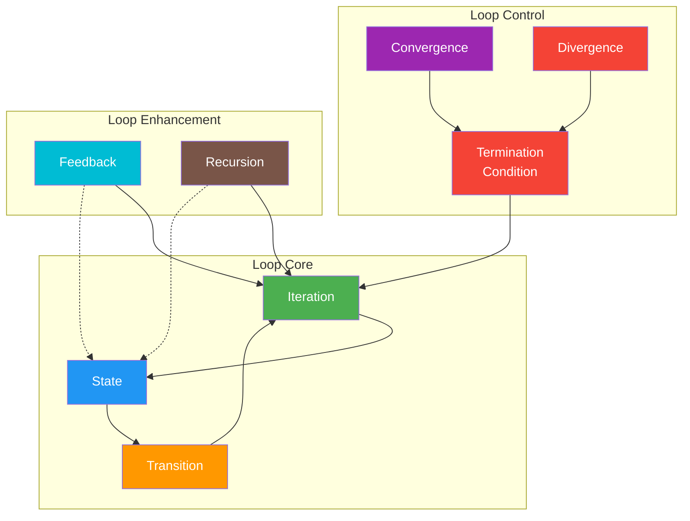
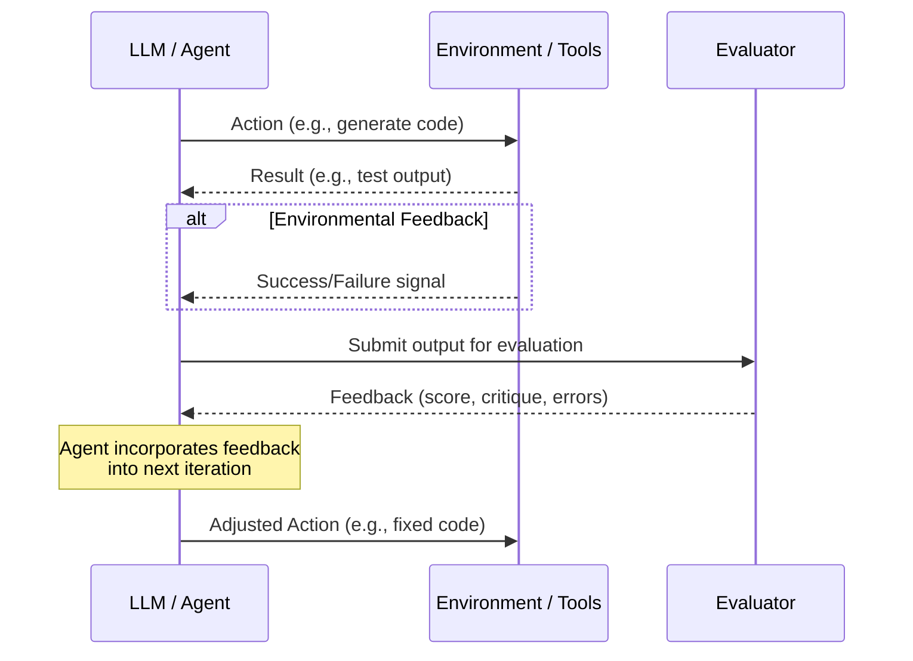
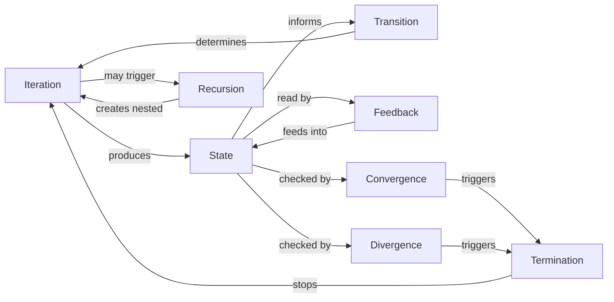

# 04 — Core Concepts

## Introduction

Loop engineering is built on a set of foundational concepts that apply regardless of the specific framework, language model, or task you are working with. Understanding these concepts deeply — what they mean, how they interact, and where they break down — is essential for designing effective, reliable, and efficient loop-based AI systems.

This file covers the six core concepts: **iteration**, **recursion**, **feedback**, **state transitions**, **termination conditions**, and the dual notions of **convergence and divergence**. These are the conceptual backbone of everything else in this library. For precise definitions of each term, see [05_Key_Terminology.md](05_Key_Terminology.md). For the historical context of how these concepts evolved, see [03_History_and_Evolution.md](03_History_and_Evolution.md).

## Concept Overview



## Iteration

### What Is Iteration?

**Iteration** is the fundamental unit of a loop — a single complete pass through the loop's cycle. In a ReAct agent, one iteration consists of one Thought, one Action, and one Observation. In a reflection loop, one iteration consists of generating output, evaluating it, and deciding whether to refine.

Iteration is to loop engineering what a single instruction is to processor architecture: the atomic operation that, when repeated with varying inputs, produces emergent complexity.

### Why Iteration Matters

The power of iteration comes from **accumulation and adaptation**. Each iteration has the potential to:

- **Accumulate information**: Each tool call or reasoning step adds to the system's knowledge
- **Narrow the solution space**: Each iteration should (ideally) eliminate incorrect paths
- **Improve quality**: Each refinement iteration should produce a better output than the last
- **Adapt to discoveries**: Each iteration can change the system's approach based on what it learned

### Types of Iteration

| Type | Description | Example |
|---|---|---|
| **Uniform** | Same operation each iteration | Re-prompting for refinement |
| **Variable** | Different operations based on state | Agent choosing different tools each step |
| **Hierarchical** | Outer loop manages inner loops | Manager agent delegating to worker agents |
| **Parallel** | Multiple iterations running concurrently | Searching multiple sources simultaneously |

### The Iteration Budget

Every iteration has a cost: tokens consumed, latency added, and API calls made. A critical loop engineering decision is setting the **iteration budget** — the maximum number of iterations allowed. This budget balances quality against cost:

```python
# Example: iteration budget in LangGraph
def should_continue(state: AgentState) -> str:
    # Budget-based termination
    if state["iteration_count"] >= state["max_iterations"]:
        return "end"  # Force stop, return best result so far
    # Quality-based termination
    if state["quality_score"] >= 0.9:
        return "end"  # Quality achieved, stop early
    return "continue"
```

## Recursion

### What Is Recursion in Loop Engineering?

**Recursion** is a special form of iteration where a loop can invoke itself — or a similar loop — at a deeper level. In loop engineering, recursion appears when a system **decomposes a problem into sub-problems**, each of which may require their own loop.

Recursion differs from simple iteration in a crucial way: **nesting depth**. A simple iteration stays at one level, repeating the same operation. A recursive loop creates a *tree* of sub-loops, each potentially with its own state and termination conditions.

### Where Recursion Appears

**1. Hierarchical Task Decomposition**

A planning agent receives a complex task, decomposes it into sub-tasks, and for each sub-task, invokes another agent (which has its own loop). The outer agent's loop is *recursive* because it spawns inner loops.

**2. Self-Improving Systems**

A system that evaluates its own evaluation criteria is recursive — the meta-evaluation itself might need evaluation.

**3. Multi-Agent Delegation**

In [CrewAI](https://github.com/joaomdmoura/crewAI)-style systems, a manager agent delegates tasks to specialist agents. Each specialist runs its own loop. The delegation pattern is recursive when specialists can themselves delegate.

### Recursive Depth and Risk

Recursion introduces the risk of **infinite descent** — loops spawning sub-loops that spawn further sub-loops without bound. Practical loop engineering always imposes a **maximum recursion depth**:

```python
class RecursiveAgent:
    def __init__(self, max_depth: int = 3):
        self.max_depth = max_depth

    def solve(self, task: str, depth: int = 0) -> str:
        if depth >= self.max_depth:
            return self.attempt_direct_solution(task)
        
        sub_tasks = self.decompose(task)
        results = []
        for sub in sub_tasks:
            # Recursive call — each sub-task gets its own loop
            result = self.solve(sub, depth + 1)
            results.append(result)
        
        return self.synthesize(results)
```

### Recursion vs. Iteration

| Aspect | Iteration | Recursion |
|---|---|---|
| **Structure** | Linear sequence of steps | Nested tree of sub-problems |
| **State** | Single shared state | State at each depth level |
| **Termination** | Loop condition or budget | Base case + depth limit |
| **Complexity** | O(n) — linear in iterations | O(b^d) — exponential in branching and depth |
| **Best for** | Refinement, search, tool-calling | Decomposition, hierarchical planning |

## Feedback

### What Is Feedback?

**Feedback** is information about the result of an action that is used to adjust future actions. In loop engineering, feedback is the mechanism that enables **self-correction and adaptation**. Without feedback, a loop is blind — it repeats the same operation without knowing whether it's making progress.

### Types of Feedback

**1. Environmental Feedback**

The most direct form of feedback: the result of interacting with the external world. If an agent writes code and runs it, the test results are environmental feedback. If an agent searches the web, the search results are environmental feedback.

**2. Self-Feedback (Reflection)**

The system evaluates its own output. This can take many forms:

- **Self-critique**: "Is this answer accurate? What's missing?"
- **Self-scoring**: Rating the quality of output on a rubric
- **Consistency checking**: Comparing the output against constraints or prior information

**3. Human Feedback**

A human reviews the output and provides corrections, approvals, or guidance. This is the most reliable form of feedback but also the most expensive in terms of human time.

**4. Reward Feedback**

A numerical reward signal (from an RL model, a scoring function, or a heuristic) that indicates how good the output is. RLHF-trained models have an implicit feedback loop baked into their training.

### The Feedback Loop Architecture



### Feedback Quality Matters

Not all feedback is equally useful. Good feedback is:

- **Specific**: Points to exactly what's wrong (not just "this is bad")
- **Actionable**: Suggests or implies a direction for improvement
- **Timely**: Arrives quickly enough to be relevant
- **Accurate**: Correctly identifies the issue

A common mistake in loop engineering is designing feedback mechanisms that are too vague ("improve this") or too noisy (contradictory signals). See [02_Why_Loop_Engineering.md](02_Why_Loop_Engineering.md) for more on why feedback-driven loops outperform single-pass approaches.

## State Transitions

### What Is State?

**State** is the complete set of information that persists across loop iterations and determines the system's behavior. In a ReAct agent, state includes the conversation history, tool results, and the current task description. In a LangGraph workflow, state is an explicit typed dictionary passed between nodes.

State is what makes a loop **stateful** rather than stateless. A stateless loop treats each iteration as independent — it has no memory of what happened before. A stateful loop carries information forward, enabling cumulative progress.

### The State Transition

A **state transition** is the process of moving from one state to another based on the current state and the action taken. In formal terms, it's a function: `next_state = transition_function(current_state, action, observation)`.

In loop engineering, state transitions are typically implemented as **graph nodes** in a framework like LangGraph:

```python
from langgraph.graph import StateGraph, START, END
from typing import Annotated, TypedDict

class AgentState(TypedDict):
    """The state that persists across all loop iterations."""
    messages: list                    # Conversation history
    current_plan: str                 # The agent's current plan
    completed_steps: list[str]        # Steps already executed
    tool_results: dict                # Results from tool calls
    error_count: int                  # Number of errors encountered
    quality_score: float              # Latest quality assessment

def plan_step(state: AgentState) -> dict:
    """State transition: update the plan based on current state."""
    # The LLM reads the full state and produces an updated plan
    response = llm.invoke(
        f"Current plan: {state['current_plan']}\n"
        f"Completed: {state['completed_steps']}\n"
        f"Results: {state['tool_results']}\n"
        f"What should I do next?"
    )
    return {"current_plan": response.content}
```

### State Design Principles

**1. Minimality**: Only include what the loop needs. Every piece of state consumes context window space.

**2. Structure**: Use typed, structured state rather than unstructured strings. This makes debugging easier and prevents state corruption.

**3. Immutability (preferred)**: Each iteration should produce a *new* state rather than mutating the existing one. This makes debugging and checkpointing trivial.

**4. Bounded Growth**: State should not grow unboundedly. Implement summarization or truncation for fields that accumulate data (like message lists).

### Explicit vs. Implicit State

| Aspect | Explicit State | Implicit State |
|---|---|---|
| **Definition** | State is a defined data structure | State is embedded in the prompt/context |
| **Control** | Engineer controls what persists | LLM decides what to "remember" |
| **Debuggability** | Easy — inspect the state object | Hard — buried in the prompt |
| **Example** | LangGraph `StateGraph` with typed dict | Stuffing all history into a prompt |

Modern loop engineering strongly prefers **explicit state** for production systems. Implicit state (just appending to a prompt) works for prototypes but becomes unmanageable at scale.

## Termination Conditions

### The Most Critical Design Decision

**Termination conditions** determine when a loop stops iterating. This is arguably the single most important design decision in loop engineering, because:

- **Too early**: The system stops before achieving adequate quality
- **Too late**: The system wastes tokens, time, and money
- **Never**: The system loops indefinitely (a runaway loop — a serious production incident)

### Types of Termination Conditions

**1. Goal Achievement**

The loop stops when the task is complete. This requires the system (or an external evaluator) to recognize when the goal has been met.

```python
def is_goal_achieved(state: AgentState) -> bool:
    """Stop when the answer passes all validation checks."""
    validation = validate_answer(state["latest_answer"], state["question"])
    return validation.accuracy >= 0.95 and validation.completeness >= 0.9
```

**2. Iteration Limit (Hard Stop)**

A maximum number of iterations after which the loop is forcibly terminated. This is a safety net, not a primary termination strategy.

```python
MAX_ITERATIONS = 10  # Never loop more than 10 times
```

**3. Convergence Detection**

The loop stops when progress stalls — when successive iterations produce diminishingly different results. This is discussed in detail in the Convergence section below.

**4. Budget Exhaustion**

The loop stops when a resource budget (tokens, time, money) is exhausted.

```python
MAX_TOKEN_BUDGET = 50_000  # Stop if we've used 50k tokens
MAX_TIME_SECONDS = 120     # Stop if we've been running for 2 minutes
```

**5. Error Threshold**

The loop stops when errors exceed a threshold — too many failed tool calls, too many validation failures, etc.

### Combining Termination Conditions

Production systems almost always use **multiple termination conditions** combined with OR logic:

```python
def should_terminate(state: AgentState) -> bool:
    """Combined termination — stop if ANY condition is met."""
    return (
        is_goal_achieved(state)           # Success
        or state["iteration"] >= 10       # Hard limit
        or state["tokens_used"] >= 50000  # Budget
        or state["error_count"] >= 3      # Too many errors
        or has_converged(state)           # No more progress
    )
```

## Convergence and Divergence

### What Is Convergence?

**Convergence** is the property of a loop making progressive improvement toward its goal over successive iterations. A converging loop produces outputs that are measurably better (by whatever metric is relevant) with each iteration.

Convergence is the *desired* behavior of a loop. When a loop converges, each iteration adds value — the system is genuinely getting closer to its goal.

### Measuring Convergence

Convergence can be measured quantitatively by tracking a quality metric across iterations:

| Iteration | Quality Score | Delta |
|---|---|---|
| 1 | 0.45 | — |
| 2 | 0.68 | +0.23 |
| 3 | 0.82 | +0.14 |
| 4 | 0.89 | +0.07 |
| 5 | 0.91 | +0.02 |

The decreasing delta (+0.23 → +0.14 → +0.07 → +0.02) indicates the loop is **converging** — it's improving, but the rate of improvement is slowing. This is a natural pattern and suggests the loop is approaching its quality ceiling for this approach.

### What Is Divergence?

**Divergence** is the opposite of convergence — the loop is moving *away* from its goal, or oscillating without making progress. Divergent loops are a serious problem because they waste resources while getting worse.

### Types of Divergence

**1. Oscillation**

The loop alternates between two or more states without making progress. For example, a code-fixing loop that introduces bug A, then fixes A but introduces bug B, then fixes B but re-introduces A.

**2. Drift**

The loop gradually moves away from the original goal, pursuing tangentially related but ultimately irrelevant sub-problems. Common in research agents that go down rabbit holes.

**3. Degradation**

Each iteration makes the output actively worse. This can happen when the feedback mechanism is misleading or when the LLM over-corrects.

**4. Runaway**

The loop continues indefinitely without any of the termination conditions triggering. This is the most dangerous form of divergence in production — it can consume unlimited tokens and cost.

### Detecting and Handling Divergence

```python
def check_divergence(quality_history: list[float]) -> str:
    """Analyze quality trend to detect divergence patterns."""
    if len(quality_history) < 3:
        return "unknown"  # Not enough data
    
    recent = quality_history[-3:]
    
    # Oscillation: alternating up and down
    if (recent[0] < recent[1] > recent[2]) or (recent[0] > recent[1] < recent[2]):
        if abs(recent[0] - recent[2]) < 0.05:
            return "oscillating"
    
    # Degradation: consistently getting worse
    if recent[0] > recent[1] > recent[2]:
        return "degrading"
    
    # Drift: flat or minimal improvement
    if abs(recent[-1] - recent[-2]) < 0.01:
        return "stalled"
    
    return "converging"
```

When divergence is detected, the system should take corrective action:

- **Terminate** and return the best result so far
- **Change strategy** (e.g., try a different approach or tool)
- **Escalate** to human review (in human-in-the-loop systems)
- **Reset** state and start over (with the benefit of what was learned)

## How Concepts Interconnect

These six concepts do not exist in isolation — they form an interconnected system:



The relationships in this diagram reveal the architecture of every loop-engineered system:

- **Iteration** and **State** are the engine — they form the core cycle
- **Feedback** and **Transitions** are the steering — they determine *how* the state changes
- **Recursion** adds depth — enabling hierarchical problem-solving
- **Convergence**, **Divergence**, and **Termination** are the brakes — they ensure the loop stops at the right time

## Examples

### Beginner: A Simple Refinement Loop

This example demonstrates iteration, state, and termination in their simplest form:

```python
from langchain_openai import ChatOpenAI

llm = ChatOpenAI(model="gpt-4o-mini")

def refine_answer(question: str, max_iterations: int = 3) -> str:
    """Simple refinement loop with iteration, state, and termination."""
    
    # Initial state
    current_answer = llm.invoke(f"Answer this question: {question}").content
    state = {"iteration": 1, "answer": current_answer}
    
    # Iteration loop with termination
    while state["iteration"] < max_iterations:
        # Feedback: self-critique
        critique = llm.invoke(
            f"Question: {question}\n"
            f"Answer: {state['answer']}\n"
            f"Critique this answer. List specific issues."
        ).content
        
        # Check termination: is the answer good enough?
        if "no issues" in critique.lower() or "excellent" in critique.lower():
            break  # Convergence detected
        
        # Transition: refine based on feedback
        refined = llm.invoke(
            f"Question: {question}\n"
            f"Previous answer: {state['answer']}\n"
            f"Critique: {critique}\n"
            f"Write an improved answer addressing these issues."
        ).content
        
        # Update state
        state["answer"] = refined
        state["iteration"] += 1
    
    return state["answer"]
```

### Intermediate: Stateful Agent with LangGraph

```python
from langgraph.graph import StateGraph, START, END
from typing import Annotated, TypedDict
from langgraph.graph.message import add_messages

class ResearchState(TypedDict):
    messages: Annotated[list, add_messages]
    research_findings: list[str]
    iteration: int
    max_iterations: int
    is_satisfied: bool

def research_step(state: ResearchState) -> dict:
    """One iteration of the research loop."""
    # LLM decides what to search for next
    response = llm.invoke(
        f"Research topic: {state['messages'][0]}\n"
        f"Findings so far: {state['research_findings']}\n"
        f"What should I search for next? Or am I done?"
    )
    
    if "done" in response.content.lower():
        return {"is_satisfied": True}
    
    # Tool call would happen here
    findings = search_tool.invoke(response.content)
    
    return {
        "research_findings": state["research_findings"] + [findings],
        "iteration": state["iteration"] + 1,
        "messages": [response]
    }

def should_continue(state: ResearchState) -> str:
    """Termination: goal achieved or budget exhausted."""
    if state["is_satisfied"]:
        return "synthesize"
    if state["iteration"] >= state["max_iterations"]:
        return "synthesize"
    return "research"

graph = StateGraph(ResearchState)
graph.add_node("research", research_step)
graph.add_node("synthesize", synthesize_findings)
graph.add_conditional_edges("research", should_continue)
graph.add_edge(START, "research")
```

### Advanced: Hierarchical Recursive Loop with Divergence Detection

```python
class HierarchicalPlanner:
    """A planner that decomposes tasks recursively with divergence detection."""
    
    def __init__(self, max_depth=3, max_iterations_per_level=5):
        self.max_depth = max_depth
        self.max_iterations = max_iterations_per_level
    
    def plan(self, task: str, depth: int = 0) -> dict:
        # Base case: if task is simple enough, solve directly
        if depth >= self.max_depth or self.is_simple(task):
            return self.execute_directly(task)
        
        # Iterative decomposition with divergence detection
        plan = None
        quality_history = []
        
        for iteration in range(self.max_iterations):
            # Generate or refine plan
            plan = self.generate_plan(task, previous_plan=plan, feedback=...)
            
            # Evaluate plan quality
            quality = self.evaluate_plan(plan, task)
            quality_history.append(quality)
            
            # Check for divergence
            divergence = self.check_divergence(quality_history)
            if divergence == "degrading":
                plan = self.get_best_plan(quality_history, plans)
                break  # Cut losses, return best so far
            
            if quality >= 0.9:
                break  # Good enough, stop iterating
        
        # Recursive step: execute each sub-task
        results = {}
        for sub_task in plan["steps"]:
            results[sub_task] = self.plan(sub_task["description"], depth + 1)
        
        return {"plan": plan, "results": results, "depth": depth}
```

## Summary

The six core concepts of loop engineering form an interconnected system:

- **Iteration** is the fundamental unit — a single pass through the loop
- **Recursion** adds depth — loops within loops for hierarchical problem-solving
- **Feedback** enables adaptation — information from results drives improvement
- **State transitions** enable accumulation — information persists and evolves across iterations
- **Termination conditions** ensure safety — they decide when to stop
- **Convergence/Divergence** measure progress — they indicate whether the loop is working

Mastering these concepts — understanding how they interact, where they fail, and how to implement them correctly — is the foundation of effective loop engineering.

### Cheat Sheet

| Concept | Key Question | Implementation Pattern |
|---|---|---|
| **Iteration** | What happens in one loop cycle? | Graph nodes in LangGraph |
| **Recursion** | Can the problem be decomposed into sub-problems? | Nested agent calls with depth limits |
| **Feedback** | How does the system know if it's improving? | Self-critique, testing, human review, scoring |
| **State** | What information persists across iterations? | TypedDict in LangGraph StateGraph |
| **Termination** | When should the loop stop? | Multi-criteria: goal + budget + convergence + hard limit |
| **Convergence** | Is the loop making progress? | Track quality metrics across iterations |
| **Divergence** | Is the loop getting worse or stuck? | Monitor quality trends for oscillation/degradation |

## Glossary

| Term | Definition |
|---|---|
| **Iteration** | A single complete pass through a loop's cycle |
| **Recursion** | A loop that can invoke itself or similar loops at a deeper level |
| **Feedback** | Information about results used to adjust future actions |
| **State** | The complete set of information persisting across loop iterations |
| **State Transition** | The process of moving from one state to another based on actions and observations |
| **Termination Condition** | The criteria that determine when a loop should stop |
| **Convergence** | The property of a loop making progressive improvement toward its goal |
| **Divergence** | The failure mode where a loop moves away from its goal or makes no progress |
| **Iteration Budget** | The maximum number of iterations allowed for a loop |
| **Hard Stop** | A termination condition that forcibly ends the loop regardless of quality |

## References & Further Reading

- **LangGraph State Management**: [https://langchain-ai.github.io/langgraph/concepts/low_level/#state](https://langchain-ai.github.io/langgraph/concepts/low_level/#state) — Official docs on state in LangGraph
- **LangGraph Conditional Edges**: [https://langchain-ai.github.io/langgraph/concepts/low_level/#conditional-edges](https://langchain-ai.github.io/langgraph/concepts/low_level/#conditional-edges) — Implementing termination and branching
- **"ReAct: Synergizing Reasoning and Acting in Language Models"** — Yao et al. (2022): [https://arxiv.org/abs/2210.03629](https://arxiv.org/abs/2210.03629) — The canonical iteration pattern
- **"Tree of Thoughts: Deliberate Problem Solving with Large Language Models"** — Yao et al. (2023): [https://arxiv.org/abs/2305.10601](https://arxiv.org/abs/2305.10601) — Recursive exploration of reasoning paths
- **"Self-Refine: Iterative Refinement with Self-Feedback"** — Madaan et al. (2023): [https://arxiv.org/abs/2303.17651](https://arxiv.org/abs/2303.17651) — Feedback-driven iteration pattern
- **Control Theory Basics**: Any introductory control theory textbook covers feedback, convergence, and stability — the mathematical foundations of these concepts