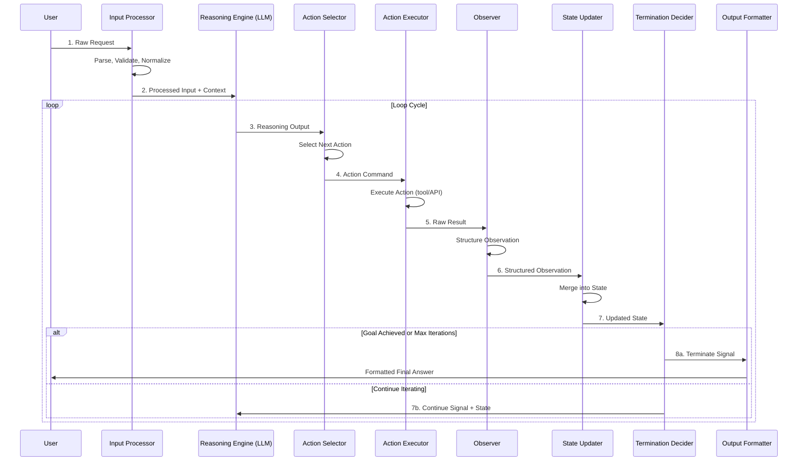

# How Loop Engineering Works

## Introduction

If you have read the earlier entries in this library — particularly [04_Core_Concepts.md](04_Core_Concepts.md) and [05_Key_Terminology.md](05_Key_Terminology.md) — you already understand *what* loop engineering is and the vocabulary around it. This file answers a different question: **how does a loop engineering system actually work, step by step, from the moment a user sends a request to the moment the system returns a final answer?**

Understanding the end-to-end flow is essential because loop engineering is not simply "call an LLM, get a result." It is a carefully orchestrated cycle of reasoning, acting, observing, and deciding that repeats until the system has sufficient confidence in its output. Each phase has specific responsibilities, failure modes, and design considerations.

By the end of this file, you will be able to trace a request through every stage of a loop engineering system, understand the data flowing between stages, and build a working implementation using LangGraph.

---

## The Eight Stages of a Loop Engineering Cycle

A complete loop engineering cycle can be decomposed into eight sequential stages. Not every system implements all eight with equal weight, but the conceptual model remains consistent across implementations.

| # | Stage | Responsibility | Key Question |
|---|-------|---------------|--------------|
| 1 | **Input Processing** | Parse, validate, and normalize the incoming request | "What does the user actually want?" |
| 2 | **Initial Reasoning** | The LLM analyzes the input and forms a plan | "How should I approach this?" |
| 3 | **Action Selection** | Choose the next concrete action to execute | "What should I do right now?" |
| 4 | **Execution** | Carry out the selected action (tool call, API request, etc.) | "Doing it." |
| 5 | **Observation** | Capture the result of the execution | "What happened?" |
| 6 | **State Update** | Merge the observation into the system's running state | "What do I know now?" |
| 7 | **Iteration Decision** | Decide whether to loop again or terminate | "Am I done?" |
| 8 | **Termination / Output** | Produce the final response to the user | "Here is the answer." |

Let us examine each stage in detail.

---

### Stage 1: Input Processing

Before any reasoning occurs, the system must process the raw user input. This stage is often underestimated but is critical for reliability.

**What happens:**
- **Parsing**: Extract structured data from raw input (e.g., extracting a query from a chat message, parsing command-line arguments, or reading a JSON payload from an API).
- **Validation**: Ensure the input meets system requirements — correct format, within length limits, containing required fields.
- **Context Assembly**: Gather relevant context such as conversation history, user preferences, system prompts, and retrieved documents (if using RAG).
- **Normalization**: Convert the input into a canonical format that downstream stages expect.

```python
from typing import TypedDict

class UserInput(TypedDict):
    query: str
    conversation_id: str
    metadata: dict
    context: list[str]

def process_input(raw_input: dict) -> UserInput:
    """Parse and validate incoming user request."""
    if "query" not in raw_input or not raw_input["query"].strip():
        raise ValueError("Query cannot be empty")
    
    return UserInput(
        query=raw_input["query"].strip(),
        conversation_id=raw_input.get("conversation_id", "default"),
        metadata=raw_input.get("metadata", {}),
        context=raw_input.get("context", [])
    )
```

> **Design Tip**: Input processing is your first line of defense. A well-structured input processing stage prevents garbage from entering the loop, which saves tokens, reduces error rates, and improves overall reliability.

---

### Stage 2: Initial Reasoning

With a clean, validated input in hand, the LLM performs its first round of reasoning. This is not the same as generating a final answer — it is about **understanding the problem space** and forming an initial strategy.

**What happens:**
- The LLM receives the processed input along with a system prompt that defines its role and capabilities.
- It analyzes the query to determine: Is this a single-step task or a multi-step one? What tools might be needed? Are there ambiguities to resolve?
- It may produce an explicit plan or simply begin selecting its first action.

**Why this matters:** Without initial reasoning, the system would blindly select actions. A brief reasoning step significantly improves action selection quality, reducing unnecessary loop iterations.

---

### Stage 3: Action Selection

The system must decide what to *do*. In LangGraph terms, this is typically an LLM node that outputs a structured action command.

**What happens:**
- Based on the current state (input + all previous observations), the LLM selects the next action.
- Actions can include: calling a tool (search, calculator, database query), generating text, asking the user for clarification, or delegating to a sub-agent.
- The action is typically formatted as a structured object (e.g., a function call with name and arguments).

```python
import json
from langchain_core.messages import SystemMessage, HumanMessage

def select_action(state: dict) -> dict:
    """LLM selects the next action based on current state."""
    messages = [
        SystemMessage(content="You are a helpful assistant with access to tools. "
                            "Decide the next action to take. Output JSON with "
                            "'action' and 'args' fields, or 'final_answer' if done."),
        HumanMessage(content=f"Query: {state['query']}\n"
                            f"History: {state.get('history', [])}")
    ]
    response = llm.invoke(messages)
    
    try:
        parsed = json.loads(response.content)
        if "final_answer" in parsed:
            state["done"] = True
            state["answer"] = parsed["final_answer"]
        else:
            state["pending_action"] = parsed
    except json.JSONDecodeError:
        state["pending_action"] = {"action": "respond", "args": {"text": response.content}}
    
    return state
```

---

### Stage 4: Execution

This is where the system *acts* on the world — it calls an API, queries a database, runs a calculation, or invokes any external tool.

**What happens:**
- The selected action is dispatched to the appropriate executor.
- The executor runs the action and captures the result (success or failure).
- Execution may be synchronous or asynchronous, depending on the action type.
- Timeouts and error handling are critical here — a hanging execution can stall the entire loop.

```python
def execute_action(state: dict) -> dict:
    """Execute the pending action and capture the result."""
    action = state.get("pending_action")
    if not action:
        state["observation"] = {"error": "No action to execute"}
        return state
    
    action_name = action["action"]
    action_args = action.get("args", {})
    
    try:
        # Route to the appropriate tool
        if action_name == "search":
            result = search_tool.invoke(action_args["query"])
        elif action_name == "calculate":
            result = calculator_tool.invoke(action_args["expression"])
        else:
            result = f"Unknown action: {action_name}"
        
        state["observation"] = {"status": "success", "result": result}
    except Exception as e:
        state["observation"] = {"status": "error", "error": str(e)}
    
    return state
```

---

### Stage 5: Observation

After execution, the system collects and structures the result. This is the "sense" phase — the system observes what happened as a consequence of its action.

**What happens:**
- Raw execution results are parsed into a structured observation format.
- Observations include: the result data, success/error status, metadata (latency, tokens used), and any side effects.
- The observation is appended to the system's memory for future reasoning steps.

> **Key Insight**: The quality of observation directly impacts the quality of future reasoning. A poorly formatted or incomplete observation will lead the LLM to make poor decisions in subsequent iterations.

---

### Stage 6: State Update

The observation must be integrated into the system's running state. In LangGraph, this is often implicit (messages are appended to the state), but explicit state management gives you more control.

**What happens:**
- The observation is merged into the state object.
- The history/trajectory is updated (previous actions and observations are recorded).
- Derived state values may be recomputed (e.g., "total cost so far," "number of iterations remaining").
- The state is made available to the next reasoning cycle.

```python
def update_state(state: dict) -> dict:
    """Integrate observation into running state."""
    observation = state.get("observation", {})
    
    # Append to history
    history = state.get("history", [])
    history.append({
        "action": state.get("pending_action"),
        "observation": observation
    })
    state["history"] = history
    
    # Clear pending action (it has been executed)
    state["pending_action"] = None
    
    # Track iterations
    state["iteration_count"] = state.get("iteration_count", 0) + 1
    
    return state
```

---

### Stage 7: Iteration Decision

This is the critical **continue or stop** decision point. The system evaluates whether it has achieved its goal or needs another loop iteration.

**Common termination criteria:**
- The LLM explicitly signals it has a final answer
- A maximum iteration count is reached (safety mechanism)
- A confidence threshold is met
- The user interrupts the process
- An error condition makes further progress impossible

```python
def should_continue(state: dict) -> str:
    """Determine whether to continue looping or terminate."""
    # Explicit completion
    if state.get("done"):
        return "output"
    
    # Safety: maximum iterations
    if state.get("iteration_count", 0) >= state.get("max_iterations", 10):
        state["done"] = True
        state["answer"] = "Maximum iterations reached. Here is what I found so far."
        return "output"
    
    # Error fallback
    last_obs = state.get("observation", {})
    if last_obs.get("status") == "error" and state.get("consecutive_errors", 0) >= 3:
        state["done"] = True
        state["answer"] = f"Encountered repeated errors: {last_obs.get('error')}"
        return "output"
    
    return "reason"
```

---

### Stage 8: Termination / Output

When the loop terminates, the system produces its final output. This stage formats the result for the user.

**What happens:**
- The final answer is extracted from the state.
- It may be post-processed (formatting, summarization, citation attachment).
- Metadata about the loop execution (iterations used, tools called, total latency) may be included.
- The response is delivered to the user through the appropriate channel.

---

## Complete Sequence Diagram

The following diagram shows how all eight stages interact in a typical loop engineering cycle, including the looping back from the iteration decision:



This diagram captures the essential truth of loop engineering: **the system cycles through reasoning and acting until it determines it is done**, with explicit decision points at every stage.

---

## Complete LangGraph Implementation

The following is a fully annotated LangGraph implementation that puts all eight stages together. This is a working example you can run, modify, and extend.

```python
from typing import TypedDict, Annotated, Literal
from langgraph.graph import StateGraph, END
from langgraph.graph.message import add_messages
from langchain_core.messages import HumanMessage, AIMessage, SystemMessage
from langchain_openai import ChatOpenAI
from langchain_core.tools import tool

# ============================================================
# 1. DEFINE STATE
# ============================================================
class LoopState(TypedDict):
    """The central state object that flows through every node."""
    messages: Annotated[list, add_messages]  # Conversation history
    query: str                                # Original user query
    iteration_count: int                      # How many loops so far
    max_iterations: int                       # Safety limit
    tool_results: list[dict]                  # Accumulated tool results
    final_answer: str | None                  # Set when done
    error_count: int                          # Consecutive error tracker

# ============================================================
# 2. DEFINE TOOLS
# ============================================================
@tool
def web_search(query: str) -> str:
    """Search the web for information."""
    # In production, this would call a real search API
    return f"Search results for '{query}': [simulated result]"

@tool
def calculator(expression: str) -> str:
    """Evaluate a mathematical expression."""
    try:
        result = eval(expression)  # NOTE: Only for demo; use safe eval in production
        return str(result)
    except Exception as e:
        return f"Calculation error: {e}"

tools = [web_search, calculator]
tools_by_name = {t.name: t for t in tools}

# ============================================================
# 3. INITIALIZE LLM
# ============================================================
llm = ChatOpenAI(model="gpt-4o", temperature=0)

# ============================================================
# 4. DEFINE NODES (each maps to a stage)
# ============================================================

def input_processing(state: LoopState) -> LoopState:
    """Stage 1: Process and validate input."""
    query = state["query"]
    if not query.strip():
        raise ValueError("Empty query received")
    
    # Initialize tracking fields
    state["iteration_count"] = 0
    state["max_iterations"] = state.get("max_iterations", 10)
    state["tool_results"] = state.get("tool_results", [])
    state["final_answer"] = None
    state["error_count"] = 0
    
    # Add system message
    system_msg = SystemMessage(content=(
        "You are an intelligent assistant. You have access to tools. "
        "Think step-by-step. When you have enough information to answer "
        "the user's question, provide your final answer clearly. "
        "Available tools: " + ", ".join(tools_by_name.keys())
    ))
    state["messages"] = [system_msg, HumanMessage(content=query)]
    
    return state


def reasoning_node(state: LoopState) -> LoopState:
    """Stages 2-3: Reason about state and select next action."""
    # Bind tools to the LLM so it can decide to use them
    llm_with_tools = llm.bind_tools(tools)
    
    response = llm_with_tools.invoke(state["messages"])
    state["messages"].append(response)
    
    # Check if the LLM produced a final answer (no tool calls)
    if not response.tool_calls:
        state["final_answer"] = response.content
        state["done"] = True
    else:
        state["done"] = False
    
    return state


def execution_node(state: LoopState) -> LoopState:
    """Stages 4-6: Execute tool calls, observe results, update state."""
    last_message = state["messages"][-1]
    
    for tool_call in last_message.tool_calls:
        tool_name = tool_call["name"]
        tool_args = tool_call["args"]
        tool_id = tool_call["id"]
        
        try:
            # Stage 4: Execute
            tool_fn = tools_by_name[tool_name]
            result = tool_fn.invoke(tool_args)
            
            # Stage 5: Observe
            state["tool_results"].append({
                "tool": tool_name,
                "args": tool_args,
                "result": result,
                "status": "success"
            })
            state["error_count"] = 0  # Reset error counter
            
        except Exception as e:
            result = f"Error executing {tool_name}: {str(e)}"
            state["tool_results"].append({
                "tool": tool_name,
                "args": tool_args,
                "result": result,
                "status": "error"
            })
            state["error_count"] = state.get("error_count", 0) + 1
        
        # Stage 6: Update state — append tool result as a message
        from langchain_core.messages import ToolMessage
        tool_message = ToolMessage(
            content=str(result),
            tool_call_id=tool_id
        )
        state["messages"].append(tool_message)
    
    state["iteration_count"] = state.get("iteration_count", 0) + 1
    return state


def iteration_decision(state: LoopState) -> LoopState:
    """Stage 7: Decide whether to continue or terminate."""
    # Update iteration count
    state["iteration_count"] = state.get("iteration_count", 0)
    
    # Already have a final answer
    if state.get("final_answer") is not None:
        state["done"] = True
        return state
    
    # Safety: max iterations reached
    if state["iteration_count"] >= state.get("max_iterations", 10):
        state["final_answer"] = (
            f"I reached my iteration limit after {state['iteration_count']} attempts. "
            "Here is what I found so far."
        )
        state["done"] = True
        return state
    
    # Safety: too many consecutive errors
    if state.get("error_count", 0) >= 3:
        state["final_answer"] = "I encountered repeated errors and cannot continue."
        state["done"] = True
        return state
    
    state["done"] = False
    return state


def output_node(state: LoopState) -> LoopState:
    """Stage 8: Format and return the final answer."""
    # In a real system, you might do post-processing here
    answer = state.get("final_answer", "No answer generated.")
    
    # Add metadata
    state["output"] = {
        "answer": answer,
        "iterations_used": state.get("iteration_count", 0),
        "tools_called": [r["tool"] for r in state.get("tool_results", [])],
        "status": "complete"
    }
    
    return state


# ============================================================
# 5. DEFINE EDGES (routing logic)
# ============================================================

def route_after_decision(state: LoopState) -> Literal["reasoning_node", "output_node"]:
    """Stage 7 routing: continue reasoning or produce output."""
    if state.get("done"):
        return "output_node"
    return "reasoning_node"


# ============================================================
# 6. BUILD THE GRAPH
# ============================================================

graph = StateGraph(LoopState)

# Add nodes
graph.add_node("input_processing", input_processing)
graph.add_node("reasoning_node", reasoning_node)
graph.add_node("execution_node", execution_node)
graph.add_node("iteration_decision", iteration_decision)
graph.add_node("output_node", output_node)

# Add edges — defining the flow
graph.set_entry_point("input_processing")
graph.add_edge("input_processing", "reasoning_node")
graph.add_edge("reasoning_node", "execution_node")
graph.add_edge("execution_node", "iteration_decision")
graph.add_conditional_edges(
    "iteration_decision",
    route_after_decision,
    {"reasoning_node": "reasoning_node", "output_node": "output_node"}
)
graph.add_edge("output_node", END)

# Compile the graph
app = graph.compile()

# ============================================================
# 7. RUN IT
# ============================================================

result = app.invoke({
    "query": "What is 15% of 2,340? Then search the web for the current price of Bitcoin.",
    "messages": [],
    "iteration_count": 0,
    "max_iterations": 10,
    "tool_results": [],
    "final_answer": None,
    "error_count": 0
})

print(result["output"]["answer"])
print(f"\nIterations used: {result['output']['iterations_used']}")
print(f"Tools called: {result['output']['tools_called']}")
```

---

## Tracing a Request Through the System

Let us trace a concrete example — "What is the population of Tokyo and how does it compare to New York?" — through each stage:

| Stage | What Happens | Example |
|-------|-------------|---------|
| **1. Input** | Query is parsed, validated, context assembled | `"What is the population of Tokyo and how does it compare to New York?"` |
| **2. Reason** | LLM identifies two sub-queries: Tokyo population, NYC population | "I need to look up two populations" |
| **3. Action** | Selects `web_search("population of Tokyo")` | First tool call |
| **4. Execute** | Search API is called | Returns: ~13.96 million |
| **5. Observe** | Result is structured and stored | `{tool: "web_search", result: "13.96M"}` |
| **6. State** | History updated, error count reset | `iteration_count = 1` |
| **7. Decision** | Not done yet (still need NYC data) | → Continue |
| **2-6** | (Repeat for NYC) | Search returns ~8.34M |
| **7. Decision** | Now have both data points | LLM decides it can answer |
| **8. Output** | Final comparison is generated | "Tokyo's population (~13.96M) is about 67% larger than NYC's (~8.34M)" |

Total iterations: **2** (one per city). Without a loop, a single LLM call might hallucinate these numbers or refuse to answer.

---

## Common Pitfalls and How to Avoid Them

| Pitfall | Symptom | Solution |
|---------|---------|----------|
| **No max iteration limit** | System loops forever, burning tokens and money | Always set `max_iterations` (typically 5-15) |
| **Weak observation formatting** | LLM cannot parse tool results, makes poor decisions | Structure all observations consistently |
| **Missing error handling in execution** | Loop crashes on first tool failure | Wrap all tool calls in try/except |
| **State bloat** | Context window fills up with raw data | Summarize or truncate old observations |
| **Tight coupling between stages** | Cannot swap out one stage without breaking others | Use clean interfaces and typed state objects |

---

## Summary

A loop engineering system works by processing input through a repeating cycle of **reasoning → action → observation → state update → decision**. The decision stage acts as a gatekeeper, determining whether another iteration will bring the system closer to its goal or whether it should terminate with its current best answer.

The eight-stage model provides a mental framework for understanding any loop-based AI system, from simple ReAct agents to complex multi-agent orchestration. LangGraph's `StateGraph` maps naturally onto this model, with each stage becoming a node and each transition becoming an edge.

### Cheat Sheet: The Eight Stages at a Glance

```
Input → Reason → Act → Observe → Update State → Decide → [Loop or Output]
  1       2      3       4           5            6         7 or 8
```

| Stage | LangGraph Concept | Key Output |
|-------|------------------|------------|
| Input Processing | Entry node / pre-processing | Validated state |
| Initial Reasoning | LLM node | Reasoning message |
| Action Selection | LLM node (with tools) | Tool call or final answer |
| Execution | Tool node / executor node | Raw result |
| Observation | Post-processing | Structured observation |
| State Update | State annotation / reducer | Updated state |
| Iteration Decision | Conditional edge | "continue" or "end" |
| Termination | Output node / END | Final answer |

---

## Glossary

| Term | Definition |
|------|-----------|
| **Cycle** | One complete pass through the reason-act-observe-decide loop |
| **Iteration Count** | The number of times the loop has executed since start |
| **Termination Criteria** | The conditions under which the loop stops executing |
| **State Bloat** | Accumulation of excessive data in the state object, leading to context overflow |
| **Observation** | The structured result returned after executing an action |

---

## References

- LangGraph Documentation — [StateGraph](https://langchain-ai.github.io/langgraph/)
- Yao et al. (2023). "ReAct: Synergizing Reasoning and Acting in Language Models." *ICLR 2023*.
- Shinn et al. (2023). "Reflexion: Language Agents with Verbal Reinforcement Learning." *NeurIPS 2023*.
- [05_Key_Terminology.md](05_Key_Terminology.md) — Definitions of core loop engineering terms
- [04_Core_Concepts.md](04_Core_Concepts.md) — Foundational concepts referenced in this file