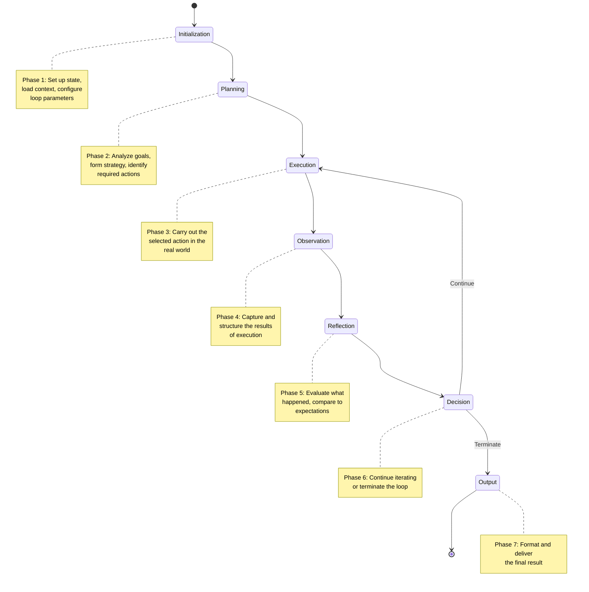

# Loop Lifecycle

## Introduction

Every loop in a loop engineering system has a **lifecycle** — a defined progression from the moment the loop is triggered to the moment it produces a final result and shuts down. Understanding this lifecycle is fundamental because it defines the boundaries of your system, the data flows between phases, and the points where you can inject monitoring, guardrails, and optimization.

This file provides an in-depth examination of each phase in the loop lifecycle, the transitions between them, and how to model the entire lifecycle using LangGraph's `StateGraph`. For a step-by-step walkthrough of what happens *inside* the loop, see [06_How_Loop_Engineering_Works.md](06_How_Loop_Engineering_Works.md). For the building blocks that power each phase, see [09_Core_Components.md](09_Core_Components.md).

---

## The Seven Phases of a Loop Lifecycle

The loop lifecycle consists of seven distinct phases, each with clear inputs, outputs, responsibilities, and boundary conditions:



Let us examine each phase in depth.

---

### Phase 1: Initialization

**Purpose**: Set up everything the loop needs before it starts running.

The initialization phase is the system's "launch sequence." It runs exactly once, before the first iteration begins, and is responsible for creating a clean, well-configured starting state.

**What happens during initialization:**

1. **State Creation**: A fresh state object is instantiated with default values. This state will be the single source of truth throughout the loop's lifetime. In LangGraph, this is the `TypedDict` that defines your graph's state schema.

2. **Context Loading**: Relevant context is gathered and injected into the state. This may include:
   - Conversation history from prior interactions
   - Retrieved documents (if using RAG)
   - User preferences and configuration
   - System prompts and instructions

3. **Parameter Configuration**: Loop-level parameters are set, including:
   - `max_iterations`: The safety cap on how many times the loop can run
   - `timeout`: Maximum wall-clock time before forced termination
   - `tools`: The set of tools available to the loop
   - `model`: Which LLM to use

4. **Goal Definition**: The system's objective is clearly defined in the state. A well-defined goal is critical because the reflection and decision phases will evaluate progress against this goal.

5. **Pre-flight Checks**: Validation that all required dependencies are available — tools are responsive, the LLM is accessible, required data sources are reachable.

```python
from typing import TypedDict, Optional

class LoopLifecycleState(TypedDict):
    """State that persists throughout the entire loop lifecycle."""
    # Initialization outputs
    query: str
    goal: str
    available_tools: list[str]
    max_iterations: int
    timeout_seconds: int
    
    # Runtime state (updated each iteration)
    current_plan: Optional[str]
    last_action: Optional[dict]
    last_observation: Optional[dict]
    reflection_notes: Optional[str]
    iteration_count: int
    consecutive_errors: int
    
    # Lifecycle tracking
    phase: str              # Which phase we're currently in
    status: str             # "running", "completed", "failed", "timeout"
    error_log: list[str]    # Accumulated errors
    
    # Final output
    final_answer: Optional[str]
    metadata: dict          # Iterations used, tools called, etc.

def initialize_loop(query: str, config: dict) -> LoopLifecycleState:
    """Phase 1: Initialize the loop lifecycle."""
    return LoopLifecycleState(
        query=query,
        goal=extract_goal(query),  # Could use LLM or heuristics
        available_tools=config.get("tools", ["search", "calculator"]),
        max_iterations=config.get("max_iterations", 10),
        timeout_seconds=config.get("timeout", 120),
        current_plan=None,
        last_action=None,
        last_observation=None,
        reflection_notes=None,
        iteration_count=0,
        consecutive_errors=0,
        phase="initialization",
        status="running",
        error_log=[],
        final_answer=None,
        metadata={}
    )
```

**Boundary**: Initialization ends when a valid state object exists and the system transitions to Planning. If initialization fails (e.g., the LLM is unreachable), the loop enters a `failed` status immediately without executing any iterations.

---

### Phase 2: Planning

**Purpose**: Analyze the goal and formulate a strategy for achieving it.

Planning is where the system "thinks before it acts." Not every loop architecture includes an explicit planning phase — simpler ReAct loops skip it — but it becomes increasingly important as task complexity grows.

**What happens during planning:**

1. **Goal Analysis**: The system examines the defined goal and breaks it into sub-goals or steps. A complex task like "research the market for EV charging stations in Europe and write a 5-page report" would be decomposed into research, analysis, and writing sub-tasks.

2. **Strategy Formation**: Based on the goal analysis, the system selects a high-level approach. Should it search first and then write? Should it create an outline first? Should it delegate sub-tasks to specialized sub-agents?

3. **Resource Identification**: The system identifies which tools, data sources, or sub-agents it will need.

4. **Plan Storage**: The plan is stored in the state so that subsequent phases (especially reflection) can evaluate whether the plan is being followed or needs adjustment.

```python
def planning_phase(state: LoopLifecycleState) -> LoopLifecycleState:
    """Phase 2: Analyze goal and form a plan."""
    state["phase"] = "planning"
    
    prompt = f"""Given the goal: {state['goal']}
Available tools: {', '.join(state['available_tools'])}

Create a brief step-by-step plan. Be specific about which tools to use.
If the task is simple enough to complete in one step, say so."""

    response = llm.invoke(prompt)
    state["current_plan"] = response.content
    
    return state
```

**Boundary**: Planning transitions to Execution. In systems without explicit planning, the loop goes directly from Initialization to Execution with the first action selected by the LLM's reasoning.

---

### Phase 3: Execution

**Purpose**: Carry out the selected action in the real world.

Execution is the "act" phase — the system actually *does something*. This phase is where the loop interacts with external systems: APIs, databases, file systems, web services, or even other agents.

**What happens during execution:**

1. **Action Dispatch**: The selected action (from planning or from the previous reasoning step) is dispatched to the appropriate executor.

2. **Real-world Interaction**: The executor interacts with external systems. This might be an HTTP request to a search API, a SQL query to a database, or a function call to a code interpreter.

3. **Result Capture**: The raw result of the action is captured before any processing. This raw result is important for debugging and for the observation phase.

4. **Error Handling**: If the action fails, the error is captured along with as much context as possible (error type, message, stack trace, time of failure).

**Critical design considerations:**
- **Idempotency**: Ideally, actions should be idempotent — executing the same action twice with the same inputs produces the same result. This matters because reflection may cause the system to retry an action.
- **Side Effects**: Some actions have real-world side effects (sending emails, writing files). These must be handled carefully, especially if the loop may retry.
- **Timeouts**: Every action should have a timeout. A hanging action stalls the entire loop.

**Boundary**: Execution always transitions to Observation. Even a failed execution produces an observation (an error observation).

---

### Phase 4: Observation

**Purpose**: Capture, structure, and store the results of execution.

The observation phase is the system's "sense" capability. It transforms raw execution results into structured, useful data that the reflection phase can evaluate.

**What happens during observation:**

1. **Result Parsing**: Raw results (JSON, HTML, plain text) are parsed into a consistent format. This might involve extracting specific fields, cleaning up data, or normalizing formats.

2. **Relevance Assessment**: The system may evaluate whether the observation is relevant to the current goal. Irrelevant results can be flagged or discarded.

3. **Memory Storage**: The structured observation is appended to the loop's memory. In LangGraph, this is typically done by appending a `ToolMessage` to the messages list.

4. **Context Window Management**: In systems with limited context, old or low-value observations may be summarized or pruned to make room for new ones.

```python
def observation_phase(state: LoopLifecycleState) -> LoopLifecycleState:
    """Phase 4: Structure the execution result into an observation."""
    state["phase"] = "observation"
    
    raw_result = state.get("raw_execution_result", "")
    
    # Structure the observation
    state["last_observation"] = {
        "action": state["last_action"]["name"],
        "input": state["last_action"]["args"],
        "output": raw_result,
        "status": "success" if raw_result else "error",
        "timestamp": get_current_timestamp(),
        "relevance_score": assess_relevance(raw_result, state["goal"])
    }
    
    # Add to error log if failed
    if state["last_observation"]["status"] == "error":
        state["error_log"].append(
            f"Iteration {state['iteration_count']}: {raw_result}"
        )
        state["consecutive_errors"] += 1
    else:
        state["consecutive_errors"] = 0  # Reset on success
    
    return state
```

**Boundary**: Observation always transitions to Reflection. The structured observation becomes the primary input for reflection.

---

### Phase 5: Reflection

**Purpose**: Evaluate progress, compare outcomes against expectations, and consider adjustments.

Reflection is what separates simple iterative loops from intelligent loop engineering. It is the phase where the system asks itself: *"Did that work? Am I getting closer to my goal? Should I change my approach?"*

**What happens during reflection:**

1. **Outcome Evaluation**: The system compares the observation against its expectations. Was the result what was anticipated? If not, why?

2. **Progress Assessment**: The system evaluates how much closer it is to achieving its goal. Has meaningful progress been made? Is the system stuck in a loop (repeating the same actions)?

3. **Strategy Adjustment**: If progress is insufficient or the approach is failing, the system may revise its plan. This is where self-correction happens.

4. **Confidence Estimation**: The system may estimate its confidence in having achieved the goal. High confidence suggests termination; low confidence suggests another iteration.

```python
def reflection_phase(state: LoopLifecycleState) -> LoopLifecycleState:
    """Phase 5: Reflect on what happened and assess progress."""
    state["phase"] = "reflection"
    
    reflection_prompt = f"""You are reflecting on your progress toward a goal.

Goal: {state['goal']}
Plan: {state['current_plan']}
Last action: {state['last_action']}
Last observation: {state['last_observation']}
Iterations so far: {state['iteration_count']}
Errors so far: {len(state['error_log'])}

Reflect on:
1. Did the last action produce useful results?
2. Are you making progress toward the goal?
3. Should you adjust your plan?
4. Do you have enough information to provide a final answer?

Be concise and specific."""

    response = llm.invoke(reflection_prompt)
    state["reflection_notes"] = response.content
    
    return state
```

**Boundary**: Reflection transitions to Decision. The reflection output is the primary input for the termination/continuation decision.

> **Design Insight**: Reflection is computationally expensive (it requires an LLM call) but dramatically improves loop efficiency. Systems with reflection typically solve complex tasks in fewer iterations than systems without it, even though each iteration takes longer. See [10_Types_of_Loops.md](10_Types_of_Loops.md) for a discussion of Reflection/Self-critique loops.

---

### Phase 6: Decision (Continue or Terminate)

**Purpose**: Determine whether the loop should continue iterating or terminate with a result.

This is the **most critical boundary** in the entire lifecycle. It is the gatekeeper that prevents infinite loops on one hand and premature termination on the other.

**What happens during the decision phase:**

1. **Termination Criteria Evaluation**: The system checks all configured termination conditions:
   - **Goal achievement**: Has the LLM indicated it has a complete answer?
   - **Max iterations**: Has the safety limit been reached?
   - **Timeout**: Has the wall-clock time limit been exceeded?
   - **Error threshold**: Have there been too many consecutive errors?
   - **Stagnation**: Has the system been repeating actions without progress?

2. **Decision Output**: The phase produces a binary decision: `continue` or `terminate`.

3. **Transition**: Based on the decision, the system transitions either back to Execution (for another iteration) or forward to Output.

| Termination Trigger | Type | Description |
|--------------------|------|-------------|
| Goal achieved | **Natural** | The LLM has sufficient information to answer |
| Max iterations reached | **Safety** | Prevents infinite loops and cost overruns |
| Timeout exceeded | **Safety** | Prevents the system from running indefinitely |
| Consecutive errors ≥ N | **Failure** | The system is broken or the task is impossible |
| User interruption | **External** | The user manually stops the loop |
| Empty action space | **Logical** | No valid actions remain to try |

**Boundary**: Decision is a fork. `continue` → Execution. `terminate` → Output. This is the only phase where the lifecycle path diverges.

---

### Phase 7: Output

**Purpose**: Format, validate, and deliver the final result.

The output phase is the loop's "graduation" — it takes the accumulated knowledge from all iterations and produces a polished response for the user.

**What happens during output:**

1. **Result Extraction**: The final answer is extracted from the state (typically from the last LLM response or a dedicated `final_answer` field).

2. **Post-Processing**: The raw answer may be formatted, summarized, or enriched with citations, metadata, or visualizations.

3. **Metadata Attachment**: Loop execution metadata is attached — how many iterations were used, which tools were called, total latency, total cost.

4. **Validation**: The output may be validated against the original goal. Does it actually answer the user's question?

5. **Delivery**: The response is sent to the user through the appropriate channel.

6. **Cleanup**: Any temporary resources (files, database connections, API sessions) are released.

```python
def output_phase(state: LoopLifecycleState) -> LoopLifecycleState:
    """Phase 7: Format and deliver the final result."""
    state["phase"] = "output"
    state["status"] = "completed"
    
    state["metadata"] = {
        "total_iterations": state["iteration_count"],
        "total_errors": len(state["error_log"]),
        "final_plan": state["current_plan"],
        "termination_reason": state.get("termination_reason", "goal_achieved"),
        "tools_used": extract_tools_used(state)
    }
    
    # Validate that we actually have an answer
    if not state.get("final_answer"):
        state["final_answer"] = state.get("reflection_notes", "Unable to produce an answer.")
        state["status"] = "failed"
    
    return state
```

**Boundary**: Output is the terminal phase. After output, the loop's lifecycle is complete. The state object may be persisted for logging, auditing, or used as context for future loops.

---

## Lifecycle State Transitions

The following table summarizes every valid transition between lifecycle phases:

| From | To | Condition | Notes |
|------|----|-----------|-------|
| (start) | Initialization | Loop triggered | Exactly once |
| Initialization | Planning | State initialized successfully | Skip if no explicit planning |
| Initialization | Execution | If no planning phase | Direct to action |
| Planning | Execution | Plan formed | First action selected |
| Execution | Observation | Action completed (success or failure) | Always transitions |
| Observation | Reflection | Observation structured | Always transitions |
| Reflection | Decision | Reflection complete | Always transitions |
| Decision | Execution | `continue` | Loop back |
| Decision | Output | `terminate` | Final answer |
| Output | (end) | Output delivered | Lifecycle complete |

---

## Implementing the Full Lifecycle in LangGraph

The following LangGraph implementation models the complete lifecycle with all seven phases as explicit nodes:

```python
from typing import TypedDict, Literal
from langgraph.graph import StateGraph, END
from langchain_openai import ChatOpenAI

# ── State Definition ──────────────────────────────────────────
class LifecycleState(TypedDict):
    query: str
    goal: str
    plan: str
    messages: list
    last_action: dict
    last_observation: dict
    reflection: str
    iteration_count: int
    max_iterations: int
    error_count: int
    done: bool
    final_answer: str
    phase: str

# ── LLM ───────────────────────────────────────────────────────
llm = ChatOpenAI(model="gpt-4o", temperature=0)

# ── Phase Nodes ───────────────────────────────────────────────

def init_node(state: LifecycleState) -> LifecycleState:
    """Phase 1: Initialization."""
    state["phase"] = "initialization"
    state["iteration_count"] = 0
    state["max_iterations"] = state.get("max_iterations", 10)
    state["error_count"] = 0
    state["done"] = False
    state["final_answer"] = ""
    state["plan"] = ""
    state["reflection"] = ""
    state["goal"] = state["query"]  # Simple: goal = query
    return state

def plan_node(state: LifecycleState) -> LifecycleState:
    """Phase 2: Planning."""
    state["phase"] = "planning"
    resp = llm.invoke(f"Create a brief plan for: {state['goal']}\n"
                      f"Available tools: search, calculator. Be concise.")
    state["plan"] = resp.content
    return state

def execute_node(state: LifecycleState) -> LifecycleState:
    """Phase 3: Execution (simplified tool call)."""
    state["phase"] = "execution"
    # In a real system, the LLM would select and invoke tools here
    state["last_action"] = {"type": "reasoning", "iteration": state["iteration_count"]}
    return state

def observe_node(state: LifecycleState) -> LifecycleState:
    """Phase 4: Observation."""
    state["phase"] = "observation"
    state["last_observation"] = {
        "status": "success",
        "data": f"Observation from iteration {state['iteration_count']}"
    }
    return state

def reflect_node(state: LifecycleState) -> LifecycleState:
    """Phase 5: Reflection."""
    state["phase"] = "reflection"
    resp = llm.invoke(
        f"Goal: {state['goal']}\n"
        f"Plan: {state['plan']}\n"
        f"Observation: {state['last_observation']}\n"
        f"Iteration: {state['iteration_count']}/{state['max_iterations']}\n\n"
        f"Briefly reflect: Are we making progress? Should we continue or stop?"
    )
    state["reflection"] = resp.content
    
    # Simple heuristic: if reflection says "complete" or "answer", mark done
    if any(word in resp.content.lower() for word in ["complete", "answer", "sufficient", "done"]):
        state["done"] = True
        state["final_answer"] = resp.content
    
    return state

def decide_node(state: LifecycleState) -> LifecycleState:
    """Phase 6: Decision."""
    state["phase"] = "decision"
    state["iteration_count"] += 1
    
    # Safety checks override LLM decision
    if state["iteration_count"] >= state["max_iterations"]:
        state["done"] = True
        if not state["final_answer"]:
            state["final_answer"] = "Reached maximum iterations."
    
    return state

def output_node(state: LifecycleState) -> LifecycleState:
    """Phase 7: Output."""
    state["phase"] = "output"
    return state

# ── Routing Function ──────────────────────────────────────────

def route_decision(state: LifecycleState) -> Literal["execute_node", "output_node"]:
    """Route based on decision: continue or terminate."""
    if state.get("done"):
        return "output_node"
    return "execute_node"

# ── Build Graph ───────────────────────────────────────────────

builder = StateGraph(LifecycleState)

builder.add_node("init_node", init_node)
builder.add_node("plan_node", plan_node)
builder.add_node("execute_node", execute_node)
builder.add_node("observe_node", observe_node)
builder.add_node("reflect_node", reflect_node)
builder.add_node("decide_node", decide_node)
builder.add_node("output_node", output_node)

builder.set_entry_point("init_node")
builder.add_edge("init_node", "plan_node")
builder.add_edge("plan_node", "execute_node")
builder.add_edge("execute_node", "observe_node")
builder.add_edge("observe_node", "reflect_node")
builder.add_edge("reflect_node", "decide_node")
builder.add_conditional_edges("decide_node", route_decision, {
    "execute_node": "execute_node",
    "output_node": "output_node"
})
builder.add_edge("output_node", END)

lifecycle_app = builder.compile()
```

---

## Lifecycle Metrics Worth Tracking

Monitoring the lifecycle gives you visibility into system health and performance. Track these metrics for every loop execution:

| Metric | Phase | Why It Matters |
|--------|-------|---------------|
| **Time to first action** | Initialization → Execution | Measures setup overhead |
| **Iterations per task** | Decision | Higher = more expensive, possibly inefficient |
| **Reflection accuracy** | Reflection | How often reflection leads to correct decisions |
| **Termination reason** | Decision | Reveals whether loops end naturally or hit safety limits |
| **Error recovery rate** | Observation → Reflection | % of errors that the loop successfully recovers from |
| **Context utilization** | All phases | How full the context window gets before termination |
| **End-to-end latency** | Full lifecycle | Total time from input to output |

---

## Summary

The loop lifecycle is the backbone of any loop engineering system. It defines a clear, repeatable progression through seven phases: **Initialization → Planning → Execution → Observation → Reflection → Decision → Output**. Each phase has well-defined responsibilities and boundary conditions. The Decision phase is the critical fork that determines whether the loop continues or terminates.

### Cheat Sheet: Lifecycle Phases

| Phase | Key Question | LangGraph Equivalent | Always Runs? |
|-------|-------------|---------------------|-------------|
| 1. Initialization | "What do I need to start?" | Entry node + initial state | Yes, once |
| 2. Planning | "How should I approach this?" | Dedicated planning node | Optional |
| 3. Execution | "What do I do?" | Action/tool node | Every iteration |
| 4. Observation | "What happened?" | Tool message / post-processing | Every iteration |
| 5. Reflection | "Is this working?" | Reflection LLM node | Recommended |
| 6. Decision | "Continue or stop?" | Conditional edge | Every iteration |
| 7. Output | "Here is the answer." | Output node → END | Once, at end |

---

## Glossary

| Term | Definition |
|------|-----------|
| **Lifecycle Phase** | A distinct stage in the loop's progression, with defined inputs and outputs |
| **Boundary** | The transition point between two lifecycle phases |
| **Natural Termination** | Loop ends because the goal was achieved (as opposed to hitting a safety limit) |
| **Reflection** | The process of evaluating progress and considering strategy adjustments |
| **Stagnation** | A condition where the loop repeats actions without making progress |

---

## References

- LangGraph Documentation — [Graph Lifecycle](https://langchain-ai.github.io/langgraph/concepts/low_level/)
- Shinn et al. (2023). "Reflexion: Language Agents with Verbal Reinforcement Learning." *NeurIPS 2023*.
- [06_How_Loop_Engineering_Works.md](06_How_Loop_Engineering_Works.md) — Step-by-step walkthrough of loop mechanics
- [09_Core_Components.md](09_Core_Components.md) — Building blocks that implement each lifecycle phase
- [10_Types_of_Loops.md](10_Types_of_Loops.md) — Different loop types and their lifecycle variations