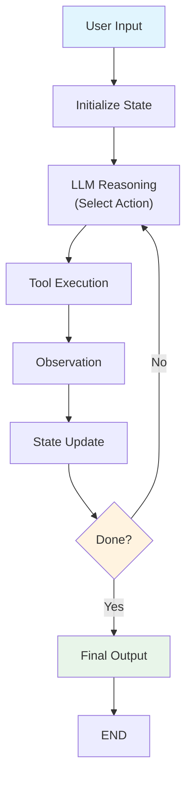
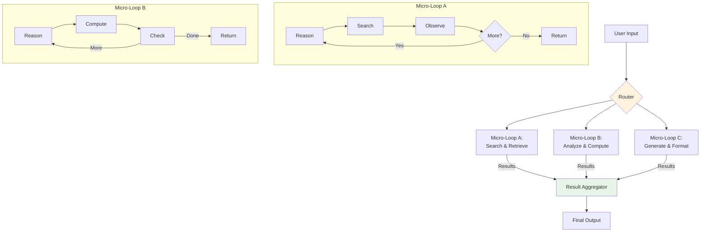
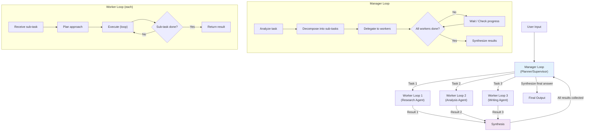
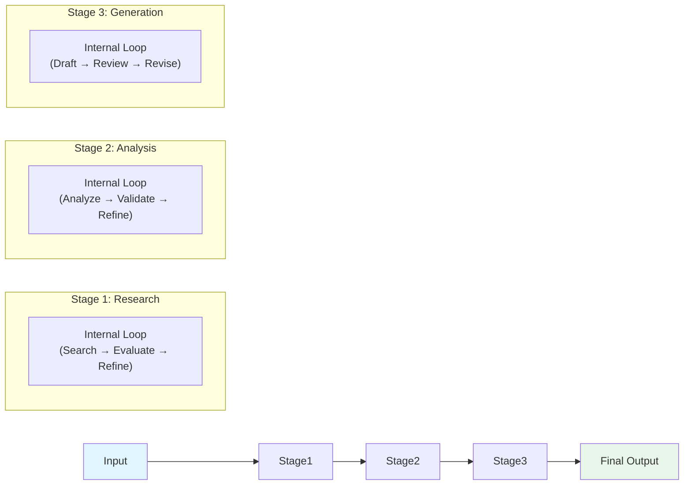
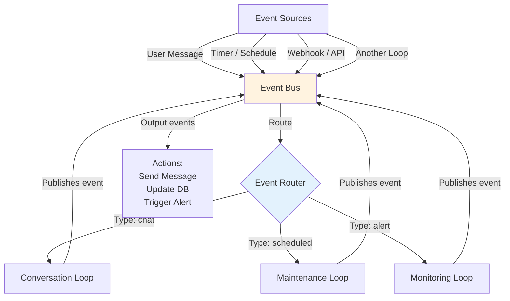

# Loop Architecture

## Introduction

The **architecture** of a loop engineering system determines how its loops are organized, how they communicate, and how work flows through the system. Just as traditional software engineering has architectural patterns (monolith, microservices, event-driven, pipeline), loop engineering has its own set of patterns — each with distinct trade-offs in terms of complexity, scalability, debuggability, and fault tolerance.

This file covers five major architectural patterns for loop-based AI systems, provides Mermaid diagrams for each, compares their trade-offs, and shows LangGraph implementations for the most practical patterns. Understanding these patterns will help you choose the right architecture for your use case. See [07_Loop_Lifecycle.md](07_Loop_Lifecycle.md) for how the lifecycle operates within these architectures, and [10_Types_of_Loops.md](10_Types_of_Loops.md) for the types of loops that fit within each pattern.

---

## Overview of Architectural Patterns

| Pattern | Description | Best For | Complexity |
|---------|-------------|----------|------------|
| **Monolithic Loop** | Single loop handles everything end-to-end | Simple tasks, prototypes | Low |
| **Micro-Loop Architecture** | Many small, specialized loops composed together | Modular systems, reusable components | Medium |
| **Hierarchical Loops** | A planner loop delegates to worker loops | Complex multi-step tasks | High |
| **Pipeline Loops** | Sequential stages, each may loop internally | Data processing, content generation | Medium |
| **Event-Driven Loops** | Loops triggered by events, not sequential flow | Real-time systems, reactive agents | High |

---

## 1. Monolithic Loop Architecture

### What It Is

The monolithic loop is the simplest architecture: a **single loop** that handles the entire task from input to output. All reasoning, action selection, execution, observation, and termination decisions happen within one loop cycle. This is the architecture used by most basic ReAct agents.

### Architecture Diagram



### Characteristics

- **Single state object**: One `TypedDict` flows through the entire loop.
- **Linear flow**: Reason → Act → Observe → Decide → (repeat or finish).
- **All logic in one place**: The LLM prompt does the heavy lifting for planning, action selection, and evaluation.
- **Simple tool set**: A flat list of tools available to the agent.

### When to Use

- Prototyping and rapid development
- Tasks that can be completed in 1-5 iterations
- Systems with a single, well-defined set of tools
- When simplicity and debuggability are top priorities

### When to Avoid

- Complex tasks requiring multiple specialized strategies
- Systems that need to scale to many concurrent users with different tool sets
- When you need fine-grained control over individual phases

### LangGraph Implementation

```python
from typing import TypedDict, Annotated, Literal
from langgraph.graph import StateGraph, END
from langgraph.graph.message import add_messages
from langchain_openai import ChatOpenAI
from langchain_core.messages import HumanMessage, SystemMessage, ToolMessage
from langchain_core.tools import tool

class MonolithicState(TypedDict):
    messages: Annotated[list, add_messages]
    iteration: int
    max_iterations: int

@tool
def search(query: str) -> str:
    """Search for information."""
    return f"Results for: {query}"

@tool
def calculate(expression: str) -> str:
    """Calculate a math expression."""
    return str(eval(expression))

llm = ChatOpenAI(model="gpt-4o").bind_tools([search, calculate])

def agent_node(state: MonolithicState) -> MonolithicState:
    """Single node that does reasoning + action selection."""
    if not state["messages"]:
        state["messages"] = [
            SystemMessage(content="You are a helpful assistant. Use tools when needed."),
            HumanMessage(content="Solve the task step by step.")
        ]
    
    response = llm.invoke(state["messages"])
    state["messages"].append(response)
    state["iteration"] = state.get("iteration", 0) + 1
    return state

def tool_node(state: MonolithicState) -> MonolithicState:
    """Execute tool calls from the last message."""
    last_msg = state["messages"][-1]
    for tc in last_msg.tool_calls:
        tool_map = {"search": search, "calculate": calculate}
        result = tool_map[tc["name"]].invoke(tc["args"])
        state["messages"].append(ToolMessage(content=str(result), tool_call_id=tc["id"]))
    return state

def should_continue(state: MonolithicState) -> Literal["tools", "__end__"]:
    if state["messages"][-1].tool_calls and state["iteration"] < state.get("max_iterations", 10):
        return "tools"
    return "__end__"

graph = StateGraph(MonolithicState)
graph.add_node("agent", agent_node)
graph.add_node("tools", tool_node)
graph.set_entry_point("agent")
graph.add_conditional_edges("agent", should_continue, {"tools": "tools", "__end__": END})
graph.add_edge("tools", "agent")

monolithic_app = graph.compile()
```

---

## 2. Micro-Loop Architecture

### What It Is

Instead of one big loop, the micro-loop architecture breaks the system into **small, focused loops** — each responsible for a single concern — and composes them together. Think of it as the "microservices" pattern for loop engineering.

### Architecture Diagram



### Characteristics

- **Specialization**: Each micro-loop has its own state, tools, and termination criteria.
- **Composability**: Micro-loops can be combined in different orders for different tasks.
- **Independent testing**: Each micro-loop can be tested, optimized, and versioned independently.
- **State sharing**: Results are passed between loops through a shared state or message bus.

### When to Use

- Systems with clearly separable sub-tasks
- Teams building different parts of the system independently
- When you need to reuse loops across multiple workflows
- When different sub-tasks need different LLM models or configurations

### Trade-offs

| Advantage | Disadvantage |
|-----------|-------------|
| Modular and testable | More complex orchestration |
| Independently optimizable | State passing adds overhead |
| Reusable across workflows | Harder to debug cross-loop issues |
| Can use different models per loop | More boilerplate code |

---

## 3. Hierarchical Loop Architecture

### What It Is

The hierarchical architecture uses a **manager loop** (also called a planner or supervisor) that decomposes tasks and delegates to **worker loops**. The manager does not execute actions itself — it plans, delegates, and synthesizes results from its workers.

This is one of the most powerful patterns for complex, multi-step tasks and is the foundation of systems like AutoGPT, BabyAGI, and many multi-agent frameworks.

### Architecture Diagram



### Characteristics

- **Two-tier structure**: A high-level manager and one or more low-level workers.
- **Task decomposition**: The manager breaks complex tasks into smaller, manageable pieces.
- **Delegation**: Workers are assigned specific sub-tasks and operate independently.
- **Result synthesis**: The manager collects and combines worker results into a coherent final answer.
- **Potential for recursion**: Workers can themselves be managers, creating deeper hierarchies.

### LangGraph Implementation

```python
from typing import TypedDict, Literal, Annotated
from langgraph.graph import StateGraph, END
from langchain_openai import ChatOpenAI
from langchain_core.messages import HumanMessage, SystemMessage, AIMessage

# ── State ─────────────────────────────────────────────────────
class HierarchicalState(TypedDict):
    query: str
    plan: list[dict]          # List of sub-tasks
    completed_results: dict   # task_id -> result
    current_task_idx: int
    final_answer: str
    manager_messages: list
    worker_messages: list

llm = ChatOpenAI(model="gpt-4o", temperature=0)

# ── Manager Nodes ─────────────────────────────────────────────

def manager_plan(state: HierarchicalState) -> HierarchicalState:
    """Manager decomposes the task into sub-tasks."""
    prompt = f"""Break this task into sub-tasks. Return a JSON list of tasks.
Each task: {{"id": "...", "description": "...", "type": "research"|"analysis"|"writing"}}
Task: {state['query']}"""
    
    resp = llm.invoke(prompt)
    # Parse the plan (simplified)
    state["plan"] = [
        {"id": "t1", "description": "Research relevant information", "type": "research"},
        {"id": "t2", "description": "Analyze findings", "type": "analysis"},
        {"id": "t3", "description": "Write the final response", "type": "writing"}
    ]
    state["completed_results"] = {}
    state["current_task_idx"] = 0
    return state

def manager_delegate(state: HierarchicalState) -> HierarchicalState:
    """Manager selects the next task to delegate."""
    idx = state["current_task_idx"]
    if idx < len(state["plan"]):
        task = state["plan"][idx]
        state["worker_messages"] = [
            SystemMessage(content=f"You are a {task['type']} specialist."),
            HumanMessage(content=f"Complete this task: {task['description']}\n"
                                f"Context: {state.get('completed_results', {})}")
        ]
    return state

def manager_synthesize(state: HierarchicalState) -> HierarchicalState:
    """Manager combines all worker results into a final answer."""
    results = state["completed_results"]
    prompt = f"""Based on these sub-task results, provide a comprehensive answer.
    Results: {results}
    Original query: {state['query']}"""
    
    resp = llm.invoke(prompt)
    state["final_answer"] = resp.content
    return state

# ── Worker Node ───────────────────────────────────────────────

def worker_execute(state: HierarchicalState) -> HierarchicalState:
    """Worker loop: executes the assigned sub-task."""
    # In a real system, this would be its own loop/graph
    resp = llm.invoke(state["worker_messages"])
    
    # Store result
    task_id = state["plan"][state["current_task_idx"]]["id"]
    state["completed_results"][task_id] = resp.content
    
    # Advance to next task
    state["current_task_idx"] += 1
    return state

# ── Routing ───────────────────────────────────────────────────

def route_after_worker(state: HierarchicalState) -> Literal["delegate", "synthesize"]:
    """Check if all tasks are done."""
    if state["current_task_idx"] >= len(state["plan"]):
        return "synthesize"
    return "delegate"

# ── Build Graph ───────────────────────────────────────────────

graph = StateGraph(HierarchicalState)
graph.add_node("plan", manager_plan)
graph.add_node("delegate", manager_delegate)
graph.add_node("worker", worker_execute)
graph.add_node("synthesize", manager_synthesize)

graph.set_entry_point("plan")
graph.add_edge("plan", "delegate")
graph.add_edge("delegate", "worker")
graph.add_conditional_edges("worker", route_after_worker, {
    "delegate": "delegate",
    "synthesize": "synthesize"
})
graph.add_edge("synthesize", END)

hierarchical_app = graph.compile()
```

---

## 4. Pipeline Loop Architecture

### What It Is

The pipeline architecture arranges loops (or loop stages) in a **fixed sequential order**, like an assembly line. Each stage receives input from the previous stage, processes it (potentially with its own internal loop), and passes output to the next stage.

### Architecture Diagram



### Characteristics

- **Sequential stages**: Data flows in one direction — left to right.
- **Stage independence**: Each stage can have its own loop logic, tools, and LLM configuration.
- **Clear interfaces**: Well-defined inputs and outputs between stages.
- **Parallelizable**: Independent stages can potentially run in parallel.

### When to Use

- Content generation pipelines (research → outline → draft → edit → publish)
- Data processing workflows (extract → transform → load, with validation loops at each step)
- Multi-pass quality improvement (generate → critique → improve → validate)

### LangGraph Implementation

```python
from typing import TypedDict
from langgraph.graph import StateGraph, END

class PipelineState(TypedDict):
    query: str
    research_result: str
    analysis_result: str
    draft: str
    final_output: str

def research_stage(state: PipelineState) -> PipelineState:
    """Stage 1: Research with its own internal loop logic."""
    # Simplified — in practice, this would be a subgraph with its own loop
    state["research_result"] = f"Research data for: {state['query']}"
    return state

def analysis_stage(state: PipelineState) -> PipelineState:
    """Stage 2: Analyze research findings."""
    state["analysis_result"] = f"Analysis of: {state['research_result']}"
    return state

def generation_stage(state: PipelineState) -> PipelineState:
    """Stage 3: Generate final output based on research + analysis."""
    state["draft"] = f"Draft based on: {state['analysis_result']}"
    state["final_output"] = state["draft"]
    return state

graph = StateGraph(PipelineState)
graph.add_node("research", research_stage)
graph.add_node("analysis", analysis_stage)
graph.add_node("generation", generation_stage)

graph.set_entry_point("research")
graph.add_edge("research", "analysis")
graph.add_edge("analysis", "generation")
graph.add_edge("generation", END)

pipeline_app = graph.compile()
```

> **Advanced Tip**: In LangGraph, you can use **subgraphs** to make each pipeline stage a full `StateGraph` with its own internal loop, enabling stages like "draft → critique → revise" to loop internally before passing results to the next stage.

---

## 5. Event-Driven Loop Architecture

### What It Is

In an event-driven architecture, loops are **triggered by events** rather than executing in a predetermined sequence. An event could be a user message, a timer firing, an external system sending a webhook, or the output of another loop completing. This pattern is essential for reactive, real-time AI systems.

### Architecture Diagram



### Characteristics

- **Asynchronous**: Loops run independently and communicate through events.
- **Decoupled**: Loop A does not need to know about Loop B; they communicate through the event bus.
- **Reactive**: The system responds to external stimuli rather than polling.
- **Scalable**: Easy to add new event types and handlers without modifying existing loops.

### When to Use

- Chat systems that need to handle incoming messages asynchronously
- Systems that monitor data sources and react to changes
- Multi-tenant systems where different users trigger different workflows
- Systems that need to integrate with external services via webhooks

### Trade-offs

| Advantage | Disadvantage |
|-----------|-------------|
| Highly scalable and decoupled | Complex to debug and trace |
| Natural fit for real-time systems | Event ordering can be tricky |
| Easy to extend with new handlers | Harder to test end-to-end |
| Resilient to individual loop failures | Requires infrastructure (message broker) |

---

## Architecture Comparison Matrix

The following matrix helps you choose the right architecture based on your requirements:

| Criterion | Monolithic | Micro-Loop | Hierarchical | Pipeline | Event-Driven |
|-----------|-----------|------------|-------------|----------|-------------|
| **Development Speed** | ★★★★★ | ★★★☆☆ | ★★☆☆☆ | ★★★★☆ | ★★☆☆☆ |
| **Scalability** | ★★☆☆☆ | ★★★★☆ | ★★★★☆ | ★★★☆☆ | ★★★★★ |
| **Debuggability** | ★★★★★ | ★★★★☆ | ★★☆☆☆ | ★★★★☆ | ★★☆☆☆ |
| **Flexibility** | ★★☆☆☆ | ★★★★★ | ★★★★☆ | ★★★☆☆ | ★★★★★ |
| **Task Complexity** | Low | Medium | High | Medium | Varies |
| **State Management** | Simple | Medium | Complex | Medium | Complex |
| **Team Collaboration** | Poor | Good | Good | Good | Excellent |
| **LLM Cost** | Low | Medium | High | Medium | Varies |

---

## Choosing the Right Architecture

Use this decision framework:

1. **Start with Monolithic** if you are prototyping or the task is simple. Most LangChain/LangGraph tutorials use this pattern, and it is the fastest way to get something working.

2. **Upgrade to Micro-Loop** when your monolithic loop becomes too large, hard to test, or needs reusable components. This is the natural evolution path.

3. **Choose Hierarchical** when tasks are inherently complex and require decomposition — research tasks, multi-step analysis, or any workflow that benefits from "divide and conquer."

4. **Choose Pipeline** when your workflow has clear sequential stages with different concerns (research → analysis → writing → editing).

5. **Choose Event-Driven** when your system needs to be reactive, real-time, or handle multiple concurrent event streams.

> **Real-World Note**: Production systems often combine multiple patterns. You might have a hierarchical manager that delegates to pipeline sub-graphs, all connected through an event-driven backbone. The patterns are not mutually exclusive.

---

## Summary

Loop architecture is the structural foundation of your AI system. The five patterns — **Monolithic, Micro-Loop, Hierarchical, Pipeline, and Event-Driven** — represent a spectrum from simple to complex, each optimized for different use cases. LangGraph's `StateGraph` and subgraph capabilities make it possible to implement all five patterns within a single framework.

### Cheat Sheet: Architecture Patterns

| Pattern | One-Line Summary | LangGraph Primitive |
|---------|-----------------|-------------------|
| Monolithic | One loop does everything | Single `StateGraph` with conditional edges |
| Micro-Loop | Many small loops composed | Multiple `StateGraph`s composed with `add_node` |
| Hierarchical | Manager delegates to workers | Outer graph delegates to subgraphs |
| Pipeline | Sequential stages, each may loop | Linear edges between stage subgraphs |
| Event-Driven | Loops triggered by events | Custom event handling with LangGraph |

---

## Glossary

| Term | Definition |
|------|-----------|
| **Monolithic Loop** | A single loop that handles an entire task end-to-end |
| **Micro-Loop** | A small, specialized loop designed to be composed with others |
| **Hierarchical Architecture** | A manager loop that decomposes tasks and delegates to worker loops |
| **Pipeline Architecture** | Sequential stages, each potentially containing its own loop |
| **Event-Driven Architecture** | Loops triggered by external events rather than sequential flow |
| **Subgraph** | A LangGraph concept where a complete graph is used as a node within another graph |
| **Task Decomposition** | Breaking a complex task into smaller, manageable sub-tasks |

---

## References

- LangGraph Documentation — [Multi-Agent Workflows](https://langchain-ai.github.io/langgraph/concepts/multi_agent/)
- Significant Gravitas (2024). "AutoGen: Enabling Next-Gen LLM Applications via Multi-Agent Conversation." *Microsoft Research*.
- Li et al. (2023). "Task Decomposition via Large Language Models." *arXiv*.
- [07_Loop_Lifecycle.md](07_Loop_Lifecycle.md) — How the lifecycle operates within each architecture
- [10_Types_of_Loops.md](10_Types_of_Loops.md) — Loop types that fit within these architectures