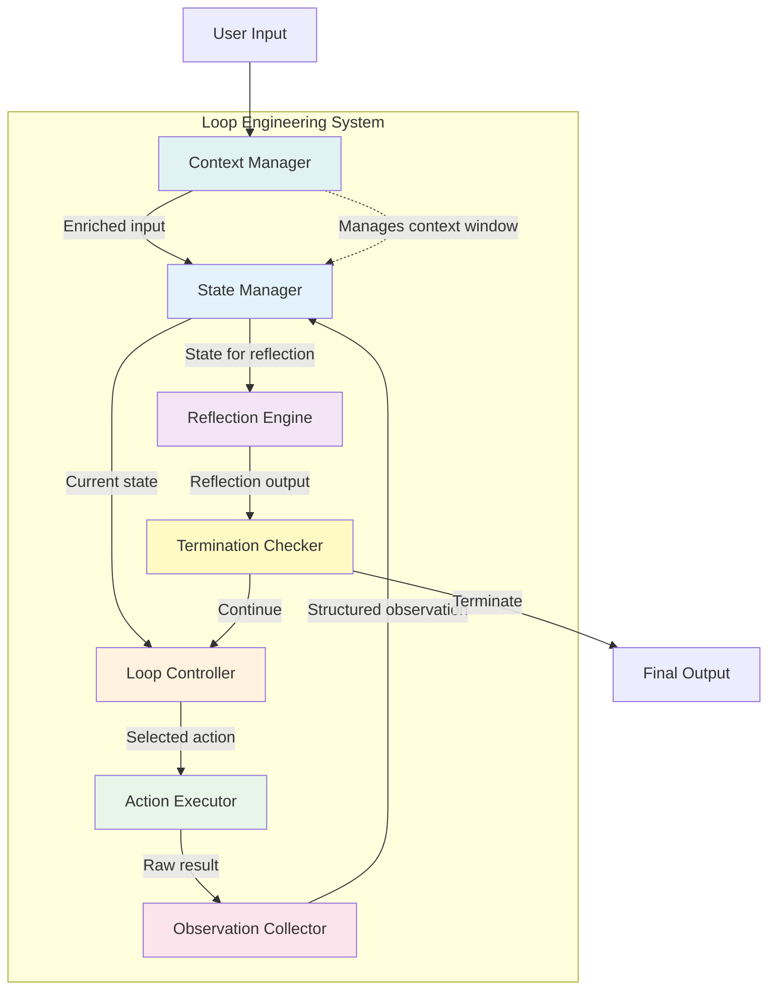
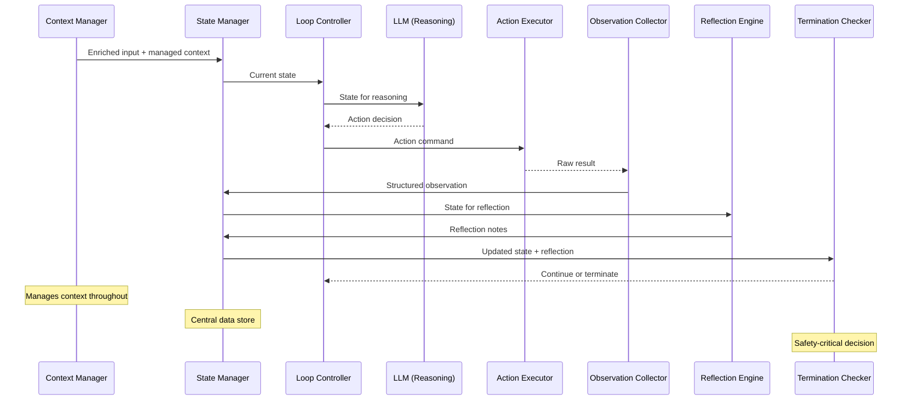

# Core Components

## Introduction

Every loop engineering system, regardless of its architecture (see [08_Loop_Architecture.md](08_Loop_Architecture.md)), is built from a set of **core components** — discrete building blocks that each handle a specific responsibility within the loop lifecycle (see [07_Loop_Lifecycle.md](07_Loop_Lifecycle.md)). Understanding these components is essential because they form the vocabulary you use to design, debug, and optimize loop-based AI systems.

This file provides a deep dive into seven core components: the **State Manager**, **Loop Controller**, **Action Executor**, **Observation Collector**, **Reflection Engine**, **Termination Checker**, and **Context Manager**. For each component, we cover what it does, why it matters, design considerations, and how it maps to LangGraph primitives.

---

## Component Overview



The diagram above shows how data flows between components. The **State Manager** is at the center — every other component either reads from or writes to the state. The **Loop Controller** orchestrates the flow, deciding which component runs next.

---

## 1. State Manager

### What It Does

The State Manager is the **single source of truth** for all data within the loop. It stores the current state of the system, manages state transitions, and ensures that all components read and write from a consistent data structure.

### Why It Matters

Without a central state manager, components would pass data through ad-hoc mechanisms — global variables, function arguments, return values — leading to inconsistencies, race conditions, and bugs that are nearly impossible to debug. The state manager provides:

- **Consistency**: All components see the same data.
- **Traceability**: The complete history of state changes can be logged and replayed.
- **Serialization**: The state can be saved to disk, sent over the network, or stored in a database for later retrieval.
- **Type Safety**: When defined as a `TypedDict` or Pydantic model, the state has a clear schema that prevents data errors.

### Design Considerations

| Consideration | Options | Recommendation |
|--------------|---------|----------------|
| **Data structure** | Dict, TypedDict, Pydantic, dataclass | `TypedDict` for LangGraph compatibility |
| **Immutability** | Mutable vs. immutable state | Prefer immutable with explicit updates |
| **Persistence** | In-memory only vs. persistent | Start in-memory, add persistence later |
| **State size** | Full history vs. sliding window | Use sliding window for long-running loops |
| **Concurrency** | Single-thread vs. thread-safe | LangGraph handles this for most cases |

### LangGraph Equivalent

In LangGraph, the **state schema** (`TypedDict`) and **reducers** (annotated fields with functions like `add_messages`) are the state manager:

```python
from typing import TypedDict, Annotated
from langgraph.graph.message import add_messages

class AgentState(TypedDict):
    """The State Manager — defines what data the loop tracks."""
    # Reducer: new messages are appended, not overwritten
    messages: Annotated[list, add_messages]
    
    # Simple fields: overwritten on each update
    query: str
    iteration_count: int
    max_iterations: int
    tools_called: list[str]
    final_answer: str | None
    error_count: int
```

The `Annotated[list, add_messages]` pattern is LangGraph's built-in reducer — it tells the framework how to merge updates into the state. Without it, each node's return value would overwrite the entire `messages` list instead of appending to it.

---

## 2. Loop Controller

### What It Does

The Loop Controller is the **orchestrator** — it determines the order in which components execute and decides whether the loop should continue or terminate. It implements the control flow logic.

### Why It Matters

The Loop Controller is what makes a system a *loop* rather than a linear pipeline. Without it, the system would execute each component once and stop. The controller introduces the critical decision point: **do we go around again?**

### Responsibilities

1. **Sequencing**: Determines which component runs next based on the current state.
2. **Branching**: Routes execution to different components based on conditions (e.g., if the LLM selected a tool, go to the Action Executor; if it produced a final answer, go to Termination).
3. **Iteration tracking**: Counts and limits loop iterations.
4. **Error routing**: Directs flow to error handling when components fail.

### Design Considerations

| Consideration | Options | Recommendation |
|--------------|---------|----------------|
| **Control style** | Centralized router vs. distributed conditional edges | Distributed (LangGraph conditional edges) |
| **Scheduling** | Fixed order vs. dynamic | Dynamic, based on state |
| **Thread safety** | Single-thread vs. concurrent | Single-thread for most LLM loops |
| **Interruptibility** | Can the loop be paused and resumed? | Yes, use LangGraph checkpoints |

### LangGraph Equivalent

In LangGraph, the Loop Controller is implemented through **edges** — both normal edges and conditional edges:

```python
from typing import Literal
from langgraph.graph import StateGraph, END

def route_after_agent(state: AgentState) -> Literal["tools", "output", "__end__"]:
    """
    Loop Controller: decides what happens next.
    This is the critical branching logic.
    """
    last_message = state["messages"][-1]
    
    # Branch 1: LLM wants to call tools → continue loop
    if last_message.tool_calls:
        return "tools"
    
    # Branch 2: LLM produced a final answer → terminate
    if state.get("final_answer"):
        return "output"
    
    # Branch 3: Max iterations → force termination
    if state.get("iteration_count", 0) >= state.get("max_iterations", 10):
        return "output"
    
    # Branch 4: Continue reasoning
    return "__end__"

# The conditional edge IS the loop controller
graph.add_conditional_edges(
    "agent_node",           # Source node
    route_after_agent,      # Routing function
    {
        "tools": "tool_node",    # → Action Executor
        "output": "output_node", # → Termination
        "__end__": END           # → End the graph
    }
)
```

---

## 3. Action Executor

### What It Does

The Action Executor is the system's "hands" — it takes an action command (selected by the LLM or Loop Controller) and actually performs it in the real world. This is where tool calls happen.

### Why It Matters

Without the Action Executor, the loop would be purely theoretical — reasoning without acting. The Action Executor bridges the gap between the LLM's decisions and real-world effects.

### Types of Actions

| Action Type | Examples | Complexity |
|------------|----------|------------|
| **Information retrieval** | Web search, database query, file read | Low-Medium |
| **Computation** | Calculator, code execution, data processing | Low |
| **External API calls** | Weather API, stock API, email sending | Medium |
| **Content generation** | Writing text, generating images, creating code | Medium |
| **System operations** | File write, database update, configuration change | High (side effects!) |
| **Human interaction** | Asking the user a question, presenting options | Low (but adds latency) |

### Design Considerations

| Consideration | Recommendation |
|--------------|----------------|
| **Timeout** | Every action must have a timeout (typically 10-30 seconds) |
| **Idempotency** | Prefer idempotent actions; retrying should be safe |
| **Error handling** | Wrap every action in try/except; never let an action crash the loop |
| **Side effects** | Clearly mark actions with side effects; consider confirmation steps |
| **Rate limiting** | Respect API rate limits; implement backoff logic |

### LangGraph Equivalent

In LangGraph, the Action Executor is typically a **tool node** or a custom node that processes `tool_calls`:

```python
from langchain_core.tools import tool
from langchain_core.messages import ToolMessage

@tool
def search_web(query: str) -> str:
    """Search the web for information."""
    # Real implementation would call a search API
    return f"Search results for: {query}"

@tool
def run_code(code: str) -> str:
    """Execute Python code safely."""
    # In production, use a sandboxed executor
    try:
        local_vars = {}
        exec(code, {"__builtins__": {}}, local_vars)
        return str(local_vars.get("result", "Code executed successfully"))
    except Exception as e:
        return f"Error: {str(e)}"

# Tool registry
TOOL_REGISTRY = {
    "search_web": search_web,
    "run_code": run_code
}

def action_executor_node(state: AgentState) -> AgentState:
    """
    Action Executor: processes tool calls from the last LLM message.
    This is where the loop interacts with the real world.
    """
    last_message = state["messages"][-1]
    
    for tool_call in last_message.tool_calls:
        tool_name = tool_call["name"]
        tool_args = tool_call["args"]
        tool_call_id = tool_call["id"]
        
        try:
            tool_fn = TOOL_REGISTRY[tool_name]
            result = tool_fn.invoke(tool_args)
            
            # Success path
            tool_message = ToolMessage(
                content=str(result),
                tool_call_id=tool_call_id
            )
        except KeyError:
            tool_message = ToolMessage(
                content=f"Unknown tool: {tool_name}",
                tool_call_id=tool_call_id
            )
        except Exception as e:
            tool_message = ToolMessage(
                content=f"Tool error: {str(e)}",
                tool_call_id=tool_call_id
            )
        
        state["messages"].append(tool_message)
        state["tools_called"].append(tool_name)
    
    return state
```

---

## 4. Observation Collector

### What It Does

The Observation Collector takes the raw output from the Action Executor and transforms it into a **structured, useful observation** that the rest of the system can work with. It is the system's "sense organ."

### Why It Matters

Raw tool outputs are often messy — they may contain HTML, JSON with irrelevant fields, error messages in unusual formats, or far more data than the LLM's context window can handle. The Observation Collector cleans, structures, and truncates observations so they are maximally useful and minimally wasteful.

### Key Responsibilities

1. **Parsing**: Extract relevant data from raw outputs (e.g., extracting the answer from a search results page).
2. **Formatting**: Convert data into a consistent format the LLM can easily process.
3. **Truncation**: Ensure observations fit within context window limits.
4. **Relevance scoring**: Optionally score how relevant an observation is to the current goal.
5. **Error classification**: Categorize errors (network, auth, data, logic) for better recovery decisions.

### LangGraph Equivalent

In LangGraph, observation collection often happens inline within the tool node or as a separate post-processing node:

```python
def observation_collector_node(state: AgentState) -> AgentState:
    """
    Observation Collector: processes raw tool results into structured observations.
    Can be a separate node or integrated into the action executor.
    """
    last_tool_message = state["messages"][-1]
    
    # Structure the observation
    observation = {
        "source": "tool_call",
        "raw_output": last_tool_message.content,
        "truncated_output": truncate(last_tool_message.content, max_chars=2000),
        "timestamp": datetime.utcnow().isoformat(),
        "iteration": state["iteration_count"]
    }
    
    # In a more sophisticated system, you might:
    # - Extract key facts from the observation
    # - Score relevance to the goal
    # - Store in a separate knowledge base
    # - Summarize if the observation is too long
    
    state["last_observation"] = observation
    return state

def truncate(text: str, max_chars: int = 2000) -> str:
    """Truncate text to fit in context window, preserving useful info."""
    if len(text) <= max_chars:
        return text
    return text[:max_chars-100] + "\n...[truncated]..."
```

---

## 5. Reflection Engine

### What It Does

The Reflection Engine is the system's capacity for **self-evaluation**. After each iteration (or after a sequence of iterations), it examines what has happened, compares progress against the goal, and considers whether the current approach is working.

### Why It Matters

Without reflection, a loop is blind — it simply repeats the reason-act-observe cycle without learning from its experiences. The Reflection Engine transforms a simple iterative loop into an intelligent, adaptive system. Systems with reflection consistently outperform those without it on complex tasks.

### Reflection Strategies

| Strategy | Description | Cost | Effectiveness |
|----------|-------------|------|--------------|
| **Implicit Reflection** | The LLM naturally reflects as part of its next reasoning step | Zero (no extra call) | Low |
| **Explicit Prompt Reflection** | A dedicated LLM call asking "how is it going?" | 1 extra LLM call per iteration | Medium |
| **Reflection on Failure** | Only reflect when an action fails | Occasional LLM call | Medium |
| **Periodic Reflection** | Reflect every N iterations | Reduced LLM calls | Medium-High |
| **Reflection with Memory** | Reflect using a history of all past reflections | Higher memory usage | High |

### LangGraph Equivalent

```python
def reflection_engine_node(state: AgentState) -> AgentState:
    """
    Reflection Engine: evaluates progress and identifies potential issues.
    This is what makes the loop intelligent rather than merely iterative.
    """
    last_obs = state.get("last_observation", {})
    
    reflection_prompt = f"""You are reflecting on your progress in a loop.

Goal: {state['query']}
Current iteration: {state['iteration_count']}
Actions taken: {state.get('tools_called', [])}
Last observation: {last_obs.get('truncated_output', 'N/A')}
History of actions: {summarize_history(state)}

Please reflect (2-3 sentences max):
1. Is the current approach working?
2. Should the strategy change?
3. Are there any concerns (repeated actions, dead ends)?
4. Do you have enough information to answer the original query?"""

    response = llm.invoke(reflection_prompt)
    state["reflection"] = response.content
    
    # Extract structured signals from reflection
    state["should_change_strategy"] = any(
        phrase in response.content.lower()
        for phrase in ["change approach", "try different", "not working", "alternative"]
    )
    state["confident_enough"] = any(
        phrase in response.content.lower()
        for phrase in ["enough information", "can answer", "sufficient", "confident"]
    )
    
    return state
```

---

## 6. Termination Checker

### What It Does

The Termination Checker evaluates whether the loop should **stop** and produce a final answer. It is the safety mechanism that prevents infinite loops and the quality mechanism that ensures the loop terminates with a useful result.

### Why It Matters

An unterminated loop burns tokens, wastes money, and provides no value to the user. The Termination Checker is the most safety-critical component in the system. It must balance two competing concerns:

- **Completeness**: Don't terminate too early (incomplete answers frustrate users).
- **Safety**: Don't let the loop run forever (wasted resources).

### Termination Conditions

| Condition | Type | Priority | Configuration |
|-----------|------|----------|--------------|
| LLM signals completion | Natural | — | Built into LLM behavior |
| Goal satisfaction check | Natural | — | Custom evaluation logic |
| Max iterations reached | Safety | High | `max_iterations: 10` |
| Wall-clock timeout | Safety | High | `timeout: 120s` |
| Token budget exhausted | Safety | Medium | Track `total_tokens` |
| Consecutive error count | Failure | High | `max_consecutive_errors: 3` |
| Stagnation detection | Efficiency | Medium | Detect repeated actions |
| User interruption | External | — | Manual cancel signal |

### LangGraph Equivalent

The Termination Checker is implemented as a **conditional edge function** in LangGraph — it returns the name of the next node, including `END`:

```python
def termination_checker(state: AgentState) -> Literal["continue", "end"]:
    """
    Termination Checker: the critical safety and quality gate.
    Returns "continue" to loop again or "end" to terminate.
    """
    # ── Natural termination: LLM has an answer ──────────────
    if state.get("confident_enough") or state.get("final_answer"):
        return "end"
    
    # ── Safety: max iterations ─────────────────────────────
    if state.get("iteration_count", 0) >= state.get("max_iterations", 10):
        state["termination_reason"] = "max_iterations"
        return "end"
    
    # ── Safety: consecutive errors ─────────────────────────
    if state.get("error_count", 0) >= 3:
        state["termination_reason"] = "consecutive_errors"
        return "end"
    
    # ── Efficiency: stagnation detection ───────────────────
    recent_tools = state.get("tools_called", [-5:])
    if len(recent_tools) >= 3:
        if len(set(recent_tools[-3:])) == 1:
            # Same tool called 3 times in a row — likely stuck
            state["termination_reason"] = "stagnation"
            return "end"
    
    # ── Default: continue looping ──────────────────────────
    return "continue"

# Used in the graph
graph.add_conditional_edges(
    "reflection_node",
    termination_checker,
    {"continue": "agent_node", "end": "output_node"}
)
```

---

## 7. Context Manager

### What It Does

The Context Manager handles the **context window** — the limited amount of text that the LLM can process in a single call. It is responsible for ensuring that the most relevant information fits within the window and that less relevant information is pruned or summarized.

### Why It Matters

LLM context windows are finite (typically 8K-128K tokens). In a loop that accumulates observations, tool results, and reasoning traces, the context can fill up quickly. Once the context overflows, the system either crashes or silently loses information. The Context Manager prevents this.

### Strategies

| Strategy | Description | When to Use |
|----------|-------------|-------------|
| **Full context** | Keep everything, hope it fits | Short tasks (< 5 iterations) |
| **Sliding window** | Keep only the last N observations | Long-running loops |
| **Summarization** | Periodically summarize old context | Complex, long-running tasks |
| **Selective retention** | Keep the goal + last observation + key facts | When context is very tight |
| **Hierarchical context** | Different detail levels (full recent, summary older) | Production systems |

### LangGraph Equivalent

The Context Manager does not have a single LangGraph primitive — it is implemented through **state management patterns** and custom nodes:

```python
def context_manager_node(state: AgentState) -> AgentState:
    """
    Context Manager: ensures the state fits within the LLM's context window.
    Implements a sliding window + summarization strategy.
    """
    messages = state["messages"]
    max_messages = 20  # Keep last 20 messages
    
    if len(messages) > max_messages:
        # Keep system message + last N messages
        system_msgs = [m for m in messages if m.type == "system"]
        other_msgs = [m for m in messages if m.type != "system"]
        
        # Summarize the pruned messages
        pruned = other_msgs[:-max_messages + len(system_msgs)]
        if pruned:
            summary = llm.invoke(
                f"Summarize these messages concisely: "
                f"{[m.content[:200] for m in pruned]}"
            )
            summary_msg = SystemMessage(content=f"[Previous context summary]: {summary.content}")
            state["messages"] = system_msgs + [summary_msg] + other_msgs[-max_messages + len(system_msgs):]
    
    return state
```

---

## Component Interaction Diagram

The following diagram shows how all seven components interact within a single loop iteration:



---

## Summary

The seven core components — **State Manager, Loop Controller, Action Executor, Observation Collector, Reflection Engine, Termination Checker, and Context Manager** — are the building blocks of every loop engineering system. Each has a clear responsibility, and together they form a complete, production-ready loop. In LangGraph, these components map to specific primitives: TypedDict for state, edges for control, tool nodes for execution, and conditional edges for termination.

### Cheat Sheet: Components and Their LangGraph Equivalents

| Component | Responsibility | LangGraph Primitive |
|-----------|---------------|-------------------|
| State Manager | Central data store | `TypedDict` + annotated reducers |
| Loop Controller | Orchestration and routing | Edges (normal + conditional) |
| Action Executor | Execute tool calls | Tool node / custom executor node |
| Observation Collector | Structure tool results | Post-processing in tool node |
| Reflection Engine | Self-evaluation | Custom reflection node |
| Termination Checker | Safety and completion gate | Conditional edge function |
| Context Manager | Context window management | Custom node or state reducer |

---

## Glossary

| Term | Definition |
|------|-----------|
| **Component** | A discrete building block with a specific responsibility in the loop system |
| **State Manager** | The central data store that maintains the loop's state |
| **Loop Controller** | The orchestrator that determines execution order and routing |
| **Action Executor** | The component that performs real-world actions (tool calls) |
| **Observation Collector** | The component that structures raw execution results |
| **Reflection Engine** | The component that enables self-evaluation and strategy adjustment |
| **Termination Checker** | The safety gate that decides whether to continue or stop |
| **Context Manager** | The component that manages the LLM's context window |

---

## References

- LangGraph Documentation — [StateGraph Concepts](https://langchain-ai.github.io/langgraph/concepts/low_level/)
- LangChain Documentation — [Tool Calling](https://python.langchain.com/docs/how_to/tool_calling/)
- Shinn et al. (2023). "Reflexion: Language Agents with Verbal Reinforcement Learning." *NeurIPS 2023*.
- [06_How_Loop_Engineering_Works.md](06_How_Loop_Engineering_Works.md) — How these components work together in practice
- [07_Loop_Lifecycle.md](07_Loop_Lifecycle.md) — The lifecycle phases each component participates in