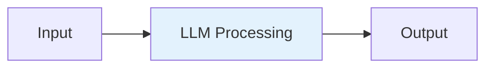
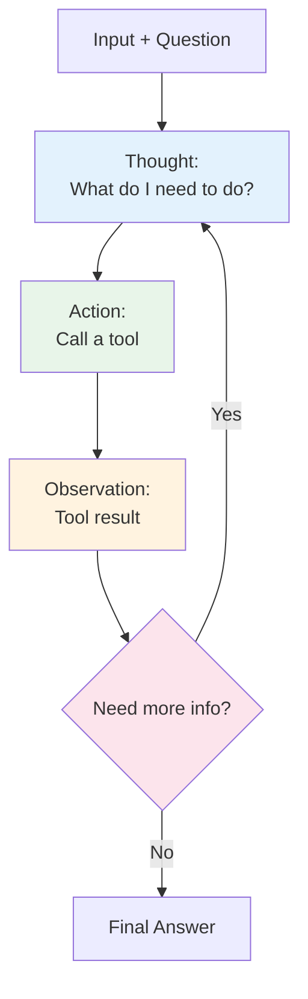
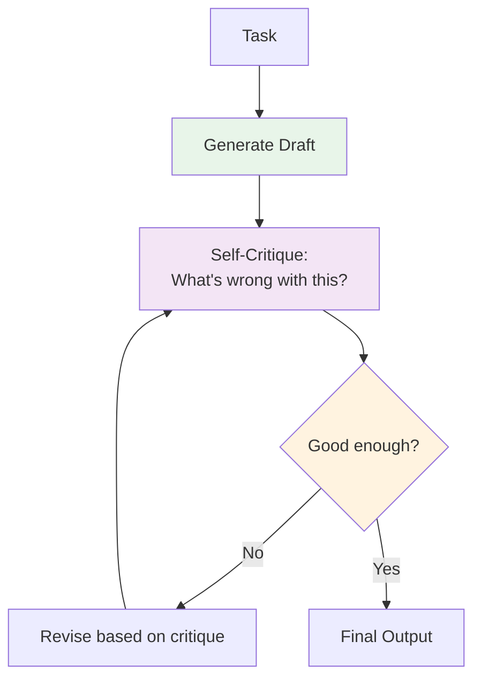
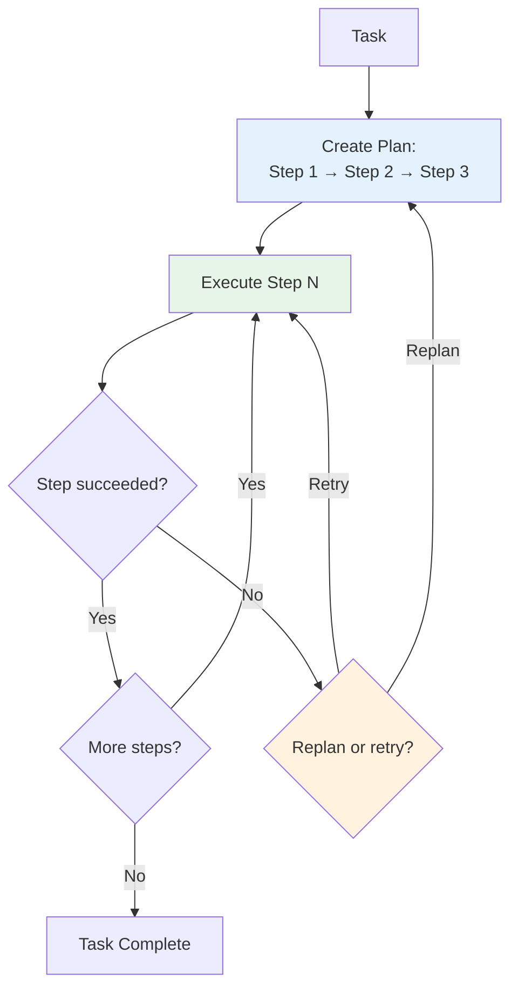
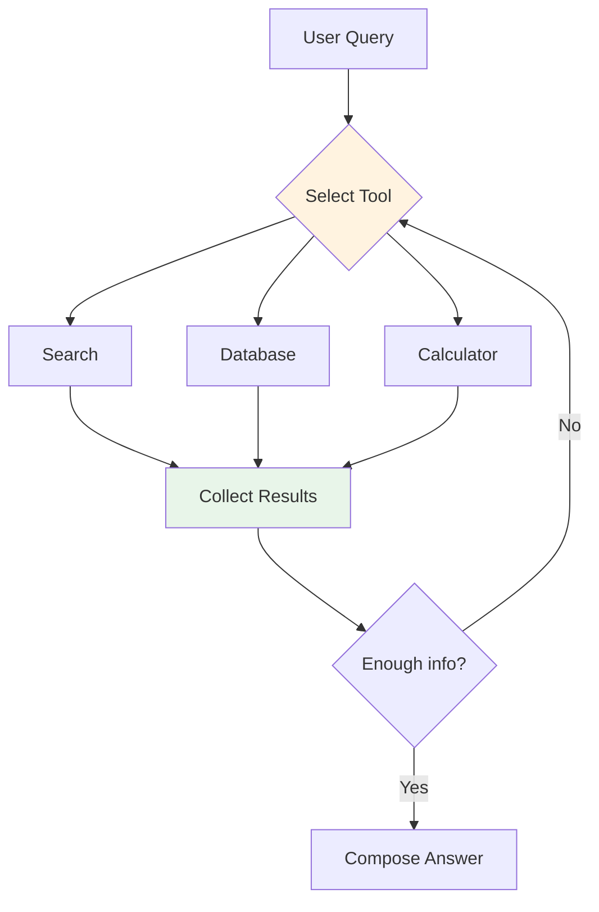
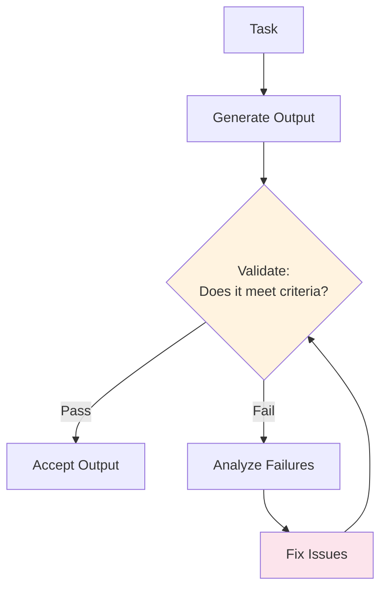
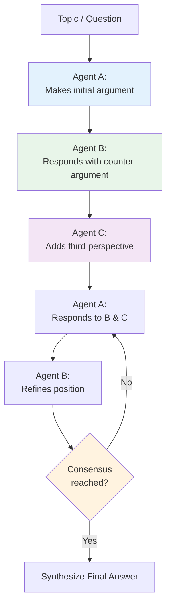
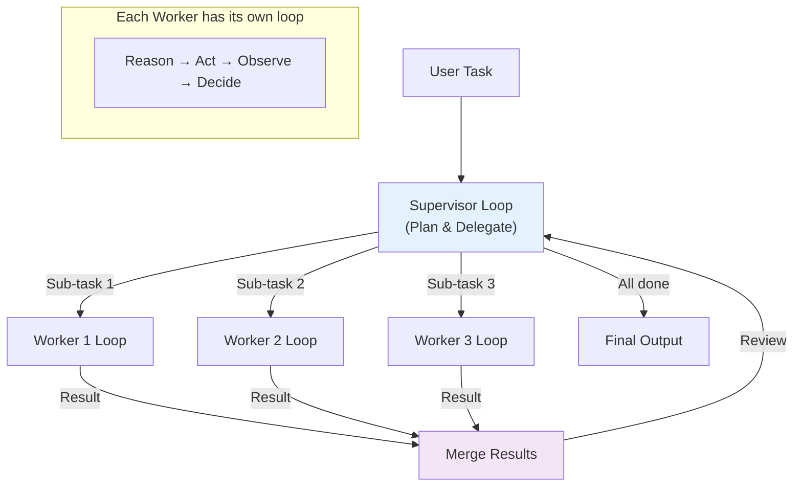
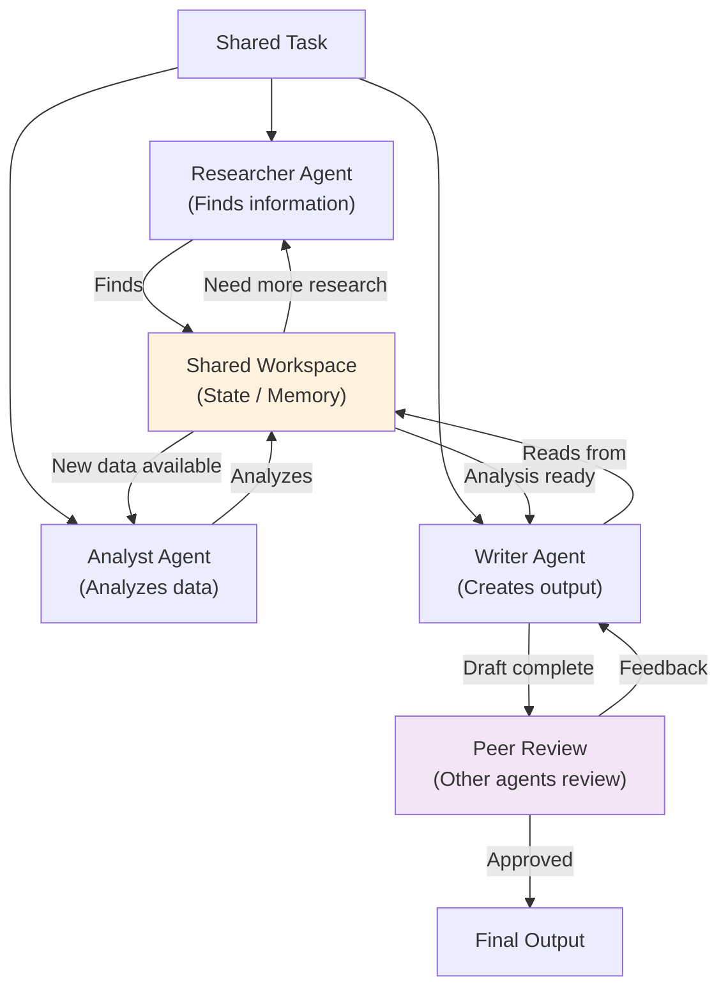

# Types of Loops

## Introduction

Not all loops are created equal. The term "loop engineering" encompasses a wide variety of iterative patterns, each optimized for different types of tasks, different levels of complexity, and different performance requirements. Choosing the right loop type for your task is one of the most impactful architectural decisions you will make.

This file presents a comprehensive taxonomy of nine loop types, from the simplest single-step loops to complex multi-agent deliberation systems. For each type, we provide a definition, explain when to use it, include a Mermaid diagram, and show a brief LangGraph code snippet. See [08_Loop_Architecture.md](08_Loop_Architecture.md) for how these loop types fit into larger architectural patterns, and [09_Core_Components.md](09_Core_Components.md) for the building blocks that implement them.

---

## Comparison Table: All Loop Types

| Loop Type | Iterations | LLM Calls/Iter | Complexity | Best For |
|-----------|-----------|----------------|------------|----------|
| **Single-Step** | 1 | 1 | ★☆☆☆☆ | Simple queries, classification |
| **ReAct** | 1-10 | 1-2 | ★★☆☆☆ | Tool-augmented reasoning |
| **Reflection/Self-Critique** | 2-5 | 2 | ★★★☆☆ | Writing, code generation |
| **Planning** | 2-8 | 1-2 | ★★★☆☆ | Complex multi-step tasks |
| **Tool-Calling** | 1-15 | 1 | ★★☆☆☆ | Data retrieval, API interaction |
| **Correction** | 2-6 | 1-2 | ★★★☆☆ | Tasks requiring validation |
| **Debate/Deliberation** | 3-10 | N (one per agent) | ★★★★☆ | Critical analysis, decisions |
| **Hierarchical** | Variable | Variable | ★★★★★ | Complex, decomposable tasks |
| **Multi-Agent** | Variable | Variable | ★★★★★ | Collaborative problem-solving |

---

## 1. Single-Step Loops

### Definition

A single-step loop executes exactly one LLM call with no iteration. The input goes in, the LLM processes it, and the output comes out. Technically, this is not really a "loop" — it is the degenerate case where the loop body executes once and terminates.

### When to Use

- Simple question answering
- Text classification or categorization
- Summarization of a single document
- Translation
- Any task where one LLM call is sufficient

### Diagram



### Code Snippet

```python
from langchain_openai import ChatOpenAI
from langchain_core.messages import HumanMessage

llm = ChatOpenAI(model="gpt-4o")
response = llm.invoke([HumanMessage(content="What is the capital of France?")])
print(response.content)  # "Paris"
```

> **Note**: While trivially simple, single-step loops are the foundation. Every more complex loop type builds on top of this pattern by adding iteration.

---

## 2. ReAct Loops

### Definition

ReAct (Reasoning + Acting) is the most common loop pattern in AI agents. The LLM alternates between **reasoning** (thinking about what to do) and **acting** (calling a tool), observing the result, and then reasoning again. This cycle repeats until the LLM decides it has enough information to provide a final answer.

ReAct was introduced by Yao et al. (2023) and has become the default pattern for tool-using AI agents.

### When to Use

- Tasks requiring external information (search, database lookups)
- Multi-step reasoning problems
- Any task where the LLM needs to interact with tools
- General-purpose agent behavior

### Diagram



### Code Snippet

```python
from typing import TypedDict, Annotated, Literal
from langgraph.graph import StateGraph, END
from langgraph.graph.message import add_messages
from langchain_openai import ChatOpenAI
from langchain_core.tools import tool
from langchain_core.messages import ToolMessage

@tool
def search(query: str) -> str:
    """Search the web."""
    return f"Results for: {query}"

class ReActState(TypedDict):
    messages: Annotated[list, add_messages]
    iteration: int

llm = ChatOpenAI(model="gpt-4o").bind_tools([search])

def react_reason(state: ReActState) -> ReActState:
    """ReAct: Reason about what to do next."""
    if not state["messages"]:
        state["messages"] = [HumanMessage(content="What is the population of Tokyo?")]
    response = llm.invoke(state["messages"])
    state["messages"].append(response)
    state["iteration"] = state.get("iteration", 0) + 1
    return state

def react_act(state: ReActState) -> ReActState:
    """ReAct: Execute the selected tool."""
    for tc in state["messages"][-1].tool_calls:
        result = search.invoke(tc["args"])
        state["messages"].append(
            ToolMessage(content=result, tool_call_id=tc["id"])
        )
    return state

def should_continue(state: ReActState) -> Literal["act", "__end__"]:
    if state["messages"][-1].tool_calls and state["iteration"] < 10:
        return "act"
    return "__end__"

graph = StateGraph(ReActState)
graph.add_node("reason", react_reason)
graph.add_node("act", react_act)
graph.set_entry_point("reason")
graph.add_conditional_edges("reason", should_continue, {"act": "act", "__end__": END})
graph.add_edge("act", "reason")
react_app = graph.compile()
```

---

## 3. Reflection / Self-Critique Loops

### Definition

In a reflection loop, the LLM generates an output, then **critiques its own output** in a separate pass, and then revises based on that critique. The loop continues until the critique is satisfied or a maximum number of revision cycles is reached.

This pattern is particularly powerful for creative tasks and code generation, where the first draft is rarely the best.

### When to Use

- Writing and content generation (draft → critique → revise)
- Code generation (write → review → fix)
- Any task where quality improves through self-evaluation
- When you have budget for multiple LLM calls per output

### Diagram



### Code Snippet

```python
def reflection_loop(task: str, max_revisions: int = 3) -> str:
    """Reflection loop: generate, critique, revise."""
    draft = llm.invoke(f"Complete this task: {task}").content
    
    for i in range(max_revisions):
        critique = llm.invoke(
            f"Task: {task}\n\nDraft:\n{draft}\n\n"
            f"Critique this draft. What's wrong? What's missing? Be specific."
        ).content
        
        if "looks good" in critique.lower() or "no issues" in critique.lower():
            break  # Critique is satisfied
        
        draft = llm.invoke(
            f"Task: {task}\n\nPrevious draft:\n{draft}\n\n"
            f"Critique:\n{critique}\n\n"
            f"Revise the draft to address the critique."
        ).content
    
    return draft
```

> **Key Insight**: The reflection loop's power comes from the separation between generation and evaluation. The LLM is often better at critiquing text than generating it from scratch, because critique is a more constrained task.

---

## 4. Planning Loops

### Definition

A planning loop explicitly separates **planning** from **execution**. The LLM first creates a plan (a sequence of steps to achieve the goal), then executes each step, potentially replanning if a step fails or the plan proves inadequate.

### When to Use

- Complex tasks with clear sub-goals
- Tasks where the order of operations matters
- When you need visibility into the system's strategy before execution
- Tasks that benefit from "thinking before acting"

### Diagram



### Code Snippet

```python
def planning_loop(task: str, max_steps: int = 10) -> str:
    """Planning loop: plan, execute, evaluate, adapt."""
    
    # Create initial plan
    plan = llm.invoke(
        f"Create a step-by-step plan for: {task}. "
        f"Return a numbered list of steps."
    ).content
    
    results = []
    for step_num, step in enumerate(plan.split('\n')):
        if step_num >= max_steps:
            break
        
        # Execute step
        result = llm.invoke(
            f"Task: {task}\nPlan so far: {plan}\n"
            f"Completed steps: {results}\n"
            f"Current step: {step}\nExecute this step."
        ).content
        results.append(result)
    
    # Synthesize final answer
    return llm.invoke(
        f"Task: {task}\nStep results: {results}\n"
        f"Provide a final comprehensive answer."
    ).content
```

---

## 5. Tool-Calling Loops

### Definition

A tool-calling loop is a focused variant of the ReAct pattern where the primary purpose is **calling one or more tools** to gather information. The LLM selects tools, observes results, and may call more tools, until it has gathered sufficient information to answer the query.

This is the most commonly deployed loop type in production AI systems.

### When to Use

- Retrieval-augmented generation (RAG) with multiple data sources
- Systems that interact with databases, APIs, or file systems
- Data analysis workflows (query → visualize → refine)
- Any system where the LLM needs external data

### Diagram



### Code Snippet

```python
from langchain_openai import ChatOpenAI
from langchain_core.tools import tool
from langchain.agents import create_tool_calling_agent, AgentExecutor

@tool
def query_database(sql: str) -> str:
    """Execute a SQL query against the database."""
    return f"Query result: SELECT * FROM users WHERE ... (5 rows)"

@tool
def get_current_time() -> str:
    """Get the current date and time."""
    from datetime import datetime
    return datetime.now().isoformat()

tools = [query_database, get_current_time]
llm = ChatOpenAI(model="gpt-4o").bind_tools(tools)

# This is the tool-calling loop in its simplest form
agent = create_tool_calling_agent(llm, tools, prompt_template)
executor = AgentExecutor(agent=agent, tools=tools, max_iterations=10)
result = executor.invoke({"input": "How many users signed up this month?"})
```

---

## 6. Correction Loops

### Definition

A correction loop focuses on **validating and fixing** outputs. The system generates an output, validates it against some criteria (a test suite, a rubric, a set of constraints), and if validation fails, it corrects and retries.

### When to Use

- Code generation (write code → run tests → fix bugs → retry)
- Structured data generation (generate → validate schema → fix → retry)
- Any task with clear, automatable success criteria
- When correctness is more important than speed

### Diagram



### Code Snippet

```python
def correction_loop(task: str, validator, max_attempts: int = 5) -> str:
    """Correction loop: generate, validate, fix."""
    
    for attempt in range(max_attempts):
        # Generate or fix
        if attempt == 0:
            output = llm.invoke(f"Complete this task: {task}").content
        else:
            output = llm.invoke(
                f"Task: {task}\n"
                f"Previous attempt: {previous_output}\n"
                f"Validation errors: {errors}\n"
                f"Fix the errors and provide the corrected output."
            ).content
        
        # Validate
        is_valid, errors = validator(output)
        
        if is_valid:
            return output
        
        previous_output = output
    
    return output  # Return last attempt even if invalid
```

> **Real-World Example**: This pattern is used in systems like **SWE-agent** and **Devin**, where generated code is executed against test suites, and failures are fed back to the LLM for correction.

---

## 7. Debate / Deliberation Loops

### Definition

In a debate loop, **multiple LLM instances** (often with different system prompts or perspectives) discuss a topic, argue for different positions, and arrive at a consensus or a more nuanced answer. Each "agent" takes a turn, responds to the others, and the debate continues until a resolution is reached.

### When to Use

- Complex decision-making with competing considerations
- Critical analysis where bias is a concern
- Legal, ethical, or policy analysis
- When you need to explore multiple perspectives before concluding
- Fact-checking (one agent claims, another verifies)

### Diagram



### Code Snippet

```python
def debate_loop(question: str, rounds: int = 3) -> str:
    """Debate loop: multiple agents discuss and deliberate."""
    
    agents = [
        {"name": "Analyst", "perspective": "Focus on data and evidence"},
        {"name": "Devil's Advocate", "perspective": "Challenge assumptions and find weaknesses"},
        {"name": "Synthesizer", "perspective": "Find common ground and balanced conclusions"}
    ]
    
    messages = [HumanMessage(content=question)]
    
    for round_num in range(rounds):
        for agent in agents:
            response = llm.invoke([
                SystemMessage(content=f"You are {agent['name']}. {agent['perspective']}."),
                *messages
            ])
            messages.append(AIMessage(
                content=f"[{agent['name']}]: {response.content}"
            ))
    
    # Final synthesis
    final = llm.invoke([
        SystemMessage(content="Synthesize the debate into a final, balanced answer."),
        *messages
    ])
    
    return final.content
```

---

## 8. Hierarchical Loops

### Definition

A hierarchical loop uses a **planner/supervisor loop** at the top level that decomposes tasks and delegates to **worker loops** at a lower level. Workers execute their assigned sub-tasks and return results to the supervisor, which may delegate more work or synthesize the final answer.

This is the architecture behind systems like AutoGPT, BabyAGI, and LangGraph's multi-agent patterns.

### When to Use

- Complex, multi-step tasks that can be decomposed
- Research tasks (investigate topic → write report)
- Software development (plan → implement → test → deploy)
- Any task that benefits from "divide and conquer"

### Diagram



### Code Snippet

```python
from langgraph.graph import StateGraph, END

class HierarchicalState(TypedDict):
    task: str
    sub_tasks: list[dict]
    results: dict
    current_idx: int

def supervisor(state: HierarchicalState) -> HierarchicalState:
    """Supervisor: decompose task or synthesize results."""
    if not state.get("sub_tasks"):
        # First call: decompose
        resp = llm.invoke(f"Break '{state['task']}' into sub-tasks.")
        state["sub_tasks"] = parse_subtasks(resp.content)
        state["results"] = {}
        state["current_idx"] = 0
    else:
        # Synthesize results
        resp = llm.invoke(
            f"Combine these results: {state['results']}\n"
            f"For the original task: {state['task']}"
        )
        state["final_answer"] = resp.content
    return state

def worker(state: HierarchicalState) -> HierarchicalState:
    """Worker: execute a single sub-task with its own reasoning."""
    task = state["sub_tasks"][state["current_idx"]]
    result = llm.invoke(f"Complete this sub-task: {task['description']}").content
    state["results"][task["id"]] = result
    state["current_idx"] += 1
    return state

def route_supervisor(state: HierarchicalState):
    if state.get("final_answer"):
        return END
    if state["current_idx"] < len(state["sub_tasks"]):
        return "worker"
    return "supervisor"

graph = StateGraph(HierarchicalState)
graph.add_node("supervisor", supervisor)
graph.add_node("worker", worker)
graph.set_entry_point("supervisor")
graph.add_conditional_edges("supervisor", route_supervisor, {"worker": "worker", END: END})
graph.add_edge("worker", "supervisor")
```

> **See Also**: [08_Loop_Architecture.md](08_Loop_Architecture.md) for the full Hierarchical Architecture pattern with detailed implementation.

---

## 9. Multi-Agent Loops

### Definition

Multi-agent loops involve **multiple autonomous agents** that collaborate (or compete) to solve a problem. Unlike hierarchical loops where a supervisor delegates, multi-agent loops have agents that communicate as peers, each with their own goals, tools, and expertise.

### When to Use

- Tasks that genuinely require multiple perspectives (e.g., code review + testing + documentation)
- Simulations and game-playing
- Systems where agents have conflicting objectives (negotiation, adversarial testing)
- Complex research requiring diverse expertise

### Diagram



### Code Snippet

```python
from langgraph.prebuilt import create_react_agent

# Define specialized agents
researcher = create_react_agent(
    llm,
    tools=[search_tool, scrape_tool],
    name="researcher",
    prompt="You are a research specialist. Find relevant information."
)

analyst = create_react_agent(
    llm,
    tools=[calculator_tool, data_tool],
    name="analyst",
    prompt="You are a data analyst. Analyze information and find patterns."
)

writer = create_react_agent(
    llm,
    tools=[],  # No tools, just generation
    name="writer",
    prompt="You are a writer. Create clear, engaging content."
)

# Compose into a multi-agent workflow
def research_step(state):
    return researcher.invoke({"messages": state["messages"]})

def analysis_step(state):
    return analyst.invoke({"messages": state["messages"]})

def writing_step(state):
    return writer.invoke({"messages": state["messages"]})

# Build the multi-agent graph
graph = StateGraph(AgentState)
graph.add_node("research", research_step)
graph.add_node("analyze", analysis_step)
graph.add_node("write", writing_step)
graph.set_entry_point("research")
graph.add_edge("research", "analyze")
graph.add_edge("analyze", "write")
graph.add_edge("write", END)
multi_agent_app = graph.compile()
```

---

## Choosing the Right Loop Type

Use this decision tree to select the appropriate loop type for your task:

```
Is the task simple enough for one LLM call?
├── YES → Single-Step Loop
└── NO
    Does the task require external tools/data?
    ├── YES
    │   Is validation/correctness critical?
    │   ├── YES → Correction Loop (or Tool-Calling + Correction)
    │   └── NO
    │       Is the task complex with multiple sub-goals?
    │       ├── YES
    │       │   Can it be decomposed by a supervisor?
    │       │   ├── YES → Hierarchical Loop
    │       │   └── NO → Planning Loop
    │       └── NO → Tool-Calling Loop / ReAct Loop
    └── NO
        Is quality more important than speed?
        ├── YES → Reflection/Self-Critique Loop
        └── NO
            Do you need multiple perspectives?
            ├── YES → Debate/Deliberation Loop
            └── NO → ReAct Loop (general purpose)
```

---

## Combining Loop Types

In practice, production systems rarely use a single loop type in isolation. Common combinations include:

| Combination | Example Use Case |
|------------|-----------------|
| **Planning + Tool-Calling** | Research assistant that plans what to search, then executes searches |
| **ReAct + Reflection** | Agent that acts, then periodically reflects on its strategy |
| **Hierarchical + Correction** | Supervisor delegates coding to workers, workers use correction loops |
| **Tool-Calling + Correction** | Data pipeline that queries tools, validates results, retries on errors |
| **Multi-Agent + Debate** | Multiple specialized agents that debate before producing a consensus answer |

> **Design Principle**: Start with the simplest loop type that could work, then add complexity only when needed. Every additional loop type increases cost, latency, and debugging difficulty.

---

## Summary

The nine loop types — **Single-Step, ReAct, Reflection, Planning, Tool-Calling, Correction, Debate/Deliberation, Hierarchical, and Multi-Agent** — form a spectrum from simple to complex. Choosing the right type depends on task complexity, tool requirements, quality needs, and budget. In practice, production systems often combine multiple loop types, with simpler loops nested inside more complex architectures.

### Cheat Sheet: Loop Types at a Glance

| Loop Type | Key Characteristic | LLM Calls | Termination |
|-----------|-------------------|-----------|-------------|
| Single-Step | No iteration | 1 | Immediate |
| ReAct | Alternates reasoning and acting | 1-2 per iter | LLM decides or max iter |
| Reflection | Self-critique and revision | 2 per iter (gen + critique) | Critique satisfied or max |
| Planning | Separate plan and execute phases | 1-2 per step | All steps complete |
| Tool-Calling | Focused on tool interaction | 1 per iter | LLM decides or max iter |
| Correction | Validate and fix | 1-2 per iter | Validation passes or max |
| Debate | Multiple agents discuss | N agents × rounds | Consensus or max rounds |
| Hierarchical | Supervisor delegates to workers | Variable | All sub-tasks complete |
| Multi-Agent | Autonomous agents collaborate | Variable | Task complete or max iter |

---

## Glossary

| Term | Definition |
|------|-----------|
| **ReAct** | Reasoning + Acting — a loop pattern that alternates between thinking and tool use |
| **Reflection** | The process of an LLM evaluating its own output for quality |
| **Correction** | A loop pattern focused on validating and fixing outputs |
| **Deliberation** | Multiple agents discussing and debating a topic |
| **Hierarchy** | A supervisor loop that delegates to worker loops |
| **Single-Step** | A degenerate "loop" that executes exactly once |
| **Sub-task** | A smaller unit of work within a larger task, used in hierarchical and planning loops |

---

## References

- Yao et al. (2023). "ReAct: Synergizing Reasoning and Acting in Language Models." *ICLR 2023*.
- Shinn et al. (2023). "Reflexion: Language Agents with Verbal Reinforcement Learning." *NeurIPS 2023*.
- Li et al. (2023). "Generative Agents: Interactive Simulacra of Human Behavior." *UIST 2023*.
- Park et al. (2023). "Generative Agents: Human behavior simulation." — Multi-agent simulation.
- Du et al. (2023). "Improving Factuality and Reasoning in LLMs through Multiagent Debate." *arXiv*.
- [06_How_Loop_Engineering_Works.md](06_How_Loop_Engineering_Works.md) — How the loop cycle works in detail
- [08_Loop_Architecture.md](08_Loop_Architecture.md) — Architectural patterns for composing loops