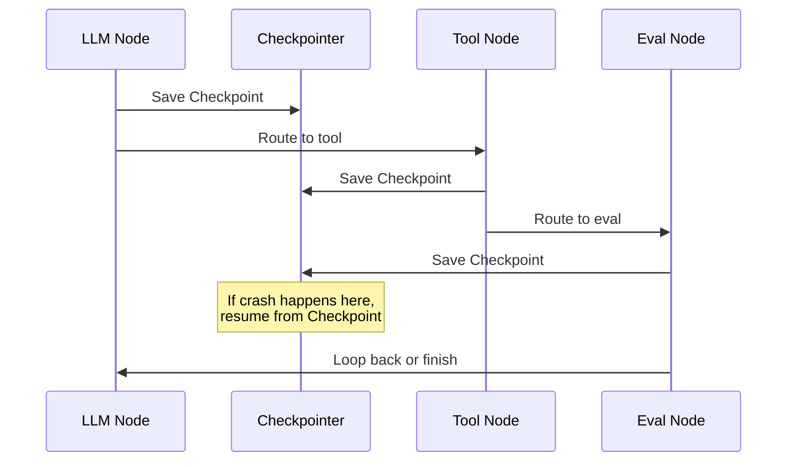
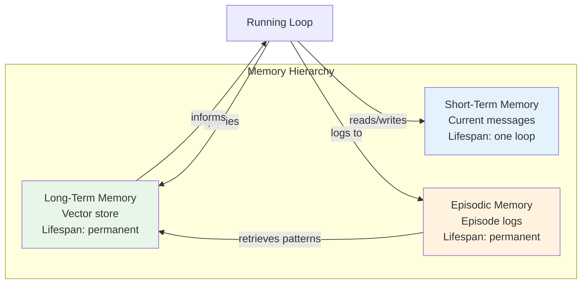

# 11 · State, Context, and Memory

## Introduction

Every loop iteration produces new information — intermediate results, tool outputs, error messages, revised plans. Without a mechanism to carry this information forward, each cycle would start from scratch, defeating the entire purpose of iteration. **State management** is the discipline of capturing, structuring, persisting, and retrieving the data that flows through a loop's lifecycle.

In loop engineering, state is not an afterthought — it is the *backbone* of every iterative workflow. A well-designed state schema determines whether a loop can reason over its own history, recover from failures, resume after interruption, or coordinate with other loops in a multi-agent system. This file provides a deep, practical guide to state, context, and memory in LangGraph-powered loop systems.

> **Prerequisite**: Familiarity with LangGraph's `StateGraph` (see [04_Core_Concepts.md](04_Core_Concepts.md)) and loop architectures (see [08_Loop_Architecture.md](08_Loop_Architecture.md)).

---

## What Is State?

### Definition

**State** is the complete set of data that a loop needs at any given point to make its next decision. It is a snapshot of everything the system knows *right now* — accumulated messages, current plan, iteration count, error flags, and any other domain-specific data.

In a non-loop system (a single LLM call), state is trivial: it is just the prompt and the response. In a loop, state grows and transforms with every cycle. Managing this growth is the central challenge.

```python
# Minimal conceptual model of state in a loop
state = {
    "messages": [],          # Conversation history
    "current_plan": None,    # Active plan being executed
    "iteration": 0,          # How many cycles have run
    "max_iterations": 10,    # Safety limit
    "errors": [],            # Accumulated error info
    "result": None,          # Final output (once complete)
}
```

### Why State Matters

| Concern | What Happens Without State Management |
|---|---|
| **Reasoning continuity** | The LLM forgets earlier steps and repeats work |
| **Error recovery** | Failures cannot be diagnosed or retried intelligently |
| **Resume/checkpoint** | Interrupted loops must restart from the beginning |
| **Cost control** | Redundant context tokens waste money |
| **Multi-agent coordination** | Agents cannot share findings or avoid conflicts |

---

## Types of State

Loop engineering works with three broad categories of state, each with different lifecycles and persistence requirements.

### Ephemeral State

Ephemeral state exists only for the duration of a single loop execution. Once the loop terminates (successfully or not), this state is discarded. It is held entirely in memory and never written to disk or a database.

**Use cases**: A single-turn research loop, a code-generation loop that produces one artifact, any stateless workflow.

```python
# Ephemeral state — lives only in Python process memory
from typing import TypedDict, Annotated

class EphemeralState(TypedDict):
    messages: list
    iteration: int
    current_query: str
```

### Persistent State

Persistent state survives across loop executions. It is written to a checkpoint store (file system, database, cloud storage) so that the loop can be **resumed** after interruption, failure, or human-in-the-middle review.

**Use cases**: Long-running workflows, human-in-the-loop approval steps, production pipelines that must survive server restarts.

```python
from langgraph.checkpoint.memory import MemorySaver  # Dev/testing
from langgraph.checkpoint.sqlite import SqliteSaver  # Production

# MemorySaver = in-memory (ephemeral checkpoints, useful for dev)
checkpointer = MemorySaver()

# SqliteSaver = file-based (persistent checkpoints)
# checkpointer = SqliteSaver.from_conn_string("./checkpoints.db")
```

### Shared State

Shared state is accessed by multiple loops or agents simultaneously. It requires concurrency controls (locks, versioning, conflict resolution) and a clear ownership model.

**Use cases**: Multi-agent systems where agents contribute to a common workspace, collaborative editing loops, pipeline stages that pass data downstream.

```python
# Shared state pattern: multiple writers, single schema
class SharedWorkspaceState(TypedDict):
    research_findings: list[str]    # Agent A writes
    code_drafts: list[str]          # Agent B writes
    review_comments: list[str]      # Agent C writes
    final_report: str               # Orchestrator writes
    status: str                     # "in_progress" | "review" | "complete"
```

---

## State Schemas in LangGraph

LangGraph requires an explicit state schema that defines the shape of data flowing through your graph. There are two primary approaches.

### TypedDict Schemas

`TypedDict` is the standard approach. It provides type hints without runtime validation, making it lightweight and fast.

```python
from typing import TypedDict, Annotated
from langgraph.graph import add_messages

class AgentState(TypedDict):
    """Core state schema for a research agent loop."""
    messages: Annotated[list, add_messages]  # LangGraph's built-in reducer
    research_topic: str
    sources_found: list[str]
    iteration: int
    max_iterations: int
    final_answer: str | None
    needs_more_research: bool
```

The `Annotated[list, add_messages]` pattern is critical. The `add_messages` **reducer** tells LangGraph how to merge new messages with existing ones — it appends new messages rather than overwriting the entire list. This is how state accumulates across iterations.

### Pydantic Schemas

For runtime validation and richer type constraints, LangGraph also supports Pydantic models:

```python
from pydantic import BaseModel, Field
from langgraph.graph import add_messages

class AgentState(BaseModel):
    """Validated state schema with constraints."""
    messages: Annotated[list, add_messages]
    research_topic: str = Field(..., min_length=1, description="The research query")
    sources_found: list[str] = Field(default_factory=list)
    iteration: int = Field(default=0, ge=0)
    max_iterations: int = Field(default=5, ge=1, le=20)
    final_answer: str | None = Field(default=None)
    needs_more_research: bool = Field(default=True)
```

Pydantic schemas are valuable in production because they catch malformed state updates at runtime — for example, preventing a node from setting `iteration` to a negative number.

### Choosing Between TypedDict and Pydantic

| Criterion | TypedDict | Pydantic |
|---|---|---|
| Runtime validation | No | Yes |
| Performance | Faster | Slightly slower |
| IDE support | Good | Excellent |
| Default values | Limited | Full support |
| Best for | Prototyping, simple loops | Production, complex schemas |

---

## How State Flows Across Iterations

The following diagram shows how state transforms as it passes through each node in a typical research loop:

```mermaid
flowchart TD
    START([Start]) --> INIT[Initialize State<br/>messages=[], iteration=0]
    INIT --> RESEARCH[Research Node<br/>Appends sources to state]
    RESEARCH --> EVAL[Evaluate Node<br/>Sets needs_more_research flag]
    EVAL -->|needs_more_research=True| RESEARCH
    EVAL -->|needs_more_research=False| SYNTH[Synthesize Node<br/>Writes final_answer]
    SYNTH --> END([End])

    style START fill:#4CAF50,color:white
    style END fill:#f44336,color:white
    style RESEARCH fill:#2196F3,color:white
    style EVAL fill:#FF9800,color:white
    style SYNTH fill:#9C27B0,color:white
```

At each node transition, LangGraph applies the state reducers. If a node returns `{"sources_found": ["new_source"]}`, the reducer merges this into the existing list. If a node returns `{"iteration": 3}`, the value overwrites the previous value (default reducer for scalar fields).

---

## State Persistence and Checkpointing

### How Checkpointing Works

LangGraph's checkpointing system captures the complete state after *every node execution*. If the loop is interrupted (process crash, human approval needed, timeout), it can resume from the last checkpoint.



### Implementing Checkpointing

```python
from langgraph.graph import StateGraph, END
from langgraph.checkpoint.memory import MemorySaver

# Build the graph
graph = StateGraph(AgentState)
graph.add_node("research", research_node)
graph.add_node("evaluate", evaluate_node)
graph.add_node("synthesize", synthesize_node)

graph.add_edge("research", "evaluate")
graph.add_conditional_edges(
    "evaluate",
    lambda state: "research" if state["needs_more_research"] else "synthesize",
    {"research": "research", "synthesize": "synthesize"}
)
graph.add_edge("synthesize", END)
graph.set_entry_point("research")

# Compile WITH checkpointer — this enables persistence
checkpointer = MemorySaver()
app = graph.compile(checkpointer=checkpointer)

# Run the loop
config = {"configurable": {"thread_id": "research-session-001"}}
result = app.invoke(
    {"messages": [("user", "What are the latest advances in quantum computing?")],
     "research_topic": "quantum computing advances",
     "iteration": 0,
     "max_iterations": 5,
     "sources_found": [],
     "final_answer": None,
     "needs_more_research": True},
    config=config
)

# Resume from last checkpoint (e.g., after a crash or human review)
# LangGraph automatically picks up where it left off using the same thread_id
result_continued = app.invoke(None, config=config)
```

### Checkpoint Backends

| Backend | Persistence | Concurrency | Best For |
|---|---|---|---|
| `MemorySaver` | In-memory only | Single process | Development, testing |
| `SqliteSaver` | File-based | Single writer | Single-server production |
| `AsyncPostgresSaver` | Database | Multi-writer | Distributed production |
| Custom (Redis, S3, etc.) | Variable | Variable | Specialized requirements |

---

## Memory Systems

While **state** describes the structured data a loop needs right now, **memory** describes the systems that store and retrieve information across loop boundaries — even across entirely separate sessions.

### Short-Term Memory

Short-term memory is equivalent to the current state's message history. It lives within the context window and is lost when the loop ends (unless explicitly persisted).

```python
# Short-term memory = the messages list in state
state = {
    "messages": [
        ("user", "Analyze this data"),
        ("assistant", "I'll run statistical analysis first"),
        ("tool", "Mean: 42.3, StdDev: 8.1"),
        ("assistant", "The data shows a mean of 42.3..."),
    ],
    # ... other state fields
}
```

### Long-Term Memory

Long-term memory persists across sessions. It is typically implemented with a vector store that allows semantic retrieval of past interactions, knowledge, or decisions.

```python
from langchain_core.vectorstores import InMemoryVectorStore
from langchain_openai import OpenAIEmbeddings

vector_store = InMemoryVectorStore(OpenAIEmbeddings())

# Store important findings for future loops
vector_store.add_texts(
    texts=["User prefers concise summaries", "Domain: bioinformatics"],
    metadatas=[{"type": "preference"}, {"type": "domain"}]
)

# Retrieve relevant memories when starting a new loop
memories = vector_store.similarity_search("what does the user prefer?", k=3)
```

### Episodic Memory

Episodic memory stores specific *episodes* — complete records of what happened in a particular loop execution, including the trajectory of decisions and outcomes.

```python
class Episode(BaseModel):
    """A record of one complete loop execution."""
    session_id: str
    task: str
    steps: list[dict]      # Each step: {node, input, output, duration}
    outcome: str            # "success" | "failure" | "partial"
    lessons_learned: str    # LLM-generated summary of what worked
    timestamp: str

    def to_memory_string(self) -> str:
        return f"Episode {self.session_id}: Task='{self.task}', Outcome={self.outcome}. {self.lessons_learned}"
```



---

## Context Window Management

The context window is a hard constraint. Every token in the state's message history consumes context window space, and when it fills up, the loop must either compress, truncate, or fail.

### The Context Budget Problem

```python
# Conceptual context budget
MAX_CONTEXT_TOKENS = 128_000  # e.g., GPT-4o

def calculate_budget(state: AgentState) -> dict:
    system_prompt_tokens = 500
    current_messages_tokens = count_tokens(state["messages"])
    remaining = MAX_CONTEXT_TOKENS - system_prompt_tokens - current_messages_tokens

    return {
        "used": current_messages_tokens + system_prompt_tokens,
        "remaining": remaining,
        "utilization_pct": (current_messages_tokens + system_prompt_tokens) / MAX_CONTEXT_TOKENS * 100
    }
```

### Context Compression Strategies

| Strategy | Description | Trade-off |
|---|---|---|
| **Sliding window** | Keep only the last N messages | Loses early context |
| **Summarization** | Replace old messages with an LLM-generated summary | Summarization introduces information loss |
| **Token pruning** | Remove tool outputs, keeping only essential fields | May lose useful details |
| **Semantic selection** | Use embeddings to keep the most relevant past messages | Computationally expensive |
| **Hierarchical memory** | Compress old iterations into a summary, keep recent iterations verbatim | Best balance of retention vs. cost |

### Implementing Summarization Compression

```python
from langchain_core.messages import SystemMessage, HumanMessage, AIMessage

def compress_messages(state: AgentState) -> dict:
    """Summarize older messages when context grows too large."""
    messages = state["messages"]
    MAX_MESSAGES = 20

    if len(messages) <= MAX_MESSAGES:
        return {}  # No compression needed

    # Keep the first message (task description) and recent messages
    old_messages = messages[1:-MAX_MESSAGES // 2]
    recent_messages = messages[-MAX_MESSAGES // 2:]

    # Generate a summary of old messages
    summary_prompt = f"""
    Summarize the following conversation history, preserving:
    - Key findings and decisions
    - Errors encountered and how they were resolved
    - Current progress toward the goal

    History:
    {format_messages(old_messages)}
    """
    summary = llm.invoke(summary_prompt).content

    # Reconstruct messages: original first message + summary + recent messages
    compressed = [
        messages[0],  # Original task
        SystemMessage(content=f"[Previous context summary]: {summary}"),
        *recent_messages
    ]

    return {"messages": compressed}
```

---

## Full Example: Stateful Research Loop

Putting it all together — here is a complete LangGraph research loop with typed state, checkpointing, and context management:

```python
from typing import TypedDict, Annotated, Literal
from langgraph.graph import StateGraph, END, add_messages
from langgraph.checkpoint.memory import MemorySaver
from langchain_core.messages import HumanMessage, AIMessage

class ResearchState(TypedDict):
    messages: Annotated[list, add_messages]
    topic: str
    sources: list[str]
    iteration: int
    max_iterations: int
    summary: str | None

def research_node(state: ResearchState) -> dict:
    """Search for and collect sources on the topic."""
    # In production: call a search tool here
    new_source = f"Source found in iteration {state['iteration']}"
    return {
        "sources": state["sources"] + [new_source],
        "iteration": state["iteration"] + 1,
        "messages": [AIMessage(content=f"Found: {new_source}")]
    }

def should_continue(state: ResearchState) -> Literal["research", "summarize"]:
    """Decide whether to keep researching or summarize."""
    if state["iteration"] >= state["max_iterations"]:
        return "summarize"
    return "research"

def summarize_node(state: ResearchState) -> dict:
    """Produce a final summary from collected sources."""
    # In production: call LLM to synthesize
    return {
        "summary": f"Summary of {len(state['sources'])} sources on '{state['topic']}'",
        "messages": [AIMessage(content="Research complete. Generating summary...")]
    }

# Build and compile
graph = StateGraph(ResearchState)
graph.add_node("research", research_node)
graph.add_node("summarize", summarize_node)

graph.add_edge("research", "research")  # Self-loop via conditional
graph.add_conditional_edges("research", should_continue)
graph.add_edge("summarize", END)
graph.set_entry_point("research")

checkpointer = MemorySaver()
app = graph.compile(checkpointer=checkpointer, interrupt_before=["summarize"])

# Run with human-in-the-loop checkpoint
config = {"configurable": {"thread_id": "research-001"}}
app.invoke({
    "messages": [HumanMessage(content="Research loop engineering patterns")],
    "topic": "loop engineering patterns",
    "sources": [],
    "iteration": 0,
    "max_iterations": 3,
    "summary": None
}, config=config)

# Inspect state at the interrupt point
state_snapshot = app.get_state(config)
print(f"Iterations completed: {state_snapshot.values['iteration']}")
print(f"Sources found: {state_snapshot.values['sources']}")

# Resume after human review
app.invoke(None, config=config)
```

---

## Summary

### Cheat Sheet

| Concept | Key Idea | LangGraph Mechanism |
|---|---|---|
| **State schema** | Define the shape of loop data | `TypedDict` or Pydantic model |
| **State reducers** | Control how state merges across steps | `Annotated[list, add_messages]` |
| **Ephemeral state** | In-memory only, lost on exit | Default behavior |
| **Persistent state** | Survives interruptions | `checkpointer=MemorySaver()` |
| **Short-term memory** | Current message history | `state["messages"]` |
| **Long-term memory** | Cross-session vector store | `VectorStore` integration |
| **Episodic memory** | Logged execution trajectories | Custom storage + retrieval |
| **Context compression** | Manage token budgets | Sliding window, summarization, pruning |
| **Checkpoint resume** | Continue after interruption | Same `thread_id` + `invoke(None)` |
| **Human-in-the-loop** | Pause for review | `interrupt_before` / `interrupt_after` |

### Key Takeaways

1. **State is the backbone of every loop** — design your schema before your nodes.
2. **Use reducers** (`Annotated[list, add_messages]`) to control state accumulation behavior.
3. **Checkpoint everything in production** — it enables resume, debugging, and human review.
4. **Budget your context window** — implement compression before you hit the limit, not after.
5. **Layer your memory** — short-term for current reasoning, long-term for cross-session knowledge, episodic for learning from past executions.

---

## Glossary

| Term | Definition |
|---|---|
| **State** | The complete data snapshot a loop uses to make its next decision |
| **State Schema** | A typed definition (TypedDict/Pydantic) of the shape and types of state data |
| **Reducer** | A function that determines how new state updates merge with existing state |
| **Checkpoint** | A persisted snapshot of state after a node execution |
| **Context Window** | The maximum number of tokens an LLM can process in a single call |
| **Context Compression** | Strategies for reducing token usage while preserving important information |
| **Short-Term Memory** | Information retained within the current loop execution (message history) |
| **Long-Term Memory** | Information persisted across sessions, typically in a vector store |
| **Episodic Memory** | Records of complete past loop executions, stored for future reference |
| **Thread ID** | A unique identifier for a checkpointed conversation/session |

---

## References

- LangGraph Documentation — State Management: https://langchain-ai.github.io/langgraph/concepts/low_level/#state
- LangGraph Checkpointing: https://langchain-ai.github.io/langgraph/concepts/persistence/
- LangChain Memory Types: https://python.langchain.com/docs/concepts/memory/
- "MemGPT: Towards LLMs as Operating Systems" — Packer et al., 2023
- See also: [08_Loop_Architecture.md](08_Loop_Architecture.md) for how state flows through graph structures
- See also: [15_AI_Agents_and_Multi_Agent_Loops.md](15_AI_Agents_and_Multi_Agent_Loops.md) for shared state in multi-agent systems