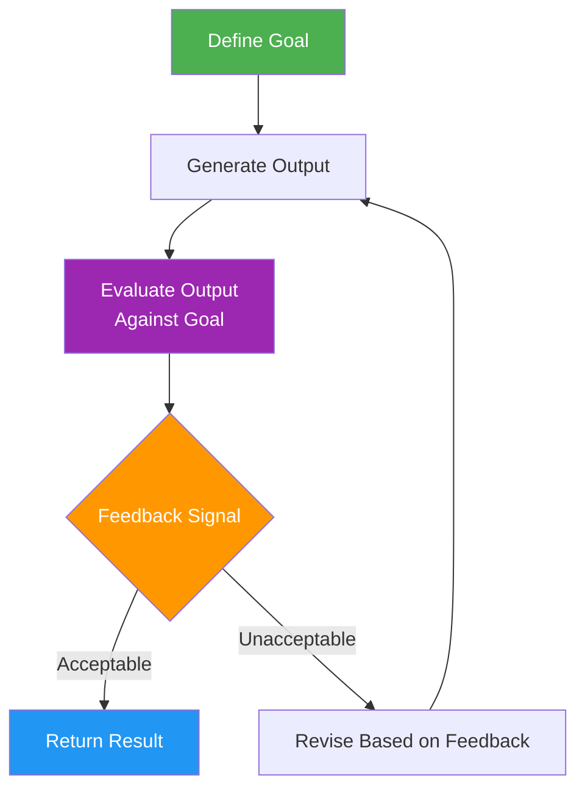
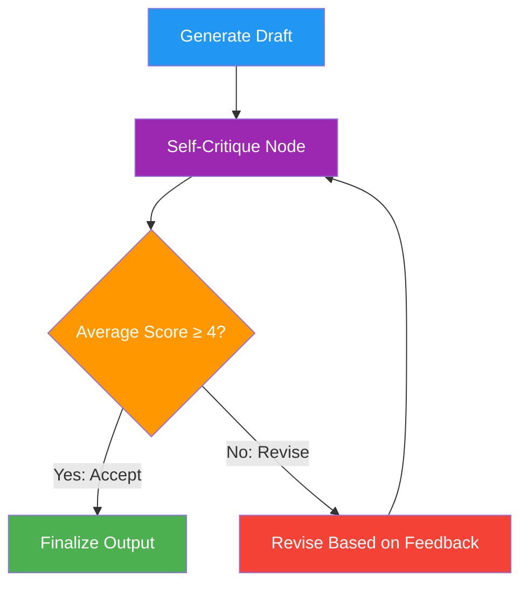
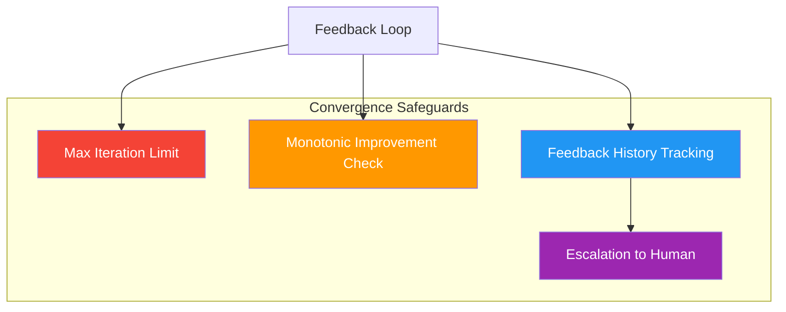

# 12 · Feedback and Iteration

## Introduction

Iteration without feedback is just repetition. The entire value of a loop in AI systems comes from its ability to **observe the result of an action, evaluate it against a goal, and adjust**. This evaluation signal is **feedback** — the mechanism that transforms a blind cycle into a convergent, self-improving process.

Feedback in loop engineering is more nuanced than a simple "pass/fail" check. It comes in multiple forms (self-generated, external, binary, scalar, textual), it can be aggregated across multiple criteria, and it drives the conditional logic that decides whether a loop continues, pivots, or terminates. This file explores the mechanics, patterns, and implementation of feedback-driven iteration in LangGraph systems.

> **Prerequisite**: Understanding of state management (see [11_State_Context_and_Memory.md](11_State_Context_and_Memory.md)) and loop architectures (see [08_Loop_Architecture.md](08_Loop_Architecture.md)).

---

## What Is Feedback in Loop Engineering?

### Definition

**Feedback** is any signal — generated internally by the system or externally by a user, tool, or evaluator — that provides information about the quality, correctness, or progress of a loop's output relative to its goal. Feedback is the **error signal** in the control-theory sense: it measures the gap between *where the system is* and *where it needs to be*.

```python
# The fundamental feedback equation (conceptual)
gap = goal - current_output
action = policy(gap)  # The loop decides what to do based on the gap
```

### The Feedback Loop Pattern

At its core, every feedback-driven loop follows this sequence:



This pattern appears at every scale in loop engineering: from a single self-critique step to a multi-agent debate with human arbitration.

---

## Types of Feedback

### Self-Feedback (Self-Critique)

Self-feedback occurs when the LLM evaluates its own output. The model generates a response, then receives a prompt asking it to critique that response against specific criteria. This is the most common feedback pattern in current AI systems.

**Strengths**: No external dependencies, always available, captures the model's own reasoning about quality.
**Weaknesses**: Models tend to be overly generous in self-evaluation; blind spots persist.

```python
from langchain_core.messages import HumanMessage, SystemMessage

def self_critique_node(state: dict) -> dict:
    """LLM critiques its own last output."""
    last_response = state["messages"][-1].content

    critique_prompt = f"""
    Critique the following response. Evaluate it on:
    1. Accuracy — Are the claims correct?
    2. Completeness — Does it address all aspects of the question?
    3. Clarity — Is it well-organized and understandable?

    Rate each criterion from 1-5 and provide specific issues found.
    If the average score is below 4, provide actionable revision instructions.

    Response to critique:
    {last_response}
    """

    critique = llm.invoke([SystemMessage(content=critique_prompt)])
    return {
        "messages": [critique],
        "critique_scores": parse_scores(critique.content),
        "needs_revision": average_score(critique.content) < 4.0
    }
```

### External Feedback

External feedback comes from sources outside the generating model. This includes:

| Source | Description | Example |
|---|---|---|
| **User feedback** | Human evaluates the output | Thumbs up/down, edit suggestions |
| **Tool feedback** | A tool validates or tests the output | Unit tests pass/fail, linter errors |
| **Evaluator model** | A separate LLM evaluates | A "judge" model scores the output |
| **Metric feedback** | Automated metrics measure quality | BLEU score, code coverage, factual accuracy check |

External feedback is generally more reliable than self-feedback because it introduces an independent perspective. The trade-off is latency and cost — each external evaluation is an additional LLM call or tool invocation.

```python
def external_evaluator_node(state: dict) -> dict:
    """A separate evaluator model scores the output."""
    last_response = state["messages"][-1].content
    original_question = state["messages"][0].content

    eval_prompt = f"""
    You are an independent evaluator. Score this response to the question.

    Question: {original_question}
    Response: {last_response}

    Provide:
    - factual_accuracy: 1-5
    - relevance: 1-5
    - helpfulness: 1-5
    - overall: 1-5
    - specific_issues: list of problems found
    """

    evaluation = evaluator_llm.invoke([HumanMessage(content=eval_prompt)])
    scores = parse_evaluation(evaluation.content)

    return {
        "evaluation": scores,
        "needs_revision": scores["overall"] < 4.0,
        "revision_instructions": scores["specific_issues"]
    }
```

### Positive vs. Negative Feedback

In control theory terms:

- **Negative feedback** reduces the error signal — it pushes the system *toward* the goal. "Your answer has 3 factual errors — fix them." This is the primary driver of convergence.
- **Positive feedback** amplifies the current trajectory. "This direction is promising — go deeper." It is used for exploration and amplification, not correction.

Most loops rely primarily on negative feedback (error correction) with occasional positive feedback (direction confirmation).

---

## Feedback Signal Types

Feedback signals can be categorized by their information density:

### Binary Signals

The simplest form: pass/fail, yes/no, continue/stop. Binary signals are fast and unambiguous but carry minimal information about *what* to fix.

```python
def binary_feedback(state: dict) -> dict:
    """Simple pass/fail evaluation."""
    output = state["current_output"]
    # Example: does the output contain the required sections?
    has_introduction = "introduction" in output.lower()
    has_conclusion = "conclusion" in output.lower()
    passed = has_introduction and has_conclusion

    return {"passed": passed}  # Binary: True or False
```

### Scalar Signals

A numeric score on a defined scale (1–5, 0–100, 0.0–1.0). Scalar signals enable threshold-based decisions and trend tracking across iterations.

```python
def scalar_feedback(state: dict) -> dict:
    """Score output quality on multiple dimensions."""
    scores = {
        "accuracy": evaluate_accuracy(state),
        "completeness": evaluate_completeness(state),
        "clarity": evaluate_clarity(state),
    }
    average = sum(scores.values()) / len(scores)

    return {
        "scores": scores,
        "average_score": average,
        "meets_threshold": average >= 4.0
    }
```

### Textual Signals

Free-form natural language feedback. The most information-rich signal type — it tells the loop not just *whether* the output is wrong, but *why* and *how to fix it*.

```python
def textual_feedback(state: dict) -> dict:
    """Generate detailed revision instructions."""
    prompt = f"""
    Review this output and provide specific, actionable feedback:

    {state['current_output']}

    For each issue found, provide:
    1. Location (section/paragraph)
    2. Problem description
    3. Suggested fix
    """
    feedback = llm.invoke(prompt).content
    return {"feedback_text": feedback, "has_feedback": len(feedback) > 50}
```

### Choosing Signal Types

| Signal Type | Information | Cost | Best For |
|---|---|---|---|
| Binary | Minimal | Lowest | Gate conditions, format checks |
| Scalar | Moderate | Low | Quality thresholds, trend tracking |
| Textual | Maximum | Highest | Revision guidance, complex evaluation |

In practice, the most effective systems use a **combination**: a scalar score for the routing decision plus textual feedback for the revision node.

---

## Feedback Drives Iteration: The Routing Logic

Feedback's primary function in a LangGraph system is to determine the loop's control flow through **conditional edges**. The feedback evaluation result becomes the routing signal.



### Implementation with Conditional Edges

```python
from typing import TypedDict, Annotated, Literal
from langgraph.graph import StateGraph, END, add_messages
from langgraph.checkpoint.memory import MemorySaver

class FeedbackState(TypedDict):
    messages: Annotated[list, add_messages]
    draft: str
    feedback: str
    score: float
    iteration: int
    max_iterations: int
    accepted: bool

def generate_draft(state: FeedbackState) -> dict:
    """Generate or revise the draft."""
    if state["iteration"] == 0:
        prompt = f"Write a detailed explanation of: {state['messages'][0].content}"
    else:
        prompt = f"""
        Revise the following draft based on this feedback:
        
        Draft: {state['draft']}
        Feedback: {state['feedback']}
        
        Produce an improved version.
        """
    new_draft = llm.invoke(prompt).content
    return {
        "draft": new_draft,
        "iteration": state["iteration"] + 1,
        "messages": [("assistant", f"Draft #{state['iteration'] + 1} generated")]
    }

def critique_draft(state: FeedbackState) -> dict:
    """Evaluate the draft and produce feedback."""
    prompt = f"""
    Critique this draft on accuracy, completeness, and clarity (1-5 each):
    
    {state['draft']}
    
    Return JSON: {{"accuracy": N, "completeness": N, "clarity": N, "feedback": "..."}}
    """
    result = llm.invoke(prompt).content
    scores = parse_json(result)
    avg = (scores["accuracy"] + scores["completeness"] + scores["clarity"]) / 3

    return {
        "score": avg,
        "feedback": scores["feedback"],
        "accepted": avg >= 4.0 or state["iteration"] >= state["max_iterations"]
    }

def route_by_feedback(state: FeedbackState) -> Literal["generate", "end"]:
    """Route based on feedback score or iteration limit."""
    if state["accepted"]:
        return "end"
    return "generate"

# Build the feedback loop
graph = StateGraph(FeedbackState)
graph.add_node("generate", generate_draft)
graph.add_node("critique", critique_draft)

graph.add_edge("generate", "critique")
graph.add_conditional_edges("critique", route_by_feedback, {
    "generate": "generate",
    "end": END
})
graph.set_entry_point("generate")

app = graph.compile(checkpointer=MemorySaver())
```

---

## Feedback Aggregation

When multiple evaluation criteria exist, you need a strategy for combining them into a single routing decision.

### Strategies

| Strategy | How It Works | When to Use |
|---|---|---|
| **Weighted average** | `score = w1*c1 + w2*c2 + w3*c3` | When criteria have different importance |
| **Minimum threshold** | Pass only if ALL criteria meet minimum | When every criterion is critical |
| **Majority vote** | Pass if most criteria pass | When some criteria are optional |
| **Veto** | Any single criterion can fail the whole evaluation | When safety constraints exist |

```python
def aggregate_feedback(scores: dict, strategy: str = "weighted") -> tuple[bool, str]:
    """Aggregate multiple feedback dimensions into a single decision."""
    
    if strategy == "weighted":
        weights = {"accuracy": 0.4, "completeness": 0.35, "clarity": 0.25}
        aggregate = sum(scores[k] * weights[k] for k in weights)
        return aggregate >= 4.0, f"Weighted score: {aggregate:.2f}"
    
    elif strategy == "minimum":
        min_score = min(scores.values())
        return min_score >= 3.5, f"Minimum score: {min_score}"
    
    elif strategy == "veto":
        veto_fields = ["accuracy", "safety"]
        for field in veto_fields:
            if field in scores and scores[field] < 3.0:
                return False, f"VETO: {field}={scores[field]} below threshold"
        return True, "All veto checks passed"
```

---

## Convergence Through Feedback

### What Is Convergence?

**Convergence** is the property of a feedback loop where each iteration brings the output closer to the goal, eventually reaching an acceptable result. Not all loops converge — some oscillate (the revision fixes one problem but introduces another), and some diverge (each revision makes things worse).

### Ensuring Convergence



**Techniques to ensure convergence:**

1. **Maximum iteration cap**: Always set an upper bound. No loop should run forever.
2. **Score trend tracking**: If the score is not improving over the last N iterations, terminate and return the best result.
3. **Feedback decay**: Weight recent feedback more heavily than old feedback to prevent the loop from over-correcting based on stale signals.
4. **Temperature reduction**: Lower the LLM temperature in successive iterations to reduce randomness and encourage conservative, targeted revisions.

```python
def convergence_check(state: FeedbackState) -> dict:
    """Detect if the loop is converging or stuck."""
    score_history = state.get("score_history", [])
    current_score = state["score"]
    score_history.append(current_score)

    # Check for stagnation: score hasn't improved in last 3 iterations
    stagnated = False
    if len(score_history) >= 4:
        recent = score_history[-3:]
        if max(recent) - min(recent) < 0.2:
            stagnated = True

    return {
        "score_history": score_history,
        "stagnated": stagnated,
        "accepted": state["accepted"] or stagnated or state["iteration"] >= state["max_iterations"]
    }
```

### The Feedback History Pattern

Storing feedback history in state enables the loop to reason about its own convergence trajectory:

```python
class FeedbackHistoryState(TypedDict):
    messages: Annotated[list, add_messages]
    draft: str
    score_history: list[float]  # Track scores across iterations
    feedback_history: list[str]  # Track what was wrong each time
    best_draft: str             # Keep the best version seen so far
    best_score: float
    iteration: int
    max_iterations: int

def update_best(state: FeedbackHistoryState) -> dict:
    """Always keep track of the best draft seen."""
    if state["score"] > state.get("best_score", 0):
        return {
            "best_draft": state["draft"],
            "best_score": state["score"]
        }
    return {}
```

---

## Complete Example: Multi-Criteria Revision Loop

```python
from typing import TypedDict, Annotated, Literal
from langgraph.graph import StateGraph, END, add_messages
from langgraph.checkpoint.memory import MemorySaver

class RevisionState(TypedDict):
    messages: Annotated[list, add_messages]
    task: str
    draft: str
    scores: dict
    feedback: str
    score_history: list[float]
    best_draft: str
    best_score: float
    iteration: int
    max_iterations: int
    final_output: str | None

def writer_node(state: RevisionState) -> dict:
    if state["iteration"] == 0:
        prompt = f"Complete this task: {state['task']}"
    else:
        prompt = f"""
        Task: {state['task']}
        Current draft: {state['draft']}
        Feedback: {state['feedback']}
        Scores: {state['scores']}
        
        Revise the draft to address all feedback points.
        """
    
    new_draft = llm.invoke(prompt).content
    
    updates = {
        "draft": new_draft,
        "iteration": state["iteration"] + 1,
        "score_history": state["score_history"],
        "best_draft": state.get("best_draft", ""),
        "best_score": state.get("best_score", 0.0),
    }
    
    return updates

def evaluator_node(state: RevisionState) -> dict:
    prompt = f"""
    Evaluate this draft for the task: {state['task']}
    
    Draft: {state['draft']}
    
    Score each criterion 1-5 and provide specific feedback:
    - accuracy, completeness, clarity, structure
    
    Return JSON with scores and detailed_feedback string.
    """
    result = llm.invoke(prompt).content
    evaluation = parse_json(result)
    avg = sum(evaluation["scores"].values()) / len(evaluation["scores"])
    
    new_history = state["score_history"] + [avg]
    is_best = avg > state.get("best_score", 0)
    
    return {
        "scores": evaluation["scores"],
        "feedback": evaluation["detailed_feedback"],
        "score_history": new_history,
        "best_draft": state["draft"] if is_best else state.get("best_draft", state["draft"]),
        "best_score": max(avg, state.get("best_score", 0)),
    }

def should_continue(state: RevisionState) -> Literal["write", "finalize"]:
    if state["iteration"] >= state["max_iterations"]:
        return "finalize"
    if state.get("best_score", 0) >= 4.5:
        return "finalize"
    if len(state["score_history"]) >= 3:
        if max(state["score_history"][-3:]) - min(state["score_history"][-3:]) < 0.3:
            return "finalize"  # Stagnation detected
    return "write"

def finalize_node(state: RevisionState) -> dict:
    return {"final_output": state.get("best_draft", state["draft"])}

# Assemble
graph = StateGraph(RevisionState)
graph.add_node("write", writer_node)
graph.add_node("evaluate", evaluator_node)
graph.add_node("finalize", finalize_node)

graph.add_edge("write", "evaluate")
graph.add_conditional_edges("evaluate", should_continue, {
    "write": "write",
    "finalize": "finalize"
})
graph.add_edge("finalize", END)
graph.set_entry_point("write")

app = graph.compile(checkpointer=MemorySaver())
```

---

## Summary

### Cheat Sheet

| Concept | Key Idea | Implementation |
|---|---|---|
| **Self-feedback** | LLM critiques its own output | Critique prompt → score extraction |
| **External feedback** | Separate evaluator validates output | Judge model, tool validation, user input |
| **Binary signal** | Pass/fail routing | Boolean conditional edge |
| **Scalar signal** | Numeric score for thresholds | Score → comparison → route |
| **Textual signal** | Detailed revision guidance | Feedback text → revision prompt |
| **Feedback aggregation** | Combine multiple criteria | Weighted average, minimum, veto |
| **Convergence** | Scores improve over iterations | Track history, detect stagnation |
| **Max iterations** | Hard loop termination bound | `iteration >= max_iterations` |
| **Best-so-far** | Always keep the best output | Track `best_draft` / `best_score` |

### Key Takeaways

1. **Feedback is what makes a loop intelligent, not just iterative.** Without feedback, loops are blind repetition.
2. **Combine signal types** — use scalar scores for routing decisions and textual feedback for revision guidance.
3. **Always track the best output.** Even if the loop stagnates or diverges, you can return the best version seen.
4. **Guard against non-convergence** with iteration limits, stagnation detection, and score trend analysis.
5. **External feedback is more reliable but more expensive.** Use self-feedback for speed, external evaluation for quality-critical paths.

---

## Glossary

| Term | Definition |
|---|---|
| **Feedback** | Any signal providing information about output quality relative to a goal |
| **Self-Critique** | An LLM evaluating and critiquing its own output |
| **External Evaluation** | Feedback from a source outside the generating model (user, tool, judge model) |
| **Binary Signal** | A pass/fail or yes/no feedback signal |
| **Scalar Signal** | A numeric score representing feedback quality |
| **Textual Signal** | Free-form natural language feedback with revision guidance |
| **Feedback Aggregation** | The process of combining multiple feedback dimensions into a single decision |
| **Convergence** | The property of a loop where each iteration brings output closer to the goal |
| **Stagnation** | When a loop's output quality stops improving across iterations |
| **Veto** | A feedback pattern where any single failing criterion rejects the output |

---

## References

- LangGraph Conditional Edges: https://langchain-ai.github.io/langgraph/how-tos/branching/
- "Reflexion: Language Agents with Verbal Reinforcement Learning" — Shinn et al., 2023
- "Self-Refine: Iterative Refinement with Self-Feedback" — Madaan et al., 2023
- "CRITIC: Large Language Models Can Self-Correct with Tool-Interactive Critiquing" — Gou et al., 2023
- See also: [13_Planning_and_Reasoning.md](13_Planning_and_Reasoning.md) for how feedback integrates with planning loops
- See also: [14_Tool_and_Function_Calling.md](14_Tool_and_Function_Calling.md) for tool-generated feedback signals