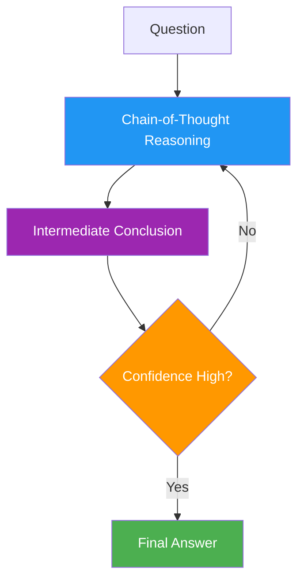
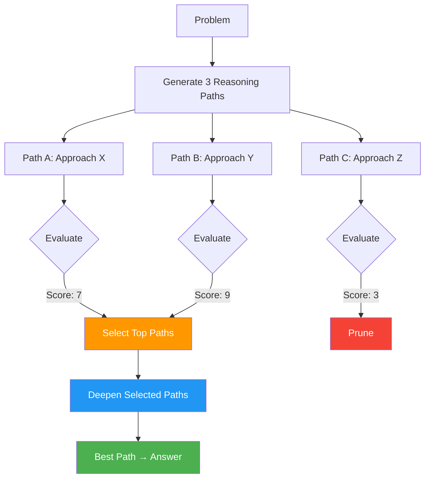
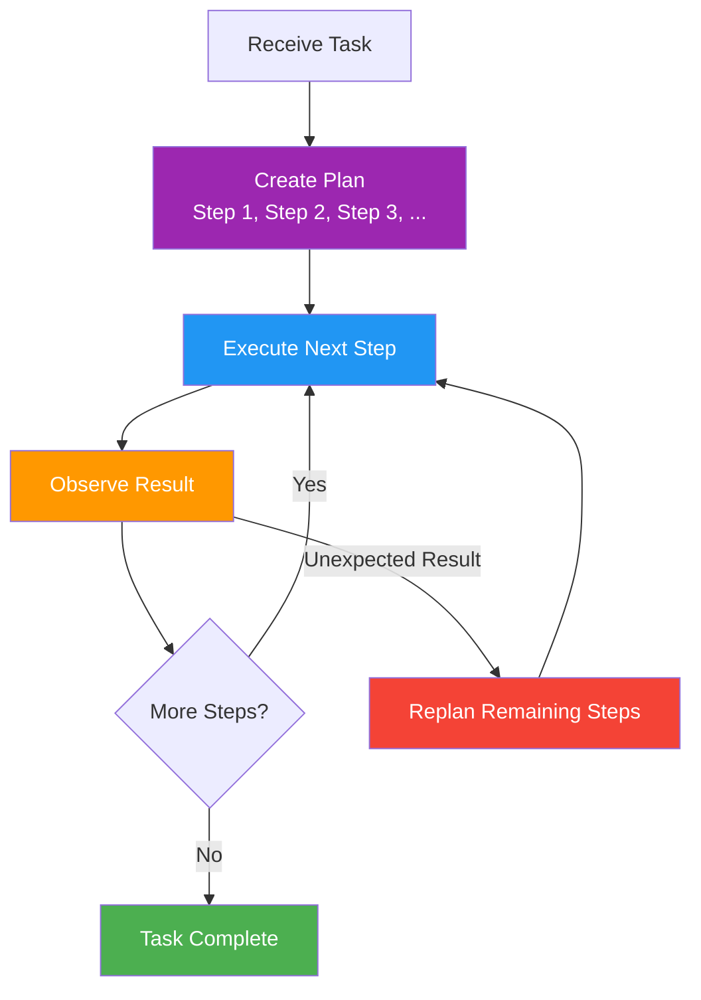
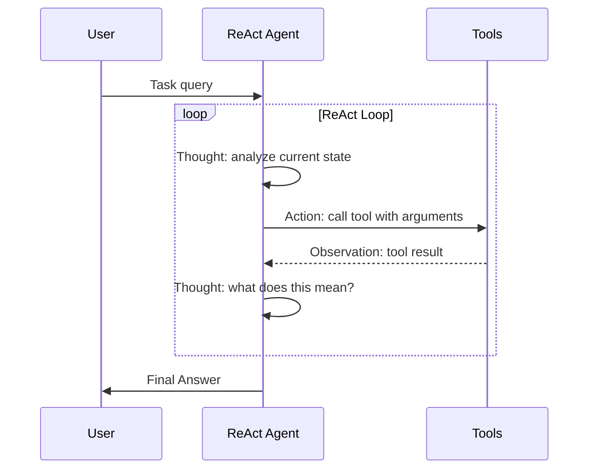

# 13 · Planning and Reasoning

## Introduction

Complex tasks cannot be solved in a single reasoning step. Writing a production application, conducting multi-source research, debugging a distributed system — these require **planning** (decomposing a goal into steps) and **reasoning** (applying logic and evidence at each step). Loops are the engine that makes both possible: they allow a system to plan, execute a step, observe the result, revise the plan, and continue until the goal is reached.

This file covers the major reasoning and planning patterns used in loop engineering, how they map to LangGraph implementations, and when to choose each pattern.

> **Prerequisite**: Understanding of feedback loops (see [12_Feedback_and_Iteration.md](12_Feedback_and_Iteration.md)) and tool calling (see [14_Tool_and_Function_Calling.md](14_Tool_and_Function_Calling.md)).

---

## Chain-of-Thought (CoT)

### What It Is

**Chain-of-Thought** (CoT) is a prompting technique where the LLM is encouraged to reason step-by-step before producing a final answer. Rather than jumping directly from question to answer, the model "thinks aloud," making its reasoning process explicit.

In loop engineering, CoT is the foundational reasoning pattern. Even more complex patterns (ToT, ReAct) are built on top of CoT's step-by-step decomposition principle.

### How It Works as a Loop

While basic CoT is a single LLM call, **iterative CoT** introduces a loop: the model reasons, produces an intermediate result, evaluates it, and then reasons further if needed.



### Implementation

```python
from langchain_core.prompts import ChatPromptTemplate
from langchain_core.output_parsers import StrOutputParser

cot_prompt = ChatPromptTemplate.from_messages([
    ("system", """You are a careful reasoner. For each question:
    1. Break down the problem into components
    2. Reason through each component step by step
    3. Show your work explicitly
    4. Then provide your final answer

    Think step by step."""),
    ("human", "{question}")
])

cot_chain = cot_prompt | llm | StrOutputParser()

# Single-pass CoT
result = cot_chain.invoke({"question": "If a train travels 120km in 2 hours, then 90km in 1.5 hours, what is the average speed?"})
```

### When to Use CoT

- Mathematical and logical reasoning
- Multi-step factual questions
- Any task where showing work improves accuracy
- **Limitation**: CoT explores only one reasoning path — it cannot backtrack or compare alternatives

---

## Tree-of-Thought (ToT)

### What It Is

**Tree-of-Thought** (ToT) extends CoT by exploring **multiple reasoning paths simultaneously**, evaluating each, and choosing the most promising one to continue. It creates a tree of possible reasoning trajectories rather than a single chain.



### Implementation Pattern

```python
from typing import TypedDict

class ToTState(TypedDict):
    problem: str
    thoughts: list[dict]  # Each: {path_id, content, score, depth}
    current_depth: int
    max_depth: int
    best_thought: str
    answer: str | None

def generate_thoughts(state: ToTState) -> dict:
    """Generate multiple reasoning approaches for the current problem."""
    prompt = f"""
    Given this problem: {state['problem']}
    
    Generate 3 different reasoning approaches to solve it.
    For each, explain your reasoning strategy briefly.
    
    Previous thoughts (if any): 
    {state['thoughts'][-3:] if state['thoughts'] else 'None yet'}
    """
    result = llm.invoke(prompt).content
    thoughts = parse_thoughts(result)  # Parse into list of {content} dicts
    
    new_thoughts = []
    for i, t in enumerate(thoughts):
        new_thoughts.append({
            "path_id": f"{state['current_depth']}-{i}",
            "content": t["content"],
            "score": 0,  # Will be scored next
            "depth": state["current_depth"]
        })
    
    return {"thoughts": state["thoughts"] + new_thoughts}

def evaluate_thoughts(state: ToTState) -> dict:
    """Score each thought at the current depth."""
    current_thoughts = [t for t in state["thoughts"] if t["depth"] == state["current_depth"]]
    
    for thought in current_thoughts:
        score_prompt = f"""
        Rate the promise of this reasoning approach (1-10):
        Problem: {state['problem']}
        Approach: {thought['content']}
        
        Consider: feasibility, relevance, likelihood of reaching a correct answer.
        Return only a number.
        """
        score = float(llm.invoke(score_prompt).content.strip())
        thought["score"] = score
    
    return {"thoughts": state["thoughts"]}

def select_and_prune(state: ToTState) -> dict:
    """Keep only the top-scoring thoughts."""
    current = [t for t in state["thoughts"] if t["depth"] == state["current_depth"]]
    current.sort(key=lambda x: x["score"], reverse=True)
    
    # Keep top 2 paths
    kept = current[:2]
    pruned = current[2:]
    
    best = max(state["thoughts"], key=lambda x: x["score"])
    
    return {
        "thoughts": [t for t in state["thoughts"] if t["depth"] < state["current_depth"]] + kept,
        "best_thought": best["content"],
        "current_depth": state["current_depth"] + 1
    }
```

### When to Use ToT

- Problems with multiple valid solution strategies
- Creative tasks where exploring alternatives matters
- Complex puzzles or optimization problems
- **Trade-off**: Significantly more expensive than CoT (multiple LLM calls per depth level)

---

## Plan-and-Execute

### What It Is

**Plan-and-Execute** separates the *planning* phase from the *execution* phase. First, the system creates a complete plan (a list of steps). Then, it executes each step one at a time, observing results and optionally replanning if circumstances change.

This is one of the most practical patterns in loop engineering because it mirrors how humans tackle complex tasks.



### LangGraph Implementation

```python
from typing import TypedDict, Annotated, Literal
from langgraph.graph import StateGraph, END, add_messages
from pydantic import BaseModel, Field

class PlanStep(BaseModel):
    id: int
    description: str
    status: str = "pending"  # pending, in_progress, completed, failed
    result: str | None = None

class PlanExecuteState(TypedDict):
    messages: Annotated[list, add_messages]
    task: str
    plan: list[dict]
    current_step_index: int
    replan_count: int
    max_replans: int
    final_result: str | None

def planner_node(state: PlanExecuteState) -> dict:
    """Create or revise the plan based on the task and current progress."""
    completed_steps = [s for s in state["plan"] if s["status"] == "completed"]
    pending_steps = [s for s in state["plan"] if s["status"] != "completed"]
    
    prompt = f"""
    Task: {state['task']}
    
    Steps already completed:
    {format_steps(completed_steps)}
    
    Steps remaining (if replanning):
    {format_steps(pending_steps)}
    
    Create a step-by-step plan to complete this task.
    If replanning, adjust the remaining steps based on what worked and what didn't.
    Return the full plan as a numbered list.
    """
    
    result = llm.invoke(prompt).content
    plan = parse_plan(result)
    
    # If replanning, preserve completed steps
    if completed_steps and state["replan_count"] > 0:
        plan = completed_steps + plan
    
    return {
        "plan": plan,
        "current_step_index": len(completed_steps),
        "replan_count": state["replan_count"] + 1
    }

def executor_node(state: PlanExecuteState) -> dict:
    """Execute the current step in the plan."""
    step = state["plan"][state["current_step_index"]]
    step["status"] = "in_progress"
    
    prompt = f"""
    Execute this step for the task '{state['task']}':
    
    Step: {step['description']}
    
    Previous context:
    {format_completed(state['plan'])}
    """
    
    result = llm.invoke(prompt).content
    step["status"] = "completed"
    step["result"] = result
    
    return {
        "plan": state["plan"],
        "current_step_index": state["current_step_index"],
        "messages": [("assistant", f"Completed: {step['description']}")]
    }

def should_replan(state: PlanExecuteState) -> Literal["execute", "replan", "finish"]:
    """Decide whether to execute next step, replan, or finish."""
    next_index = state["current_step_index"] + 1
    
    if next_index >= len(state["plan"]):
        return "finish"  # All steps done
    
    next_step = state["plan"][next_index]
    last_step = state["plan"][state["current_step_index"]]
    
    # Replan if the last step had unexpected issues
    if "error" in last_step.get("result", "").lower() and state["replan_count"] < state["max_replans"]:
        return "replan"
    
    return "execute"

def finish_node(state: PlanExecuteState) -> dict:
    """Synthesize final result from all completed steps."""
    results = [s["result"] for s in state["plan"] if s["result"]]
    prompt = f"""
    Task: {state['task']}
    
    Results from each step:
    {format_results(results)}
    
    Synthesize these into a final, coherent response.
    """
    final = llm.invoke(prompt).content
    return {"final_result": final}

# Build the Plan-and-Execute graph
graph = StateGraph(PlanExecuteState)
graph.add_node("planner", planner_node)
graph.add_node("executor", executor_node)
graph.add_node("finish", finish_node)

graph.add_edge("planner", "executor")
graph.add_conditional_edges("executor", should_replan, {
    "execute": "executor",
    "replan": "planner",
    "finish": "finish"
})
graph.add_edge("finish", END)
graph.set_entry_point("planner")

app = graph.compile()
```

### When to Use Plan-and-Execute

- Multi-step tasks with clear sequential dependencies
- Tasks where early steps affect later steps (research → draft → revise)
- Workflows that need visibility into progress (showing users which step is active)
- **Advantage over ReAct**: More predictable, easier to debug, progress is observable

---

## ReAct (Reason + Act)

### What It Is

**ReAct** (Reasoning + Acting) interleaves reasoning and action in a tight loop. At each step, the model **thinks** about what to do, then **acts** (typically by calling a tool), observes the result, and thinks again. Unlike Plan-and-Execute, ReAct does not pre-plan all steps — it decides the next action dynamically based on observation.



### LangGraph Implementation

```python
from typing import TypedDict, Annotated, Literal
from langgraph.graph import StateGraph, END, add_messages
from langgraph.prebuilt import ToolNode
from langchain_core.tools import tool

# Define tools
@tool
def search(query: str) -> str:
    """Search for information about a topic."""
    # In production: call a real search API
    return f"Search results for '{query}': [result 1, result 2, result 3]"

@tool
def calculator(expression: str) -> str:
    """Evaluate a mathematical expression."""
    try:
        return str(eval(expression))
    except Exception as e:
        return f"Error: {e}"

@tool
def lookup_database(record_id: str) -> str:
    """Look up a record in the database."""
    return f"Record {record_id}: Name=Example, Value=42"

tools = [search, calculator, lookup_database]
tool_node = ToolNode(tools)

class ReActState(TypedDict):
    messages: Annotated[list, add_messages]
    iteration: int
    max_iterations: int

def react_agent(state: ReActState) -> dict:
    """The ReAct reasoning node — thinks and decides whether to act."""
    prompt = f"""
    You are a ReAct agent. For each step, you MUST use this format:
    
    Thought: [your reasoning about what to do next]
    Action: [tool_name]
    Action Input: [tool input]
    
    After receiving an observation:
    Thought: [analyze the observation]
    
    When you have enough information to answer:
    Thought: [summarize your reasoning]
    Final Answer: [your answer]

    Available tools: {[t.name for t in tools]}
    
    History so far:
    {format_messages(state['messages'])}
    """
    
    response = llm.bind_tools(tools).invoke(prompt)
    return {
        "messages": [response],
        "iteration": state["iteration"] + 1
    }

def should_continue(state: ReActState) -> Literal["tools", "end"]:
    """Route to tools if the LLM wants to call one, otherwise end."""
    last_message = state["messages"][-1]
    
    # Check if the LLM wants to call a tool
    if hasattr(last_message, 'tool_calls') and last_message.tool_calls:
        if state["iteration"] >= state["max_iterations"]:
            return "end"  # Safety: max iterations reached
        return "tools"
    return "end"

# Build the ReAct graph
graph = StateGraph(ReActState)
graph.add_node("agent", react_agent)
graph.add_node("tools", tool_node)

graph.add_edge("tools", "agent")  # After tools, go back to agent
graph.add_conditional_edges("agent", should_continue, {
    "tools": "tools",
    "end": END
})
graph.set_entry_point("agent")

app = graph.compile()
```

### When to Use ReAct

- Tasks requiring dynamic tool use based on intermediate results
- Situations where the next action depends heavily on observation
- Exploratory tasks where the path is not known in advance
- **Advantage over Plan-and-Execute**: More adaptive, handles uncertainty better
- **Disadvantage**: Can be less predictable, may call unnecessary tools

---

## Decomposition Strategies

Both Plan-and-Execute and ReAct depend on effective task decomposition. Here are the key strategies:

### Sequential Decomposition

Break the task into a linear sequence of steps where each depends on the previous.

```
Task: "Build a data pipeline"
→ 1. Identify data sources
→ 2. Design schema
→ 3. Build extraction
→ 4. Build transformation
→ 5. Build loading
→ 6. Test end-to-end
```

### Hierarchical Decomposition

Break the task into major phases, then decompose each phase into sub-steps. This creates a **planning loop within a planning loop**.

```
Task: "Build a web application"
→ Phase 1: Backend
  → 1.1 Design API
  → 1.2 Implement endpoints
  → 1.3 Add authentication
→ Phase 2: Frontend
  → 2.1 Create components
  → 2.2 Wire to API
→ Phase 3: Deployment
  → 3.1 Dockerize
  → 3.2 Configure CI/CD
```

### Conditional Decomposition

The plan branches based on conditions discovered during execution. This requires a loop that can modify the plan based on observations.

```python
def adaptive_planner(state: PlanExecuteState) -> dict:
    """Decompose differently based on task type."""
    if "and then" in state["task"].lower():
        # Sequential decomposition
        steps = decompose_sequential(state["task"])
    elif "depending on" in state["task"].lower():
        # Conditional decomposition — create a plan with decision points
        steps = decompose_conditional(state["task"])
    else:
        # Default: ask the LLM to figure out the decomposition
        steps = llm_decompose(state["task"])
    
    return {"plan": steps}
```

---

## Reasoning Effort Allocation

Not all problems require the same amount of reasoning. Allocating too much reasoning to simple problems wastes tokens and latency; too little reasoning on complex problems produces poor results.

### The Effort Spectrum

| Effort Level | Technique | Token Cost | When to Use |
|---|---|---|---|
| **Minimal** | Direct answer, no CoT | Low | Factual recall, simple lookups |
| **Standard** | Single CoT pass | Medium | Most tasks, moderate complexity |
| **Extended** | CoT + self-verification | High | Math, logic, multi-step reasoning |
| **Maximum** | ToT or multi-agent debate | Very High | Critical decisions, novel problems |

### Dynamic Effort Allocation

```python
def allocate_effort(task: str, complexity: str) -> dict:
    """Configure reasoning effort based on task complexity."""
    effort_configs = {
        "simple": {"temperature": 0.0, "max_tokens": 500, "pattern": "direct"},
        "moderate": {"temperature": 0.0, "max_tokens": 2000, "pattern": "cot"},
        "complex": {"temperature": 0.0, "max_tokens": 4000, "pattern": "react", "max_iterations": 5},
        "critical": {"temperature": 0.1, "max_tokens": 8000, "pattern": "tot", "max_depth": 3},
    }
    return effort_configs.get(complexity, effort_configs["moderate"])
```

---

## Pattern Comparison

| Pattern | Planning Style | Adaptability | Cost | Best For |
|---|---|---|---|---|
| **CoT** | None (inline reasoning) | Low | Low | Single-step reasoning |
| **ToT** | Branching exploration | Medium | High | Problems with multiple strategies |
| **Plan-and-Execute** | Upfront plan, optional replan | Medium | Medium | Sequential multi-step tasks |
| **ReAct** | Dynamic, step-by-step | High | Medium-High | Tool-heavy, exploratory tasks |

---

## Summary

### Cheat Sheet

| Concept | Key Idea | LangGraph Pattern |
|---|---|---|
| **CoT** | Step-by-step reasoning in a single pass | Single node with structured prompt |
| **ToT** | Explore multiple reasoning paths, prune weak ones | Loop with generate → evaluate → prune |
| **Plan-and-Execute** | Create plan first, then execute step by step | Planner node → executor loop → conditional replan |
| **ReAct** | Interleave thought, action, observation dynamically | Agent node → tool node → agent node loop |
| **Sequential decomposition** | Linear step-by-step breakdown | Plan as ordered list |
| **Hierarchical decomposition** | Nested phases and sub-steps | Plan with sub-plans per phase |
| **Effort allocation** | Match reasoning depth to problem complexity | Configure pattern, iterations, tokens |

### Key Takeaways

1. **CoT is the foundation** — every other pattern builds on step-by-step reasoning.
2. **Plan-and-Execute for predictability** — use it when you need clear progress tracking and the task has clear phases.
3. **ReAct for adaptability** — use it when the path depends heavily on what you discover along the way.
4. **ToT for exploration** — use it when multiple solution strategies exist and you need to find the best one.
5. **Match reasoning effort to complexity** — don't use ToT for simple lookups or direct answers for complex analysis.

---

## Glossary

| Term | Definition |
|---|---|
| **Chain-of-Thought (CoT)** | A reasoning technique where the model explains its thinking step by step |
| **Tree-of-Thought (ToT)** | An extension of CoT that explores multiple reasoning paths in parallel |
| **Plan-and-Execute** | A pattern that separates planning (create steps) from execution (run steps) |
| **ReAct** | A pattern that interleaves Reasoning (thought) and Acting (tool use) in a tight loop |
| **Decomposition** | Breaking a complex task into smaller, manageable sub-tasks |
| **Replanning** | Revising an existing plan based on observations during execution |
| **Reasoning Effort** | The amount of computation (tokens, iterations) allocated to a reasoning task |
| **Thought** | In ReAct, the reasoning step where the model analyzes and decides |
| **Action** | In ReAct, the step where the model invokes a tool or takes a step |
| **Observation** | In ReAct, the result returned by a tool or action |

---

## References

- "Chain-of-Thought Prompting Elicits Reasoning in Large Language Models" — Wei et al., 2022
- "Tree of Thoughts: Deliberate Problem Solving with Large Language Models" — Yao et al., 2023
- "ReAct: Synergizing Reasoning and Acting in Language Models" — Yao et al., 2023
- "Plan-and-Solve Prompting" — Wang et al., 2023
- LangGraph Plan-and-Execute How-To: https://langchain-ai.github.io/langgraph/tutorials/plan-and-execute/plan-and-execute/
- See also: [14_Tool_and_Function_Calling.md](14_Tool_and_Function_Calling.md) for the tool execution layer beneath reasoning patterns
- See also: [15_AI_Agents_and_Multi_Agent_Loops.md](15_AI_Agents_and_Multi_Agent_Loops.md) for how reasoning patterns scale to multi-agent systems