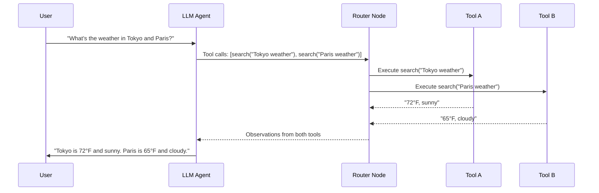
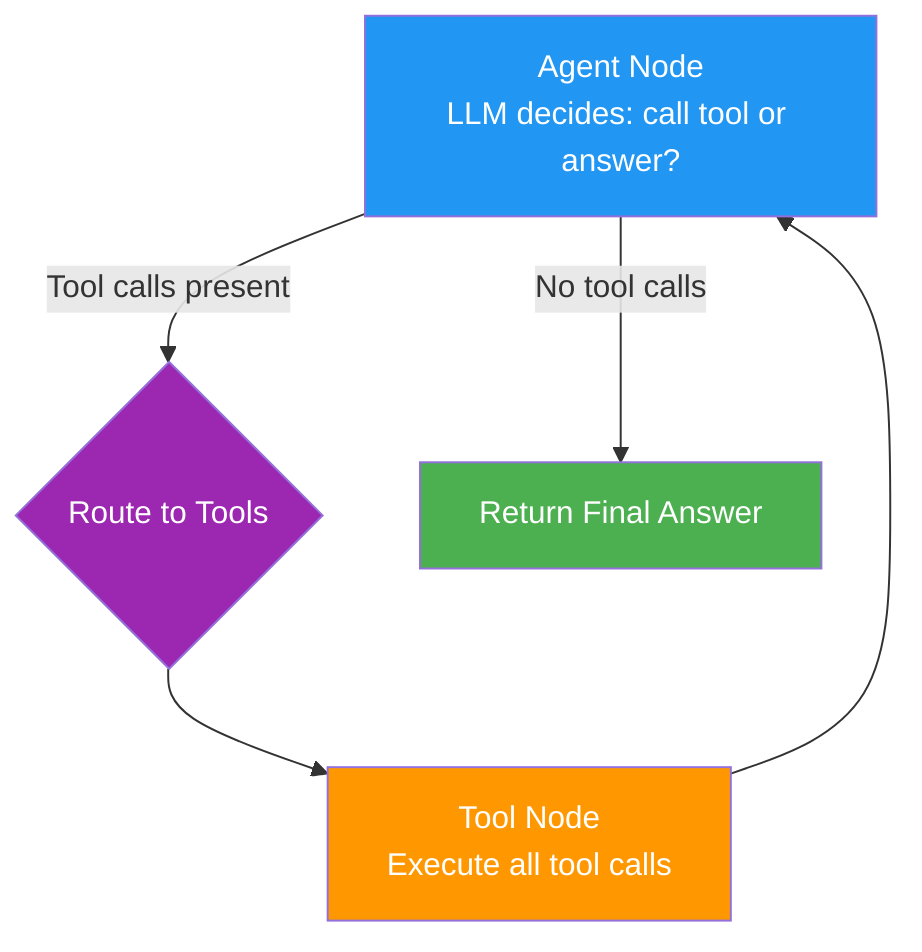
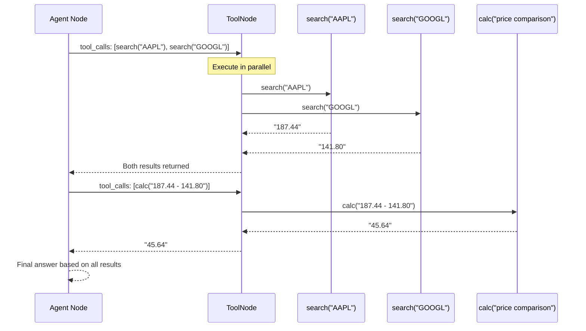

# 14 · Tool and Function Calling

## Introduction

An LLM on its own can only generate text. To interact with the world — query a database, call an API, run code, search the web — it needs **tools**. Tool calling is the mechanism that bridges an LLM's reasoning capabilities with external actions, and it is one of the most important loop primitives in all of AI engineering.

Critically, tool calling is inherently a **loop primitive**: the system calls a tool, receives a result, reasons about that result, and decides whether to call another tool or produce a final answer. This call → execute → observe → decide cycle is the atomic building block of nearly every agent architecture.

> **Prerequisite**: Understanding of state management (see [11_State_Context_and_Memory.md](11_State_Context_and_Memory.md)) and ReAct reasoning (see [13_Planning_and_Reasoning.md](13_Planning_and_Reasoning.md)).

---

## What Is Tool Calling?

### Definition

**Tool calling** (also called function calling) is the process where an LLM outputs a structured request to invoke an external function, rather than (or in addition to) generating free-form text. The LLM does not execute the function itself — it produces a structured description of *which function to call* and *with what arguments*. An external runtime then executes the function and feeds the result back to the LLM.

```
LLM → "Call search(query='weather in Tokyo')" → Runtime → search("weather in Tokyo") → "72°F, sunny" → LLM
```

### Why Tool Calling Creates Loops

Tool calling is not a one-shot operation. A single tool call rarely completes a complex task. The typical flow is:



Each iteration through this cycle — LLM decision → tool execution → result observation → LLM re-evaluation — is one loop iteration. The loop continues until the LLM determines it has enough information to produce a final answer.

---

## Tool Schemas

### The Tool Definition Contract

Every tool must have a schema that tells the LLM what the tool does, what arguments it accepts, and what it returns. This is typically expressed as a JSON Schema definition.

```python
from langchain_core.tools import tool
from pydantic import BaseModel, Field

class SearchInput(BaseModel):
    """Input schema for the search tool."""
    query: str = Field(..., description="The search query string")
    num_results: int = Field(default=5, description="Number of results to return", ge=1, le=20)
    source: str = Field(default="web", description="Source to search: 'web', 'docs', or 'code'")

@tool(args_schema=SearchInput)
def search_tool(query: str, num_results: int = 5, source: str = "web") -> str:
    """Search for information across multiple sources.
    
    Use this tool when you need to find facts, definitions, or current information
    that is not in your training data.
    """
    # In production: call a real search API
    return f"Found {num_results} results for '{query}' from {source}: [results...]"
```

### What Makes a Good Tool Schema

| Element | Good Practice | Anti-Pattern |
|---|---|---|
| **Name** | Descriptive verb-noun: `search_documents` | Vague: `tool1`, `do_thing` |
| **Description** | Explains *when* to use it, not just *what* it does | "A search tool" |
| **Arguments** | Clearly typed with descriptions and constraints | Untyped, undocumented |
| **Return type** | Documented format and content | Undocumented blob |

The LLM uses the description to decide *whether* to call the tool and *how* to construct arguments. Poor descriptions lead to wrong tool selections and malformed arguments.

---

## The Tool-Calling Loop

### Core Architecture

The fundamental tool-calling loop in LangGraph has exactly three node types:



### Implementation with LangGraph's ToolNode

LangGraph provides a built-in `ToolNode` that handles tool execution, including parallel calls and error formatting:

```python
from typing import TypedDict, Annotated, Literal
from langgraph.graph import StateGraph, END, add_messages
from langgraph.prebuilt import ToolNode, tools_condition
from langchain_openai import ChatOpenAI
from langchain_core.messages import HumanMessage

# 1. Define tools
@tool
def get_stock_price(symbol: str) -> str:
    """Get the current stock price for a given symbol."""
    prices = {"AAPL": "187.44", "GOOGL": "141.80", "MSFT": "415.56"}
    return prices.get(symbol.upper(), f"Unknown symbol: {symbol}")

@tool
def calculate(expression: str) -> str:
    """Evaluate a mathematical expression. Use for any arithmetic."""
    try:
        result = eval(expression)
        return f"{expression} = {result}"
    except Exception as e:
        return f"Calculation error: {e}"

@tool  
def get_current_date() -> str:
    """Get the current date and time."""
    from datetime import datetime
    return datetime.now().strftime("%Y-%m-%d %H:%M:%S")

tools = [get_stock_price, calculate, get_current_date]

# 2. Create LLM bound to tools
llm = ChatOpenAI(model="gpt-4o").bind_tools(tools)

# 3. Define state
class ToolLoopState(TypedDict):
    messages: Annotated[list, add_messages]

# 4. Define nodes
def agent_node(state: ToolLoopState) -> dict:
    """The LLM agent that decides whether to use tools or answer directly."""
    response = llm.invoke(state["messages"])
    return {"messages": [response]}

# 5. Build graph
tool_node = ToolNode(tools)

graph = StateGraph(ToolLoopState)
graph.add_node("agent", agent_node)
graph.add_node("tools", tool_node)

graph.add_edge("tools", "agent")  # After tool execution, go back to agent
graph.add_conditional_edges("agent", tools_condition, {
    "tools": "tools",  # LLM wants to call tools
    END: END           # LLM produced a final answer (no tool calls)
})
graph.set_entry_point("agent")

app = graph.compile()

# 6. Run
result = app.invoke({
    "messages": [HumanMessage(content="What's the total value of 10 shares of AAPL and 5 shares of MSFT?")]
})

# The agent will:
# 1. Call get_stock_price("AAPL") → "187.44"
# 2. Call get_stock_price("MSFT") → "415.56"  
# 3. Call calculate("10 * 187.44 + 5 * 415.56") → "3926.60"
# 4. Produce final answer: "$3,926.60"
```

### Understanding `tools_condition`

The `tools_condition` function inspects the LLM's last message:
- If the message contains `tool_calls` → route to the `"tools"` node
- If the message is a plain text response (no tool calls) → route to `END`

This is the critical routing logic that closes the tool-calling loop.

---

## Parallel Tool Calls

Modern LLMs can request multiple tool calls in a single response. LangGraph's `ToolNode` executes them in parallel automatically:



This parallelism is a major performance optimization. Instead of three sequential LLM round-trips (one per tool call), the LLM requests both stock lookups in a single turn, cutting latency roughly in half.

---

## Error Handling in Tool Loops

Tools fail. APIs timeout, databases are unreachable, inputs are invalid. A robust tool-calling loop must handle errors gracefully without crashing.

### Error Handling Strategies

```python
from langchain_core.tools import ToolException

@tool
def safe_search(query: str) -> str:
    """Search with error handling."""
    try:
        result = actual_search_api(query)
        if not result:
            raise ToolException(f"No results found for: {query}")
        return result
    except ConnectionError:
        raise ToolException("Search API is currently unavailable. Try again or use a different approach.")
    except Exception as e:
        raise ToolException(f"Unexpected search error: {str(e)}")
```

### Configuring ToolNode Error Handling

```python
from langgraph.prebuilt import ToolNode

# By default, ToolNode raises errors. Configure it to return errors as messages:
tool_node = ToolNode(tools, handle_tool_errors=True)

# Or provide a custom error handler:
tool_node = ToolNode(
    tools,
    handle_tool_errors=True,
    messages_key="messages"
)
```

When `handle_tool_errors=True`, tool errors are returned as `ToolMessage` objects with error content. The LLM sees the error, reasons about it, and can either retry with different arguments, try a different tool, or inform the user.

```python
# What the LLM sees when a tool fails:
# ToolMessage(content="Error: Search API is currently unavailable. Try again or use a different approach.", 
#             name="search", tool_call_id="...")
```

### Retry Logic

For transient failures (rate limits, timeouts), you may want automatic retries:

```python
from tenacity import retry, stop_after_attempt, wait_exponential

@tool
@retry(stop=stop_after_attempt(3), wait=wait_exponential(multiplier=1, min=2, max=10))
def resilient_api_call(endpoint: str, data: dict) -> str:
    """API call with automatic retry on failure."""
    response = requests.post(endpoint, json=data, timeout=10)
    response.raise_for_status()
    return response.json()
```

---

## Tool Result Formatting

### Why Formatting Matters

Tool results are injected directly into the LLM's context window. Raw, unformatted results waste tokens and can confuse the model. Always format tool outputs to be concise and structured.

```python
from datetime import datetime

@tool
def get_user_info(user_id: str) -> str:
    """Retrieve user profile information."""
    # Raw data (hypothetical)
    raw = db.query("SELECT * FROM users WHERE id = ?", user_id)
    
    # FORMATTED: Only include relevant fields, structured clearly
    formatted = f"""User Profile:
- Name: {raw['name']}
- Email: {raw['email']}
- Plan: {raw['plan']}
- Account created: {raw['created_at'].strftime('%Y-%m-%d')}
- Last active: {raw['last_active'].strftime('%Y-%m-%d')}
- Total orders: {raw['order_count']}"""
    
    return formatted
```

### Token Budget for Tool Results

Set explicit limits on how much data a tool can return:

```python
MAX_TOOL_RESULT_TOKENS = 2000

@tool
def search_documents(query: str) -> str:
    """Search internal documentation."""
    results = vector_store.similarity_search(query, k=10)
    
    # Truncate to fit within token budget
    output = format_results(results)
    if estimate_tokens(output) > MAX_TOOL_RESULT_TOKENS:
        output = truncate_to_tokens(output, MAX_TOOL_RESULT_TOKENS)
        output += "\n[Results truncated. Narrow your query for more specific results.]"
    
    return output
```

---

## Tool Chains

A **tool chain** is a sequence where the output of one tool becomes the input to the next. In LangGraph, this emerges naturally from the tool-calling loop — the LLM receives Tool A's result, decides it needs to process it with Tool B, and routes accordingly.

```mermaid
flowchart LR
    A[Tool: Search<br/>"Find papers about X"] --> B[Tool: Extract<br/>"Extract key findings"]
    B --> C[Tool: Translate<br/>"Translate to Spanish"]
    C --> D[Agent: Synthesize<br/>Final answer]
```

```python
# The LLM naturally orchestrates this chain through its tool-calling decisions:
# 
# Turn 1: Agent calls search("recent AI safety papers")
# Turn 2: Agent receives 5 paper summaries, calls extract_key_findings(paper_1)
# Turn 3: Agent receives findings, calls translate("findings", target="es")
# Turn 4: Agent produces final Spanish-language summary
```

No explicit chain configuration is needed — the LLM's reasoning drives the tool sequence. This is more flexible than hardcoded pipelines but less predictable. For predictable chains, you can use LangChain's `RunnableSequence`.

---

## Building Custom Tools

### The `@tool` Decorator

The simplest way to create a tool:

```python
from langchain_core.tools import tool

@tool
def send_email(to: str, subject: str, body: str) -> str:
    """Send an email to a recipient.
    
    Args:
        to: The recipient's email address
        subject: The email subject line
        body: The email body text
    """
    # In production: call an email API
    return f"Email sent to {to} with subject '{subject}'"
```

### The `StructuredTool` Class

For more control (custom error handling, async support, dependency injection):

```python
from langchain_core.tools import StructuredTool
from pydantic import BaseModel, Field

class DatabaseQueryInput(BaseModel):
    query: str = Field(..., description="SQL query to execute")
    database: str = Field(default="main", description="Target database name")

def execute_query(query: str, database: str = "main") -> str:
    """Execute a read-only SQL query against the specified database."""
    if not query.lower().startswith("select"):
        raise ValueError("Only SELECT queries are allowed for safety.")
    
    connection = get_db_connection(database)
    results = connection.execute(query).fetchall()
    return format_table(results)

db_tool = StructuredTool.from_function(
    func=execute_query,
    name="database_query",
    description="Execute read-only SQL queries. Use for data analysis and lookups. Only SELECT statements are allowed.",
    args_schema=DatabaseQueryInput,
)
```

### Async Tools

For I/O-bound operations (API calls, database queries), async tools improve throughput:

```python
import asyncio
import httpx

@tool
async def fetch_url(url: str) -> str:
    """Fetch the content of a web URL asynchronously."""
    async with httpx.AsyncClient(timeout=30) as client:
        response = await client.get(url)
        response.raise_for_status()
        # Return first 3000 chars to stay within token budget
        return response.text[:3000]
```

---

## Complete Example: Multi-Step Tool-Calling Agent

```python
from typing import TypedDict, Annotated
from langgraph.graph import StateGraph, END, add_messages
from langgraph.prebuilt import ToolNode, tools_condition
from langgraph.checkpoint.memory import MemorySaver
from langchain_openai import ChatOpenAI
from langchain_core.messages import HumanMessage, SystemMessage

# Define tools
@tool
def web_search(query: str) -> str:
    """Search the web for current information."""
    return f"Web results for '{query}': [simulated result 1, simulated result 2]"

@tool
def read_file(filepath: str) -> str:
    """Read the contents of a local file."""
    try:
        with open(filepath) as f:
            return f.read()[:2000]
    except FileNotFoundError:
        return f"Error: File '{filepath}' not found."

@tool
def write_file(filepath: str, content: str) -> str:
    """Write content to a local file."""
    with open(filepath, "w") as f:
        f.write(content)
    return f"Successfully wrote {len(content)} characters to '{filepath}'"

@tool
def run_python(code: str) -> str:
    """Execute Python code and return the output."""
    try:
        local_vars = {}
        exec(code, {"__builtins__": __builtins__}, local_vars)
        return str(local_vars.get("result", "Code executed successfully (no 'result' variable set)"))
    except Exception as e:
        return f"Python error: {type(e).__name__}: {e}"

tools = [web_search, read_file, write_file, run_python]

# State
class AgentState(TypedDict):
    messages: Annotated[list, add_messages]

# Agent with system prompt
llm = ChatOpenAI(model="gpt-4o", temperature=0).bind_tools(tools)

SYSTEM_PROMPT = """You are a capable assistant with access to tools.
- Use web_search to find current information
- Use read_file and write_file for file operations
- Use run_python to execute calculations or data processing

Always think step by step. Use tools when needed. Provide clear, concise answers."""

def agent(state: AgentState) -> dict:
    messages = [SystemMessage(content=SYSTEM_PROMPT)] + state["messages"]
    response = llm.invoke(messages)
    return {"messages": [response]}

# Build
tool_node = ToolNode(tools, handle_tool_errors=True)

graph = StateGraph(AgentState)
graph.add_node("agent", agent)
graph.add_node("tools", tool_node)
graph.add_edge("tools", "agent")
graph.add_conditional_edges("agent", tools_condition, {"tools": "tools", END: END})
graph.set_entry_point("agent")

app = graph.compile(checkpointer=MemorySaver())

# Run a multi-step task
result = app.invoke(
    {"messages": [HumanMessage(content="Search for the current population of Japan, calculate the density per sq km (area: 377,975 km²), and save the result to a file called 'japan_stats.txt'.")]}
)

# Agent loop trace:
# 1. Agent → web_search("current population Japan 2024")
# 2. Tools → "Population: ~124.5 million"
# 3. Agent → run_python("result = 124500000 / 377975")  
# 4. Tools → "result = 329.3..."
# 5. Agent → write_file("japan_stats.txt", "Population: 124.5M, Density: 329.3/km²")
# 6. Tools → "Successfully wrote..."
# 7. Agent → Final answer: "Done. Japan's population density is approximately 329 people per km². Results saved to japan_stats.txt."
```

---

## Summary

### Cheat Sheet

| Concept | Key Idea | LangGraph Mechanism |
|---|---|---|
| **Tool calling** | LLM requests external function execution | `llm.bind_tools(tools)` |
| **ToolNode** | Built-in node that executes tool calls | `ToolNode(tools)` |
| **tools_condition** | Routes based on whether LLM wants tools | `tools_condition(state)` |
| **Tool schema** | Defines tool name, description, arguments | `@tool` with docstring + type hints |
| **Parallel calls** | LLM requests multiple tools in one turn | Automatic in ToolNode |
| **Error handling** | Graceful handling of tool failures | `handle_tool_errors=True` |
| **Result formatting** | Concise, structured tool outputs | Manual formatting in tool function |
| **Tool chains** | Sequential tool usage driven by LLM | Emerges from the loop naturally |
| **Custom tools** | User-defined functions as tools | `@tool` decorator or `StructuredTool` |
| **Async tools** | Non-blocking tool execution | `async def` with `@tool` |

### Key Takeaways

1. **Tool calling is a loop primitive** — the call → execute → observe → decide cycle is the core agent loop.
2. **Schema quality matters enormously** — the LLM's tool selection and argument quality depend entirely on your descriptions.
3. **Use `ToolNode` and `tools_condition`** — they handle parallel execution, error formatting, and routing out of the box.
4. **Always handle tool errors** — use `handle_tool_errors=True` and add retry logic for transient failures.
5. **Format tool results** — raw tool outputs waste tokens and confuse the LLM. Return concise, structured information.

---

## Glossary

| Term | Definition |
|---|---|
| **Tool Calling** | The mechanism where an LLM outputs a structured request to invoke an external function |
| **Tool Schema** | A JSON Schema-like definition describing a tool's name, description, and arguments |
| **ToolNode** | A LangGraph built-in node that executes tool calls from LLM messages |
| **tools_condition** | A LangGraph routing function that checks if the LLM wants to call tools |
| **Parallel Tool Calls** | Multiple tool invocations requested in a single LLM turn, executed concurrently |
| **Tool Chain** | A sequence of tool calls where one tool's output feeds into the next |
| **ToolMessage** | The message type that carries tool execution results back to the LLM |
| **Function Calling** | The underlying model capability (alternative name for tool calling) |
| **StructuredTool** | A LangChain class for creating tools with custom schemas and behavior |
| **Tool Result Formatting** | The practice of structuring tool outputs for LLM consumption |

---

## References

- LangChain Tools Documentation: https://python.langchain.com/docs/concepts/tools/
- LangGraph Prebuilt Components: https://langchain-ai.github.io/langgraph/reference/prebuilt/
- OpenAI Function Calling Guide: https://platform.openai.com/docs/guides/function-calling
- "Toolformer: Language Models Can Teach Themselves to Use Tools" — Schick et al., 2023
- See also: [13_Planning_and_Reasoning.md](13_Planning_and_Reasoning.md) for how tool calling integrates with ReAct and Plan-and-Execute patterns
- See also: [15_AI_Agents_and_Multi_Agent_Loops.md](15_AI_Agents_and_Multi_Agent_Loops.md) for how tools power multi-agent systems