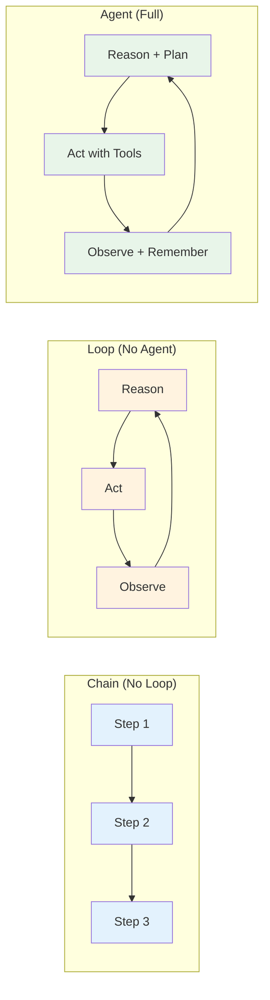
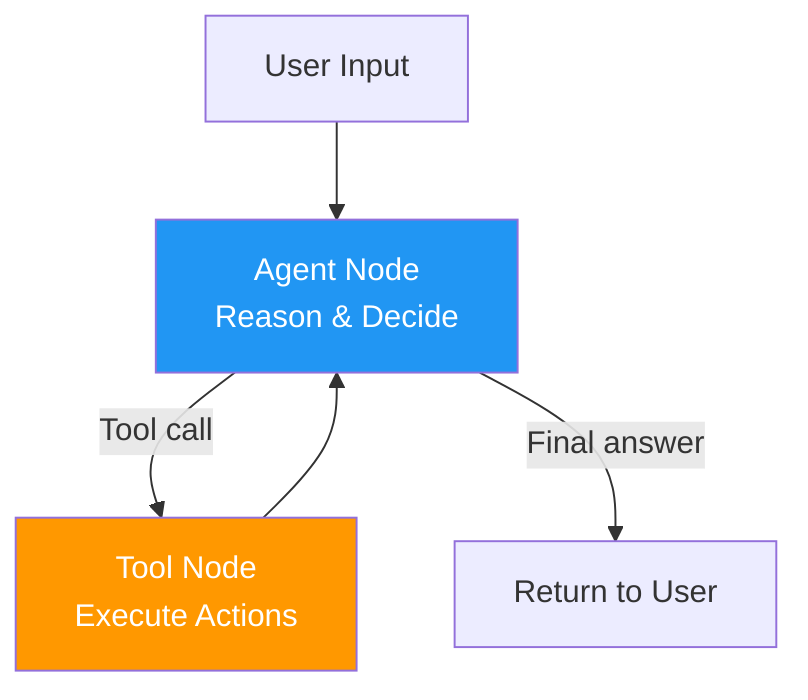
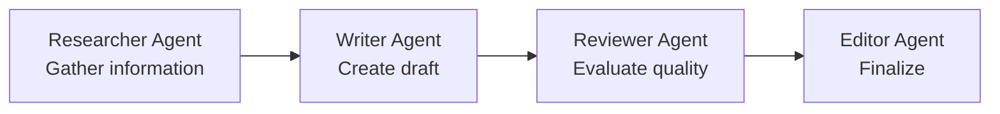
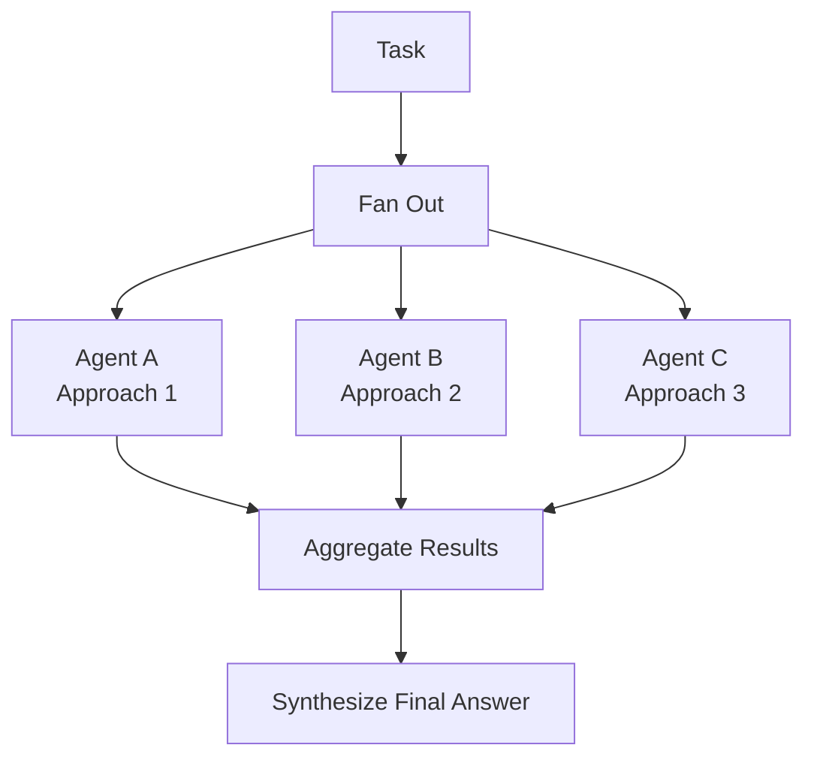
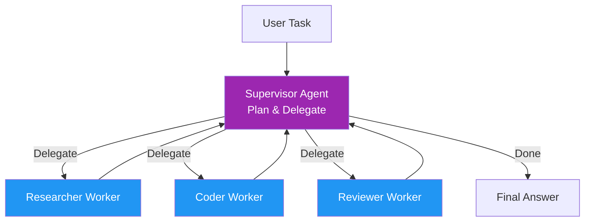
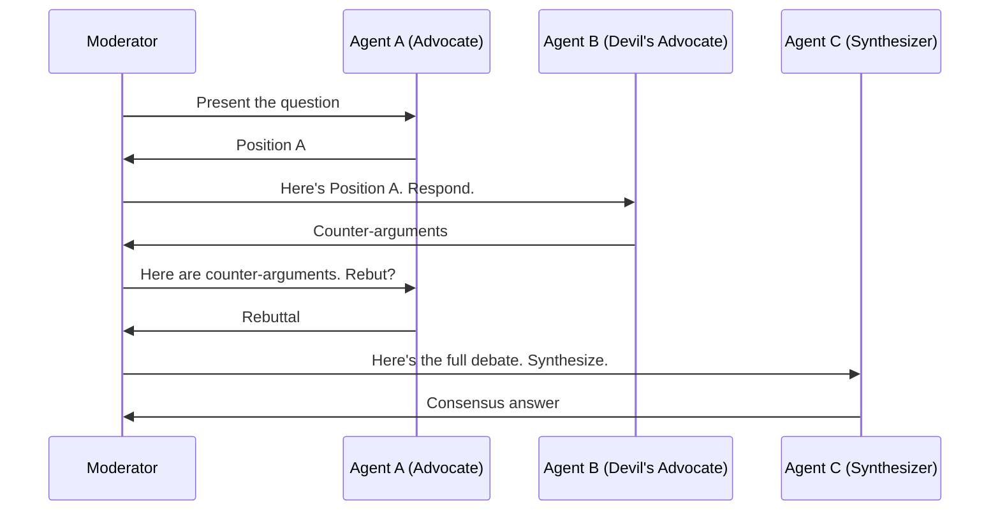
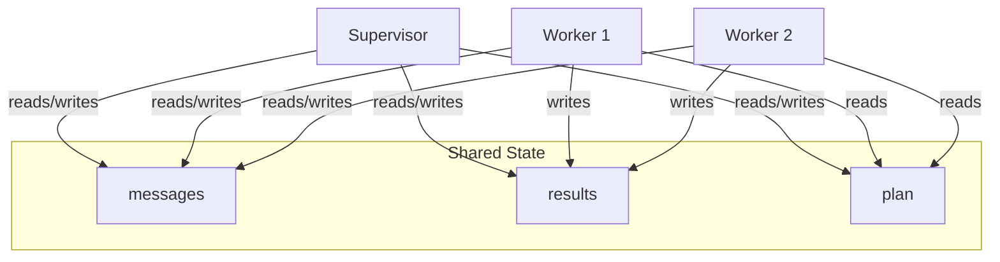

# 15 · AI Agents and Multi-Agent Loops

## Introduction

An **agent** is the natural evolution of a tool-calling loop. Where a simple loop might call a tool, observe the result, and repeat, an agent wraps this loop with **memory** (state persistence), **planning** (reasoning about next steps), and **autonomy** (the ability to decide when to stop). When you combine multiple agents — each with its own specialized capabilities, tools, and objectives — you enter the domain of **multi-agent systems**, where the loop patterns become architectures of coordination, delegation, and collaboration.

This file covers what makes an agent, how single-agent loops work, and the major multi-agent architectures: sequential pipelines, parallel execution, hierarchical orchestration, and debate/consensus patterns. All examples use LangGraph's subgraph and multi-agent patterns.

> **Prerequisite**: Understanding of tool calling (see [14_Tool_and_Function_Calling.md](14_Tool_and_Function_Calling.md)), state management (see [11_State_Context_and_Memory.md](11_State_Context_and_Memory.md)), and planning patterns (see [13_Planning_and_Reasoning.md](13_Planning_and_Reasoning.md)).

---

## What Makes an Agent?

### The Agent Equation

An AI agent can be decomposed into three essential components:

```
Agent = Loop + Tools + Memory
```

| Component | Role | Example |
|---|---|---|
| **Loop** | The iterative cycle of reasoning and acting | ReAct loop, Plan-and-Execute loop |
| **Tools** | The actions the agent can take | Search, calculator, code execution, API calls |
| **Memory** | The agent's ability to retain context across steps | Message history, state persistence, long-term memory |

Without a loop, the agent takes one action and stops. Without tools, the agent can only generate text. Without memory, the agent forgets everything between steps. All three are necessary.

### Agent vs. Chain vs. Loop



A **chain** is a fixed pipeline — each step runs once in order. A **loop** iterates but may lack memory and sophisticated planning. An **agent** has the full combination: autonomous decision-making, tool use, and stateful memory.

---

## Single-Agent Loops

A single-agent loop is the most common agent pattern. One LLM, with access to a set of tools, repeatedly reasons and acts until the task is complete.

### Architecture



This is identical to the tool-calling loop from [14_Tool_and_Function_Calling.md](14_Tool_and_Function_Calling.md) — the distinction is one of **degree**. An "agent" implies the system is designed for autonomy, has a richer set of tools, and may have planning capabilities layered on top.

### Complete Single-Agent Example

```python
from typing import TypedDict, Annotated
from langgraph.graph import StateGraph, END, add_messages
from langgraph.prebuilt import ToolNode, tools_condition
from langgraph.checkpoint.memory import MemorySaver
from langchain_openai import ChatOpenAI
from langchain_core.messages import HumanMessage, SystemMessage

# Tools
@tool
def read_code(filepath: str) -> str:
    """Read source code from a file."""
    try:
        with open(filepath) as f:
            return f.read()
    except FileNotFoundError:
        return f"File not found: {filepath}"

@tool
def write_code(filepath: str, content: str) -> str:
    """Write source code to a file."""
    with open(filepath, "w") as f:
        f.write(content)
    return f"Written {len(content)} chars to {filepath}"

@tool
def run_tests(test_path: str) -> str:
    """Run a test file and return results."""
    import subprocess
    result = subprocess.run(["python", "-m", "pytest", test_path, "-v"], capture_output=True, text=True)
    return f"STDOUT:\n{result.stdout}\nSTDERR:\n{result.stderr}\nReturn code: {result.returncode}"

@tool
def search_web(query: str) -> str:
    """Search the web for documentation and solutions."""
    return f"[Simulated] Results for '{query}': ... "

tools = [read_code, write_code, run_tests, search_web]

# State
class CodingAgentState(TypedDict):
    messages: Annotated[list, add_messages]

# Agent
llm = ChatOpenAI(model="gpt-4o", temperature=0).bind_tools(tools)

SYSTEM = """You are an expert coding agent. You can read, write, and test code.
When given a task:
1. Understand the requirements
2. Read any relevant existing code
3. Plan your approach
4. Write the code
5. Run tests to verify
6. Fix any issues

Always explain what you're doing and why."""

def agent(state: CodingAgentState) -> dict:
    messages = [SystemMessage(content=SYSTEM)] + state["messages"]
    return {"messages": [llm.invoke(messages)]}

# Build
graph = StateGraph(CodingAgentState)
graph.add_node("agent", agent)
graph.add_node("tools", ToolNode(tools, handle_tool_errors=True))
graph.add_edge("tools", "agent")
graph.add_conditional_edges("agent", tools_condition, {"tools": "tools", END: END})
graph.set_entry_point("agent")

coding_agent = graph.compile(checkpointer=MemorySaver())
```

---

## Multi-Agent Architectures

When a task is too complex, too broad, or requires too many specialized capabilities for a single agent, you distribute the work across multiple agents. Each agent is a loop with its own tools, system prompt, and objective.

### Sequential (Pipeline)

Agents execute one after another, each receiving the output of the previous agent as its input. This is the simplest multi-agent pattern.



**Use cases**: Content pipelines, data processing workflows, any task with clear sequential stages.

```python
from langgraph.graph import StateGraph, END

class PipelineState(TypedDict):
    messages: list
    research_findings: str
    draft: str
    review: str
    final: str

def researcher(state: PipelineState) -> dict:
    """Agent 1: Research the topic."""
    prompt = f"Research this topic thoroughly: {state['messages'][0]}\nProvide key findings."
    findings = researcher_llm.invoke(prompt).content
    return {"research_findings": findings}

def writer(state: PipelineState) -> dict:
    """Agent 2: Write a draft based on research."""
    prompt = f"Write a comprehensive article based on these findings:\n{state['research_findings']}"
    draft = writer_llm.invoke(prompt).content
    return {"draft": draft}

def reviewer(state: PipelineState) -> dict:
    """Agent 3: Review the draft."""
    prompt = f"Review this draft for accuracy, clarity, and completeness:\n{state['draft']}\nProvide specific feedback."
    review = reviewer_llm.invoke(prompt).content
    return {"review": review}

def editor(state: PipelineState) -> dict:
    """Agent 4: Apply review feedback and finalize."""
    prompt = f"Improve this draft based on the review:\nDraft: {state['draft']}\nReview: {state['review']}\nReturn the final version."
    final = editor_llm.invoke(prompt).content
    return {"final": final}

# Sequential pipeline
pipeline = StateGraph(PipelineState)
pipeline.add_node("research", researcher)
pipeline.add_node("write", writer)
pipeline.add_node("review", reviewer)
pipeline.add_node("edit", editor)

pipeline.add_edge("research", "write")
pipeline.add_edge("write", "review")
pipeline.add_edge("review", "edit")
pipeline.add_edge("edit", END)
pipeline.set_entry_point("research")
```

### Parallel

Multiple agents work on the same task (or sub-tasks) simultaneously. Results are aggregated afterward.



**Use cases**: Getting multiple perspectives, redundant execution for reliability, processing independent sub-tasks concurrently.

```python
from langgraph.graph import StateGraph, END

class ParallelState(TypedDict):
    task: str
    response_a: str | None
    response_b: str | None
    response_c: str | None
    final_answer: str | None

def agent_a(state: ParallelState) -> dict:
    return {"response_a": llm_a.invoke(f"Solve from a technical perspective: {state['task']}").content}

def agent_b(state: ParallelState) -> dict:
    return {"response_b": llm_b.invoke(f"Solve from a creative perspective: {state['task']}").content}

def agent_c(state: ParallelState) -> dict:
    return {"response_c": llm_c.invoke(f"Solve from a critical/skeptical perspective: {state['task']}").content}

def synthesize(state: ParallelState) -> dict:
    prompt = f"""Synthesize these three perspectives into one comprehensive answer:
    
    Technical: {state['response_a']}
    Creative: {state['response_b']}
    Critical: {state['response_c']}
    
    Task: {state['task']}
    """
    return {"final_answer": llm.invoke(prompt).content}

# Parallel graph — LangGraph fans out and in
parallel = StateGraph(ParallelState)
parallel.add_node("agent_a", agent_a)
parallel.add_node("agent_b", agent_b)
parallel.add_node("agent_c", agent_c)
parallel.add_node("synthesize", synthesize)

parallel.set_entry_point("agent_a")
parallel.add_edge("agent_a", "agent_b")
parallel.add_edge("agent_b", "agent_c")
parallel.add_edge("agent_c", "synthesize")
parallel.add_edge("synthesize", END)
```

> **Note**: For true concurrent execution in LangGraph, you can use the `Send` API for dynamic fan-out or structure your graph so parallel branches are independent.

### Hierarchical (Supervisor)

A **supervisor agent** (orchestrator) manages a team of worker agents. The supervisor decides which worker to call, observes the result, and decides what to do next — including calling a different worker or returning the final answer.



This is the most common production multi-agent pattern. It provides clear coordination while allowing worker specialization.

```python
from typing import TypedDict, Annotated, Literal
from langgraph.graph import StateGraph, END, add_messages
from langgraph.checkpoint.memory import MemorySaver

WORKERS = ["researcher", "coder", "reviewer"]

class SupervisorState(TypedDict):
    messages: Annotated[list, add_messages]
    next_worker: str | None
    task_complete: bool
    results: dict

def supervisor(state: SupervisorState) -> dict:
    """The supervisor decides which worker to call next."""
    prompt = f"""You are a supervisor managing these workers: {WORKERS}
    
    Task: {state['messages'][0].content}
    
    Conversation so far:
    {format_messages(state['messages'])}
    
    Results collected so far:
    {state['results']}
    
    Decide which worker to call next. Respond with ONLY the worker name.
    If the task is complete and you have a final answer, respond with "FINAL".
    """
    response = supervisor_llm.invoke(prompt).content.strip()
    
    if response == "FINAL":
        return {"task_complete": True}
    
    return {"next_worker": response, "messages": [("supervisor", f"Delegating to {response}")]}

def researcher(state: SupervisorState) -> dict:
    prompt = f"As a researcher, address this based on the task: {state['messages'][0].content}\n{format_context(state)}"
    result = researcher_llm.invoke(prompt).content
    results = {**state["results"], "research": result}
    return {"results": results, "messages": [("researcher", result)], "next_worker": None}

def coder(state: SupervisorState) -> dict:
    prompt = f"As a coder, implement based on the task and research: {state['messages'][0].content}\nResearch: {state['results'].get('research', 'None')}"
    result = coder_llm.invoke(prompt).content
    results = {**state["results"], "code": result}
    return {"results": results, "messages": [("coder", result)], "next_worker": None}

def reviewer(state: SupervisorState) -> dict:
    prompt = f"As a reviewer, evaluate this work: {state['results']}\nTask: {state['messages'][0].content}"
    result = reviewer_llm.invoke(prompt).content
    results = {**state["results"], "review": result}
    return {"results": results, "messages": [("reviewer", result)], "next_worker": None}

def route_to_worker(state: SupervisorState) -> str:
    """Route to the worker the supervisor selected."""
    if state["task_complete"]:
        return END
    worker = state.get("next_worker")
    if worker in WORKERS:
        return worker
    return "researcher"  # Default

# Build hierarchical graph
graph = StateGraph(SupervisorState)
graph.add_node("supervisor", supervisor)
graph.add_node("researcher", researcher)
graph.add_node("coder", coder)
graph.add_node("reviewer", reviewer)

# Workers always report back to supervisor
graph.add_edge("researcher", "supervisor")
graph.add_edge("coder", "supervisor")
graph.add_edge("reviewer", "supervisor")

# Supervisor routes to workers or ends
graph.add_conditional_edges("supervisor", route_to_worker, {
    "researcher": "researcher",
    "coder": "coder",
    "reviewer": "reviewer",
    END: END
})
graph.set_entry_point("supervisor")

orchestrator = graph.compile(checkpointer=MemorySaver())
```

### Debate / Consensus

Multiple agents with different perspectives or system prompts discuss a problem, critique each other's positions, and converge on a consensus answer.



```python
class DebateState(TypedDict):
    question: str
    rounds: int
    max_rounds: int
    position_a: str | None
    position_b: str | None
    rebuttals: list[str]
    consensus: str | None

def advocate(state: DebateState) -> dict:
    """Agent A presents or defends its position."""
    if state["rounds"] == 0:
        prompt = f"Take a clear position on: {state['question']}"
    else:
        prompt = f"""Your position: {state['position_a']}
        Counter-arguments: {state['rebuttals'][-1] if state['rebuttals'] else 'None'}
        Defend your position against these counter-arguments."""
    
    return {
        "position_a": advocate_llm.invoke(prompt).content,
        "rounds": state["rounds"] + 1
    }

def devil_advocate(state: DebateState) -> dict:
    """Agent B challenges the position."""
    prompt = f"""Question: {state['question']}
    Position to challenge: {state['position_a']}
    Provide the strongest counter-arguments you can."""
    
    counter = critic_llm.invoke(prompt).content
    rebuttals = state["rebuttals"] + [counter]
    return {"position_b": counter, "rebuttals": rebuttals}

def should_continue_debate(state: DebateState) -> Literal["advocate", "consensus"]:
    if state["rounds"] >= state["max_rounds"]:
        return "consensus"
    return "advocate"

def synthesize_consensus(state: DebateState) -> dict:
    """Agent C synthesizes the debate into a final answer."""
    prompt = f"""Question: {state['question']}
    
    Position A: {state['position_a']}
    Counter-arguments: {state['rebuttals']}
    
    Synthesize a balanced, well-reasoned consensus answer that acknowledges
    the strongest points from both sides."""
    
    return {"consensus": synthesizer_llm.invoke(prompt).content}
```

**Use cases**: Complex decisions with no single right answer, ethical evaluations, policy analysis, red-teaming.

---

## Agent Communication Patterns

### How Agents Share Information

In LangGraph multi-agent systems, agents communicate through **shared state**. When the supervisor delegates to a worker, the worker reads from the shared state, does its work, and writes results back. The supervisor then reads those results to make its next decision.



### Handoff Protocols

When control passes from one agent to another, a **handoff** occurs. Clean handoffs require:

1. **Context passing**: The receiving agent must get enough context to be productive
2. **Objective setting**: Clear statement of what the receiving agent should accomplish
3. **Result format**: Agreement on what the receiving agent should return

```python
def supervisor_to_worker_handoff(state: SupervisorState, worker_name: str) -> dict:
    """Create a clean handoff message for a worker."""
    context = f"""
    === HANDOFF FROM SUPERVISOR ===
    Original task: {state['messages'][0].content}
    Work completed so far: {json.dumps(state['results'], indent=2)}
    Your role: {worker_name}
    What you need to do: {get_worker_instructions(worker_name, state)}
    Expected output format: {get_output_format(worker_name)}
    === END HANDOFF ===
    """
    return {"messages": [("supervisor", context)]}
```

---

## Subgraphs: Encapsulating Agent Loops

LangGraph's **subgraph** feature allows you to define an agent as a self-contained graph and then embed it as a node within a larger graph. This is the primary mechanism for building modular multi-agent systems.

```python
from langgraph.graph import StateGraph, END

# --- Define the Researcher Agent as a subgraph ---
class ResearcherState(TypedDict):
    query: str
    findings: str
    messages: list

def researcher_agent_node(state: ResearcherState) -> dict:
    # ... ReAct loop logic for research
    return {"findings": "Research results..."}

researcher_graph = StateGraph(ResearcherState)
researcher_graph.add_node("research", researcher_agent_node)
researcher_graph.add_edge("research", END)
researcher_graph.set_entry_point("research")
researcher_app = researcher_graph.compile()

# --- Define the Writer Agent as a subgraph ---
class WriterState(TypedDict):
    findings: str
    draft: str

def writer_agent_node(state: WriterState) -> dict:
    prompt = f"Write an article based on: {state['findings']}"
    return {"draft": writer_llm.invoke(prompt).content}

writer_graph = StateGraph(WriterState)
writer_graph.add_node("write", writer_agent_node)
writer_graph.add_edge("write", END)
writer_graph.set_entry_point("write")
writer_app = writer_graph.compile()

# --- Compose into a parent graph ---
class OrchestratorState(TypedDict):
    task: str
    research_findings: str
    final_draft: str

def call_researcher(state: OrchestratorState) -> dict:
    result = researcher_app.invoke({"query": state["task"], "findings": "", "messages": []})
    return {"research_findings": result["findings"]}

def call_writer(state: OrchestratorState) -> dict:
    result = writer_app.invoke({"findings": state["research_findings"], "draft": ""})
    return {"final_draft": result["draft"]}

# Parent graph uses subgraphs as nodes
parent = StateGraph(OrchestratorState)
parent.add_node("researcher", call_researcher)
parent.add_node("writer", call_writer)
parent.add_edge("researcher", "writer")
parent.add_edge("writer", END)
parent.set_entry_point("researcher")

orchestrator = parent.compile()
```

Subgraphs provide clean separation of concerns: each agent has its own state schema, tools, and loop logic, while the parent graph handles coordination.

---

## Orchestration Patterns Comparison

| Pattern | Coordination | Flexibility | Complexity | Best For |
|---|---|---|---|---|
| **Sequential** | Fixed order | Low | Low | Pipelines, content workflows |
| **Parallel** | Fan-out/fan-in | Medium | Medium | Redundancy, multiple perspectives |
| **Hierarchical** | Supervisor decides | High | Medium | Most production multi-agent systems |
| **Debate** | Structured discussion | Medium | High | Decision-making, quality improvement |
| **Subgraph composition** | Parent orchestrates | Very High | High | Complex, modular systems |

---

## Summary

### Cheat Sheet

| Concept | Key Idea | LangGraph Mechanism |
|---|---|---|
| **Agent** | Loop + Tools + Memory | `StateGraph` with tool-calling loop |
| **Supervisor** | Agent that delegates to workers | Conditional edges routing to worker nodes |
| **Sequential pipeline** | Agents in fixed order | Linear edges between agent nodes |
| **Parallel agents** | Agents working simultaneously | Fan-out/fan-in graph structure |
| **Debate** | Agents critique and converge | Alternating nodes with shared state |
| **Handoff** | Clean context passing between agents | Structured state updates |
| **Subgraph** | Encapsulated agent as a node | Compiled sub-graph invoked from parent |
| **Worker specialization** | Each agent has unique tools/prompt | Separate system prompts and tool sets |
| **Shared state** | All agents read/write common data | Single state schema with multiple writers |

### Key Takeaways

1. **An agent is a loop with tools and memory.** Master single-agent loops before adding multi-agent complexity.
2. **Start with sequential, progress to hierarchical.** Sequential pipelines are predictable and debuggable. Add supervisor coordination as needed.
3. **Use subgraphs for modularity.** Each agent should be a self-contained graph that can be tested independently.
4. **Design handoff protocols carefully.** Agents need clear context and objectives when receiving control.
5. **Shared state is both powerful and dangerous.** Multiple writers can conflict — use clear ownership and message-based communication to avoid race conditions.
6. **Match architecture to task complexity.** Don't use a 5-agent hierarchical system for a task a single ReAct agent can handle.

---

## Glossary

| Term | Definition |
|---|---|
| **Agent** | An autonomous system combining a reasoning loop, tools, and memory |
| **Multi-Agent System** | A system where multiple agents collaborate on a task |
| **Supervisor** | An orchestrating agent that delegates work to specialized worker agents |
| **Worker Agent** | A specialized agent that performs a specific type of work |
| **Sequential Pipeline** | A multi-agent pattern where agents execute in a fixed order |
| **Parallel Agents** | A multi-agent pattern where agents work on tasks simultaneously |
| **Debate Pattern** | A multi-agent pattern where agents discuss and critique to reach consensus |
| **Handoff** | The transfer of control and context from one agent to another |
| **Subgraph** | A self-contained LangGraph graph embedded as a node in a larger graph |
| **Orchestration** | The coordination logic that manages how agents interact and share work |

---

## References

- LangGraph Multi-Agent How-To: https://langchain-ai.github.io/langgraph/tutorials/multi_agent/agent_supervisor/
- LangGraph Subgraphs: https://langchain-ai.github.io/langgraph/concepts/subgraphs/
- "Generative Agents: Interactive Simulacra of Human Behavior" — Park et al., 2023
- "AutoGen: Enabling Next-Gen LLM Applications via Multi-Agent Conversation" — Wu et al., 2023
- "Communicative Agents for Software Development" — Hong et al., 2023 (ChatDev)
- CrewAI Documentation: https://docs.crewai.com/
- See also: [11_State_Context_and_Memory.md](11_State_Context_and_Memory.md) for state sharing across agents
- See also: [14_Tool_and_Function_Calling.md](14_Tool_and_Function_Calling.md) for the tool-calling foundation beneath agent loops