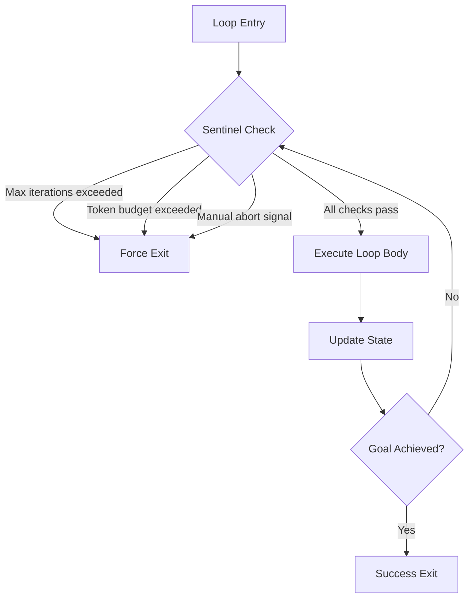
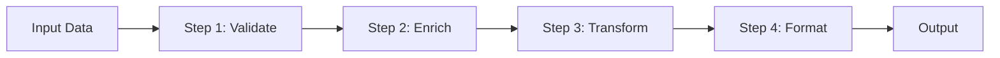
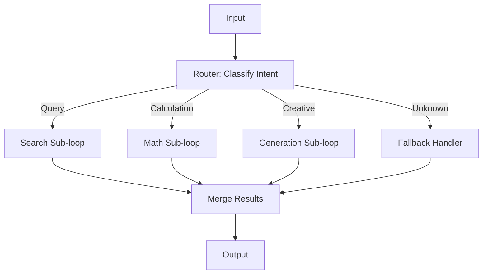
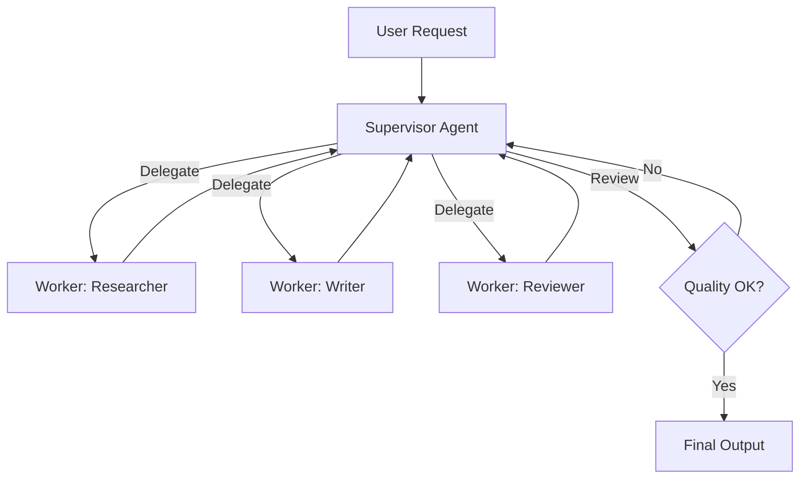
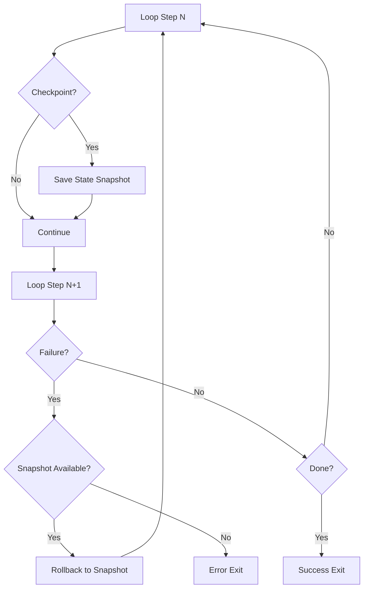
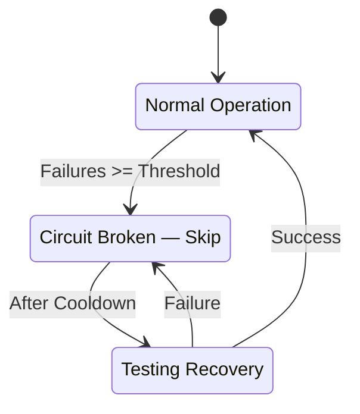
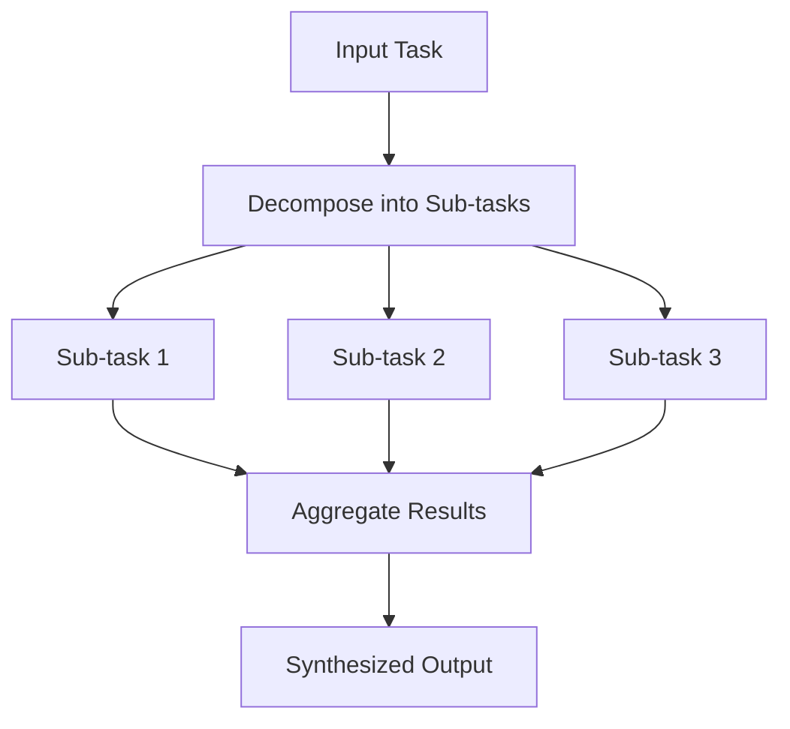
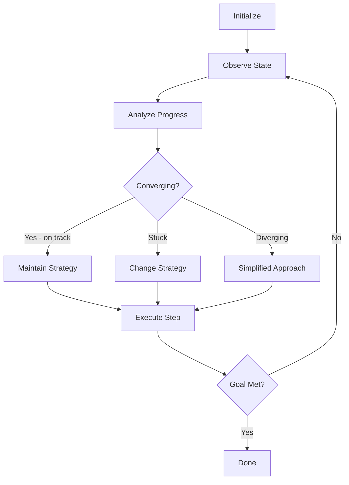
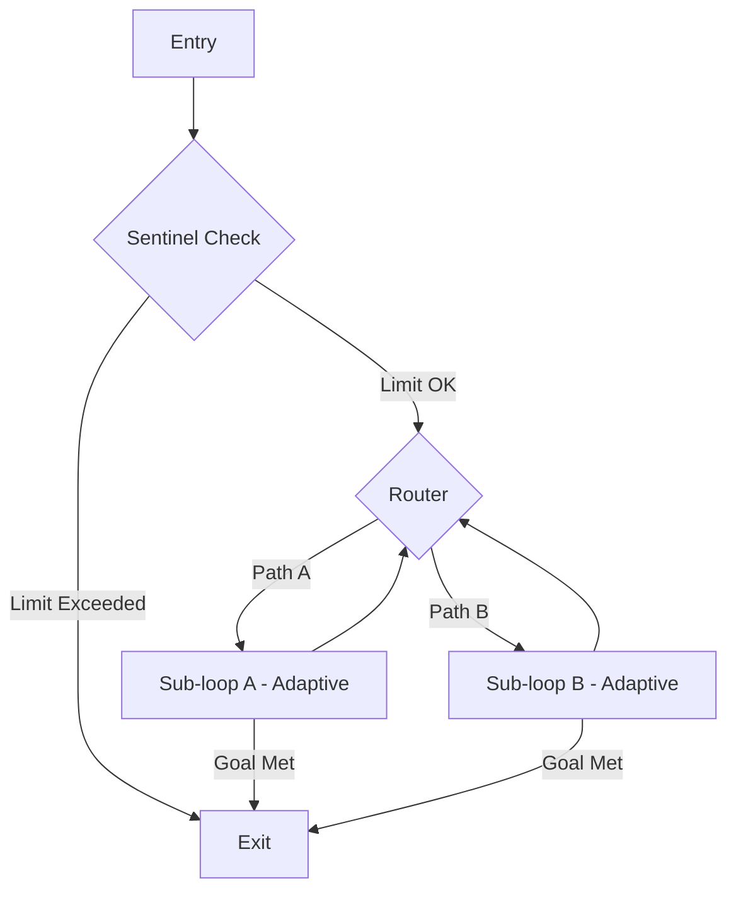

# 16 — Loop Design Patterns

## Introduction

Design patterns are reusable solutions to recurring problems in software architecture. In the emerging discipline of **Loop Engineering**, design patterns provide battle-tested structures for building effective, safe, and efficient iterative AI workflows. Just as the Gang of Four patterns gave object-oriented programmers a shared vocabulary, loop design patterns give AI workflow builders a common language for describing how agents reason, act, observe, and iterate.

This file catalogs the most important loop design patterns you will encounter when building with LangGraph and similar frameworks. Each pattern includes its **intent**, a **structural diagram** (Mermaid), guidance on **when to use it**, and a **LangGraph code snippet** demonstrating the implementation. These patterns are composable — a real-world system will typically combine several of them.

> **Prerequisite Reading**: This file assumes familiarity with core loop concepts from [04_Core_Concepts.md](04_Core_Concepts.md) and loop architecture from [08_Loop_Architecture.md](08_Loop_Architecture.md).

---

## Pattern Catalog Overview

| # | Pattern | Category | Key Idea |
|---|---------|----------|----------|
| 1 | Sentinel Pattern | Guard / Safety | Exit conditions that prevent runaway loops |
| 2 | Pipeline Pattern | Sequential | Linear chain of processing steps |
| 3 | Router Pattern | Branching | Conditional dispatch to different sub-loops |
| 4 | Supervisor Pattern | Orchestration | Oversight loop that delegates and monitors |
| 5 | Memento Pattern | State Management | Snapshot and restore loop state |
| 6 | Circuit Breaker Pattern | Resilience | Halt on repeated failures |
| 7 | Retry with Backoff | Resilience | Exponential delay on transient failures |
| 8 | Fan-out / Fan-in | Parallelism | Split work across sub-agents, merge results |
| 9 | Adaptive Loop | Dynamic | Dynamically adjust iteration behavior |

---

## 1. Sentinel Pattern (Guard Conditions)

### Intent

Prevent a loop from executing beyond safe boundaries by embedding **guard conditions** — "sentinels" — at entry and exit points. The sentinel pattern ensures that a loop will always terminate within acceptable limits, regardless of what the LLM decides.

### Why It Matters

LLMs are non-deterministic. An agent might decide to keep searching, keep refining, or keep asking questions indefinitely. Sentinels provide hard boundaries that the agent cannot override.

### Structure



### When to Use

- Every loop that involves LLM calls (this should be considered a default)
- Loops with non-deterministic branching where the path length is unpredictable
- Production systems where cost and latency must be bounded

### LangGraph Implementation

```python
from langgraph.graph import StateGraph, END
from typing import TypedDict, Annotated
import operator

class LoopState(TypedDict):
    messages: Annotated[list, operator.add]
    iterations: int
    max_iterations: int
    total_tokens: int
    token_budget: int
    result: str

def sentinel_check(state: LoopState) -> str:
    """Guard condition: enforce hard limits."""
    if state["iterations"] >= state["max_iterations"]:
        print(f"[SENTINEL] Max iterations ({state['max_iterations']}) reached.")
        return "force_exit"
    if state["total_tokens"] >= state["token_budget"]:
        print(f"[SENTINEL] Token budget ({state['token_budget']}) exceeded.")
        return "force_exit"
    return "execute"

def execute_step(state: LoopState) -> dict:
    """The actual loop body — call an LLM or tool."""
    return {
        "iterations": state["iterations"] + 1,
        "total_tokens": state["total_tokens"] + 500,  # estimated
        "result": f"Processed iteration {state['iterations'] + 1}"
    }

def goal_check(state: LoopState) -> str:
    """Check if the loop's purpose has been fulfilled."""
    if "complete" in state.get("result", "").lower():
        return "end"
    return "sentinel"

def force_exit(state: LoopState) -> dict:
    return {"result": state["result"] + " [TRUNCATED BY SENTINEL]"}

# Build the graph
builder = StateGraph(LoopState)
builder.add_node("sentinel", sentinel_check)   # conditional node
builder.add_node("execute", execute_step)
builder.add_node("force_exit", force_exit)

builder.set_entry_point("sentinel")
builder.add_conditional_edges("sentinel", sentinel_check, {
    "force_exit": "force_exit",
    "execute": "execute"
})
builder.add_conditional_edges("execute", goal_check, {
    "end": END,
    "sentinel": "sentinel"
})
builder.add_edge("force_exit", END)

graph = builder.compile()
```

> **Key Insight**: The sentinel is not part of the "happy path" — it is infrastructure. Design your loops so that sentinels fire only in exceptional cases, but always have them in place.

---

## 2. Pipeline Pattern (Sequential Processing)

### Intent

Process data through a **fixed sequence of steps**, where the output of one step feeds into the next. Each step is a discrete transformation, and the overall behavior is the composition of all steps in order.

### Structure



### When to Use

- Data preprocessing pipelines (cleaning, structuring, formatting)
- Multi-stage generation (outline → draft → edit → finalize)
- Any workflow where steps have a clear, fixed ordering with no branching

### LangGraph Implementation

```python
from langgraph.graph import StateGraph, END
from typing import TypedDict

class PipelineState(TypedDict):
    raw_input: str
    validated: str
    enriched: str
    transformed: str
    final_output: str
    errors: list[str]

def validate(state: PipelineState) -> dict:
    text = state["raw_input"]
    if len(text) < 10:
        return {"errors": ["Input too short"]}
    return {"validated": text.strip()}

def enrich(state: PipelineState) -> dict:
    # Simulate enrichment (e.g., adding context, metadata)
    return {"enriched": f"[ENRICHED] {state['validated']}"}

def transform(state: PipelineState) -> dict:
    # Simulate transformation (e.g., summarization, translation)
    return {"transformed": state["enriched"].upper()}

def format_output(state: PipelineState) -> dict:
    return {"final_output": f"=== RESULT ===\n{state['transformed']}\n==="}

builder = StateGraph(PipelineState)
builder.add_node("validate", validate)
builder.add_node("enrich", enrich)
builder.add_node("transform", transform)
builder.add_node("format", format_output)

builder.set_entry_point("validate")
builder.add_edge("validate", "enrich")
builder.add_edge("enrich", "transform")
builder.add_edge("transform", "format")
builder.add_edge("format", END)

pipeline = builder.compile()
```

> **Note**: The pipeline is the simplest loop pattern — technically, it has no loop at all (each step runs once). It serves as the backbone that other patterns (like retry or conditional branching) can be layered onto.

---

## 3. Router Pattern (Conditional Branching)

### Intent

Dynamically **dispatch to different sub-workflows** based on the current state or LLM decision. The router acts as a switch that selects which branch to execute, much like an `if/elif/else` chain but at the workflow level.

### Structure



### When to Use

- Multi-purpose agents that handle different types of requests
- Systems where the appropriate tool or workflow depends on the input
- Any scenario requiring dynamic dispatch based on classification or decision

### LangGraph Implementation

```python
from langgraph.graph import StateGraph, END
from typing import TypedDict, Literal

class RouterState(TypedDict):
    user_input: str
    intent: str
    search_result: str
    math_result: str
    creative_result: str
    fallback_result: str
    final_answer: str

def classify_intent(state: RouterState) -> dict:
    """LLM-powered intent classification."""
    text = state["user_input"].lower()
    if any(w in text for w in ["search", "find", "look up"]):
        return {"intent": "search"}
    elif any(w in text for w in ["calculate", "compute", "solve"]):
        return {"intent": "calculation"}
    elif any(w in text for w in ["write", "create", "generate"]):
        return {"intent": "creative"}
    return {"intent": "unknown"}

def route_intent(state: RouterState) -> str:
    routing_map = {
        "search": "search_handler",
        "calculation": "math_handler",
        "creative": "creative_handler",
        "unknown": "fallback_handler",
    }
    return routing_map.get(state["intent"], "fallback_handler")

def search_handler(state: RouterState) -> dict:
    return {"search_result": f"[Search results for: {state['user_input']}]"}

def math_handler(state: RouterState) -> dict:
    return {"math_result": f"[Calculation result for: {state['user_input']}]"}

def creative_handler(state: RouterState) -> dict:
    return {"creative_result": f"[Generated content for: {state['user_input']}]"}

def fallback_handler(state: RouterState) -> dict:
    return {"fallback_result": "I'm not sure how to handle that. Could you rephrase?"}

def merge_results(state: RouterState) -> dict:
    result = (
        state.get("search_result")
        or state.get("math_result")
        or state.get("creative_result")
        or state.get("fallback_result")
    )
    return {"final_answer": result}

builder = StateGraph(RouterState)
builder.add_node("router", classify_intent)
builder.add_node("search_handler", search_handler)
builder.add_node("math_handler", math_handler)
builder.add_node("creative_handler", creative_handler)
builder.add_node("fallback_handler", fallback_handler)
builder.add_node("merge", merge_results)

builder.set_entry_point("router")
builder.add_conditional_edges("router", route_intent, {
    "search_handler": "search_handler",
    "math_handler": "math_handler",
    "creative_handler": "creative_handler",
    "fallback_handler": "fallback_handler",
})
# All handlers converge to merge
for handler in ["search_handler", "math_handler", "creative_handler", "fallback_handler"]:
    builder.add_edge(handler, "merge")
builder.add_edge("merge", END)

router_graph = builder.compile()
```

---

## 4. Supervisor Pattern (Oversight Loop)

### Intent

Create a **meta-loop** — a supervisor agent that oversees, delegates to, and coordinates multiple worker sub-agents. The supervisor decides which worker to invoke next, reviews outputs, and determines when the overall task is complete.

### Structure



### When to Use

- Complex tasks that require multiple specialized capabilities
- Systems where a coordinating intelligence must manage task flow
- Multi-agent architectures with role specialization

### LangGraph Implementation

```python
from langgraph.graph import StateGraph, END
from typing import TypedDict, Annotated, Literal
import operator

class SupervisorState(TypedDict):
    task: str
    plan: list[str]
    current_step: int
    research_notes: str
    draft: str
    review_feedback: str
    final_output: str
    iteration: int
    max_iterations: int
    history: Annotated[list[str], operator.add]

def supervisor(state: SupervisorState) -> dict:
    """Supervisor decides next action based on current state."""
    step = state["current_step"]
    plan = state["plan"]

    if step >= len(plan) or state["iteration"] >= state["max_iterations"]:
        return {"final_output": state.get("draft", "Task complete.")}

    action = plan[step]
    return {"current_step": step + 1, "iteration": state["iteration"] + 1,
            "history": [f"Supervisor dispatched: {action}"]}

def route_supervisor(state: SupervisorState) -> str:
    if state.get("final_output"):
        return "end"
    plan = state["plan"]
    step = min(state["current_step"] - 1, len(plan) - 1)
    action = plan[step]
    if "research" in action.lower():
        return "researcher"
    elif "write" in action.lower() or "draft" in action.lower():
        return "writer"
    elif "review" in action.lower():
        return "reviewer"
    return "researcher"

def researcher(state: SupervisorState) -> dict:
    return {
        "research_notes": f"Research findings for: {state['task']}",
        "history": ["Researcher completed research phase."]
    }

def writer(state: SupervisorState) -> dict:
    return {
        "draft": f"Draft based on: {state.get('research_notes', 'no research')}",
        "history": ["Writer completed draft phase."]
    }

def reviewer(state: SupervisorState) -> dict:
    feedback = "Looks good." if "findings" in state.get("draft", "") else "Needs more research."
    return {
        "review_feedback": feedback,
        "history": [f"Reviewer feedback: {feedback}"]
    }

builder = StateGraph(SupervisorState)
builder.add_node("supervisor", supervisor)
builder.add_node("researcher", researcher)
builder.add_node("writer", writer)
builder.add_node("reviewer", reviewer)

builder.set_entry_point("supervisor")
builder.add_conditional_edges("supervisor", route_supervisor, {
    "researcher": "researcher",
    "writer": "writer",
    "reviewer": "reviewer",
    "end": END,
})
# All workers report back to supervisor
for worker in ["researcher", "writer", "reviewer"]:
    builder.add_edge(worker, "supervisor")

supervisor_graph = builder.compile()

# Usage
initial_state = {
    "task": "Write a report on renewable energy",
    "plan": ["Research renewable energy trends", "Draft the report", "Review the draft"],
    "current_step": 0,
    "iteration": 0,
    "max_iterations": 10,
    "research_notes": "",
    "draft": "",
    "review_feedback": "",
    "final_output": "",
    "history": [],
}
```

---

## 5. Memento Pattern (State Snapshots)

### Intent

Capture and store **snapshots of loop state** at key points, enabling rollback, replay, or analysis of the loop's execution history. Named after the Gang of Four Memento pattern, adapted for iterative AI workflows.

### Structure



### When to Use

- Long-running loops where failure recovery is important
- Debugging complex multi-step workflows
- Systems that need audit trails of state transitions
- Human-in-the-loop systems where users may want to undo steps

### LangGraph Implementation

```python
from langgraph.graph import StateGraph, END
from typing import TypedDict
from copy import deepcopy

class MementoState(TypedDict):
    current_step: int
    data: dict
    snapshots: list[dict]
    checkpoint_every: int
    status: str

def process_step(state: MementoState) -> dict:
    step = state["current_step"]
    new_data = deepcopy(state["data"])
    new_data[f"step_{step}"] = f"result_of_step_{step}"

    snapshots = list(state["snapshots"])

    # Checkpoint logic
    if state["checkpoint_every"] > 0 and step % state["checkpoint_every"] == 0:
        snapshots.append({"step": step, "data": deepcopy(new_data)})

    return {
        "current_step": step + 1,
        "data": new_data,
        "snapshots": snapshots,
    }

def should_continue(state: MementoState) -> str:
    if state["current_step"] >= 5:
        return "end"
    return "process"

def rollback(state: MementoState) -> dict:
    """Restore to the last snapshot."""
    if state["snapshots"]:
        last = state["snapshots"][-1]
        return {
            "current_step": last["step"],
            "data": deepcopy(last["data"]),
            "status": "rolled_back"
        }
    return {"status": "no_snapshot_available"}

builder = StateGraph(MementoState)
builder.add_node("process", process_step)
builder.add_node("rollback", rollback)

builder.set_entry_point("process")
builder.add_conditional_edges("process", should_continue, {
    "process": "process",
    "end": END,
})
builder.add_edge("rollback", "process")

memento_graph = builder.compile()

initial = {
    "current_step": 0,
    "data": {},
    "snapshots": [],
    "checkpoint_every": 2,
    "status": "running",
}
```

> **LangGraph Tip**: LangGraph has built-in checkpointing via `MemorySaver` and `SqliteSaver`. Use those for persistence across runs. The Memento pattern here refers to *application-level* snapshots for rollback logic within a single run.

---

## 6. Circuit Breaker Pattern (Failure Handling)

### Intent

Prevent a loop from **repeatedly attempting an operation that is failing**. After a threshold of consecutive failures, the circuit "breaks" and stops trying, optionally falling back to an alternative path.

### Structure



### When to Use

- Loops that call external APIs, databases, or tools that may become unavailable
- Any loop where repeated failure wastes resources (tokens, time, money)
- Systems that need graceful degradation

### LangGraph Implementation

```python
from langgraph.graph import StateGraph, END
from typing import TypedDict

class CircuitBreakerState(TypedDict):
    task: str
    failure_count: int
    failure_threshold: int
    cooldown_period: int
    circuit_state: str  # "closed", "open", "half_open"
    attempts_since_open: int
    result: str

def attempt_operation(state: CircuitBreakerState) -> dict:
    if state["circuit_state"] == "open":
        return {"result": "[SKIPPED] Circuit is open"}

    # Simulate an operation (randomly fails for demo)
    import random
    success = random.random() > 0.6  # 60% failure rate

    if success:
        return {
            "result": "[SUCCESS] Operation completed",
            "failure_count": 0,
            "circuit_state": "closed",
            "attempts_since_open": 0,
        }
    else:
        new_count = state["failure_count"] + 1
        new_state = "open" if new_count >= state["failure_threshold"] else "closed"
        return {
            "result": f"[FAILURE] Operation failed (count: {new_count})",
            "failure_count": new_count,
            "circuit_state": new_state,
        }

def should_retry(state: CircuitBreakerState) -> str:
    if state["circuit_state"] == "open":
        # After cooldown, transition to half_open
        if state["attempts_since_open"] < state["cooldown_period"]:
            return "wait"
        return "half_open"
    if state["circuit_state"] == "closed" and state["failure_count"] < state["failure_threshold"]:
        return "retry"
    return "end"

def wait_then_retry(state: CircuitBreakerState) -> dict:
    return {"attempts_since_open": state["attempts_since_open"] + 1}

def half_open_probe(state: CircuitBreakerState) -> dict:
    return {"circuit_state": "half_open", "attempts_since_open": 0}

builder = StateGraph(CircuitBreakerState)
builder.add_node("attempt", attempt_operation)
builder.add_node("wait", wait_then_retry)
builder.add_node("half_open", half_open_probe)

builder.set_entry_point("attempt")
builder.add_conditional_edges("attempt", should_retry, {
    "retry": "attempt",
    "wait": "wait",
    "half_open": "half_open",
    "end": END,
})
builder.add_edge("wait", "attempt")
builder.add_edge("half_open", "attempt")

circuit_graph = builder.compile()
```

---

## 7. Retry with Backoff

### Intent

When an operation fails, **retry it with progressively longer delays** between attempts. This prevents hammering a failing service and gives transient issues time to resolve.

### When to Use

- API calls that experience rate limiting (HTTP 429)
- Network operations with transient failures
- LLM calls that may hit rate limits or experience timeouts

### Implementation Approach

In LangGraph, retry with backoff is typically implemented as a wrapper around node functions rather than as a graph-level pattern:

```python
import time
import random

def retry_with_backoff(func, max_retries=3, base_delay=1.0, max_delay=30.0):
    """Decorator-style retry logic for any node function."""
    def wrapper(*args, **kwargs):
        last_error = None
        for attempt in range(max_retries):
            try:
                return func(*args, **kwargs)
            except Exception as e:
                last_error = e
                delay = min(base_delay * (2 ** attempt) + random.uniform(0, 1), max_delay)
                print(f"[RETRY] Attempt {attempt + 1} failed: {e}. Waiting {delay:.1f}s...")
                time.sleep(delay)
        raise last_error  # All retries exhausted
    return wrapper

# Usage in a LangGraph node
@retry_with_backoff(max_retries=3, base_delay=2.0)
def call_llm_with_retry(state):
    """Call an LLM with automatic retry on failure."""
    # Your LLM call here
    return {"result": "LLM response"}
```

### Backoff Strategies Comparison

| Strategy | Delay Formula | Best For |
|----------|--------------|----------|
| Fixed | `delay = N` | Simple, predictable retries |
| Linear | `delay = N * attempt` | Moderate backoff |
| Exponential | `delay = base * 2^attempt` | Rate-limited APIs (most common) |
| Exponential + Jitter | `delay = base * 2^attempt + random(0, 1)` | Preventing thundering herd |
| Custom | Domain-specific | Specialized requirements |

---

## 8. Fan-out / Fan-in Pattern

### Intent

**Split a task into parallel sub-tasks** (fan-out), execute them concurrently or in sequence, then **aggregate the results** (fan-in). This pattern is essential for scalability and for tasks that benefit from multiple perspectives.

### Structure



### When to Use

- Research tasks that benefit from multiple source queries
- Code review from multiple angles (security, performance, style)
- Generating multiple candidates and selecting the best one
- Any embarrassingly parallel work within a loop

### LangGraph Implementation

```python
from langgraph.graph import StateGraph, END
from typing import TypedDict, Annotated
import operator

class FanOutState(TypedDict):
    question: str
    sub_questions: list[str]
    sub_answers: Annotated[list[str], operator.add]
    synthesized_answer: str

def decompose(state: FanOutState) -> dict:
    """Break the main question into sub-questions."""
    q = state["question"]
    return {
        "sub_questions": [
            f"What is the definition of {q}?",
            f"What are the benefits of {q}?",
            f"What are the challenges of {q}?",
        ],
        "sub_answers": [],  # Reset for fan-in
    }

# In LangGraph, we fan out by running sub-tasks.
# For true parallelism, use asyncio with LangGraph's async support.
def fan_out_tasks(state: FanOutState) -> dict:
    """Execute each sub-question. In production, use parallel map."""
    answers = []
    for sq in state["sub_questions"]:
        answers.append(f"[Answer for: {sq}]")
    return {"sub_answers": answers}

def synthesize(state: FanOutState) -> dict:
    """Combine all sub-answers into a final response."""
    combined = "\n".join(f"- {a}" for a in state["sub_answers"])
    return {
        "synthesized_answer": f"Synthesis for '{state['question']}':\n{combined}"
    }

builder = StateGraph(FanOutState)
builder.add_node("decompose", decompose)
builder.add_node("fan_out", fan_out_tasks)
builder.add_node("synthesize", synthesize)

builder.set_entry_point("decompose")
builder.add_edge("decompose", "fan_out")
builder.add_edge("fan_out", "synthesize")
builder.add_edge("synthesize", END)

fanout_graph = builder.compile()

# For true async parallelism with LangGraph:
# builder.add_node("fan_out", fan_out_tasks)  # Make fan_out_tasks async
# Use Send() API for dynamic fan-out in LangGraph
```

> **Advanced**: LangGraph's `Send()` API enables dynamic fan-out where the number of sub-tasks is determined at runtime. See [08_Loop_Architecture.md](08_Loop_Architecture.md) for more on parallel execution patterns.

---

## 9. Adaptive Loop (Dynamic Iteration)

### Intent

Create a loop that **dynamically adjusts its own behavior** based on observations from previous iterations. The loop modifies its strategy, parameters, or even its structure in response to what it learns during execution.

### Structure



### When to Use

- Optimization loops where the approach needs to evolve
- Creative tasks requiring iterative refinement with shifting tactics
- Complex problem-solving where a single strategy is insufficient
- Self-improving systems that learn from their own execution

### LangGraph Implementation

```python
from langgraph.graph import StateGraph, END
from typing import TypedDict

class AdaptiveState(TypedDict):
    goal: str
    strategy: str
    attempt: int
    max_attempts: int
    quality_score: float
    history: list[dict]
    result: str
    status: str

def analyze_and_adapt(state: AdaptiveState) -> dict:
    """Evaluate progress and potentially switch strategies."""
    score = state["quality_score"]
    history = list(state.get("history", []))
    attempt = state["attempt"]
    strategy = state["strategy"]

    strategies = ["detailed", "concise", "examples_first", "step_by_step"]

    if score > 0.8:
        # High quality — maintain current strategy
        new_strategy = strategy
        status = "on_track"
    elif score > 0.5:
        # Medium quality — try next strategy
        idx = strategies.index(strategy) if strategy in strategies else 0
        new_strategy = strategies[(idx + 1) % len(strategies)]
        status = "adapting"
    else:
        # Low quality — try a fundamentally different approach
        new_strategy = "step_by_step"  # Fallback to most reliable
        status = "pivoting"

    history.append({
        "attempt": attempt,
        "strategy": strategy,
        "score": score,
        "status": status,
    })

    return {
        "strategy": new_strategy,
        "history": history,
        "status": status,
        "attempt": attempt + 1,
    }

def execute_with_strategy(state: AdaptiveState) -> dict:
    """Execute the current step using the active strategy."""
    strategy = state["strategy"]
    # Simulate quality improving (or not) based on strategy
    import random
    base_score = {"step_by_step": 0.7, "detailed": 0.6, "concise": 0.5, "examples_first": 0.65}
    score = min(1.0, base_score.get(strategy, 0.5) + random.uniform(-0.1, 0.2))
    return {
        "quality_score": round(score, 2),
        "result": f"Attempt {state['attempt']} with strategy '{strategy}' → score: {score:.2f}"
    }

def should_continue(state: AdaptiveState) -> str:
    if state["quality_score"] >= 0.85:
        return "end"
    if state["attempt"] >= state["max_attempts"]:
        return "end"
    return "adapt"

builder = StateGraph(AdaptiveState)
builder.add_node("adapt", analyze_and_adapt)
builder.add_node("execute", execute_with_strategy)

builder.set_entry_point("adapt")
builder.add_edge("adapt", "execute")
builder.add_conditional_edges("execute", should_continue, {
    "adapt": "adapt",
    "end": END,
})

adaptive_graph = builder.compile()

initial = {
    "goal": "Explain quantum computing",
    "strategy": "detailed",
    "attempt": 0,
    "max_attempts": 8,
    "quality_score": 0.0,
    "history": [],
    "result": "",
    "status": "starting",
}
```

---

## Pattern Composition

Real-world loop engineering systems rarely use a single pattern in isolation. The power comes from **composing patterns** to create robust, sophisticated workflows.

### Common Compositions

| Composition | Description | Example Use Case |
|-------------|-------------|-----------------|
| Sentinel + Any | Add safety guards to any loop | Every production loop |
| Router + Pipeline | Route to different pipelines | Multi-purpose processing |
| Supervisor + Fan-out | Supervisor delegates parallel work | Research agent with parallel searches |
| Circuit Breaker + Retry | Breaker prevents retries when system is down | API integration loops |
| Adaptive + Memento | Adapt strategy with rollback capability | Self-optimizing systems |
| Sentinel + Adaptive | Adaptive loop with hard limits | Bounded self-improvement |

### Composition Example: Sentinel + Router + Adaptive



---

## Summary

### Cheat Sheet

| Pattern | One-Line Summary | Key Benefit |
|---------|-----------------|-------------|
| Sentinel | Hard limits on loop execution | Safety, cost control |
| Pipeline | Fixed sequential processing | Simplicity, predictability |
| Router | Conditional dispatch | Flexibility, multi-capability |
| Supervisor | Meta-loop overseeing workers | Coordination, quality |
| Memento | State snapshots for rollback | Debugging, recovery |
| Circuit Breaker | Halt on repeated failures | Resilience, resource savings |
| Retry w/ Backoff | Progressive retry delays | Transient failure handling |
| Fan-out/Fan-in | Parallel decomposition | Scalability, multiple perspectives |
| Adaptive | Self-adjusting iteration | Optimization, resilience |

### Choosing the Right Pattern

1. **Start with Pipeline** for any linear workflow
2. **Add Sentinel** to every loop with LLM calls
3. **Add Router** when you need conditional branching
4. **Upgrade to Supervisor** when coordination is needed
5. **Add Circuit Breaker + Retry** for external dependencies
6. **Use Fan-out** when tasks can be parallelized
7. **Apply Adaptive** when strategies need to evolve

---

## Glossary

| Term | Definition |
|------|-----------|
| **Design Pattern** | A reusable solution template for a recurring problem in a specific context |
| **Sentinel** | A guard condition that enforces loop termination boundaries |
| **Fan-out** | Splitting a single task into multiple parallel sub-tasks |
| **Fan-in** | Aggregating results from multiple sub-tasks into a single output |
| **Circuit Breaker** | A pattern that prevents repeated calls to a failing service |
| **Backoff** | The strategy for spacing out retry attempts over time |
| **Supervisor** | A coordinating agent that delegates to and monitors worker agents |
| **Pattern Composition** | Combining multiple design patterns to create complex behaviors |

---

## References

- Gamma, E., et al. *Design Patterns: Elements of Reusable Object-Oriented Software* (1994) — Foundational patterns text
- LangGraph Documentation: [StateGraph](https://langchain-ai.github.io/langgraph/) — Official reference for graph-based workflows
- Microsoft: *Autonomous Agents Design Patterns* — Cloud-native agent pattern catalog
- [06_Loop_Control_Flow.md](06_Loop_Control_Flow.md) — Companion file on control flow mechanics
- [08_Loop_Architecture.md](08_Loop_Architecture.md) — Architectural patterns and system design
- [19_Best_Practices_and_Common_Mistakes.md](19_Best_Practices_and_Common_Mistakes.md) — Practical wisdom for applying these patterns