# 17 — Workflow and Diagrams

## Introduction

A loop engineering system is only as good as its documentation. Complex iterative workflows involving LLMs, tools, conditional branching, and state management are inherently difficult to reason about. Without clear visual and textual documentation, even the original author will struggle to understand the system after a few weeks. **Workflow design and diagramming** is the discipline of capturing the structure, behavior, and intent of loop systems in a way that is precise, unambiguous, and communicable.

This file covers the principles of workflow design, the diagram types most useful for loop engineering (with a focus on Mermaid), how to translate problem statements into documented workflows, and the anti-patterns to avoid. By the end, you should be able to take any loop engineering problem and produce professional, clear documentation that serves both as a design tool and a communication artifact.

> **Related Files**: See [16_Loop_Design_Patterns.md](16_Loop_Design_Patterns.md) for the structural patterns these diagrams represent, and [08_Loop_Architecture.md](08_Loop_Architecture.md) for system-level architecture documentation.

---

## Workflow Design Principles

### The Five Principles of Loop Workflow Design

Every well-documented loop workflow should adhere to these five principles:

1. **Explicit Entry and Exit**: Every loop must have a clearly defined starting point and at least one termination condition. If a diagram has arrows going in circles without an exit, it is incomplete.

2. **Single Responsibility per Node**: Each node in a workflow should do one well-defined thing. If a node's description requires "and then," it should be split into multiple nodes.

3. **State Visibility**: The diagram should make it clear what state is being passed between nodes. Hidden state mutations are the source of most loop bugs.

4. **Error Paths Are First-Class**: Error handling, fallbacks, and failure modes should be drawn explicitly — not hidden in a node's implementation.

5. **Composability Over Complexity**: Prefer workflows composed of smaller, named sub-workflows over one monolithic diagram. Name your sub-workflows and reference them.

### Why Diagrams Matter for Loops

Loops are the hardest construct to reason about in any system. In traditional software, loops are bounded by `for` and `while` constructs. In loop engineering, the "loop" is the entire workflow — and it may branch, fork, merge, and recurse. Diagrams provide:

- **Mental models** that make complex behavior graspable at a glance
- **Communication tools** for team discussions and code reviews
- **Design aids** that reveal problems before code is written
- **Documentation artifacts** that outlast any individual's memory of the system

---

## Mermaid Diagram Types for Loop Engineering

Mermaid is the de facto standard for embedding diagrams in markdown. It supports several diagram types, each suited to different aspects of loop engineering. Below, we explore the four most useful types: **flowchart**, **sequence diagram**, **state diagram**, and **class diagram**.

### 1. Flowchart Diagrams

Flowcharts are the workhorse of loop engineering documentation. They show the **control flow** — what happens, in what order, and under what conditions.

**Best for**: Overall workflow logic, decision points, loop structures, error handling paths.

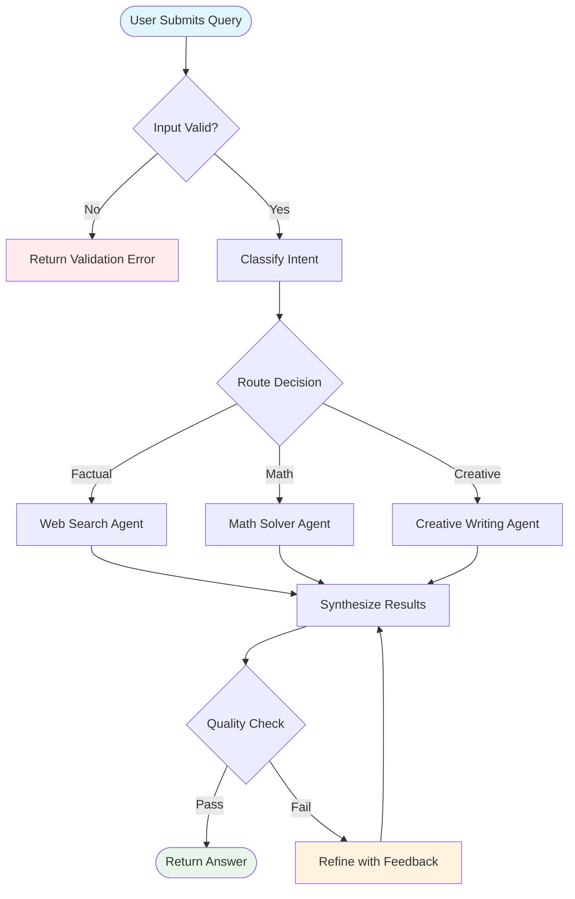

**Flowchart conventions for loops**:
- Use **rounded rectangles** (`(text)`) or **stadium shapes** (`([text])`) for start/end nodes
- Use **diamonds** (`{text}`) for decision/conditional nodes
- Use **rectangles** (`[text]`) for processing/action nodes
- Color-code by category (blue for input, green for output, red for errors, orange for retries)
- Always include loop-back arrows with labels explaining the condition

### 2. Sequence Diagrams

Sequence diagrams show **interactions over time** between components. They are ideal for documenting how agents, tools, and external services communicate within a loop.

**Best for**: Agent-tool interactions, multi-agent communication, API call sequences, human-in-the-loop protocols.

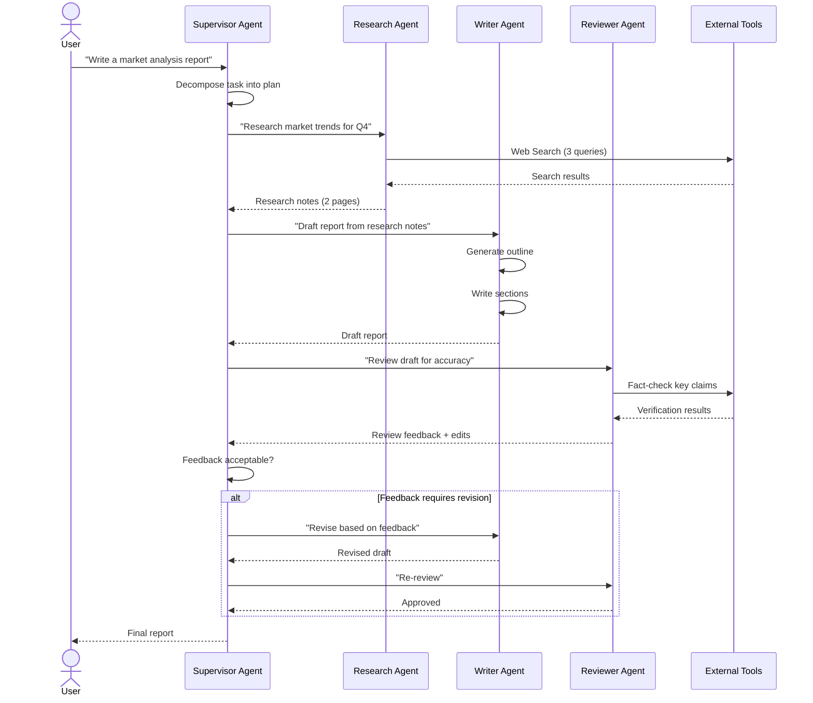

**Sequence diagram conventions for loops**:
- Use **alt/opt/loop** blocks for conditional and iterative behavior
- Label each message with the data being passed
- Include activation boxes to show when a component is processing
- Group related interactions with **rect** or **alt** blocks

### 3. State Diagrams

State diagrams show the **lifecycle of a loop's state machine** — what states exist, how transitions happen, and what triggers them. They are essential for documenting loops with complex state management.

**Best for**: Loop lifecycle, state machine definitions, circuit breaker patterns, multi-phase workflows.

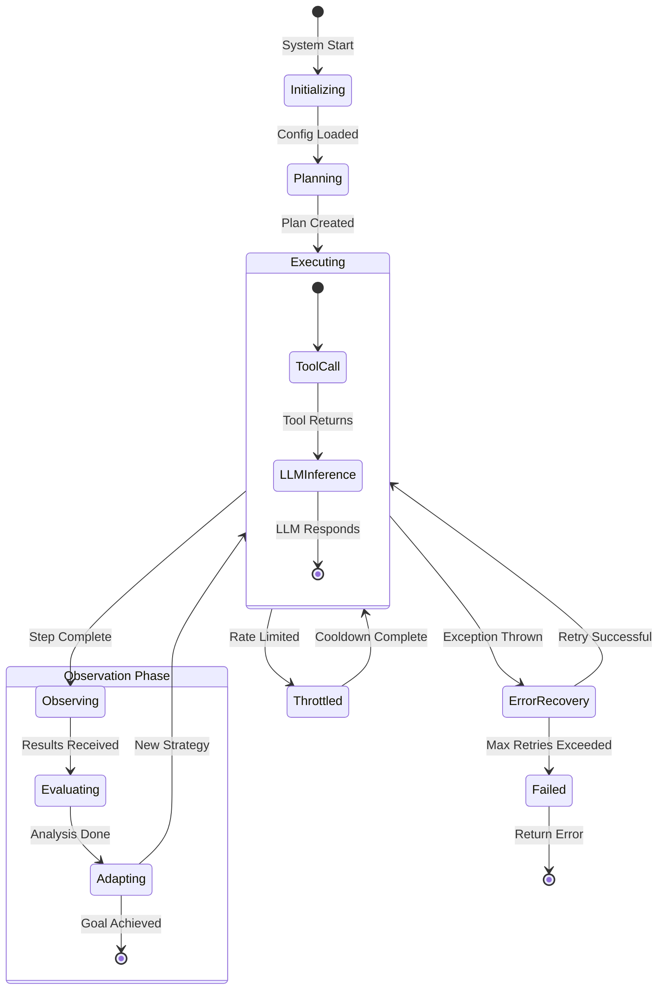

**State diagram conventions for loops**:
- Use **nested states** to show sub-state machines within a loop
- Label every transition with the **trigger** that causes it
- Mark initial and final states clearly with `[*]`
- Use **choice pseudostates** for complex transition conditions

### 4. Class/Component Diagrams

Class diagrams show the **structural relationships** between components in a loop system — what each component contains and how components are connected.

**Best for**: System architecture, component relationships, state schema design, interface definitions.

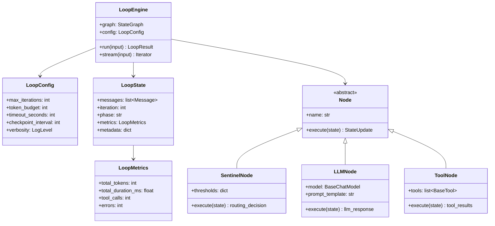

---

## From Problem Statement to Documented Workflow

A professional loop engineering workflow goes through a structured design process. Here is a step-by-step method for turning a vague problem statement into a fully documented, implementable workflow.

### Step-by-Step Design Process

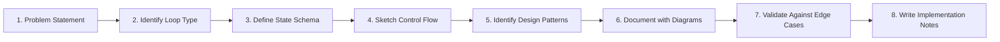

### Worked Example: Building a "Code Explainer" Loop

Let's walk through the full process for a concrete example.

#### Step 1: Problem Statement

> "Build a system that takes a code snippet, explains what it does, checks if the explanation is accurate by testing the code, and iteratively refines the explanation if the test reveals discrepancies."

#### Step 2: Identify the Loop Type

This is a **Reflection Loop** (see [04_Core_Concepts.md](04_Core_Concepts.md)) — the system generates an output, observes/validates it, and iterates based on the observation.

**Loop characterization**:
- **Type**: Reflection/Validation loop
- **Termination condition**: Explanation matches observed code behavior, or max iterations reached
- **State**: code snippet, explanation, test results, iteration count
- **External dependencies**: Code execution sandbox

#### Step 3: Define the State Schema

```python
class CodeExplainerState(TypedDict):
    code_snippet: str          # Input: the code to explain
    explanation: str           # Current explanation
    test_results: str          # Results from executing the code
    validation_feedback: str   # Feedback on explanation accuracy
    iteration: int             # Current iteration number
    max_iterations: int        # Hard limit
    is_accurate: bool          # Whether explanation matches behavior
    history: list[dict]        # Audit trail
```

#### Step 4: Sketch Control Flow

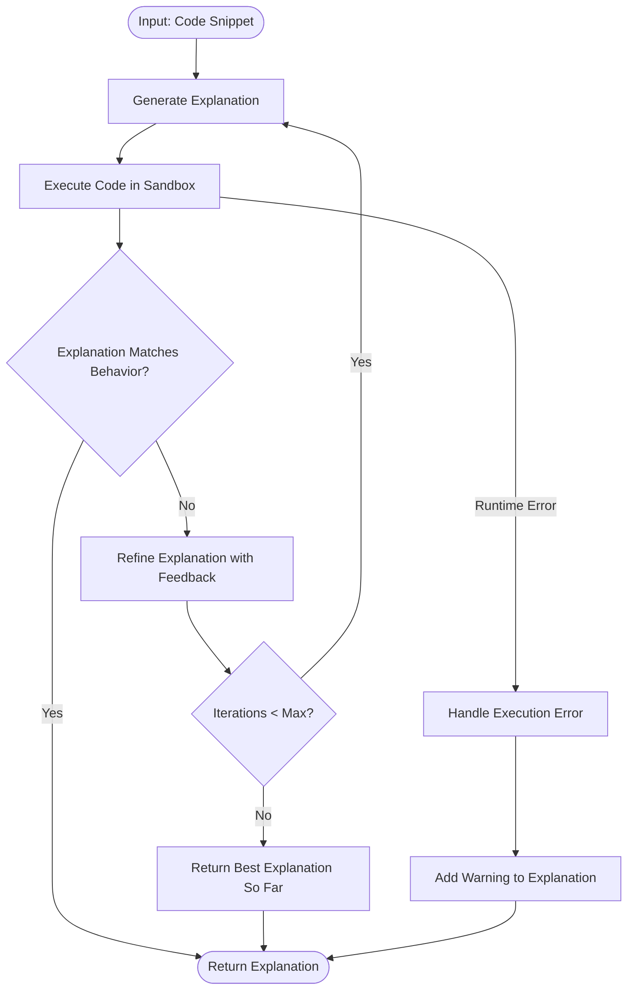

#### Step 5: Identify Design Patterns

From [16_Loop_Design_Patterns.md](16_Loop_Design_Patterns.md):

| Pattern | Application |
|---------|------------|
| Sentinel | `max_iterations` check at the `COUNT` node |
| Pipeline | EXPLAIN → EXEC → VALIDATE sequential steps |
| Adaptive | Explanation refinement strategy adapts based on feedback type |
| Memento | `history` list tracks all iterations for debugging |

#### Step 6: Document with Full Diagrams

Create the complete set of diagrams (as shown in the sequence and state diagram examples above, adapted for this specific workflow). The final documentation should include:

1. A **flowchart** showing the control flow (done in Step 4)
2. A **sequence diagram** showing the interactions between components
3. A **state diagram** showing the loop lifecycle
4. A **table** documenting the state schema

#### Step 7: Validate Against Edge Cases

| Edge Case | How the Workflow Handles It |
|-----------|---------------------------|
| Code has runtime error | Caught in EXEC node → ERROR path → explanation includes warning |
| LLM hallucinates behavior | VALIDATE node compares against actual execution → REFINE loop |
| Code is infinite loop | Sandbox has timeout → EXEC returns timeout error |
| Explanation never converges | SENTINEL at COUNT node exits after max_iterations |
| Code is empty or trivial | Could add early-exit check before EXPLAIN |

#### Step 8: Write Implementation Notes

Include pseudo-code or actual LangGraph code, performance expectations, and configuration recommendations. This connects the design to the implementation.

---

## Workflow Anti-Patterns

Anti-patterns are common mistakes in workflow design that lead to confusion, bugs, or unmaintainable systems. Learning to recognize them is as important as learning the correct patterns.

### Anti-Pattern 1: The Spaghetti Loop

A workflow with too many crossing arrows, unclear paths, and no obvious structure.

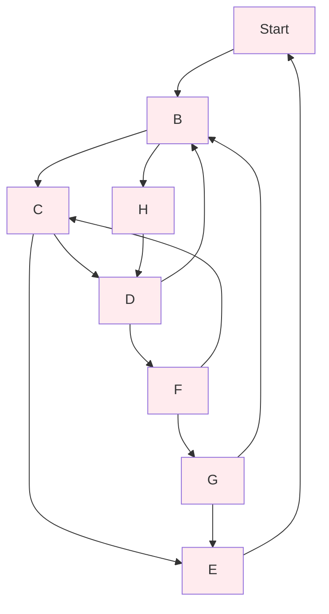

**Problem**: Impossible to trace execution paths. Any node can reach almost any other node. **Fix**: Decompose into sub-workflows with clear interfaces. Use the [Router Pattern](16_Loop_Design_Patterns.md) instead of ad-hoc branching.

### Anti-Pattern 2: The Hidden State Mutation

A diagram that shows processing nodes but doesn't indicate what state is being read or written.

**Problem**: Developers must read the code to understand data flow. **Fix**: Annotate every edge with the state being passed. Include a state schema table alongside the diagram.

### Anti-Pattern 3: The Missing Error Path

A happy-path-only diagram that shows no error handling.

**Problem**: When errors occur, the system's behavior is undefined. **Fix**: Add explicit error nodes and recovery paths. Use the [Circuit Breaker Pattern](16_Loop_Design_Patterns.md) for external dependencies.

### Anti-Pattern 4: The Infinite Loop (in the Diagram)

A diagram that shows a loop-back arrow with no exit condition.

**Problem**: Communicates that the loop runs forever, which is almost never correct. **Fix**: Always show at least one exit condition on every loop. Use the [Sentinel Pattern](16_Loop_Design_Patterns.md).

### Anti-Pattern 5: The Monolith

A single diagram that tries to capture an entire complex system in one view.

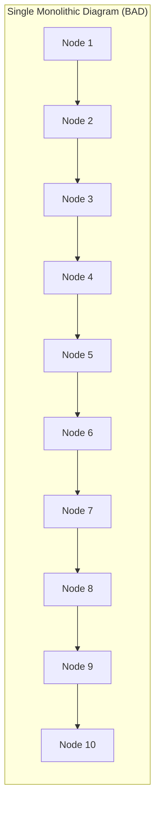

**Problem**: Information overload. No one can reason about a 50-node diagram. **Fix**: Create a hierarchy — a high-level overview diagram that references detailed sub-diagrams. Each sub-diagram should have 5–9 nodes maximum.

---

## Visual Communication Best Practices

### Diagram Sizing Guidelines

| Aspect | Recommendation | Rationale |
|--------|---------------|-----------|
| Nodes per diagram | 5–9 primary nodes | Miller's Law — cognitive limit of 7±2 items |
| Max depth | 3–4 levels of nesting | Deeper nesting exceeds visual comprehension |
| Arrow crossings | Minimize to zero | Crossings create confusion |
| Text per node | 2–5 words | Longer text belongs in accompanying notes |
| Colors | Max 4–5 categories | More colors create noise, not clarity |

### Color Coding System

Establish a consistent color system across all your loop engineering diagrams:

| Color | Hex Code | Meaning | Example Use |
|-------|----------|---------|-------------|
| Blue | `#e1f5fe` | Input / Start | User input nodes, entry points |
| Green | `#e8f5e9` | Output / Success | Final answers, successful termination |
| Red | `#ffebee` | Error / Failure | Error nodes, circuit breaker trips |
| Orange | `#fff3e0` | Retry / Warning | Retry loops, degraded operation |
| Purple | `#f3e5f5` | Decision / Routing | Conditional branching, classifiers |
| Gray | `#f5f5f5` | Infrastructure | Logging, monitoring, checkpointing |

### Labeling Conventions

```
Node Labels:    [Verb + Noun]          → "Classify Intent", "Execute Search"
Edge Labels:    [Condition]            → "Score > 0.8", "On Error"
Decision Nodes: {Question?}            → "Goal Met?", "Type?"
Start/End:      ([Description])        → ([User Query]), ([Final Answer])
```

### Documentation Template

For every loop workflow, produce a documentation card with this structure:

```markdown
## Workflow: [Name]

**Type**: [Reflection / Agent / Tool-Calling / Multi-Agent / Pipeline]
**Pattern(s)**: [Sentinel + Router + Adaptive]
**Max Iterations**: [N]
**State Schema**: [Link or inline table]

### Overview
[2-3 sentence description]

### Diagram
[Mermaid flowchart]

### State Schema
| Field | Type | Description |
|-------|------|-------------|
| ... | ... | ... |

### Edge Cases
| Case | Handling |
|------|----------|
| ... | ... |

### Nodes
| Node | Type | Description |
|------|------|-------------|
| ... | ... | ... |
```

---

## Translating Between Diagram Types

A well-documented loop system uses multiple diagram types, each capturing a different aspect. Here's how the same system looks across diagram types:

### Example: A ReAct Agent Loop

**Flowchart (Control Flow)**:
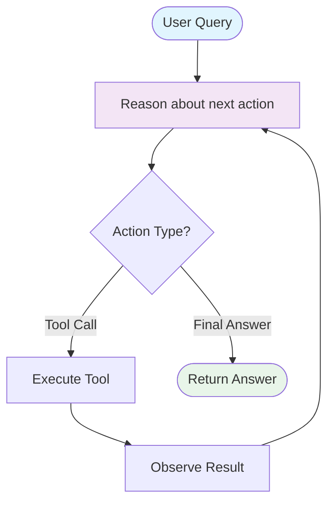

**Sequence Diagram (Interaction Flow)**:
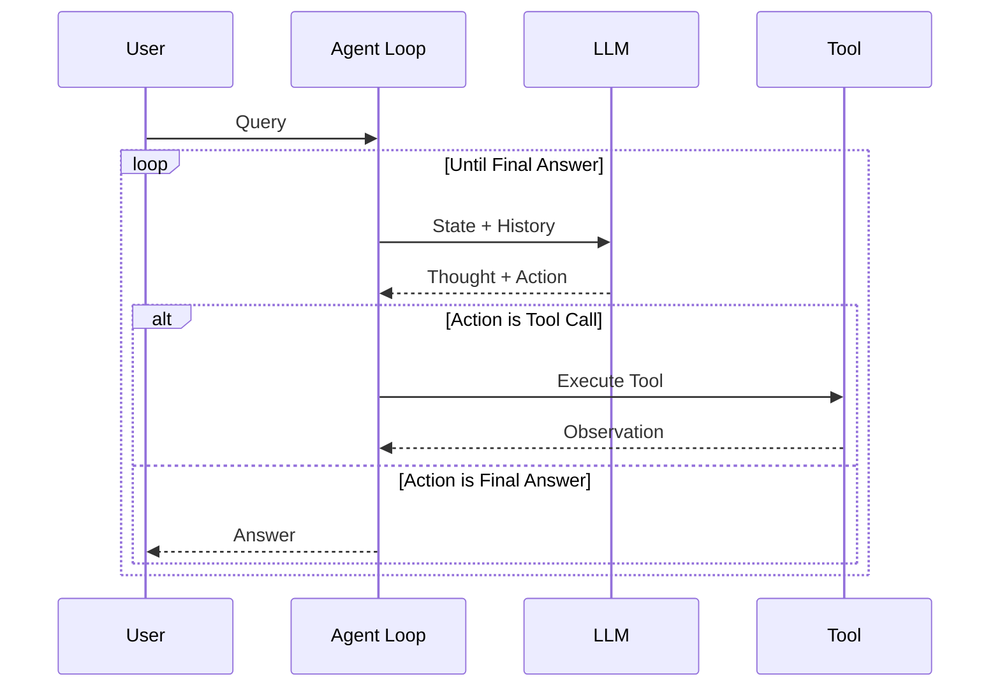

**State Diagram (Lifecycle)**:
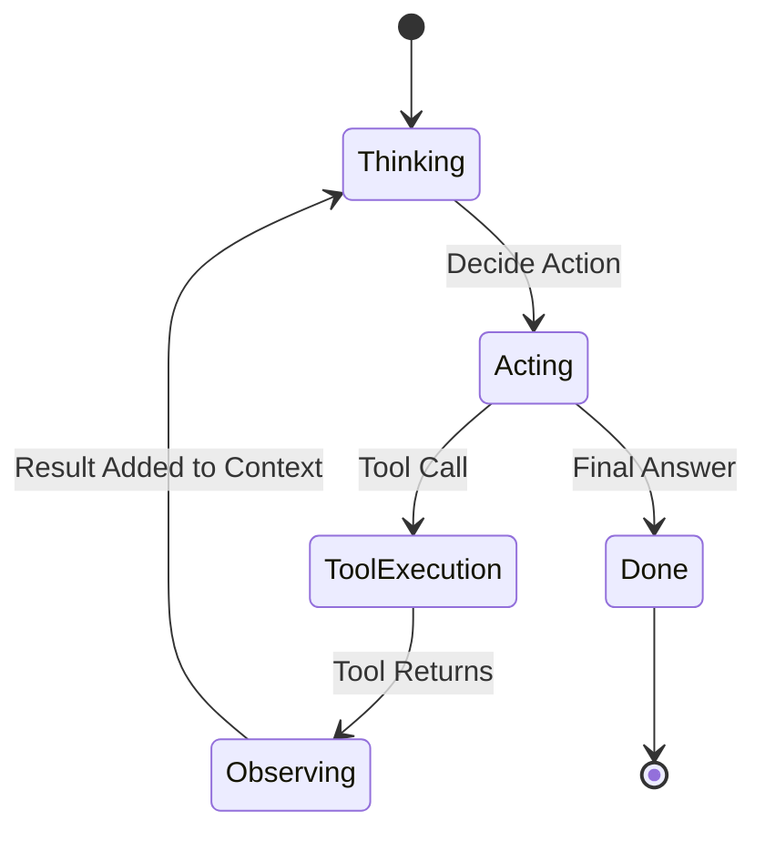

Each diagram type tells you something different:
- The **flowchart** shows *what can happen* (structural possibility)
- The **sequence diagram** shows *what actually happens in order* (temporal interaction)
- The **state diagram** shows *what mode the system is in* (state lifecycle)

---

## Advanced: Documenting Multi-Agent Workflows

Multi-agent systems add significant diagramming complexity. The key challenge is representing both the **intra-agent loops** (each agent's internal loop) and the **inter-agent communication** (messages between agents).

### Two-Level Documentation Approach

**Level 1: System Overview** — Shows agents as single nodes with communication channels:

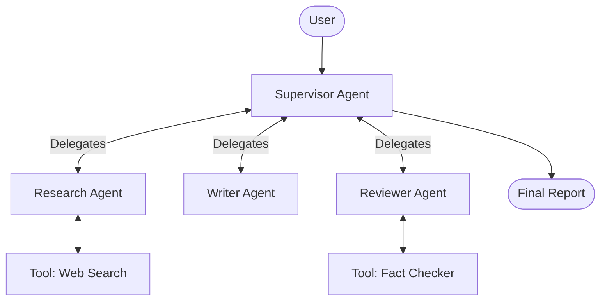

**Level 2: Agent Internals** — Each agent gets its own sub-diagram showing its internal loop:

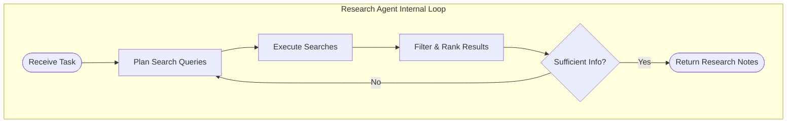

### Communication Protocol Documentation

For multi-agent systems, also document the **message schema** between agents:

| Message | From | To | Payload | Trigger |
|---------|------|-----|---------|---------|
| `task_delegate` | Supervisor | Any Worker | `{task, context, constraints}` | Supervisor plans next step |
| `task_result` | Worker | Supervisor | `{result, confidence, metadata}` | Worker completes task |
| `task_feedback` | Supervisor | Worker | `{feedback, revision_request}` | Supervisor reviews result |
| `status_update` | Any | Supervisor | `{status, progress, errors}` | Periodic or on events |

---

## Summary

### Cheat Sheet: Choosing the Right Diagram

| What You Need to Show | Diagram Type | Mermaid Keyword |
|-----------------------|-------------|-----------------|
| Control flow, decisions, loops | Flowchart | `flowchart` |
| Interactions over time | Sequence | `sequenceDiagram` |
| State lifecycle, transitions | State | `stateDiagram-v2` |
| Component structure, relationships | Class | `classDiagram` |
| System overview, components | Flowchart (subgraphs) | `flowchart` with `subgraph` |

### Workflow Documentation Checklist

- [ ] Problem statement clearly defined
- [ ] Loop type identified
- [ ] State schema documented
- [ ] At least one flowchart showing control flow
- [ ] Error paths explicitly shown
- [ ] Termination conditions clearly labeled
- [ ] Design patterns identified and named
- [ ] Edge cases tabulated
- [ ] Color coding is consistent
- [ ] Diagram has ≤9 primary nodes (decompose if larger)

---

## Glossary

| Term | Definition |
|------|-----------|
| **Workflow** | A defined sequence of steps and decisions that accomplish a task |
| **Flowchart** | A diagram showing control flow through nodes and edges |
| **Sequence Diagram** | A diagram showing interactions between components over time |
| **State Diagram** | A diagram showing the lifecycle of states and transitions |
| **Anti-Pattern** | A commonly used but ineffective or counterproductive approach |
| **Sub-Workflow** | A self-contained workflow that is part of a larger system |
| **Edge Case** | An unusual or extreme input that tests the boundaries of a system |

---

## References

- Mermaid Documentation: [mermaid.js](https://mermaid.js.org/) — Official reference for all diagram syntax
- Ambler, S. *The Elements of UML 2.0 Style* — Best practices for diagram design
- Fowler, M. *UML Distilled* — Concise guide to choosing the right diagram type
- LangGraph Documentation: [Visualization](https://langchain-ai.github.io/langgraph/) — Built-in graph visualization tools
- [16_Loop_Design_Patterns.md](16_Loop_Design_Patterns.md) — Patterns that workflows document
- [08_Loop_Architecture.md](08_Loop_Architecture.md) — System architecture documentation