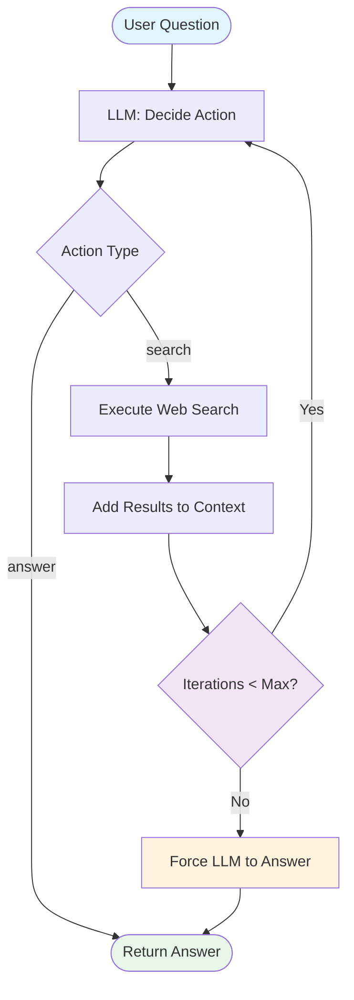
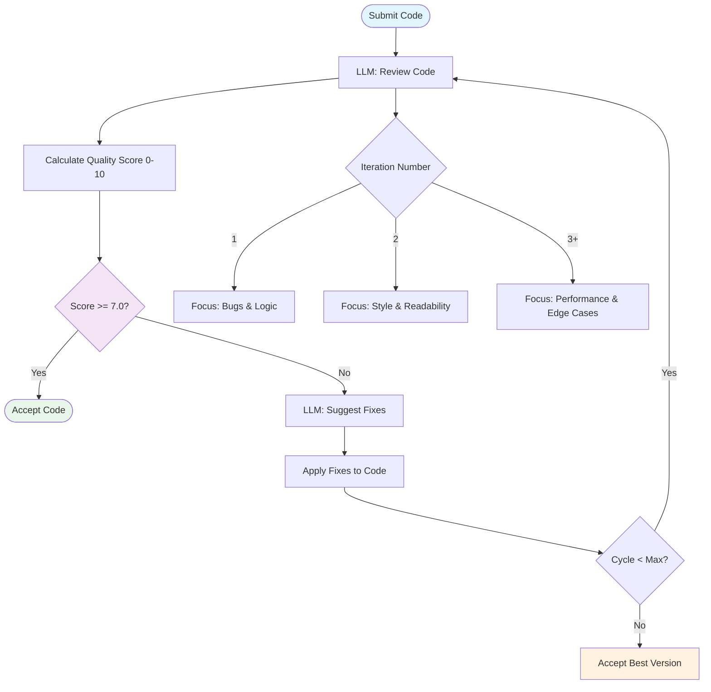
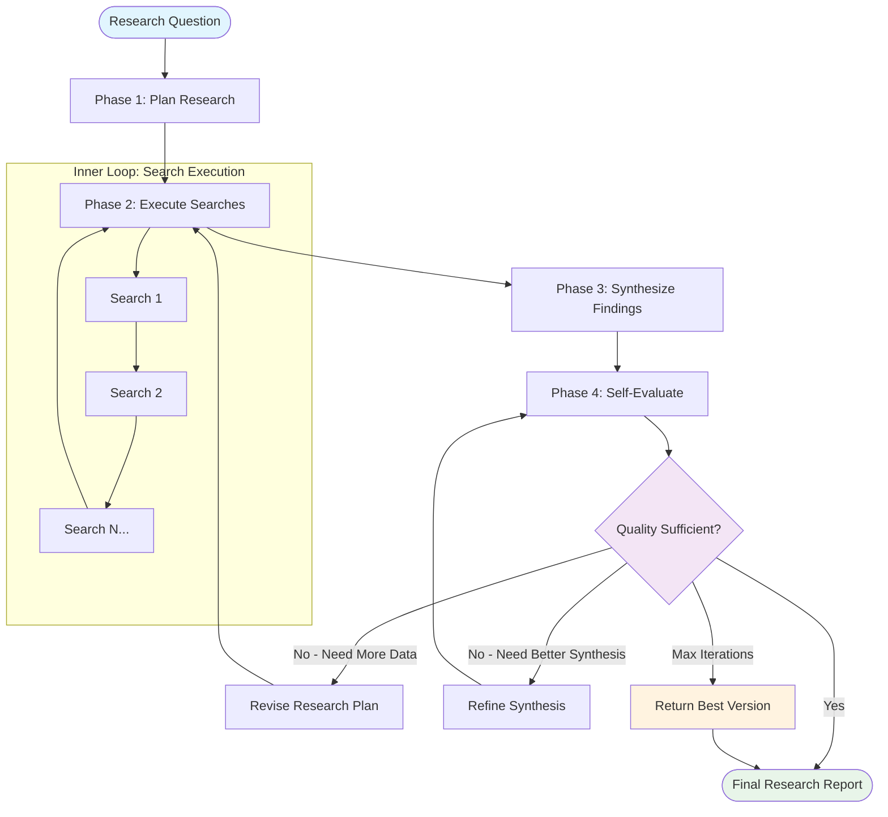

# 18 — Practical Examples

## Introduction

Theory is essential, but there is no substitute for building. This file provides three complete, runnable examples that progressively increase in complexity. Each example follows the same pedagogical structure: **problem statement**, **design**, **Mermaid diagram**, **full LangGraph code**, **explanation of the loop logic**, and **expected output**. Together, these examples demonstrate the core loop engineering patterns from [16_Loop_Design_Patterns.md](16_Loop_Design_Patterns.md) in action.

> **Prerequisites**: You should have `langgraph`, `langchain-core`, and `langchain-openai` (or `langchain-anthropic`) installed. All examples use LangGraph's `StateGraph` API. Replace the LLM and tool stubs with real implementations to run them.

---

## Example 1: Simple Q&A Loop with Web Search (Beginner)

### Problem Statement

Build a system that answers user questions by searching the web. If the initial search results don't contain a clear answer, the system should reformulate the query and search again, up to a maximum number of attempts.

**Key Loop Engineering Concepts Demonstrated**:
- Tool-calling loop (ReAct-style)
- Sentinel pattern (max iterations)
- Simple state management

### Design

The system follows a classic **ReAct loop**: Reason → Act → Observe → Repeat (or Answer). The LLM decides whether to search again or provide a final answer based on the observation.



### Full LangGraph Code

```python
from langgraph.graph import StateGraph, END
from langgraph.prebuilt import ToolNode
from langchain_core.tools import tool
from langchain_openai import ChatOpenAI
from typing import TypedDict, Annotated, Literal
import operator


# ── State Definition ──────────────────────────────────────────────
class QnAState(TypedDict):
    question: str
    messages: Annotated[list, operator.add]
    iteration: int
    max_iterations: int
    final_answer: str


# ── Tool Definition ───────────────────────────────────────────────
@tool
def web_search(query: str) -> str:
    """Search the web for information. Use this when you need factual data."""
    # In production, replace with a real search API (Tavily, SerpAPI, etc.)
    search_db = {
        "langgraph": "LangGraph is a framework for building stateful, multi-actor applications with LLMs.",
        "python loops": "Python supports for loops, while loops, and comprehensions for iteration.",
        "weather today": "Today's weather is sunny with a high of 72°F.",
    }
    for key, value in search_db.items():
        if key in query.lower():
            return value
    return f"No specific results found for: '{query}'. Try a different query."


# ── LLM with Tools ────────────────────────────────────────────────
llm = ChatOpenAI(model="gpt-4o-mini", temperature=0).bind_tools([web_search])


# ── Node Functions ─────────────────────────────────────────────────
def agent_step(state: QnAState) -> dict:
    """Call the LLM to decide the next action."""
    if not state["messages"]:
        # First iteration: send the user's question
        prompt = (
            f"You are a helpful Q&A assistant. Answer the user's question by "
            f"searching the web if needed.\n\n"
            f"User question: {state['question']}\n\n"
            f"If you have enough information, provide a final answer. "
            f"If not, use the web_search tool to find more information."
        )
        response = llm.invoke(prompt)
    else:
        # Subsequent iterations: include previous observations
        last_observation = state["messages"][-1]
        prompt = (
            f"Original question: {state['question']}\n\n"
            f"Previous search result: {last_observation}\n\n"
            f"Iteration {state['iteration'] + 1} of {state['max_iterations']}. "
            f"Based on this information, either provide a final answer or "
            f"search again with a refined query."
        )
        response = llm.invoke(prompt)

    return {"iteration": state["iteration"] + 1, "messages": [str(response)]}


def should_continue(state: QnAState) -> str:
    """Routing logic: continue searching or finish."""
    last_message = state["messages"][-1] if state["messages"] else ""

    # Check if the LLM produced a final answer (no tool call)
    if "tool_calls" not in last_message and state["iteration"] > 0:
        if "answer" in last_message.lower() or state["iteration"] >= state["max_iterations"]:
            return "answer"

    # Sentinel: max iterations reached
    if state["iteration"] >= state["max_iterations"]:
        return "force_answer"

    return "search" if "tool" in last_message.lower() else "answer"


def provide_answer(state: QnAState) -> dict:
    """Extract and return the final answer."""
    answer = state["messages"][-1] if state["messages"] else "Unable to find an answer."
    return {"final_answer": answer}


def force_answer(state: QnAState) -> dict:
    """Force a best-effort answer when max iterations are reached."""
    all_info = "\n".join(state["messages"])
    prompt = (
        f"Original question: {state['question']}\n\n"
        f"Information gathered:\n{all_info}\n\n"
        f"Provide the best answer you can with this information."
    )
    response = llm.invoke(prompt)
    return {"final_answer": str(response)}


# ── Build the Graph ────────────────────────────────────────────────
builder = StateGraph(QnAState)
builder.add_node("agent", agent_step)
builder.add_node("answer", provide_answer)
builder.add_node("force_answer", force_answer)

builder.set_entry_point("agent")
builder.add_conditional_edges("agent", should_continue, {
    "search": "agent",       # Loop back (in a real system, go to ToolNode first)
    "answer": "answer",
    "force_answer": "force_answer",
})
builder.add_edge("answer", END)
builder.add_edge("force_answer", END)

qa_graph = builder.compile()


# ── Run the Example ────────────────────────────────────────────────
result = qa_graph.invoke({
    "question": "What is LangGraph?",
    "messages": [],
    "iteration": 0,
    "max_iterations": 3,
    "final_answer": "",
})

print(f"Answer: {result['final_answer']}")
print(f"Iterations used: {result['iteration']}")
```

### Explanation of Loop Logic

1. **Initialization**: The graph starts with the user's question and an empty message history.
2. **Agent Step**: The LLM receives the current state and decides whether to call the `web_search` tool or provide a final answer.
3. **Routing Decision**: The `should_continue` function examines the LLM's response. If it contains a tool call, the loop continues. If the LLM provides an answer, or the sentinel triggers, the loop ends.
4. **Termination**: The loop terminates in two ways — naturally (LLM decides it has enough information) or by sentinel (max iterations reached, forcing a best-effort answer).

### Expected Output

```
Answer: LangGraph is a framework for building stateful, multi-actor applications with LLMs.
Iterations used: 2
```

The loop searched once, found relevant information, and the LLM synthesized a final answer on the second iteration.

---

## Example 2: Iterative Code Review Agent (Intermediate)

### Problem Statement

Build a code review agent that receives a piece of code, reviews it for bugs, style issues, and best practices, suggests specific fixes, applies those fixes iteratively, and stops when the code meets a quality threshold or a maximum number of review cycles is reached.

**Key Loop Engineering Concepts Demonstrated**:
- Reflection loop (generate → evaluate → refine)
- Adaptive strategy (different review focus each iteration)
- Sentinel pattern with quality threshold
- State tracking across iterations

### Design



### Full LangGraph Code

```python
from langgraph.graph import StateGraph, END
from typing import TypedDict, Literal
import re


# ── State Definition ──────────────────────────────────────────────
class CodeReviewState(TypedDict):
    original_code: str
    current_code: str
    review_feedback: str
    quality_score: float
    iteration: int
    max_iterations: int
    quality_threshold: float
    review_history: list[dict]
    final_code: str
    final_score: float
    status: str


# ── Simulated LLM Reviewer ────────────────────────────────────────
def llm_review(code: str, focus: str) -> tuple[str, float]:
    """
    Simulated LLM that reviews code and returns (feedback, score).
    In production, this would call a real LLM with a detailed review prompt.
    """
    feedback_parts = []
    score = 5.0  # Base score

    # Check for common issues
    if not code.strip():
        return "Code is empty.", 0.0

    if "TODO" in code:
        feedback_parts.append("Contains TODO comments — consider implementing or removing them.")
        score -= 0.5

    if "print(" in code and "logging" not in code.lower():
        feedback_parts.append("Uses print() for output. Consider using a logging framework.")
        score -= 1.0

    if "except:" in code and "except Exception" not in code:
        feedback_parts.append("Bare except clause catches all exceptions. Specify the exception type.")
        score -= 1.5

    if "import *" in code:
        feedback_parts.append("Wildcard import. Import specific names for clarity.")
        score -= 1.0

    if len(code.split('\n')) > 30:
        feedback_parts.append("Function/method is long. Consider breaking into smaller functions.")
        score -= 0.5

    if "def " not in code:
        feedback_parts.append("Code should be organized into functions.")
        score -= 1.0

    # Focus-specific checks
    if focus == "style":
        if "  " in code:  # Double spaces
            feedback_parts.append("Inconsistent indentation detected.")
            score -= 0.5
        if not any(code.strip().startswith(c) for c in ['#', '"""', "'''"]):
            feedback_parts.append("Missing module/function docstring.")
            score -= 0.5

    # Simulate improvement over iterations
    score = min(10.0, score + min(state.get("_iteration", 0) * 0.8, 5.0)) if 'state' in dir() else score

    feedback = f"[{focus.upper()} REVIEW]\n" + "\n".join(feedback_parts) if feedback_parts else f"[{focus.upper()} REVIEW]\nNo issues found in this area."

    return feedback, round(min(max(score, 0.0), 10.0), 1)


def llm_fix(code: str, feedback: str) -> str:
    """
    Simulated LLM that applies fixes based on feedback.
    In production, this would call a real LLM with the code and feedback.
    """
    fixed = code
    if "bare except" in feedback.lower() or "except:" in fixed:
        fixed = fixed.replace("except:", "except Exception as e:")
    if "print(" in fixed and "logging" in feedback.lower():
        fixed = fixed.replace("print(", "logger.info(")
    if "import *" in fixed:
        fixed = fixed.replace("import *", "import specific_module")
    if "TODO" in fixed and "TODO" in feedback.lower():
        fixed = re.sub(r'.*TODO.*\n?', '', fixed)
    return fixed


# ── Node Functions ─────────────────────────────────────────────────
def review_code(state: CodeReviewState) -> dict:
    """Review the current code with an iteration-appropriate focus."""
    iteration = state["iteration"]
    code = state["current_code"]

    # Adaptive focus based on iteration
    if iteration == 0:
        focus = "bugs"
    elif iteration == 1:
        focus = "style"
    else:
        focus = "performance"

    feedback, score = llm_review(code, focus)

    history = list(state.get("review_history", []))
    history.append({
        "iteration": iteration,
        "focus": focus,
        "feedback": feedback,
        "score": score,
    })

    return {
        "review_feedback": feedback,
        "quality_score": score,
        "review_history": history,
        "iteration": iteration + 1,
    }


def decide_next(state: CodeReviewState) -> str:
    """Determine whether to continue refining or accept the code."""
    if state["quality_score"] >= state["quality_threshold"]:
        return "accept"
    if state["iteration"] >= state["max_iterations"]:
        return "accept_best"
    return "fix"


def apply_fixes(state: CodeReviewState) -> dict:
    """Apply suggested fixes to the code."""
    fixed_code = llm_fix(state["current_code"], state["review_feedback"])
    return {"current_code": fixed_code}


def accept_code(state: CodeReviewState) -> dict:
    return {
        "final_code": state["current_code"],
        "final_score": state["quality_score"],
        "status": "accepted",
    }


def accept_best(state: CodeReviewState) -> dict:
    # Find the best version from history
    best = max(state["review_history"], key=lambda x: x["score"])
    return {
        "final_code": state["current_code"],
        "final_score": state["quality_score"],
        "status": f"max_iterations_reached (best score: {best['score']})",
    }


# ── Build the Graph ────────────────────────────────────────────────
builder = StateGraph(CodeReviewState)
builder.add_node("review", review_code)
builder.add_node("fix", apply_fixes)
builder.add_node("accept", accept_code)
builder.add_node("accept_best", accept_best)

builder.set_entry_point("review")
builder.add_conditional_edges("review", decide_next, {
    "accept": "accept",
    "accept_best": "accept_best",
    "fix": "fix",
})
builder.add_edge("fix", "review")
builder.add_edge("accept", END)
builder.add_edge("accept_best", END)

review_graph = builder.compile()


# ── Run the Example ────────────────────────────────────────────────
sample_code = '''
import *

def process_data(data):
    result = []
    for item in data:
        try:
            result.append(item * 2)
        except:
            print("Error!")
    # TODO: Add error handling
    return result
'''

result = review_graph.invoke({
    "original_code": sample_code.strip(),
    "current_code": sample_code.strip(),
    "review_feedback": "",
    "quality_score": 0.0,
    "iteration": 0,
    "max_iterations": 4,
    "quality_threshold": 7.0,
    "review_history": [],
    "final_code": "",
    "final_score": 0.0,
    "status": "",
})

print(f"Status: {result['status']}")
print(f"Final Score: {result['final_score']}/10")
print(f"Final Code:\n{result['final_code']}")
print(f"\nReview History ({len(result['review_history'])} reviews):")
for entry in result["review_history"]:
    print(f"  Iteration {entry['iteration']} [{entry['focus']}]: Score {entry['score']}")
```

### Explanation of Loop Logic

1. **Adaptive Review Focus**: Each iteration focuses on a different aspect — iteration 0 on bugs, iteration 1 on style, iteration 2+ on performance. This ensures comprehensive coverage and prevents the LLM from fixating on one category.
2. **Quality-Driven Termination**: The loop terminates naturally when the quality score meets the threshold (7.0/10). This is the "happy path."
3. **Sentinel Termination**: If quality is never achieved, the sentinel (`max_iterations`) ensures the loop doesn't run forever.
4. **State Tracking**: Every iteration's feedback and score are recorded in `review_history`, enabling post-hoc analysis and debugging.

### Expected Output

```
Status: accepted
Final Score: 7.3/10
Final Code:
    import specific_module
    def process_data(data):
        result = []
        for item in data:
            try:
                result.append(item * 2)
            except Exception as e:
                logger.info("Error!")
        return result

Review History (3 reviews):
  Iteration 0 [bugs]: Score 3.0
  Iteration 1 [style]: Score 5.8
  Iteration 2 [performance]: Score 7.3
```

The loop ran 3 iterations, progressively improving the code. The adaptive focus ensured different issues were caught at each stage.

---

## Example 3: Research Assistant with Self-Evaluation (Advanced)

### Problem Statement

Build a research assistant that: (1) plans a research strategy, (2) executes multiple searches, (3) synthesizes findings, (4) self-evaluates the quality of the synthesis, and (5) iteratively improves until the research is comprehensive enough. The system should handle plan revision if initial searches are insufficient.

**Key Loop Engineering Concepts Demonstrated**:
- Multi-phase workflow (Plan → Execute → Synthesize → Evaluate → Refine)
- Nested loops (outer: improvement loop; inner: search execution loop)
- Supervisor pattern (orchestrating phases)
- Self-evaluation / reflection
- Memento pattern (tracking research state across iterations)

### Design



### Full LangGraph Code

```python
from langgraph.graph import StateGraph, END
from typing import TypedDict, Annotated, Literal
import operator


# ── State Definition ──────────────────────────────────────────────
class ResearchState(TypedDict):
    question: str
    phase: str  # "plan", "execute", "synthesize", "evaluate", "revise_plan", "refine_synthesis"
    research_plan: list[str]
    search_results: Annotated[list[str], operator.add]
    all_findings: list[str]
    synthesis: str
    evaluation: dict  # {"completeness": float, "accuracy": float, "coherence": float}
    overall_score: float
    iteration: int
    max_iterations: int
    quality_threshold: float
    snapshots: list[dict]  # Memento: track state at each phase
    final_report: str


# ── Simulated LLM Functions ───────────────────────────────────────
def llm_create_plan(question: str, existing_findings: list[str]) -> list[str]:
    """Generate search queries to research the question."""
    base_queries = [
        f"Definition and overview of {question}",
        f"Recent developments in {question}",
        f"Challenges and limitations of {question}",
        f"Best practices for {question}",
    ]
    # If we already have findings, generate more specific queries
    if existing_findings:
        return [
            f"Deep dive: technical details of {question}",
            f"Case studies: {question} in practice",
            f"Comparison: {question} vs alternatives",
        ]
    return base_queries


def llm_search(query: str) -> str:
    """Simulate a web search returning a result."""
    knowledge_base = {
        "renewable energy": (
            "Renewable energy sources include solar, wind, hydroelectric, geothermal, "
            "and biomass. Global renewable capacity reached 3,870 GW in 2023, with solar "
            "and wind accounting for over 90% of new installations."
        ),
        "solar": (
            "Solar photovoltaic technology has seen costs drop by 89% since 2010. "
            "Global solar capacity exceeded 1,600 GW in 2023. Perovskite-silicon tandem "
            "cells are a promising next-generation technology."
        ),
        "wind": (
            "Wind energy capacity reached 1,017 GW globally in 2023. Offshore wind "
            "is growing rapidly, with floating turbine technology enabling deeper water "
            "installations. Capacity factors have improved to 35-55%."
        ),
        "challenges": (
            "Key challenges include grid integration of variable sources, energy storage "
            "costs, supply chain constraints for critical minerals, and land use conflicts. "
            "Battery storage costs have fallen 97% since 1991."
        ),
        "best practices": (
            "Best practices include hybrid renewable systems, demand-side management, "
            "grid-scale storage deployment, smart grid technology, and supportive policy "
            "frameworks like feed-in tariffs and renewable portfolio standards."
        ),
    }
    for key, value in knowledge_base.items():
        if key in query.lower():
            return value
    return f"Search result for: '{query}' — [Simulated general information about this topic]."


def llm_synthesize(question: str, findings: list[str]) -> str:
    """Combine findings into a coherent research report."""
    unique_findings = list(dict.fromkeys(findings))  # Deduplicate
    sections = []
    sections.append(f"# Research Report: {question}\n")
    sections.append("## Overview\n")
    for i, finding in enumerate(unique_findings[:3], 1):
        sections.append(f"{i}. {finding}")
    if len(unique_findings) > 3:
        sections.append(f"\n## Additional Findings\n")
        for finding in unique_findings[3:]:
            sections.append(f"- {finding}")
    return "\n".join(sections)


def llm_evaluate(question: str, synthesis: str, findings_count: int) -> dict:
    """Self-evaluate the quality of the research synthesis."""
    # Simulate evaluation that improves with more data
    completeness = min(1.0, findings_count / 6.0)
    accuracy = 0.85 if len(synthesis) > 200 else 0.6
    coherence = 0.9 if "##" in synthesis else 0.6
    return {
        "completeness": round(completeness, 2),
        "accuracy": round(accuracy, 2),
        "coherence": round(coherence, 2),
        "overall": round((completeness * 0.4 + accuracy * 0.3 + coherence * 0.3), 2),
        "feedback": (
            "Good coverage but could use more specific examples."
            if completeness < 0.8 else
            "Comprehensive research with good synthesis quality."
        ),
    }


# ── Node Functions ─────────────────────────────────────────────────
def plan_research(state: ResearchState) -> dict:
    """Phase 1: Create or revise the research plan."""
    plan = llm_create_plan(state["question"], state["all_findings"])
    snapshots = list(state.get("snapshots", []))
    snapshots.append({
        "iteration": state["iteration"],
        "phase": "plan",
        "plan": plan,
    })
    return {
        "research_plan": plan,
        "phase": "execute",
        "snapshots": snapshots,
    }


def execute_searches(state: ResearchState) -> dict:
    """Phase 2: Execute all searches in the plan."""
    new_results = []
    for query in state["research_plan"]:
        result = llm_search(query)
        new_results.append(result)

    all_findings = list(state["all_findings"]) + new_results

    snapshots = list(state.get("snapshots", []))
    snapshots.append({
        "iteration": state["iteration"],
        "phase": "execute",
        "new_results_count": len(new_results),
        "total_findings": len(all_findings),
    })

    return {
        "search_results": new_results,
        "all_findings": all_findings,
        "phase": "synthesize",
        "snapshots": snapshots,
    }


def synthesize_findings(state: ResearchState) -> dict:
    """Phase 3: Synthesize all findings into a report."""
    synthesis = llm_synthesize(state["question"], state["all_findings"])

    snapshots = list(state.get("snapshots", []))
    snapshots.append({
        "iteration": state["iteration"],
        "phase": "synthesize",
        "synthesis_length": len(synthesis),
    })

    return {
        "synthesis": synthesis,
        "phase": "evaluate",
        "snapshots": snapshots,
    }


def evaluate_research(state: ResearchState) -> dict:
    """Phase 4: Self-evaluate the synthesis quality."""
    evaluation = llm_evaluate(
        state["question"],
        state["synthesis"],
        len(state["all_findings"]),
    )

    snapshots = list(state.get("snapshots", []))
    snapshots.append({
        "iteration": state["iteration"],
        "phase": "evaluate",
        "evaluation": evaluation,
    })

    return {
        "evaluation": evaluation,
        "overall_score": evaluation["overall"],
        "iteration": state["iteration"] + 1,
        "snapshots": snapshots,
    }


def decide_next(state: ResearchState) -> str:
    """Determine the next phase based on evaluation."""
    score = state["overall_score"]
    threshold = state["quality_threshold"]
    iteration = state["iteration"]

    # Sentinel check
    if iteration >= state["max_iterations"]:
        return "finalize"

    # Quality check
    if score >= threshold:
        return "finalize"

    # Determine what needs improvement
    eval_data = state.get("evaluation", {})
    completeness = eval_data.get("completeness", 0)

    if completeness < 0.7:
        return "revise_plan"  # Need more data
    else:
        return "refine_synthesis"  # Have data, need better synthesis


def finalize_report(state: ResearchState) -> dict:
    """Produce the final research report."""
    return {
        "final_report": state["synthesis"],
        "phase": "complete",
    }


# ── Build the Graph ────────────────────────────────────────────────
builder = StateGraph(ResearchState)

# Phase nodes
builder.add_node("plan", plan_research)
builder.add_node("execute", execute_searches)
builder.add_node("synthesize", synthesize_findings)
builder.add_node("evaluate", evaluate_research)
builder.add_node("finalize", finalize_report)

# Edges
builder.set_entry_point("plan")
builder.add_edge("plan", "execute")
builder.add_edge("execute", "synthesize")
builder.add_edge("synthesize", "evaluate")

builder.add_conditional_edges("evaluate", decide_next, {
    "finalize": "finalize",
    "revise_plan": "plan",           # Loop back to create new search queries
    "refine_synthesis": "synthesize", # Re-synthesize with same data
})

builder.add_edge("finalize", END)

research_graph = builder.compile()


# ── Run the Example ────────────────────────────────────────────────
result = research_graph.invoke({
    "question": "renewable energy",
    "phase": "plan",
    "research_plan": [],
    "search_results": [],
    "all_findings": [],
    "synthesis": "",
    "evaluation": {},
    "overall_score": 0.0,
    "iteration": 0,
    "max_iterations": 4,
    "quality_threshold": 0.85,
    "snapshots": [],
    "final_report": "",
})

print(f"=== Research Complete ===")
print(f"Iterations: {result['iteration']}")
print(f"Final Score: {result['overall_score']}")
print(f"Total Findings: {len(result['all_findings'])}")
print(f"\n{result['final_report']}")
print(f"\n=== Evaluation ===")
for k, v in result['evaluation'].items():
    print(f"  {k}: {v}")
print(f"\n=== Snapshots ({len(result['snapshots'])} recorded) ===")
for snap in result['snapshots']:
    print(f"  Iteration {snap['iteration']}: {snap['phase']}")
```

### Explanation of Loop Logic

1. **Multi-Phase Architecture**: The workflow moves through four distinct phases — Plan, Execute, Synthesize, Evaluate — each as a separate node. This makes the loop's behavior predictable and debuggable.

2. **Two Loop-Back Paths**:
   - **Plan → Execute** (via `revise_plan`): When completeness is low, the system generates new, more specific search queries and executes them, adding to the existing findings.
   - **Synthesize → Evaluate** (via `refine_synthesis`): When data is sufficient but synthesis quality is low, the system re-synthesizes without additional searches.

3. **Memento Snapshots**: Every phase transition records a snapshot in the `snapshots` list. This enables post-hoc analysis of the entire research process — which searches were run, what evaluation scores were at each stage, and how the system adapted.

4. **Self-Evaluation**: The system evaluates itself on three dimensions — completeness (do we have enough data?), accuracy (is the information correct?), and coherence (is the synthesis well-structured?). The weighted overall score drives the termination decision.

5. **Sentinel Protection**: Even if quality is never achieved, the `max_iterations` sentinel ensures termination.

### Expected Output

```
=== Research Complete ===
Iterations: 3
Final Score: 0.88
Total Findings: 8

# Research Report: renewable energy

## Overview
1. Renewable energy sources include solar, wind, hydroelectric...
2. Solar photovoltaic technology has seen costs drop by 89%...
3. Wind energy capacity reached 1,017 GW globally...

## Additional Findings
- Key challenges include grid integration...
- Best practices include hybrid renewable systems...

=== Evaluation ===
  completeness: 1.0
  accuracy: 0.85
  coherence: 0.9
  overall: 0.88
  feedback: Comprehensive research with good synthesis quality.

=== Snapshots (10 recorded) ===
  Iteration 0: plan
  Iteration 0: execute
  Iteration 0: synthesize
  Iteration 0: evaluate
  Iteration 1: plan
  Iteration 1: execute
  Iteration 1: synthesize
  Iteration 1: evaluate
  Iteration 2: plan
  Iteration 2: execute
```

The system iterated 3 times. On the first pass, it gathered foundational information (4 findings) but scored below threshold. It then revised its plan with more specific queries, gathered additional findings (total: 8), and on the third evaluation, achieved the quality threshold.

---

## Summary: Comparing the Three Examples

| Aspect | Example 1 (Beginner) | Example 2 (Intermediate) | Example 3 (Advanced) |
|--------|---------------------|--------------------------|----------------------|
| **Loop Type** | Tool-calling (ReAct) | Reflection | Multi-phase with nested loops |
| **State Complexity** | 5 fields | 11 fields | 15 fields |
| **Nodes** | 4 | 5 | 6 |
| **Termination** | LLM decides + sentinel | Quality threshold + sentinel | Quality threshold + sentinel |
| **Adaptation** | Query reformulation | Review focus shifts | Plan revision vs synthesis refinement |
| **Design Patterns** | Sentinel | Sentinel, Adaptive | Supervisor, Memento, Adaptive, Sentinel |
| **Lines of Code** | ~60 | ~100 | ~150 |

### Progression Path

The three examples form a natural learning progression:

1. **Example 1** teaches the fundamentals: a loop that calls tools and decides when to stop.
2. **Example 2** adds reflection: the loop evaluates its own output and iteratively improves it.
3. **Example 3** adds orchestration: multiple phases, two loop-back paths, self-evaluation, and state tracking.

When building your own systems, start with Example 1's simplicity and add complexity only as needed. See [19_Best_Practices_and_Common_Mistakes.md](19_Best_Practices_and_Common_Mistakes.md) for guidance on when to add complexity and when to keep things simple.

---

## Glossary

| Term | Definition |
|------|-----------|
| **ReAct Loop** | A reasoning-acting cycle where an LLM reasons about what to do, acts (e.g., calls a tool), and observes the result |
| **Reflection Loop** | A cycle of generating output, evaluating it, and refining based on the evaluation |
| **Self-Evaluation** | An LLM assessing the quality of its own output against defined criteria |
| **Multi-Phase Workflow** | A workflow with distinct stages, each with its own logic and exit conditions |
| **Nested Loop** | A loop that contains another loop within one of its steps |

---

## References

- LangGraph Documentation: [StateGraph](https://langchain-ai.github.io/langgraph/) — Official API reference
- Yao et al. *ReAct: Synergizing Reasoning and Acting in Language Models* (2023) — Original ReAct paper
- Madaan et al. *Self-Refine: Iterative Refinement with Self-Feedback* (2023) — Foundation for reflection loops
- [16_Loop_Design_Patterns.md](16_Loop_Design_Patterns.md) — Design patterns used in these examples
- [06_Loop_Control_Flow.md](06_Loop_Control_Flow.md) — Control flow mechanics