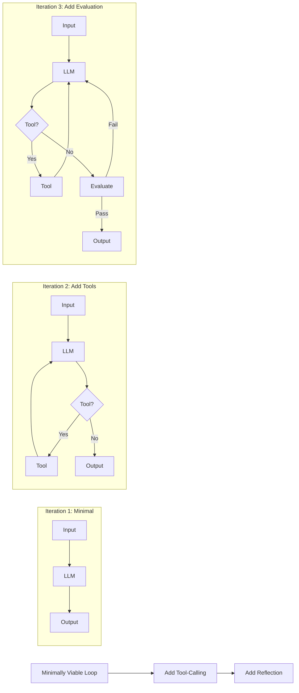
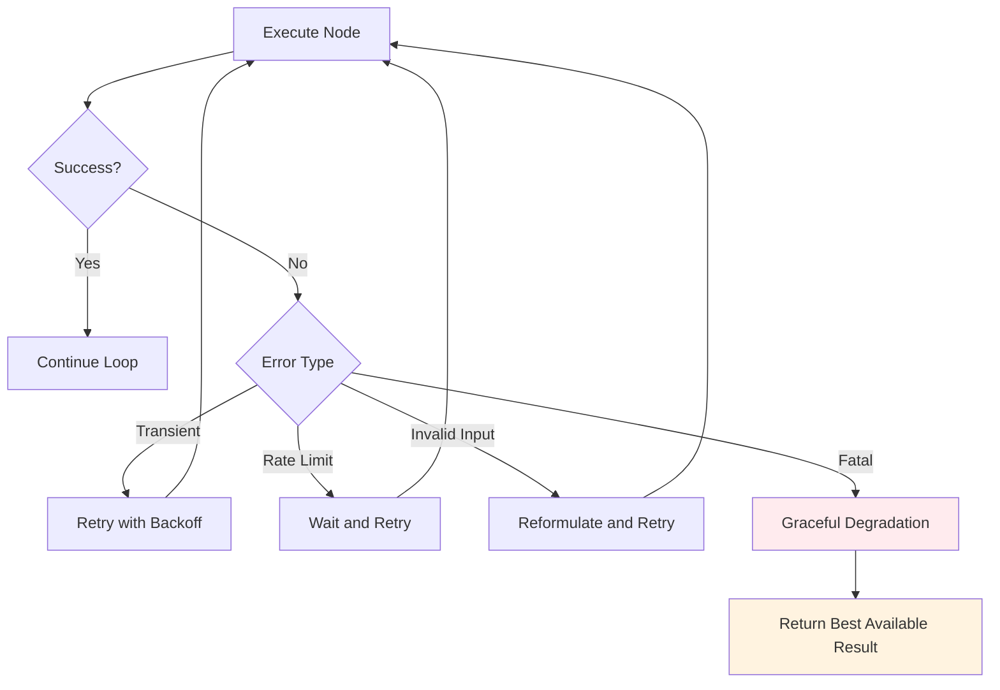
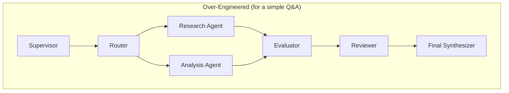
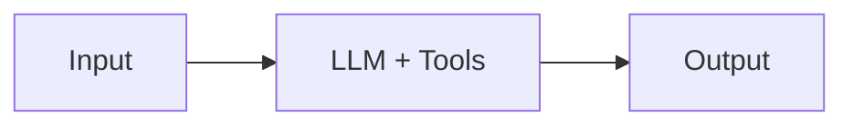
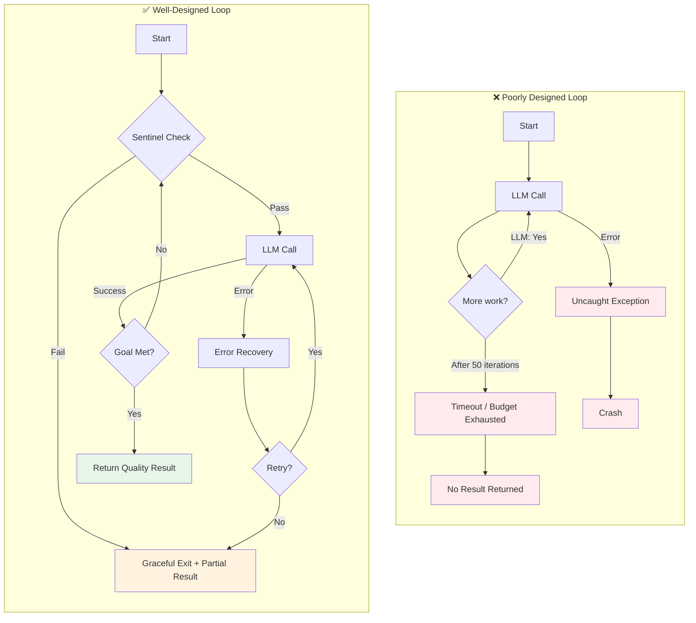

# 19 — Best Practices and Common Mistakes

## Introduction

Building loops that involve LLMs is fundamentally different from building traditional software loops. LLMs are non-deterministic, expensive, slow, and have hard context limits. A loop that would run perfectly with deterministic code can become a cost disaster, get stuck in infinite repetition, or produce silently degrading outputs when powered by an LLM.

This file distills the practical wisdom of experienced loop engineers into two complementary lists: **best practices** (what to do) and **common mistakes** (what to avoid). These aren't theoretical ideals — they are battle-tested lessons from production systems. Every best practice exists because someone learned the hard way what happens when you violate it.

> **Context**: This file complements the design patterns in [16_Loop_Design_Patterns.md](16_Loop_Design_Patterns.md) and the practical examples in [18_Practical_Examples.md](18_Practical_Examples.md). Use those for *how* to build loops; use this file for *how to build them well*.

---

## Best Practices

### 1. Start Simple, Then Add Complexity

**Principle**: Begin with the simplest possible loop that could work. Add patterns, nodes, and sophistication only when the simple version fails to meet requirements.

The most common mistake in loop engineering is over-engineering the first version. A 3-node graph (agent → tool → output) will teach you more about your problem than a 15-node graph with supervisors, evaluators, and adaptive strategies.



**Concrete guidance**:
- **Version 1**: A single LLM call with no loop (pipeline). Does it solve 80% of cases?
- **Version 2**: Add a tool-calling loop (ReAct). Does it solve 95% of cases?
- **Version 3**: Add reflection, evaluation, or multi-agent patterns for the remaining 5%.

### 2. Define Clear Termination Conditions

**Principle**: Every loop must have at least one termination condition, and that condition should be defined *before* you write any other code.

Unclear termination is the root cause of most loop engineering failures. If you can't articulate precisely when the loop should stop, you aren't ready to build it.

**Types of termination conditions**:

| Type | Example | When to Use |
|------|---------|-------------|
| **Goal-based** | "Output passes quality check" | When you can define success criteria |
| **Convergence-based** | "Score change < 0.01 for 2 iterations" | Optimization loops |
| **Resource-based** | "Token budget exhausted" | Every production loop |
| **Time-based** | "30 seconds elapsed" | User-facing systems with SLAs |
| **Iteration-based** | "Max 5 iterations" | Every loop (as sentinel) |

**Implementation rule**: Always implement at least two termination conditions — a **goal-based** condition (the "happy path") and a **sentinel** condition (the safety net).

```python
def should_terminate(state) -> str:
    # Goal-based termination
    if state["quality_score"] >= state["threshold"]:
        return "end"
    # Convergence-based termination
    if state["score_delta"] < 0.01 and state["stable_iterations"] >= 2:
        return "end"
    # Sentinel termination
    if state["iteration"] >= state["max_iterations"]:
        return "end"
    if state["total_tokens"] >= state["token_budget"]:
        return "end"
    return "continue"
```

### 3. Manage State Carefully

**Principle**: Your state schema is the contract of your loop. Design it deliberately, keep it minimal, and protect it from uncontrolled growth.

State is the connective tissue of a loop. Every node reads from and writes to state. Poor state management leads to bugs that are extremely difficult to diagnose because the error may be several iterations back.

**Rules for state management**:

1. **Define the full state schema upfront** using a TypedDict or Pydantic model. Never add fields dynamically.
2. **Keep state minimal**. Every field adds complexity. If a field is only used by one node, consider making it a local variable instead.
3. **Use immutable updates**. Each node should return a *partial* state update, not mutate the full state.
4. **Document every field** with types and descriptions.
5. **Include metadata fields** (`iteration`, `phase`, `started_at`) for observability.

```python
from typing import TypedDict

class WellManagedState(TypedDict):
    # ── Core Data ──
    question: str           # The user's original question (read-only after init)
    answer: str             # The current best answer (updated by refinement)

    # ── Control ──
    iteration: int          # Current iteration number (incremented each cycle)
    phase: str              # Current phase: "search" | "synthesize" | "evaluate"
    status: str             # Loop status: "running" | "complete" | "failed"

    # ── Observability ──
    token_count: int        # Cumulative tokens used
    error_count: int        # Number of errors encountered

    # ── History (bounded!) ──
    recent_steps: list[str] # Last 5 steps for context (NOT all steps)
```

### 4. Handle Errors Gracefully

**Principle**: Assume that every external call (LLM, API, tool) will fail. Design your loop to handle failure as a normal control flow path, not an exceptional one.

In traditional software, errors are exceptional. In loop engineering, errors are *routine*. LLMs produce malformed output, APIs time out, tools return unexpected results. Your loop must survive all of these.



**Error handling checklist**:
- [ ] Wrap every LLM call in try/except
- [ ] Define what "graceful degradation" means for your loop
- [ ] Implement retry with exponential backoff for transient failures
- [ ] Never let a single tool failure crash the entire loop
- [ ] Log every error with full context for debugging

### 5. Use Appropriate Granularity

**Principle**: Each node should do one well-defined thing. If you can't describe a node's purpose in one sentence, it should be split.

The granularity of your nodes determines the debuggability, reusability, and composability of your loop.

| Granularity | Node Size | Pros | Cons |
|-------------|-----------|------|------|
| **Too coarse** | "Do everything" | Simple graph | Un-debuggable, un-reusable |
| **Good** | "Classify intent" | Debuggable, testable, composable | Slightly more nodes |
| **Too fine** | "Trim whitespace" | Maximum reusability | Graph too complex, overhead per node |

**The One-Sentence Rule**: If your node's description contains "and then," split it.

- ❌ "Classify the intent and search the web and summarize the results"
- ✅ "Classify the user's intent"
- ✅ "Execute web search for the classified query"
- ✅ "Summarize the search results"

### 6. Test Loop Behavior, Not Just Node Outputs

**Principle**: Testing a loop is fundamentally different from testing a function. You must test the *behavior over iterations*, not just individual node outputs.

A node-by-node unit test might pass even when the loop as a whole is broken. For example, each node might work correctly in isolation, but the loop might oscillate between two states, never converging.

**Testing strategy**:

| Test Type | What It Validates | Example |
|-----------|------------------|---------|
| **Node unit tests** | Individual node logic | "Classify returns 'search' for factual queries" |
| **Integration tests** | Node-to-node data flow | "Search results flow correctly to synthesis" |
| **Loop behavior tests** | Iterative convergence | "Loop terminates within 5 iterations for standard inputs" |
| **Termination tests** | Sentinel and goal conditions | "Loop always terminates, even with adversarial inputs" |
| **Cost tests** | Token budget adherence | "Loop uses < 10k tokens for 100 test inputs" |
| **Degradation tests** | Error handling | "Loop produces reasonable output when 50% of tools fail" |

```python
# Example: A loop behavior test
def test_loop_converges():
    """The loop should terminate and produce a valid answer for standard inputs."""
    graph = build_my_loop()
    for test_input in TEST_INPUTS:
        result = graph.invoke({"question": test_input, "max_iterations": 10})
        assert result["status"] == "complete", f"Loop did not complete for: {test_input}"
        assert len(result["answer"]) > 0, f"Empty answer for: {test_input}"
        assert result["iteration"] <= 10, f"Exceeded max iterations for: {test_input}"

def test_loop_handles_tool_failure():
    """The loop should still produce output even when tools fail."""
    graph = build_my_loop_with_failing_tools()
    result = graph.invoke({"question": "test", "max_iterations": 5})
    assert result["status"] in ("complete", "degraded")
    assert "error" not in result["answer"].lower() or "unable" in result["answer"].lower()
```

### 7. Monitor and Log Everything

**Principle**: You cannot debug what you cannot observe. Instrument every loop with structured logging that captures the full state at each transition.

In production, loops fail in ways you never anticipated during development. Without comprehensive logging, debugging production issues becomes guesswork.

**What to log at each iteration**:

| Field | Why It Matters |
|-------|---------------|
| `iteration` | Track how long the loop runs |
| `phase` | Know where in the workflow the loop is |
| `node_name` | Identify which node produced the current state |
| `token_usage` | Monitor cost |
| `duration_ms` | Monitor performance |
| `state_delta` | What changed (keep it small!) |
| `error` (if any) | Error context for debugging |
| `routing_decision` | Why the loop went where it did |

```python
import logging
import time

logger = logging.getLogger("loop_engine")

def instrumented_node(node_func):
    """Decorator that adds structured logging to any node."""
    def wrapper(state):
        start = time.time()
        node_name = node_func.__name__
        logger.info({
            "event": "node_start",
            "node": node_name,
            "iteration": state.get("iteration", 0),
        })

        try:
            result = node_func(state)
            duration = (time.time() - start) * 1000
            logger.info({
                "event": "node_complete",
                "node": node_name,
                "duration_ms": round(duration, 1),
                "state_keys_changed": list(result.keys()),
            })
            return result
        except Exception as e:
            duration = (time.time() - start) * 1000
            logger.error({
                "event": "node_error",
                "node": node_name,
                "duration_ms": round(duration, 1),
                "error": str(e),
                "error_type": type(e).__name__,
            })
            raise
    return wrapper
```

### 8. Optimize Token Usage

**Principle**: Every token in a loop's context window costs money and degrades output quality. Design your loop to use the minimum tokens necessary at each step.

Token management is not just about cost — it's about quality. LLMs perform worse with excessive or irrelevant context. A loop that accumulates unbounded context will produce increasingly unfocused outputs.

**Strategies for token optimization**:

1. **Summarize, don't accumulate**: Instead of keeping every observation in full, summarize previous iterations and keep only the most recent in detail.
2. **Sliding window**: Keep only the last N messages/steps in full context, with a summary of older steps.
3. **Selective context injection**: Only include context relevant to the current step, not the entire history.
4. **Use smaller models for routing decisions**: A `gpt-4o-mini` is sufficient for "should I search again?"; save `gpt-4o` for synthesis.

```python
def build_context_with_window(state, window_size=3):
    """Build an optimized context that includes recent steps in full
    and older steps as a summary."""
    all_steps = state["history"]
    if len(all_steps) <= window_size:
        return "\n".join(all_steps)

    recent = all_steps[-window_size:]
    older = all_steps[:-window_size]

    # Summarize older steps (in production, use an LLM for this)
    older_summary = f"[{len(older)} previous steps summarized]"
    return older_summary + "\n" + "\n".join(recent)
```

---

## Common Mistakes

### Mistake 1: Infinite Loops

**What it looks like**: The loop never terminates, burning through tokens and time until a hard timeout or budget limit is hit.

**Root causes**:
- No termination condition defined
- Termination condition depends on non-deterministic LLM output that never triggers
- A bug causes the routing logic to always loop back

**Anti-pattern diagram**:

```mermaid
flowchart TD
    A[Process] --> B{Should Continue?}
    B -->|LLM says "yes"| A
    B -->|LLM says "no"| C[End]
    style B fill:#ffebee
```

The problem: the LLM almost always says "yes" because it's been prompted to be thorough.

**Fix**: Always add a sentinel-based termination condition that is independent of the LLM's decision. The LLM's "I'm done" signal should be the *preferred* exit, not the *only* exit.

### Mistake 2: State Bloat

**What it looks like**: The state grows unboundedly as the loop runs. Each iteration appends to lists, adds new fields, or accumulates context. Eventually, the state exceeds memory limits or token windows.

**Root causes**:
- Appending to lists without bounds (e.g., full conversation history)
- Storing full LLM responses instead of summaries
- Not implementing a sliding window or summarization strategy

**Fix**: Set hard limits on all list fields. Use the sliding window pattern described in Best Practice 8. Define a maximum state size and enforce it.

### Mistake 3: Ignoring Context Limits

**What it looks like**: After several iterations, the accumulated context exceeds the model's context window. The LLM either errors out or silently ignores earlier context, producing incoherent outputs.

**Root causes**:
- Not tracking cumulative token count
- Assuming "the model will just handle it"
- Testing only with short loops that don't accumulate much context

**Fix**: Track tokens at every step. When approaching 80% of the context window, trigger a context compaction (summarize and trim). See [10_State_Management.md](10_State_Management.md) for detailed strategies.

### Mistake 4: Over-Engineering

**What it looks like**: A simple task is implemented with a complex multi-agent, multi-phase, adaptive loop system. The complexity introduces more bugs than it solves.

**Root cause**: Applying advanced patterns (supervisor, adaptive, fan-out) when a simple pipeline or single-agent loop would suffice.

**Anti-pattern**:



When all that's needed:



**Fix**: Apply the simplicity principle from Best Practice 1. Start minimal. Only add complexity when you have evidence that the simpler version is insufficient.

### Mistake 5: Poor Error Handling

**What it looks like**: A tool call fails, the exception propagates up, and the entire loop crashes. Or worse, the error is silently caught, and the loop continues with empty/None state, producing nonsensical outputs.

**Anti-pattern**:

```python
# BAD: Silent failure
def call_tool(state):
    try:
        result = tool.invoke(state["query"])
        return {"result": result}
    except:
        return {}  # Silently returns empty — loop continues with broken state
```

**Fix**: Every error should either be handled with a clear recovery strategy or should terminate the loop gracefully. Never silently swallow exceptions.

```python
# GOOD: Explicit error handling with recovery
def call_tool(state):
    try:
        result = tool.invoke(state["query"])
        return {"result": result, "error": None}
    except RateLimitError:
        return {"result": None, "error": "rate_limited", "retry_after": 60}
    except ValidationError as e:
        return {"result": None, "error": "validation", "message": str(e)}
    except Exception as e:
        return {"result": None, "error": "unknown", "message": str(e)}
```

### Mistake 6: Missing Guardrails

**What it looks like**: The loop has no constraints on what the LLM can decide. It might call expensive tools unnecessarily, generate harmful content, enter infinite sub-loops, or produce outputs that violate business rules.

**Root cause**: Trusting the LLM to always make reasonable decisions without enforcing boundaries.

**Fix**: Implement guardrails at multiple levels:
- **Input validation**: Check user input before entering the loop
- **Tool access control**: Restrict which tools the LLM can call
- **Output validation**: Check LLM outputs before using them as state
- **Business rule enforcement**: Add nodes that check for policy compliance

### Mistake 7: Unclear Termination

**What it looks like**: The loop terminates, but it's unclear *why* it terminated. Was the goal achieved? Did it hit the sentinel? Did an error occur? The final output doesn't indicate the termination reason.

**Fix**: Always include a termination reason in the final state. This is essential for debugging and for the downstream consumer of the loop's output.

```python
class LoopResult(TypedDict):
    answer: str
    termination_reason: str  # "goal_achieved" | "max_iterations" | "token_budget" | "error"
    iterations_used: int
    quality_score: float
```

### Mistake 8: Ignoring Cost

**What it looks like**: The loop works perfectly during development but becomes prohibitively expensive in production. A loop that costs $0.02 per run becomes $20,000 when processing 1 million requests.

**Root causes**:
- Not calculating per-run cost during development
- Using expensive models for tasks that cheaper models could handle
- Not bounding the number of LLM calls per loop run

**Fix**:
- Calculate the cost of a single loop run (tokens × price per 1k tokens)
- Multiply by expected volume to get projected monthly cost
- Set a per-run token budget as a sentinel condition
- Use model routing: cheap models for simple decisions, expensive models for complex tasks

---

## Do's and Don'ts Comparison Table

| Aspect | ✅ Do | ❌ Don't |
|--------|-------|---------|
| **Getting started** | Start with the simplest loop that could work | Start with a multi-agent supervisor architecture |
| **Termination** | Define goal-based + sentinel termination before coding | Rely solely on the LLM to decide when to stop |
| **State** | Define a TypedDict schema upfront, keep it minimal | Add fields dynamically or store unbounded lists |
| **Errors** | Handle every error type explicitly with recovery strategies | Wrap everything in a bare `except: pass` |
| **Testing** | Test loop convergence, termination, and cost | Only test individual node outputs |
| **Logging** | Log structured data at every state transition | Rely on print statements or no logging at all |
| **Tokens** | Track cumulative token usage, set budgets | Assume unlimited context or ignore token costs |
| **Granularity** | One clear responsibility per node | Create "god nodes" that do everything |
| **Documentation** | Diagram the workflow before coding | Start coding immediately without a design |
| **Cost** | Calculate per-run cost and project production costs | Only test with small inputs that hide real costs |

---

## Anti-Pattern Visualization

The following diagram shows the lifecycle of a poorly designed loop versus a well-designed one:



---

## Summary

### The Loop Engineer's Checklist

Before deploying any loop to production, verify:

- [ ] **Termination**: At least two termination conditions (goal + sentinel) are implemented
- [ ] **State**: State schema is defined with types, documented, and bounded
- [ ] **Errors**: Every external call is wrapped in error handling with recovery
- [ ] **Cost**: Per-run token cost is calculated and within budget
- [ ] **Testing**: Loop behavior, termination, and error scenarios are tested
- [ ] **Logging**: Structured logging captures state transitions and errors
- [ ] **Guardrails**: Input validation, output validation, and tool access controls are in place
- [ ] **Documentation**: Workflow is diagrammed and the diagram matches the code
- [ ] **Simplicity**: No unnecessary complexity — every node and edge justifies its existence
- [ ] **Monitoring**: Production metrics (latency, cost, termination reasons) are tracked

### The Golden Rule

> **If you can't explain when and why your loop terminates in one sentence, it's not ready for production.**

---

## Glossary

| Term | Definition |
|------|-----------|
| **Sentinel** | A hard limit (iterations, tokens, time) that guarantees loop termination |
| **Graceful Degradation** | The system continues to produce useful (if diminished) output when components fail |
| **State Bloat** | Unbounded growth of the loop's state as iterations accumulate |
| **Token Budget** | A maximum number of tokens the loop is allowed to consume |
| **Sliding Window** | A technique that keeps only the most recent N items in context, summarizing older items |
| **Guardrail** | A constraint that prevents the loop from entering undesirable states or producing harmful outputs |

---

## References

- LangGraph Documentation: [Error Handling](https://langchain-ai.github.io/langgraph/) — Framework-level error handling patterns
- Google SRE Book: *Site Reliability Engineering* — Principles of monitoring, alerting, and graceful degradation
- [16_Loop_Design_Patterns.md](16_Loop_Design_Patterns.md) — Design patterns that embody these best practices
- [18_Practical_Examples.md](18_Practical_Examples.md) — Examples that demonstrate proper implementation
- [17_Workflow_and_Diagrams.md](17_Workflow_and_Diagrams.md) — Documentation practices for well-designed loops