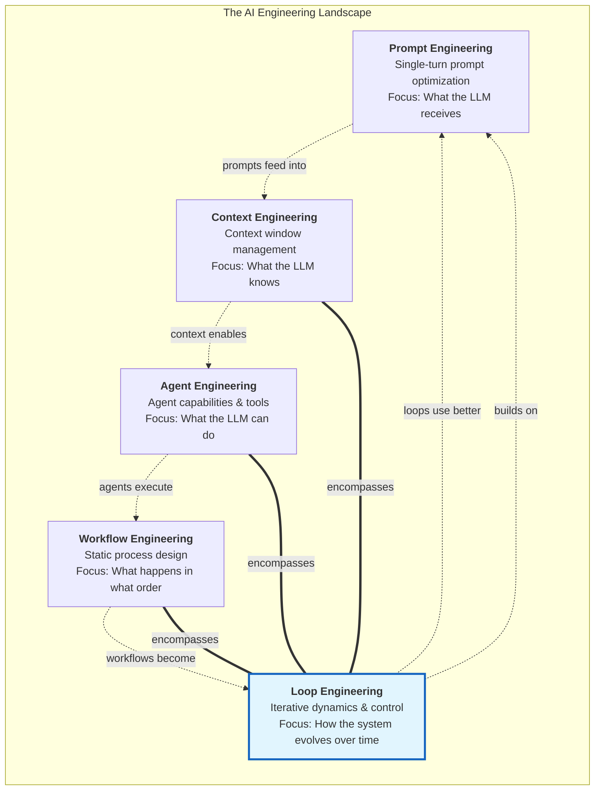
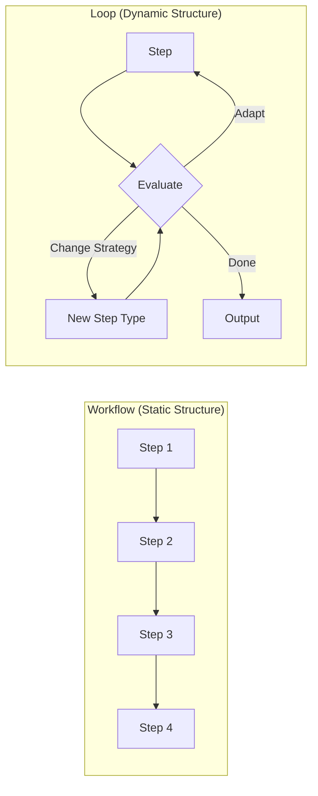
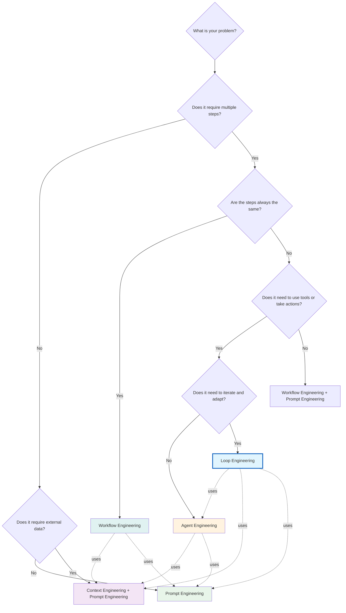
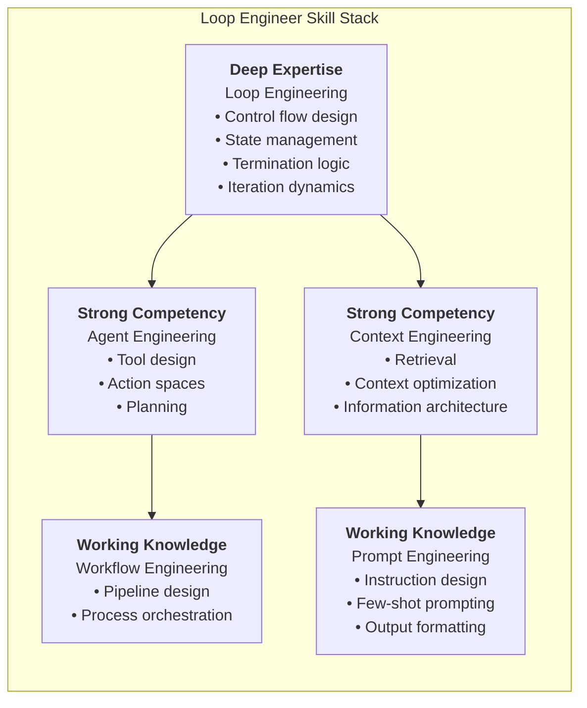

# 20 — Comparison with Prompt, Context, and Agent Engineering

## Introduction

The AI engineering landscape is crowded with overlapping disciplines, and the boundaries between them are often unclear. **Prompt Engineering**, **Context Engineering**, **Agent Engineering**, **Workflow Engineering**, and **Loop Engineering** all deal with building AI-powered systems — but they operate at different levels of abstraction, solve different problems, and require different skills.

This file provides a clear, structured comparison of these five disciplines. For each, we define its scope, identify its overlap with the others, and specify when it is the right tool for the job. The goal is not to create rigid boundaries — these disciplines genuinely overlap — but to give you a mental model for navigating the landscape and knowing which lens to apply to a given problem.

> **Note**: This file references concepts from throughout the library. See [01_What_is_Loop_Engineering.md](01_What_is_Loop_Engineering.md) for the foundational definition of Loop Engineering, and [02_Why_Loop_Engineering.md](02_Why_Loop_Engineering.md) for the motivation behind the discipline.

---

## The Relationship Landscape

The five disciplines exist on a spectrum from **single-turn optimization** to **multi-turn orchestration**, and from **content design** to **system design**. They overlap significantly — a well-built loop system uses all four other disciplines within it.

**Key insight**: Loop Engineering is the **outermost discipline** in terms of system complexity. Every other discipline is a *component* within a loop-engineered system. A loop engineer must understand and apply all four other disciplines, but also must manage the dynamics that emerge when they interact over multiple iterations.

---

## Prompt Engineering

### Definition

**Prompt Engineering** is the discipline of crafting the input (prompt) to an LLM to elicit the best possible output for a single turn of interaction. It encompasses prompt templates, few-shot examples, chain-of-thought instructions, output format specifications, and system prompts.

### Scope

| Dimension | Details |
|-----------|---------|
| **Focus** | Single input → single output optimization |
| **Turns** | Typically 1 (single-shot) |
| **State** | None (stateless) |
| **Dynamics** | None (no iteration) |
| **Primary Skill** | Writing, psychology, instruction design |
| **Key Metrics** | Output quality, format compliance, instruction following |
| **Tools** | Plain text, prompt templates, structured output schemas |

### What Prompt Engineering Handles Well

- Crafting clear, specific instructions
- Providing examples (few-shot learning)
- Specifying output formats (JSON, XML, markdown)
- Implementing reasoning techniques (chain-of-thought, tree-of-thought)
- Role assignment ("You are an expert...")
- Tone and style control

### What Prompt Engineering Cannot Handle

- Multi-step tasks that require tool use
- Tasks that need information from external sources
- Problems that require iteration and refinement
- State management across turns
- Dynamic adaptation based on observations

### Relationship to Loop Engineering

Prompt engineering is a **foundational component** of loop engineering. Every node in a loop that calls an LLM requires prompt engineering. However, loop engineering adds the dimension of *how prompts evolve across iterations* — for example, how a prompt incorporates feedback from a previous iteration, or how the system prompt changes based on the current phase of the loop.

> **Analogy**: If prompt engineering is writing a good email, loop engineering is managing a project through a series of emails, adapting your strategy based on the replies you receive.

---

## Context Engineering

### Definition

**Context Engineering** is the discipline of designing, selecting, and managing the information that enters an LLM's context window. It encompasses retrieval-augmented generation (RAG), context window optimization, information architecture, and the design of what knowledge the LLM has access to.

### Scope

| Dimension | Details |
|-----------|---------|
| **Focus** | What information the LLM can reference |
| **Turns** | Can be single or multi-turn |
| **State** | Implicit (through context accumulation) |
| **Dynamics** | Limited (context changes, but the structure is usually static) |
| **Primary Skill** | Information architecture, retrieval design, data modeling |
| **Key Metrics** | Relevance, coverage, token efficiency |
| **Tools** | Vector databases, embedding models, retrieval pipelines, chunking strategies |

### What Context Engineering Handles Well

- Deciding what information to include in the prompt
- Designing retrieval strategies (what to fetch, when to fetch it)
- Optimizing context window usage (what to keep, what to discard)
- Building knowledge bases and indexing strategies
- Managing conversation history in chat applications

### What Context Engineering Cannot Handle

- Control flow (what happens next)
- Tool-calling orchestration
- Iterative decision-making
- Multi-agent coordination
- Termination logic

### Relationship to Loop Engineering

Context engineering is a **critical subsystem** within loop engineering. A loop that makes decisions based on LLM output must carefully manage what context it provides at each iteration. In a loop, context engineering becomes more challenging because:

1. **Context accumulates** across iterations and must be managed
2. **Relevance changes** — what was useful context in iteration 1 may be noise in iteration 5
3. **Context budgets** must be enforced as part of sentinel logic

Loop engineering extends context engineering by adding the question: *How does the context strategy change as the loop iterates?*

---

## Agent Engineering

### Definition

**Agent Engineering** is the discipline of building AI systems that can perceive their environment, make decisions, and take actions using tools. It encompasses tool design, tool selection, planning, and building autonomous or semi-autonomous systems.

### Scope

| Dimension | Details |
|-----------|---------|
| **Focus** | What the system can do (capabilities, tools, actions) |
| **Turns** | Multi-turn (an agent acts over multiple steps) |
| **State** | Managed (agent maintains state across actions) |
| **Dynamics** | Moderate (agents react, but the loop structure is often implicit) |
| **Primary Skill** | Tool integration, action space design, planning |
| **Key Metrics** | Task completion rate, action accuracy, tool selection quality |
| **Tools** | LangChain tools, function calling, planning frameworks, memory systems |

### What Agent Engineering Handles Well

- Defining what actions an AI system can take
- Building tools that the LLM can invoke
- Implementing planning and reasoning capabilities
- Designing memory systems (short-term, long-term)
- Building systems that interact with external services

### What Agent Engineering Often Overlooks

Agent engineering tends to focus on *capabilities* (what the agent can do) and under-specify the *loop mechanics* (how the agent iterates, when it stops, what happens when it fails). An agent engineer might build a powerful tool set but leave the control loop implicit or poorly defined.

### Relationship to Loop Engineering

Agent engineering and loop engineering have the **highest overlap** of any pair in this comparison. An agent is, by definition, a system that loops through perception-decision-action cycles. However:

- **Agent engineering** focuses on the *agent itself* — its tools, its reasoning, its capabilities
- **Loop engineering** focuses on the *loop structure* — the control flow, termination, state management, and dynamics

Every agent has a loop (explicit or implicit). Loop engineering makes that loop **explicit, controllable, and observable**.

> **Analogy**: Agent engineering designs the car (engine, steering, brakes). Loop engineering designs the traffic system (roads, signals, rules) that the car navigates. You need both.

---

## Workflow Engineering

### Definition

**Workflow Engineering** is the discipline of designing and implementing structured, often multi-step processes that connect LLM calls, tools, and human actions into a defined sequence. It encompasses pipeline design, conditional branching, and process orchestration.

### Scope

| Dimension | Details |
|-----------|---------|
| **Focus** | What happens in what order (process structure) |
| **Turns** | Multi-step (a workflow has multiple stages) |
| **State** | Managed (data flows between stages) |
| **Dynamics** | Low (the structure is typically static and defined upfront) |
| **Primary Skill** | Process design, system integration, API orchestration |
| **Key Metrics** | Throughput, reliability, error rates, latency |
| **Tools** | DAG frameworks, orchestration tools, pipeline frameworks |

### What Workflow Engineering Handles Well

- Designing multi-step processes with clear stages
- Building reliable data pipelines
- Integrating multiple systems and services
- Implementing conditional logic and branching
- Creating reproducible, auditable processes

### What Workflow Engineering Cannot Handle

- Dynamic adaptation of the process itself
- Self-evaluation and iterative refinement
- Emergent behavior from iteration
- Situations where the "right" next step depends on accumulated learning

### Relationship to Loop Engineering

Workflow engineering and loop engineering are **close cousins** that differ in a critical dimension: **dynamism**.

- A **workflow** is typically a **static structure** — the graph of nodes and edges is defined at design time and doesn't change during execution.
- A **loop** can be **dynamic** — the graph can adapt its behavior, change strategies, or restructure itself based on what it observes during execution.

A workflow is a loop with the iteration "baked in." A loop is a workflow where the path through the graph is determined *at runtime* based on the evolving state.

---

## Comprehensive Comparison Table

| Dimension | Prompt Engineering | Context Engineering | Agent Engineering | Workflow Engineering | Loop Engineering |
|-----------|--------------------|--------------------|--------------------|-----------------------|-----------------|
| **Core Question** | What should I say? | What should it know? | What can it do? | What happens in what order? | How does it evolve over time? |
| **Abstraction Level** | Text | Information | Capabilities | Process | Dynamics |
| **Turns** | 1 | 1–N | 1–N | N (fixed) | N (variable) |
| **State** | None | Accumulated context | Agent memory | Pipeline data | Evolving state machine |
| **Iteration** | None | Limited | Implicit loop | Static sequence | Explicit, managed loop |
| **Adaptation** | N/A | Context selection | Tool selection | Conditional branches | Strategy evolution |
| **Termination** | N/A | N/A | Often implicit | Defined by pipeline | Explicit, multi-criteria |
| **Primary Artifact** | Prompt template | Retrieval pipeline | Tool + agent config | DAG / flowchart | State graph with guards |
| **Key Risk** | Poor instruction following | Irrelevant context | Tool misuse | Rigidity | Infinite loops, cost |
| **Learning Curve** | Low | Medium | Medium-High | Medium | High |
| **Example Tool** | DSPy | LangChain Retrieval | LangChain Tools | Apache Airflow | LangGraph |

---

## When to Use Which Discipline

### Decision Framework

Use this framework to determine which discipline (or combination) is appropriate for your problem:

### Scenario-Based Guidance

| Scenario | Primary Discipline | Supporting Disciplines |
|----------|-------------------|----------------------|
| Write a single email response | Prompt Engineering | — |
| Build a chatbot that answers questions from a knowledge base | Context Engineering | Prompt Engineering |
| Build a system that searches the web and summarizes results | Agent Engineering | Prompt, Context |
| Build a data pipeline: extract → transform → load | Workflow Engineering | Prompt, Context |
| Build a code reviewer that iteratively improves code | **Loop Engineering** | Agent, Context, Prompt |
| Build a research assistant that plans, searches, evaluates, and refines | **Loop Engineering** | Agent, Context, Workflow, Prompt |
| Build a customer support bot that escalates complex cases | Workflow Engineering | Agent, Context |
| Optimize a single prompt for better output quality | Prompt Engineering | — |
| Build a system that adapts its strategy based on success/failure | **Loop Engineering** | Agent, Context, Prompt |

---

## The Skill Stack: What a Loop Engineer Needs to Know

A loop engineer doesn't just need to understand loop mechanics. They need competency across all five disciplines because a loop system incorporates all of them.

### The T-Shaped Skill Profile

**Why this skill distribution matters**:

- **Loop Engineering** is the deep expertise because it's the highest-leverage skill — understanding how to manage iterative dynamics is what separates a loop engineer from other AI engineers.
- **Agent and Context Engineering** are strong competencies because loops almost always involve agents acting with managed context.
- **Workflow and Prompt Engineering** are working knowledge because they are the building blocks that loops compose, but they don't require the same depth of expertise for a loop engineer (who can reference specialists when needed).

---

## Common Confusions Clarified

### "Isn't Agent Engineering the same as Loop Engineering?"

No, but the confusion is understandable. Here's the distinction:

| Aspect | Agent Engineering | Loop Engineering |
|--------|------------------|-----------------|
| **Primary focus** | What the agent *can do* | How the agent *iterates* |
| **Core artifact** | Tool definitions, action spaces | Control flow, state machine |
| **Key question** | "What tools does the agent need?" | "When does the loop stop, and why?" |
| **Analogy** | Designing a robot's arms and sensors | Programming the robot's control loop |

An agent without a well-designed loop is a powerful but uncontrolled tool. A loop without capable agents is a well-structured but ineffective process. **Both are needed for production systems.**

### "Is Loop Engineering just Workflow Engineering with loops?"

Not quite. The difference is more fundamental than adding a "loop back" arrow:

- **Workflow Engineering** assumes the structure is known at design time. The edges in the graph are fixed.
- **Loop Engineering** embraces that the structure may need to adapt at runtime. The edges in the graph can change based on what the system observes.

A workflow engineer defines *all possible paths upfront*. A loop engineer designs the *mechanisms that determine the path at runtime*.

### "Does Loop Engineering replace Prompt Engineering?"

Absolutely not. Loop engineering *builds on* prompt engineering. Every LLM call within a loop requires a well-crafted prompt. What loop engineering adds is the *systematic management of how those prompts evolve across iterations*.

Think of it this way:
- **Prompt Engineering**: Write the best possible prompt for a single LLM call
- **Loop Engineering**: Design the system that generates, adapts, and evaluates prompts across multiple iterations

---

## Summary

### The Five Disciplines at a Glance

| Discipline | One-Line Summary | Key Deliverable |
|-----------|-----------------|-----------------|
| **Prompt Engineering** | Optimize what you say to the LLM | A well-crafted prompt template |
| **Context Engineering** | Optimize what the LLM knows | A retrieval and context management system |
| **Agent Engineering** | Define what the LLM can do | A set of tools and an agent configuration |
| **Workflow Engineering** | Define what happens in what order | A structured process (DAG/pipeline) |
| **Loop Engineering** | Manage how the system evolves over iterations | A state graph with control flow and termination |

### The Meta-Principle

> **Loop Engineering is the discipline of managing iterative AI processes. It encompasses and extends the other four disciplines by adding the dimension of time and iteration.**

The other disciplines answer *what* the system should do at any given moment. Loop engineering answers *how the system decides what to do next, and when to stop*.

---

## Glossary

| Term | Definition |
|------|-----------|
| **Prompt Engineering** | Crafting inputs to LLMs to elicit optimal single-turn outputs |
| **Context Engineering** | Designing and managing the information available in an LLM's context window |
| **Agent Engineering** | Building AI systems with perception, decision-making, and action capabilities |
| **Workflow Engineering** | Designing structured, multi-step processes for AI systems |
| **Loop Engineering** | Designing, building, and managing iterative AI processes with explicit control flow and termination |
| **T-Shaped Skills** | A skill profile with deep expertise in one area and broad competency across related areas |
| **Static Structure** | A process whose graph (nodes and edges) is defined at design time and doesn't change at runtime |
| **Dynamic Structure** | A process whose behavior can adapt or restructure itself based on runtime observations |

---

## References

- Yao et al. *ReAct: Synergizing Reasoning and Acting in Language Models* (2023) — Agent engineering foundation
- Lewis et al. *Retrieval-Augmented Generation for Knowledge-Intensive NLP Tasks* (2020) — Context engineering foundation
- Wei et al. *Chain-of-Thought Prompting Elicits Reasoning in Large Language Models* (2022) — Prompt engineering foundation
- LangGraph Documentation: [Concepts](https://langchain-ai.github.io/langgraph/) — Loop/workflow engineering implementation
- [01_What_is_Loop_Engineering.md](01_What_is_Loop_Engineering.md) — Foundational definition of Loop Engineering
- [02_Why_Loop_Engineering.md](02_Why_Loop_Engineering.md) — Why Loop Engineering is a distinct discipline
- [16_Loop_Design_Patterns.md](16_Loop_Design_Patterns.md) — Patterns that distinguish loops from workflows