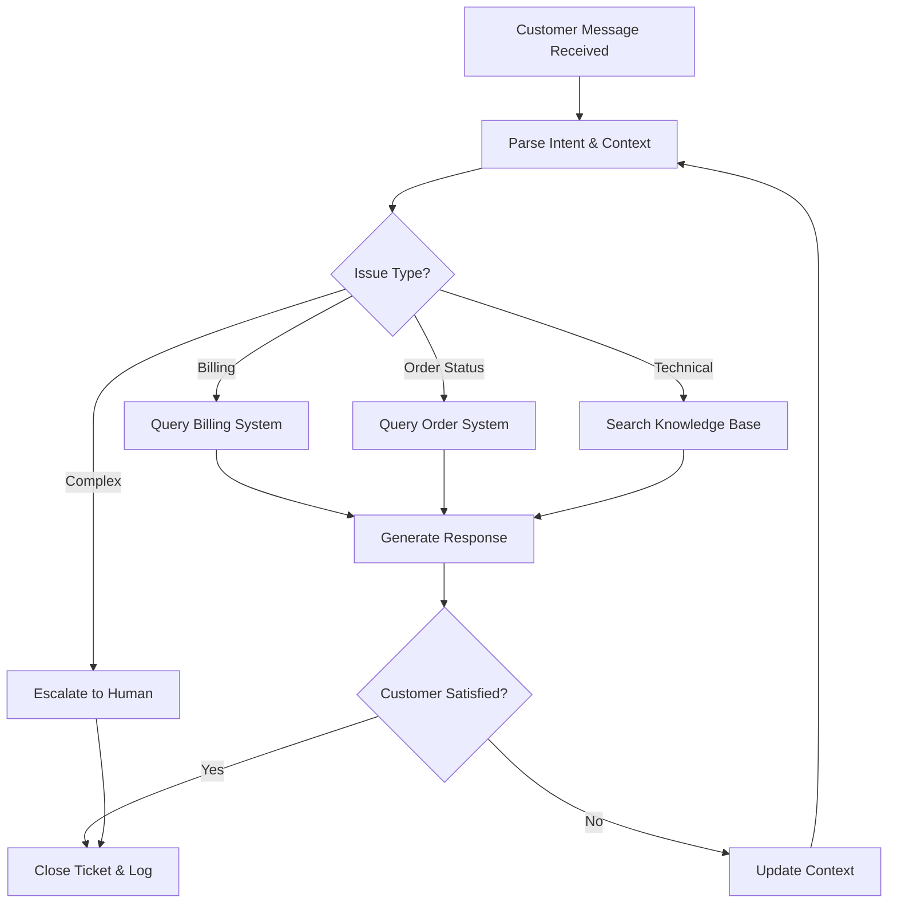
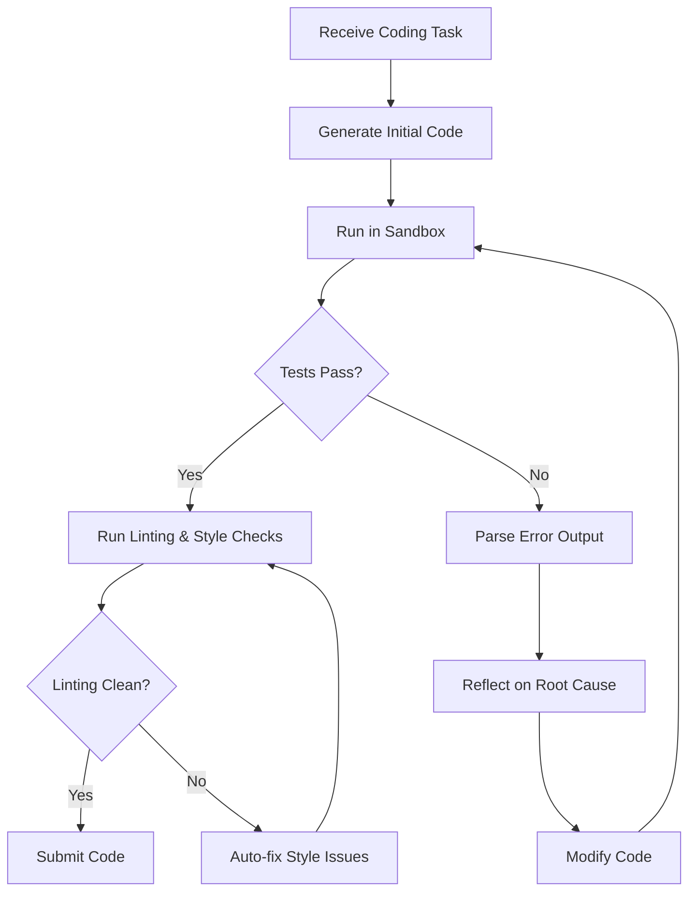
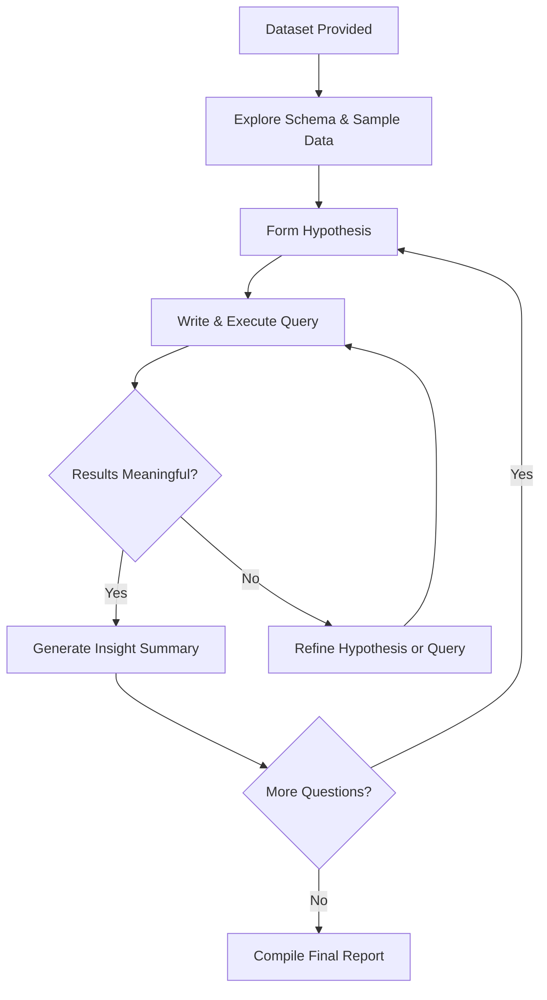
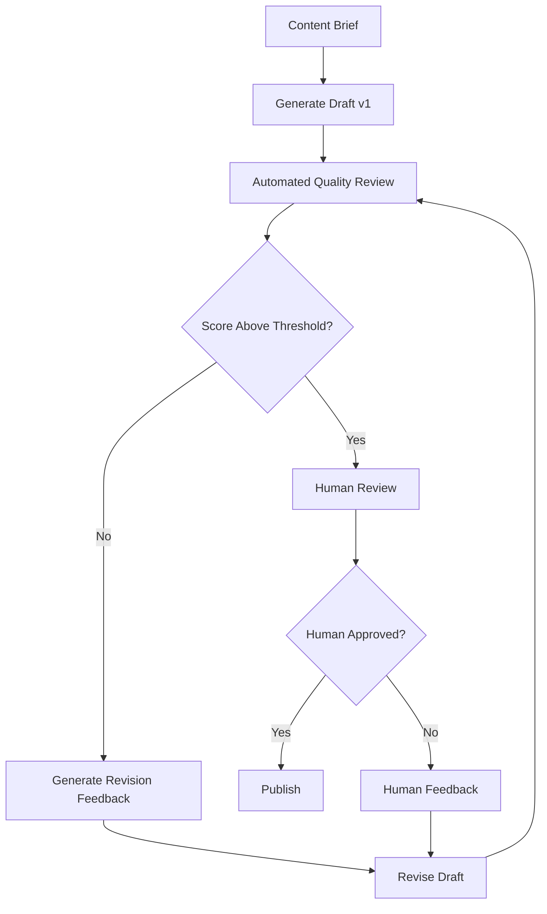
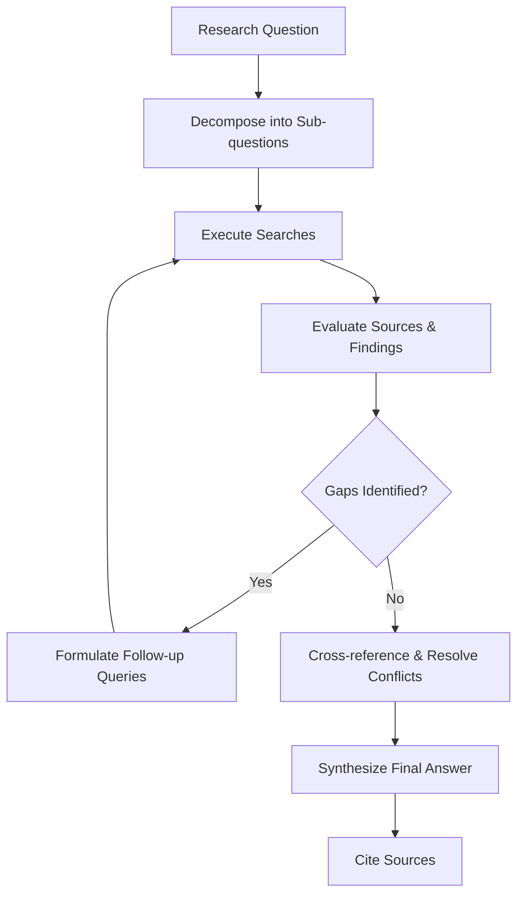
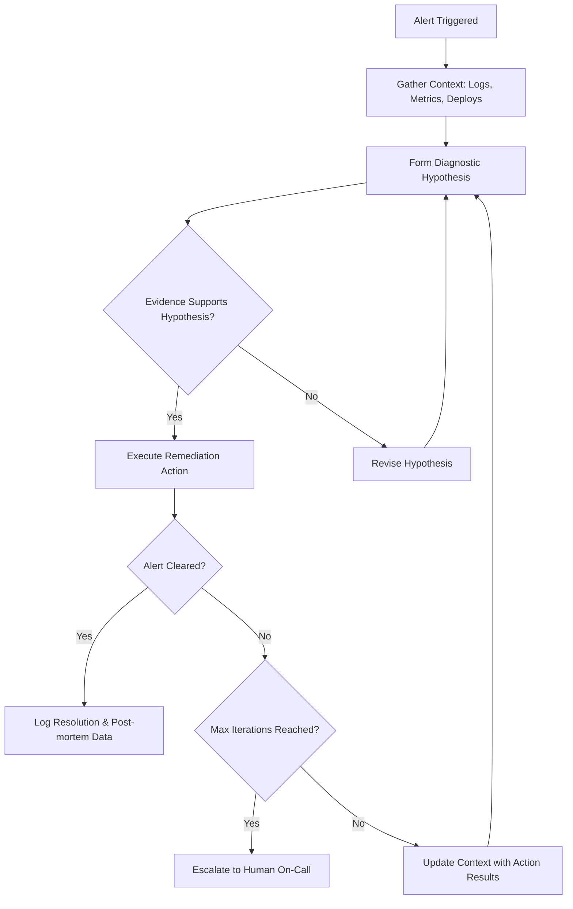
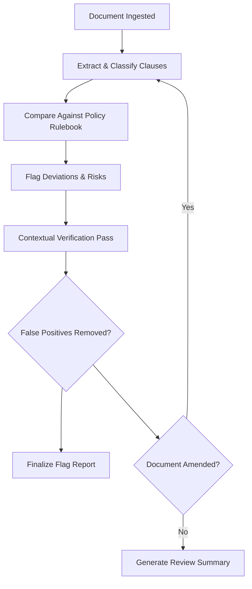
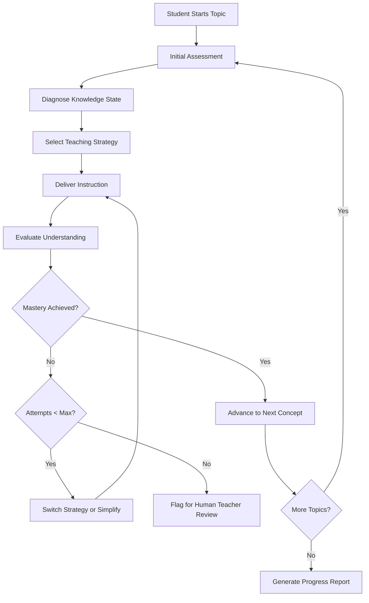

# 21 — Real-World Use Cases of Loop Engineering

## Introduction

Loop engineering isn't just an academic concept — it's the backbone of the most capable AI systems deployed in production today. Every time an AI agent iteratively refines its output, calls a tool and reasons over the result, or collaborates with another agent to solve a problem, loop engineering principles are at work. This file explores **eight real-world use cases** where iterative AI loops deliver transformative value across industries.

Each use case follows a consistent structure: the **problem** being solved, the **loop design** that addresses it, a **Mermaid workflow diagram**, and **key insights** drawn from production deployments. Together, they illustrate the breadth and depth of loop engineering in practice.

---

## 1. Customer Support Automation (Iterative Resolution Loops)

### Problem

Traditional chatbots follow linear scripts: they match a user's question to a pre-written answer and stop. This fails for complex, multi-step issues — a user might ask about a billing dispute, then follow up with a shipping question, then ask for a refund. Linear systems lose context and cannot adapt. Enterprises need AI that can **iterate toward resolution** across potentially many back-and-forth turns, calling internal tools (account lookup, refund processing, knowledge base search) along the way.

### Loop Design

The **Iterative Resolution Loop** operates in three phases that repeat until the customer's issue is resolved:

1. **Understand**: Parse the customer's message, classify intent, and check account context.
2. **Act**: Call the appropriate tool — look up order status, search the knowledge base, process a refund, or escalate to a human.
3. **Evaluate**: Assess whether the customer's issue has been resolved. If yes, close the ticket. If no, loop back to Understand with the new context.

### Workflow



### Key Insights

- **Tool integration is critical**. The loop is only as good as the tools it can call. Production systems connect to CRM platforms, payment processors, and inventory databases via function calling.
- **Escalation is a loop exit, not a failure**. A well-designed loop knows when it can't help and routes to a human gracefully. See [11_Human_in_the_Loop.md](11_Human_in_the_Loop.md) for escalation patterns.
- **Context accumulation** across iterations prevents the customer from repeating themselves. Each turn appends to the conversation state.
- Typical production loops run **3–7 iterations** for a single support ticket, with a median of 4.

---

## 2. Code Generation & Review (Write-Test-Fix Loops)

### Problem

Generating code with an LLM in a single shot produces working code maybe 40–60% of the time for non-trivial tasks. The code may have syntax errors, logic bugs, missing imports, or fail to meet edge cases. Software engineering demands **verified correctness** — code should compile, pass tests, and satisfy requirements. This requires an iterative loop where the AI writes code, runs it, observes failures, and fixes them.

### Loop Design

The **Write-Test-Fix Loop** mirrors how human developers work:

1. **Generate**: Write initial code based on the requirements and existing codebase context.
2. **Execute**: Run the code (or tests) in a sandboxed environment.
3. **Observe**: Parse the output — compiler errors, test failures, linting warnings.
4. **Reflect**: Analyze what went wrong and formulate a fix strategy.
5. **Fix**: Modify the code and loop back to Execute.

This is a direct application of the **Reflexion** pattern (see [04_Core_Concepts.md](04_Core_Concepts.md)).

### Workflow



### Pseudo-Code

```python
from langgraph.graph import StateGraph, END
from typing import TypedDict, List

class CodeState(TypedDict):
    task: str
    code: str
    test_results: str
    iteration: int
    max_iterations: int

def generate_code(state: CodeState) -> CodeState:
    prompt = f"Task: {state['task']}\nCurrent code:\n{state['code']}\n"
    if state["test_results"]:
        prompt += f"Test failures:\n{state['test_results']}\nPlease fix."
    state["code"] = llm.invoke(prompt).content
    state["iteration"] += 1
    return state

def run_tests(state: CodeState) -> CodeState:
    state["test_results"] = sandbox.execute(state["code"])
    return state

def should_continue(state: CodeState) -> str:
    if "ALL TESTS PASSED" in state["test_results"]:
        return "end"
    if state["iteration"] >= state["max_iterations"]:
        return "end"  # Exit with partial solution
    return "fix"

builder = StateGraph(CodeState)
builder.add_node("generate", generate_code)
builder.add_node("test", run_tests)
builder.add_edge("generate", "test")
builder.add_conditional_edges("test", should_continue, {
    "fix": "generate",
    "end": END
})
```

### Key Insights

- **Sandboxing is non-negotiable**. Never run LLM-generated code directly. Use Docker containers, Firecracker microVMs, or similar isolation.
- **Iteration caps prevent cost blowup**. Most tasks resolve in 1–3 iterations. Set `max_iterations` to 5–10 as a safety net.
- **Error message quality matters**. The richer the test output (stack traces, assertion messages), the better the LLM can fix the code.
- This pattern powers tools like **Devin**, **Cursor**, and **GitHub Copilot Workspace**.

---

## 3. Data Analysis Pipelines (Explore-Analyze-Refine Loops)

### Problem

Data analysts don't know the right query on the first try. They explore a dataset, form hypotheses, write queries, examine results, refine their approach, and repeat. A static "generate a SQL query" tool misses this iterative nature. Enterprises need AI systems that can **autonomously explore data**, much like a data scientist would, looping through exploration until meaningful insights emerge.

### Loop Design

The **Explore-Analyze-Refine Loop**:

1. **Explore**: Understand the schema, sample data, and basic statistics.
2. **Hypothesize**: Form a question or hypothesis about the data.
3. **Query**: Execute SQL or Python code against the dataset.
4. **Evaluate**: Assess whether the results are meaningful, surprising, or need refinement.
5. **Refine**: Adjust the query, try different groupings, filters, or visualizations, and loop back.

### Workflow



### Key Insights

- **Schema understanding is the critical first step**. Without it, the LLM hallucinates column names and produces invalid queries. Include a schema-retrieval tool in the loop.
- **Cost control via query complexity limits**. Prevent the LLM from writing `SELECT *` on a billion-row table. Enforce row limits and timeout constraints on every query execution.
- **Visualization as an evaluation tool**. Generating a chart from query results often reveals patterns (or lack thereof) faster than reading tabular output.
- See [15_Observation_and_Feedback.md](15_Observation_and_Feedback.md) for how observation patterns apply to data analysis loops.

---

## 4. Content Creation (Draft-Review-Revise Loops)

### Problem

A single LLM generation pass produces generic, often mediocre content. Professional writers draft, review against guidelines, revise, and repeat. Enterprises producing marketing copy, documentation, reports, or social media content need AI that can **iteratively improve its own output** based on quality criteria, brand guidelines, and feedback.

### Loop Design

The **Draft-Review-Revise Loop** introduces a quality gate between generation and delivery:

1. **Draft**: Generate initial content from a brief.
2. **Review**: Evaluate against criteria — tone, accuracy, length, brand compliance, factual correctness.
3. **Revise**: Apply specific feedback to improve the draft.
4. **Approve**: A human reviewer (optional) approves or requests further changes.

### Workflow



### Key Insights

- **Separate the reviewer LLM from the writer LLM**. Using the same model for both writing and reviewing creates a blind spot — it tends to approve its own output. Use a different model or a specialized rubric-based evaluator.
- **Scoring rubrics must be concrete**. "Make it better" is useless feedback. Instead: "Reduce word count by 20%. Add two specific statistics. Change tone from casual to professional."
- **Version tracking** within the loop enables rollback. Store each iteration's output so you can compare and select the best version.
- Production content systems typically loop **2–4 times** before human review.

---

## 5. Research & Information Synthesis (Search-Organize-Summarize Loops)

### Problem

Answering complex research questions requires gathering information from multiple sources, cross-referencing claims, identifying gaps, and synthesizing a coherent answer. A single search-query-summarize pipeline produces shallow, often incorrect answers for multi-faceted questions. Researchers need AI that can **iteratively deepen its understanding** through multiple search cycles.

### Loop Design

The **Search-Organize-Summarize Loop**:

1. **Decompose**: Break a complex question into sub-questions.
2. **Search**: Query web search, internal knowledge bases, or document stores for each sub-question.
3. **Evaluate**: Assess source quality, relevance, and completeness.
4. **Identify Gaps**: Determine what's still missing or unclear.
5. **Re-search**: Formulate targeted follow-up queries for gaps.
6. **Synthesize**: Combine all findings into a structured answer.

### Workflow



### Key Insights

- **Source quality filtering** is essential. Not all search results are equal. The loop should evaluate source credibility (publication, date, domain authority) before incorporating information.
- **Conflict resolution** is a hard problem. When sources disagree, the loop must either present multiple perspectives or determine which is more credible. This is an area of active research.
- **Search API rate limits** constrain loop speed. Budget for 10–20 search calls per research task and design the loop to prioritize high-value queries.
- This pattern powers products like **Perplexity AI** and **Google Deep Research**.

---

## 6. DevOps & Incident Response (Detect-Diagnose-Resolve Loops)

### Problem

When production systems fail, on-call engineers follow a methodical process: detect the alert, diagnose the root cause, attempt a fix, observe the result, and iterate. Manual incident response is slow and error-prone at 3 AM. Automated systems need to **loop through diagnosis and remediation** with the same rigor a senior engineer would apply.

### Loop Design

The **Detect-Diagnose-Resolve Loop**:

1. **Detect**: Ingest alerts from monitoring systems (PagerDuty, Datadog, Prometheus).
2. **Triage**: Assess severity and gather initial context — logs, metrics, recent deployments.
3. **Diagnose**: Form hypotheses about root cause and gather evidence.
4. **Act**: Execute remediation — restart a service, roll back a deployment, scale up resources.
5. **Verify**: Check whether the alert clears and system health is restored.
6. **Escalate**: If the loop can't resolve the issue within N iterations, page a human.

### Workflow



### Key Insights

- **Safety rails are paramount**. The loop must only be able to execute a pre-approved set of remediation actions. Rolling back a deployment is safe; deleting a database is not.
- **Observability integration** makes or breaks this loop. The quality of logs, metrics, and traces directly determines the loop's diagnostic ability.
- **Blast radius control**: Each remediation action should be reversible. The loop should maintain an undo stack.
- This is one of the highest-stakes applications of loop engineering — a wrong action can cause more damage than the original incident. See [18_Loop_Safety_and_Guardrails.md](18_Loop_Safety_and_Guardrails.md) for safety patterns.

---

## 7. Legal/Compliance Document Review (Scan-Flag-Verify Loops)

### Problem

Legal teams review thousands of contracts, regulatory filings, and compliance documents. Missing a clause — a non-compete, an indemnification term, a GDPR violation — can cost millions. Manual review is slow and inconsistent. AI-assisted review must **iteratively scan, flag potential issues, and verify** them against policy rules, looping until comprehensive coverage is achieved.

### Loop Design

The **Scan-Flag-Verify Loop**:

1. **Scan**: Parse the document and extract clauses, terms, and provisions.
2. **Flag**: Compare extracted terms against a policy rulebook. Flag deviations, risks, and missing required clauses.
3. **Verify**: Re-examine flagged items in full context to reduce false positives.
4. **Report**: Generate a structured review report with severity ratings.
5. **Re-scan**: If new policy rules are added or the document is amended, loop back.

### Workflow



### Key Insights

- **False positive rate is the key metric**. Flagging every "may" or "shall" as a risk overwhelms reviewers. The verification pass is essential for production usability.
- **Policy rulebooks must be versioned**. Regulatory requirements change. The loop should reference the specific policy version applied during review.
- **Audit trail requirements** mean every iteration of the loop must be logged — what was scanned, what was flagged, what was verified, and by what criteria.
- Typical accuracy targets: **95%+ recall** (don't miss real issues) with **<20% false positive rate** (don't overwhelm reviewers).

---

## 8. Educational Tutoring (Assess-Teach-Evaluate Loops)

### Problem

One-size-fits-all education fails because students have different backgrounds, learning speeds, and misconception patterns. Effective tutoring is inherently **iterative**: assess what the student knows, teach to fill gaps, evaluate understanding, and repeat. AI tutoring systems must replicate this adaptive loop at scale.

### Loop Design

The **Assess-Teach-Evaluate Loop**:

1. **Assess**: Determine the student's current understanding through questions or analysis of their work.
2. **Diagnose**: Identify specific misconceptions, knowledge gaps, or skill deficits.
3. **Teach**: Deliver targeted instruction — explanations, examples, analogies, practice problems.
4. **Evaluate**: Test whether the student has internalized the new concept.
5. **Adapt**: If the student hasn't mastered it, try a different explanation approach, simpler examples, or break the concept into smaller pieces. Loop back to Teach.

### Workflow



### Key Insights

- **Strategy diversity** is crucial. If explaining a concept one way doesn't work, the loop must try another — visual, analogical, step-by-step, Socratic questioning. A single explanation strategy will fail for a significant fraction of students.
- **Socratic method as a loop pattern**: Instead of telling the student the answer, the loop asks guiding questions that lead them to discover it themselves. This is more effective for long-term retention.
- **Emotional state awareness** (future direction) could make loops more effective — a frustrated student needs encouragement, not more problems.
- **Mastery thresholds** should be configurable. Not every topic requires 100% mastery before advancing. Spaced repetition loops can revisit concepts later.

---

## Cross-Cutting Patterns

Across all eight use cases, several **common loop engineering patterns** emerge:

| Pattern | Description | Use Cases |
|---------|-------------|-----------|
| **Tool-Calling Loop** | LLM decides which tool to call, observes result, decides next action | Support, Code Gen, Data Analysis, DevOps |
| **Self-Critique Loop** | LLM generates output, evaluates it, revises | Content Creation, Code Review |
| **Exploration Loop** | System searches/queries, evaluates relevance, refines query | Research, Data Analysis |
| **Escalation Pattern** | Loop runs N iterations, then escalates to human | All production use cases |
| **Multi-Phase Loop** | Distinct phases (scan → verify → report) within one loop | Legal Review, Content Creation |
| **Adaptive Strategy Loop** | Changes approach based on outcome | Educational Tutoring, Research |

---

## Summary & Cheat Sheet

| Use Case | Core Loop Pattern | Typical Iterations | Critical Success Factor |
|----------|------------------|--------------------|------------------------|
| Customer Support | Understand → Act → Evaluate | 3–7 | Tool integration quality |
| Code Generation | Write → Test → Fix | 1–5 | Sandbox safety |
| Data Analysis | Explore → Query → Refine | 5–15 | Schema understanding |
| Content Creation | Draft → Review → Revise | 2–4 | Separate reviewer model |
| Research | Search → Evaluate → Re-search | 3–10 | Source quality filtering |
| DevOps/Incidents | Detect → Diagnose → Resolve | 1–8 | Safety rails on actions |
| Legal Review | Scan → Flag → Verify | 1–3 | False positive control |
| Education | Assess → Teach → Evaluate | 3–10 | Strategy diversity |

> **Key Takeaway**: The specific domain changes, but the loop engineering fundamentals remain the same — **observe, reason, act, evaluate, iterate**. Mastering these patterns in one domain transfers directly to others.

---

## Glossary

- **Iteration Cap**: The maximum number of times a loop is allowed to execute before forced termination.
- **Escalation**: Routing a task from an automated loop to a human when the loop cannot resolve it.
- **Remediation Action**: A pre-approved automated fix executed by an incident response loop.
- **Mastery Threshold**: The minimum performance level required to advance past a concept in an educational loop.
- **False Positive Rate**: The proportion of flagged items that are not actually problematic, critical in legal/ compliance loops.

---

## References

- LangGraph documentation on iterative agent patterns: [https://langchain-ai.github.io/langgraph/](https://langchain-ai.github.io/langgraph/)
- ReAct paper (Yao et al., 2022): foundational pattern for reasoning-acting loops
- Reflexion paper (Shinn et al., 2023): self-reflective language agent loops
- See [04_Core_Concepts.md](04_Core_Concepts.md) for theoretical foundations of these loop patterns
- See [11_Human_in_the_Loop.md](11_Human_in_the_Loop.md) for escalation and human review patterns
- See [18_Loop_Safety_and_Guardrails.md](18_Loop_Safety_and_Guardrails.md) for safety considerations in production loops