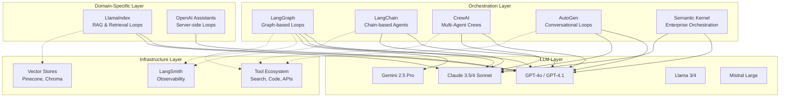
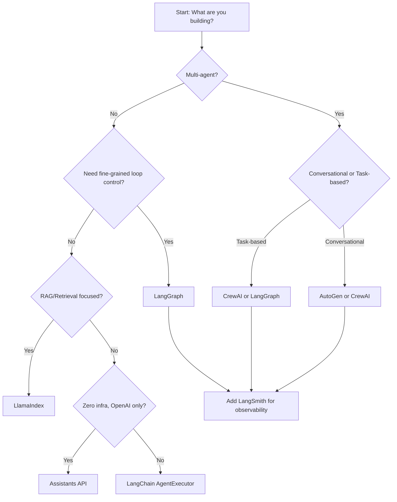

# 22 — Frameworks and LLM Compatibility

## Introduction

Loop engineering doesn't happen in a vacuum — it requires a **framework** to orchestrate the iterative cycles and an **LLM** to provide the reasoning that drives them. The framework manages state, routing, tool calls, and loop termination. The LLM provides the intelligence to decide what to do next. Choosing the right combination of framework and model is one of the most consequential decisions in building a loop-engineered system.

This file provides a comprehensive overview of the **major frameworks** that support loop engineering patterns, the **LLM landscape** and how different models perform in iterative workflows, and practical guidance on making the right choices for your use case.

---

## Core Concepts

Before diving into specific frameworks, understand these key dimensions that differentiate them:

- **State Management**: How does the framework track data across loop iterations? Some use immutable state snapshots, others use mutable objects.
- **Control Flow**: Does the framework support conditional branching, parallel execution, and complex routing within loops?
- **Tool Integration**: How easily can you connect external tools, APIs, and functions that the LLM can call during loop iterations?
- **Persistence & Checkpointing**: Can the loop be paused, resumed, or replayed? Critical for long-running loops and debugging.
- **Observability**: Can you inspect what's happening inside the loop — which nodes execute, what state transitions occur, how many tokens are consumed?

---

## Framework Deep Dives

### 1. LangGraph (Deep Dive)

**LangGraph** is the most purpose-built framework for loop engineering. Developed by LangChain, it models AI workflows as **directed graphs** where nodes are processing steps and edges define the flow — including edges that loop back to previous nodes. It is explicitly designed for building stateful, multi-actor, iterative AI applications.

**Key Architecture Concepts**:

- **StateGraph**: The core abstraction. You define a `TypedDict` for your state, add nodes (functions that process state), and add edges (including conditional edges that determine loop routing).
- **Conditional Edges**: The mechanism that makes loops possible. A function inspects the current state and returns a string indicating which node to route to next — including routing back to a previous node.
- **Checkpointer**: Built-in persistence layer that saves state at every step. Enables pause-resume, time-travel debugging, and human-in-the-loop workflows.
- **Subgraphs**: Nested graphs that allow you to modularize complex loop patterns.

```python
from langgraph.graph import StateGraph, END, START
from typing import TypedDict, Annotated
from langgraph.graph.message import add_messages
from langgraph.checkpoint.memory import MemorySaver

class AgentState(TypedDict):
    messages: Annotated[list, add_messages]
    iteration: int
    max_iterations: int
    task_complete: bool

def agent_node(state: AgentState) -> AgentState:
    """The main LLM reasoning node — decides what to do next."""
    response = llm.invoke(state["messages"])
    return {"messages": [response], "iteration": state["iteration"] + 1}

def router(state: AgentState) -> str:
    """Decides whether to continue looping or terminate."""
    if state["task_complete"] or state["iteration"] >= state["max_iterations"]:
        return "end"
    return "continue"

builder = StateGraph(AgentState)
builder.add_node("agent", agent_node)
builder.add_edge(START, "agent")
builder.add_conditional_edges("agent", router, {
    "continue": "agent",  # Loop back
    "end": END
})

checkpointer = MemorySaver()
graph = builder.compile(checkpointer=checkpointer)
```

**Strengths for Loop Engineering**:
- Native support for cycles and complex control flow
- Built-in checkpointing for every state transition
- First-class support for human-in-the-loop via `interrupt_before`/`interrupt_after`
- Excellent tool-calling integration with LangChain's tool ecosystem
- Visual debugging via LangSmith

**Weaknesses**:
- Steeper learning curve than simpler frameworks
- Tight coupling to LangChain ecosystem (though this is loosening)
- Overhead for simple use cases that don't need graph-based control flow

> **When to use LangGraph**: Any multi-step, stateful, iterative workflow — especially when you need conditional routing, tool calling, persistence, or human-in-the-loop. This is the recommended starting point for loop engineering. See [08_Loop_Architecture.md](08_Loop_Architecture.md) for LangGraph architectural patterns.

---

### 2. LangChain (Loops in Chains)

**LangChain** is the broader framework that LangGraph builds upon. While LangChain's core abstraction — the **chain** — is fundamentally linear (step A → step B → step C), it supports loops through several mechanisms:

- **Agent Executors**: LangChain's `AgentExecutor` wraps an LLM and tools in a loop that continues until the agent signals completion. This is the "classic" LangChain agent loop.
- **RunnablePassthrough + RunnableBranch**: Allows conditional routing within a chain, enabling limited loop-like behavior.
- **Custom callbacks**: You can implement iteration logic in callbacks that trigger re-execution.

```python
from langchain.agents import AgentExecutor, create_openai_tools_agent
from langchain.tools import tool

@tool
def search(query: str) -> str:
    """Search for information."""
    return f"Results for: {query}"

agent = create_openai_tools_agent(llm, [search], prompt)
executor = AgentExecutor(agent=agent, tools=[search], 
                          max_iterations=10, verbose=True)
result = executor.invoke({"input": "Find information about X and summarize it"})
```

**Strengths**: Mature ecosystem, huge tool library, well-documented, large community.
**Weaknesses**: AgentExecutor is a "black box" loop — hard to customize control flow. LangGraph is now the recommended approach for new projects. The LangChain team themselves recommend migrating from `AgentExecutor` to LangGraph for anything non-trivial.

> **When to use LangChain for loops**: Only for simple agent loops where `AgentExecutor`'s default behavior is sufficient. For anything requiring custom control flow, use LangGraph instead.

---

### 3. CrewAI (Multi-Agent Loops)

**CrewAI** specializes in **multi-agent orchestration** — coordinating multiple AI agents that collaborate through iterative loops. Each agent has a role, goal, and backstory. CrewAI manages the loop of delegation, collaboration, and task completion.

```python
from crewai import Agent, Task, Crew, Process

researcher = Agent(role="Researcher", goal="Find accurate information",
                   backstory="You are a senior research analyst.",
                   llm=llm, tools=[search_tool])

writer = Agent(role="Writer", goal="Write compelling content",
               backstory="You are a technical writer.",
               llm=llm)

research_task = Task(description="Research topic X", agent=researcher)
writing_task = Task(description="Write article based on research", 
                    agent=writer)

crew = Crew(agents=[researcher, writer], tasks=[research_task, writing_task],
            process=Process.sequential)  # or Process.hierarchical
result = crew.kickoff()
```

**CrewAI's Loop Patterns**:
- **Sequential Process**: Tasks execute one after another, with output flowing forward.
- **Hierarchical Process**: A "manager" agent delegates tasks to worker agents in a loop, deciding what needs to be done next.
- **Collaborative Process**: Agents can discuss and iterate on shared tasks.

**Strengths**: Intuitive multi-agent setup, good for teams of specialized agents, built-in delegation loops.
**Weaknesses**: Less fine-grained control over loop mechanics compared to LangGraph. The "personality-driven" agent design can be hit-or-miss for deterministic tasks. Less mature observability tooling.

> **When to use CrewAI**: When your loop involves multiple specialized agents collaborating. See [13_Multi_Agent_Loops.md](13_Multi_Agent_Loops.md) for multi-agent loop patterns.

---

### 4. AutoGen (Conversational Loops)

**AutoGen** by Microsoft Research takes a **conversation-centric** approach to loops. Agents converse with each other (and with humans) in a chat-like interface, and the framework manages the conversational loop — including when to continue, when to call tools, and when to terminate.

```python
import autogen

assistant = autogen.AssistantAgent("assistant", llm_config=llm_config)
user_proxy = autogen.UserProxyAgent("user_proxy", 
    human_input_mode="NEVER",
    code_execution_config={"work_dir": "coding"})

user_proxy.initiate_chat(
    assistant,
    message="Write a Python function to calculate fibonacci numbers."
)
```

**Key Loop Mechanisms**:
- **Auto-reply**: Agents automatically respond to messages based on configurable logic.
- **Termination conditions**: Built-in patterns for detecting when a conversation loop should end (e.g., "TERMINATE" keyword, max message count).
- **Group chat**: Multiple agents in a conversational loop with a configurable speaker selection policy.

**Strengths**: Natural conversational paradigm, excellent for multi-agent discussion loops, strong code execution support.
**Weaknesses**: Conversation-centric design can be awkward for non-conversational workflows. Less explicit control over state and routing than LangGraph. The framework has undergone significant API changes across versions.

> **When to use AutoGen**: Multi-agent conversational loops where agents discuss, debate, and collaborate through natural language messages.

---

### 5. LlamaIndex (Query Loops)

**LlamaIndex** is primarily a **data indexing and retrieval framework**, but it incorporates loop patterns for query processing:

- **Query Transform Loops**: Transform a user's query, retrieve documents, evaluate relevance, and re-transform if needed.
- **Sub-Question Loops**: Decompose a complex query into sub-questions, answer each, and synthesize.
- **Router Query Loops**: Route queries to different index structures (vector, keyword, graph) and potentially re-route based on results.

```python
from llama_index.core.query_engine import SubQuestionQueryEngine

query_engine = SubQuestionQueryEngine.from_defaults(
    query_engine_tools=[tool1, tool2, tool3]
)
response = query_engine.query("Compare the revenue growth of A, B, and C")
```

**Strengths**: Best-in-class for RAG (Retrieval-Augmented Generation) workflows, sophisticated indexing strategies, natural integration with query-time loops.
**Weaknesses**: Not a general-purpose loop engineering framework. Loop patterns are specific to retrieval and querying. Less flexibility for arbitrary iterative workflows.

> **When to use LlamaIndex**: When your loops are centered around data retrieval, RAG, and query processing. See [10_Observation_Patterns.md](10_Observation_Patterns.md) for retrieval-based observation patterns.

---

### 6. OpenAI Assistants API (Built-in Loops)

The **OpenAI Assistants API** provides built-in loop support through the **Runs** and **Run Steps** API. You create an Assistant with tools, create a Thread with messages, and initiate a Run — OpenAI's servers handle the loop of LLM reasoning and tool execution.

```python
from openai import OpenAI
client = OpenAI()

assistant = client.beta.assistants.create(
    name="Data Analyst",
    model="gpt-4o",
    tools=[{"type": "code_interpreter"}, {"type": "file_search"}]
)

thread = client.beta.threads.create()
client.beta.threads.messages.create(
    thread_id=thread.id,
    role="user",
    content="Analyze this sales data and find trends."
)

run = client.beta.threads.runs.create(
    thread_id=thread.id, assistant_id=assistant.id
)
# OpenAI handles the loop server-side — poll or stream for completion
```

**Strengths**: Zero infrastructure to manage (server-side execution), built-in Code Interpreter and File Search tools, native streaming support.
**Weaknesses**: Vendor lock-in to OpenAI, limited control over loop mechanics, no custom routing logic, cost can be high for long-running loops, no support for non-OpenAI models.

> **When to use Assistants API**: Quick prototyping and simple use cases where you want zero infrastructure and are fine with OpenAI lock-in. Not recommended for production loop engineering where you need fine-grained control.

---

### 7. Semantic Kernel

**Semantic Kernel** by Microsoft is an **enterprise-focused** AI orchestration framework available for C#, Python, and Java. It emphasizes enterprise patterns: dependency injection, logging, telemetry, and pluggable components.

```python
import semantic_kernel as sk
from semantic_kernel.connectors.ai.open_ai import OpenAIChatCompletion

kernel = sk.Kernel()
kernel.add_service(OpenAIChatCompletion("gpt-4", api_key="..."))

# Plugins provide tools that the kernel can call in loops
kernel.add_plugin(search_plugin, "Search")
kernel.add_plugin(calculator_plugin, "Calculator")

result = await kernel.invoke_prompt(
    "Search for {{topic}} and calculate the growth rate.",
    topic="AI market size"
)
```

**Strengths**: Enterprise-grade, multi-language support (C#, Python, Java), strong Microsoft ecosystem integration, pluggable architecture.
**Weaknesses**: Loop control flow is less explicit than LangGraph. Smaller community compared to LangChain. Documentation can be sparse for advanced patterns.

> **When to use Semantic Kernel**: Enterprise environments already invested in the Microsoft stack, especially when C# or Java are the primary development languages.

---

## Framework Comparison Table

| Feature | LangGraph | LangChain | CrewAI | AutoGen | LlamaIndex | Assistants API | Semantic Kernel |
|---------|-----------|-----------|--------|---------|------------|----------------|-----------------|
| **Loop Control** | ★★★★★ | ★★★☆☆ | ★★★☆☆ | ★★★☆☆ | ★★★☆☆ | ★★☆☆☆ | ★★★☆☆ |
| **State Management** | ★★★★★ | ★★★☆☆ | ★★☆☆☆ | ★★★☆☆ | ★★★☆☆ | ★★☆☆☆ | ★★★☆☆ |
| **Tool Integration** | ★★★★★ | ★★★★★ | ★★★★☆ | ★★★★☆ | ★★★☆☆ | ★★★☆☆ | ★★★★☆ |
| **Multi-Agent** | ★★★★☆ | ★★★☆☆ | ★★★★★ | ★★★★★ | ★★☆☆☆ | ★★☆☆☆ | ★★★☆☆ |
| **Persistence** | ★★★★★ | ★★☆☆☆ | ★★☆☆☆ | ★★☆☆☆ | ★★★☆☆ | ★★★★★ | ★★★☆☆ |
| **Observability** | ★★★★★ | ★★★★☆ | ★★★☆☆ | ★★★☆☆ | ★★★☆☆ | ★★★★☆ | ★★★☆☆ |
| **Model Agnostic** | ★★★★★ | ★★★★★ | ★★★★★ | ★★★★★ | ★★★★★ | ★☆☆☆☆ | ★★★★★ |
| **Learning Curve** | ★★★☆☆ | ★★★★☆ | ★★★★★ | ★★★★☆ | ★★★★☆ | ★★★★★ | ★★★☆☆ |
| **Production Ready** | ★★★★★ | ★★★★☆ | ★★★☆☆ | ★★★☆☆ | ★★★★☆ | ★★★★☆ | ★★★★☆ |
| **Community Size** | ★★★★☆ | ★★★★★ | ★★★☆☆ | ★★★☆☆ | ★★★★☆ | ★★★★★ | ★★★☆☆ |

---

## Framework Ecosystem Diagram



---

## LLM Compatibility

### Which LLMs Work Well with Loops?

Not all LLMs are equally suited for loop engineering. The key capabilities that determine loop compatibility are:

1. **Tool/Function Calling**: Can the model reliably output structured tool calls that the framework can parse and execute? This is the most critical capability.
2. **Instruction Following**: Does the model follow system prompts reliably across multiple turns? Loop engineering depends on the model adhering to its assigned role and output format.
3. **Context Window**: Larger context windows allow more iterations before the context fills up with conversation history.
4. **Reasoning Quality**: Better reasoning leads to better decisions about when to continue looping, which tools to call, and when to stop.
5. **Latency**: Lower latency means faster loop iterations, which improves user experience and reduces cost for time-bound operations.

### Model Comparison for Loop Engineering

| Model | Tool Calling | Instruction Following | Context Window | Reasoning | Latency | Cost/1M Tokens | Loop Suitability |
|-------|-------------|----------------------|----------------|-----------|---------|----------------|-------------------|
| **GPT-4o** | ★★★★★ | ★★★★★ | 128K | ★★★★★ | Low | $2.50/$10 | Excellent |
| **GPT-4.1** | ★★★★★ | ★★★★★ | 1M | ★★★★★ | Medium | $2/$8 | Excellent |
| **Claude 4 Sonnet** | ★★★★★ | ★★★★★ | 200K | ★★★★★ | Low | $3/$15 | Excellent |
| **Claude 3.5 Sonnet** | ★★★★★ | ★★★★☆ | 200K | ★★★★☆ | Low | $3/$15 | Very Good |
| **Gemini 2.5 Pro** | ★★★★☆ | ★★★★☆ | 1M | ★★★★★ | Medium | $1.25/$10 | Very Good |
| **Llama 3.1 70B** | ★★★★☆ | ★★★☆☆ | 128K | ★★★★☆ | Varies | Self-hosted | Good |
| **Llama 3.3 70B** | ★★★★☆ | ★★★★☆ | 128K | ★★★★☆ | Varies | Self-hosted | Good |
| **Mistral Large** | ★★★★☆ | ★★★★☆ | 128K | ★★★★☆ | Low | $2/$6 | Good |
| **DeepSeek V3** | ★★★★☆ | ★★★★☆ | 128K | ★★★★☆ | Low | $0.27/$1.10 | Good (cost) |
| **Open Source 7B** | ★★★☆☆ | ★★☆☆☆ | 8-32K | ★★★☆☆ | Very Low | Free | Limited |

### Tool-Calling Support Details

Tool calling is the **single most important LLM capability** for loop engineering. Here's how the major providers compare:

- **OpenAI**: The gold standard. Introduced function calling, and their structured output is the most reliable. All GPT-4 variants support parallel tool calls (calling multiple tools in a single turn).
- **Anthropic**: Excellent tool calling with Claude 3.5+ and Claude 4. The `tool_use` content block format is clean and well-specified. Strong support in LangChain/LangGraph.
- **Google**: Gemini 2.5 Pro supports function calling via the `FunctionDeclaration` API. Quality is good but historically had more formatting issues than OpenAI/Anthropic. Rapidly improving.
- **Meta (Llama)**: Tool calling support varies by deployment. Through providers like Together AI, Fireworks, or Groq, Llama models support function calling via OpenAI-compatible APIs. Quality is good but less consistent than proprietary models.
- **Mistral**: Good function calling support via their API. Well-integrated with LangChain.

### Context Window Considerations

Context windows are a **critical constraint** on loop design. Each iteration of a loop adds to the context:

- **Accumulation rate**: A typical tool-calling iteration adds 200–500 tokens of LLM output plus 100–1000 tokens of tool results per iteration.
- **Effective loop depth**: With a 128K context window and ~500 tokens per iteration, you can theoretically run ~250 iterations. In practice, models degrade in quality after the first 50–100K tokens, limiting effective depth to ~50–100 iterations.
- **1M+ context windows** (GPT-4.1, Gemini 2.5 Pro) dramatically expand what's possible — you can include entire codebases or document collections in the loop context.
- **Context management strategies** (see [09_State_Management.md](09_State_Management.md)): Summarization, sliding windows, and selective retention extend effective context beyond raw window limits.

### Latency and Cost Trade-offs

Loop engineering amplifies both latency and cost because each iteration involves an LLM call:

| Scenario | Iterations | Avg Latency/Iter | Total Latency | Est. Cost/Run |
|----------|-----------|-------------------|---------------|---------------|
| Simple Q&A | 1–3 | 1–2s | 2–6s | $0.001–0.01 |
| Customer Support | 3–7 | 2–4s | 6–28s | $0.01–0.05 |
| Code Generation | 1–5 | 3–10s | 3–50s | $0.05–0.50 |
| Data Analysis | 5–15 | 3–8s | 15–120s | $0.05–0.30 |
| Research Synthesis | 3–10 | 2–5s | 6–50s | $0.02–0.20 |
| Incident Response | 1–8 | 2–5s | 2–40s | $0.01–0.10 |

**Cost optimization strategies**:
- Use cheaper models for simple routing/decision nodes, reserve expensive models for complex reasoning.
- Implement early termination — if the loop has achieved its goal, stop immediately.
- Cache tool results to avoid redundant calls across iterations.
- Use streaming to reduce perceived latency even if total compute time is unchanged.

---

## Choosing the Right Combination

### Decision Framework



### Recommended Stack for Different Profiles

| Profile | Framework | Primary LLM | Secondary LLM | Notes |
|---------|-----------|-------------|---------------|-------|
| **Learning Loop Engineering** | LangGraph | GPT-4o-mini | Claude Haiku | Low cost, good docs |
| **Production Agent** | LangGraph | GPT-4o | Claude 4 Sonnet | Best tool calling |
| **Budget-Conscious** | LangGraph | DeepSeek V3 | Llama 3.3 70B | Use Together/Fireworks |
| **Multi-Agent Research** | CrewAI + LangGraph | Claude 4 Sonnet | GPT-4o | Claude excels at collaboration |
| **RAG Application** | LlamaIndex | GPT-4o | — | Purpose-built for retrieval |
| **Enterprise .NET** | Semantic Kernel | GPT-4o | Azure OpenAI | Native Azure integration |
| **Quick Prototype** | Assistants API | GPT-4o | — | Fastest time-to-working-demo |

---

## Summary & Cheat Sheet

| Framework | Best For | Loop Style | Learning Curve |
|-----------|----------|-------------|----------------|
| **LangGraph** | Production iterative agents | Graph-based cycles | Medium |
| **LangChain** | Simple agent tasks | AgentExecutor loop | Easy |
| **CrewAI** | Multi-agent collaboration | Task delegation loops | Easy |
| **AutoGen** | Conversational multi-agent | Chat-based loops | Medium |
| **LlamaIndex** | RAG and retrieval | Query transform loops | Easy |
| **Assistants API** | Quick prototyping | Server-managed loops | Very Easy |
| **Semantic Kernel** | Enterprise .NET/Java | Plugin orchestration | Medium |

> **Key Takeaway**: **LangGraph + GPT-4o/Claude 4 Sonnet** is the recommended default for loop engineering. It offers the best combination of loop control, tool integration, model quality, and community support. Specialize from there based on your specific needs.

---

## Glossary

- **Tool Calling**: The LLM capability to output structured function invocations that a framework can parse and execute programmatically.
- **Function Calling**: OpenAI's term for tool calling; often used interchangeably.
- **Context Window**: The maximum number of tokens an LLM can process in a single request, including input, output, and system prompts.
- **Agent Executor**: LangChain's built-in class that wraps an LLM and tools in a loop until task completion.
- **StateGraph**: LangGraph's core abstraction representing a workflow as a directed graph with state transitions.
- **Checkpoint**: A saved snapshot of the loop's state at a particular point in time, enabling pause-resume and debugging.

---

## References

- LangGraph Documentation: [https://langchain-ai.github.io/langgraph/](https://langchain-ai.github.io/langgraph/)
- LangChain Documentation: [https://python.langchain.com/docs/](https://python.langchain.com/docs/)
- CrewAI Documentation: [https://docs.crewai.com/](https://docs.crewai.com/)
- AutoGen Repository: [https://github.com/microsoft/autogen](https://github.com/microsoft/autogen)
- LlamaIndex Documentation: [https://docs.llamaindex.ai/](https://docs.llamaindex.ai/)
- OpenAI Assistants API: [https://platform.openai.com/docs/assistants/overview](https://platform.openai.com/docs/assistants/overview)
- Semantic Kernel: [https://learn.microsoft.com/en-us/semantic-kernel/](https://learn.microsoft.com/en-us/semantic-kernel/)
- See [08_Loop_Architecture.md](08_Loop_Architecture.md) for deeper architectural patterns
- See [09_State_Management.md](09_State_Management.md) for state management strategies across frameworks